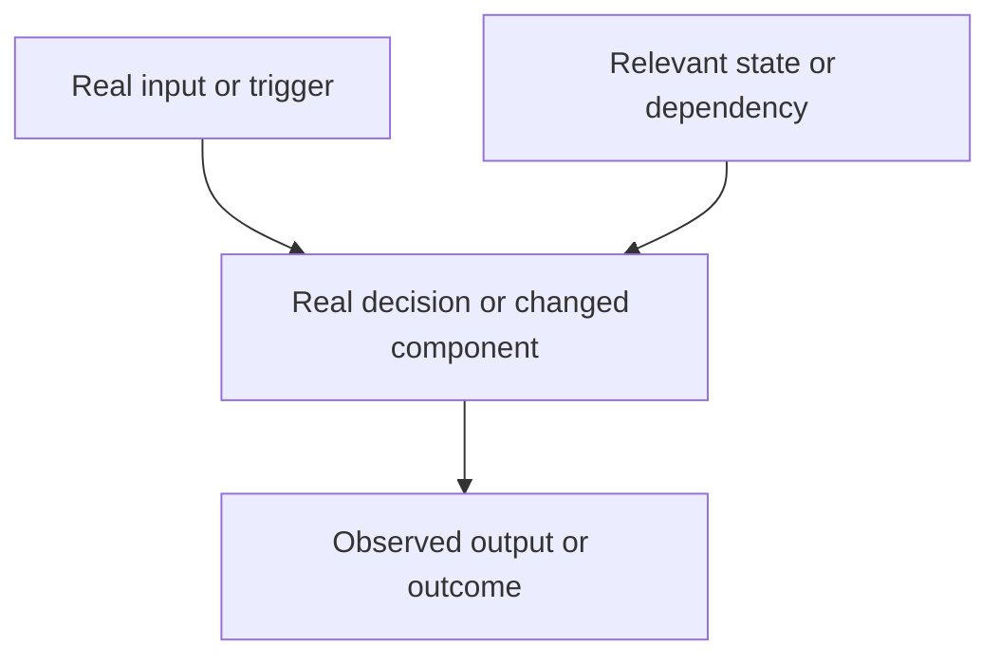

<!-- Tracking fields: associate this PR with its GitHub issue through the Development/linked-issue field. This is a field, not a body section. -->

## Summary

<!-- State what changed and why it matters. -->

## How this fits together

<!-- Required: describe the real runtime/data flow. Do not list changed files. Replace the placeholder graph with grounded nodes and edges. Avoid bloat: omit nodes and edges that do not change a reader's understanding of the flow. Use available space in both dimensions when the real flow permits it; do not default to a single chain. A horizontal row has a hard cap of four boxes, with three preferred; vertical depth has no hard cap. -->

## Affected behaviour

<!-- Describe changed behaviour, failure handling, compatibility, and deliberately unchanged behaviour. -->

## Verification

<!-- List exact commands or scenarios and observed results. Include Red-before-Green evidence when applicable. -->

## Dependencies and stack position

<!-- State the current base, predecessors, migrations, and incremental scope. -->

- Base:
- Predecessors:
- Dependencies:

## Review notes

<!-- List bounded risks, security/performance/compatibility concerns, and focused questions. -->

## Required delivery checks

- [ ] The linked issue exists and its Type is `Task` or `Bug`.
- [ ] New or updated tests defend the changed behavior or contract.
- [ ] The Mermaid diagram models the real flow and is not a file inventory.
- [ ] The PR's Development/linked-issue field associates it with the issue.
- [ ] The authenticated human uploader is the PR assignee.
