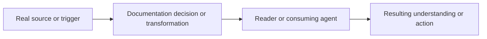

<!-- Tracking fields: associate this PR with its GitHub issue through the Development/linked-issue field. Add the PR and issue to project 82; set both project items to `In review` when the PR opens, and set this PR's Sprint field to the current sprint. These are fields, not body sections. -->

## Summary

<!-- State what documentation changed and why readers need it. -->

## How this fits together

<!-- Required: show the information flow, not a list of changed files. Replace the placeholder graph with the real source, editorial decision, reader, and outcome. -->

## Affected behaviour

<!-- State what guidance, reader experience, or documented contract changed and what remains unchanged. -->

## Verification

<!-- List exact link, rendering, generated-output, or scenario checks and observed results. -->

## Dependencies and stack position

<!-- State the current base, predecessors, source-of-truth documents, and incremental scope. -->

- Base:
- Predecessors:
- Dependencies:

## Review notes

<!-- List terminology, link, generated-content, or maintenance risks and focused questions. -->

## Required delivery checks

- [ ] The linked issue exists and its Type is `Task` or `Bug`.
- [ ] The Mermaid diagram shows the real documentation information flow and is not a file inventory.
- [ ] Documentation links, anchors, generated outputs, and examples were verified as applicable.
- [ ] The applicable `specs/` scope was updated with the correct disposition.
- [ ] Tests were added or updated for the changed documentation or process contract.
- [ ] The PR's Development/linked-issue field associates it with the issue.
- [ ] The PR and linked issue are in project 82 with status `In review`.
- [ ] The PR's Sprint field is set to the current sprint.
- [ ] The PR title ends with `#sdd` and the exact `AI-Workflow: CODA` label is applied.
- [ ] The authenticated human uploader is the PR assignee.
