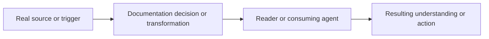

<!-- Tracking fields: associate this PR with its GitHub issue through the Development/linked-issue field. This is a field, not a body section. -->

## Summary

<!-- State what documentation changed and why readers need it. -->

## How this fits together

<!-- Required: show the information flow, not a list of changed files. Replace the placeholder graph with the real source, editorial decision, reader, and outcome. Avoid bloat: omit nodes and edges that do not change a reader's understanding of the flow. Diagrams with four or fewer boxes MUST use a horizontal layout. For more than four boxes, use available space in both dimensions when the real flow permits it; do not default to a single chain. Every horizontal row has a hard cap of four boxes, with three preferred; vertical depth has no hard cap. -->

## Affected behaviour

<!-- State what guidance, reader experience, or documented contract changed and what remains unchanged. -->

## Verification

<!-- List exact link, rendering, generated-output, or scenario checks and observed results. -->

## Dependencies and stack position

<!-- State the current base, predecessors, source-of-truth documents, and incremental scope. -->

- Base:
- Predecessors:
- Dependencies:

## Review notes

<!-- List terminology, link, generated-content, or maintenance risks and focused questions. -->

## Required delivery checks

- [ ] The linked issue exists and its Type is `Task` or `Bug`.
- [ ] The Mermaid diagram shows the real documentation information flow and is not a file inventory.
- [ ] Documentation links, anchors, generated outputs, and examples were verified as applicable.
- [ ] Tests were added or updated for the changed documentation or process contract.
- [ ] The PR's Development/linked-issue field associates it with the issue.
- [ ] The authenticated human uploader is the PR assignee.
