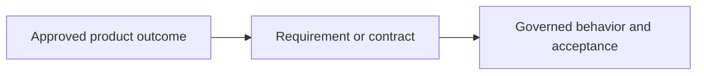

<!-- Tracking fields: associate this PR with its GitHub issue through the Development/linked-issue field. Add the PR and issue to project 82; set both project items to `In review` when the PR opens, and set this PR's Sprint field to the current sprint. These are fields, not body sections. -->

## Summary

<!-- State the durable product truth this specification establishes or clarifies. -->

## How this fits together

<!-- Required: show how requirements/contracts flow into governed behavior. Do not list changed files. -->

## Affected behaviour

<!-- State the scope package, coverage, terminology, requirements, contracts, decisions, and non-goals affected. -->

## Verification

<!-- Cite the independent spec-review verdict, scope/integrity checks, and resolved baseline or all-REFERENCE rationale. -->

## Dependencies and stack position

<!-- State the current base, predecessor spec PRs, imported contracts, and incremental scope. -->

- Base:
- Predecessors:
- Dependencies:

## Review notes

<!-- List terminology, inheritance, authority, duplication, and baseline risks. -->

## Required delivery checks

- [ ] The linked issue exists and its Type is `Task` or `Bug`.
- [ ] Every affected scope has exactly one CREATE, EXTEND, or REFERENCE disposition.
- [ ] Independent `spec-review` returned `APPROVE` for this exact draft.
- [ ] The Mermaid diagram shows requirement/contract flow into behavior.
- [ ] No implementation plan, task breakdown, ticket archive, or per-ticket acceptance definition was added to `specs/`.
- [ ] New or updated tests defend the specification contract.
- [ ] The PR's Development/linked-issue field associates it with the issue.
- [ ] The PR and linked issue are in project 82 with status `In review`.
- [ ] The PR's Sprint field is set to the current sprint.
- [ ] The authenticated human uploader is the PR assignee.
