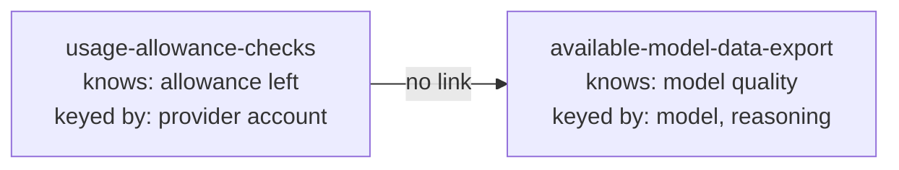
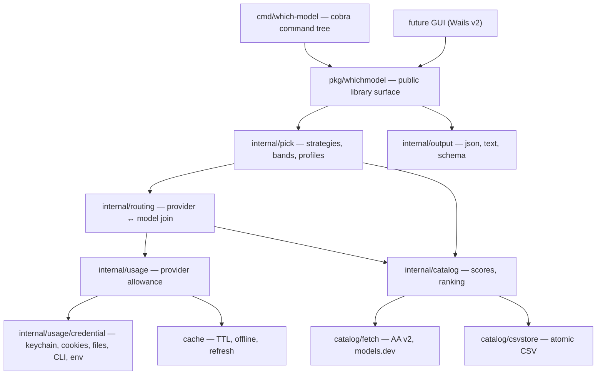

# WDM Model Picker — Implementation Plan

Merge the two prototypes in this repository into a single Go CLI — **`which-model`**, aliased `wm`, `wmodel`, `whichm` — that answers one question well:
**given this task, which exact model and reasoning effort should I dispatch to right now, on which provider, given what allowance is left?**
Neither prototype can answer that today. One knows what models are *good*; the other knows what allowance is *left*. Nothing joins them.

| Document | Contents |
| --- | --- |
| This file | Prototype review, language decision, architecture, the routing join, strategies and usage bands, the usage toggle, scoring methodology, milestones, risks |
| [Annex A](./annex-a-provider-matrix.md) | Provider port matrix (all 66 CodexBar providers), credential capabilities, fetch orchestration, error taxonomy |
| [Annex B](./annex-b-catalog-port.md) | Model-data pipeline and ranker port: collectors, decimal semantics, scoring, storage, routing join mechanics |
| [Annex C](./annex-c-agent-integration.md) | Agent skills, hooks, JSON Schemas, evidence format |
| [Annex D](./annex-d-cli-reference.md) | Complete command surface, config file, determinism contract, migration table |
| [`research/`](./research/) | Verbatim source surveys the plan is built on — treat as evidence, not prose |

Research evidence, gathered before any design decision:

- [`research/usage-allowance-checks-spec.md`](./research/usage-allowance-checks-spec.md) — function-by-function spec of prototype 1, including its security-invariant checklist.
- [`research/model-data-pipeline-spec.md`](./research/model-data-pipeline-spec.md) — reimplementation spec of prototype 2, with verbatim `PROFILES`, CSV headers, and scoring maths.
- [`research/codexbar-provider-survey.md`](./research/codexbar-provider-survey.md) — per-provider auth/endpoint/unit/window survey of CodexBar's providers. Note: this survey states 68 registry cases; the primary source has **66** (`Providers.swift:6-71`). Annex A corrects it.

---

## 1. Prototype review

### 1.1 `usage-allowance-checks/` — Node, 3 providers

Read-only allowance reporting for Claude, Codex, and GitHub Copilot. Entry scripts in `scripts/`, shared logic in `lib/core.mjs` (293 lines), one module per provider.

**What is genuinely good, and must survive the port.** This prototype's value is not its provider coverage — it is its security discipline, which is unusually rigorous for a credential-reading tool:

- Every outbound URL is checked against an **exact string allow-list** (`validateExactHttpsUrl`, `lib/core.mjs:76-91`). Not prefix matching, not origin matching. A near-miss typo domain is rejected.
- **Redirects are never followed.** `redirect: 'manual'` on every request, and any 3xx is a hard `redirect_refused` failure (`lib/core.mjs:146-190`). This matters because these are bearer-token requests to private endpoints.
- **Bodies are bounded before parsing** — 1 MiB for credential files, 256 KiB for responses — checked via both `content-length` and actual byte count, so a lying header does not help (`lib/core.mjs:118-144`).
- **No secret ever reaches an error message.** Every catch block discards the underlying error and substitutes a fixed string. The test suite asserts this with a canary token across 17 cases.
- The Codex configured-base-url fallback requires an **exact, per-invocation, bare-origin opt-in** (`--trust-configured-origin`) and only fires on a closed status set `{404, 405, 410, 501}` — never on 401/403/429 (`lib/codex.mjs:17`, `lib/core.mjs:93-116`). A compromised local `config.toml` cannot silently exfiltrate the token.
- Copilot performs a **mandatory identity gate** (`GET /user`) before the private `copilot_internal/user` endpoint is ever touched, for both discovered and freshly-minted tokens.
- File permissions broader than `0600` produce a **warning, never auto-remediation**.

**What limits it.** Three providers. Node runtime dependency. Text-only output, so an orchestrator must scrape prose to get a number. No caching, so it cannot be called on every dispatch. No concept of a model — it reports allowance and stops.

### 1.2 `available-model-data-export/` — Python, data pipeline + ranker

A nightly GitHub Action scrapes Artificial Analysis v2 and models.dev into `available_model_raw_values.csv` (175 rows), normalizes it into `available_model_scores.csv` (39 rows), and `rank_models.py` ranks `(model, reasoning)` rows against one of 11 task profiles.

**What is genuinely good.**

- **Two-tier scoring with a hard floor.** Tier 1 (`intelligence`, `cost`, `speed`) is mandatory in every profile; a row missing any of the three is **excluded, never imputed** (`rank_models.py:371-376`). Tier 2 category composites are optional and their absence produces a warning, not a zero. This is the right call — a zero would silently sink a good model.
- **Evidence thresholds.** A category composite needs `CATEGORY_MINIMUM_EVIDENCE` populated independent benchmarks or it is left blank. One benchmark is too fragile to be a task signal.
- **No double-counting.** `planning_capability_score` is a fixed 40/30/20/10 blend of reasoning, knowledge, agentic tools, and research; the `orchestration` profile therefore weights *it* plus independent instruction-following, and deliberately does not re-weight the components.
- **Availability is the last filter.** Every complete row is scored first, then rows the target harness did not expose are removed (`rank_models.py:434-450`). The comment says this ordering is deliberate, and it is right: it means the excluded list tells you what you *would* have picked.
- **Exact arithmetic.** `decimal.Decimal` with `ROUND_HALF_UP` throughout, never float. The AA API is even parsed with `parse_float=Decimal`.
- **Transactional writes.** Temp file, fsync, compare-and-swap against the bytes read, timestamped `.bak`, then atomic rename.
- 113 tests pinning strict TOML rejection, single-unauthenticated-request guarantees, redirect rejection, and the 403-only free-endpoint fallback.

**What limits it.** Python + a checked-in CSV. The `--available` flag is the only link to reality, and it is a text file the caller must produce by hand from some other tool's picker. There is **no provider dimension at all** — a score row is `(model, reasoning)`, with no idea which provider serves it or what that provider's allowance looks like. Cost is a static USD-per-task prior, not "you have 4% of your weekly Opus quota left".

### 1.3 The gap between them



The missing artifact is a **route**: `(provider, provider-native model id) -> (catalog model, reasoning)`. Build that, and usage-aware model selection falls out. Skip it, and the two halves stay bolted together rather than merged. Section 4 designs it.

### 1.4 CodexBar as the provider reference

`/Users/will/Projects/Software/CodexBar` — MIT licensed (Peter Steinberger), ~242k lines of Swift, **66 provider descriptors** registered in `Sources/CodexBarCore/Providers/ProviderDescriptor.swift:125-192`. It is the most complete map of how to read AI-provider usage that exists, and MIT means we can port from it with attribution.

Two lessons taken, one anti-lesson rejected:

- **Take:** the descriptor-registry shape (`ProviderDescriptor` with metadata + fetch plan + CLI config), and the `primary`/`secondary`/`tertiary` + `extraRateWindows` lane model.
- **Take:** the source-priority idea. Claude alone has five acquisition paths (`auto | api | oauth | web | cli`), and a provider with both an API-key console *and* a subscription plan gets **two registry entries** — `.openai` (platform billing) is never conflated with `.codex` (ChatGPT subscription).
- **Reject:** `UsageSnapshot` has grown roughly 25 provider-specific optional payload fields (`kiroUsage`, `ampUsage`, `zaiUsage`, `minimaxUsage`, …, `UsageFetcher.swift:143-183`). Every new provider widens a type that every consumer must handle. Our `Snapshot` carries a generic `[]Window` keyed by stable slug, and nothing else. Section 3.2.

CodexBar also already ships a CLI (`Sources/CodexBarCLI/CLIUsageCommand.swift`, 800 lines, with `--json`). Shelling out to it was considered and rejected: it is macOS-only, requires the app bundle, and would make `which-model` a wrapper around someone else's release cadence for its most load-bearing data. We port the adapters we need.

---

## 2. Language: Go

**Decision: Go.** The GUI comes later and must not drive this choice, but it is accounted for below.

The workload is the argument. `which-model pick` must fan out to N providers, each a bounded HTTPS request with its own timeout, credential source, and failure mode, then join the results against a scored CSV and rank. That is I/O-concurrency with per-task deadlines and partial failure — the exact shape `errgroup` + `context` was built for.

The provider adapters need a specific and slightly unusual capability set. Scored against real, verifiable libraries:

| Capability | Providers needing it | Go |
| --- | --- | --- |
| Browser cookie extraction (Chromium AES-GCM, Safari `binarycookies`, Firefox) | ~25 (Cursor, Windsurf, Z.ai, Kimi, MiniMax, Perplexity, Mistral, Abacus, …) | `browserutils/kooky` — verified: reads Chrome/Chromium/Firefox/Safari stores and handles macOS Keychain-derived decryption keys |
| macOS Keychain (generic + internet password) | Claude (`Claude Code-credentials`), Zed (`zed.dev`) | `zalando/go-keyring`, or direct `Security.framework` via cgo for the internet-password class |
| Subprocess JSON-RPC over stdio | Codex (`codex app-server`), Grok (`grok agent stdio`) | `os/exec` + `encoding/json` streaming. Stdlib. |
| AWS SigV4 | Bedrock (Cost Explorer + CloudWatch) | `aws/aws-sdk-go-v2/aws/signer/v4` |
| OAuth device flow + refresh grants | Copilot, Codex, Claude, Gemini, Antigravity, VertexAI | `net/http` + `golang.org/x/oauth2` |
| Protobuf / gRPC-Web / Connect-RPC | Windsurf (raw protobuf), Grok (gRPC-Web), Kimi + Manus (Connect-RPC) | `google.golang.org/protobuf`, `connectrpc.com/connect` |
| Exact decimal with `ROUND_HALF_UP` | Entire scoring pipeline | `shopspring/decimal` |
| Single static binary, cross-compiled | Distribution to agents and CI | `GOOS`/`GOARCH`, no runtime, no cgo for the core |

Rust would match Go on correctness and beat it on the protobuf/crypto work, but its browser-cookie and keychain story is materially thinner, cross-compilation is fussier, and — the deciding factor — this codebase will be edited heavily by AI agents. Go's small surface means agents produce correct Go far more reliably than correct Rust. TypeScript is the fastest port (prototype 1 is already `.mjs`) but gives up the single-binary story, needs `decimal.js` for arithmetic the pipeline depends on, and is the weakest of the three at 30-way concurrent fan-out with per-task deadlines.

**On the later GUI.** `pkg/whichmodel/` is a stable library surface; the CLI in `cmd/which-model/` is a thin shell over it. A GUI consumes the same library, no subprocess, no re-implementation. **Wails v2** is the recommended shell — stable, ships a native webview, cross-platform. Wails v3 is still alpha as of 2026 and MUST NOT be committed to yet. If the GUI turns out to want a macOS menu-bar presence like CodexBar, `getlantern/systray` over the same library is the cheaper path than a full window.

The one scenario that would overturn this: if the GUI becomes the *primary* artifact and the CLI an afterthought, Rust + Tauri is the better long-term pairing. That is not the stated direction, so Go it is.

---

## 3. Architecture

### 3.1 Layers



Dependency rule: `pick -> routing -> {usage, catalog}`, never upward. `usage` and `catalog` do not know about each other; `routing` is the only place they meet. This keeps the two prototype domains independently testable, which is how they arrived.

### 3.2 The canonical usage type

One generic window type, no provider-specific fields. This is the single most important structural departure from CodexBar.

```go
type Unit string

const (
    UnitPercent   Unit = "percent"
    UnitTokens    Unit = "tokens"
    UnitCredits   Unit = "credits"
    UnitUSD       Unit = "usd"
    UnitRequests  Unit = "requests"
    UnitEnergyKWh Unit = "kwh"
    UnitNone      Unit = "none"
)

// Window is one quota lane. Provider-specific richness is expressed by
// declaring more Windows with distinct IDs, never by widening this struct.
type Window struct {
    ID            string     `json:"id"`             // stable slug: "5h", "weekly", "premium", "opus_7d"
    Label         string     `json:"label"`
    Unit          Unit       `json:"unit"`
    UsedPercent   *float64   `json:"used_percent,omitempty"` // canonical 0..100+; may exceed 100 when over quota
    Used          *float64   `json:"used,omitempty"`
    Limit         *float64   `json:"limit,omitempty"`
    Remaining     *float64   `json:"remaining,omitempty"`
    Unlimited     bool       `json:"unlimited,omitempty"`
    WindowMinutes *int       `json:"window_minutes,omitempty"`
    ResetsAt      *time.Time `json:"resets_at,omitempty"`
    ResetHint     string     `json:"reset_hint,omitempty"`  // free-text reset phrase from CLI scrapes
    ModelScope    []string   `json:"model_scope,omitempty"` // per-model sub-limit scoping
    Synthetic     bool       `json:"synthetic,omitempty"`   // synthesized placeholder, not a real 0% lane
    UsageKnown    bool       `json:"usage_known"`           // false = reset metadata known, usage is not
}

type Snapshot struct {
    Provider   string    `json:"provider"`
    Account    string    `json:"account,omitempty"` // opaque label; identity only with --show-identity
    Plan       string    `json:"plan,omitempty"`
    Windows    []Window  `json:"windows"`
    FetchedAt  time.Time `json:"fetched_at"`
    Source     Source    `json:"source"`     // oauth | api | cli | web | local | cache
    Confidence string    `json:"confidence"` // live | cached | estimated
    Stale      bool      `json:"stale,omitempty"`
    Failure    *Failure  `json:"error,omitempty"` // set instead of aborting the batch
}

type Failure struct {
    Code    string `json:"code"`    // stable machine code; prototype 1's codes reused verbatim
    Message string `json:"message"` // sanitized; MUST NEVER contain credential material
}
```

`Synthetic` and `UsageKnown` are carried over deliberately. Both encode a real distinction the naive model gets wrong: Claude web reports a null `five_hour` session that must not be rendered as a genuine 0% window (`UsageFetcher.swift:16-20`), and several providers expose reset metadata before real usage numbers. Collapsing either into "0% used" would make a exhausted provider look idle.

### 3.3 Security invariants

Inherited **verbatim** from [`research/usage-allowance-checks-spec.md` §9](./research/usage-allowance-checks-spec.md) and non-negotiable. The full checklist lives there; the load-bearing ones:

1. Exact HTTPS endpoint allow-lists. No prefix or origin matching.
2. `redirect: manual` equivalent — hard-fail every 3xx.
3. Bounded bodies: 1 MiB credentials, 256 KiB responses, checked twice.
4. Opaque-token validation: length-bounded, single-line, no control characters.
5. **No credential material in any error, log, or output.** Ported with the canary-token test.
6. Permission warnings, never auto-remediation.
7. Identity display is opt-in (`--show-identity`) only.
8. Configured-fallback origins require exact, per-invocation, bare-origin trust.
9. No background polling unless explicitly started (`which-model serve`).

Item 5 gets wider as provider count grows — 25 cookie-scraping adapters is 25 new ways to leak a session cookie into a log line. The canary test MUST run against every adapter, not just the three ported ones.

---

## 4. The routing join

The new artifact, and the reason this is a merge rather than two subcommands in one binary.

### 4.1 Shape

```go
type Route struct {
    Provider  string   // usage provider id, e.g. "claude"
    ModelID   string   // provider-native id, e.g. "claude-opus-4-5-20251101"
    Model     string   // catalog display name, joins ScoreRow.Model
    Reasoning string   // joins ScoreRow.Reasoning
    WindowIDs []string // which usage windows gate this route
}
```

`WindowIDs` is what makes this more than a lookup table. Dispatching Opus on a Claude subscription is gated by the 5-hour window **and** the seven-day window **and** the Opus-scoped seven-day window; dispatching Sonnet is not gated by the Opus lane. Per-model sub-limits are real and already present across Codex `additional_rate_limits`, Claude `sevenDayOpus`/`sevenDaySonnet`, Gemini's Pro/Flash/Flash-Lite tiers, and MiniMax `services[]`. A router that ignores them will happily recommend a model whose specific quota is exhausted while the account looks 20% used.

### 4.2 Where routes come from

Three sources, in descending trust:

1. **Live provider model lists** — the provider's own model enumeration, filtered by `providers.toml` `excluded_models`. Highest trust: the provider told us.
2. **models.dev per-provider catalogue** (`https://models.dev/api.json`) — already consumed by `get_provider_models.py`, already keyed by provider, already carries `reasoning_options[].values` for effort levels. This is the seed and it is most of the work.
3. **User-declared routes** in config, for self-hosted gateways (LiteLLM, LLMProxy, Sub2API) where no discoverable catalogue exists.

Matching a catalog display name to a provider-native id **MUST fail loud**. An ambiguous or absent match yields a warning and an unrouted score row, never a guess. This preserves the rule the existing skill already states: *"never silently substitute another model, effort, provider, or harness."* Annex B specifies the matching and persistence mechanics.

### 4.3 Availability becomes first-class

`rank_models.py --available` takes a hand-written text file of `model|reasoning` lines. That mechanism is right — the harness is the only authority on what it will actually accept — but it is manual. Under `which-model`, the route store *is* the availability set, refreshed by `which-model routes refresh` and verifiable by `which-model routes verify`. `--available` survives as an override for harnesses `which-model` cannot introspect, with identical semantics.

---

## 5. Selection: strategies and usage bands

### 5.1 Pressure

Every strategy needs one scalar per candidate describing how constrained its provider is.

```
pressure(route) = max( UsedPercent(w) for w in windows(route.Provider) if w.ID in route.WindowIDs )
```

`max`, not mean: the binding constraint is what stops you. A weekly lane at 90% with a 5-hour lane at 10% is a 90%-constrained route.

Deriving `UsedPercent` for non-percent units:

| Available fields | `UsedPercent` |
| --- | --- |
| `UsedPercent` | as reported (may exceed 100) |
| `Used` + `Limit` | `Used / Limit * 100` |
| `Remaining` + `Limit` | `(Limit - Remaining) / Limit * 100` |
| `Unlimited` | `0` |
| balance only, no limit | **unknown** — a balance is not a proportion |

That last row is an honest limitation, not an oversight. OpenRouter reports `total_credits - total_usage` in USD with no entitlement, so "percent consumed" is undefined. Such providers get `pressure = unknown` and are handled by policy (§5.3), not by inventing a denominator.

### 5.2 Bands

```toml
[bands]
direction = "spread"            # "spread" | "drain"
gate_above_used_percent = 98    # hard exclusion, distinct from weighting
unknown_pressure_weight = 0.90  # applied when pressure is unknown

[[bands.tier]]
name = "low"
upper_used_percent = 25
weight = 1.00

[[bands.tier]]
name = "standard"
upper_used_percent = 50
weight = 0.85

[[bands.tier]]
name = "elevated"
upper_used_percent = 75
weight = 0.60

[[bands.tier]]
name = "critical"
upper_used_percent = 100
weight = 0.25
```

A route's band is the first tier (ascending `upper_used_percent`) whose bound is `>= pressure`. Pressure above the last bound clamps to the last tier.

```
FinalScore = ModelScore × BandWeight × ProviderWeight
```

`ModelScore` is 0–100 from the profile ranking (unchanged from `rank_models.py`). `ProviderWeight` is a static per-provider multiplier from config — the explicit priority-ranking knob.

**On `direction`, and one thing worth confirming.** The brief says *"if provider x usage is above 75% its weighted higer, above 50% its standard, 25% and its low"*. The band ladder above matches that structure exactly — four tiers at 25/50/75/100. The direction of the top band is the open question, because both readings are coherent:

- **`spread`** (the default above) — high consumption *lowers* weight, pushing traffic to providers with headroom. This is what a multi-provider router normally wants: don't exhaust any single allowance.
- **`drain`** — high consumption *raises* weight. Rational under "use it or lose it": a subscription allowance that resets unused is wasted, so prefer the provider you have already committed to.

`direction = "drain"` reverses the weight assignment across tiers — tier *N* takes `weight[len-1-N]` — so the same ladder yields `critical = 1.00, elevated = 0.85, standard = 0.60, low = 0.25`. Precise, testable, and a one-line config change either way. **Settled: both ship, `spread` is the default.** Both MUST be covered by tests against fixture snapshots (§6.4), so neither is a second-class path. Nothing else in the design depends on which is chosen.

### 5.3 Unknown and missing usage

Neither prototype confronts this, and it decides real picks. Policy:

| Situation | Behaviour |
| --- | --- |
| Provider has no usage API at all (JetBrains, Azure OpenAI) | `pressure = unknown` → `unknown_pressure_weight`, warning emitted |
| Fetch failed this run | `Snapshot.Failure` set, `pressure = unknown`, warning; batch continues |
| Cache hit within TTL | `Confidence = cached`, full weight, `FetchedAt` age reported |
| Cache stale, `--offline` | `Stale = true`, `Confidence = cached`, warning |
| `--require-live` set | Any non-`live` confidence **excludes** the route |

Default is neutral-with-a-warning rather than optimistic or exclusionary. Treating unknown usage as 0% would make every unmeasurable provider outrank every measured one — the worst possible failure mode for a router.

### 5.4 Strategies

| Strategy | Deterministic | State | Rule |
| --- | --- | --- | --- |
| `score` | yes | — | Max `FinalScore`, then the existing 7-key tie-break |
| `priority` | yes | — | Providers in configured `priority` order; first provider with any eligible candidate wins, max `FinalScore` within it |
| `least-used` | yes | — | Min `pressure`; ties broken by `FinalScore` |
| `round-robin` | no | cursor | Rotate provider order by persisted cursor, take first eligible, advance |
| `weighted-random` | with `--seed` | — | Sample provider ∝ `FinalScore` |
| `cost-optimal` | yes | — | Among candidates within `--score-tolerance` (default 5) of the top `FinalScore`, take the best cost score |

`score` is the default and is a pure function of (scores, usage snapshot, config) — identical inputs give identical output, which is what makes agent behaviour reproducible and reviewable.

`round-robin` is the only stateful strategy and needs care: many agents may call `which-model pick` concurrently. The cursor lives in a state file guarded by an advisory file lock, with read-modify-write under the lock so two simultaneous picks get different providers rather than the same one. Annex D specifies the file, the lock, and contention behaviour.

`weighted-random` without `--seed` is non-reproducible and MUST warn, because an agent recording evidence for an unseeded random pick is recording something nobody can re-derive.

---

## 6. Usage toggle: off must mean off

The usage subsystem reads macOS Keychain entries, browser cookie databases, OAuth token files, and shells out to provider CLIs. Some users and organisations will not accept a binary that *can* do that, whatever its configuration says. So "off" is specified at three levels, and the strongest one is a guarantee rather than a promise.

| Level | Mechanism | Guarantee |
| --- | --- | --- |
| **L0** per-invocation | `--no-usage` | This run performs no provider network calls, no credential reads, and no usage-cache reads or writes. Existing cache is left intact, not invalidated |
| **L1** configured | `[usage] enabled = false` | Every run ignores usage. `which-model usage` and `which-model auth` refuse with exit `2`, naming the key that disabled them. Usage packages are linked but never invoked |
| **L2** compiled out | `go build -tags nousage` | The usage subsystem is not linked. No credential resolver, cookie reader, keychain call, or provider endpoint constant exists in the binary. `which-model usage` and `which-model auth` are not registered at all — absent, not present-and-refusing |

L2 exists because it is auditable. A reviewer can confirm provider endpoint constants are absent from the binary and that the cookie and keychain modules are not linked dependencies. Under `nousage` the provider registry is empty **by construction** — no `init()` self-registration runs — rather than filtered at runtime, which is the difference between "cannot" and "chooses not to".

### 6.1 Three-state configuration

```toml
[usage]
enabled = "auto"   # "auto" (default) | true | false
```

- `false` — hard off, as above.
- `true` — required. If zero providers are enabled, `which-model pick` fails with exit `2` rather than silently degrading. The user asked for usage; a misconfiguration should be loud.
- `auto` — **default.** Enabled if and only if at least one `[providers.<id>]` table has `enabled = true`.

`auto` is what makes a fresh install harmless: it is a pure model picker until someone opts a provider in.

### 6.2 Provider default-deny — a correction

The earlier draft of Annex D had unlisted providers defaulting to `enabled = true`, which meant a fresh install would try to poll all 66 providers and read every credential store on the machine. That is wrong and is corrected: **unlisted providers default to `enabled = false`.**

`which-model` MUST NOT read a credential file, query a Keychain item, open a browser cookie database, or shell out to a provider CLI for any provider not explicitly enabled. Enablement is opt-in, per provider, always. A related implementation constraint: `--no-usage` MUST short-circuit *before* credential resolution, not after, so the disabled path cannot trigger a macOS Keychain authorisation prompt.

### 6.3 Degraded mode

With usage off at any level, `which-model pick` degrades to **exactly** the behaviour of `rank_models.py` — pure profile-based score ranking. That is a well-defined, already-tested target, not a new code path, which is why it is cheap to guarantee.

- `BandWeight = 1.0` for every candidate; `[bands]` and `gate_above_used_percent` are inert.
- `ProviderWeight` **still applies** — it is static user preference, unrelated to consumption.
- **Routing survives; banding does not.** Routing answers "which providers can serve this model" (availability). Banding answers "how much allowance is left" (consumption). Turning off usage kills consumption-awareness only, so `--provider` and `--exclude-provider` keep working.
- Route derivation falls back to unauthenticated sources only — models.dev and user-declared routes. The credentialed live-provider-model-list source is skipped without being attempted, with exactly one warning naming the reduced source set.
- Every JSON output carries `usage_enabled: false` and `usage_disabled_reason` (`flag` | `config` | `compiled_out` | `no_providers_enabled`), so a consumer can never mistake a degraded pick for a usage-aware one.
- Unknown-usage warnings are **suppressed** in degraded mode. They are noise when usage was deliberately disabled; emitting one per candidate would make the default install unusable.

One trap worth naming explicitly for agent consumers: because routing survives, a degraded pick still carries a provider name. **A provider-attributed pick is not evidence of usage-awareness.** Check `usage_enabled`.

### 6.4 Strategy availability

| Strategy | Degraded | Behaviour |
| --- | --- | --- |
| `score` | works | Unchanged. Default |
| `priority` | works | Static config priority; "first provider with capacity" becomes "first provider with any routed candidate" |
| `round-robin` | works | Rotates providers without consumption data — legitimate load-spreading without telemetry. Still advances persisted cursor state, so it remains the one stateful strategy either way |
| `weighted-random` | works | Samples proportional to `FinalScore`, now the pure model score |
| `cost-optimal` | works | Cost is a static catalog metric, not usage-derived |
| `least-used` | **refused** | Requires consumption data by definition. Exits `2` naming the toggle that disabled usage. **Never** silently falls back to `score` |

`least-used` is the only casualty. Degraded `pick` is also *more* deterministic than the enabled path — a pure function of (scores, config) with no network or cache dependency — and MUST be byte-reproducible from the same scores CSV.

---

## 7. Scoring methodology: pluggable, and currently suspect

The ported scoring maths reproduces `generate_scores.py` exactly, because M1 needs byte-for-byte equivalence to prove the port. But the method itself does not survive scrutiny, and the plan should say so rather than enshrine it.

### 7.1 What is wrong with min-max to 0–100

1. **It destroys absolute meaning.** `benchmark:SWE-Bench Verified = 91` in the scores CSV does not mean a 91% pass rate. It means "91% of the way between the worst and best model in this dataset." The raw CSV held the real 96.0% and normalization discarded it. Two very different quantities that render identically.
2. **Scores are not stable across refreshes.** Min and max are dataset properties, so adding one cheap model shifts every other model's cost score. Yesterday's 80 and today's 80 are not comparable — corrosive for a tool whose purpose is recording defensible evidence.
3. **It manufactures signal from noise.** Exactly one 0 and one 100 exist per metric regardless of real spread. If every model sits within 2%, that 2% is stretched across the full range; if the spread is huge, it is compressed.
4. **Cost and latency are log-distributed.** Cost per task spans an order of magnitude in the current data ($0.22 to $2.34+). Linear normalization of an order-of-magnitude quantity clusters almost everything at one end. The committed CSV already shows the symptom: the most expensive model scores exactly `0`.
5. **Outliers dominate.** One absurd value at either end compresses all 38 other rows. With 39 rows there is no robustness margin.
6. **Weighted arithmetic mean permits compensation.** A great score papers over a catastrophic one. For "must be good at X *and* Y" semantics — which is what most profiles actually mean — geometric aggregation is more faithful. This is a real modelling choice, not a detail.
7. **The 1–5 weight scale is ordinal in users' heads and ratio in the maths.** Weights feed a weighted mean, so `cost=5, intelligence=1` silently means "five times the weight", usually more extreme than the user intended. The scale has no documented semantics.

### 7.2 Both absolute and relative

**Decision: the scores artifact carries both, in distinctly named columns.** Absolute native values keep their meaning and stay stable across data vintages; relative scores keep the cross-metric commensurability that ranking needs. Nothing is discarded, and a reader can always tell which is which. Annex B specifies the column naming and the migration.

### 7.3 Pluggable normalization and aggregation

Scoring gets two strategy interfaces, both selectable by config and flag, both recorded in `which-model explain` evidence so a score can always be traced to the method that produced it:

- **Normalizer** — raw metric to comparable score.
- **Aggregator** — component scores to a composite.

`minmax-linear` and `weighted-arithmetic-mean` ship as the defaults, reproducing today's output exactly. Everything else is added behind the same interface without disturbing that baseline.

### 7.4 Research track

This is a multi-criteria decision analysis problem, so there is substantial prior art to draw on rather than invent. Candidates to evaluate, with what each buys:

| Candidate | Addresses |
| --- | --- |
| Winsorization / clipping at p5–p95 before min-max | Outlier domination (5). Cheapest meaningful fix |
| Log transform before normalization | Log-distributed cost and latency (4) |
| Robust scaling (median / IQR) | Outliers (5) without discarding magnitude |
| Quantile / percentile rank | Stability (2) and distribution-freedom; interpretable as "top decile"; discards magnitude of difference |
| Z-score standardization | Range-independence; unbounded and assumes normality |
| Anchored / absolute scales | Meaning (1) and cross-vintage stability (2) |
| Bayesian shrinkage toward the population mean | Sparse-evidence composites more gracefully than today's blank-or-average-two-values `CATEGORY_MINIMUM_EVIDENCE` rule |
| Item Response Theory | Combining benchmarks of differing difficulty and discriminating power — the statistically principled answer, and the most expensive |
| Geometric mean / weighted product model | Compensation (6) |
| TOPSIS | Distance-to-ideal aggregation, standard MCDA |
| AHP pairwise comparison with consistency ratio | Weight elicitation (7): derives ratio weights from pairwise judgements and reports whether the user's judgements are self-consistent |
| Normalized simplex weights (sum to 1) | Weight semantics (7) with far clearer meaning than 1–5 |

The research runs as a **parallel track**, not a blocking spike. Sequencing: build behind the interface with min-max as default so M1's equivalence proof stands, then add strategies and change the default deliberately, with a documented migration and a differential report showing which rankings move and why. Deliverables are a written evaluation against the real 39-row artifact, recommended defaults, and the weight-scale recommendation.

### 7.5 Catalog data lifecycle

The score artifact is produced in **two stages**, and they have very different costs. The existing Python pipeline already separates them; the CLI surfaces that separation instead of hiding it.

| Stage | Input | Output | Needs AA API key | Network |
| --- | --- | --- | --- | --- |
| **Collect** | Artificial Analysis v2 + models.dev | `available_model_raw_values.csv` | **yes** | yes |
| **Derive** | raw CSV + `benchmarks.toml` + active `Normalizer`/`Aggregator` | `available_model_scores.csv` | no | **no** |

Flags map onto the stages directly:

| Flag | Stages |
| --- | --- |
| `--refresh-benchmarks` | Collect |
| `--refresh-scores` | Derive |
| `--refresh-usage` | neither — provider usage snapshots |
| `--refresh` | everything |

That Derive needs **neither a key nor network** is the load-bearing detail. It means editing `benchmarks.toml` — adding a benchmark group, changing an evidence threshold — costs one local, offline, byte-reproducible rebuild. It also means the R1 research track (§7.4) can evaluate every candidate normalizer against the committed raw data with no API budget at all.

Two rules keep the stages honest:

- **Collect before Derive, never the reverse.** Derive consumes Collect's output.
- **`--refresh-benchmarks` does not imply `--refresh-scores`.** Inspecting raw data before rebuilding is a legitimate workflow. But raw and scores are then out of step, so the scores artifact records the content hash of the raw CSV it came from, and a mismatch at read time warns. Same mechanism as the route-table staleness check (Annex B §7.2) rather than a second invented one.

### 7.6 Distribution: scheduled and on-demand, both

These are not alternatives. Both ship, and they serve different people.

**Scheduled** — a generated GitHub Action runs `catalog refresh` (Collect then Derive — it holds the AA key as a repo secret; usage refresh is deliberately excluded since CI has no provider credentials), and on a real change opens a PR per configured branch with auto-merge enabled, or pushes directly where branch protection is absent. `branches` is a list, processed in order, with failures isolated per branch. Configured under `[catalog.publish]`: schedule, timezone, branches, mode, merge method, labels, test gate.

The workflow YAML is **generated** by `which-model catalog workflow --write`, because GitHub Actions requires `on.schedule` to be literal YAML and cannot read a cron expression from config at trigger time. `--check` verifies the committed workflow still matches config and exits non-zero on drift, which makes it a usable CI lint. `enabled = false` emits nothing and removes an existing workflow — a user who wants only on-demand refresh gets no scheduled Action at all.

**On-demand** — the refresh flags above, usable from `catalog` or inline on `pick`.

They compose: the Action keeps the committed artifact current so `pick` is fast, offline-capable, and zero-config for consumers; the flags let anyone with a key get ahead of the schedule without waiting for it.

One consequence worth stating plainly: **Collect requires the AA API key**, so a consumer without one relies on the artifact the Action commits. Derive still works for them — they can re-score the committed raw data under different weights or normalizers, offline, with no key. If key-less consumers should also be able to pull *newer* data on demand, that needs a published-artifact fetch, which is deliberately not in this plan and is listed as an open decision.

---

## 8. Milestones

Each milestone ends with something runnable. No milestone is "scaffolding".

**M1 — Skeleton and catalog port.** Go module, cobra tree, config loading, `internal/catalog` with the AA v2 and models.dev collectors, atomic CSV store, and the ranker with all 11 profiles. Both refresh stages land separately per §7.5 — `--refresh-benchmarks` (Collect) and `--refresh-scores` (Derive) — with the raw-CSV provenance hash and its staleness warning. Scoring goes in behind the `Normalizer`/`Aggregator` interfaces from §7.3, with `minmax-linear` and `weighted-arithmetic-mean` as defaults; the interfaces are cheap now and expensive to retrofit later. Dual absolute/relative columns per §7.2. The 113 Python tests ported. *Done when* `which-model catalog refresh && which-model pick --profile balanced_implementation --json` reproduces `rank_models.py` output byte-for-byte on the committed CSV; the same holds under `go build -tags nousage`; and `--refresh-scores` is proven to make zero network calls.

**M2 — Usage core and Tier 1 providers.** `internal/usage` with the descriptor registry, credential resolvers, cache, and concurrent fetch. Tier 1 adapters ported, starting with the three the prototype already covers so behaviour can be diffed. Security invariants ported with the canary test. *Done when* `which-model usage --all --json` returns live snapshots and the ported Claude/Codex/Copilot adapters match the Node scripts' values.

**M3 — Routing join.** `internal/routing`, route derivation from models.dev plus provider model lists, persistence, `which-model routes` subcommands, and `WindowIDs` binding for per-model sub-limits. *Done when* `which-model routes verify` reports coverage and unrouted score rows are listed rather than silently dropped.

**M4 — Strategies, bands, and the usage toggle.** Pressure derivation, band evaluation, all six strategies, the state file and lock, `which-model explain`. The §6 toggle lands here in full: `--no-usage`, `[usage] enabled` three-state resolution, provider default-deny, the `nousage` build tag with its stub surface, and degraded-mode semantics. *Done when* each strategy is verified against fixture snapshots, concurrent `round-robin` picks provably rotate, `least-used` refuses under every disabled level, and a `nousage` binary is audited to contain no provider endpoint constants.

**M5 — Provider breadth.** Tier 2 adapters and the shared credential machinery they need most — browser cookie extraction, keychain, subprocess RPC. *Done when* the capability matrix in Annex A is implemented and each adapter has a golden-file fixture test.

**M6 — Agent integration and publishing.** The three skills, the hooks, JSON Schemas, `which-model schema`, completions, man pages, and the alias symlinks. Publishing lands here per §7.6: `which-model catalog workflow --write/--check`, `[catalog.publish]` config, multi-branch PR-with-auto-merge and direct-push modes, and the migrated Go workflow. Legacy skills deleted, not aliased. *Done when* an agent can complete a dispatch using only the skills, the generated workflow refreshes data on Go and opens an auto-merging PR per configured branch, and `catalog workflow --check` fails on drift.

M1 and M2 are independent and MAY run in parallel; M3 needs both. The §7.4 scoring research runs as a parallel track throughout, landing strategies behind the M1 interfaces as they are evaluated — it gates no milestone.

**R1 — Scoring methodology research (parallel).** Evaluate the §7.4 candidates against the real 39-row artifact. *Done when* there is a written evaluation with a differential report showing which rankings move under each candidate and why, a recommended default normalizer and aggregator, and a weight-scale recommendation. Changing the shipped default is a separate, deliberate decision informed by that report — never a silent swap.

---

## 9. Risks

| Risk | Why it matters | Mitigation |
| --- | --- | --- |
| **Private-endpoint drift** | Almost every usage endpoint is undocumented. CodexBar's own comments record churn: StepFun runs two billing models side by side, LongCat's field names are unknowable from a minified bundle, Codex tolerates both snake and camel casing from key churn | Golden-file fixtures per adapter; tolerant key decoding; shape drift returns `unsupported_response` and never weakens validation at runtime; per-adapter `LastVerified` surfaced in `--json` so agents can distrust stale adapters |
| **66 providers is a maintenance surface, not a feature** | Each is a private API with its own decay curve. Porting all of them buys breadth nobody uses and a permanent support cost | Tier ruthlessly. Tier 1 is what a coding agent actually dispatches to. Tier 3 stays unported until asked for. Annex A assigns tiers with reasons |
| **Cookie-scraping adapters leak session material** | 25 adapters reading browser cookie stores is 25 new leak paths, and cookies are longer-lived than tokens | Canary-token test across every adapter, not just the ported three; cookies never logged, never cached to disk, never in error text; keychain prompt behaviour documented |
| **Decimal drift from Python** | `ROUND_HALF_UP` is not banker's rounding and not float rounding. A silent mismatch changes rankings by a point and nobody notices | `shopspring/decimal` with rounding equivalence stated as a conclusion in Annex B, plus a differential test comparing Go output to the committed Python-generated CSV |
| **Concurrent state corruption** | Many agents calling `which-model pick` at once; `round-robin` is read-modify-write | Advisory file lock around the state file, mutation only under lock; every other strategy stateless by construction |
| **Cold-start latency on every dispatch** | Agents call `pick` per dispatch; a 30-way live fan-out per call is unusable | Cache with per-provider TTL, `--offline`, `--max-age`, and opt-in `which-model serve --warm`. `pick` MUST be fast and cached by default; live fetch is explicit |
| **Scope creep into a CodexBar clone** | CodexBar is a usage dashboard. `which-model` is a model picker that happens to read usage | Usage data earns its place only where it changes a pick. No history charts, no burn-rate projections, no menu bar |
| **Normalization method is known-suspect** | Min-max to 0–100 destroys absolute meaning, is unstable across refreshes, manufactures signal from noise, and mishandles log-distributed cost. Rankings built on it are defensible only relative to one data vintage | §7 in full: dual absolute/relative columns so meaning survives; pluggable `Normalizer`/`Aggregator` from day one; method recorded in `which-model explain` evidence so any score traces to how it was produced; R1 research track with a differential report before any default changes |
| **Toggle drifts into a fiction** | A config flag that merely suppresses output is not "off". Credential reads could creep back in behind a disabled toggle and nobody would notice | Three levels with L2 (`-tags nousage`) as a linkable-code guarantee, registry empty by construction rather than runtime-filtered, `--no-usage` short-circuits before credential resolution so no Keychain prompt can fire, and CI builds and tests the `nousage` variant on every change |

---

## 10. Open decisions

1. ~~**Band direction**~~ — **settled:** ship both, default `spread`. §5.2 and §6.4. One config line flips it.
2. ~~**Scoring research sequencing**~~ — **settled:** parallel track. Build on `minmax-linear` behind pluggable interfaces, add strategies and change the default deliberately later. §7.3, §7.4, R1.
3. ~~**Benchmark score semantics**~~ — **settled:** carry both absolute native and relative values in distinctly named columns. §7.2; Annex B owns the schema and migration.
4. ~~**Binary name**~~ — **settled:** `which-model`, with `wm` / `wmodel` / `whichm` as pure-synonym symlink aliases. Module `github.com/WD-Mitchell/which-model`; env prefix `WHICH_MODEL_` (deliberately not `WM_`, which collides with window-manager convention). Annex D §1.1a. Note `~/.wdm/` is owned by an unrelated tool and MUST NOT be used — Annex D §4.5.
5. ~~**Catalog distribution**~~ — **settled:** both, non-exclusive. A generated, configurable GitHub Action (`[catalog.publish]`: schedule, timezone, branch list, PR-with-auto-merge or direct-push) keeps the committed artifact current, AND on-demand `--refresh` / `--refresh-benchmarks` / `--refresh-scores` flags let anyone with a key get ahead of the schedule. §7.5, §7.6; Annex B §8 and Annex D own the mechanics.
6. **Key-less on-demand refresh** — Collect needs the Artificial Analysis API key, so a consumer without one is pinned to whatever the Action last committed (they can still re-Derive offline). Letting them pull *newer* data would need a published-artifact fetch — a release asset or raw-URL download with a digest pin. Deliberately out of scope until asked for; noted so the gap is visible rather than discovered later.
