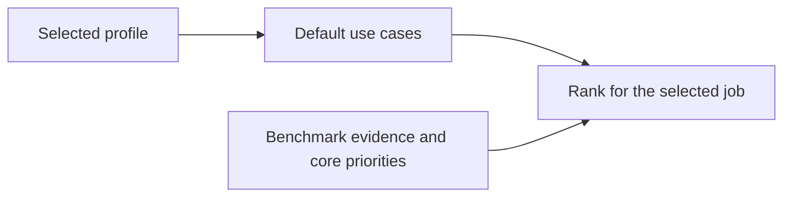

# Profiles, use cases and benchmark improvements

Reviewed 5 September 2026 against the checked-in code and catalogue. This is an
assessment and design record; the governing behavior is the correction in
`specs/desktop/backend/features/B03-profiles/SPEC.md`.

## Implemented structure

A **Profile** describes the kind of work the user does and chooses an ordered
starting list. A **Use Case** describes the job and owns its ranking weights.
Use cases can belong to multiple profiles without copying their definitions.



| Profile | Default | Other use cases |
|---|---|---|
| Software Engineering | Simple Implementation | Balanced/Complex Implementation, Review, UI UX, Planning, Orchestration, Research |
| Marketing | Content Drafting | Content Editing, Market Research, Campaign Planning, Marketing Analysis |
| General | Research | Content Drafting, Content Editing, Planning, Simple/Complex Action Execution, Financial Work |

Selection persists at `gui.user_profile`. Quick uses explicit choices instead of
an ordinal slider that mixed implementation, research and planning. Global search
and All use cases keep every built-in and custom task accessible. The Profiles
settings page explains the sets; Use Cases manages weights. Native tray quick
choices follow the same saved profile. The existing eleven weight presets are
unchanged; five content/marketing heuristics are added with a visible evidence
note. The initial profile remains Software Engineering for existing users.

Compatibility keys (`--profile`, `[profiles.*]`, profile history, rank DTOs) stay
stable. Existing customs take precedence over the five newly added presets if a
slug collides, keeping their weights and editability. The original eleven
built-ins retain historical precedence. Deleting a colliding custom reveals the
new preset. New user profiles are curated built-ins in this version; creating and
editing arbitrary profile collections is a follow-up.

## What the repository evidence says

`data/available_model_scores.csv` contains 334 model/reasoning rows and 101 dynamic
benchmark columns, of which 56 have at least one result. These are the checked-in
snapshot's counts after integration with v2.5.5, not claims about a user's
freshly downloaded catalogue.

| Category | Rows with a category score / 334 |
|---|---:|
| Software engineering | 209 |
| Agentic tools | 41 |
| Evidence capture | 19 |
| Knowledge | 8 |
| Reasoning; UI visual | 7 each |
| Security | 2 |
| Research; planning; instruction following; finance; data/ML | 0 each |

Reproduce the counts without refreshing data:

```sh
python3 - <<'PY'
import csv
rows = list(csv.DictReader(open('data/available_model_scores.csv')))
for group in ('software_engineering', 'agentic_tools', 'evidence_capture',
              'reasoning', 'knowledge', 'ui_visual', 'research',
              'planning_capability', 'instruction_following', 'finance',
              'security', 'data_ml'):
    print(group, sum(bool(r[group + '_score'].strip()) for r in rows), len(rows))
benchmarks = [k for k in rows[0] if k.startswith('benchmark:')]
print('benchmark columns', len(benchmarks), 'with results',
      sum(any(r[k].strip() for r in rows) for k in benchmarks))
PY
```

The system already has useful properties: missing scores are not zero-imputed;
partial recommendations are an explicit preference; weights are validated; built-ins are immutable; benchmark aliases
are deduplicated within category composites. Keep those properties.

## Recommended next changes, in priority order

1. **Make evidence coverage part of every recommendation.** In
   `internal/pick/rank.go`, missing task categories are excluded, and a row with no
   task evidence receives its unscaled core score. The desktop mapping in
   `internal/service/pick.go` drops task-evidence warnings. The existing partial
   recommendation option and UI already explain missing core scores; extend that
   visibility to task evidence. Surface the actual
   categories used, required categories missing, and a plain statement when a
   recommendation uses core scores alone. Keep missing data distinct from poor
   performance. Consider an explicit evidence requirement for specialist tasks;
   do not silently change the fallback formula. For example, core 80 plus task
   50 at 60/40 yields 68, while the same core with no task evidence yields 80.
   Coverage must be visible before those two results are compared confidently.

2. **Fix coverage before adding more benchmark names.** The catalogue currently
   has no usable composite for five of twelve categories. Diagnose collection,
   identity/version matching, and category evidence gates separately. Most
   categories require two reported measures; security requires one. Planning
   requires all four component categories (reasoning, knowledge, tools, research),
   so one absent component removes the whole planning score. Show reported /
   required evidence and distinguish a measured category from a derived proxy.
   Prioritise research, instruction following, and spreadsheet/data evidence for
   the newly exposed use cases.

3. **Record benchmark provenance and comparability.** Replace the universal
   placeholder description in `internal/service/catalog.go` with what each test
   measures, source link, benchmark version, evaluation date, model/reasoning
   configuration, harness/tool setup, metric/unit/direction, and reporting source.
   Expose the raw results already retained alongside relative scores by the
   derivation pipeline. SWE-bench's official evaluation
   interface explicitly takes a dataset and an execution setup, which is a useful
   model for preserving this context:
   [SWE-bench evaluation documentation](https://www.swebench.com/SWE-bench/reference/cli/).
   Use stable benchmark IDs and explicit aliases for spelling variants; keep
   distinct versions such as Terminal-Bench 2.0 and 2.1 separate unless an
   equivalence decision is documented.

4. **Reduce overlapping evidence in category weights.** `config/benchmarks.toml`
   places Terminal-Bench in engineering and tools, and Toolathlon/MCP Atlas across
   engineering, tools, and evidence capture. Planning incorporates other
   categories again. Existing deduplication works within a category, so the same
   evidence can still influence several weighted categories. Audit benchmark
   families and show effective contributions; use a family-level weight budget
   or a use-case-specific evidence mix when calibrating the next scoring version.
   Distinguish a proxy such as evidence capture from a directly measured outcome.

5. **Evaluate actual marketing deliverables.** Brief adherence, brand voice,
   factual support, editing quality, audience fit, and correct campaign analysis
   need representative task evaluations. Start with a small versioned set of
   synthetic or approved briefs and spreadsheets, explicit rubrics, and blinded
   human comparisons. Treat public instruction-following results as supporting
   evidence: [IFEval's paper](https://arxiv.org/abs/2311.07911) evaluates verifiable
   instructions, which does not establish brand voice or campaign effectiveness.
   A deliverable-based rubric can borrow the structure of
   [GDPval expert grading](https://evals.openai.com/gdpval/grading); this is a
   methodology suggestion, not a claim that its aggregate score measures marketing.

6. **Calibrate the use-case weights and broaden the profile library.** Most
   existing presets assign 60–80% to general intelligence, cost and speed, so task
   evidence can have limited influence even when available. Run rank-stability
   comparisons and representative task evaluations before adjusting shares.
   Keep job choice separate from quality/cost/speed preferences; a future task
   difficulty control should vary the same task. Use names such as Draft content,
   Review code, and Analyse campaign results. Later add Product & Design, Data &
   Analytics, and Operations profiles plus editable personal collections. Require
   each new profile to add useful tasks and evidence, rather than synonyms for
   existing presets. Let users pin, order and choose a default within their own
   collections without multiplying scoring definitions.

The taxonomy and editing changes are implemented here. The scoring, provenance,
and evaluation recommendations above remain follow-up work; benchmark weights,
normalisation, evidence thresholds and ranking fallback are unchanged.

## Verification

- `pnpm build` passes TypeScript compilation and the desktop production build.
- `pnpm test` passes all 283 frontend tests across 37 files. Added scenarios cover
  saved profile defaults, switching profiles, accessing other use cases, failed
  preference writes, and adding, clearing and restoring custom task weights.
- `pnpm check:host` passes the renderer/host boundary check.
- `go test ./...` passes all Go packages after integration with v2.5.5. Coverage includes profile definitions, settings persistence and
  validation, compatibility with existing custom slugs, custom benchmark groups,
  ranking and native tray defaults.
- Browser preview inspection confirms the Marketing picker exposes all five
  use cases, displays the evidence note, and keeps Profiles and Use Cases on
  separate settings pages. The checked-in screenshots use fixture model data.
- `git diff --check` passes.

The broad spec checker still exposes four existing errors:
`python3 specs/verify_sdd.py` expects F20 version 1.0 in three documents that
specify 1.1, and F12's task reference to SPEC section 7a does not resolve. These
are identical on the base branch and do not concern this feature.
