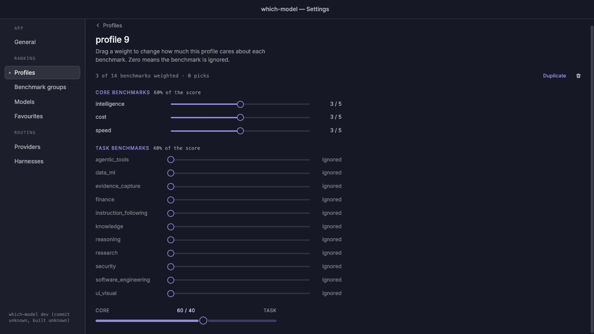
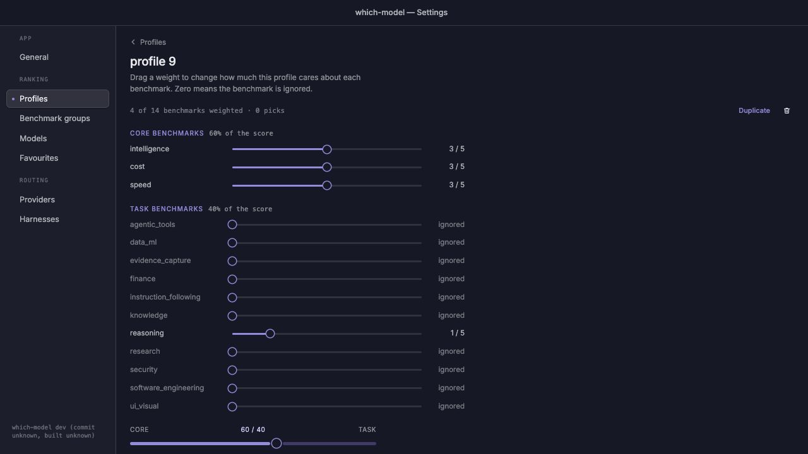

# Project review fixes — 4 September 2026

This change implements all 26 findings from the project review: issue #32 and
issues #161–#185. Each issue retains its implementation plan and acceptance
criteria. The governing feature specifications, contracts, and regression rows
are amended with the fixes; no public usage snapshot schema changes are required.

## Implementation coverage

| Issue | Result | Regression evidence |
|---|---|---|
| [#161](https://github.com/WD-Mitchell/which-model/issues/161) | npm fallback decodes the checksum manifest as text while preserving binary bytes. | Actual postinstall entry point with LF/CRLF manifests, binary marker, mismatch/missing entry, HTTP failure, optional-package and skip paths. |
| [#162](https://github.com/WD-Mitchell/which-model/issues/162) | Host stdin always leads to underlying hook execution; nested CLI commands preserve the outer response stream and request flags. | All four hooks execute with host context; actual SessionStart CLI invocations; outer offline/config/timeout and later overrides. |
| [#163](https://github.com/WD-Mitchell/which-model/issues/163) | Model audit consumes F26's candidate string and history selectors, checks dispatch correlation, and writes sanitized compact JSONL. | Actual explain output round trip, explicit history ID, colon-containing model ID, mismatched candidate, and canary stripping. |
| [#164](https://github.com/WD-Mitchell/which-model/issues/164) | Pick forwards configured backend, offline, refresh, MaxAge, and timeout to usage fetching. | Cobra through the production pick adapter for all three backends and explicit request options. |
| [#165](https://github.com/WD-Mitchell/which-model/issues/165) | Publishing generates, stages, commits, and uploads coherent raw/score pairs; Python tests run in CI. | Deterministic regeneration, derivation failures, stage/commit/upload ordering, workflow-generator parity. |
| [#166](https://github.com/WD-Mitchell/which-model/issues/166) | CLI and publishing share the complete strict catalog configuration schema; invalid pick configuration is surfaced. | Representative full configuration through publishing and CLI; unknown-key and malformed-config failures. |
| [#167](https://github.com/WD-Mitchell/which-model/issues/167) | Environment overrides preserve declared string, numeric, and boolean types. | Zero/one values and saved configuration round trips; supported hook/auth runtime variables remain outside saved config. |
| [#168](https://github.com/WD-Mitchell/which-model/issues/168) | Legacy config migration uses the actual home directory when Linux/XDG config directories differ. | Independent home/config roots, migration content, explicit-path behavior. |
| [#169](https://github.com/WD-Mitchell/which-model/issues/169) | Round-robin recovers from null, invalid, negative, and overflowing cursor state. | Null/malformed state, negative/max cursors, scope isolation and subsequent writes. |
| [#170](https://github.com/WD-Mitchell/which-model/issues/170) | Route production indexes catalog names once per call. | Existing resolution/ambiguity semantics plus construction-inclusive benchmarks on identical fixtures. |
| [#171](https://github.com/WD-Mitchell/which-model/issues/171) | Profile creation is distinct from updating, with atomic conflict detection and UI suffix retries. | Backend collision tests and frontend repeated-create/save-as behavior. |
| [#172](https://github.com/WD-Mitchell/which-model/issues/172) | Profile/group editors retain pending saves across navigation and serialize persistence by entity. | Debounce/unmount, delayed writes, return-to-editor, failure, rename, duplicate, and delete ordering. |
| [#173](https://github.com/WD-Mitchell/which-model/issues/173) | Events invalidate profile details; clean popovers adopt external edits while preserving deliberate local overrides. | Mounted query/event tests, baseline reconciliation, and deleted-profile fallback. |
| [#174](https://github.com/WD-Mitchell/which-model/issues/174) | Ignored task metrics remain available for editing at zero weight. | Ignore and re-enable in the profile editor, including catalog-backed custom groups. |
| [#175](https://github.com/WD-Mitchell/which-model/issues/175) | A successful empty ranking clears stale tray output and later results restore it. | Empty-result/recovery UI tests and native tray ownership checks. |
| [#176](https://github.com/WD-Mitchell/which-model/issues/176) | Native credential paths expand home/environment placeholders at the file-read boundary. | Synthetic home/CODEX_HOME credentials, unresolved environment values, literal paths, and real descriptor integration. |
| [#177](https://github.com/WD-Mitchell/which-model/issues/177) | Unsupported-platform keychain absence falls through to the next credential source. | Missing-keychain sentinel paths; Linux/Windows credential test cross-compilation. |
| [#178](https://github.com/WD-Mitchell/which-model/issues/178) | Editing a harness provider preserves its explicit enabled/disabled override. | Tri-state override preservation through update and reload. |
| [#179](https://github.com/WD-Mitchell/which-model/issues/179) | Failed harness writes leave live configuration unchanged. | Failure injection across all six mutation paths, including nested data. |
| [#180](https://github.com/WD-Mitchell/which-model/issues/180) | Online CodexBar calls use fresh cached snapshots before credentials or subprocesses. | Consecutive calls, TTL boundaries, refresh, offline, identity redaction, and failure-cache behavior. |
| [#181](https://github.com/WD-Mitchell/which-model/issues/181) | CodexBar workers receive provider and parent deadlines. | Per-worker budget, parent deadline, timeout classification, and offline zero-I/O tests. |
| [#182](https://github.com/WD-Mitchell/which-model/issues/182) | Native snapshots report aggregate UsageKnown when an authoritative window is measured. | Provider parsing, native fetch, cache, and public JSON round trip; zero/unlimited versus unknown cases. |
| [#183](https://github.com/WD-Mitchell/which-model/issues/183) | Explicit desktop catalog refresh updates models.dev data and atomically publishes cache; failures retain usable cache. | Exactly one refresh, model removal, displayed price updates, and offline/failure fallback. |
| [#184](https://github.com/WD-Mitchell/which-model/issues/184) | Forced source selection checks managed credentials and cached provenance before reuse. | Managed OAuth versus forced API source, matching/mismatching native/CodexBar cache entries, and cache-only behavior. |
| [#185](https://github.com/WD-Mitchell/which-model/issues/185) | Custom catalog groups are valid in service profile validation and ranking. | Saving a custom-group profile and changing actual winner/exact score totals; static profile validation remains bounded. |
| [#32](https://github.com/WD-Mitchell/which-model/issues/32) | Native wrappers return structured engine errors and WailsHost recognizes RuntimeError.cause. | Native serialization plus frontend mapped cause, direct DTO, unknown-code, and generic-error cases. |

## Routing performance evidence

Measured on Apple M4, darwin/arm64, using the same regenerated catalog with 119
scored identities and 1,000 provider model IDs. Each benchmark includes index
construction. Five one-second runs were measured before and after the change.

| Median | Before | After |
|---|---:|---:|
| Time per operation | 37.874 ms | 1.726 ms |
| Bytes allocated | 15,711,168 | 1,379,788 |
| Allocations | 447,925 | 19,909 |

This fixture runs about 21.9 times faster and allocates 8.8% of the previous
bytes. This is a routing microbenchmark, not an end-to-end desktop latency claim.

## Review boundaries

The credential-source correction in #184 needs review by the repository's
security/code owner, `@wdmitchelluk`, before merge. Credentials and provider
transports in regression tests are synthetic; no live account validation is
claimed. Linux and Windows credential binaries were cross-compiled; their native
keychain environments were not available locally.

The group persistence changes overlap the problem addressed by existing PR #159.
Review that PR against the resulting implementation before merging both. Existing
PRs #157, #158, and #160 retain their separate review flow.

## Validation

- `go test ./...` — passed, including the macOS desktop backend.
- `go vet ./cmd/which-model ./internal/... ./pkg/...` — passed.
- `go test -race ./internal/config ./internal/catalog/publish ./internal/hooks ./internal/pick/... ./internal/routing ./internal/service ./internal/usage/... ./pkg/whichmodel` — passed on the combined branch.
- `go run ./cmd/which-model catalog workflow --check --config which-model.toml` — passed without workflow drift.
- `bash scripts/audit-nousage.sh` — passed default/nousage builds, targeted tests, and endpoint-string scan. This is the repository's supported build audit, not a claim that all untagged CLI test files compile under `nousage`.
- `pnpm build`, `pnpm typecheck`, `pnpm test`, `pnpm check:host` — passed; 262 tests (34 core, 142 UI, 86 desktop), and generated host bindings match EngineHost.
- `python3 -m unittest discover -s .daily-update/tests -v` — passed: 112 tests, one skipped.
- `node --test npm/which-model/install.test.js` — eight passed.
- `bash scripts/smoke-npm.sh npm` — passed.
- Browser smoke on the preview with the mock host: an ignored reasoning control remained editable; increasing it to one and immediately navigating back/reopening preserved the value. A fresh reload produced no new console errors. Native visible tray appearance was not manually inspected; native tray and transport behavior were tested automatically.

