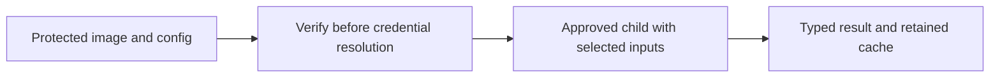

# Administrator-approved CodexBar

Company CodexBar usage is disabled until an administrator approves an installed
native image **and its configuration**, each by protected absolute path and SHA-256.
Personal users retain existing CodexBar discovery and authentication behavior.
Native which-model usage remains available under its separate provider/source policy.

A company approval entry has this shape (example Linux paths):

```json
{
  "codexbar_installations": [{
    "path": "/opt/company/codexbar/CodexBarCLI",
    "sha256": "<64 lowercase hexadecimal characters for the installed native image>",
    "config": {
      "path": "/etc/company/codexbar.json",
      "sha256": "<64 lowercase hexadecimal characters for the reviewed config>"
    }
  }]
}
```

Deploy both files and their ancestors with administrator ownership and no
untrusted write/delete/ACL rights, following the
[approved executable rules](approved-execution.md). The operating user must be
able to read the config and execute the image. Do not put private credentials in
world-readable configuration. A reviewed OAuth configuration can contain no secrets:

```json
{"version":1,"hooks":{"enabled":false,"events":[]},"providers":[{"id":"codex","enabled":true,"source":"oauth","cookieSource":"off"}]}
```

The administrator must confirm this config works with the installed version and
its separately permitted authentication. Enable the intended provider and
`usage.backend = "codexbar"` through ordinary preferences only after deployment;
these preferences cannot grant approval. Binary-only entries in the previously
reserved schema must gain a config identity before the upgraded policy is valid.



On a cache miss, which-model checks the approved pair before reading any delegated
credential, checks it again before invocation, and uses its exact path. PATH,
CODEXBAR_BIN, project working directories and inherited config overrides do not
select the executable or config. Discovery lists allowed providers without running
`--help`. Updates that change either digest require administrator reapproval;
there is no fallback to an unapproved installation or self-reported version.
A cached response is provider evidence, not proof that CodexBar ran or that an
installed image still passes verification. Native and delegated usage retain the
existing shared provider cache; offline/cache-only reads execute no child.

The child receives [the OS-derived environment](approved-execution.md) plus
`CODEXBAR_CONFIG` pointing to the approved config. Its working directory is the
protected image directory. It receives fixed single-provider usage arguments and
an explicit source if requested. Parent tokens, proxy settings, startup hooks and
other config/path overrides are not inherited.

Only Antigravity auto/OAuth requests may receive the canonical
`ANTIGRAVITY_OAUTH_CREDENTIALS_JSON` input from which-model's permitted OS store.
It contains access/refresh token, expiry, OAuth client ID/secret and optional ID
token/email used for authentication and account routing. Unknown JSON fields are
dropped; the input is limited to 64 KiB. It is never put in argv or written to a
credential file by which-model. Other providers receive no which-model credential
environment. Process environments remain visible to sufficiently privileged local
processes; this is part of the explicit delegated-credential approval.

CodexBar's own config can control provider sources, endpoint overrides and hooks;
it also has its own credential stores. Pinning the input prevents mutable user
config from replacing the reviewed settings. It does not make which-model's native
secure-store rules govern CodexBar, analyze all its configuration, or sandbox its
helpers. The administrator must review enabled hooks, dependencies, local probes,
browser/keychain access, network destinations and upstream storage for the approved
version. The pinned upstream [configuration contract](https://github.com/steipete/CodexBar/blob/9f4f544a5bf81da276fe94176aa1165c9e296b4b/docs/configuration.md)
describes these capabilities.

Delegated endpoint scope varies by provider and selected source. Codex/Claude may
use provider APIs, local CLI sessions or browser sessions; Copilot uses GitHub
identity/device credentials and its usage API. Review the installed provider's
[upstream source definitions](https://github.com/steipete/CodexBar/blob/9f4f544a5bf81da276fe94176aa1165c9e296b4b/docs/providers.md)
and any approved enterprise host overrides. Antigravity can probe local services
or use Google OAuth and `cloudcode-pa.googleapis.com` quota/account APIs; its auto
mode can launch a local helper before OAuth fallback. See its
[pinned data flow](https://github.com/steipete/CodexBar/blob/9f4f544a5bf81da276fe94176aa1165c9e296b4b/docs/antigravity.md).
This documentation is a review starting point, not an enforced egress allowlist.

The adapter discards stderr, caps stdout at 1 MiB, retains the earlier caller
deadline/30-second adapter ceiling and bounds pipe wait to one second. Verification
reads are size-bounded by the approved-image contract; the subprocess deadline is
not an interruptible filesystem-verification guarantee. Invalid/duplicate/wrong
provider results, unsupported/mismatched sources and failed processes cannot become
successful cached snapshots. Bad timestamps remain stale. Error messages use fixed
application text. The resulting typed snapshot follows the
[company privacy/retention inventory](privacy-and-retention.md); CodexBar's own
stores, refresh writes and child processes are outside which-model cleanup.

Returned source labels are normalized per provider: Antigravity `app`/`ide` are
local evidence; Codex `pat`, `openai-web`, and `codex-cli` are API, web, and CLI;
Claude `admin-api` is API and `claude`/`claude-cli` are CLI; Windsurf `windsurf-web`
is web. Antigravity and Windsurf's CLI source selector permits their local probes,
including when matching a cached observation. Other explicit selections must
match the canonical source. Aliases from a different provider and unlisted labels
are refused; the [source contract](../../specs/features/F14-usage-fetch/APPROVED-CODEXBAR.md#source-and-cache-correction-pr-314-review)
records the reviewed mapping and tests.

Company caches retain producer staleness independently of cache age. Offline and
explicit cache reads preserve bad-timestamp warnings; online requests fetch a new
observation. Increasing the cache age allowance cannot make a producer-stale
observation current. A valid new response may replace it, and retention still
uses the application's recording timestamp.

Approval verification is implemented and tested on macOS, Windows and Linux.
The reviewed upstream revision documents macOS/Linux CLI distributions; native
Windows CI uses a synthetic executable to test which-model's controls. It does not
establish a supported upstream Windows CodexBar package. Deployment on Windows
requires an independently reviewed compatible binary; native which-model collection
remains the available separately controlled path. See the
[upstream distribution list](https://github.com/steipete/CodexBar/blob/9f4f544a5bf81da276fe94176aa1165c9e296b4b/README.md).

After any upstream update, review its source/config/auth changes, verify the
installed artifacts, protect both inputs, update their hashes and exercise the
approved provider. Remove the approval to stop new delegation; separately revoke
upstream credentials and remove upstream-owned state when decommissioning.
The [normative contract](../../specs/features/F14-usage-fetch/APPROVED-CODEXBAR.md)
and native CI fixture provide the implementation evidence.
