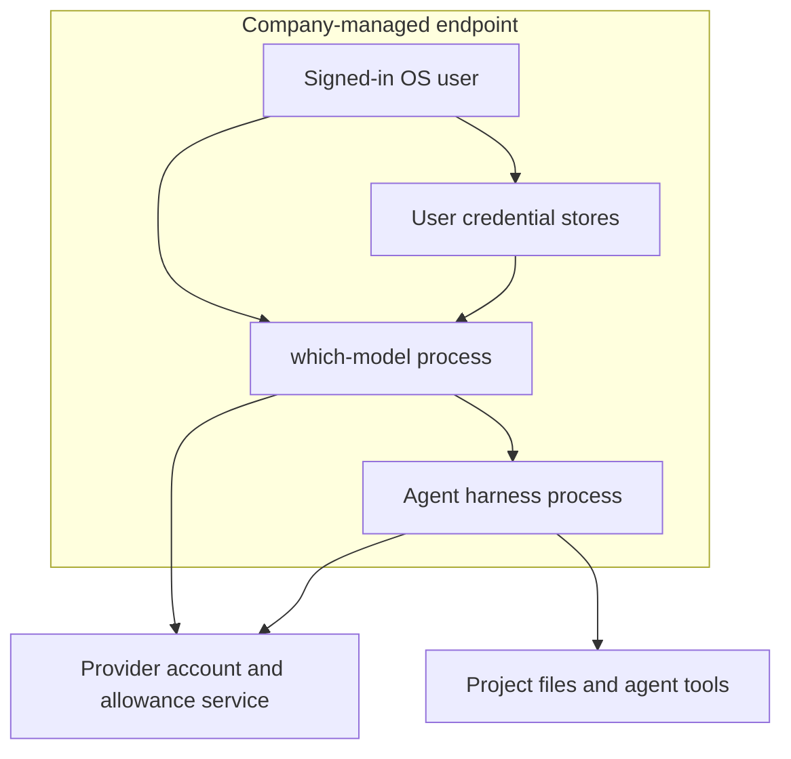

# Company deployment identity boundary

Decision: retain local OS and provider identity, accepted by the requester in
[#281](https://github.com/WD-Mitchell/which-model/issues/281). Evidence reviewed
2026-09-10 against source revision `95bc6bf` and the provider references below.
This is an architecture and deployment decision, not company or provider approval.
No application login, product RBAC service or central credential broker is added.

## Current implementation supplement (#291)

The original provider/source assessment below is a dated baseline at `95bc6bf`;
its references to planned controls and unavailable Windows/Linux stores are not
the current company-mode implementation. At `b0bc8dacd20d95adc50c141433d1d74888222641`,
#282–#287 have implemented protected policy, native stores on all three OSes,
retention, approved execution/delegation and advisory reporting.
[The current data inventory](privacy-and-retention.md) supersedes the baseline's
company credential-source/persistence descriptions; [the assessment](company-assessment.md)
links exact verification and pending external decisions. Personal source chains,
local identity limits and unresolved provider permission remain as described.
No new provider terms review or permission is claimed by this supplement.

## Actors and trust boundaries

The CLI and desktop backend run as the signed-in OS user. The process resolving
a credential holds its plaintext value in memory and can make authenticated
requests with that credential. The OS controls who may read files, use a secure
store, inspect a process or start a child. The provider controls token validity,
account privileges, subscription entitlements, workspace membership and revocation.
A successful credential lookup is not proof of company account approval.

Harnesses launched by which-model run with the user's OS privileges and their own
provider authentication and native permission rules. A recommendation or hook
response is not permission to bypass those rules. Prompts, project files, skills,
hooks and agent tool output can influence a harness; provider allowance reads do
not constrain what the harness subsequently reads, executes or transmits.

CodexBar adds a separate local process and its own authentication/discovery
behaviour. Approving the which-model binary does not approve CodexBar or every
credential that CodexBar can discover. The selected company policy is to disable
it until an administrator approves a specific installation (#287).

## What a managed profile can enforce

The optional profile planned in #282 applies restrictions inside an approved
which-model installation: protected policy precedence, permitted credential
sources (#283), data handling (#284), integration/executable approvals (#285) and
CodexBar approval (#287). These are follow-on deliverables, not existing guarantees
at this document's evidence revision. Personal-user defaults remain unchanged.

A user who can replace the binary, change its protected policy, run an unmanaged
copy, invoke the harness directly or read the same credentials through another
process can bypass application-local restrictions. Keychain protection improves
storage security but does not provide a universal boundary against all processes
running as the credential owner. Administrator/root access and a compromised
endpoint are outside that boundary. A separate app login would not remove these
same-user capabilities; independent enforcement requires endpoint isolation,
provider controls or separate architecture outside this decision's scope.

Quota/authentication evidence failures and failed audit writes remain advisory:
they do not block otherwise authorised launches (#286, requester decision).
Unavailable evidence must not be described as confirmed allowance or a successful
audit record. Actual provider, OS and approved-execution restrictions still apply.

## Native provider capability assessment

The following describes this implementation, rather than promising every provider
feature is integrated. Reading one endpoint does not narrow the privileges of the
credential used to call it. A token's effective access depends on its grant,
account, organisation policy and provider validation; which-model does not
exchange it for a separate allowance-only token.

| Provider | Observed credential and request path | Scope and company assessment |
|---|---|---|
| Codex | Reads access token and account ID from Codex `auth.json`; the built-in device login exchanges an authorisation code with OpenAI and persists the returned login. Usage calls `https://chatgpt.com/backend-api/wham/usage`. | This device flow requests no explicit allowance-only scope. Existing tokens retain their original grant. OpenAI documents managed login/workspace and credential-store controls for Codex [O1]; this adapter does not inherit those settings merely by reading its cache. Enterprise-approved third-party allowance-only access to this endpoint is **not established**. |
| Claude | Resolves an environment override, macOS Claude Code keychain entry, or Claude credential files. Built-in OAuth requests `org:create_api_key user:profile user:inference user:sessions:claude_code`; usage calls `https://api.anthropic.com/api/oauth/usage`. | The requested grant includes inference and API-key-related capabilities, not just allowance access. Anthropic's published guidance restricts third-party Claude.ai login and credential intermediation [A2]. Treat provider permission for this integration as **unresolved**, requiring the company's provider relationship owner to resolve before approving it. A working response or subscription seat is not permission. |
| GitHub Copilot | Resolves `COPILOT_API_TOKEN`, global/system Git config, `gh auth token`, or device-flow credentials. Calls `https://api.github.com/user` then `https://api.github.com/copilot_internal/user`. Device flow requests `read:user` with the existing client ID `Iv1.b507a08c87ecfe98`. | `read:user` covers profile reads [G1]; it is not a documented allowance-only grant. Reused CLI/environment tokens may carry broader scopes. The identity check validates a GitHub user, not approved organisation membership. Enterprise-approved allowance-only access to the private endpoint is **not established**. Organisation OAuth restrictions govern organisation data, not all personal resources [G2]. |

No provider in this matrix has evidenced an enterprise-approved, least-privilege
allowance-only credential for the exact implemented path. This records an evidence
gap; it does not assert that a provider can never offer one. GitHub Apps, OpenAI
Platform keys, Anthropic API keys and cloud-provider identities must not be assumed
to work with these subscription-allowance endpoints. No new scopes are invented.

Implementation evidence (paths resolve in the reviewed revision):

- [Credential chain](../../internal/usage/credential/credential.go),
  [managed credential store](../../internal/usage/credential/managed.go), and
  [secure-store platform selection](../../internal/usage/credential/keychain_other.go).
- [Codex sources/endpoint](../../internal/usage/provider/codex/codex.go),
  [account-aware loader](../../internal/usage/provider/codex/codex_credential.go),
  [device exchange and persistence](../../internal/usage/provider/codex/codex_login.go).
- [Claude sources/endpoint](../../internal/usage/provider/claude/claude.go) and
  [OAuth request](../../internal/usage/provider/claude/claude_login.go).
- [Copilot sources/client/scope](../../internal/usage/provider/copilot/copilot.go) and
  [identity check](../../internal/usage/provider/copilot/copilot_check.go).

The baseline managed store prefers macOS Keychain and falls back to a local file;
Windows/Linux use the unavailable-keychain implementation. Codex's native reader
expects a file; it does not discover credentials stored only in Codex's keyring.
Do not weaken a company's provider credential-store requirement to make this
reader work. Cross-platform secure storage and source restrictions belong to #283.
Local deletion of which-model data is not provider token revocation, and deleting
provider-owned credentials may also sign the user out of other applications.

## Company controls and verification owners

These are required deployment responsibilities for the selected boundary. Named
roles identify ownership without inventing an assigned employee or completed
approval. Record the environment, date, artifact revision and result for each check.

| Control | Owner | Practical acceptance evidence |
|---|---|---|
| Individual OS accounts, minimum local privileges and protected home/profile data | Endpoint/IAM owners | Demonstrate an unrelated unprivileged account cannot read the test account's credential/state files or use its secure-store item. Use synthetic credentials; do not attach secrets. |
| Device protection on macOS, Windows and Linux | Endpoint owner | Verify disk encryption, supported patch level, screen/session lock and company endpoint protection through the organisation's management inventory. Validate each OS separately. |
| Approved binary, policy and executable integrity | Endpoint/application owner | Verify release provenance and deployed digest; demonstrate a standard user cannot replace policy/binary or its parent directory. Test company policy with project/config/environment overrides. App controls alone do not stop an unmanaged copy; verify company execution controls where that is required. |
| Provider seat, workspace and authentication restrictions | Provider tenant/IAM owners | Record the approved account/tenant, enforced SSO/MFA and offboarding procedure. Test a synthetic wrong-account login in the native provider tool. Verify restrictions for each authentication method; do not infer coverage of direct token reuse. |
| Exact usage-integration permission and scopes | Provider relationship/security owner | Record provider confirmation or authoritative documented support for each endpoint/client/grant. Review granted scopes without recording token values. Keep native usage unapproved where the matrix remains unresolved; score-only recommendations remain available. |
| Credential source and secure storage | Endpoint/security owners | After #283, demonstrate keychain success, unavailable/locked-store handling, prohibited file/env/CLI fallback, and legacy credential cleanup on all three OSes. Confirm provider-owned data is handled separately. |
| Harness tools, project trust and network destinations | Development platform/security owners | Review native sandbox/approval settings, installed skills/hooks/MCP tools and egress rules. Exercise an untrusted project and unapproved executable using synthetic fixtures. Agent prompt text is not an access-control boundary. |
| Retention and privacy | Privacy/data owner | Review #284's data flow and actual deletion evidence. Approved company defaults: identity-free persistence; snapshots 24 hours, launch logs 7 days, pick history/audit 30 days, administrator-configurable. Provider/harness-owned data needs its own retention controls. |
| Offboarding, revocation and audit | IAM/security operations owners | Revoke a test credential at its provider, remove local application access and verify subsequent requests fail. Review advisory quota/audit failures; company-required tamper-resistant logging must be provided externally. |
| Deployment risk acceptance | Company security owner | Record acceptance separately from merged PRs or completed milestones, including unresolved provider permission, same-user bypass and external-control evidence. #291 collects this evidence without declaring certification. |

## Dated provider references

Reviewed 2026-09-10. Recheck when authentication, endpoints or provider policy
changes; these references are evidence, not permission to reuse every credential.

- [O1 — OpenAI Codex authentication](https://developers.openai.com/codex/auth/):
  local file/keyring storage, managed login/workspace settings and device login.
- [A1 — Claude Code authentication](https://code.claude.com/docs/en/authentication):
  provider login and credential storage; organisation restrictions have
  authentication-method-specific limits.
- [A2 — Claude Code legal and compliance](https://code.claude.com/docs/en/legal-and-compliance):
  published restrictions on third-party subscription login and credential handling.
- [G1 — GitHub OAuth scopes](https://docs.github.com/en/apps/oauth-apps/building-oauth-apps/scopes-for-oauth-apps):
  requested scopes limit a user's existing privileges; `read:user` is profile access.
- [G2 — GitHub OAuth app restrictions](https://docs.github.com/en/organizations/managing-oauth-access-to-your-organizations-data/about-oauth-app-access-restrictions):
  organisation approval boundaries and remaining personal/public access.

## Review scenarios for #281

| Criterion | Review performed | Result and limit |
|---|---|---|
| AC1 | Trace local credential sources through the process to each provider and harness. | Actors, plaintext credential holders and OS/provider enforcement are identified above. |
| AC2 | Compare the three descriptors/login implementations with the dated provider references. | Scope matrix records actual grants and unresolved allowance-only/provider approval; no narrower grant is claimed. |
| AC3 | Evaluate direct harness invocation, credential reuse and binary/policy replacement by the same user. | Decision retains local identity and assigns independent enforcement to endpoint/provider controls. |
| AC4 | Walk each company control from owner to verification evidence. | Checklist supplies an owner role and practical check for each control; organisation-specific execution and acceptance remain outstanding. |
