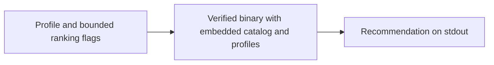
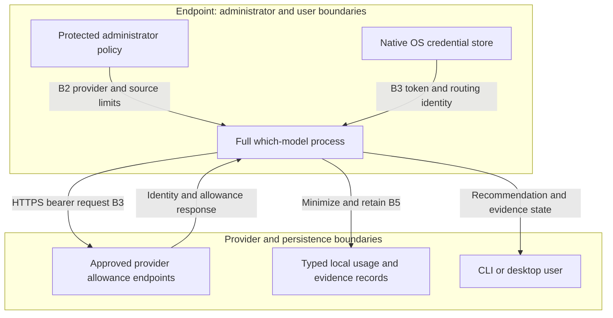
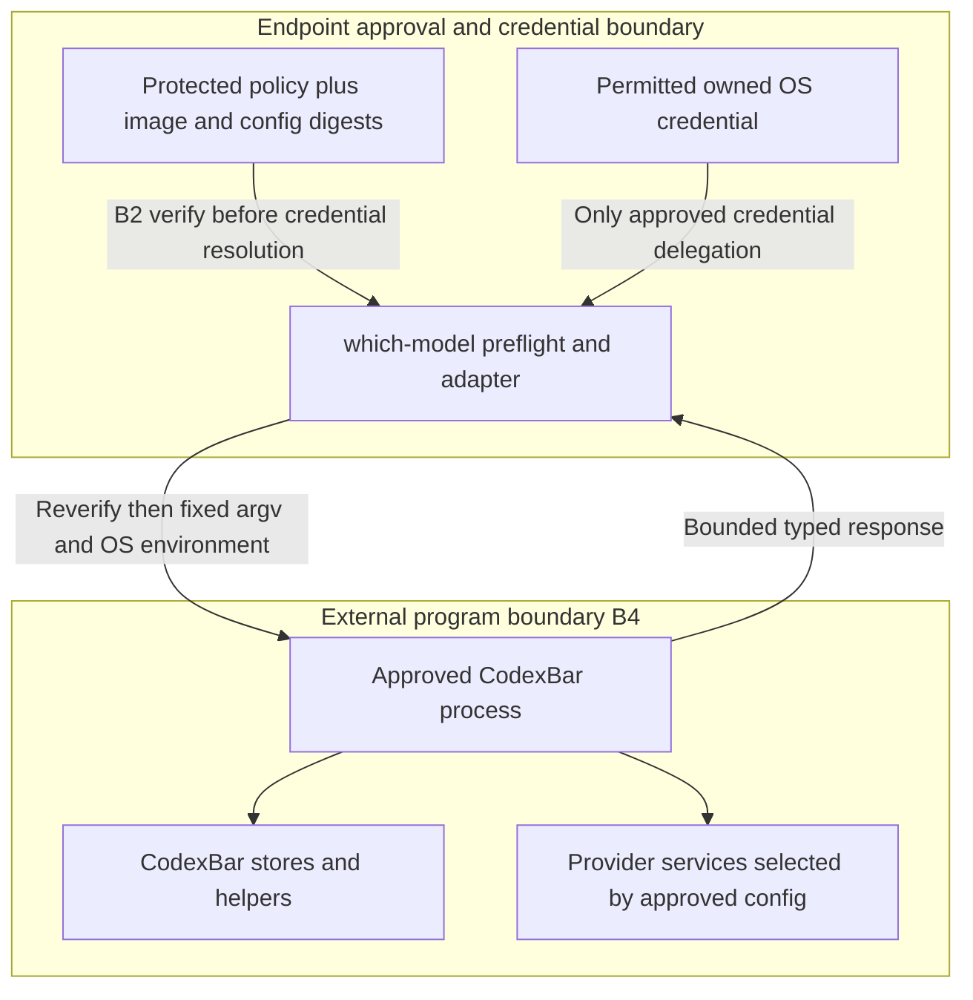
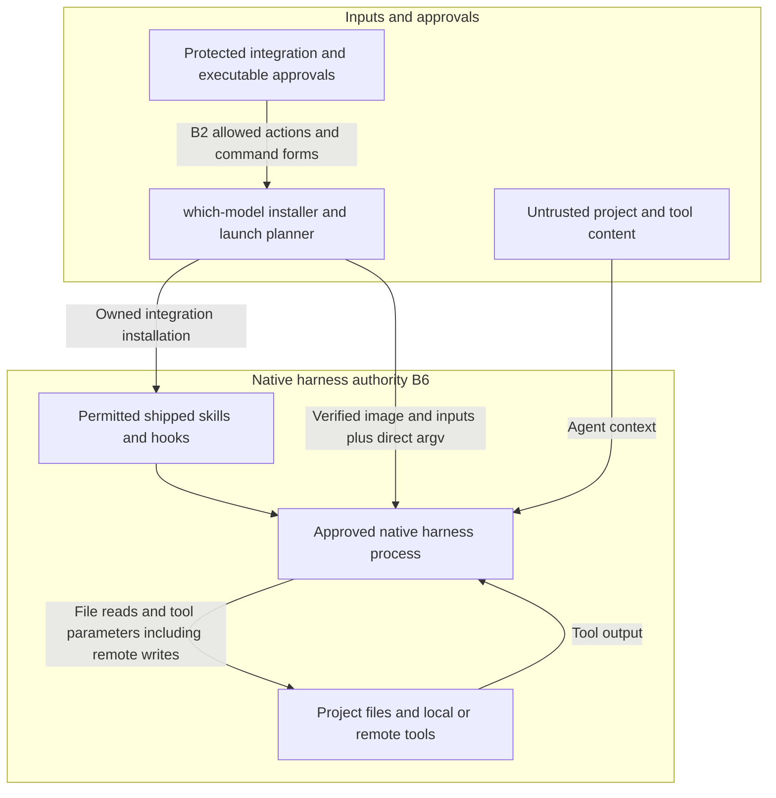

# Company threat model — version 1

Scope, baseline and review state: [assessment record](company-assessment.md).
This is a STRIDE analysis of the local application and its integrations, not a
claim of penetration testing, provider authorization or company risk acceptance.

## Assets, actors and boundaries

Sensitive assets are provider tokens and routing identity, subscription/account
metadata, local usage/history/audit records, project files and anything accessible
to a launched harness. Integrity assets are the executable, protected policy,
approved external images/inputs, embedded catalog/profiles and release evidence.

Trust boundaries:

- **B1: release publisher to endpoint.** GitHub/npm transport artifacts; the
  independently approved source/ref, verifier and Sigstore roots establish the
  intended release identity. They do not prove benign source.
- **B2: administrator to ordinary user/project/environment.** Fixed protected
  policy files and native owner/ACL checks govern only the approved running
  application. OS administrators and binary replacement remain outside this boundary.
- **B3: credential store to process to provider.** The OS store protects storage;
  an authorized process holds plaintext tokens in memory. Provider grants retain
  their original privileges. Same-user malware is not universally excluded.
- **B4: external program/tool to application.** CodexBar output is parsed and
  minimized; approved program/config identity does not sandbox its helpers or network.
- **B5: application to local records.** Typed retention bounds product persistence;
  records remain user-controlled files and are neither immutable nor complete.
- **B6: recommendation/integration to native agent.** OS/native harness permissions
  govern project/tool/data access. A score, hook approval or quota observation grants
  no independent authority over those permissions.

Adversaries include an untrusted project or tool author, a compromised package or
publisher, a same-user process, a malicious/compromised delegated program, and
misleading provider/tool responses. Authorized administrator changes are trusted
inputs to the local boundary but still need organisational review.

## Mode A — restricted offline score-only

B1 governs installation; runtime has no credential holder, provider recipient,
local record writer or child execution boundary. No project/config/env input can
add those capabilities. Output says allowances and availability are unverified.
The caller may redirect stdout or act on a recommendation outside this boundary.
Catalog quality, missing scores and inappropriate task use can still mislead a
user. Source imports, linked symbols and Linux syscall isolation are tested; an OS
loader/runtime still reads normal platform data. See [restricted contract](offline-score-only.md).

## Mode B — managed native live usage

The process is the transient credential holder; macOS Keychain, Windows Credential
Manager and Linux Secret Service are the company owned stores. Default providers
are empty and default permitted credential source is keychain. Owned plaintext
fallback is prohibited. Explicit administrator-authorized migration is separate.
Personal providers may retain their existing broader source chains.

Native allowance recipients are `chatgpt.com/backend-api/wham/usage`,
`api.anthropic.com/api/oauth/usage`, and GitHub's mandatory `api.github.com/user`
identity gate followed by `api.github.com/copilot_internal/user`. Login/device
flows contact the respective provider authorization/token services. Catalog
refresh is a separate public/model-data flow (including an Artificial Analysis
API key where used), not an allowance-token recipient. Exact requests, scopes,
identity fields and cleanup owners are in the [data inventory](privacy-and-retention.md).

Provider source/error text cannot become arbitrary persisted audit payloads.
Company snapshots omit identity by default, but token routing metadata remains
in its OS record and live identity can be explicitly displayed. Account approval,
endpoint permission, proxy/CA/egress configuration and token revocation are external
controls. Fetching an allowance does not narrow a credential's provider grant.

## Mode C — approved CodexBar delegation

Default: disabled. The image/config pair must pass protected owner/ACL, path and
SHA-256 checks; PATH, CODEXBAR_BIN and inherited config variables cannot select it.
The adapter supplies CODEXBAR_CONFIG and, only for permitted Antigravity auto/OAuth,
bounded canonical OAuth JSON. Antigravity may require access/refresh/ID tokens,
client credentials and account-routing fields. That child becomes a credential
holder. Other providers use the separately reviewed CodexBar authentication path.

CodexBar can read its own files/keychain/browser data, call helpers, contact
provider/configured enterprise destinations and write refreshed credentials.
The approval does not extend which-model's store or retention guarantees into
CodexBar. Review these recipients and dependencies for the exact image/config;
[the pinned upstream assessment](approved-codexbar.md) includes Google cloud-code
quota flows. Native three-OS synthetic invocation proves the adapter boundary,
not an available upstream Windows package or a live provider integration.

Fresh-cache/offline requests execute no child and resolve no delegated credential.
Malformed, oversized, wrong-provider/source and error output becomes fixed typed
failure; invalid/future timestamps stay stale. Returned data follows Mode B's
minimization/storage flow. A malicious approved program can still misuse authority
it already possesses; network and native process controls remain necessary.

## Mode D — agent integration

Native harnesses hold their own credentials and may send prompts, source and tool
parameters to their approved providers/services. which-model launches as the local
user with the current project directory, protected command form and OS-derived
environment; it drops inherited secret, proxy and runtime injection variables.
The permitted runtime, libraries, plugins and descendant processes are separately
trusted. Explicit custom-shell permission is broader authority, not containment.

Installation/use gates precede effects; removal preserves foreign/modified content.
A copied command runs no child and, when manually used, receives the user's
terminal environment. Launch evidence records intent and start outcome separately.
A failed required audit write or missing/auth-failed/stale quota observation remains
advisory by the requester's decision. A current quota observation is not evidence
that a provider accepted a model or that subsequent agent actions are safe.

Prompt injection and poisoned tool definitions/results target the native agent's
interpretation and tools. Argument validation protects which-model's substitution
boundary, not the LLM or subsequent tool invocations. Endpoint isolation, harness
permissions, human approvals and egress controls must handle that wider risk.

## Prioritized STRIDE register

Scores are analyst triage estimates, not measured incident probabilities: likelihood
L is 1 (requires substantial additional access), 2 (plausible) or 3 (readily reachable);
impact I is 1 (bounded inconvenience), 2 (project/account impact) or 3 (sensitive data
or broader execution). L×I 6–9 is High, 3–4 Medium, 1–2 Low. Residual scores assume
the implemented local controls, **not unverified external company controls**.
Owners and acceptance decisions link to [D1–D10](company-assessment.md).

| ID / STRIDE / boundary | Abuse case and affected modes | Inherent → residual L×I | Implemented response and evidence | Residual action, owner, effort |
|---|---|---|---|---|
| T01 — I/E, B3 | Tokens exposed in owned fallback files, memory or same-user stores; B/C/D | 3×3=9 High → 2×3=6 High | Native stores, no managed owned-file fallback, migration/readback/cleanup tests: E3 | Provider-owned files, plaintext process access and broad grants remain. IAM/endpoint: D3/D4; Medium. |
| T02 — T/E, B2 | Project/env policy override or redirected/writable approval file; B/C/D | 3×3=9 High → 1×3=3 Medium | Fixed roots, required marker, strict parser, native owner/ACL and negative override tests: E2 | Prevent old/unmanaged binaries and administrator compromise. Endpoint: D2; Medium. |
| T03 — T/E, B2/B6 | Mutable command selects shell/image or injects arguments; D | 3×3=9 High → 1×3=3 Medium | Protected image/input digest, whole-argument substitution, environment and owned-removal tests: E5 | Approved runtime dependencies and direct native invocation remain. Platform: D6; Medium. |
| T04 — S/I/E, B4 | PATH/config substitution or hostile delegated output/credential recipient; C | 3×3=9 High → 2×3=6 High when enabled | Default denial; image/config verification before credentials; output bounds/provider/source tests: E7 | Approved CodexBar can use its own authority/stores/egress. Platform/security: D5; High. |
| T05 — T/E, B1 | Malicious release, package, dependency or checksum substitution; all | 2×3=6 High → 1×3=3 Medium | Source/workflow-bound verification, SBOM/vulnerability gate, refusal tests: E8/E9 | Authorized malicious source, build compromise and root/bootstrap trust remain. Release/endpoint: D2/D9; Medium. |
| T06 — I, B5 | Identity/raw responses persist too long, backups retain removed records; B/C/D | 3×2=6 High → 1×2=2 Low within owned stores | Typed minimization, default lifetimes, zero retention, stale-clock/redirect/concurrency/purge tests: E4 | Backups, old running processes, prior workspaces and user-named IDs need review; minimization is not anonymization. Privacy: D4; Medium. |
| T07 — R/S, B5/B6 | Missing quota or failed/tampered audit appears verified or denies accountability; B/C/D | 3×2=6 High → 2×2=4 Medium | Fixed evidence state, score-only labels and correlated launch phases with failure notices: E6 | Logs are advisory, user-editable and incomplete; external audit/enforcement if required. Security operations: D7; Medium. |
| T08 — T/I/E, B6 | Prompt injection, poisoned tool definition/response or malicious skill drives exfiltration; D | 3×3=9 High → 3×3=9 High without external controls | Local installation/invocation integrity and redacted hook output limit entry points: E5/E6 | No demonstrated end-to-end LLM injection/exfiltration resistance. Platform/security: D6; High. |
| T09 — D, B3/B4/B5 | Hung helper/store, oversized output or locked records exhaust resources or hide data; B/C/D | 2×2=4 Medium → 1×2=2 Low within tested cases | Context/time/output/file bounds, fixed errors and lock/timeout tests: E3/E4/E7 | Filesystem verification can block on OS I/O; no universal resource sandbox. Endpoint/platform: D5/D6; Medium. |
| T10 — S/T, B1/B6 | Stale/missing catalog or quota data produces misleading recommendation; all | 3×2=6 High → 2×2=4 Medium | Exact embedded hashes, deterministic baseline comparison, missing-data exclusions and evidence labels: E1/E6 | No task-specific quality/safety acceptance or guaranteed future allowance. AI/data owner: D8; Medium. |

Evidence IDs resolve in [the evidence inventory](company-evidence.md); framework
techniques resolve in [the control matrix](company-controls.md). Completed product
mitigations are tied to PRs, not assumed merged or deployed. External actions have
owner roles and review triggers; company owners must supply named assignees and
target dates in their assessment. No full agent penetration test is claimed.
