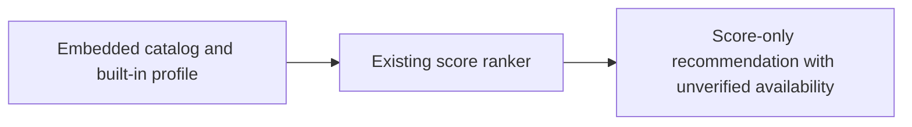

# Restricted offline score-only CLI

`which-model-score-only` is the distinct CLI for the company R1 pilot. It ranks
models from an embedded catalog using the existing built-in ranking profiles.
It needs no provider credentials, first-run download or managed runtime profile.
The normal `which-model --no-usage` invocation and full `nousage` build have a
broader command surface; select the distinctly named artifact for this pilot.



## Commands and boundaries

```sh
which-model-score-only capabilities --json
which-model-score-only profiles --json
which-model-score-only pick --profile balanced_implementation --top 3 --json
which-model-score-only version --json
```

`--top` includes the recommendation itself. Ranking requires the existing
mandatory Tier 1 scores; optional-data warnings remain in the result. JSON
includes `usage_enabled: false`, `usage_disabled_reason: "compiled_out"`, input
hashes and an explicit notice that provider availability/allowances are unverified.
Identical bundled inputs and flags produce byte-identical recommendations.

Only these commands and help are accepted. The binary does not load user/project
configuration, read credentials, contact a provider, start a child process,
install skills/hooks, refresh the catalog or persist history. Unknown commands,
extra positionals and unsupported flags exit 2 before work. Environment and
configuration cannot add excluded capabilities. This is a separate command built
with `nousage`, with imports and linked symbols audited in CI; it does not call
the full CLI application service. Shared library types and Go runtime OS
initialization remain present and are not represented as product permissions.

## Installation and verification

The release assets use these distinct names:

| Platform | Artifact |
|---|---|
| macOS Apple Silicon | `which-model-score-only-darwin-arm64` |
| macOS Intel | `which-model-score-only-darwin-x64` |
| Linux arm64 | `which-model-score-only-linux-arm64` |
| Linux x64 | `which-model-score-only-linux-x64` |
| Windows x64 | `which-model-score-only-windows-x64.exe` |

Follow [release verification](release-verification.md) using the independently
approved version, full commit, ref and trusted verification tools. The same
`verify-release.js` command verifies the full and restricted assets, SBOMs and
capability manifest; it rejects missing or changed evidence. Verification can
take place on an administrator's connected machine, or offline with separately
exported trust roots. The ranking binary itself needs neither Node nor GitHub CLI.

After verification, install only the selected restricted binary in the company's
protected application directory (rename to `which-model-score-only` on POSIX or
`which-model-score-only.exe` on Windows). Grant execute permission on POSIX after
verification. Compare its `capabilities --json` output byte-for-byte with the
verified `which-model-score-only-capabilities.json` before approving the install.
Retain the source/ref, digest, SBOM and verification evidence in the company
software inventory. Full npm packages continue to install the full product.

Endpoint administrators must control executable replacement and installation of
the full product or alternate harnesses. OS network-deny rules can independently
enforce offline operation. A same-user actor who can replace the binary is outside
the [local application identity boundary](company-identity.md). No app RBAC or
central credential broker is introduced.

## Bundled data and update route

The selected input is the repository's current
[`available_model_scores.csv`](../../data/available_model_scores.csv), plus
[`pick.Profiles`](../../internal/pick/profiles.go). Each release records the full
source commit, exact catalog bytes' SHA-256 and deterministic JSON profile hash
in its capability manifest and each restricted SBOM. LF checkout is pinned for
the embedded CSV so Windows and POSIX build the same input bytes. The catalog
has missing benchmark cells; excluded candidates and warnings expose that fact.

An update requires a reviewed catalog/profile source change, release build and
fresh artifact verification. There is no runtime `--catalog` path or network
update fallback. Restricted builds use `CGO_ENABLED=0`, `-trimpath`,
`-buildvcs=false`, `-tags nousage`, pinned release Go and explicit version/source
linker values, without a build-date stamp. Rebuilding with the same source, Go
toolchain, OS/architecture and these flags should reproduce the binary digest.

The full catalog pipeline uses upstream model/benchmark sources including
Artificial Analysis; this artifact packages repository-derived scores, not a
fresh authoritative statement by those providers. Repository MIT licensing alone
does not establish upstream data redistribution permission. Before distribution,
the release owner records the catalog source/terms review, redistribution approval,
chosen snapshot and approved update route. The company separately decides whether
that evidence and data quality meet its pilot requirements. Neither decision is
inferred from a signature, successful test or candidate build.

## Verification evidence

`bash scripts/audit-score-only.sh` tests every built-in profile against the
existing ranker, deterministic output, refusals, import/linked-symbol exclusions,
provider-endpoint absence and hostile configuration/credential canaries.
It runs natively on macOS, Windows and Linux in CI.

Linux CI additionally runs `scripts/score_only_smoke.py --trace` inside a separate
network namespace. It tests ranking with no credential environment and with
synthetic credential/config/PATH overrides, checks that the canary filesystem is
unchanged, and rejects network calls, credential/config probes, non-thread process
creation or additional executable launches in the syscall trace. Thread creation
and the initial restricted executable invocation are expected. Release candidate
verification also checks all five restricted binaries, SBOMs and input bindings.

This evidence addresses #290's application boundary. Company acceptance and data
rights remain recorded separately; no live provider capability is being approved.
