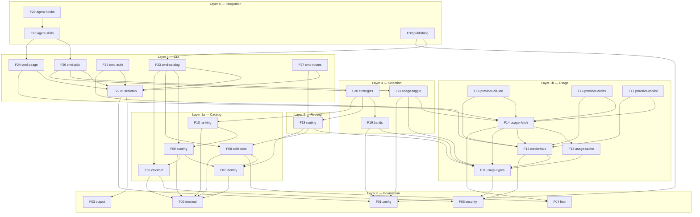

# Feature Dependency Graph

## 1. Graph

## 2. Adjacency list

`depends_on` lists the features that MUST be complete before this feature starts.

| Feature | Title | Milestone | depends_on | blocks |
|---|---|---|---|---|
| F01 | config | M1 | — | F19, F21, F22, F30 |
| F02 | decimal | M1 | — | F06, F07, F08, F09, F10 |
| F03 | output | M1 | — | F22 |
| F04 | http | M1 | — | F08, F14 |
| F05 | security | M1 | — | F06, F11, F12 |
| F06 | csvstore | M1 | F02, F05 | F09, F23 |
| F07 | identity | M1 | F02 | F08, F09, F18 |
| F08 | collectors | M1 | F02, F04, F07 | F18, F23 |
| F09 | scoring | M1 | F02, F06, F07 | F10, F23 |
| F10 | ranking | M1 | F02, F09 | F20 |
| F11 | usage-types | M2 | F05 | F12, F13, F14, F18, F19, F21 |
| F12 | credentials | M2 | F05, F11 | F14, F15, F16, F17, F25 |
| F13 | usage-cache | M2 | F11 | F14 |
| F14 | usage-fetch | M2 | F04, F11, F12, F13 | F15, F16, F17, F21, F24 |
| F15 | provider-claude | M2 | F12, F14 | — |
| F16 | provider-codex | M2 | F12, F14 | — |
| F17 | provider-copilot | M2 | F12, F14 | — |
| F18 | routing | M3 | F07, F08, F11 | F20, F27 |
| F19 | bands | M4 | F01, F11 | F20 |
| F20 | strategies | M4 | F10, F18, F19 | F26 |
| F21 | usage-toggle | M4 | F01, F11, F14 | F26 |
| F22 | cli-skeleton | M1 | F01, F03 | F23, F24, F25, F26, F27 |
| F23 | cmd-catalog | M1 | F06, F08, F09, F22 | F30 |
| F24 | cmd-usage | M2 | F14, F22 | F28 |
| F25 | cmd-auth | M2 | F12, F22 | — |
| F26 | cmd-pick | M4 | F20, F21, F22 | F28 |
| F27 | cmd-routes | M3 | F18, F22 | — |
| F28 | agent-skills | M6 | F24, F26 | F29 |
| F29 | agent-hooks | M6 | F28 | — |
| F30 | publishing | M6 | F01, F23 | — |

## 3. Parallel waves

An orchestrator can run any task whose `depends_on` tasks are all complete. The widest parallelism per wave:

| Wave | Runnable features | Notes |
|---|---|---|
| W1 | F01, F02, F03, F04, F05 | 5-wide, zero deps |
| W2 | F06, F07, F11, F22 | F22 needs F01+F03; F11 needs F05 |
| W3 | F08, F12, F13, F19 | as deps land |
| W4 | F09, F14 | |
| W5 | F10, F15, F16, F17, F21 | provider adapters parallel |
| W6 | F18, F24, F25 | F18 needs F08 |
| W7 | F20, F23, F27 | |
| W8 | F26, F30 | |
| W9 | F28 | |
| W10 | F29 | |

Within a feature, TASKS.md declares its own intra-feature task DAG; the same rule applies at task granularity.

## 4. Milestone → feature map

| Milestone | Features | Done when |
|---|---|---|
| M1 | F01–F10, F22, F23 | `which-model catalog refresh && which-model pick --profile balanced_implementation --json` reproduces `rank_models.py` byte-for-byte on committed data |
| M2 | F11–F17, F24, F25 | `which-model usage --all --json` returns live snapshots; Claude/Codex/Copilot match Node script values |
| M3 | F18, F27 | `which-model routes verify` reports coverage; unrouted score rows listed, not dropped |
| M4 | F19, F20, F21, F26 | every strategy verified vs fixtures; concurrent round-robin provably rotates; `nousage` binary contains no provider endpoint constants |
| M6 | F28, F29, F30 | agent completes a dispatch using only skills; generated workflow refreshes data and opens auto-merging PR |

M1 and M2 run in parallel (both depend only on W1). The §7.4 scoring-research track (R1) gates no feature.
