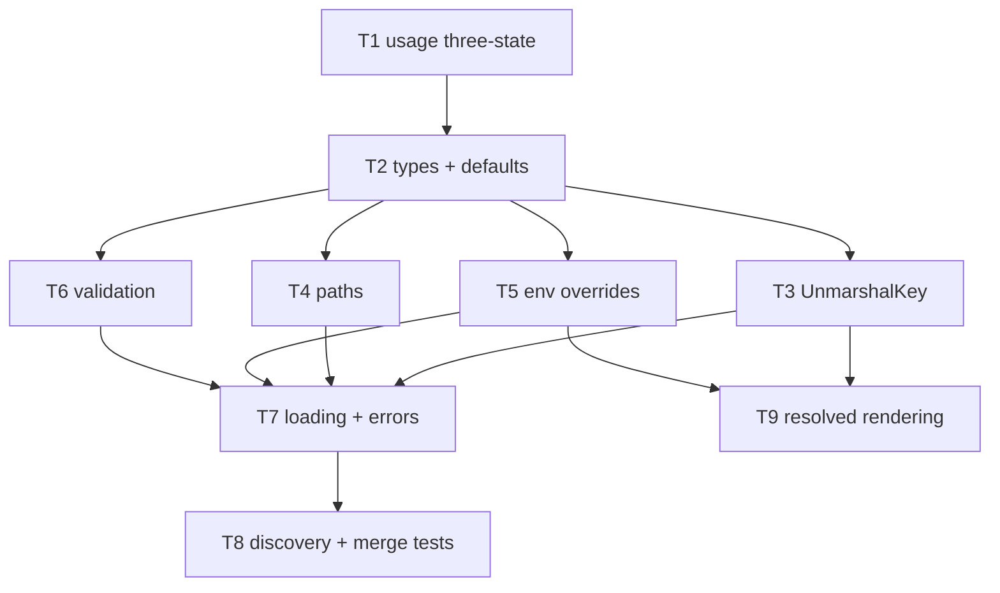

# F01 — config: Tasks

## Task graph



## Task F01-T1: Implement the `[usage] enabled` three-state

**Depends on:** none
**Files:**
- create `internal/config/usage.go`
- create `internal/config/usage_test.go`
- create `go.mod` + `go.sum` (module init, first task of the whole repo)

**Spec references:** `specs/features/F01-config/SPEC.md` §6, §13; `specs/global/CONTRACTS.md` §5.1; `docs/plan/annex-d-cli-reference.md` §4.2 (`[usage]`); `docs/plan/README.md` §6.1

**Instructions:**
1. Run `go mod init github.com/WD-Mitchell/which-model` in the repo root. If `go.mod` already exists (another feature initialized it first), skip this step. Then run `go get github.com/BurntSushi/toml@latest` and `go get github.com/shopspring/decimal@latest` (idempotent; go.sum is written automatically).
2. Create `internal/config/usage_test.go` FIRST (package `config`, white-box — same package, not `_test`), with the test cases below. Run `go test ./internal/config/...` and confirm it fails to compile (package `config` does not exist yet) — that is the expected red state.
3. Create `internal/config/usage.go` (package `config`). Copy the type and constants VERBATIM from `specs/global/CONTRACTS.md` §5.1 — do not rename, reorder, or add constants:
   ```go
   type UsageEnabled string

   const (
       UsageAuto  UsageEnabled = "auto"  // enabled iff ≥1 provider enabled
       UsageTrue  UsageEnabled = "true"
       UsageFalse UsageEnabled = "false"
   )
   ```
4. Implement `func ParseUsageEnabled(s string) (UsageEnabled, error)`: return `UsageAuto`/`UsageTrue`/`UsageFalse` for exactly `"auto"`/`"true"`/`"false"` (case-sensitive); otherwise return an error whose message is `config: usage.enabled must be one of "auto", "true", "false"; got <s>`.
5. Implement `func (u *UsageEnabled) UnmarshalTOML(v interface{}) error` with a type switch: `bool` → set `UsageTrue` (true) or `UsageFalse` (false); `string` → call `ParseUsageEnabled`; any other type → error `config: usage.enabled must be a boolean or the string "auto"`. BurntSushi/toml calls this method for the `[usage] enabled = …` value because the type implements its `Unmarshaler` interface (checked before `encoding.TextUnmarshaler` in v1.4.0 decode order — do not add `UnmarshalText`).
6. Run `go test ./internal/config/...` and confirm all cases pass.

**Test cases (write these first):**

| # | input | want |
|---|---|---|
| 1 | `ParseUsageEnabled("auto")` | `UsageAuto`, no error |
| 2 | `ParseUsageEnabled("true")` | `UsageTrue`, no error |
| 3 | `ParseUsageEnabled("false")` | `UsageFalse`, no error |
| 4 | `ParseUsageEnabled("on")` | error (message contains `usage.enabled`) |
| 5 | `ParseUsageEnabled("TRUE")` | error (case-sensitive) |
| 6 | `(&u).UnmarshalTOML(true)` | `UsageTrue`, no error |
| 7 | `(&u).UnmarshalTOML(false)` | `UsageFalse`, no error |
| 8 | `(&u).UnmarshalTOML("auto")` | `UsageAuto`, no error |
| 9 | `(&u).UnmarshalTOML("banana")` | error |
| 10 | `(&u).UnmarshalTOML(int64(1))` | error |

**Acceptance criteria:**
- [ ] `go build ./internal/config/...` succeeds
- [ ] `go test ./internal/config/...` passes with the 10 cases above
- [ ] no file outside the Files list modified

**Run:** `go test ./internal/config/...`

## Task F01-T2: Define the Config struct, provider config, defaults, and errors

**Depends on:** F01-T1
**Files:**
- create `internal/config/types.go`
- create `internal/config/types_test.go`

**Spec references:** `specs/features/F01-config/SPEC.md` §6, §7, §11; `specs/features/F01-config/CONTRACTS.md` §1.2, §1.3; `docs/plan/annex-d-cli-reference.md` §4.2; `docs/plan/README.md` §6.2 (default-deny); `specs/global/CONTRACTS.md` §5.1

**Instructions:**
1. Create `internal/config/types_test.go` FIRST with the test cases below; run `go test ./internal/config/...`, confirm the red state (compilation failure), then implement.
2. Create `internal/config/types.go` (package `config`) with exactly these exported types (fields and toml tags verbatim; toml tags are required for BurntSushi/toml and for the env-overlay walk in F01-T3):
   ```go
   type Config struct {
       Usage     UsageConfig
       Providers map[string]ProviderConfig
       raw map[string]any    // merged TOML document from all file layers
       env map[string]string // WHICH_MODEL_* overlay, keyed by env var name
   }

   type UsageConfig struct {
       Enabled UsageEnabled `toml:"enabled"`
   }

   type ProviderConfig struct {
       Enabled               bool            `toml:"enabled"`
       Priority              int             `toml:"priority"`
       Weight                decimal.Decimal `toml:"weight"`
       CacheTTL              time.Duration   `toml:"cache_ttl"`
       SourcePreference      []string        `toml:"source_preference"`
       CredentialPath        string          `toml:"credential_path"`
       TrustedFallbackOrigin string          `toml:"trusted_fallback_origin"`
   }
   ```
   Import `"github.com/shopspring/decimal"` and `"time"`. The `raw`/`env` fields are unexported; `raw` is nil for a `Default()` config and `env` is nil until `ApplyEnv` runs (F01-T5) — every reader must handle nil maps as empty.
3. Implement `func Default() *Config`: `Usage.Enabled = UsageAuto`; `Providers = make(map[string]ProviderConfig)` (non-nil, empty — default-deny); `raw` and `env` nil.
4. Implement the error type:
   ```go
   type ErrorKind int

   const (
       KindNotFound ErrorKind = iota // explicitly requested file does not exist
       KindUnreadable                // file exists but cannot be read
       KindInvalidTOML               // TOML does not parse
       KindInvalidValue              // unknown key / bad value / bad env override
   )

   type ConfigError struct {
       Kind ErrorKind
       Path string
       Key  string
       Err  error
   }
   ```
   with:
   - `func (e *ConfigError) Error() string` — `config: <path>: <message>` where `<message>` is: `file not found` (KindNotFound), `unreadable: <err>` (KindUnreadable), `invalid TOML: <err>` (KindInvalidTOML), `invalid value for <Key>: <err-or-msg>` (KindInvalidValue; when `Err` is nil use `Key` alone). Omit the path part when `Path` is empty.
   - `func (e *ConfigError) Unwrap() error` — returns `Err`.
   - `func (e *ConfigError) ExitCode() int` — returns `2` unconditionally (`specs/global/SPEC.md` §5: exit 2 = argument/config error).
5. Run `go test ./internal/config/...` and confirm all cases pass.

**Test cases (write these first):**

| # | input | want |
|---|---|---|
| 1 | `Default().Usage.Enabled` | `UsageAuto` |
| 2 | `Default().Providers` | non-nil map, `len == 0` (default-deny) |
| 3 | two calls `Default()` | distinct instances: mutating the second's `Usage.Enabled` does not change the first |
| 4 | `(&ConfigError{Kind: KindNotFound, Path: "/x.toml"}).ExitCode()` | `2` (repeat for all four kinds — 4 subtests) |
| 5 | `(&ConfigError{Kind: KindNotFound, Path: "/x.toml"}).Error()` | contains `"/x.toml"` and `"not found"` |
| 6 | `(&ConfigError{Kind: KindInvalidValue, Key: "usage.enabled", Err: errors.New("bad")}).Error()` | contains `"usage.enabled"` and `"bad"` |
| 7 | `errors.Unwrap(&ConfigError{Kind: KindInvalidValue, Err: errors.New("cause")})` | equals the wrapped error; `errors.As(err, &ce)` on a wrapped chain yields the `*ConfigError` |

**Acceptance criteria:**
- [ ] `go build ./internal/config/...` succeeds
- [ ] `go test ./internal/config/...` passes with the cases above
- [ ] no file outside the Files list modified

**Run:** `go test ./internal/config/...`

## Task F01-T3: Implement `UnmarshalKey` and single-file layer decoding

**Depends on:** F01-T2
**Files:**
- create `internal/config/unmarshal.go`
- create `internal/config/unmarshal_test.go`

**Spec references:** `specs/features/F01-config/SPEC.md` §3, §9, §10, §12; `specs/features/F01-config/CONTRACTS.md` §1.4 (`DecodeFile`), §1.7; `docs/plan/annex-d-cli-reference.md` §4.1 (merge), §4.4 (env mapping); `docs/plan/README.md` §6

**Instructions:**
1. Create `internal/config/unmarshal_test.go` FIRST (white-box `package config`), including the helper `writeFile(t, dir, name, content)` that writes into a `t.TempDir()`, and the test structs below. Run `go test ./internal/config/...`, confirm red, then implement.
2. Add to the test file a small struct for the decimal + defaults cases:
   ```go
   type testScoring struct {
       Normalizer string `toml:"normalizer"`
       Aggregator string `toml:"aggregator"`
   }
   type testCatalog struct {
       CacheTTL time.Duration `toml:"cache_ttl"`
       Budget   *decimal.Decimal `toml:"budget"` // pointer: unset-vs-zero semantics
       Publish  struct {
           Schedule string `toml:"schedule"`
       } `toml:"publish"`
   }
   type testCustom struct {
       Weight decimal.Decimal `toml:"weight"`
   }
   ```
3. Implement `func (c *Config) DecodeFile(path string) error` in `unmarshal.go` (exported; used by `Load`/`LoadFile` in F01-T7 and by this task's tests):
   - `os.ReadFile(path)`; on error, if `os.IsNotExist` → `&ConfigError{Kind: KindNotFound, Path: path}`; otherwise → `&ConfigError{Kind: KindUnreadable, Path: path, Err: err}`.
   - `var layer map[string]any; md, err := toml.Decode(string(data), &layer)`; on error → `&ConfigError{Kind: KindInvalidTOML, Path: path, Err: err}`.
   - Merge `layer` into `c.raw` (creating it if nil) with `mergeRaw(dst, src map[string]any)`: for each `k, v` in `src`, if `dst[k]` exists and both values are `map[string]any`, recurse; otherwise `dst[k] = v` (slices and scalars REPLACE — this is the "higher layer overrides whole section" rule).
   - Typed decode of `[usage]`: `node := rawLookup(layer, "usage")` (walk the dotted path through `map[string]any`; missing → skip). Marshal the subtree with `toml.Marshal(node)`, then `md2, err := toml.Decode(text, &c.Usage)` (decode-into-existing: absent keys keep current values). On decode error → `KindInvalidTOML`; then `u := md2.Undecoded()`; the first undecoded key → `&ConfigError{Kind: KindInvalidValue, Path: path, Key: "usage." + k}`.
   - Typed decode of `[providers]`: same pattern with `rawLookup(layer, "providers")` decoding into `c.Providers` (decode into the EXISTING map so layers merge per provider id and per key). Undecoded key `k` → `KindInvalidValue`, `Key: "providers." + k`.
   - Return nil.
4. Implement `func (c *Config) UnmarshalKey(key string, out any) error`:
   - `node := rawLookup(c.raw, key)`; nil (or `c.raw` nil) → return nil (missing key = zero value, out untouched).
   - `table, ok := node.(map[string]any)`; if not → `&ConfigError{Kind: KindInvalidValue, Key: key, Err: errors.New("not a table")}`.
   - `text, err := toml.Marshal(table)`; error → `KindInvalidValue` (unreachable in practice).
   - `md, err := toml.Decode(text, out)`; error → `&ConfigError{Kind: KindInvalidValue, Key: key, Err: err}` (malformed values inside the subtree). First `md.Undecoded()` key `k` → `&ConfigError{Kind: KindInvalidValue, Key: key + "." + k}` (unknown key inside the subtree).
   - Env overlay (only when `c.env` is non-empty): reflect-walk `out` (see step 5) and set every field whose dotted path is present in `c.env`; then reject any `c.env` key with `strings.HasPrefix(k, key + ".")` that was NOT matched by the walk → `&ConfigError{Kind: KindInvalidValue, Key: k}`.
   - Return nil.
5. Implement the reflection walk as a private helper, e.g. `applyEnvOverlay(env map[string]string, out reflect.Value, prefix string, matched map[string]bool) error`, with EXACTLY these rules:
   - `out` is a settable struct value; iterate its fields.
   - Skip unexported fields (not settable). Read the `toml` struct tag; skip fields with no tag or `"-"`; take the tag up to the first `,` as the segment name.
   - Compute `path := prefix + "." + segment`. `c.env` is keyed by DOTTED path (F01-T5 stores it that way), so `envName := path` — there is no name re-encoding at this layer.
   - If `val, ok := env[envName]`: mark `matched[envName] = true`. Resolve pointers first: if `field.Kind() == reflect.Ptr`, allocate when nil (`field.Set(reflect.New(field.Type().Elem()))` — the caller's unset-vs-zero semantics survive: an env override always creates the value) and set `target = field.Elem()`; else `target = field`. If the element type is a slice, map, or non-unmarshaler struct, skip silently without allocating (arrays are not env-addressable). Then parse `val` into `target` by target type, in this order:
     1. `target.Type() == reflect.TypeOf(time.Duration(0))` → `time.ParseDuration(val)`.
     2. `target.Addr().Type().Implements(textUnmarshalerType)` (where `textUnmarshalerType = reflect.TypeOf((*encoding.TextUnmarshaler)(nil)).Elem()`) → call `target.Addr().Interface().(encoding.TextUnmarshaler).UnmarshalText([]byte(val))` (this is how `decimal.Decimal`, `*decimal.Decimal`, and any owning-feature decimal type decode).
     3. kind `String` → `target.SetString(val)`.
     4. kind `Bool` → `strconv.ParseBool(val)`.
     5. kind `Int` → `strconv.ParseInt(val, 10, 64)`, `target.SetInt`.
     6. Any other kind → skip silently.
   - Any parse error → `&ConfigError{Kind: KindInvalidValue, Key: envName, Err: err}`.
   - If the (dereferenced) field is an addressable struct that is NOT `time.Duration` and does NOT implement `encoding.TextUnmarshaler`, recurse with `prefix = path`.
   - The initial call is `applyEnvOverlay(c.env, reflect.ValueOf(out).Elem(), key, matched)`; after it returns, every `c.env` key with `strings.HasPrefix(k, key + ".")` that is NOT in `matched` → `&ConfigError{Kind: KindInvalidValue, Key: k}` (an override that names no field of the owning struct).
6. Run `go test ./internal/config/...` and confirm all cases pass.

**Test cases (write these first):**

| # | input | want |
|---|---|---|
| 1 | file with `[scoring]` `normalizer = "minmax-linear"`, `aggregator = "weighted-arithmetic-mean"`; `cfg.DecodeFile(f)` then `cfg.UnmarshalKey("scoring", &s)` | no error; `s.Normalizer == "minmax-linear"`, `s.Aggregator == "weighted-arithmetic-mean"` |
| 2 | file with `[catalog.publish]` `schedule = "0 6 * * *"`; `UnmarshalKey("catalog", &c)` | `c.Publish.Schedule == "0 6 * * *"` (nested table decodes) |
| 3 | file with `[scoring]` only; `UnmarshalKey("nonexistent", &s)` | nil error; `s` remains zero value |
| 4 | file with top-level `cache_ttl = "1h"` (scalar); `UnmarshalKey("cache_ttl", &s)` | error; `errors.As` → `*ConfigError` with `Kind == KindInvalidValue` and `ExitCode() == 2` |
| 5 | file with `[scoring]` + `banana = 1`; `UnmarshalKey("scoring", &s)` | error, `Kind == KindInvalidValue`, `Key == "scoring.banana"` |
| 6 | file with `[catalog.publish]` + `banana = 1`; `UnmarshalKey("catalog", &c)` | error, `Key == "catalog.publish.banana"` |
| 7 | file with `[custom]` `weight = 0.85`; `UnmarshalKey("custom", &tc)` | no error; `tc.Weight.String() == "0.85"` (decimal decodes via TextUnmarshaler, never float) |
| 8 | `cfg.DecodeFile(f)` where `f` contains `[usage` (truncated) | error, `Kind == KindInvalidTOML` |
| 9 | `cfg` with `cfg.env = map[string]string{"catalog.cache_ttl": "1h", "catalog.budget": "2.5"}` (dotted keys); `UnmarshalKey("catalog", &c)` on a file with `[catalog]` only | `c.CacheTTL == time.Hour` AND `c.Budget != nil` with `c.Budget.String() == "2.5"` (pointer field allocated + decimal overlay) |
| 10 | `cfg.env = {"catalog.cache_ttl": "banana"}`; `UnmarshalKey("catalog", &c)` | error, `Key == "catalog.cache_ttl"` |
| 11 | `cfg.env = {"catalog.cache_tl": "1h"}` (typo); `UnmarshalKey("catalog", &c)` | error, `Key == "catalog.cache_tl"` (unmatched override under the subtree) |
| 12 | `out := testScoring{Normalizer: "keep-me"}`; file `[scoring]` sets only `aggregator`; `UnmarshalKey("scoring", &out)` | no error; `out.Normalizer == "keep-me"` (caller defaults preserved) |

**Acceptance criteria:**
- [ ] `go build ./internal/config/...` succeeds
- [ ] `go test ./internal/config/...` passes with the 12 cases above
- [ ] no file outside the Files list modified

**Run:** `go test ./internal/config/...`

## Task F01-T4: Resolve data directories and the project-config walk

**Depends on:** F01-T2
**Files:**
- create `internal/config/paths.go`
- create `internal/config/paths_test.go`

**Spec references:** `specs/features/F01-config/SPEC.md` §4, §5; `specs/features/F01-config/CONTRACTS.md` §1.5; `docs/plan/annex-d-cli-reference.md` §4.5 (path table), §4.1 (project walk)

**Instructions:**
1. Create `internal/config/paths_test.go` FIRST with the cases below (use `t.TempDir()` for the walk cases; create a `.git` directory to mark a git root); confirm red, then implement.
2. Create `internal/config/paths.go` (package `config`) with:
   ```go
   type Paths struct {
       UserConfigFile string
       ConfigDir      string
       CacheDir       string
       StateDir       string
   }

   func ResolvePaths(goos, home string, getenv func(string) string) Paths
   ```
   Rules (annex-d §4.5, verbatim): if `goos == "darwin"`, ignore `getenv` entirely: `ConfigDir = home + "/Library/Application Support/which-model"`, `UserConfigFile = ConfigDir + "/config.toml"`, `CacheDir = home + "/Library/Caches/which-model"`, `StateDir = ConfigDir + "/state"`. Otherwise: `configBase = getenv("XDG_CONFIG_HOME")`, default `home + "/.config"` when empty; `cacheBase = getenv("XDG_CACHE_HOME")`, default `home + "/.cache"`; `stateBase = getenv("XDG_STATE_HOME")`, default `home + "/.local/state"`; then `ConfigDir = configBase + "/which-model"`, `UserConfigFile = ConfigDir + "/config.toml"`, `CacheDir = cacheBase + "/which-model"`, `StateDir = stateBase + "/which-model"`.
3. Implement `func UserConfigFile(goos, home string, getenv func(string) string) string` as `ResolvePaths(goos, home, getenv).UserConfigFile` (single source of truth).
4. Implement `func ProjectConfigFile(cwd, home string) (string, bool)`:
   - `dir := cwd`; loop: `candidate := filepath.Join(dir, ".which-model", "config.toml")`; if it is a regular readable file (`os.Stat` succeeds and `!IsDir`) → return `(candidate, true)`.
   - Then stop conditions, in order: if `dir` contains `.git` (file OR directory — `os.Stat(dir + "/.git")` succeeds) → return `("", false)`; if `dir == home` → return `("", false)`; if `dir == filepath.Dir(dir)` (filesystem root) → return `("", false)`.
   - Else `dir = filepath.Dir(dir)` and repeat.
   - The git-root directory itself IS checked for `.which-model/config.toml` before the stop.
5. Run `go test ./internal/config/...` and confirm all cases pass.

**Test cases (write these first):**

| # | input | want |
|---|---|---|
| 1 | `ResolvePaths("darwin", "/Users/w", g)` | `ConfigDir == "/Users/w/Library/Application Support/which-model"` |
| 2 | same | `CacheDir == "/Users/w/Library/Caches/which-model"` |
| 3 | same | `StateDir == "/Users/w/Library/Application Support/which-model/state"` |
| 4 | `ResolvePaths("darwin", "/Users/w", g)` with `g("XDG_CONFIG_HOME") == "/xdg"` | macOS paths unchanged (darwin ignores `XDG_*`) |
| 5 | `ResolvePaths("linux", "/home/w", g)` with `g("XDG_CONFIG_HOME") == "/xdg/cfg"`, others unset | `ConfigDir == "/xdg/cfg/which-model"`, `UserConfigFile == "/xdg/cfg/which-model/config.toml"` |
| 6 | same but `g("XDG_CACHE_HOME") == "/xdg/ca"`, `g("XDG_STATE_HOME") == "/xdg/st"` | `CacheDir == "/xdg/ca/which-model"`, `StateDir == "/xdg/st/which-model"` |
| 7 | `ResolvePaths("linux", "/home/w", g)` all XDG unset | `/home/w/.config/which-model`, `/home/w/.cache/which-model`, `/home/w/.local/state/which-model` |
| 8 | `UserConfigFile("linux", "/home/w", g)` all unset | `/home/w/.config/which-model/config.toml` (equals `ResolvePaths(...).UserConfigFile`) |
| 9 | sandbox: `cwd` contains `.which-model/config.toml` | `ProjectConfigFile(cwd, home)` → `(cwd/.which-model/config.toml, true)` |
| 10 | sandbox: config at git root, `cwd` = git-root/deep/sub | walk finds `(gitroot/.which-model/config.toml, true)` |
| 11 | sandbox: config ABOVE the git root (`gitroot-parent/.which-model/config.toml`), git root at `cwd` | `("", false)` (walk stops at git root) |
| 12 | sandbox: no config anywhere, no git root, `cwd` under `home` | `("", false)` (walk stops at home); also returns `("", false)` when `cwd == home` |

**Acceptance criteria:**
- [ ] `go build ./internal/config/...` succeeds
- [ ] `go test ./internal/config/...` passes with the 12 cases above
- [ ] no file outside the Files list modified

**Run:** `go test ./internal/config/...`

## Task F01-T5: Apply `WHICH_MODEL_*` environment overrides

**Depends on:** F01-T2
**Files:**
- create `internal/config/env.go`
- create `internal/config/env_test.go`

**Spec references:** `specs/features/F01-config/SPEC.md` §8; `specs/features/F01-config/CONTRACTS.md` §1.6, §3; `docs/plan/annex-d-cli-reference.md` §1.1a (prefix), §4.1 item 2, §4.4

**Instructions:**
1. Create `internal/config/env_test.go` FIRST with the cases below (white-box; pass an explicit `environ` slice and a `getenv` func backed by a `map[string]string`); confirm red, then implement.
2. Create `internal/config/env.go` (package `config`) with:
   ```go
   func ApplyEnv(c *Config, getenv func(string) string, environ []string) error
   ```
   - `lookup := getenv`; if nil → `lookup = os.Getenv`. `envs := environ`; if nil → `envs = os.Environ()`.
   - Initialize `c.env` (create the map if nil).
   - Declare the closed vocabulary (D14) as a package-level set:
     ```go
     var envKeys = map[string]bool{
         "enabled": true, "priority": true, "weight": true, "cache_ttl": true,
         "credential_path": true, "trusted_fallback_origin": true,
         "default": true, "default_profile": true, "tier1_share": true, "tier2_share": true,
         "direction": true, "gate_above_used_percent": true,
         "normalizer": true, "aggregator": true,
         "raw_csv_path": true, "scores_csv_path": true, "provider_config_path": true,
         "benchmark_config_path": true, "warn_on_stale_scores": true,
         "schedule": true, "timezone": true, "mode": true, "auto_merge": true,
         "merge_method": true, "commit_message": true, "pr_title": true, "run_tests": true,
         "color": true, "timestamps": true, "identity_default": true,
     }
     ```
     (This table is the full env-addressable scalar key set of `docs/plan/annex-d-cli-reference.md` §4.2; arrays like `bands.tier`, `catalog.publish.branches` are excluded — §4.4. The vocabulary test asserts every var in the CONTRACTS §3 table resolves and the table has no duplicate suffixes.)
   - For each `entry` in `envs`: split on the first `=`. Skip names without `=` or not starting with `WHICH_MODEL_`. Skip `WHICH_MODEL_CONFIG` (path override, consumed by `Load`).
   - Resolve the dotted key: `rest := strings.ToLower(strings.TrimPrefix(name, "WHICH_MODEL_"))`; find the LONGEST suffix of `rest` that is a key in `envKeys` (try each `strings.LastIndex(rest, "_")` cut, longest first); the part before the suffix is the section path. No suffix matches → `&ConfigError{Kind: KindInvalidValue, Key: name}` (unknown or non-addressable var — eager, D14).
   - Decode the section path: split the remainder on `_` and join with `.`; if it starts with `providers.`, the id is the rest of the path with `.` re-joined as `-` (kebab-case, e.g. `providers_github_copilot` → `providers.github-copilot`). Full key = `sectionPath + "." + keyName` (e.g. `WHICH_MODEL_BANDS_GATE_ABOVE_USED_PERCENT` → `bands.gate_above_used_percent`; `WHICH_MODEL_CATALOG_PUBLISH_SCHEDULE` → `catalog.publish.schedule`; `WHICH_MODEL_STRATEGY_DEFAULT_PROFILE` → `strategy.default_profile` — the longest-suffix rule resolves underscore ambiguity).
   - If the key is F01-typed (`usage.enabled`, or `providers.<id>.<key>` with key ∈ `enabled, priority, weight, cache_ttl, credential_path, trusted_fallback_origin`): `value := lookup(name)`; parse per key: `usage.enabled` → `ParseUsageEnabled(value)` (three-state, F01-T1); `providers.<id>.enabled` → `strconv.ParseBool`; `priority` → `strconv.Atoi`; `weight` → `decimal.NewFromString`; `cache_ttl` → `time.ParseDuration`; `credential_path`/`trusted_fallback_origin` → string as-is. Parse error → `&ConfigError{Kind: KindInvalidValue, Key: name, Err: err}`. For providers, copy `p := c.Providers[id]` (zero value when absent), set the field, write back `c.Providers[id] = p`.
   - Otherwise (generic key): store `c.env[key] = lookup(name)` — dotted key → raw value; `UnmarshalKey` applies it against the owning feature's struct (F01-T3).
3. Run `go test ./internal/config/...` and confirm all cases pass.

**Test cases (write these first):**

| # | input | want |
|---|---|---|
| 1 | environ `["WHICH_MODEL_USAGE_ENABLED=true"]` | `c.Usage.Enabled == UsageTrue`, no error |
| 2 | environ `["WHICH_MODEL_USAGE_ENABLED=banana"]` | error; `Key == "WHICH_MODEL_USAGE_ENABLED"`; `ExitCode() == 2` |
| 3 | environ `["WHICH_MODEL_PROVIDERS_CLAUDE_ENABLED=true"]` | `c.Providers["claude"].Enabled == true`, no error |
| 4 | environ `["WHICH_MODEL_PROVIDERS_GITHUB_COPILOT_ENABLED=true"]` | `c.Providers["github-copilot"].Enabled == true` (id `-` → `_` round-trip) |
| 5 | environ `["WHICH_MODEL_PROVIDERS_CLAUDE_PRIORITY=5"]` | `c.Providers["claude"].Priority == 5` |
| 6 | environ `["WHICH_MODEL_PROVIDERS_CLAUDE_WEIGHT=0.85"]` | `c.Providers["claude"].Weight.String() == "0.85"` |
| 7 | environ `["WHICH_MODEL_PROVIDERS_CLAUDE_CACHE_TTL=5m"]` | `c.Providers["claude"].CacheTTL == 5*time.Minute` |
| 8 | environ `["WHICH_MODEL_PROVIDERS_CLAUDE_CACHE_TTL=banana"]` | error, `Key == "WHICH_MODEL_PROVIDERS_CLAUDE_CACHE_TTL"` |
| 9 | environ `["WHICH_MODEL_PROVIDERS_CLAUDE_ENABLED=banana"]` | error (bool parse), `Key == "WHICH_MODEL_PROVIDERS_CLAUDE_ENABLED"` |
| 10 | environ `["WHICH_MODEL_PROVIDERS_CLAUDE_BANANA=1"]` | error (unknown provider key), `Key == "WHICH_MODEL_PROVIDERS_CLAUDE_BANANA"` |
| 11 | environ `["WHICH_MODEL_CATALOG_BANANA=1"]` | error (no vocabulary match, eager), `Key == "WHICH_MODEL_CATALOG_BANANA"` |
| 12 | environ `["WHICH_MODEL_BANDS_DIRECTION=spread"]` | no error; `c.env["bands.direction"] == "spread"` (dotted-key storage for `UnmarshalKey`) |

**Acceptance criteria:**
- [ ] `go build ./internal/config/...` succeeds
- [ ] `go test ./internal/config/...` passes with the 12 cases above
- [ ] no file outside the Files list modified

**Run:** `go test ./internal/config/...`

## Task F01-T6: Validate the owned config surface

**Depends on:** F01-T2
**Files:**
- create `internal/config/validate.go`
- create `internal/config/validate_test.go`

**Spec references:** `specs/features/F01-config/SPEC.md` §6, §7, §11; `specs/features/F01-config/CONTRACTS.md` §1.8; `docs/plan/README.md` §6.1; `docs/plan/annex-d-cli-reference.md` §4.2 (provider weight)

**Instructions:**
1. Create `internal/config/validate_test.go` FIRST with the cases below; confirm red, then implement.
2. Create `internal/config/validate.go` (package `config`) with `func (c *Config) Validate() error`:
   - `c.Usage.Enabled` must be one of `UsageAuto`/`UsageTrue`/`UsageFalse` (round-trip through `ParseUsageEnabled`; guards programmatically built configs) — violation → `&ConfigError{Kind: KindInvalidValue, Key: "usage.enabled"}`.
   - For each `id, p := range c.Providers` (iterate in sorted id order so the first error is deterministic): empty `id` → `&ConfigError{Kind: KindInvalidValue, Key: "providers.<empty>"}`; `p.Weight.Sign() < 0` → `&ConfigError{Kind: KindInvalidValue, Key: "providers." + id + ".weight"}`; `p.Weight.IsZero()` → normalize by setting `p.Weight = decimal.NewFromInt(1)` and writing back `c.Providers[id] = p` (SPEC §7: absent/0 → 1.0); `p.CacheTTL < 0` → `&ConfigError{Kind: KindInvalidValue, Key: "providers." + id + ".cache_ttl"}`.
   - Return the first error; nil when clean. Validation MUTATES only the documented weight normalization.
3. Run `go test ./internal/config/...` and confirm all cases pass.

**Test cases (write these first):**

| # | input | want |
|---|---|---|
| 1 | `Default()` | nil error |
| 2 | `&Config{Usage: UsageConfig{Enabled: UsageEnabled("banana")}}` | error, `Key == "usage.enabled"` |
| 3 | `&Config{Providers: {"claude": {Weight: decimal.Decimal{}}}}` (zero weight) | nil error AND `Providers["claude"].Weight.String() == "1"` (normalized) |
| 4 | `&Config{Providers: {"claude": {Weight: decimal.NewFromInt(-1)}}}` | error, `Key == "providers.claude.weight"` |
| 5 | `&Config{Providers: {"claude": {CacheTTL: -time.Second}}}` | error, `Key == "providers.claude.cache_ttl"` |
| 6 | `&Config{Providers: {"": {}}}` (empty id) | error, `Key == "providers.<empty>"` |
| 7 | config built by `LoadFile` on a file with `[usage] enabled = true` + `[providers.claude] enabled = true, weight = 0.85` | nil error |

**Acceptance criteria:**
- [ ] `go build ./internal/config/...` succeeds
- [ ] `go test ./internal/config/...` passes with the 7 cases above
- [ ] no file outside the Files list modified

**Run:** `go test ./internal/config/...`

## Task F01-T7: Load files with the full error taxonomy

**Depends on:** F01-T3, F01-T4, F01-T5, F01-T6
**Files:**
- create `internal/config/load.go`
- create `internal/config/load_test.go`

**Spec references:** `specs/features/F01-config/SPEC.md` §2, §3, §9 (error behaviour), §15; `specs/features/F01-config/CONTRACTS.md` §1.4; `specs/global/SPEC.md` §5 (exit 2); `docs/plan/annex-d-cli-reference.md` §4.1, §4.2

**Instructions:**
1. Create `internal/config/load_test.go` FIRST with the cases below (helper: `writeFile(t, dir, name, content)`); confirm red, then implement.
2. Create `internal/config/load.go` (package `config`) with:
   ```go
   type LoadOptions struct {
       Path   string            // --config value (flag declared by F22); "" = discover
       Getenv func(string) string // nil = os.Getenv
       CWD    string            // "" = os.Getwd
       Home   string            // "" = os.UserHomeDir
       GOOS   string            // "" = runtime.GOOS
   }
   ```
3. Implement `func LoadFile(path string) (*Config, error)`: `cfg := Default()`; `err := cfg.DecodeFile(path)`; on error return it; then `cfg.Validate()`; return `cfg`.
4. Implement `func Load(opts LoadOptions) (*Config, error)`:
   - `getenv := opts.Getenv` (nil → `os.Getenv`); `cwd := opts.CWD` (empty → `os.Getwd`); `home := opts.Home` (empty → `os.UserHomeDir`); `goos := opts.GOOS` (empty → `runtime.GOOS`).
   - `explicit := opts.Path`; if empty → `explicit = getenv("WHICH_MODEL_CONFIG")`.
   - If `explicit != ""`: `cfg, err := LoadFile(explicit)`; on error return it (missing file → `KindNotFound` — the env path is an explicit request). Apply `ApplyEnv(cfg, getenv, nil)`; on error return; `cfg.Validate()`; return `cfg`.
   - Else: `cfg := Default()`. `userFile := UserConfigFile(goos, home, getenv)`; if it exists (stat succeeds, regular file) → `cfg.DecodeFile(userFile)` (errors propagate — a discovered but malformed/unreadable file is loud, SPEC error behaviour). `projectFile, found := ProjectConfigFile(cwd, home)`; if found → `cfg.DecodeFile(projectFile)`.
   - `ApplyEnv(cfg, getenv, nil)`; `cfg.Validate()`; return `cfg`.
5. Run `go test ./internal/config/...` and confirm all cases pass.

**Test cases (write these first):**

| # | input | want |
|---|---|---|
| 1 | `LoadFile(valid.toml)` with `[usage] enabled = true` + `[providers.claude] enabled = true` | no error; `Usage.Enabled == UsageTrue`; `Providers["claude"].Enabled == true`; `Providers["claude"].Weight.String() == "1"` (default weight normalized by Validate) |
| 2 | `LoadFile(missing.toml)` | error; `Kind == KindNotFound`; `ExitCode() == 2` |
| 3 | `LoadFile(malformed.toml)` containing `[usage` | error; `Kind == KindInvalidTOML`; `ExitCode() == 2` |
| 4 | `LoadFile(bad.toml)` with `[usage] enabled = "banana"` | error; `Kind == KindInvalidValue`; `Key == "usage.enabled"`; `ExitCode() == 2` |
| 5 | `LoadFile(bad.toml)` with `[usage] foo = 1` | error; `Kind == KindInvalidValue`; `Key == "usage.foo"` |
| 6 | `LoadFile(bad.toml)` with `[providers.claude] banana = 1` | error; `Key == "providers.claude.banana"` |
| 7 | `LoadFile(unreadable.toml)` (chmod `0000`) | error; `Kind == KindUnreadable` (skip on root — the case asserts only when `os.Geteuid() != 0`) |
| 8 | `Load({Path: explicit.toml})` with explicit valid file, plus a project `.which-model/config.toml` and a user config present | no error; values from `explicit.toml` win; project/user ignored (bypass) |
| 9 | `Load({Path: missing.toml})` | error; `Kind == KindNotFound`; `ExitCode() == 2` |
| 10 | `Load({Path: explicit.toml, Getenv: fake})` with `fake("WHICH_MODEL_USAGE_ENABLED") == "false"` | `Usage.Enabled == UsageFalse` (env key overrides the explicit file; flag > env > file) |
| 11 | `Load({Path: bad.toml})` with `[providers.claude] weight = -1` | error; `Key == "providers.claude.weight"` (validation runs after env) |
| 12 | `Load({Path: valid.toml, Getenv: fake})` with `fake("WHICH_MODEL_CONFIG") == "/elsewhere.toml"` | no error; the explicit Path wins over `WHICH_MODEL_CONFIG` (flag > env path) |

**Acceptance criteria:**
- [ ] `go build ./internal/config/...` succeeds
- [ ] `go test ./internal/config/...` passes with the 12 cases above
- [ ] no file outside the Files list modified

**Run:** `go test ./internal/config/...`

## Task F01-T8: Discovery order and layer merge (table-driven)

**Depends on:** F01-T7
**Files:**
- create `internal/config/discover_test.go`

**Spec references:** `specs/features/F01-config/SPEC.md` §2, §3, §4; `specs/features/F01-config/CONTRACTS.md` §1.4; `docs/plan/annex-d-cli-reference.md` §4.1; `docs/plan/README.md` §6.2 (default-deny)

**Instructions:**
1. Create `internal/config/discover_test.go` (white-box) as ONE table-driven test `TestLoadDiscovery`. Each row builds a fresh sandbox: `home := t.TempDir()`, `repo := home + "/project"` with `mkdirAll(repo/.git)` (git root), `cwd := repo + "/sub/deep"`, and optional config files written via a helper. Options per row: `Path`, `Getenv` (a map-backed func), `CWD`, `Home` (always set to the sandbox home). No test may read the real `$HOME` or any real config: every row passes explicit `CWD`, `Home`, `GOOS` (use `"linux"` — no darwin-specific behavior is exercised here) and a `Getenv` that answers only `WHICH_MODEL_CONFIG` (when set) and returns `""` otherwise.
2. The `user` config file per row is `home + "/.config/which-model/config.toml"` (create the directories). The `project` file is `repo + "/.which-model/config.toml"`.
3. Assert per row with the want column; confirm red first by asserting a deliberately wrong value in one row, then fix, then run.
4. Run `go test ./internal/config/...` and confirm all cases pass.

**Test cases (write these first):**

| # | input | want |
|---|---|---|
| 1 | no `Path`, no env path, no user file, no project file | defaults: `Usage.Enabled == UsageAuto`, `len(Providers) == 0` |
| 2 | user file `[usage] enabled = false`; no project file | `Usage.Enabled == UsageFalse` |
| 3 | project file at `repo/.which-model/config.toml` `[usage] enabled = true`; cwd = `repo/sub/deep`; no user file | `Usage.Enabled == UsageTrue` (project found by walk-up from deep cwd) |
| 4 | project file at `cwd/.which-model/config.toml` AND at `repo/.which-model/config.toml` | values from `cwd` (first found wins) |
| 5 | user file `[usage] enabled = false`; project file `[usage] enabled = "auto"` | `Usage.Enabled == UsageAuto` (project layer beats user layer) |
| 6 | user file with `[providers.claude] enabled = true, priority = 10`; project file with `[providers.claude] priority = 5` + `[providers.codex] enabled = true` | `claude`: `Enabled == true` (user value kept), `Priority == 5` (project wins per key); `codex` present and enabled (maps merge across layers) |
| 7 | user file `[usage] enabled = false`; `WHICH_MODEL_CONFIG` env set to a file with `[usage] enabled = true` | `Usage.Enabled == UsageTrue` (env path beats user+project) |
| 8 | `WHICH_MODEL_CONFIG` env set to a missing path | error; `Kind == KindNotFound`; `ExitCode() == 2` |
| 9 | project file above the git root only (`home/project-parent/.which-model/config.toml`, git root at `repo`) | not loaded: `Usage.Enabled == UsageAuto` (walk bounded by git root) |
| 10 | project file only with `[providers.claude]` (no `enabled` key) | no error; `Providers["claude"].Enabled == false` (default-deny) |
| 11 | project file with `[providers.claude] enabled = true`; no other providers anywhere | `len(Providers) == 1`; unlisted provider ids absent from the map |
| 12 | user file malformed (`[usage`), no project file | error; `Kind == KindInvalidTOML` (a discovered-but-malformed file is loud, not ignored) |

**Acceptance criteria:**
- [ ] `go build ./internal/config/...` succeeds
- [ ] `go test ./internal/config/...` passes with the 12 table rows above
- [ ] no file outside the Files list modified
- [ ] `go test ./internal/config/...` also passes when run twice in a row (no test depends on another's sandbox)

**Run:** `go test ./internal/config/...`

## Task F01-T9: Render the resolved config as TOML (`MarshalTOML`)

**Depends on:** F01-T3, F01-T5
**Files:**
- create `internal/config/marshal.go`
- create `internal/config/marshal_test.go`

**Spec references:** `specs/features/F01-config/SPEC.md` §13, §8; `specs/features/F01-config/CONTRACTS.md` §1.8, §3; `docs/plan/annex-d-cli-reference.md` §2.7 (`config show`), §4.2 (canonical section order)

**Instructions:**
1. Create `internal/config/marshal_test.go` FIRST with the cases below (white-box; use `cfg.DecodeFile` on temp files and `cfg.env` / `ApplyEnv` to stage env overrides); confirm red, then implement.
2. Create `internal/config/marshal.go` (package `config`) with `func (c *Config) MarshalTOML() ([]byte, error)`:
   - Build `doc := map[string]any{}`:
     - `usage := map[string]any{}`; `usage["enabled"]` = `"auto"` for `UsageAuto`, `true` for `UsageTrue`, `false` for `UsageFalse` (round-trips through `UnmarshalTOML`, B13); `doc["usage"] = usage` always.
     - `providers := map[string]any{}`; for each `id` in sorted order: `p := c.Providers[id]`; `m := map[string]any{"enabled": p.Enabled}` (always rendered); add `priority` only when `!= 0`; `weight` only when NOT zero and NOT `1` (render `p.Weight.String()` — a TOML string, B13/D16); `cache_ttl` only when `!= 0` (render `p.CacheTTL.String()`); `source_preference` only when non-empty; `credential_path` and `trusted_fallback_origin` only when non-empty. `providers[id] = m`. Set `doc["providers"] = providers` only when `len(providers) > 0`.
     - Generic sections: for each `k, v` in `c.raw` with `k != "usage" && k != "providers"` (and `k` not starting with `providers.` — raw never contains dotted keys, but skip defensively): `doc[k] = deepCopyRaw(v)` (recursive copy of `map[string]any`/`[]any`; scalars shared).
     - Env overlay: for each dotted `key, val` in `c.env` (sorted): `setKey(doc, key, inferEnvValue(val))` where `inferEnvValue` tries `strconv.ParseBool` → bool, then `strconv.Atoi` → int64, else the string unchanged (B13/D16); `setKey` splits the dotted key and walks/creates `map[string]any` subtables, then sets the leaf. (Providers/usage env keys are never in `c.env` — F01-T5 applies them to typed fields — so the overlay cannot collide with the typed render.)
   - Render in canonical section order `["usage", "scoring", "strategy", "bands", "catalog", "output", "providers"]` (annex-d §4.2) with a recursive helper:
     - `renderSection(w *strings.Builder, name string, m map[string]any)`: partition `m` (keys sorted) into `scalars` (non-table, non-array-of-tables values — plain `[]any`/`[]string` of scalars counts as scalar), `subs` (map values), `arrs` (`[]map[string]any` values — TOML arrays of tables). If `len(scalars) > 0`: write `"[" + name + "]\n"`, `toml.Marshal(scalars)` (error → `&ConfigError{Kind: KindInvalidValue, Key: name, Err: err}`), write the bytes + `"\n"`. Then for each sub (sorted): `renderSection(w, name + "." + subName, subMap)`; for each array (sorted): for each element: write `"[[" + name + "." + arrName + "]]\n"` + marshal + `"\n"`.
     - Sections missing from `doc` are skipped; providers render as `[providers.claude]` (each provider map is a flat scalar map, so the recursion emits the header correctly).
   - Return `w.Bytes()`. Marshal errors are unreachable in practice; wrap anyway per the signature.
3. Run `go test ./internal/config/...` and confirm all cases pass.

**Test cases (write these first):**

| # | input | want |
|---|---|---|
| 1 | `Default()` | output starts with `[usage]` and contains `enabled = "auto"`; does NOT contain `[providers` |
| 2 | `DecodeFile` on `[usage]` `enabled = false` | output contains `enabled = false` (TOML bool) |
| 3 | `DecodeFile` on `[providers.claude]` `enabled = true, priority = 5, weight = 0.85, cache_ttl = "5m"`, `source_preference = ["native"]`, `credential_path = "/x"` | output contains `[providers.claude]`, `enabled = true`, `priority = 5`, `weight = "0.85"`, `cache_ttl = "5m"`, `source_preference = ["native"]`, `credential_path = "/x"` |
| 4 | `DecodeFile` on `[scoring]` `normalizer = "minmax-linear"`, `aggregator = "weighted-arithmetic-mean"` | output contains `[scoring]`, both keys |
| 5 | `DecodeFile` on `[catalog]` `cache_ttl = "30m"`; `cfg.env = {"catalog.cache_ttl": "1h"}` | output contains `cache_ttl = "1h"` under `[catalog]` (env wins over file) |
| 6 | `cfg.env = {"strategy.tier1_share": "80"}` | output contains `tier1_share = 80` (int inference) |
| 7 | `cfg.env = {"catalog.warn_on_stale_scores": "false"}` | output contains `warn_on_stale_scores = false` (bool inference) |
| 8 | `cfg.env = {"catalog.publish.schedule": "0 6 * * *"}` | output contains `[catalog.publish]` and `schedule = "0 6 * * *"` (nested table from dotted env key) |
| 9 | round-trip: output of a config with `cfg.env = {"catalog.cache_ttl": "1h"}` fed to `toml.Decode` into `map[string]any` | `rawLookup(doc2, "catalog.cache_ttl")` == `"1h"` (render parses as TOML) |
| 10 | `DecodeFile` on `[usage]` + `[providers.claude]` | `strings.Index(out, "[usage]")` < `strings.Index(out, "[providers.claude]")` (canonical order) |
| 11 | `DecodeFile` on `[bands.tier]` `weight = 1.0` (array of tables) | output contains `[[bands.tier]]` |

**Acceptance criteria:**
- [ ] `go build ./internal/config/...` succeeds
- [ ] `go test ./internal/config/...` passes with the 11 cases above
- [ ] no file outside the Files list modified

**Run:** `go test ./internal/config/...`
