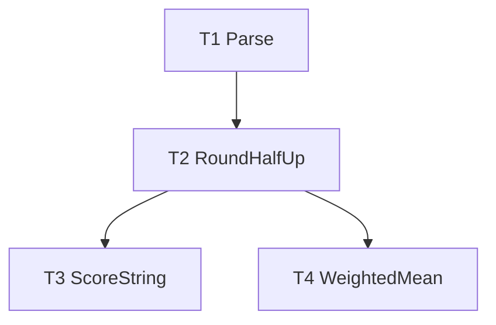

# F02 — decimal: Tasks

## Task graph



## Task F02-T1: Implement `Parse` (package skeleton + first red test)

**Depends on:** none
**Files:**
- create `internal/decimal/decimal.go`
- create `internal/decimal/parse_test.go`
- possibly `go.mod` + `go.sum` (only if no other task has initialized the module yet — see step 1)

**Spec references:** `specs/features/F02-decimal/SPEC.md` §1, §5; `specs/features/F02-decimal/CONTRACTS.md` §1; `docs/plan/annex-b-catalog-port.md` §1 (no float64); `specs/global/CONTRACTS.md` §8 (imports)

**Instructions:**
1. If `/go.mod` does not exist at the repo root yet (F01-T1 also creates it — whichever runs first wins), run `go mod init github.com/WD-Mitchell/which-model` and `go get github.com/shopspring/decimal@latest`. If `go.mod` already exists, only run `go get github.com/shopspring/decimal@latest` (idempotent).
2. Create `internal/decimal/parse_test.go` FIRST (package `decimal`, white-box) with the test cases below. Run `go test ./internal/decimal/...` and confirm it fails to compile (package does not exist) — expected red state.
3. Create `internal/decimal/decimal.go` (package `decimal`) with exactly:
   ```go
   // Parse wraps decimal.NewFromString unchanged. No float64 conversion.
   func Parse(s string) (decimal.Decimal, error) {
       return decimal.NewFromString(s)
   }
   ```
   Import `"github.com/shopspring/decimal"`. Do not add any other function, type, or helper in this task (later tasks add them one per file set).
4. Run `go test ./internal/decimal/...` and confirm all cases pass.

**Test cases (write these first):**

| # | input | want |
|---|---|---|
| 1 | `Parse("0")` | `0`, no error |
| 2 | `Parse("0.85")` | `"0.85"`, no error |
| 3 | `Parse("100")` | `"100"`, no error |
| 4 | `Parse("-1.5")` | `"-1.5"`, no error |
| 5 | `Parse("1e3")` | `"1000"`, no error |
| 6 | `Parse("")` | error (non-nil) |
| 7 | `Parse("abc")` | error (non-nil) |
| 8 | `Parse("1..2")` | error (non-nil) |
| 9 | `Parse("1.2.3")` | error (non-nil) |
| 10 | `Parse("NaN")` | error (non-nil) |

**Acceptance criteria:**
- [ ] `go build ./internal/decimal/...` succeeds
- [ ] `go test ./internal/decimal/...` passes with the 10 cases above
- [ ] no file outside the Files list modified; no `float64` anywhere in `internal/decimal`

**Run:** `go test ./internal/decimal/...`

## Task F02-T2: Implement `RoundHalfUp`

**Depends on:** F02-T1
**Files:**
- edit `internal/decimal/decimal.go`
- create `internal/decimal/round_test.go`

**Spec references:** `specs/features/F02-decimal/SPEC.md` §2; `specs/features/F02-decimal/CONTRACTS.md` §1; `docs/plan/annex-b-catalog-port.md` §1.1 (ties round half away from zero)

**Instructions:**
1. Create `internal/decimal/round_test.go` FIRST with the cases below. Run `go test ./internal/decimal/...` and confirm it fails to compile (`RoundHalfUp` undefined) — expected red state.
2. Add to `internal/decimal/decimal.go` exactly:
   ```go
   // RoundHalfUp rounds half away from zero (Python ROUND_HALF_UP,
   // annex-b §1.1); places may be negative. Equivalent to d.Round(places).
   func RoundHalfUp(d decimal.Decimal, places int32) decimal.Decimal {
       return d.Round(places)
   }
   ```
   Do NOT use `RoundBank` (tie-to-even) and do not reimplement rounding.
3. Run `go test ./internal/decimal/...` and confirm all cases pass.

**Test cases (write these first):**

| # | input | want |
|---|---|---|
| 1 | `RoundHalfUp(0.5, 0)` | `"1"` (tie rounds away from zero, annex-b §1.1) |
| 2 | `RoundHalfUp(1.5, 0)` | `"2"` |
| 3 | `RoundHalfUp(2.5, 0)` | `"3"` |
| 4 | `RoundHalfUp(-0.5, 0)` | `"-1"` |
| 5 | `RoundHalfUp(-1.5, 0)` | `"-2"` |
| 6 | `RoundHalfUp(63.4, 0)` | `"63"` |
| 7 | `RoundHalfUp(63.5, 0)` | `"64"` |
| 8 | `RoundHalfUp(2.25, 1)` | `"2.3"` |
| 9 | `RoundHalfUp(-2.25, 1)` | `"-2.3"` |
| 10 | `RoundHalfUp(0.05, 1)` | `"0.1"` |
| 11 | `RoundHalfUp(0.45, 1)` | `"0.5"` |
| 12 | `RoundHalfUp(125, -1)` | `"130"` (negative places pass through) |

**Acceptance criteria:**
- [ ] `go build ./internal/decimal/...` succeeds
- [ ] `go test ./internal/decimal/...` passes with the 12 cases above
- [ ] `RoundHalfUp` is a one-line delegation to `Round`; no `RoundBank`, no float64

**Run:** `go test ./internal/decimal/...`

## Task F02-T3: Implement `ScoreString`

**Depends on:** F02-T2
**Files:**
- edit `internal/decimal/decimal.go`
- create `internal/decimal/score_test.go`

**Spec references:** `specs/features/F02-decimal/SPEC.md` §3; `specs/features/F02-decimal/CONTRACTS.md` §1; `docs/plan/annex-d-cli-reference.md` §3.2 (score display)

**Instructions:**
1. Create `internal/decimal/score_test.go` FIRST with the cases below. Run `go test ./internal/decimal/...` and confirm it fails to compile (`ScoreString` undefined) — expected red state.
2. Add to `internal/decimal/decimal.go` exactly:
   ```go
   // ScoreString renders d as the canonical integer score: nearest integer,
   // half away from zero, no sign on zero.
   func ScoreString(d decimal.Decimal) string {
       return RoundHalfUp(d, 0).StringFixed(0)
   }
   ```
3. Run `go test ./internal/decimal/...` and confirm all cases pass.

**Test cases (write these first):**

| # | input | want |
|---|---|---|
| 1 | `ScoreString(0)` | `"0"` (no sign) |
| 2 | `ScoreString(100)` | `"100"` |
| 3 | `ScoreString(63.4)` | `"63"` |
| 4 | `ScoreString(63.5)` | `"64"` (half away from zero) |
| 5 | `ScoreString(0.5)` | `"1"` |
| 6 | `ScoreString(-0.4)` | `"0"` (rounds to zero, no sign) |
| 7 | `ScoreString(-0.5)` | `"-1"` |
| 8 | `ScoreString(99.999)` | `"100"` |

**Acceptance criteria:**
- [ ] `go build ./internal/decimal/...` succeeds
- [ ] `go test ./internal/decimal/...` passes with the 8 cases above
- [ ] `ScoreString` delegates to `RoundHalfUp(d, 0).StringFixed(0)` — no other rounding call

**Run:** `go test ./internal/decimal/...`

## Task F02-T4: Implement `WeightedMean`

**Depends on:** F02-T2
**Files:**
- edit `internal/decimal/decimal.go`
- create `internal/decimal/weighted_test.go`

**Spec references:** `specs/features/F02-decimal/SPEC.md` §4; `specs/features/F02-decimal/CONTRACTS.md` §1; `docs/plan/annex-b-catalog-port.md` §1 (full-precision arithmetic, caller rounds); `specs/features/F01-config/SPEC.md` §7 (zero weight = no contribution)

**Instructions:**
1. Create `internal/decimal/weighted_test.go` FIRST with the cases below. Run `go test ./internal/decimal/...` and confirm it fails to compile (`WeightedMean` undefined) — expected red state.
2. Add to `internal/decimal/decimal.go` exactly:
   ```go
   // WeightedMean computes Σ(cᵢ·wᵢ)/Σ(wᵢ) over entries with weight > 0 at
   // full precision (caller rounds). components and weights are parallel
   // slices; entries with weight <= 0 are skipped. The bool is false when
   // no valid component exists (length mismatch, both empty, all weights
   // <= 0) — then the value is decimal.Zero. Never returns an error.
   func WeightedMean(components, weights []decimal.Decimal) (decimal.Decimal, bool) {
       if len(components) != len(weights) {
           return decimal.Zero, false
       }
       num := decimal.Zero
       den := decimal.Zero
       for i, w := range weights {
           if w.Sign() <= 0 { // skip zero and negative weights
               continue
           }
           num = num.Add(components[i].Mul(w))
           den = den.Add(w)
       }
       if den.IsZero() {
           return decimal.Zero, false
       }
       return num.Div(den), true
   }
   ```
   This is the full intended implementation: no float64, no error type, no rounding (the caller rounds).
3. Run `go test ./internal/decimal/...` and confirm all cases pass.

**Test cases (write these first):**

| # | input | want |
|---|---|---|
| 1 | `(10, 20)` weights `(3, 1)` | `"12.5"` (30+20 = 50 / 4), `true` |
| 2 | `(1, 2, 3)` weights `(1, 1, 2)` | `"2.25"` (1+2+6 = 9 / 4), `true` |
| 3 | `(10, 20)` weights `(0, 1)` | `"20"` (zero weight skipped), `true` |
| 4 | `(10, 20)` weights `(1, -1)` | `"10"` (negative weight skipped), `true` |
| 5 | `(10)` weights `(2)` | `"5"`, `true` |
| 6 | `(100)` weights `(0)` | `decimal.Zero`, `false` (all weights ≤ 0) |
| 7 | `(10, 20)` weights `(0, 0)` | `decimal.Zero`, `false` |
| 8 | `()` weights `()` | `decimal.Zero`, `false` (both empty) |
| 9 | `(10, 20)` weights `(1)` | `decimal.Zero`, `false` (length mismatch) |
| 10 | `(10)` weights `(1, 1)` | `decimal.Zero`, `false` (length mismatch) |
| 11 | `(1, 2, 3, 4)` weights `(0, 2, 0, 2)` | `"3"` (2·2+4·2 = 12 / 4), `true` |
| 12 | full precision, no early rounding: `(1, 2)` weights `(1, 2)` | `"1.6666666666666666666666666666666667"`, `true` (exact decimal quotient; do not round) |

**Acceptance criteria:**
- [ ] `go build ./internal/decimal/...` succeeds
- [ ] `go test ./internal/decimal/...` passes with the 12 cases above
- [ ] no float64 anywhere in `internal/decimal`; `WeightedMean` returns full precision (callers round via `RoundHalfUp`)
- [ ] all four exported functions (`Parse`, `RoundHalfUp`, `ScoreString`, `WeightedMean`) are present in `internal/decimal/decimal.go` and nothing else is exported

**Run:** `go test ./internal/decimal/...`
