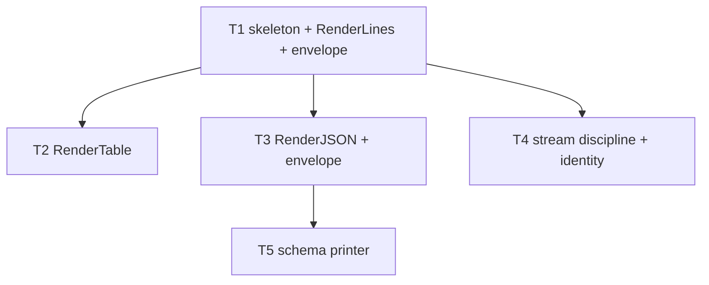

# F03 — output: Tasks

## Task graph

## Task F03-T1: Create the output package skeleton and RenderLines

**Depends on:** none

**Files:**
- create `internal/output/output.go`
- create `internal/output/envelope.go`
- create `internal/output/output_test.go`

**Spec references:** `specs/features/F03-output/CONTRACTS.md §1, §3`, `specs/features/F03-output/SPEC.md §1, §4`, `specs/global/CONTRACTS.md §6`

**Instructions:**
1. Write the test file first. It must compile-fail (package `output` does not exist yet).
2. Create `internal/output/output.go` with `package output` and a one-line package doc comment: `// Package output renders command output: JSON, text, and JSON Schema.`
3. Add to `output.go` the function `func RenderLines(w io.Writer, lines []string) error` that writes each line followed by `"\n"` and returns the first writer error encountered (use `fmt.Fprintln` per line; stop at the first error).
4. Create `internal/output/envelope.go` with the canonical envelope type and constant, verbatim from `specs/global/CONTRACTS.md §6` and `§7`:
   - `type OutputEnvelope struct { SchemaVersion string `json:"schema_version"`; UsageEnabled bool `json:"usage_enabled"`; UsageDisabledReason string `json:"usage_disabled_reason,omitempty"` }` — exactly as shown in `specs/features/F03-output/CONTRACTS.md §1`
   - `const SchemaVersion = "2.0"`
5. Copy the test cases below into `output_test.go` as a table-driven test named `TestRenderLines` using `bytes.Buffer` and `strings.Split`/`strings.TrimSuffix` to compare.
6. Run `go test ./internal/output/...`, confirm the tests pass, then run `go vet ./internal/output/...` and fix any complaints.

**Test cases (write these first):**

| # | input lines | want |
|---|---|---|
| 1 | `[]string{}` | empty buffer, nil error |
| 2 | `[]string{"hello"}` | `"hello\n"` |
| 3 | `[]string{"a", "b", "c"}` | `"a\nb\nc\n"` |
| 4 | `[]string{""}` | `"\n"` |
| 5 | `[]string{"line with spaces", "second"}` | `"line with spaces\nsecond\n"` |
| 6 | `[]string{"a", "", "c"}` | `"a\n\nc\n"` |

**Acceptance criteria:**
- [ ] `go build ./internal/output/...` succeeds
- [ ] `go test ./internal/output/...` passes with the test cases above
- [ ] no file outside the Files list modified
- [ ] `RenderLines` writes nothing for empty input and always newline-terminates non-empty lines

`go test ./internal/output/...`

## Task F03-T2: Add the RenderTable aligned text table

**Depends on:** F03-T1

**Files:**
- modify `internal/output/output.go`
- create `internal/output/table_test.go`

**Spec references:** `specs/features/F03-output/CONTRACTS.md §3`, `specs/features/F03-output/SPEC.md §4`, `specs/features/F03-output/SPEC.md D6`

**Instructions:**
1. Write `TestRenderTable` in `table_test.go` first, covering the cases below.
2. Add to `output.go` the function `func RenderTable(w io.Writer, headers []string, rows [][]string) error` implementing:
   - If `len(headers) == 0`, write nothing and return nil.
   - Column width for column `i` = maximum of `len(headers[i])` and `len(cell)` over every row that has a cell at index `i`; rows with fewer than `len(headers)` cells are treated as if padded with `""` for width purposes.
   - A row with more cells than `len(headers)` → return `fmt.Errorf("output: row %d has %d cells, header has %d", i, n, len(headers))` WITHOUT writing anything (validate all rows before writing).
   - Write the header row: each cell right-padded with spaces to its column width, cells joined by a single space, then `"\n"`.
   - Write each data row the same way, then `"\n"`.
   - Return the first writer error encountered.
3. Compute expected strings in the tests by hand from the width rule — do not reuse the renderer to build expectations.

**Test cases (write these first):**

| # | headers | rows | want |
|---|---|---|---|
| 1 | `[]string{}` | `nil` | empty buffer, nil error |
| 2 | `[]string{"name"}` | `nil` | `"name\n"` |
| 3 | `[]string{"a", "b"}` | `[][]string{{"1", "2"}}` | `"a b\n1 2\n"` |
| 4 | `[]string{"name", "used"}` | `[][]string{{"claude", "25%"}}` | `"name   used\nclaude 25% \n"` |
| 5 | `[]string{"x"}` | `[][]string{{"longer"}}` | `"x     \nlonger\n"` |
| 6 | `[]string{"h1", "h2"}` | `[][]string{{"only-one"}}` | `"h1       h2\nonly-one\n"` (short row padded with empty cell: "h1" padded to 8 = 6 spaces, + 1 separator = 7 spaces) |
| 7 | `[]string{"a", "b"}` | `[][]string{{"1", "2", "3"}}` | error, buffer empty |
| 8 | `[]string{"a"}` | `[][]string{{"1"}, {"22"}, {"333"}}` | `"a  \n1  \n22 \n333\n"` |
| 9 | `[]string{"p", "q"}` | `[][]string{{"r", "s"}, {"", "t"}}` | `"p q\nr s\n  t\n"` |
| 10 | `[]string{"a"}` | `[][]string{{"1"}, {"2"}}` | `"a\n1\n2\n"` |

**Acceptance criteria:**
- [ ] `go build ./internal/output/...` succeeds
- [ ] `go test ./internal/output/...` passes with the test cases above
- [ ] no file outside the Files list modified
- [ ] long rows error without emitting partial output

`go test ./internal/output/...`

## Task F03-T3: Add RenderJSON with envelope injection

**Depends on:** F03-T1

**Files:**
- create `internal/output/json.go`
- create `internal/output/json_test.go`

**Spec references:** `specs/features/F03-output/CONTRACTS.md §2`, `specs/features/F03-output/SPEC.md §2, §3, D1–D5`, `specs/global/CONTRACTS.md §6`

**Instructions:**
1. Write `TestRenderJSON` in `json_test.go` first (cases below). Use `json.Unmarshal` into `map[string]any` (with `json.Decoder` + `UseNumber`) to inspect results, and compare exact bytes for the determinism cases.
2. Create `internal/output/json.go` containing:
   - `var ErrReservedField = errors.New("output: payload uses a reserved envelope field")`
   - `var ErrPayloadNotObject = errors.New("output: payload must be a JSON object")`
   - `func RenderJSON(w io.Writer, env OutputEnvelope, payload any) error` (the `OutputEnvelope` type comes from `envelope.go`, created in F03-T1):
     a. If `env.SchemaVersion == ""`, set it to `SchemaVersion` (the const `"2.0"` from `envelope.go`).
     b. `json.Marshal(payload)`; on error return it.
     c. Decode the bytes with `json.NewDecoder(bytes.NewReader(b))`; call `UseNumber()`; `Decode(&map[string]any)`; if the value is `nil` or the decode fails on a non-object (e.g. payload was an array/string/number), return `ErrPayloadNotObject`. If decoding fails for another reason (invalid payload JSON), return that error.
     d. If the map already contains `schema_version`, `usage_enabled`, or `usage_disabled_reason`, return `fmt.Errorf("%w: %s", ErrReservedField, key)`.
     e. Set `m["schema_version"] = env.SchemaVersion`, `m["usage_enabled"] = env.UsageEnabled`, and — only when `env.UsageDisabledReason != ""` — `m["usage_disabled_reason"] = env.UsageDisabledReason`.
     f. `json.Marshal(m)` (encoding/json sorts map keys — this is the determinism mechanism), write the bytes, then write `"\n"`; return the first writer error.
3. In `json_test.go`, also assert `usage_disabled_reason` is absent from the JSON bytes when the envelope leaves it empty (check `!bytes.Contains(out, []byte("usage_disabled_reason"))`).

**Test cases (write these first):**

| # | input | want |
|---|---|---|
| 1 | `RenderJSON(buf, OutputEnvelope{UsageEnabled: true}, map[string]any{"ok": true})` | `{"ok":true,"schema_version":"2.0","usage_enabled":true}` + `"\n"` |
| 2 | `RenderJSON(buf, OutputEnvelope{}, struct{ A string `json:"a"` }{A: "x"})` | contains `"a":"x"`, `"schema_version":"2.0"`, `"usage_enabled":false`; no `usage_disabled_reason` key |
| 3 | `RenderJSON(buf, OutputEnvelope{UsageEnabled: false, UsageDisabledReason: "flag"}, map[string]any{})` | `{"schema_version":"2.0","usage_disabled_reason":"flag","usage_enabled":false}` + `"\n"` |
| 4 | `RenderJSON(buf, OutputEnvelope{SchemaVersion: "9.9"}, map[string]any{})` | `"schema_version":"9.9"` (non-empty env wins) |
| 5 | payload `map[string]any{"schema_version": "1.0"}` | `errors.Is(err, ErrReservedField)` true; buffer empty |
| 6 | payload `map[string]any{"usage_disabled_reason": "x"}` | `errors.Is(err, ErrReservedField)` true |
| 7 | payload `[]string{"a"}` | `errors.Is(err, ErrPayloadNotObject)` true |
| 8 | payload `"a string"` | `errors.Is(err, ErrPayloadNotObject)` true |
| 9 | payload `map[string]any{"n": int64(9_007_199_254_740_993)}` | JSON contains `"n":9007199254740993` exactly (UseNumber precision preserved) |
| 10 | same call twice into two buffers | byte-identical output (determinism) |
| 11 | payload `map[string]any{"b": 1, "a": 2}` | exact bytes `{"a":2,"b":1,"schema_version":"2.0","usage_enabled":false}\n` (sorted keys) |
| 12 | `RenderJSON` into a failing writer (a writer that returns `errors.New("boom")` after 1 byte) | returned error contains `"boom"` |

**Acceptance criteria:**
- [ ] `go build ./internal/output/...` succeeds
- [ ] `go test ./internal/output/...` passes with the test cases above
- [ ] no file outside the Files list modified
- [ ] every JSON document carries exactly the envelope fields per `specs/features/F03-output/CONTRACTS.md §2`, and output is byte-deterministic for identical inputs

`go test ./internal/output/...`

## Task F03-T4: Add stream-discipline helpers and the identity hook

**Depends on:** F03-T1

**Files:**
- create `internal/output/stream.go`
- create `internal/output/stream_test.go`

**Spec references:** `specs/features/F03-output/CONTRACTS.md §4`, `specs/features/F03-output/SPEC.md §5, §6, D7, D8`, `docs/plan/annex-d-cli-reference.md §1.2, §1.3`

**Instructions:**
1. Write `TestStreamHelpers` in `stream_test.go` first (cases below), then `TestRedactIdentity`.
2. Create `internal/output/stream.go` with:
   - `func WriteFailure(w io.Writer, command, code, message string) error` — writes exactly `"which-model " + command + ": [" + code + "] " + message + "\n"` (single `fmt.Fprintf` call) and returns the writer error.
   - `func WriteWarning(w io.Writer, message string) error` — writes `"warning: " + message + "\n"` and returns the writer error.
   - `func RedactIdentity(value string, show bool) *string` — returns `nil` when `show == false`, else `&value`.
3. The tests assert exact strings, including that `WriteFailure` output is exactly ONE line (no embedded extra newlines from the message).

**Test cases (write these first):**

| # | input | want |
|---|---|---|
| 1 | `WriteFailure(buf, "pick", "network", "the provider request failed.")` | `"which-model pick: [network] the provider request failed.\n"` |
| 2 | `WriteFailure(buf, "usage", "unauthorized", "msg")` | `"which-model usage: [unauthorized] msg\n"` |
| 3 | `WriteFailure(buf, "a", "b", "multi\nline")` | `"which-model a: [b] multi\nline\n"` (message echoed verbatim, still one trailing newline) |
| 4 | `WriteWarning(buf, "credential file is world-readable")` | `"warning: credential file is world-readable\n"` |
| 5 | `WriteWarning(buf, "")` | `"warning: \n"` |
| 6 | `RedactIdentity("octocat", true)` | non-nil, `*got == "octocat"` |
| 7 | `RedactIdentity("octocat", false)` | `nil` |
| 8 | `RedactIdentity("", true)` | non-nil, `*got == ""` |
| 9 | `RedactIdentity("", false)` | `nil` |
| 10 | failing writer with `WriteFailure` | returned error is the writer's error |

**Acceptance criteria:**
- [ ] `go build ./internal/output/...` succeeds
- [ ] `go test ./internal/output/...` passes with the test cases above
- [ ] no file outside the Files list modified
- [ ] failure line matches annex-d §1.3 exactly; identity values are omitted (nil), never masked, when `show` is false

`go test ./internal/output/...`

## Task F03-T5: Add the JSON Schema printer

**Depends on:** F03-T3

**Files:**
- create `internal/output/schema.go`
- create `internal/output/schema_test.go`

**Spec references:** `specs/features/F03-output/CONTRACTS.md §5`, `specs/features/F03-output/SPEC.md §7, D9`, `docs/plan/annex-d-cli-reference.md §2.9`

**Instructions:**
1. Write `TestPrintSchema` and `TestPrintSchemaIndex` in `schema_test.go` first.
2. Create `internal/output/schema.go` with:
   - `func PrintSchema(w io.Writer, doc map[string]any) error` — `json.Marshal(doc)` (sorted keys), write bytes then `"\n"`, return the first writer error.
   - `func PrintSchemaIndex(w io.Writer, commands []string) error` — marshals `struct{ Commands []string `json:"commands"` }{Commands: commands}`, writes it plus `"\n"`; `nil`/empty slice emits `{"commands":null}` / `{"commands":[]}` respectively (encoding/json default — do not special-case).
3. Assert exact byte output for the index and a small doc, and determinism (two calls, identical bytes).

**Test cases (write these first):**

| # | input | want |
|---|---|---|
| 1 | `PrintSchema(buf, map[string]any{"type": "object", "title": "usage"})` | `{"title":"usage","type":"object"}\n` |
| 2 | `PrintSchema(buf, map[string]any{})` | `"{}\n"` |
| 3 | `PrintSchema(buf, map[string]any{"n": int64(9_007_199_254_740_993)})` | contains `"n":9007199254740993` |
| 4 | `PrintSchema` twice with same doc | byte-identical output |
| 5 | `PrintSchemaIndex(buf, []string{"usage", "pick"})` | `{"commands":["usage","pick"]}\n` |
| 6 | `PrintSchemaIndex(buf, nil)` | `{"commands":null}\n` |
| 7 | `PrintSchemaIndex(buf, []string{})` | `{"commands":[]}\n` |
| 8 | failing writer with `PrintSchema` | returned error is the writer's error |

**Acceptance criteria:**
- [ ] `go build ./internal/output/...` succeeds
- [ ] `go test ./internal/output/...` passes with the test cases above
- [ ] no file outside the Files list modified
- [ ] schema documents and the index are deterministic, newline-terminated JSON per annex-d §2.9

`go test ./internal/output/...`
