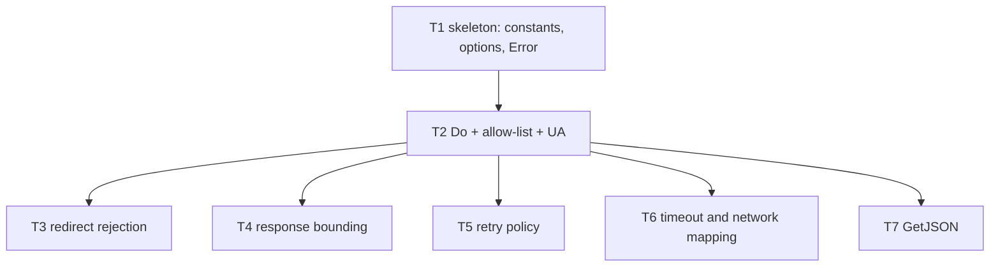

# F04 — http: Tasks

## Task graph

## Task F04-T1: Create the httpkit package skeleton, options, and Error type

**Depends on:** none

**Files:**
- create `internal/httpkit/client.go`
- create `internal/httpkit/errors.go`
- create `internal/httpkit/client_test.go`

**Spec references:** `specs/features/F04-http/CONTRACTS.md §1, §2`, `specs/features/F04-http/SPEC.md §1, D1, D11`, `specs/global/CONTRACTS.md §1.6`

**Instructions:**
1. Write `client_test.go` first; it must compile-fail (package `httpkit` does not exist).
2. Create `internal/httpkit/client.go`:
   - `package httpkit` with doc comment `// Package httpkit is the shared HTTP client: retries, redirect rejection, body bounding.`
   - `const DefaultTimeout = 10 * time.Second` and `const DefaultMaxResponseBytes = int64(262_144)` — exactly as in `specs/features/F04-http/CONTRACTS.md §1`.
   - `type Client struct { timeout time.Duration; maxBytes int64; retries int; backoff time.Duration; userAgent string; allowed []string; hc *http.Client }` — all fields unexported. `hc` is created in `NewClient` with `CheckRedirect` set to return an internal sentinel error `errRedirectRejected` (declared as `var errRedirectRejected = errors.New("httpkit: redirect rejected")`); the sentinel will be used by F04-T3.
   - `type Option func(*Client)` and the four option functions `WithTimeout`, `WithMaxBytes`, `WithUserAgent`, `WithRetries`, each setting the corresponding field.
   - `func NewClient(opts ...Option) *Client` — starts from defaults (`timeout: DefaultTimeout`, `maxBytes: DefaultMaxResponseBytes`, `retries: 1`, `backoff: 500*time.Millisecond`, `userAgent: "which-model/dev"`, `allowed: nil`), applies opts in order, returns the client.
   - `func (c *Client) SetAllowList(urls []string)` — copies urls into `c.allowed`.
3. Create `internal/httpkit/errors.go`:
   - `type Error struct { Code string; StatusCode int; Err error }` — `StatusCode` carries the HTTP status (0 when the failure is not HTTP-level: network, timeout, parse, allow-list, redirect). Every code path that maps an HTTP response into `*Error` MUST set `StatusCode` to the observed status (401/403/429/other); non-HTTP paths leave it 0. Consumers branch on `Code`/`StatusCode` via `errors.As`, never on message text.
   - `func (e *Error) Error() string` — returns `e.Code + ": " + fixedMessage(e.Code)`, where `fixedMessage` is a private func returning the exact strings from `specs/features/F04-http/CONTRACTS.md §2` (`the provider endpoint is not a valid URL`, `the provider endpoint was refused`, `the provider attempted an unsafe redirect`, `the provider response exceeded the safe size limit`, `the provider request timed out`, `the provider request failed`, `the provider returned unsupported JSON`); unknown codes fall back to `the request failed`.
   - `func AsError(err error) (*Error, bool)` — uses `errors.As` to extract an `*Error` from `err`; returns it and true on success, nil and false otherwise.

**Test cases (write these first):**

| # | input | want |
|---|---|---|
| 1 | `NewClient()` default fields | `timeout == DefaultTimeout`, `maxBytes == DefaultMaxResponseBytes`, `retries == 1`, `backoff == 500*time.Millisecond`, `userAgent == "which-model/dev"` |
| 2 | `NewClient(WithTimeout(3 * time.Second))` | `timeout == 3*time.Second`, other defaults unchanged |
| 3 | `NewClient(WithMaxBytes(100))` | `maxBytes == 100` |
| 4 | `NewClient(WithUserAgent("wm/9"))` | `userAgent == "wm/9"` |
| 5 | `NewClient(WithRetries(0))` | `retries == 0` |
| 6 | `SetAllowList([]string{"a", "b"})` | `c.allowed` equals `["a","b"]` (copied, not aliased) |
| 7 | `(&Error{Code: "timeout"}).Error()` | `"timeout: the provider request timed out"` |
| 8 | `(&Error{Code: "redirect_refused"}).Error()` | `"redirect_refused: the provider attempted an unsafe redirect"` |
| 9 | `(&Error{Code: "bogus"}).Error()` | `"bogus: the request failed"` |
| 10 | `(&Error{Code: "network", Err: errors.New("SECRET_XYZ")}).Error()` | `"network: the provider request failed"` — MUST NOT contain `SECRET_XYZ` |
| 11 | `AsError(errors.New("plain"))` | `(nil, false)` |
| 12 | `AsError(fmt.Errorf("wrap: %w", &Error{Code: "network"}))` | `(&Error{Code:"network"}, true)` |

**Acceptance criteria:**
- [ ] `go build ./internal/httpkit/...` succeeds
- [ ] `go test ./internal/httpkit/...` passes with the test cases above
- [ ] no file outside the Files list modified
- [ ] `Error()` never renders the underlying `Err` text (canary-safe: case 10)

`go test ./internal/httpkit/...`

## Task F04-T2: Implement Do with the exact-URL allow-list and User-Agent

**Depends on:** F04-T1

**Files:**
- modify `internal/httpkit/client.go`
- create `internal/httpkit/do_test.go`

**Spec references:** `specs/features/F04-http/CONTRACTS.md §1 (Do, SetAllowList)`, `specs/features/F04-http/SPEC.md §3, §8, D3–D5, D10, D11`

**Instructions:**
1. Write `do_test.go` first. For TLS tests use `httptest.NewTLSServer` and set the client's unexported transport to the test server's client: `c.hc = srv.Client()` (same-package test access; this makes the client trust the test cert). Refusal tests use fake `https://` URLs that must never be contacted.
2. Add to `client.go`:
   - `func validateURL(raw string, allowed []string) error` — private: `url.Parse(raw)`; parse failure → `&Error{Code:"endpoint_refused"}`; then reject (same code) if `u.Scheme != "https"`, `u.User != nil`, `u.Fragment != ""`, or `!slices.Contains(allowed, u.String())`. Return nil when `allowed == nil` (empty allow-list disables the check). Message: parse failure uses `the provider endpoint is not a valid URL`, all other rejections `the provider endpoint was refused` (fixed messages from `specs/features/F04-http/CONTRACTS.md §2`).
   - `func (c *Client) Do(ctx context.Context, req *http.Request) ([]byte, error)`:
     a. `validateURL(req.URL.String(), c.allowed)` → on error return nil, err (before any network I/O).
     b. `req.Header.Set("User-Agent", c.userAgent)` (overrides any caller value).
     c. `resp, err := c.hc.Do(req)`; on err: `errors.Is(err, errRedirectRejected)` → `&Error{Code:"redirect_refused"}`; `errors.Is(err, context.DeadlineExceeded)` → `&Error{Code:"timeout"}`; `errors.Is(err, context.Canceled)` → `&Error{Code:"network"}`; anything else → `&Error{Code:"network"}`. (Retries land in F04-T5; for now return immediately.)
     d. `defer resp.Body.Close()`; then bound the body: if `resp.ContentLength > c.maxBytes` → `&Error{Code:"response_too_large"}`; read via `io.ReadAll(io.LimitReader(resp.Body, c.maxBytes+1))`; if `len(body) > c.maxBytes` → `&Error{Code:"response_too_large"}` (this is the double check — `resp.ContentLength` is the parsed `Content-Length` header).
     e. Status check BEFORE returning: if `resp.StatusCode >= 400`, discard the body and return a mapped error with `StatusCode` set — 401 or 403 → `&Error{Code:"unauthorized", StatusCode: resp.StatusCode}`; 429 → `&Error{Code:"rate_limited", StatusCode: resp.StatusCode}`; any other >= 400 → `&Error{Code:"provider_status", StatusCode: resp.StatusCode}`. Return `body, nil` ONLY for 2xx. (Retries for 5xx land in F04-T5; for now every >= 400 maps immediately.)
3. Run `go test ./internal/httpkit/...` and confirm all pass.

**Test cases (write these first):**

| # | input | want |
|---|---|---|
| 1 | HTTPS TLS server, `SetAllowList([]string{srv.URL})`, GET `srv.URL` | body `"ok"`, nil error; server saw `User-Agent == "which-model/dev"` |
| 2 | Same but request `srv.URL + "/x"` | `AsError` → `Code == "endpoint_refused"`; server request count == 0 |
| 3 | `SetAllowList([]string{httpServerURL})` (plain http server), GET that http URL | `Code == "endpoint_refused"` (non-https refused even when listed) |
| 4 | `SetAllowList([]string{"https://example.com/"})`, GET `"https://user@example.com/"` | `Code == "endpoint_refused"` (userinfo) |
| 5 | `SetAllowList([]string{"https://example.com/"})`, GET `"https://example.com/#frag"` | `Code == "endpoint_refused"` (fragment) |
| 6 | `SetAllowList([]string{"https://example.com/"})`, GET `"https://exa mple.com/"` (space in host → `url.Parse` failure) | `Code == "endpoint_refused"`; error message == `endpoint_refused: the provider endpoint is not a valid URL` |
| 7 | No `SetAllowList` call, GET plain http server URL | body returned, nil error (no enforcement when unset) |
| 8 | Plain http server, caller sets `req.Header.Set("User-Agent", "sneaky")` | server sees `"which-model/dev"` (client wins) |
| 9 | `NewClient(WithUserAgent("wm/9"))`, plain server | server sees `"wm/9"` |
| 10 | Plain server returning status 404 with body `"nf"` | `AsError` → `Code == "provider_status"`, `StatusCode == 404`; body is NOT returned |
| 11 | Plain server returning status 500 with body `"err"` (single attempt — retry lands in F04-T5) | `AsError` → `Code == "provider_status"`, `StatusCode == 500` |
| 12 | Status 401 with body = canary literal | `Code == "unauthorized"`, `StatusCode == 401`; error text contains NO canary |
| 13 | Status 403 | `Code == "unauthorized"`, `StatusCode == 403` |
| 14 | Status 429 | `Code == "rate_limited"`, `StatusCode == 429` |
| 15 | `c.hc` left as default, request to `http://127.0.0.1:1` (closed port) | `Code == "network"`, `StatusCode == 0` |

**Acceptance criteria:**
- [ ] `go build ./internal/httpkit/...` succeeds
- [ ] `go test ./internal/httpkit/...` passes with the test cases above
- [ ] no file outside the Files list modified
- [ ] allow-list refusal happens before any network I/O (cases 2–5 assert zero server hits); UA is always the client's value

`go test ./internal/httpkit/...`

## Task F04-T3: Add redirect rejection — any 3xx hard-fails

**Depends on:** F04-T2

**Files:**
- modify `internal/httpkit/client.go`
- create `internal/httpkit/redirect_test.go`

**Spec references:** `specs/features/F04-http/CONTRACTS.md §3`, `specs/features/F04-http/SPEC.md §4, D6`, `specs/global/SPEC.md §6` invariant 2

**Instructions:**
1. Write `redirect_test.go` first. Each test uses a plain `httptest.NewServer` whose handler switches on `r.URL.Path` and increments an atomic counter; the redirect-target path also counts, so "zero followed hops" means the total count stays 1.
2. In `Do` (already built in F04-T2):
   - The `errRedirectRejected` sentinel from `CheckRedirect` is already mapped to `redirect_refused` — keep that.
   - After a successful `c.hc.Do`, before the body-bound check, add: `if resp.StatusCode >= 300 && resp.StatusCode < 400 { return nil, &Error{Code: "redirect_refused"} }` — this catches 3xx responses that never triggered `CheckRedirect` (no `Location` header), and is also what makes the sentinel path return consistently.
3. The handler cases: `/loc301` → `http.Redirect(w, r, "/target", http.StatusMovedPermanently)`; `/loc302` → `http.Redirect(..., http.StatusFound)`; `/noloc` → `w.WriteHeader(300)` with no `Location` header and no body; `/ok` → 200 `"ok"`.

**Test cases (write these first):**

| # | input | want |
|---|---|---|
| 1 | GET `/loc301` | `Code == "redirect_refused"`; total server hits == 1 (never followed) |
| 2 | GET `/loc302` | `Code == "redirect_refused"`; total server hits == 1 |
| 3 | GET `/noloc` (300, no Location) | `Code == "redirect_refused"`; total server hits == 1 |
| 4 | GET `/ok` | `body == "ok"`, nil error |
| 5 | GET `/loc301` twice | both calls return `Code == "redirect_refused"`; total hits == 2 |

**Acceptance criteria:**
- [ ] `go build ./internal/httpkit/...` succeeds
- [ ] `go test ./internal/httpkit/...` passes with the test cases above
- [ ] no file outside the Files list modified
- [ ] zero followed hops on every 3xx, including Location-less ones

`go test ./internal/httpkit/...`

## Task F04-T4: Add the double-checked response body bound

**Depends on:** F04-T2

**Files:**
- modify `internal/httpkit/client.go`
- create `internal/httpkit/bound_test.go`

**Spec references:** `specs/features/F04-http/CONTRACTS.md §3`, `specs/features/F04-http/SPEC.md §5, D1`, `specs/global/SPEC.md §6` invariant 3

**Instructions:**
1. Write `bound_test.go` first. Use `httptest.NewServer` handlers:
   - `/clbig` sets `w.Header().Set("Content-Length", "200")` and writes 200 bytes.
   - `/stream` writes 200 bytes in a loop, calling `w.(http.Flusher).Flush()` after each chunk so Go uses chunked encoding (no `Content-Length` header).
   - `/clok` sets `Content-Length: 100` and writes exactly 100 bytes.
   - `/clbad` sets `Content-Length: abc` (unparseable) and writes 10 bytes.
   - `/default` writes 300_000 bytes without setting `Content-Length` (flush loop, so no auto-header).
2. The body-bound logic already exists in `Do` from F04-T2 (pre-check + `io.LimitReader(c.maxBytes+1)`); make sure it is exactly the two-step check and that `resp.Body` is closed in all paths (the `defer` covers it).
3. Assert bodies on the success cases byte-for-byte.

**Test cases (write these first):**

| # | input | want |
|---|---|---|
| 1 | `NewClient(WithMaxBytes(100))`, GET `/clbig` | `Code == "response_too_large"` |
| 2 | `NewClient(WithMaxBytes(100))`, GET `/stream` (no CL, 200 bytes) | `Code == "response_too_large"` (reader catches the lie) |
| 3 | `NewClient(WithMaxBytes(100))`, GET `/clok` | body == the 100 bytes, nil error |
| 4 | `NewClient(WithMaxBytes(100))`, GET `/stream2` (no CL, 99 bytes) | body == 99 bytes, nil error |
| 5 | `NewClient(WithMaxBytes(100))`, GET `/clbad` (CL `abc`) | body == 10 bytes, nil error (unparseable CL treated as absent) |
| 6 | `NewClient()`, GET `/default` (300_000 bytes, no CL) | `Code == "response_too_large"` (default bound 262 144) |
| 7 | `NewClient(WithMaxBytes(262_144))`, GET `/stream` variant writing exactly 262_144 bytes | body == 262_144 bytes, nil error (boundary inclusive) |
| 8 | `NewClient(WithMaxBytes(262_145))`, GET `/stream` (200 bytes) | body == 200 bytes, nil error |

**Acceptance criteria:**
- [ ] `go build ./internal/httpkit/...` succeeds
- [ ] `go test ./internal/httpkit/...` passes with the test cases above
- [ ] no file outside the Files list modified
- [ ] oversize detection works with and without a `Content-Length` header, and the exact-boundary body (maxBytes bytes) succeeds

`go test ./internal/httpkit/...`

## Task F04-T5: Add the retry policy — 5xx and network only, one retry, 500ms backoff

**Depends on:** F04-T3

**Files:**
- modify `internal/httpkit/client.go`
- create `internal/httpkit/retry_test.go`

**Spec references:** `specs/features/F04-http/CONTRACTS.md §4`, `specs/features/F04-http/SPEC.md §6, D7, D8, D12`, `docs/plan/annex-b-catalog-port.md` §7

**Instructions:**
1. Write `retry_test.go` first. Handlers count requests with an atomic counter and behave per attempt (e.g. `/flaky500`: attempt 1 → 500, attempt 2 → 200). The network-error case uses `http.Hijacker`: the handler hijacks the connection and closes it without writing a response, producing a transport error on the client side.
2. Refactor `Do` in `client.go` into an inner `doOnce(ctx, req) ([]byte, error)` that performs steps a–e of F04-T2 (allow-list, UA, `hc.Do` with error mapping, 3xx check, bounded read) and returns a `retryable bool` alongside, computed as:
   - retryable when the inner error has `Code == "network"` (transport failure, not `timeout`/`redirect_refused`/`endpoint_refused`/`response_too_large`);
   - retryable when the attempt ended in an HTTP status >= 500 — after this task's change `doOnce` surfaces that as `*Error{Code:"provider_status", StatusCode:<status>}`, so compute retryable from the returned `*Error`'s `StatusCode >= 500` (a 2xx success is never retryable);
   - NOT retryable when the request is unreplayable: `req.Body != nil && req.GetBody == nil`.
3. `Do` then loops `attempt := 0; attempt <= c.retries; attempt++`:
   - run `doOnce`; if not retryable, return its result immediately;
   - if retryable and `attempt == c.retries`, return the result of this final attempt (a 5xx → `*Error{Code:"provider_status", StatusCode:<status>}`, never a body; `network` → its `*Error`);
   - otherwise wait the backoff honoring cancellation: `select { case <-ctx.Done(): return nil, &Error{Code: "timeout" if DeadlineExceeded else "network"}; case <-time.After(c.backoff): }` and continue the loop.
   - Before retrying, drain and close the previous response body (`io.Copy(io.Discard, resp.Body); resp.Body.Close()`) — `doOnce` returns the bounded body already; it must close the response body before returning so the connection can be reused (keep `defer resp.Body.Close()` inside `doOnce`).
   - A retried request uses the same `*http.Request`; `GetBody` (set by `http.NewRequest` for `bytes.Reader` bodies) makes replays safe. Do NOT modify the request between attempts.
4. Because the backoff is a fixed 500ms, the retrying tests take about 0.5s each — that is expected; do not try to shorten it.

**Test cases (write these first):**

| # | input | want |
|---|---|---|
| 1 | `/flaky500` (500 then 200) | attempts == 2; body == `"ok"`; nil error |
| 2 | `/always500` (500, 500) | attempts == 2; `AsError` → `Code == "provider_status"`, `StatusCode == 500` (exhausted retries surface the final status as a typed error) |
| 3 | `/once404` (404) | attempts == 1; `AsError` → `Code == "provider_status"`, `StatusCode == 404` (4xx never retried) |
| 4 | `/once429` (429) | attempts == 1; `AsError` → `Code == "rate_limited"`, `StatusCode == 429` (4xx never retried) |
| 5 | `/netflaky` (hijack-close, then 200) | attempts == 2; body == `"ok"`; nil error |
| 6 | `/always500` with `NewClient(WithRetries(0))` | attempts == 1 |
| 7 | `/loc301` (from F04-T3) with default retries | attempts == 1; `Code == "redirect_refused"` |
| 8 | `WithMaxBytes(10)` + `/stream` (20 bytes) | attempts == 1; `Code == "response_too_large"` |
| 9 | `/always500` with `req.Body` set and `req.GetBody = nil` | attempts == 1 (unreplayable request is not retried) |
| 10 | `/flaky500` with caller ctx canceled before the call (`ctx, cancel := context.WithCancel(context.Background()); cancel()`) | `Code == "network"`; no attempt reaches the server |
| 11 | `/flaky500`, then verify elapsed wall time >= 400ms | the single retry actually waited the backoff |

**Acceptance criteria:**
- [ ] `go build ./internal/httpkit/...` succeeds
- [ ] `go test ./internal/httpkit/...` passes with the test cases above
- [ ] no file outside the Files list modified
- [ ] exactly one retry for 5xx and network errors, zero retries for 4xx/3xx/too-large, and the backoff is actually applied

`go test ./internal/httpkit/...`

## Task F04-T6: Map timeouts and cancellation to stable codes

**Depends on:** F04-T5

**Files:**
- modify `internal/httpkit/client.go`
- create `internal/httpkit/timeout_test.go`

**Spec references:** `specs/features/F04-http/CONTRACTS.md §3`, `specs/features/F04-http/SPEC.md §2, §7, D2, D9`

**Instructions:**
1. Write `timeout_test.go` first. The slow handler writes nothing and sleeps 300ms (`time.Sleep` inside the handler); the fast handler responds immediately; the block handler `/block` waits until the test closes a signal channel (and signals the test that it started via a second channel) so the cancellation timing is deterministic.
2. In `Do`, the error mapping already exists (F04-T2 step c): `DeadlineExceeded` → `timeout`, `Canceled` → `network`. Verify it now covers the client-timeout path: `NewClient` has no timer of its own — the timeout is applied by wrapping the context. In `Do`, before `c.hc.Do`, add: `if _, hasDeadline := ctx.Deadline(); !hasDeadline { var cancel context.CancelFunc; ctx, cancel = context.WithTimeout(ctx, c.timeout); defer cancel() }`.
3. Assert both code paths plus an early-cancellation path and the "earlier caller deadline wins" path.

**Test cases (write these first):**

| # | input | want |
|---|---|---|
| 1 | `NewClient(WithTimeout(50*time.Millisecond))`, GET slow handler | `Code == "timeout"`; elapsed < 1s |
| 2 | `NewClient(WithTimeout(10*time.Second))`, ctx with `context.WithTimeout(ctx, 50*time.Millisecond)`, GET slow handler | `Code == "timeout"` (caller's earlier deadline wins) |
| 3 | `NewClient(WithTimeout(50*time.Millisecond))`, ctx with `context.WithTimeout(ctx, 10*time.Second)`, GET slow handler | `Code == "timeout"` (client's deadline applies when it is earlier) |
| 4 | `NewClient()`, GET `/block` (handler waits on a channel), start `Do` in a goroutine, wait for the handler to signal it started, `cancel()`, then release the handler | `Code == "network"` (caller cancellation) |
| 5 | `NewClient(WithTimeout(50*time.Millisecond))`, GET fast handler | body returned, nil error |
| 6 | `NewClient(WithTimeout(50*time.Millisecond))`, GET slow handler, verify elapsed >= 30ms | the timeout was genuinely enforced by the context |

**Acceptance criteria:**
- [ ] `go build ./internal/httpkit/...` succeeds
- [ ] `go test ./internal/httpkit/...` passes with the test cases above
- [ ] no file outside the Files list modified
- [ ] deadline → `timeout`, cancellation → `network`, and the earlier of caller/client deadlines governs

`go test ./internal/httpkit/...`

## Task F04-T7: Add GetJSON

**Depends on:** F04-T5

**Files:**
- modify `internal/httpkit/client.go`
- create `internal/httpkit/getjson_test.go`

**Spec references:** `specs/features/F04-http/CONTRACTS.md §1 (GetJSON)`, `specs/features/F04-http/SPEC.md §9, §10`

**Instructions:**
1. Write `getjson_test.go` first. Handlers on a plain server: `/ok` → 200 `{"ok":true,"n":3}`; `/bad` → 200 `not json`; `/empty` → 200 with no body; `/arr` → 200 `[1,2]`; `/auth` → 200 `{}` after asserting the `Authorization` header equals `Bearer sekrit`.
2. Add to `client.go`:
   - `func (c *Client) GetJSON(ctx context.Context, url string, headers map[string]string, out any) error`:
     a. `http.NewRequestWithContext(ctx, http.MethodGet, url, nil)` — on error return it.
     b. For each key/value in `headers`, `req.Header.Set(k, v)` (the client still overrides `User-Agent` inside `Do`).
     c. `body, err := c.Do(ctx, req)`; on error return it.
     d. `json.Unmarshal(body, out)`; on any error return `&Error{Code: "response_json"}` (this covers empty bodies too — `json.Unmarshal([]byte{}, out)` fails).
     e. Return nil.
3. Confirm `TestGetJSON` cases pass, including the allow-list interplay (a client with `SetAllowList` still refuses in `GetJSON`).

**Test cases (write these first):**

| # | input | want |
|---|---|---|
| 1 | `GetJSON(ctx, srv.URL+"/ok", nil, &map[string]any{})` | map == `{"n":3,"ok":true}`, nil error |
| 2 | `GetJSON(ctx, srv.URL+"/ok", nil, &struct{ N int `json:"n"` }{})` | `N == 3`, nil error |
| 3 | `GetJSON(ctx, srv.URL+"/bad", nil, &map[string]any{})` | `Code == "response_json"` |
| 4 | `GetJSON(ctx, srv.URL+"/empty", nil, &map[string]any{})` | `Code == "response_json"` |
| 5 | `GetJSON(ctx, srv.URL+"/arr", nil, &map[string]any{})` | `Code == "response_json"` (array is not an object) |
| 6 | `GetJSON(ctx, srv.URL+"/auth", map[string]string{"Authorization": "Bearer sekrit"}, &map[string]any{})` | nil error; server recorded `Authorization == "Bearer sekrit"` and `User-Agent == "which-model/dev"` |
| 7 | `SetAllowList([]string{"https://example.com/"})`, then `GetJSON(ctx, srv.URL+"/ok", nil, &map[string]any{})` | `Code == "endpoint_refused"` |
| 8 | `GetJSON` against `http://127.0.0.1:1` (closed port) | `Code == "network"` |
| 9 | `NewClient(WithUserAgent("wm/9"))`, GET `/ok` | server saw `"wm/9"` |

**Acceptance criteria:**
- [ ] `go build ./internal/httpkit/...` succeeds
- [ ] `go test ./internal/httpkit/...` passes with the test cases above
- [ ] no file outside the Files list modified
- [ ] any unmarshal failure (empty body included) yields `response_json`; allow-list and UA rules hold through `GetJSON`

`go test ./internal/httpkit/...`
