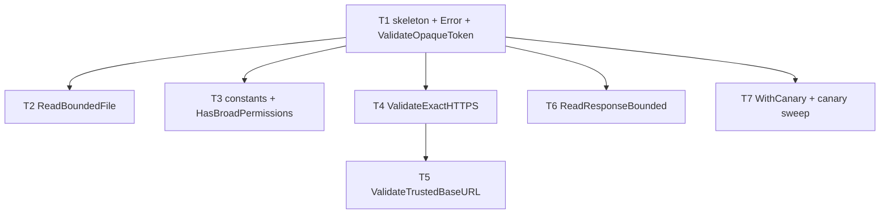

# F05 — security: Tasks

## Task graph

## Task F05-T1: Create the security package skeleton, Error type, and ValidateOpaqueToken

**Depends on:** none

**Files:**
- create `internal/security/security.go`
- create `internal/security/token.go`
- create `internal/security/token_test.go`

**Spec references:** `specs/features/F05-security/CONTRACTS.md §1, §2`, `specs/features/F05-security/SPEC.md §1, D1, D2, D4`, `docs/plan/research/usage-allowance-checks-spec.md` §1 `assertOpaque`

**Instructions:**
1. Write `token_test.go` first; it must compile-fail (package `security` does not exist).
2. Create `internal/security/security.go`:
   - `package security` with doc comment `// Package security ports the Node prototype's security core: token validation, bounded file I/O, URL validation, and the canary harness.`
   - `const MaxCredentialBytes = 1_048_576` and `const MaxResponseBytes = 262_144` — values from `specs/global/CONTRACTS.md` §7.
   - `type Error struct { Code string; Message string }`.
   - `func (e *Error) Error() string { return e.Code + ": " + e.Message }`.
3. Create `internal/security/token.go` with `func ValidateOpaqueToken(token string) error`:
   - Reject when `len(token) < 1 || len(token) > 8192`.
   - Reject when any rune `r` of `token` satisfies `unicode.IsSpace(r) || unicode.IsControl(r)` (note: `unicode.IsControl` already includes `\u007f` DEL and the C0 range).
   - Rejection returns `&Error{Code: "unsafe_credential", Message: "The credential is missing or unsafe."}` — build the error from these constants only, never from `token`.
   - Return nil on success.
4. The table test asserts, for every failing case, BOTH the exact error message AND that the error text does not contain the input token (sanitization check, per case).

**Test cases (write these first):**

| # | input token | want |
|---|---|---|
| 1 | `"sk-ant-abcdefgh"` | nil |
| 2 | `strings.Repeat("a", 8192)` | nil (max length) |
| 3 | `strings.Repeat("a", 8193)` | error; message == `unsafe_credential: The credential is missing or unsafe.`; token absent from message |
| 4 | `""` | error; same fixed message; token absent |
| 5 | `"a"` | nil (min length is 1) |
| 6 | `"abc\ndef"` (newline) | error; token absent |
| 7 | `"abc\tdef"` (tab) | error; token absent |
| 8 | `"abc def"` (space) | error; token absent |
| 9 | `"abc\x00def"` (NUL) | error; token absent |
| 10 | `"abc\x1fdef"` (C0 control) | error; token absent |
| 11 | `"abc\x7fdef"` (DEL) | error; token absent |
| 12 | `"abc\u00a0def"` (non-breaking space) | error; token absent |

**Acceptance criteria:**
- [ ] `go build ./internal/security/...` succeeds
- [ ] `go test ./internal/security/...` passes with the test cases above
- [ ] no file outside the Files list modified
- [ ] every rejection uses the exact fixed message and never echoes the token

`go test ./internal/security/...`

## Task F05-T2: Add ReadBoundedFile

**Depends on:** F05-T1

**Files:**
- create `internal/security/files.go`
- create `internal/security/files_test.go`

**Spec references:** `specs/features/F05-security/CONTRACTS.md §1, §2`, `specs/features/F05-security/SPEC.md §2, D5, D6`, `docs/plan/research/usage-allowance-checks-spec.md` §1 `readBoundedFile`

**Instructions:**
1. Write `files_test.go` first. Build fixtures with `t.TempDir()`: `os.WriteFile(path, content, 0o600)`, `os.WriteFile(path, content, 0o644)`, `os.Mkdir(dir, 0o700)`, and `os.WriteFile(path, []byte{}, 0o600)` for the empty file.
2. Create `internal/security/files.go` with `func ReadBoundedFile(path string, maxBytes int64) ([]byte, fs.FileMode, error)`:
   - `info, err := os.Stat(path)`:
     - `errors.Is(err, fs.ErrNotExist)` → `&Error{Code: "credential_file", Message: "The credential file was not found."}`.
     - any other stat error → `&Error{Code: "credential_file", Message: "The credential file could not be read safely."}`.
   - `if !info.Mode().IsRegular()` → `&Error{Code: "credential_file", Message: "The credential file was not found."}`.
   - `if info.Size() < 1 || info.Size() > maxBytes` → `&Error{Code: "credential_file", Message: "The credential file has an invalid size."}`.
   - `data, err := os.ReadFile(path)`; on error → `&Error{Code: "credential_file", Message: "The credential file could not be read safely."}`.
   - `if int64(len(data)) > maxBytes` (re-check after read) → `&Error{Code: "credential_file", Message: "The credential file has an invalid size."}`.
   - Return `(data, info.Mode(), nil)`.
3. The tests assert exact messages; the sanitization cases assert the file CONTENT / PATH never appears in the error text.

**Test cases (write these first):**

| # | input | want |
|---|---|---|
| 1 | regular file, content `"tok123\n"`, mode 0600, `maxBytes = MaxCredentialBytes` | bytes == `"tok123\n"`, mode == 0o600, nil error |
| 2 | regular file, content `"tok123"`, mode 0644, `maxBytes = MaxCredentialBytes` | mode == 0o644, nil error |
| 3 | missing path (`filepath.Join(dir, "nope")`) | error message == `credential_file: The credential file was not found.` |
| 4 | directory path | error message == `credential_file: The credential file was not found.` |
| 5 | empty file (0 bytes) | error message == `credential_file: The credential file has an invalid size.` |
| 6 | 10-byte file, `maxBytes = 5` | error message == `credential_file: The credential file has an invalid size.` |
| 7 | 3-byte file, `maxBytes = 3` | bytes == content, nil error (boundary inclusive) |
| 8 | file with content `"CANARY_PATH_SECRET"` and `maxBytes = 1` (oversized) | error message does NOT contain `CANARY_PATH_SECRET` |
| 9 | missing path containing `"CANARY_NAME_SECRET"` in the filename | error message does NOT contain `CANARY_NAME_SECRET` |
| 10 | `maxBytes = 0` with a 1-byte file | error message == `credential_file: The credential file has an invalid size.` |

**Acceptance criteria:**
- [ ] `go build ./internal/security/...` succeeds
- [ ] `go test ./internal/security/...` passes with the test cases above
- [ ] no file outside the Files list modified
- [ ] missing and oversized files produce distinct fixed messages; content/path never leak into errors; the file is never modified

`go test ./internal/security/...`

## Task F05-T3: Add HasBroadPermissions

**Depends on:** F05-T1

**Files:**
- modify `internal/security/files.go`
- create `internal/security/perm_test.go`

**Spec references:** `specs/features/F05-security/CONTRACTS.md §1`, `specs/features/F05-security/SPEC.md §3, D3`, `docs/plan/research/usage-allowance-checks-spec.md` §1 `hasBroadPermissions`

**Instructions:**
1. Write `perm_test.go` first.
2. Add to `files.go`: `func HasBroadPermissions(mode fs.FileMode) bool { return mode.Perm()&0o077 != 0 }` — the `0o077` mask is `S_IRWXG|S_IRWXO` (group rwx | other rwx).
3. Build the `fs.FileMode` values in tests as `fs.FileMode(0o600)` etc. (or `os.FileMode(0o600).Perm()`).

**Test cases (write these first):**

| # | input mode | want |
|---|---|---|
| 1 | `0o600` | false |
| 2 | `0o700` | false |
| 3 | `0o000` | false |
| 4 | `0o644` | true (group/other read) |
| 5 | `0o640` | true (group read) |
| 6 | `0o604` | true (other read) |
| 7 | `0o607` | true (other rwx) |
| 8 | `0o770` | true (group rwx) |
| 9 | `0o777` | true |
| 10 | `0o060` | true (group write) |
| 11 | `0o007` | true (other rwx) |
| 12 | `0o666` | true |

**Acceptance criteria:**
- [ ] `go build ./internal/security/...` succeeds
- [ ] `go test ./internal/security/...` passes with the test cases above
- [ ] no file outside the Files list modified
- [ ] the threshold is exactly `mode.Perm() & 0o077 != 0` — any group/other bit triggers true

`go test ./internal/security/...`

## Task F05-T4: Add ValidateExactHTTPS

**Depends on:** F05-T1

**Files:**
- create `internal/security/url.go`
- create `internal/security/url_test.go`

**Spec references:** `specs/features/F05-security/CONTRACTS.md §1, §2`, `specs/features/F05-security/SPEC.md §4, D7`, `docs/plan/research/usage-allowance-checks-spec.md` §1 `validateExactHttpsUrl`

**Instructions:**
1. Write `url_test.go` first. All refusal tests use fake `https://example.com/...` URLs — no network is involved because the check happens before any request.
2. Create `internal/security/url.go` with `func ValidateExactHTTPS(rawURL string, allowed []string) (string, error)`:
   - `u, err := url.Parse(rawURL)`; on error → `&Error{Code: "endpoint_refused", Message: "The provider endpoint is not a valid URL."}`.
   - Reject with `&Error{Code: "endpoint_refused", Message: "The provider endpoint was refused."}` when any of: `u.Scheme != "https"`, `u.User != nil`, `u.Fragment != ""`, `u.Host == ""`, or `!slices.Contains(allowed, u.String())`.
   - Return `u.String(), nil`.
3. `u.String()` is the Go canonical serialization: no WHATWG-style trailing slash is added to a bare origin, ports are kept, and the path is preserved verbatim — write the expectations by hand accordingly.

**Test cases (write these first):**

| # | input | want |
|---|---|---|
| 1 | `"https://api.anthropic.com"`, allowed `["https://api.anthropic.com"]` | `"https://api.anthropic.com"`, nil error |
| 2 | `"https://api.anthropic.com/v1/organizations/cost_report?x=1"`, allowed `["https://api.anthropic.com/v1/organizations/cost_report?x=1"]` | same string, nil error (query allowed) |
| 3 | `"https://api.anthropic.com/v1/x"`, allowed `["https://api.anthropic.com"]` | error, message == `endpoint_refused: The provider endpoint was refused.` (exact match, no prefix) |
| 4 | `"http://api.anthropic.com"`, allowed `["http://api.anthropic.com"]` | refused (non-https even when listed) |
| 5 | `"https://user@example.com/"`, allowed `["https://user@example.com/"]` | refused (userinfo) |
| 6 | `"https://example.com/#frag"`, allowed `["https://example.com/#frag"]` | refused (fragment) |
| 7 | `"https://example.com/"`, allowed `["https://example.com"]` | refused (Go serialization: bare origin has no trailing slash, so `/` is a different URL) |
| 8 | `"https://example.com"`, allowed `["https://example.com/"]` | refused (same rule, reversed) |
| 9 | `"ht!tp://%%%"` (unparseable), any allowed | error, message == `endpoint_refused: The provider endpoint is not a valid URL.` |
| 10 | `"https://"` (empty host), any allowed | refused |
| 11 | `"https://api.anthropic.com:8443/x"`, allowed `["https://api.anthropic.com:8443/x"]` | same string, nil error (port preserved) |
| 12 | `"https://example.com"`, allowed `["https://other.com", "https://example.com"]` | `"https://example.com"`, nil error |

**Acceptance criteria:**
- [ ] `go build ./internal/security/...` succeeds
- [ ] `go test ./internal/security/...` passes with the test cases above
- [ ] no file outside the Files list modified
- [ ] membership is exact on the Go-serialized URL; https-only, no userinfo, no fragment, non-empty host

`go test ./internal/security/...`

## Task F05-T5: Add ValidateTrustedBaseURL

**Depends on:** F05-T4

**Files:**
- modify `internal/security/url.go`
- create `internal/security/trust_test.go`

**Spec references:** `specs/features/F05-security/CONTRACTS.md §1, §2`, `specs/features/F05-security/SPEC.md §5, D8, D9`, `docs/plan/research/usage-allowance-checks-spec.md` §1 `validateTrustedBaseUrl`

**Instructions:**
1. Write `trust_test.go` first.
2. Add to `url.go` `func ValidateTrustedBaseURL(rawURL string, trustedOrigin string) (string, error)`:
   - `base, err := url.Parse(rawURL)`; `trusted, err := url.Parse(trustedOrigin)`; either error → `&Error{Code: "untrusted_origin", Message: "The configured Codex fallback origin was not explicitly trusted."}`.
   - Reject with the SAME error/message when any of:
     - `base.Scheme != "https"`, `base.User != nil`, `base.RawQuery != ""`, `base.Fragment != ""`;
     - `trusted.Scheme != "https"`, `trusted.User != nil`, `trusted.RawQuery != ""`, `trusted.Fragment != ""`;
     - trust is not a bare origin: `trusted.Path != "" && trusted.Path != "/"` (Go parses a bare origin with an empty path);
     - origins differ: `base.Scheme+"://"+base.Host != trusted.Scheme+"://"+trusted.Host`.
   - Build the target: `path := base.Path`; if `path != "" && !strings.HasSuffix(path, "/")` → `path += "/"`; `target := base.Scheme + "://" + base.Host + path + "api/codex/usage"`. Return `target, nil`.
3. Note in a code comment that the Node original's defensive "target origin changed" guard is unreachable under Go string construction and is omitted (`specs/features/F05-security/SPEC.md` D9).

**Test cases (write these first):**

| # | input | want |
|---|---|---|
| 1 | `"https://chatgpt.com/backend-api/"`, trusted `"https://chatgpt.com"` | `"https://chatgpt.com/backend-api/api/codex/usage"`, nil error |
| 2 | `"https://chatgpt.com/backend-api"` (no trailing slash), trusted `"https://chatgpt.com"` | `"https://chatgpt.com/backend-api/api/codex/usage"`, nil error |
| 3 | `"https://chatgpt.com/"`, trusted `"https://chatgpt.com"` | `"https://chatgpt.com/api/codex/usage"`, nil error |
| 4 | `"https://chatgpt.com/backend-api/"`, trusted `"https://other.com"` | error, message == `untrusted_origin: The configured Codex fallback origin was not explicitly trusted.` |
| 5 | `"https://chatgpt.com/backend-api/"`, trusted `"https://chatgpt.com/foo"` (trust has a path) | untrusted_origin error |
| 6 | `"https://chatgpt.com/backend-api/"`, trusted `"https://chatgpt.com/?q=1"` (query) | untrusted_origin error |
| 7 | `"https://chatgpt.com/backend-api/"`, trusted `"https://chatgpt.com/#h"` (fragment) | untrusted_origin error |
| 8 | `"https://chatgpt.com/backend-api/?q=1"` (base query), trusted `"https://chatgpt.com"` | untrusted_origin error |
| 9 | `"https://chatgpt.com/backend-api/#h"` (base fragment), trusted `"https://chatgpt.com"` | untrusted_origin error |
| 10 | `"http://chatgpt.com/backend-api/"`, trusted `"https://chatgpt.com"` | untrusted_origin error |
| 11 | `"https://user@chatgpt.com/backend-api/"`, trusted `"https://chatgpt.com"` | untrusted_origin error |
| 12 | `"https://chatgpt.com/backend-api/"`, trusted `"::bad::"` (unparseable) | untrusted_origin error |

**Acceptance criteria:**
- [ ] `go build ./internal/security/...` succeeds
- [ ] `go test ./internal/security/...` passes with the test cases above
- [ ] no file outside the Files list modified
- [ ] origin equality is exact (protocol+host+port); the trust argument must be a bare origin; the returned target appends `api/codex/usage` under the base path

`go test ./internal/security/...`

## Task F05-T6: Add ReadResponseBounded

**Depends on:** F05-T1

**Files:**
- create `internal/security/response.go`
- create `internal/security/response_test.go`

**Spec references:** `specs/features/F05-security/CONTRACTS.md §1, §2`, `specs/features/F05-security/SPEC.md §6, D10`, `docs/plan/research/usage-allowance-checks-spec.md` §1 `readResponseText`

**Instructions:**
1. Write `response_test.go` first. Build `*http.Response` values directly (no server): `&http.Response{StatusCode: 200, Body: io.NopCloser(bytes.NewReader(data)), ContentLength: n}`; for the no-header case use `ContentLength: -1`; for streaming oversize use a `io.NopCloser` over a reader that yields more than maxBytes (e.g. `bytes.NewReader` of 200 bytes with `maxBytes = 100`).
2. Create `internal/security/response.go` with `func ReadResponseBounded(resp *http.Response, maxBytes int64) ([]byte, error)`:
   - If `resp.ContentLength > maxBytes` → `&Error{Code: "response_too_large", Message: "The provider response exceeded the safe size limit."}` (pre-check; `ContentLength == -1` means no/absent header — skip).
   - `data, err := io.ReadAll(io.LimitReader(resp.Body, maxBytes+1))`; on err return `nil, err` (unwrapped).
   - If `int64(len(data)) > maxBytes` → same `response_too_large` error (the limited-reader check catches a lying/absent header).
   - Return `data, nil`. Do NOT close `resp.Body` (caller owns closing).
3. For the "not closed" assertion use a small `readCloser` wrapper type in the test that records `closed`.

**Test cases (write these first):**

| # | input | want |
|---|---|---|
| 1 | `ContentLength: 200`, body 200 bytes, `maxBytes = 100` | error, message == `response_too_large: The provider response exceeded the safe size limit.` |
| 2 | `ContentLength: -1` (no header), body 200 bytes, `maxBytes = 100` | same error (reader catches it) |
| 3 | `ContentLength: 100`, body exactly 100 bytes, `maxBytes = 100` | 100 bytes, nil error (boundary inclusive) |
| 4 | `ContentLength: -1`, body 99 bytes, `maxBytes = 100` | 99 bytes, nil error |
| 5 | `ContentLength: -1`, body 262_145 bytes, `maxBytes = 262_144` | error (default bound) |
| 6 | `ContentLength: 262_144`, body 262_144 bytes, `maxBytes = 262_144` | 262_144 bytes, nil error |
| 7 | `maxBytes = 0`, body 1 byte | error |
| 8 | body contains `"CANARY_BODY_SECRET"` and oversizes (e.g. `maxBytes = 2`) | error message does NOT contain `CANARY_BODY_SECRET` |
| 9 | body reader returns `errors.New("read boom")` mid-read, `maxBytes` large | returned error == `read boom` (unwrapped passthrough) |
| 10 | after a successful call, the recorded `readCloser` was NOT closed | `closed == false` |

**Acceptance criteria:**
- [ ] `go build ./internal/security/...` succeeds
- [ ] `go test ./internal/security/...` passes with the test cases above
- [ ] no file outside the Files list modified
- [ ] bounding is enforced twice (header pre-check + limited reader); the body is not closed by this function

`go test ./internal/security/...`

## Task F05-T7: Add the WithCanary harness and the full canary sweep

**Depends on:** F05-T2, F05-T3, F05-T4, F05-T5, F05-T6

**Files:**
- create `internal/security/canary.go`
- create `internal/security/canary_test.go`

**Spec references:** `specs/features/F05-security/CONTRACTS.md §1 (canary.go)`, `specs/features/F05-security/SPEC.md §7, D11, D4`, `specs/global/SPEC.md §6` invariant 5

**Instructions:**
1. Write `canary_test.go` first.
2. Create `internal/security/canary.go`:
   - `var ErrCanaryLeak = errors.New("security: canary token leaked into error text")`.
   - `func WithCanary(canary string, fn func() error) error` — `err := fn()`; if `err != nil && strings.Contains(err.Error(), canary)` return `ErrCanaryLeak` (do NOT wrap or echo the offending error); otherwise return `err` unchanged.
3. `canary_test.go` has two parts:
   - `TestWithCanary` — the harness contract (cases 1–5).
   - `TestCanarySweep` — for every error path below, run the path INSIDE `WithCanary` with the canary embedded in the input, then assert the returned error is not `ErrCanaryLeak` AND its text does not contain the canary. Each sweep row also asserts the expected `Error.Code` so the path genuinely failed the intended way. Fixture: `const canary = "CANARY_9f2e17b4"`; a temp file whose content is `canary` (for case 8), and a path whose filename contains `canary` (case 7).
4. The canary file (case 8) is created with `os.WriteFile(filepath.Join(t.TempDir(), "cred"), []byte(canary), 0o600)` and read with `ReadBoundedFile(path, 1)` so the size check fires.

**Test cases (write these first):**

| # | input | want |
|---|---|---|
| 1 | `WithCanary("X", func() error { return nil })` | nil |
| 2 | `WithCanary("X", func() error { return errors.New("plain") })` | `errors.New("plain")`-equivalent text, not `ErrCanaryLeak` |
| 3 | `WithCanary("X", func() error { return fmt.Errorf("wrapped: %w", &Error{Code: "network", Message: "m"}) })` | same `*Error`, not `ErrCanaryLeak` |
| 4 | `WithCanary("X", func() error { return errors.New("prefix X suffix") })` | `errors.Is(err, ErrCanaryLeak)` |
| 5 | `WithCanary("X", func() error { return fmt.Errorf("wrapped: %w", ErrCanaryLeak) })` | `errors.Is(err, ErrCanaryLeak)` (sentinel survives wrapping) |
| 6 | sweep: `ValidateOpaqueToken(canary + "\n")` | `Code == "unsafe_credential"`; not `ErrCanaryLeak`; no `canary` in error text |
| 7 | sweep: `ReadBoundedFile(filepath.Join(dir, canary), MaxCredentialBytes)` (missing) | `Code == "credential_file"`; no `canary` in error text |
| 8 | sweep: `ReadBoundedFile(path, 1)` where file content == `canary` | `Code == "credential_file"` (invalid size); no `canary` in error text |
| 9 | sweep: `ValidateExactHTTPS("https://"+canary+".example.com/", []string{"https://other.com"})` | `Code == "endpoint_refused"`; no `canary` in error text |
| 10 | sweep: `ValidateTrustedBaseURL("https://"+canary+".example.com/", "https://trusted.example.com")` | `Code == "untrusted_origin"`; no `canary` in error text |
| 11 | sweep: `ValidateTrustedBaseURL("https://trusted.example.com/", "https://"+canary)` | `Code == "untrusted_origin"`; no `canary` in error text |
| 12 | sweep: `ReadResponseBounded(&http.Response{ContentLength: -1, Body: io.NopCloser(strings.NewReader(canary + canary))}, 2)` | `Code == "response_too_large"`; no `canary` in error text |

**Acceptance criteria:**
- [ ] `go build ./internal/security/...` succeeds
- [ ] `go test ./internal/security/...` passes with the test cases above
- [ ] no file outside the Files list modified
- [ ] **canary string absent from every error path tested** — the sweep covers all five error codes (`unsafe_credential`, `credential_file`, `endpoint_refused`, `untrusted_origin`, `response_too_large`) with the canary embedded in tokens, paths, file content, URLs, origins, and bodies
- [ ] `WithCanary` itself never echoes the canary (fixed `ErrCanaryLeak` text)

`go test ./internal/security/...`
