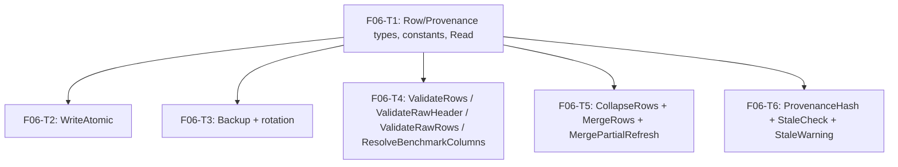

# F06 — csvstore: Tasks

## Task graph



All tasks require F02 (`internal/decimal`) and F05 (`internal/security`) to be complete first (specs/DEPENDENCY-GRAPH.md row F06: depends_on F02, F05).

## Task F06-T1: Create package skeleton, Row/Provenance types, column constants, and Read

**Depends on:** none (F02, F05 complete per specs/DEPENDENCY-GRAPH.md)

**Files:**
- create `internal/catalog/csvstore/read.go`
- create `internal/catalog/csvstore/read_test.go`

**Spec references:** `specs/features/F06-csvstore/SPEC.md §2.1, §2.2, §2.7, §3`, `specs/features/F06-csvstore/CONTRACTS.md §1-§4.1`, `specs/global/CONTRACTS.md §8`, `docs/plan/annex-b-catalog-port.md §6.2a`, `docs/plan/research/model-data-pipeline-spec.md §3.1, §3.2`

**Instructions:**
1. Create the directory `internal/catalog/csvstore/` under the module root (`github.com/WD-Mitchell/which-model`).
2. In `read.go`, declare `package csvstore` with a package doc comment: "Package csvstore provides atomic CSV persistence for the catalog: bounded reads, atomic writes, timestamped backups with rotation, identity-keyed merging, and raw-CSV provenance hashing (specs/features/F06-csvstore/SPEC.md §1). This package MUST NOT import internal/catalog/identity or anything under internal/usage, internal/routing, or internal/pick (specs/global/CONTRACTS.md §8)."
3. Add these imports: `encoding/csv`, `encoding/hex`, `errors`, `fmt`, `io`, `strings`, `unicode/utf8`, `github.com/WD-Mitchell/which-model/internal/security`.
4. Declare the constants, exactly as in CONTRACTS.md §1:
   ```go
   const (
       BenchmarkColumnPrefix = "benchmark:"
       ProvenancePrefix      = "# which-model-scores-provenance" // annex-b §6.2a comment-line keyword
       MaxCsvBytes           = 16 << 20 // 16 MiB
       DefaultBackupKeep     = 5
   )
   ```
5. Declare `RawCoreColumns` (8 names in the exact order from CONTRACTS.md §1 — model, reasoning, intelligence_index, time_per_intelligence_index_task_seconds, cost_per_intelligence_index_task_usd, median_end_to_end_response_time_seconds, artificial_analysis_coding_index, artificial_analysis_agentic_index), `CategoryScoreColumns` (12 names — reasoning_score, knowledge_score, research_score, planning_capability_score, instruction_following_score, software_engineering_score, ui_visual_score, agentic_tools_score, finance_score, evidence_capture_score, security_score, data_ml_score), and `NonNegativeRawColumns` (map with the 3 time/cost/median column names → true). Copy the names verbatim from CONTRACTS.md §1; do not rename.
6. Declare `type Provenance struct { RawSHA256 string }` and `type Row struct { Header []string; Values []string; Authoritative map[string]bool }` with the doc comments from CONTRACTS.md §2.
7. Declare the five sentinel errors from CONTRACTS.md §3 (`ErrMissingFile`, `ErrFileTooLarge`, `ErrMalformedCSV`, `ErrDuplicateIdentity`, `ErrChangedDuringWrite`).
8. Implement `func Read(path string) (rows []Row, provenance *Provenance, err error)`:
   - Call `content, _, err := security.ReadBoundedFile(path, MaxCsvBytes)`. `ReadBoundedFile` returns distinct errors for missing vs oversized files (per `specs/features/F05-security/CONTRACTS.md`). Map: missing-file error → `fmt.Errorf("%w: %s", ErrMissingFile, path)`; oversized error → `fmt.Errorf("%w: %s", ErrFileTooLarge, path)`; any other error → return it unwrapped.
   - If `!utf8.Valid(content)` → `fmt.Errorf("%w: %s is not valid UTF-8", ErrMalformedCSV, path)`.
   - Provenance handling (SPEC.md §2.7): if the content starts with `#` — split off the first line at the first `"\n"`. That line MUST start with `ProvenancePrefix` (`"# which-model-scores-provenance"`), else `ErrMalformedCSV` ("bad provenance line"). Parse the remainder of the line with `strings.Fields`; every token MUST be `key=value` with a non-empty key and value (`strings.SplitN(token, "=", 2)`), else `ErrMalformedCSV`. Per token: `raw_sha256` → must be exactly 64 chars and parse with `hex.DecodeString`, else `ErrMalformedCSV`; store its lowercase form in `RawSHA256`. `normalizer` → `Normalizer`; `aggregator` → `Aggregator`. Any other key → skip it (unknown tokens are ignored, SPEC.md §4). After the loop `RawSHA256` MUST be set — a provenance line without it is `ErrMalformedCSV` ("missing raw_sha256"). Then, if the remaining text also starts with `#` → `ErrMalformedCSV` ("multiple provenance lines"). If the content does not start with `#`, `provenance` stays nil.
   - Parse the (remaining) text with `csv.NewReader(strings.NewReader(text))`. Read the header row first: `r.Read()`; an empty header (0 fields) → `ErrMalformedCSV`. Set `r.FieldsPerRecord = len(header)`.
   - Loop `r.Read()` until `io.EOF`. For each record build `Row{Header: header, Values: record}` and append. Any read error other than EOF (a `*csv.ParseError` from a wrong field count, quoting error, etc.) → `fmt.Errorf("%w: %s row: %v", ErrMalformedCSV, path, err)`.
   - If zero data rows → `fmt.Errorf("%w: no data rows in %s", ErrMalformedCSV, path)`.
   - Return `rows, provenance, nil`.
9. Do NOT trim or alter cell text (SPEC.md §2.1 — cells are verbatim). Do NOT validate model/reasoning values here.
10. In `read_test.go`, declare `package csvstore` and write a helper:
    ```go
    func writeTemp(t *testing.T, content string) string {
        t.Helper()
        path := filepath.Join(t.TempDir(), "fixture.csv")
        if err := os.WriteFile(path, []byte(content), 0o644); err != nil { t.Fatal(err) }
        return path
    }
    ```
    (imports: `path/filepath`, `os`, `strings`, `errors`, `testing`.)
11. Write `TestRead` as a table-driven test with `t.Run(name, ...)` per row. Each case runs `Read` and compares rows/provenance/error with `want`. Use the REAL fixture values below — they come from `docs/plan/research/model-data-pipeline-spec.md §3.1/§3.2` example rows.
12. Case 1 — valid raw CSV, no comment line:
    ```
    model,reasoning,intelligence_index,time_per_intelligence_index_task_seconds,cost_per_intelligence_index_task_usd,median_end_to_end_response_time_seconds,artificial_analysis_coding_index,artificial_analysis_agentic_index
    Claude Opus 5,max,63.1,465,2.34,61,78.0,59.2
    Kimi K2.7 Code,default,43.0,,0.22,67,60.8,30.3
    ```
    want: 2 rows, each `Header` == the 8 names, `Values[1]` of row 2 == `"default"`, `Values[3]` of row 2 == `""`, provenance nil.
13. Case 2 — scores CSV with the full annex-b §6.2a line: first line `# which-model-scores-provenance raw_sha256=` + 64×`a` + ` normalizer=minmax-linear aggregator=weighted-arithmetic-mean`, then header `model,reasoning,intelligence_index_score`, then row `Claude Fable 5,max,98`. want: provenance `RawSHA256 == strings.Repeat("a", 64)`, `Normalizer == "minmax-linear"`, `Aggregator == "weighted-arithmetic-mean"`, 1 row, comment line not present in any cell.
14. Case 3 — same content as case 2 but the line has only the `raw_sha256` token (no normalizer/aggregator) → `Normalizer == ""` and `Aggregator == ""`.
15. Case 4 — first line `# raw_sha256=` + 64×`a` (wrong keyword, missing `which-model-scores-provenance`) → `errors.Is(err, ErrMalformedCSV)`.
16. Case 5 — first line `# which-model-scores-provenance raw_sha256=xyz` (not hex) → `ErrMalformedCSV`.
17. Case 6 — first line `# which-model-scores-provenance normalizer=minmax-linear` (no `raw_sha256` token) → `ErrMalformedCSV`.
18. Case 7 — first line `# which-model-scores-provenance raw_sha256=` + 64×`a` + ` foo=bar` (unknown token) → parses: provenance set, fields as in case 2's hash-only variant.
19. Case 8 — two leading `#` lines → `ErrMalformedCSV`.
20. Case 9 — header with 3 columns but a data row with 2 cells → `ErrMalformedCSV`.
21. Case 10 — path that does not exist → `errors.Is(err, ErrMissingFile)`.
22. Case 11 — file of `MaxCsvBytes+1` zero bytes → `errors.Is(err, ErrFileTooLarge)`.
23. Case 12 — content `"model\xff\n"` (invalid UTF-8) → `ErrMalformedCSV`.

**Test cases (write these first):**

| # | input | want |
|---|---|---|
| 1 | valid raw CSV (8-col header, 2 rows incl. blank cell) | 2 rows, header preserved, blank cell `""`, provenance nil |
| 2 | `# which-model-scores-provenance raw_sha256=<64×a> normalizer=minmax-linear aggregator=weighted-arithmetic-mean` + scores CSV | all three fields parsed, 1 row, comment stripped |
| 3 | provenance line with only `raw_sha256` | `Normalizer == ""`, `Aggregator == ""` |
| 4 | `# raw_sha256=<64×a>` (wrong keyword) | `ErrMalformedCSV` |
| 5 | `raw_sha256=xyz` (not hex) | `ErrMalformedCSV` |
| 6 | provenance line without `raw_sha256` token | `ErrMalformedCSV` |
| 7 | provenance line with extra unknown token `foo=bar` | parsed; unknown token skipped |
| 8 | two leading `#` lines | `ErrMalformedCSV` |
| 9 | row with fewer cells than header | `ErrMalformedCSV` |
| 10 | nonexistent path | `ErrMissingFile` |
| 11 | file of `MaxCsvBytes+1` bytes | `ErrFileTooLarge` |
| 12 | invalid UTF-8 byte | `ErrMalformedCSV` |

**Acceptance criteria:**
- [ ] `go build ./internal/catalog/csvstore/...` succeeds
- [ ] `go test ./internal/catalog/csvstore/...` passes with the 12 cases above
- [ ] no file outside the Files list modified
- [ ] package imports nothing under `internal/usage`, `internal/routing`, `internal/pick`, or `internal/catalog/identity` (SPEC.md §2.10)
- [ ] `go build -tags nousage ./internal/catalog/csvstore/...` succeeds (annex-b §0)

```
go test ./internal/catalog/csvstore/...
```

## Task F06-T2: Implement WriteAtomic with temp-file + fsync + rename and crash-safety cleanup

**Depends on:** F06-T1

**Files:**
- create `internal/catalog/csvstore/write.go`
- create `internal/catalog/csvstore/write_test.go`

**Spec references:** `specs/features/F06-csvstore/SPEC.md §2.3, §3`, `specs/features/F06-csvstore/CONTRACTS.md §4.2`, `docs/plan/annex-b-catalog-port.md §6.4`

**Instructions:**
1. In `write.go`, declare `package csvstore`; imports: `bytes`, `encoding/csv`, `errors`, `fmt`, `os`, `path/filepath`, `strings`, `github.com/WD-Mitchell/which-model/internal/security`.
2. Implement the unexported renderer:
   ```go
   func renderContent(rows []Row, provenance *Provenance) ([]byte, error)
   ```
   - `len(rows) == 0` → `fmt.Errorf("%w: no data rows", ErrMalformedCSV)`.
   - `header := rows[0].Header`; `len(header) == 0` → `ErrMalformedCSV`.
   - Every row's `Header` must equal `header` element-wise and `len(row.Values)` must equal `len(header)`; otherwise `fmt.Errorf("%w: inconsistent row headers", ErrMalformedCSV)`.
   - If `provenance != nil` (SPEC.md §2.7): its `RawSHA256` must be 64 lowercase hex characters (`hex.DecodeString` succeeds and the string equals its lowercase form); otherwise `ErrMalformedCSV`. Write the first line as `ProvenancePrefix + " raw_sha256=" + RawSHA256`, then append `" normalizer=" + Normalizer` when `Normalizer != ""` and `" aggregator=" + Aggregator` when `Aggregator != ""`, then `"\n"`. The rendered line must match the annex-b §6.2a shape exactly.
   - Use `csv.NewWriter(&buf)`; write `header` then each row's `Values`; `Flush()`; if `w.Error() != nil` → wrap `ErrMalformedCSV`. Go's `csv.Writer` emits `\n` line terminators (never `\r\n`) — do not override.
   - Return the buffer's bytes.
3. Implement the unexported replace primitive shared by both entry points:
   ```go
   func atomicReplace(path string, content []byte) error
   ```
   - Step 1 — read current bytes: `original, _, err := security.ReadBoundedFile(path, MaxCsvBytes)`; map missing → `ErrMissingFile` exactly as in F06-T1 step 8. This is a replace, not a create.
   - Step 2 — `dir, base := filepath.Dir(path), filepath.Base(path)`; `tmp, err := os.CreateTemp(dir, "."+base+".")`; on error return `fmt.Errorf("write temp: %w", err)`. Keep `tmpName := tmp.Name()`. Track a `renamed bool`; on any failure before rename, `os.Remove(tmpName)` (ignore "not exist").
   - Write `content` to `tmp`, call `tmp.Sync()`, then `tmp.Close()`; on error clean up and return.
   - Step 3 — re-read `path` via `security.ReadBoundedFile`; if the bytes differ from `original` → `fmt.Errorf("%w: %s", ErrChangedDuringWrite, path)` (clean up first).
   - Step 4 — `os.Rename(tmpName, path)`; set `renamed = true`; return nil.
4. Implement `func WriteAtomic(path string, rows []Row, provenance *Provenance) error` — `content, err := renderContent(rows, provenance)`; on error return it; then `return atomicReplace(path, content)`.
5. Implement `func WriteAtomicBytes(path string, content []byte) error` (CONTRACTS.md §4.2) — `return atomicReplace(path, content)`. No rendering, no provenance parsing, no validation of `content`; the caller (F09 scores Derive via F23) supplies complete bytes including the §6.2a line.
6. In `write_test.go` (`package csvstore`, imports `errors`, `os`, `path/filepath`, `strings`, `testing`), add a helper:
   ```go
   func assertNoTempFiles(t *testing.T, dir, base string) {
       t.Helper()
       entries, err := os.ReadDir(dir)
       if err != nil { t.Fatal(err) }
       for _, e := range entries {
           if strings.HasPrefix(e.Name(), "."+base+".") {
               t.Fatalf("leftover temp file: %s", e.Name())
           }
       }
   }
   ```
7. Table-driven `TestWriteAtomic` (cases 1–10) and `TestWriteAtomicBytes` (cases 11–12); standalone assertions for 5, 6, 9 (they need pre/post file reads).
8. Case 1 — round-trip: `writeTemp` a raw CSV; `WriteAtomic(path, rows, nil)` where `rows` are the parsed rows of that same file; `Read(path)` again → identical rows; then read the raw file bytes and assert `!strings.Contains(string(content), "\r\n")`.
9. Case 2 — full provenance round-trip: `WriteAtomic(path, rows, &Provenance{RawSHA256: strings.Repeat("a", 64), Normalizer: "minmax-linear", Aggregator: "weighted-arithmetic-mean"})`; assert the file's first line is exactly `# which-model-scores-provenance raw_sha256=` + 64×`a` + ` normalizer=minmax-linear aggregator=weighted-arithmetic-mean`; `Read` returns the same three fields and rows.
10. Case 3 — hash-only provenance: `&Provenance{RawSHA256: …}` → first line is exactly `# which-model-scores-provenance raw_sha256=<hex>` (no trailing tokens); `Read` → `Normalizer == ""`, `Aggregator == ""`.
11. Case 4 — no provenance: after write, the file's first line is the header row (starts with `model,`).
12. Case 5 — crash-safety A: target contains original bytes; call `WriteAtomic` with rows whose `Values` length ≠ `Header` length; expect `ErrMalformedCSV`; assert the file still holds the original bytes and `assertNoTempFiles` passes.
13. Case 6 — crash-safety B: create a directory at `path` (use `os.Mkdir`); call `WriteAtomic(path, validRows, nil)`; expect an error (rename fails); assert the directory still exists and no temp files remain.
14. Case 7 — missing target: `WriteAtomic(join(dir,"absent.csv"), rows, nil)` → `errors.Is(err, ErrMissingFile)`.
15. Case 8 — empty rows → `ErrMalformedCSV`; file unchanged.
16. Case 9 — cell containing `a,b` (comma): write a row with that value; `Read` back → the value is one cell `a,b` (quoting round-trips).
17. Case 10 — blank cells: write rows with `""` values; `Read` back → `""`.
18. Case 11 — `WriteAtomicBytes` byte-exact: target holds `old`; call `WriteAtomicBytes(path, newContent)` where `newContent` is complete scores bytes: the §6.2a line (`# which-model-scores-provenance raw_sha256=` + 64×`b` + ` normalizer=minmax-linear`) + header + one row; then read raw bytes → exactly `newContent`; `Read(path)` → provenance parsed (`RawSHA256` = 64×`b`, `Normalizer == "minmax-linear"`) and 1 row.
19. Case 12 — `WriteAtomicBytes` on a nonexistent target → `errors.Is(err, ErrMissingFile)`.

**Test cases (write these first):**

| # | input | want |
|---|---|---|
| 1 | valid rows, existing file | file replaced; `Read` returns identical rows; no `\r\n` in bytes |
| 2 | rows + `&Provenance{RawSHA256, Normalizer, Aggregator}` | first line is the full §6.2a line; `Read` round-trips all three fields |
| 3 | rows + `&Provenance{RawSHA256}` | first line `# which-model-scores-provenance raw_sha256=<hex>` only; Normalizer/Aggregator `""` |
| 4 | rows, nil provenance | no `#` line; first line is the header |
| 5 | rows with `Values` length ≠ `Header` length | `ErrMalformedCSV`; original bytes unchanged; no temp files |
| 6 | target path is a directory | error; no temp files |
| 7 | nonexistent target | `ErrMissingFile` |
| 8 | empty rows | `ErrMalformedCSV`; file unchanged |
| 9 | cell `a,b` | round-trips as one cell |
| 10 | blank cells | round-trip as `""` |
| 11 | `WriteAtomicBytes` with opaque §6.2a content | file bytes == content exactly; `Read` parses provenance + rows |
| 12 | `WriteAtomicBytes` on nonexistent target | `ErrMissingFile` |

**Acceptance criteria:**
- [ ] `go build ./internal/catalog/csvstore/...` succeeds
- [ ] `go test ./internal/catalog/csvstore/...` passes with the cases above (T1 tests still pass)
- [ ] no file outside the Files list modified
- [ ] crash-safety cases (5, 6) prove the original file is byte-identical and no temp file survives a failed write
- [ ] `WriteAtomicBytes` shares the same `atomicReplace` primitive as `WriteAtomic` (no duplicated write logic)

```
go test ./internal/catalog/csvstore/...
```

## Task F06-T3: Implement Backup with timestamped exclusive-create copies and keep-N rotation

**Depends on:** F06-T1

**Files:**
- create `internal/catalog/csvstore/backup.go`
- create `internal/catalog/csvstore/backup_test.go`

**Spec references:** `specs/features/F06-csvstore/SPEC.md §2.4, §4`, `specs/features/F06-csvstore/CONTRACTS.md §4.3`, `docs/plan/annex-b-catalog-port.md §6.4`

**Instructions:**
1. In `backup.go`, declare `package csvstore`; imports: `errors`, `fmt`, `io/fs`, `os`, `path/filepath`, `sort`, `strings`, `time`, `github.com/WD-Mitchell/which-model/internal/security`.
2. Implement the unexported stamp-injectable core so the collision suffix is testable deterministically:
   ```go
   func backupWithStamp(path string, keep int, stamp string) (string, error)
   ```
   - `keep < 1` → `fmt.Errorf("keep must be at least 1")`.
   - `content, _, err := security.ReadBoundedFile(path, MaxCsvBytes)`; missing → `ErrMissingFile` (mapping as in F06-T1 step 8).
   - Find the name: for `n := 0; ; n++` build `candidate := fmt.Sprintf("%s.%s.bak", path, stamp)` when `n == 0`, else `fmt.Sprintf("%s.%s.%d.bak", path, stamp, n)`; `os.OpenFile(candidate, os.O_WRONLY|os.O_CREATE|os.O_EXCL, 0o644)`: on `fs.ErrExist` continue to the next `n`; on any other error return it; else write `content`, `f.Sync()`, `f.Close()`, set `backupPath = candidate`, break.
   - Rotation: `entries, err := os.ReadDir(filepath.Dir(path))`; collect file names that start with `base + "."` and end with `".bak"` (where `base := filepath.Base(path)`); sort descending (`sort.Sort(sort.Reverse(sort.StringSlice(names)))`); for `i := keep; i < len(names); i++` → `os.Remove(filepath.Join(dir, names[i]))` (ignore "not exist"). The just-created backup has the newest stamp, so it is never deleted.
   - Return `backupPath, nil`.
3. Implement `func Backup(path string, keep int) (backupPath string, err error)` — one line: `return backupWithStamp(path, keep, time.Now().UTC().Format("20060102T150405.000000Z"))`.
4. In `backup_test.go` (`package csvstore`, imports `errors`, `os`, `path/filepath`, `regexp`, `strings`, `testing`), write table-driven `TestBackup` and standalone rotation tests. Helper `stampOf(t, name)` extracts the stamp with `regexp.MustCompile(`\.(\d{8}T\d{6}\.\d{6}Z)(?:\.\d+)?\.bak$`)`.
5. Case 1 — `Backup` on a file with known bytes → returns a path whose base name matches `<name>.<stamp>.bak` and whose content equals the original.
6. Case 2 — backup file bytes == original file bytes.
7. Case 3 — collision suffix: call `backupWithStamp(path, 5, "20260807T214300000000Z")` twice → first returns `…20260807T214300000000Z.bak`, second returns `…20260807T214300000000Z.1.bak`; both exist with identical content.
8. Case 4 — rotation keep=5: pre-create 6 backup files with older stamps (`20260101T000000000000Z` … lexicographically increasing) plus the target file; call `Backup(path, 5)`; assert exactly 5 `*.bak` files remain and the pre-created file with the oldest stamp is gone.
9. Case 5 — keep=1: pre-create 3 backups with increasing stamps; `Backup(path, 1)` → only 1 `.bak` remains (the newest).
10. Case 6 — `Backup(path, 0)` → error "keep must be at least 1".
11. Case 7 — missing target → `errors.Is(err, ErrMissingFile)`.
12. Case 8 — after any `Backup` call, the file named by the returned path exists (the just-created backup is never rotated away).
13. Case 9 — returned name matches `regexp.MustCompile(`^<name>\.\d{8}T\d{6}\.\d{6}Z(\.\d+)?\.bak$`)` (stamp is UTC microsecond).
14. Case 10 — unrelated sibling files (`other.csv`, `<name>.txt`, `<name>.bak` without a stamp) are untouched by rotation.
15. Case 11 — pre-create 2 backups with increasing stamps and `keep=3` with a new backup → all 3 remain (rotation deletes nothing beyond the bound).
16. Case 12 — target file whose content ends with `"\n"` → backup bytes identical (no trimming).

**Test cases (write these first):**

| # | input | want |
|---|---|---|
| 1 | existing file | `<name>.<stamp>.bak` created with original bytes |
| 2 | existing file | backup bytes == original bytes |
| 3 | two `backupWithStamp` calls with the same stamp | `.bak` then `.1.bak`, both with original bytes |
| 4 | 6 pre-existing older backups, keep=5 | oldest removed, 5 remain |
| 5 | 3 pre-existing backups, keep=1 | only newest remains |
| 6 | keep=0 | error |
| 7 | missing target | `ErrMissingFile` |
| 8 | any successful call | returned path exists after rotation |
| 9 | any successful call | name matches `^<name>\.\d{8}T\d{6}\.\d{6}Z(\.\d+)?\.bak$` |
| 10 | unrelated siblings (`other.csv`, `<name>.txt`, unstamped `<name>.bak`) | untouched |
| 11 | 2 older backups, keep=3 | all 3 remain |
| 12 | file ending in `\n` | backup bytes identical |

**Acceptance criteria:**
- [ ] `go build ./internal/catalog/csvstore/...` succeeds
- [ ] `go test ./internal/catalog/csvstore/...` passes with the cases above
- [ ] no file outside the Files list modified
- [ ] rotation keeps exactly the `keep` most recent backups, never the just-created one

```
go test ./internal/catalog/csvstore/...
```

## Task F06-T4: Implement ValidateRows, ValidateRawHeader, ValidateRawRows, ResolveBenchmarkColumns

**Depends on:** F06-T1

**Files:**
- create `internal/catalog/csvstore/validate.go`
- create `internal/catalog/csvstore/validate_test.go`

**Spec references:** `specs/features/F06-csvstore/SPEC.md §2.8, §2.9`, `specs/features/F06-csvstore/CONTRACTS.md §4.7, §4.8`, `docs/plan/research/model-data-pipeline-spec.md §3.1, §3.3`

**Instructions:**
1. In `validate.go`, declare `package csvstore`; imports: `errors`, `fmt`, `strings`, `github.com/WD-Mitchell/which-model/internal/decimal`.
2. Implement `func ValidateRows(rows []Row) error`:
   - `len(rows) == 0` → `fmt.Errorf("%w: no data rows", ErrMalformedCSV)`.
   - `header := rows[0].Header`; find the column indexes of `"model"` and `"reasoning"` in `header` (a small loop); either missing → `fmt.Errorf("%w: no model/reasoning identity columns", ErrMalformedCSV)`.
   - For every row: `len(row.Header) != len(header)` or headers differ element-wise → `ErrMalformedCSV` ("inconsistent row headers"); `len(row.Values) != len(header)` → `ErrMalformedCSV`; `row.Values[modelIdx]` or `row.Values[reasoningIdx]` blank → `ErrMalformedCSV` ("blank identity").
   - Track `seen := map[[2]string]bool{}`; duplicate `(model, reasoning)` → `fmt.Errorf("%w: %s / %s", ErrDuplicateIdentity, model, reasoning)`.
3. Implement `func ValidateRawHeader(header []string) error`:
   - `len(header) < len(RawCoreColumns)` → `fmt.Errorf("%w: unexpected core columns", ErrMalformedCSV)`.
   - The first 8 entries must equal `RawCoreColumns` element-wise, else `ErrMalformedCSV` ("unexpected core columns").
   - For each extra column: must start with `BenchmarkColumnPrefix` and the name after the prefix must be non-empty, else `ErrMalformedCSV` ("invalid dynamic benchmark column"); a repeated benchmark name → `ErrMalformedCSV` ("duplicate benchmark columns").
4. Implement `func ValidateRawRows(rows []Row) error`:
   - Call `ValidateRows(rows)` and `ValidateRawHeader(rows[0].Header)`; return their errors.
   - For each row and each column index `i` with name `col := rows[0].Header[i]`: skip blank cells. If `i` is in `2..7` (the six numeric raw metric columns) or `col` starts with `BenchmarkColumnPrefix`: `d, err := decimal.Parse(cell)`; parse failure → `fmt.Errorf("%w: non-numeric %s for %s / %s", ErrMalformedCSV, col, model, reasoning)`; if `NonNegativeRawColumns[col] && d.IsNegative()` → `fmt.Errorf("%w: negative required metric for %s / %s", ErrMalformedCSV, model, reasoning)`.
5. Implement `func ResolveBenchmarkColumns(groupBenchmarks [][]string, direct []string) []string` (SPEC.md §2.8): iterate `groupBenchmarks` in order, then `direct`; append each name once, keeping first occurrence (`seen map[string]bool`).
6. In `validate_test.go` (`package csvstore`, imports `errors`, `strings`, `testing`), write a helper `rowsOf(t, header, records...)` building `[]Row` literals directly (no file I/O).
7. Table-driven `TestValidateRows`:
   - Case 1 — two valid rows (raw header + 2 rows from F06-T1 case 1) → nil error.
   - Case 2 — same model+reasoning twice → `errors.Is(err, ErrDuplicateIdentity)`.
   - Case 3 — blank model cell → `ErrMalformedCSV`.
   - Case 4 — blank reasoning cell → `ErrMalformedCSV`.
   - Case 5 — second row with a different header → `ErrMalformedCSV`.
8. Table-driven `TestValidateRawHeader`:
   - Case 6 — extra column `notes` (no `benchmark:` prefix) → `ErrMalformedCSV`.
   - Case 7 — extras `benchmark:SWE-Bench Verified` twice → `ErrMalformedCSV`.
   - Case 8 — first column `Model` instead of `model` → `ErrMalformedCSV`.
9. Table-driven `TestValidateRawRows`:
   - Case 9 — `intelligence_index` cell `abc` → `ErrMalformedCSV`.
   - Case 10 — `cost_per_intelligence_index_task_usd` cell `-1.5` → `ErrMalformedCSV`.
   - Case 11 — `benchmark:SWE-Bench Verified` cell `not-a-number` → `ErrMalformedCSV`.
10. Table-driven `TestResolveBenchmarkColumns` (case 12 — the last case):
    `ResolveBenchmarkColumns([][]string{{"SWE-Bench Verified","Terminal-Bench"},{"Terminal-Bench","Toolathlon"}}, []string{"Toolathlon","MCP Atlas"})` → `["SWE-Bench Verified","Terminal-Bench","Toolathlon","MCP Atlas"]` (dedup keeps first occurrence).

**Test cases (write these first):**

| # | input | want |
|---|---|---|
| 1 | two valid raw rows | nil |
| 2 | duplicate (model, reasoning) | `ErrDuplicateIdentity` |
| 3 | blank model cell | `ErrMalformedCSV` |
| 4 | blank reasoning cell | `ErrMalformedCSV` |
| 5 | rows with different headers | `ErrMalformedCSV` |
| 6 | header extra column `notes` | `ErrMalformedCSV` |
| 7 | duplicate `benchmark:` column | `ErrMalformedCSV` |
| 8 | first column `Model` (wrong case) | `ErrMalformedCSV` |
| 9 | non-numeric `intelligence_index` cell | `ErrMalformedCSV` |
| 10 | negative cost cell | `ErrMalformedCSV` |
| 11 | non-numeric benchmark cell | `ErrMalformedCSV` |
| 12 | `ResolveBenchmarkColumns([["SWE-Bench Verified","Terminal-Bench"],["Terminal-Bench","Toolathlon"]], ["Toolathlon","MCP Atlas"])` | `[SWE-Bench Verified, Terminal-Bench, Toolathlon, MCP Atlas]` |

**Acceptance criteria:**
- [ ] `go build ./internal/catalog/csvstore/...` succeeds
- [ ] `go test ./internal/catalog/csvstore/...` passes with the cases above
- [ ] no file outside the Files list modified
- [ ] `ValidateRawRows` uses `decimal.Parse` from `internal/decimal` (F02) for every numeric cell check

```
go test ./internal/catalog/csvstore/...
```

## Task F06-T5: Implement CollapseRows, MergeRows, MergePartialRefresh

**Depends on:** F06-T1

**Files:**
- create `internal/catalog/csvstore/merge.go`
- create `internal/catalog/csvstore/merge_test.go`

**Spec references:** `specs/features/F06-csvstore/SPEC.md §2.5, §2.6`, `specs/features/F06-csvstore/CONTRACTS.md §4.4-§4.6`, `docs/plan/annex-b-catalog-port.md §3.4`, `docs/plan/research/model-data-pipeline-spec.md §4.2, §4.4`

**Instructions:**
1. In `merge.go`, declare `package csvstore`; imports: `errors`, `fmt`, `strings`, `github.com/WD-Mitchell/which-model/internal/decimal`.
2. Implement the unexported helpers:
   - `func collapseReasoning(level string) string` — return `"high"` when `level == "default"`, else `level` (pipeline spec §4.2).
   - `func columnIndex(header []string, name string) int` — index of `name` in `header`, or `-1`.
   - `func cellByIndex(row Row, idx int) string` — `""` when `idx < 0` or out of range, else `row.Values[idx]`.
   - `func valuesByName(row Row) map[string]string` — `Header[i] → Values[i]` for all `i`.
   - `func identityOf(row Row) ([2]string, error)` — model = `cellByIndex(row, columnIndex(row.Header, "model"))`, reasoning = `cellByIndex(row, columnIndex(row.Header, "reasoning"))`; either missing or blank → `fmt.Errorf("%w: blank identity", ErrMalformedCSV)`; return `[2]string{model, collapseReasoning(reasoning)}`.
3. Implement `func CollapseRows(rows []Row) ([]Row, error)` (SPEC.md §2.5):
   - All rows must share one header: else `ErrMalformedCSV` ("inconsistent row headers").
   - Group in first-seen order: `grouped := map[[2]string][]Row{}` and `order [] [2]string`; for each row compute `id, err := identityOf(row)`.
   - For each id in order: `base := first member with reasoning cell != "default", else members[0]` (the reasoning cell is `cellByIndex(member, columnIndex(header,"reasoning"))`).
   - Output row: `Header = header`, `Values = copy(base.Values)`.
   - Non-identity, non-benchmark columns (`name != "model" && name != "reasoning" && !strings.HasPrefix(name, BenchmarkColumnPrefix)`): if the base's cell is blank, scan members in order and take the first non-blank value.
   - Benchmark columns (names in `header` with the prefix): value = maximum over the members' non-blank cells, compared as decimals: parse each non-blank cell with `decimal.Parse` (a parse failure is a data bug — return `fmt.Errorf("%w: non-numeric benchmark cell", ErrMalformedCSV)`); keep the cell of the largest value (ties: first member).
   - `Authoritative`: union of all members' `Authoritative` maps.
   - Append and return.
4. Implement `func MergeRows(existing, fresh []Row) ([]Row, error)` (SPEC.md §2.6):
   - `existing, err = CollapseRows(existing)`; `fresh, err = CollapseRows(fresh)`.
   - Index existing: `byID := map[[2]string]Row{}` via `identityOf` (identity is now already collapsed).
   - For each fresh row `f`: `out := Row{Header: f.Header, Values: append([]string(nil), f.Values...), Authoritative: <shallow copy of f.Authoritative>}`. If `cur, ok := byID[idOf(f)]`:
     - For every column index `i` of `f.Header` with name `n`, skipping `"model"`/`"reasoning"`: if `strings.HasPrefix(n, BenchmarkColumnPrefix)` → if `out.Values[i] == "" && !out.Authoritative[n]` → `out.Values[i] = valuesByName(cur)[n]` (fallback; `""` if absent). Else (core metric column) → if `out.Values[i] == ""` → `out.Values[i] = valuesByName(cur)[n]`.
   - Append `out` to the result (fresh order). Existing-only rows are dropped (SPEC.md §2.6 item 4). Return the result.
5. Implement `func MergePartialRefresh(existing, fresh []Row, refreshedModels []string, preserveUnselected bool) ([]Row, error)`:
   - If `len(fresh) == 0` → return the result of `MergeRows(existing, fresh)` (which is empty).
   - `existing, err = CollapseRows(existing)`; `merged, err := MergeRows(existing, fresh)`.
   - If `!preserveUnselected` → return `merged`.
   - `names := map[string]bool{}` over `refreshedModels`; `header := fresh[0].Header`; for each collapsed existing row whose model cell (index of `"model"` in its header) is NOT in `names`: build `Row{Header: header, Values: make([]string, len(header))}` and fill each column from `valuesByName(existingRow)`, blank when absent; append after `merged`.
6. In `merge_test.go` (`package csvstore`, imports `reflect`, `strings`, `testing`), build rows with a helper:
   ```go
   func rowOf(header []string, values ...string) Row {
       return Row{Header: header, Values: values}
   }
   ```
7. Table-driven `TestCollapseRows`:
   - Case 1 — REAL scenario from `tests/test_update_raw_values.py` `test_existing_annotated_names_are_normalized_and_merged` (names already clean; values verbatim): header `[model, reasoning, intelligence_index, benchmark:Humanity's Last Exam]`; rows `("Example","default","10","61")` and `("Example","high","11","64")` → one row `("Example","high","11","64")` (base is the non-default row; benchmark takes the max 64).
   - Case 2 — base blank metric filled from the other member: rows `("Example","high","","61")` + `("Example","default","12","")` → one row `("Example","high","12","61")`.
   - Case 3 — first-seen order: rows `("A","high","1","")`, `("B","high","2","")`, then a duplicate `("A","high","","9")` → output rows `A` then `B` (group order = first occurrence).
   - Case 4 — blank model → `ErrMalformedCSV`.
8. Table-driven `TestMergeRows`:
   - Case 5 — fresh wins: existing `("Kimi K2.7 Code","high","40.0","")` (values from pipeline spec §3.1), fresh `("Kimi K2.7 Code","default","43.0","")` → one row `("Kimi K2.7 Code","high","43.0","")`.
   - Case 6 — zero is a valid win: existing cost `"55"`, fresh cost `"0"` → `"0"` (never treated as blank).
   - Case 7 — fresh blank kept from existing: existing cost `"0.22"`, fresh cost `""` → `"0.22"`.
   - Case 8 — benchmark fallback: existing `benchmark:SWE-Bench Verified = "96.0"`, fresh blank and NOT authoritative → `"96.0"`.
   - Case 9 — benchmark clear: same but fresh row's `Authoritative = {"benchmark:SWE-Bench Verified"}` → stays `""`.
   - Case 10 — fresh-only appended, existing-only dropped: existing has `("Old Model","high",...)`, fresh has only `("New Model","high",...)` → result contains only `New Model`.
9. Table-driven `TestMergePartialRefresh`:
   - Case 11 — `preserveUnselected=true`, `refreshedModels=["New Model"]`, existing also has `("Old Model","high","9","")` → result contains both `New Model` (merged) and `Old Model` (appended unchanged, values by name).
   - Case 12 — same but `preserveUnselected=false` → only `New Model`.

**Test cases (write these first):**

| # | input | want |
|---|---|---|
| 1 | CollapseRows: Example/default(10, HLE 61) + Example/high(11, HLE 64) | one row Example/high, intelligence 11, HLE 64 |
| 2 | CollapseRows: base blank metric filled from member | filled value, benchmark max |
| 3 | CollapseRows: duplicate identity out of order | group order = first occurrence |
| 4 | CollapseRows: blank model | `ErrMalformedCSV` |
| 5 | MergeRows: fresh default 43.0 vs existing high 40.0 | 43.0 (collapse makes them one identity) |
| 6 | MergeRows: fresh cost `0` vs existing `55` | `0` (zero is a valid win) |
| 7 | MergeRows: fresh blank metric | existing value kept |
| 8 | MergeRows: fresh blank benchmark, not authoritative | existing value kept |
| 9 | MergeRows: fresh blank benchmark, authoritative | stays blank (cleared) |
| 10 | MergeRows: existing-only identity | dropped |
| 11 | MergePartialRefresh preserveUnselected=true | unrefreshed family rows appended |
| 12 | MergePartialRefresh preserveUnselected=false | only merged rows |

**Acceptance criteria:**
- [ ] `go build ./internal/catalog/csvstore/...` succeeds
- [ ] `go test ./internal/catalog/csvstore/...` passes with the cases above
- [ ] no file outside the Files list modified
- [ ] merge uses only `decimal.Parse` (F02) for comparisons; fresh-wins-on-non-blank and benchmark clear-vs-fallback semantics match SPEC.md §2.6

```
go test ./internal/catalog/csvstore/...
```

## Task F06-T6: Implement ProvenanceHash, StaleCheck, StaleWarning

**Depends on:** F06-T1

**Files:**
- create `internal/catalog/csvstore/provenance.go`
- create `internal/catalog/csvstore/provenance_test.go`

**Spec references:** `specs/features/F06-csvstore/SPEC.md §2.7, §3`, `specs/features/F06-csvstore/CONTRACTS.md §4.9, §4.10`, `docs/plan/annex-b-catalog-port.md §6.2a`

**Instructions:**
1. In `provenance.go`, declare `package csvstore`; imports: `crypto/sha256`, `encoding/hex`, `errors`, `fmt`, `github.com/WD-Mitchell/which-model/internal/security`.
2. Implement `func ProvenanceHash(path string) (string, error)`:
   - `content, _, err := security.ReadBoundedFile(path, MaxCsvBytes)`; map missing → `ErrMissingFile`, oversized → `ErrFileTooLarge` (as F06-T1 step 8).
   - `sum := sha256.Sum256(content)`; return `hex.EncodeToString(sum[:])`.
3. Implement `func StaleCheck(scoresPath, rawPath string) (stale bool, err error)`:
   - `_, prov, err := Read(scoresPath)`; on error return `false, err`.
   - `prov == nil` → return `false, nil` (provenance-unknown, never stale — SPEC.md §2.7).
   - `rawHash, err := ProvenanceHash(rawPath)`; on error return `false, err`.
   - Return `rawHash != prov.RawSHA256`, nil.
4. Implement `func StaleWarning(scoresPath, rawPath string) string` returning exactly one line (tests assert string equality):
   ```go
   return fmt.Sprintf("stale scores CSV %s: its recorded raw CSV hash does not match the current %s; run --refresh-scores to regenerate", scoresPath, rawPath)
   ```
5. In `provenance_test.go` (`package csvstore`, imports `crypto/sha256`, `encoding/hex`, `errors`, `fmt`, `strings`, `testing`), table-driven `TestProvenanceHash` and `TestStaleCheck` plus standalone `TestStaleWarning`.
6. Case 1 — hash of known bytes: write `"model,reasoning\nClaude Opus 5,max\n"`; compute the expected sha256 in the test (`sha256.Sum256([]byte(content))`, hex-encoded); `ProvenanceHash` equals it.
7. Case 2 — order-sensitivity (SPEC.md §2.7): write file A with rows `r1, r2` and file B with `r2, r1`; hashes differ.
8. Case 3 — same content → same hash: two identical files → equal hashes.
9. Case 4 — missing file → `errors.Is(err, ErrMissingFile)`.
10. Case 5 — `StaleCheck` with matching provenance: write raw CSV `raw.csv`; write scores CSV whose first line is `# which-model-scores-provenance raw_sha256=` + `ProvenanceHash(raw.csv)` followed by a header and one row; → `stale == false`, `err == nil`.
11. Case 6 — mismatch: same but the recorded hash is 64×`b` → `stale == true`.
12. Case 7 — scores CSV without a comment line → `stale == false`.
13. Case 8 — missing scores path → `errors.Is(err, ErrMissingFile)`.
14. Case 9 — missing raw path (scores has a valid provenance line) → `errors.Is(err, ErrMissingFile)`.
15. Case 10 — `StaleWarning("a.csv","b.csv")` equals exactly `"stale scores CSV a.csv: its recorded raw CSV hash does not match the current b.csv; run --refresh-scores to regenerate"`.
16. Case 11 — end-to-end: `WriteAtomic(scores, rows, &Provenance{RawSHA256: ProvenanceHash(raw)})` then `StaleCheck(scores, raw)` → `false`; then append a line to `raw` (via `os.WriteFile` with the new content) → `StaleCheck` → `true`.
17. Case 12 — the hash recorded by `ProvenanceHash` before a `WriteAtomic` equals `ProvenanceHash` of the file after the same `WriteAtomic` (byte-exact write).

**Test cases (write these first):**

| # | input | want |
|---|---|---|
| 1 | file with known bytes | hash == sha256 of those bytes |
| 2 | same rows, different row order | different hashes (order-sensitive) |
| 3 | two identical files | equal hashes |
| 4 | missing file | `ErrMissingFile` |
| 5 | scores provenance == current raw hash | stale=false |
| 6 | scores provenance == 64×`b` | stale=true |
| 7 | scores CSV without comment line | stale=false (provenance-unknown) |
| 8 | missing scores path | `ErrMissingFile` |
| 9 | missing raw path | `ErrMissingFile` |
| 10 | `StaleWarning("a.csv","b.csv")` | exact string, one line, names both paths + `--refresh-scores` |
| 11 | WriteAtomic with recorded hash, then raw modified | false, then true |
| 12 | hash before vs after WriteAtomic | equal (byte-exact write) |

**Acceptance criteria:**
- [ ] `go build ./internal/catalog/csvstore/...` succeeds
- [ ] `go test ./internal/catalog/csvstore/...` passes with the cases above
- [ ] no file outside the Files list modified
- [ ] case 2 proves the recorded hash decision: order-sensitive byte-content hashing (SPEC.md §4)

```
go test ./internal/catalog/csvstore/...
```
