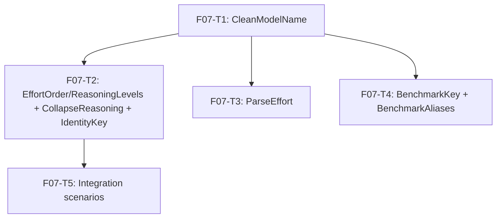

# F07 — identity: Tasks

## Task graph



All tasks require F02 (`internal/decimal`) to be complete first (specs/DEPENDENCY-GRAPH.md row F07: depends_on F02; blocks F08, F09, F18). The package itself imports stdlib only and consumes no F02 symbols — the graph ordering stands.

## Task F07-T1: Implement CleanModelName

**Depends on:** none

**Files:**
- create `internal/catalog/identity/clean.go`
- create `internal/catalog/identity/clean_test.go`

**Spec references:** `specs/features/F07-identity/SPEC.md §2.1, §4`, `specs/features/F07-identity/CONTRACTS.md §3.1`, `available-model-data-export/.github/workflows/update_available_model_data/model_types.py:27-59`, `tests/test_update_raw_values.py:622,627,653,661`, `docs/plan/annex-b-catalog-port.md §3.1`

**Instructions:**
1. Create the directory `internal/catalog/identity/` under the module root (`github.com/WD-Mitchell/which-model`).
2. In `clean.go`, declare `package identity` with a doc comment: "Package identity provides the catalog's canonical keys: model-name cleaning, reasoning-effort parsing and collapse, and benchmark alias keys (specs/features/F07-identity/SPEC.md §1). It is a pure leaf — stdlib only, no internal imports (specs/global/CONTRACTS.md §8)."
3. Imports: `strings` only (plus `unicode` if you prefer explicit rune checks — not required for this function).
4. Implement:
   ```go
   // CleanModelName removes balanced (), [], {} annotation groups from a model
   // display name and normalizes whitespace (SPEC.md §2.1, verbatim port of
   // clean_model_name, model_types.py:27-59). Total: never errors; may return "".
   func CleanModelName(value string) string
   ```
5. Algorithm (SPEC.md §2.1) — step by step:
   - `kept := make([]rune, 0, len(value))` and `stack := make([]rune, 0, 4)`.
   - `for _, r := range value` (range iterates runes — required, SPEC.md §4):
     - if `r == '(' || r == '[' || r == '{'` → append to `stack`, `continue` (openers are dropped from output).
     - if `r == ')' || r == ']' || r == '}'` → look up the matching opener (`')'→'('`, `']'→'['`, `'}'→'{'`); if `len(stack) > 0 && stack[len(stack)-1] == matching` → pop; `continue` in every closer case (mismatched closers are discarded, never open output).
     - otherwise (any other rune): if `len(stack) == 0` → append `r` to `kept`.
   - Return `strings.Join(strings.Fields(string(kept)), " ")` (Python `" ".join("".join(kept).split())` — leading/trailing whitespace trimmed, interior runs collapsed).
6. In `clean_test.go` (`package identity`, imports `testing`), write table-driven `TestCleanModelName` with the golden table below. All expected values are pinned from the real Python tests where marked; cases 8-12 are derived from the docstring examples in `model_types.py:27-59`.
7. Case 1 — real annotated name from `tests/test_update_raw_values.py:622`: input `"Claude Opus 4.5 [claude-opus-4-5-20251101]"` → `"Claude Opus 4.5"`.
8. Case 2 — real annotated name from `tests/test_update_raw_values.py:627`: `"Claude Opus 4.5 (latest)"` → `"Claude Opus 4.5"`.
9. Case 3 — real annotated name from `docs/plan/annex-b-catalog-port.md §3.1`: `"Claude Haiku 4.5 (latest)"` → `"Claude Haiku 4.5"`.
10. Case 4 — already-clean name (annex-b §3.1 display name): `"Claude Opus 4.5"` → `"Claude Opus 4.5"`.
11. Case 5 — real clean name from `tests/test_update_raw_values.py:34`: `"GPT-5.6 Sol"` → `"GPT-5.6 Sol"`.
12. Case 6 — real clean name from `tests/test_update_raw_values.py:950`: `"Example"` → `"Example"`.
13. Case 7 — real clean name from `tests/test_update_raw_values.py:653`: `"Nova"` → `"Nova"`.
14. Case 8 — whitespace normalization (docstring): `"  Claude   Opus 4.5  "` → `"Claude Opus 4.5"`.
15. Case 9 — nested annotation fully removed (docstring "also when nested"): `"[outer [inner]]"` → `""` (both groups are balanced and everything inside is suppressed).
16. Case 10 — unmatched opener suppresses the rest (docstring "an unmatched opener simply suppresses the remainder of that malformed annotation"): `"[unterminated"` → `""`.
17. Case 11 — unmatched paren opener: `"(latest"` → `""`.
18. Case 12 — mismatched closer discarded (docstring "annotation punctuation is discarded even if a source has a malformed or mismatched closer"): `"A[bc)de]"` → `"A"` (the `)` does not pop `[`, so the whole group stays suppressed until the matching `]`).
19. Also add `TestCleanModelNameEmpty`: `CleanModelName("") == ""` (total function).
20. The implementation must NOT use `regexp` or any non-stdlib package; no error returns.

**Test cases (write these first):**

| # | input | want |
|---|---|---|
| 1 | `Claude Opus 4.5 [claude-opus-4-5-20251101]` | `Claude Opus 4.5` |
| 2 | `Claude Opus 4.5 (latest)` | `Claude Opus 4.5` |
| 3 | `Claude Haiku 4.5 (latest)` | `Claude Haiku 4.5` |
| 4 | `Claude Opus 4.5` | `Claude Opus 4.5` |
| 5 | `GPT-5.6 Sol` | `GPT-5.6 Sol` |
| 6 | `Example` | `Example` |
| 7 | `Nova` | `Nova` |
| 8 | `"  Claude   Opus 4.5  "` | `Claude Opus 4.5` |
| 9 | `[outer [inner]]` | `` (empty) |
| 10 | `[unterminated` | `` (empty) |
| 11 | `(latest` | `` (empty) |
| 12 | `A[bc)de]` | `A` |

**Acceptance criteria:**
- [ ] `go build ./internal/catalog/identity/...` succeeds
- [ ] `go test ./internal/catalog/identity/...` passes with the 12 cases above
- [ ] no file outside the Files list modified
- [ ] `CleanModelName` iterates runes (multi-byte UTF-8 safe) and returns a single-space-normalized string
- [ ] `go build -tags nousage ./internal/catalog/identity/...` succeeds (annex-b §0)

```
go test ./internal/catalog/identity/...
```

## Task F07-T2: Implement EffortOrder, ReasoningLevels, CollapseReasoning, IdentityKey

**Depends on:** F07-T1

**Files:**
- create `internal/catalog/identity/identity.go`
- create `internal/catalog/identity/identity_test.go`

**Spec references:** `specs/features/F07-identity/SPEC.md §2.2, §2.3, §2.6, §4`, `specs/features/F07-identity/CONTRACTS.md §1, §2, §3.2`, `docs/plan/research/model-data-pipeline-spec.md §4.2`, `available-model-data-export/.github/workflows/update_available_model_data/get_aa_api_values.py:231-233`

**Instructions:**
1. In `identity.go`, declare `package identity`; imports: `strings` (only if used — `CollapseReasoning` needs no imports; `IdentityKey` calls `CleanModelName` from the same package).
2. Declare the exported values verbatim from CONTRACTS.md §1:
   ```go
   var EffortOrder = map[string]int{
       "minimal": 0, "low": 1, "medium": 2, "high": 3, "xhigh": 4, "max": 5,
   }

   var ReasoningLevels = map[string]struct{}{
       "default": {}, "minimal": {}, "low": {}, "medium": {}, "high": {}, "xhigh": {}, "max": {},
   }
   ```
   with the doc comments from CONTRACTS.md §1 (ladder derived from `_effort`'s regexes, `get_benchmarks.py:42-59`).
3. Declare `type Identity struct { Model, Reasoning string }` with the CONTRACTS.md §2 doc comment (comparable struct; legal map key).
4. Implement `func CollapseReasoning(level string) string` (SPEC.md §2.2): `if level == "default" { return "high" }; return level`. One branch, no other logic — verbatim `_normalise_reasoning_level` (`get_aa_api_values.py:231-233`, pipeline spec §4.2).
5. Implement `func IdentityKey(model, reasoning string) Identity` (SPEC.md §2.3): `return Identity{Model: CleanModelName(model), Reasoning: CollapseReasoning(reasoning)}`.
6. In `identity_test.go` (`package identity`, imports `reflect`, `testing`), write table-driven `TestCollapseReasoning` with the ladder rows 3-11 of the table below (every ladder value + `default` + empty + unknown passthrough).
7. Write `TestConstants`: assert `EffortOrder["minimal"] == 0`, `EffortOrder["high"] == 3`, `EffortOrder["max"] == 5`, `len(EffortOrder) == 6`; assert `len(ReasoningLevels) == 7`, `ReasoningLevels["default"]` exists, and `_, ok := ReasoningLevels["thinking"]; !ok`.
8. Write `TestIdentityKey` — case 12: `IdentityKey("Example", "default") == IdentityKey("Example", "high") == Identity{Model: "Example", Reasoning: "high"}` (REAL scenario from `tests/test_update_raw_values.py:950-979`: the default and high rows of a model are one identity). Compare with `==` (struct equality) and `reflect.DeepEqual`.
9. Add a second assertion in `TestIdentityKey`: `IdentityKey("GPT-5.6 Sol", "low") != IdentityKey("GPT-5.6 Sol", "high")` (low and high are distinct identities — matches `tests/test_model_ranking.py` reasoning-rank behavior).
10. Add a third assertion in `TestIdentityKey` using the F07-T1 cleaner: `IdentityKey("Claude Opus 4.5 [claude-opus-4-5-20251101]", "default") == Identity{Model: "Claude Opus 4.5", Reasoning: "high"}` (annotation stripped + default collapsed in one call).

**Test cases (write these first):**

| # | input | want |
|---|---|---|
| 1 | `EffortOrder` | exactly `{minimal:0, low:1, medium:2, high:3, xhigh:4, max:5}`, len 6 |
| 2 | `ReasoningLevels` | exactly the 7 levels incl. `default`; `thinking` absent |
| 3 | `CollapseReasoning("default")` | `"high"` |
| 4 | `CollapseReasoning("minimal")` | `"minimal"` |
| 5 | `CollapseReasoning("low")` | `"low"` |
| 6 | `CollapseReasoning("medium")` | `"medium"` |
| 7 | `CollapseReasoning("high")` | `"high"` |
| 8 | `CollapseReasoning("xhigh")` | `"xhigh"` |
| 9 | `CollapseReasoning("max")` | `"max"` |
| 10 | `CollapseReasoning("")` | `""` |
| 11 | `CollapseReasoning("adaptive")` | `"adaptive"` (unknown passthrough) |
| 12 | `IdentityKey("Example", "default")` | `== IdentityKey("Example", "high") == {Example, high}` |

**Acceptance criteria:**
- [ ] `go build ./internal/catalog/identity/...` succeeds
- [ ] `go test ./internal/catalog/identity/...` passes with the cases above
- [ ] no file outside the Files list modified
- [ ] `Identity` is a comparable struct used directly as the key; `CollapseReasoning` is total

```
go test ./internal/catalog/identity/...
```

## Task F07-T3: Implement ParseEffort

**Depends on:** F07-T1

**Files:**
- create `internal/catalog/identity/effort.go`
- create `internal/catalog/identity/effort_test.go`

**Spec references:** `specs/features/F07-identity/SPEC.md §2.4, §4`, `specs/features/F07-identity/CONTRACTS.md §3.3`, `available-model-data-export/.github/workflows/update_available_model_data/get_benchmarks.py:42-59`, `tests/test_model_source_boundaries.py:74`

**Instructions:**
1. In `effort.go`, declare `package identity`; imports: `regexp`, `strings`.
2. Declare the two package-level compiled patterns (compile once at init; never compile per call):
   ```go
   var (
       effortPattern = regexp.MustCompile(`^(minimal|low|medium|high|xhigh|max)(?: effort| reasoning)?(?:, (?:context compaction|with tools))?$`)
       reasoningEffortPattern = regexp.MustCompile(`^reasoning effort (none|minimal|low|medium|high|xhigh|max)(?:, (?:context compaction|with tools))?$`)
   )
   ```
3. Implement `func ParseEffort(variant string) (level string, ok bool)` (SPEC.md §2.4, verbatim `_effort` port):
   - Normalize: `normalized := strings.ToLower(variant)`; `strings.NewReplacer("_", " ", "-", " ").Replace(normalized)`; `strings.TrimSpace(...)`.
   - `m := effortPattern.FindStringSubmatch(normalized)`; if `m == nil`, try `m = reasoningEffortPattern.FindStringSubmatch(normalized)`; if still nil → return `"", false`.
   - `level := m[1]`; if `level == "none"` → return `"default", true`; else return `level, true`.
   - `ok == false` means "no effort annotation" (Python `None`) — this is a normal outcome, never an error (SPEC.md §3).
4. In `effort_test.go` (`package identity`, imports `testing`), table-driven `TestParseEffort` with the table below. The want column is `(level, ok)`; assert both fields.
5. Case 1 — REAL variant from `tests/test_model_source_boundaries.py:74`: `"reasoning effort xhigh"` → `("xhigh", true)`.
6. Case 2 — `"reasoning effort none"` → `("default", true)` (Python `_effort`: "none" → "default").
7. Case 3 — `"high, with tools"` → `("high", true)` (suffix grammar).
8. Case 4 — `"HIGH"` → `("high", true)` (case-insensitive).
9. Case 5 — `""` → `("", false)`.
10. Case 6 — `"minimal effort"` → `("minimal", true)`.
11. Case 7 — `"medium reasoning"` → `("medium", true)`.
12. Case 8 — `"xhigh, context compaction"` → `("xhigh", true)`.
13. Case 9 — `"low effort, with tools"` → `("low", true)`.
14. Case 10 — `"extra high"` → `("", false)` (not in the ladder).
15. Case 11 — `"deep thinking"` → `("", false)` (thinking is not an effort level in `_effort`).
16. Case 12 — `"reasoning_effort-max"` → `("max", true)` (underscore/dash normalization, first pattern).
17. All ladder words must be exercised: cases 6-9 + 12 cover minimal/medium/low/max; `"xhigh"` (case 1/8), `"high"` (3/4). Also add one subtest for bare `"max"` → `("max", true)` if not already covered (case 12 covers the word via normalization; bare-word coverage comes from case 8's xhigh — add `"max"` as an extra row only if the table stays ≤12 rows; otherwise fold it into case 12's assertions: `ParseEffort("max") == ("max", true)`).

**Test cases (write these first):**

| # | input | want `(level, ok)` |
|---|---|---|
| 1 | `reasoning effort xhigh` | `("xhigh", true)` |
| 2 | `reasoning effort none` | `("default", true)` |
| 3 | `high, with tools` | `("high", true)` |
| 4 | `HIGH` | `("high", true)` |
| 5 | `` (empty) | `("", false)` |
| 6 | `minimal effort` | `("minimal", true)` |
| 7 | `medium reasoning` | `("medium", true)` |
| 8 | `xhigh, context compaction` | `("xhigh", true)` |
| 9 | `low effort, with tools` | `("low", true)` |
| 10 | `extra high` | `("", false)` |
| 11 | `deep thinking` | `("", false)` |
| 12 | `reasoning_effort-max` | `("max", true)` |

**Acceptance criteria:**
- [ ] `go build ./internal/catalog/identity/...` succeeds
- [ ] `go test ./internal/catalog/identity/...` passes with the cases above
- [ ] no file outside the Files list modified
- [ ] patterns are compiled once at package level; `ok == false` is a normal outcome (no error return)

```
go test ./internal/catalog/identity/...
```

## Task F07-T4: Implement BenchmarkKey and BenchmarkAliases

**Depends on:** F07-T1

**Files:**
- create `internal/catalog/identity/benchmark.go`
- create `internal/catalog/identity/benchmark_test.go`

**Spec references:** `specs/features/F07-identity/SPEC.md §2.5, §4`, `specs/features/F07-identity/CONTRACTS.md §1, §3.4`, `available-model-data-export/.github/workflows/update_available_model_data/generate_scores.py:117-133`, `tests/test_model_ranking.py:101-109`

**Instructions:**
1. In `benchmark.go`, declare `package identity`; imports: `strings`, `unicode`.
2. Declare `BenchmarkAliases` verbatim from CONTRACTS.md §1 (the six-entry map; only `"gdpvalaa" → "gdpval"` is an effective collapse — keep all entries for parity with `generate_scores.py:122-129`, SPEC.md §2.5).
3. Implement:
   ```go
   // BenchmarkKey returns the stable deduplication key for a benchmark name
   // (SPEC.md §2.5, verbatim port of _benchmark_key, generate_scores.py:117-133).
   // Total: never errors.
   func BenchmarkKey(name string) string
   ```
   Algorithm:
   - `s := strings.ToLower(name)` (Python `casefold`; ASCII-equivalent, SPEC.md §4).
   - `s = strings.ReplaceAll(s, "\u2019", "'")` (U+2019 right single quotation mark) and `strings.ReplaceAll(s, "`", "'")`.
   - Keep only alphanumeric runes: build a `strings.Builder`; `for _, r := range s { if unicode.IsLetter(r) || unicode.IsDigit(r) { builder.WriteRune(r) } }` (Python `str.isalnum`).
   - `compact := builder.String()`; if `alias, ok := BenchmarkAliases[compact]; ok` → return `alias`; else return `compact`.
4. In `benchmark_test.go` (`package identity`, imports `testing`), table-driven `TestBenchmarkKey` with the table below.
5. Case 1 — REAL from `tests/test_model_ranking.py:101`: `"Finance Agent"` → `"financeagent"`.
6. Case 2 — REAL from `tests/test_model_ranking.py:101`: `"FinanceAgent"` → `"financeagent"` (same key as case 1).
7. Case 3 — REAL from `tests/test_model_ranking.py:109`: `"GDPval"` → `"gdpval"`.
8. Case 4 — REAL from `tests/test_model_ranking.py:109`: `"GDPval-AA"` → `"gdpval"` (same key as case 3).
9. Case 5 — alias collapse: `"GDPvalAA"` → `"gdpval"` (the one effective `BenchmarkAliases` entry).
10. Case 6 — REAL U+2019 input: `"Humanity’s Last Exam"` (with U+2019, not ASCII apostrophe) → `"humanityslastexam"`.
11. Case 7 — ASCII apostrophe variant: `"Humanity's Last Exam"` → `"humanityslastexam"` (same key as case 6).
12. Case 8 — `"SWE-Bench Verified"` → `"swebenchverified"`.
13. Case 9 — case-insensitive: `"SWE-bench Verified"` → `"swebenchverified"` (same key as case 8).
14. Case 10 — `"Terminal-Bench"` → `"terminalbench"`.
15. Case 11 — `"Artificial Analysis Coding Index"` → `"artificialanalysiscodingindex"`.
16. Case 12 — punctuation dropped: `"GPT-5.6"` → `"gpt56"`.
17. Additionally write `TestBenchmarkAliasesVerbatim`: assert `len(BenchmarkAliases) == 6` and each entry equals CONTRACTS.md §1 exactly (`gdpvalaa → gdpval`, the other five identity mappings).

**Test cases (write these first):**

| # | input | want |
|---|---|---|
| 1 | `Finance Agent` | `financeagent` |
| 2 | `FinanceAgent` | `financeagent` |
| 3 | `GDPval` | `gdpval` |
| 4 | `GDPval-AA` | `gdpval` |
| 5 | `GDPvalAA` | `gdpval` |
| 6 | `Humanity’s Last Exam` (U+2019) | `humanityslastexam` |
| 7 | `Humanity's Last Exam` (ASCII `'`) | `humanityslastexam` |
| 8 | `SWE-Bench Verified` | `swebenchverified` |
| 9 | `SWE-bench Verified` | `swebenchverified` |
| 10 | `Terminal-Bench` | `terminalbench` |
| 11 | `Artificial Analysis Coding Index` | `artificialanalysiscodingindex` |
| 12 | `GPT-5.6` | `gpt56` |

**Acceptance criteria:**
- [ ] `go build ./internal/catalog/identity/...` succeeds
- [ ] `go test ./internal/catalog/identity/...` passes with the cases above
- [ ] no file outside the Files list modified
- [ ] `BenchmarkAliases` has exactly the six verbatim entries; `BenchmarkKey` is total

```
go test ./internal/catalog/identity/...
```

## Task F07-T5: Integration scenarios across the identity surface

**Depends on:** F07-T2

**Files:**
- create `internal/catalog/identity/identity_integration_test.go`

**Spec references:** `specs/features/F07-identity/SPEC.md §2.1-§2.5`, `tests/test_update_raw_values.py:950-979`, `tests/test_model_ranking.py:101-109`, `tests/test_model_source_boundaries.py:74`, `docs/plan/research/model-data-pipeline-spec.md §4.2`

**Instructions:**
1. This task writes ONLY a test file — no source changes. It exercises the composed surface exactly as the real pipeline does (F08 cleans at ingestion, F06 collapses `default→high`, F09 groups by `BenchmarkKey`).
2. In `identity_integration_test.go`, declare `package identity`; imports: `testing`.
3. `TestAnnotatedNameIdentityDedup` — the two real annotated spellings of the same model (SPEC.md §2.3): `IdentityKey("Claude Opus 4.5 [claude-opus-4-5-20251101]", "default")` must equal `IdentityKey("Claude Opus 4.5 (latest)", "high")`; assert both equal `Identity{Model: "Claude Opus 4.5", Reasoning: "high"}`. Then use both as map keys into one `map[Identity]int` and assert the count is 1 (map-key dedup).
4. `TestDefaultHighEquality` — REAL scenario from `tests/test_update_raw_values.py:950-979` (a model appears as `default` and as `high`; they are one row identity): `IdentityKey("Example", "default") == IdentityKey("Example", "high")`; and a merged map over both rows has exactly one entry with reasoning `"high"`.
5. `TestLowVsHighDistinct` — `IdentityKey("GPT-5.6 Sol", "low") != IdentityKey("GPT-5.6 Sol", "high")`; both exist as separate map entries (mirrors `tests/test_model_ranking.py` ranking rows).
6. `TestAliasGrouping` — REAL from `tests/test_model_ranking.py:101-109`: `BenchmarkKey("Finance Agent") == BenchmarkKey("FinanceAgent")`, `BenchmarkKey("GDPval") == BenchmarkKey("GDPval-AA")`, and `BenchmarkKey("Finance Agent") != BenchmarkKey("GDPval")`; grouping a slice of the four names by `BenchmarkKey` yields exactly 2 groups.
7. `TestVariantComposition` — REAL from `tests/test_model_source_boundaries.py:74`: `level, ok := ParseEffort("reasoning effort xhigh")` → `("xhigh", true)`; `CollapseReasoning(level) == "xhigh"`; `IdentityKey("Nova", level)` equals `Identity{Model: "Nova", Reasoning: "xhigh"}` (an xhigh variant keeps its level — only `default` collapses).
8. `TestEmptyVariantPassthrough` — `level, ok := ParseEffort("")` → `("", false)`; a model with no variant keeps its raw reasoning: `IdentityKey("Nova", "") == Identity{Model: "Nova", Reasoning: ""}` (total function; blank reasoning is a valid identity cell at this layer).
9. `TestPipelineOrder` — full composition in pipeline order: clean → key → group: rows `[("Claude Opus 4.5 (latest)", "default"), ("Claude Opus 4.5 [claude-opus-4-5-20251101]", "high"), ("GPT-5.6 Sol", "low")]` produce exactly 2 distinct identities; `EffortOrder[IdentityKey("GPT-5.6 Sol", "low").Reasoning] == 1` (the F07-T2 ladder applies to keyed reasoning levels).
10. `TestWhitespaceAnnotationCombo` — `CleanModelName("  Claude Opus 4.5 [claude-opus-4-5-20251101]  ") == "Claude Opus 4.5"` and `IdentityKey("  Claude Opus 4.5 [claude-opus-4-5-20251101]  ", "default") == Identity{Model: "Claude Opus 4.5", Reasoning: "high"}` (annotation + whitespace normalization composed).
11. `TestMaxBareWord` — `ParseEffort("max")` → `("max", true)` and `ParseEffort("max reasoning")` → `("max", true)` (ladder word with and without the `reasoning` suffix).
12. `TestBenchmarkKeyAcrossEvidenceSources` — the same benchmark from two evidence sources dedups: `BenchmarkKey("Humanity’s Last Exam") == BenchmarkKey("Humanity's Last Exam") == "humanityslastexam"` (SPEC.md §2.5 — aliases/variants are one evidence source, not separate votes).

**Test cases (write these first):**

| # | scenario | want |
|---|---|---|
| 1 | annotated-name identity dedup (brackets vs `(latest)`, default vs high) | one `Identity{Claude Opus 4.5, high}`; map count 1 |
| 2 | `Example` default vs high (test:950-979) | one identity; reasoning `high` |
| 3 | `GPT-5.6 Sol` low vs high | two distinct identities |
| 4 | Finance/GDPval alias grouping (test:101-109) | 2 groups; FinanceAgent≡Finance Agent, GDPval≡GDPval-AA |
| 5 | `reasoning effort xhigh` composition (test:74) | `("xhigh", true)`; identity `{Nova, xhigh}` |
| 6 | empty variant | `("", false)`; identity `{Nova, ""}` |
| 7 | pipeline order: 3 rows → identities | exactly 2 distinct identities; low ranks 1 |
| 8 | whitespace + annotation combo | `{Claude Opus 4.5, high}` |
| 9 | `max` / `max reasoning` | both `("max", true)` |
| 10 | U+2019 vs ASCII apostrophe benchmark | same key `humanityslastexam` |

**Acceptance criteria:**
- [ ] `go test ./internal/catalog/identity/...` passes with the cases above
- [ ] no file outside the Files list modified (test-only task)
- [ ] every case uses only the F07-T1..T4 surface — no new source code introduced
- [ ] `go build -tags nousage ./internal/catalog/identity/...` succeeds (regression check on T1)

```
go test ./internal/catalog/identity/...
```
