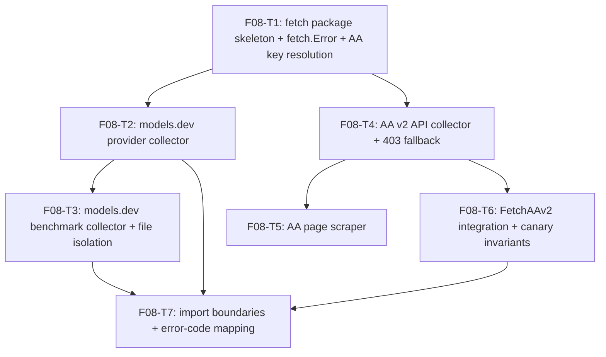

# F08 — Catalog Fetch: Tasks

## Task graph

## Task F08-T1: Create fetch package skeleton, fetch.Error, and AA key resolution

**Depends on:** none (uses `internal/httpkit` F04 pin and F07 `identity.ParseEffort` per `specs/DEPENDENCY-GRAPH.md` rows F08 → F02, F04, F07)

**Files:**
- create `internal/catalog/fetch/errors.go`
- create `internal/catalog/fetch/aa/key.go`
- create `internal/catalog/fetch/aa/key_test.go`

**Spec references:**
- `specs/features/F08-collectors/SPEC.md §2.9, §3`
- `specs/features/F08-collectors/CONTRACTS.md §1.3, §2.2, §3`
- `specs/global/CONTRACTS.md §1.6 (Failure.Code vocabulary)`
- `docs/plan/annex-b-catalog-port.md §2.4 (key resolution)`

**Instructions:**
1. Write `key_test.go` FIRST (package `aa` — internal test, so unexported helpers are reachable).
2. Test 1 `TestLoadAAAPIKeyEnvFirst`: `t.Setenv("ARTIFICIAL_ANALYSIS_API", "env-key-123")` + a temp `.env` containing a different key → returns `env-key-123`, no error.
3. Test 2 `TestLoadAAAPIKeyDotEnvFallback`: no env var; temp dir with `.env` containing `ARTIFICIAL_ANALYSIS_API="file-key-456"` (double quotes) → `file-key-456`; single quotes → stripped; no quotes → verbatim.
4. Test 3 `TestLoadAAAPIKeyDotEnvScanning`: `.env` with blank lines, a `# comment` line, `OTHER=value` (ignored — hmm, see step 7), and the key line → key found. Also `.env` missing entirely + no env → `MissingAPIKeyError()` whose message is exactly `missing ARTIFICIAL_ANALYSIS_API environment variable or .env entry` and `Code == "missing_api_key"`.
5. Test 4 `TestLoadAAAPIKeyDotEnvErrors`: duplicate `ARTIFICIAL_ANALYSIS_API` lines → error with `Code == "credential_file"`; malformed line `noequals` → error; both errors' messages MUST NOT contain the key text (canary — pass a distinctive key like `super-secret-aa-key` and assert `!strings.Contains(err.Error(), "super-secret-aa-key")`).
6. Implement `internal/catalog/fetch/errors.go`: `fetch.Error{Code string, Err error}` + `Error()` + `Unwrap()` + `MissingAPIKeyError()` (Code `missing_api_key`, message as in step 4 — copy from `specs/features/F08-collectors/CONTRACTS.md §1.3`).
7. Implement `internal/catalog/fetch/aa/key.go`: `LoadAAAPIKey(repoRoot string) (string, error)` — `os.Getenv(APIKeyEnv)` first; else read `<repoRoot>/.env` (missing file → `MissingAPIKeyError()`); scanner: split lines on `\n`, strip trailing `\r`; skip blank and `#`-prefixed (after trimming leading whitespace); `strings.Cut(line, "=")`; missing `=` → `credential_file` error `invalid .env line at <path>:<n>`; key must equal `APIKeyEnv` (other keys are ignored — forward compatibility; F08 owns only this one); trim whitespace around key and value; strip ONE layer of matching surrounding quotes (`'` or `"`); duplicate key → `credential_file` error `duplicate ARTIFICIAL_ANALYSIS_API entry in <path>`; return the value. Also `AAV2Client()` = `httpkit.NewClient(httpkit.WithTimeout(20 * time.Second))` and `AAPageClient()` = `httpkit.NewClient(httpkit.WithTimeout(20*time.Second), httpkit.WithMaxBytes(2<<20))` — copy signatures from `specs/features/F08-collectors/CONTRACTS.md §2.2`. Define `APIKeyEnv` in this file.
8. Run `go build ./internal/catalog/fetch/...` then `go test ./internal/catalog/fetch/aa/...`.

**Test cases (write these first):**

| # | input | want |
|---|---|---|
| 1 | env set + `.env` with different key | env key wins |
| 2 | no env; `.env` with `ARTIFICIAL_ANALYSIS_API="file-key-456"` | `file-key-456` |
| 3 | no env; `.env` with single quotes / no quotes | stripped / verbatim |
| 4 | `.env` with blanks, comment, unrelated key, key line | key found |
| 5 | no env, no `.env` | Code `missing_api_key`, message `missing ARTIFICIAL_ANALYSIS_API environment variable or .env entry` |
| 6 | duplicate key lines | Code `credential_file` |
| 7 | malformed line `noequals` | Code `credential_file` |
| 8 | errors from cases 6-7 with key `super-secret-aa-key` in the file | message does not contain `super-secret-aa-key` |
| 9 | `AAV2Client()` | client with 20s timeout |
| 10 | `AAPageClient()` | client with 20s timeout and 2 MiB max bytes |

**Acceptance criteria:**
- [ ] `go build ./internal/catalog/fetch/...` succeeds
- [ ] `go test ./internal/catalog/fetch/aa/...` passes with the test cases above
- [ ] no file outside the Files list modified

## Task F08-T2: Implement the models.dev provider collector

**Depends on:** F08-T1

**Files:**
- create `internal/catalog/fetch/modelsdev/provider.go`
- create `internal/catalog/fetch/modelsdev/provider_test.go`

**Spec references:**
- `specs/features/F08-collectors/SPEC.md §2.2, §2.5`
- `specs/features/F08-collectors/CONTRACTS.md §1.1, §2.1`
- `docs/plan/annex-b-catalog-port.md §2.3`
- F07 pin: `identity.CleanModelName`, `identity.ParseEffort` from `specs/features/F07-*/CONTRACTS.md`; F04 pin: `httpkit` default client (10s, 1 retry 5xx+network, 256 KiB) from `specs/features/F04-*/CONTRACTS.md`

**Instructions:**
1. Write `provider_test.go` FIRST. Helper `newTestServer(t, payload string, status int) *httptest.Server` returning a server whose handler records the request (method, headers, URL) and responds.
2. Test 1 `TestFetchModelsDevProvidersFromHappy`: payload with 3 records — `{provider:"openai", id:"gpt-5.6", name:"GPT-5.6 Sol", status:"available", base_model:"", reasoning_options:{values:["low","medium","high"]}}`, `{provider:"anthropic", id:"claude-opus-5", name:"Claude Opus 5 (latest)", status:"available", reasoning_options:{values:["none"]}}`, `{provider:"kimi", id:"kimi-k2.7", name:"Kimi K2.7 Code", status:"deprecated"}` → 2 ProviderModels (deprecated dropped); first has `Name == identity.CleanModelName("GPT-5.6 Sol")`, `Reasoning == true`, `EffortLevels == ["low","medium","high"]` (sorted, unmodified levels); second has `Reasoning == true` and `EffortLevels == ["high"]` (via `identity.ParseEffort`, `"none"`→`"default"`→`"high"` collapse).
3. Test 2 `TestFetchModelsDevProvidersNonReasoning`: record without `reasoning_options` → `Reasoning == false`, `EffortLevels` empty; record with empty `reasoning_options.values` → same.
4. Test 3 `TestFetchModelsDevProvidersErrors`: server 500 → error with `Code == "provider_status"` (after httpkit retries; the handler may see up to 2 requests — 1 + 1 retry); server returns `not json` with 200 → `Code == "response_json"`; closed server (no listener) → `Code == "network"`; `unmarshal` of a payload whose record has non-string `id` → `unsupported_response`.
5. Test 4 `TestProvidersURLConstant`: `ProvidersURL == "https://models.dev/api.json"`.
6. Test 5 `TestFetchModelsDevProvidersRequestShape`: handler asserts method GET, header `Accept` contains `application/json`, and query is empty.
7. Implement `provider.go`: `ProvidersURL` const; `FetchModelsDevProvidersFrom(client *httpkit.Client, url string) ([]ProviderModel, error)` — `client.SetAllowList([]string{url})`, build `http.NewRequestWithContext` GET, `client.Do`, JSON-unmarshal into `[]providerRecord` (struct with json tags matching models.dev `api.json` shape: `provider`, `id`, `name`, `status`, `base_model`, `reasoning_options.values`), drop `status == "deprecated"`, map + clean names via `identity.CleanModelName`, effort levels via `identity.ParseEffort` (dedupe + sort; invalid level → `unsupported_response`); wrap all errors in `fetch.Error` with the codes from `specs/features/F08-collectors/CONTRACTS.md §3` (httpkit code passthrough for `redirect_refused`/`response_too_large`/`timeout`/`network`/`response_json`; status 401→`unauthorized`, 429→`rate_limited`, 5xx→`provider_status` via `errors.As(*httpkit.Error)` + `StatusCode`). Then the wrapper `FetchModelsDevProviders()` using `httpkit.NewClient()` + `ProvidersURL`.

**Test cases (write these first):**

| # | input | want |
|---|---|---|
| 1 | 3 records, one deprecated | 2 models; deprecated dropped; effort `["low","medium","high"]`; `"none"`→`"high"` |
| 2 | no reasoning_options | Reasoning false, EffortLevels empty |
| 3 | empty reasoning_options.values | Reasoning false, EffortLevels empty |
| 4 | HTTP 500 | Code `provider_status` |
| 5 | 200 + `not json` | Code `response_json` |
| 6 | closed server | Code `network` |
| 7 | non-string `id` field | Code `unsupported_response` |
| 8 | `ProvidersURL` | `https://models.dev/api.json` |
| 9 | request observed | GET, Accept application/json, no query |

**Acceptance criteria:**
- [ ] `go test ./internal/catalog/fetch/modelsdev/...` passes with the test cases above
- [ ] all errors are `*fetch.Error` with global Failure.Code values
- [ ] no file outside the Files list modified

## Task F08-T3: Implement the models.dev benchmark collector with file isolation

**Depends on:** F08-T2

**Files:**
- create `internal/catalog/fetch/modelsdev/benchmark.go`
- create `internal/catalog/fetch/modelsdev/benchmark_test.go`
- edit `internal/catalog/fetch/modelsdev/provider_test.go`

**Spec references:**
- `specs/features/F08-collectors/SPEC.md §2.1, §2.6`
- `specs/features/F08-collectors/CONTRACTS.md §1.1, §2.1`
- `docs/plan/annex-b-catalog-port.md §2.3 (variant regex, max-wins, selected_names)`

**Instructions:**
1. Write `benchmark_test.go` FIRST. Build a models.dev `models.json`-style payload as a Go map slice: records with `id`, `name`, `variant`, and benchmark fields like `"SWE-Bench Verified": {"score": 0.63, "version": "v1"}` — check `docs/plan/annex-b-catalog-port.md §2.3` for the exact per-benchmark value shape used by the Python port (numeric string or object with `score`); use whatever the annex pins.
2. Test 1 `TestFetchModelsDevBenchmarksSelected`: payload with 2 records, each carrying scores for `SWE-Bench Verified`, `SWE-Bench Pro`, `DeepSWE`; call with `selectedNames = ["SWE-Bench Verified", "DeepSWE"]` → every `BenchmarkEvidence.Name` is one of the two selected; records for unselected names absent; one `BenchmarkRecord` per model with `CanonicalID` set.
3. Test 2 `TestFetchModelsDevBenchmarksEffort`: record with `variant: "low effort"` for a benchmark → `Effort == "low"`; record with `variant: "reasoning effort none"` → `Effort == "default"`; record with `variant: "with tools"` (no effort token) → `Effort == ""` (non-effort-scoped).
4. Test 3 `TestFetchModelsDevBenchmarksMaxWins`: same model, two records for `(SWE-Bench Verified, medium)` with scores 0.63 and 0.88 → one evidence with 0.88 (max, never priority-list); ALSO an evidence at `(name, "")` from a variant-less record — kept as a separate entry from the effort-scoped one.
5. Test 4 `TestFetchModelsDevBenchmarksEmptySelection`: `selectedNames = []` → records with empty `Benchmarks`; no error.
6. Test 5 `TestBenchmarksURLConstant`: `BenchmarksURL == "https://models.dev/models.json"` AND `BenchmarksURL != ProvidersURL` (distinct endpoints).
7. Test 6 `TestFileIsolation` (source-text, in `benchmark_test.go` or a shared modelsdev test): read `benchmark.go` and assert it does NOT contain `FetchModelsDevProviders`, `ProvidersURL`, or `ProviderModel`; read `provider.go` and assert it does NOT contain `FetchModelsDevBenchmarks`, `BenchmarksURL`, or `BenchmarkRecord` (mirrors the Python module-boundary test).
8. Test 7 error paths: 500 → `provider_status`; `not json` → `response_json`; non-numeric benchmark score → `unsupported_response`; negative score → `unsupported_response`.
9. Implement `benchmark.go`: `BenchmarksURL` const; `FetchModelsDevBenchmarksFrom(client, url string, selectedNames []string)` — pre-seeded extraction map `{name: nil for name in selectedNames}`; variant regex ports from annex-b §2.3 (`(?P<effort>minimal|low|medium|high|xhigh|max)(?: effort| reasoning)?...` and `reasoning effort (?P<effort>none|...)...`; `"none"`→`"default"`); max-wins dedup keyed `(benchmark name, effort)`; score parse via `decimal.NewFromString` (invalid/negative → `unsupported_response`); NEVER reference provider-file symbols. Wrapper `FetchModelsDevBenchmarks(selectedNames []string)` over the default client + `BenchmarksURL`. Move/verify the isolation test assertions in step 7 compile.

**Test cases (write these first):**

| # | input | want |
|---|---|---|
| 1 | 2 records, select 2 of 3 names | only selected names extracted; one record per model |
| 2 | `variant: "low effort"` | Effort `low` |
| 3 | `variant: "reasoning effort none"` | Effort `default` |
| 4 | `variant: "with tools"` | Effort `""` |
| 5 | two records same (name, medium) 0.63/0.88 | single evidence 0.88 |
| 6 | variant-less + effort-scoped same name | two separate evidences |
| 7 | `selectedNames = []` | empty evidence, no error |
| 8 | `BenchmarksURL` | `https://models.dev/models.json`, distinct from `ProvidersURL` |
| 9 | benchmark.go / provider.go source | no cross-file symbol references |
| 10 | HTTP 500 / bad JSON / non-numeric score | `provider_status` / `response_json` / `unsupported_response` |

**Acceptance criteria:**
- [ ] `go test ./internal/catalog/fetch/modelsdev/...` passes with the test cases above
- [ ] file isolation test passes (benchmark.go is provider-symbol-free)
- [ ] no file outside the Files list modified

## Task F08-T4: Implement the AA v2 API collector with the typed 403 fallback

**Depends on:** F08-T1

**Files:**
- create `internal/catalog/fetch/aa/fields.go`
- create `internal/catalog/fetch/aa/api.go`
- create `internal/catalog/fetch/aa/api_test.go`

**Spec references:**
- `specs/features/F08-collectors/SPEC.md §2.7, §2.8`
- `specs/features/F08-collectors/CONTRACTS.md §1.2, §2.3, §3`
- `docs/plan/annex-b-catalog-port.md §2.4`; `docs/plan/research/model-data-pipeline-spec.md §1.3`
- F04 pin: `httpkit.Error{Code, StatusCode, Err}` (StatusCode 0 = non-HTTP failure; `errors.As`)

**Instructions:**
1. Write `fields.go` FIRST: `AABenchmarkFields` with the field→column pairs VERBATIM from `docs/plan/annex-b-catalog-port.md §2.4` (copy the annex's list exactly; the test asserts `len(AABenchmarkFields) >= 10` and that every `Column` starts with `benchmark:`).
2. Write `api_test.go` FIRST. Helper `aaServer(t, pages []string, statuses []int) *httptest.Server` serving `?page=<n>` with the given bodies/statuses; handler records the `x-api-key` header per request.
3. Test 1 `TestFetchAAv2FromPagination`: page 1 envelope `{"data":[{...}], "pagination": {"page": 1, "has_more": true, "total_pages": 2}}`, page 2 with `has_more: false` → both pages' models returned; requests carry `?page=1`, `?page=2` and header `x-api-key: <key>` on every request.
4. Test 2 `TestFetchAAv2FromItemMapping`: one item with `evaluations.artificial_analysis_intelligence_index: 0.8735` → `IntelligenceIndex == 87.35` (fraction x 100, `Round(2)`); `performance.median_end_to_end_response_time_seconds: 12.5` → `MedianResponseSeconds == 12.5`; `artificial_analysis_intelligence_index_cost.cost_per_task.total_cost: 0.42` → `CostPerTaskUSD == 0.42`; an `AABenchmarkFields` entry `{Field: "artificial_analysis_agentic_index", Column: "benchmark:Artificial Analysis Coding Agent Index"}`... — use the REAL fields from `fields.go`; assert each present evaluation lands in `Benchmarks[Column]`.
5. Test 3 `TestFetchAAv2FromMissingOptional`: item without `performance`, without cost, without one evaluation → nil pointer for that field, absent map key; no error.
6. Test 4 `TestFetchAAv2FromNegativeAndVariants`: evaluation `-0.1` → `unsupported_response`; two records with slugs `model-x` and `model-x-tau1` (or the annex's variant-suffix rule) where the second has higher values → one `AAModel` with the higher values.
7. Test 5 `TestFetchAAv2FromPaginationInvariants`: page 2 response says `"page": 1` → `unsupported_response`; 200 pages beyond `MaxPages` (`has_more: true` forever) → error after 100 requests (make the handler always `has_more: true`).
8. Test 6 `TestFetchAAv2FromStatusMapping` (typed, Main pin): primary 401 → `Code == "unauthorized"`, NO request to freeURL (handler counts); primary 403 → exactly ONE retry of the full pagination on freeURL (both pages), success returns models from freeURL; primary 403 + free 403 → `Code == "access_denied"`; primary 429 → `Code == "rate_limited"` and the primary handler sees exactly ONE request (no 429 retry — F04 pin, assert the count); primary 500 → `Code == "provider_status"`. All status tests use `errors.As` into `*httpkit.Error` in the COLLECTOR implementation only; tests assert on `fetch.Error.Code`.
9. Test 7 `TestFetchAAv2FromCanary`: a 500-erroring server with a distinctive key `canary-key-abc123` → `err.Error()` does not contain `canary-key-abc123`; the free-fallback request's URL is `freeURL` (no key in query), and the key appears only in the `x-api-key` header of AA-host requests.
10. Implement `api.go`: `PrimaryURL`/`FreeURL`/`MaxPages` consts; `FetchAAv2From(client, apiKey, primaryURL, freeURL)` — pagination loop per CONTRACTS §2.3; page mismatch / MaxPages exceeded → `unsupported_response`; envelope `{data, pagination{page, has_more, total_pages}}`; item mapping per `pipeline-spec §1.3` (fraction x 100 via `decimal`, `Round(2)`, negative → `unsupported_response`); variant-suffix dedup highest-wins; 403 fallback via `errors.As(err, &he) && he.StatusCode == 403` retrying the whole loop on freeURL; error wrapping per CONTRACTS §3. Wrapper `FetchAAv2(client, apiKey)` with `PrimaryURL`/`FreeURL`.

**Test cases (write these first):**

| # | input | want |
|---|---|---|
| 1 | 2 pages, has_more transitions | all models; `x-api-key` on every request; `?page=1/2` |
| 2 | 0.8735 evaluation | 87.35; other fields mapped |
| 3 | missing optional fields | nil pointers / absent keys, no error |
| 4 | negative evaluation | `unsupported_response` |
| 5 | variant records | one AAModel, highest values |
| 6 | page number mismatch | `unsupported_response` |
| 7 | endless has_more | error after MaxPages requests |
| 8 | primary 401 | `unauthorized`; zero free requests |
| 9 | primary 403 | free fallback succeeds; models from freeURL |
| 10 | primary+free 403 | `access_denied` |
| 11 | primary 429 | `rate_limited`; exactly 1 request to primary |
| 12 | primary 500 | `provider_status` |
| 13 | 500 with `canary-key-abc123` | error text lacks the key; fallback URL has no key |

**Acceptance criteria:**
- [ ] `go test ./internal/catalog/fetch/aa/...` passes with the test cases above
- [ ] 403 fallback uses ONLY `errors.As` + `StatusCode == 403` (no message matching)
- [ ] no file outside the Files list modified

## Task F08-T5: Implement the AA public page scraper

**Depends on:** F08-T4

**Files:**
- create `internal/catalog/fetch/aa/page.go`
- create `internal/catalog/fetch/aa/page_test.go`

**Spec references:**
- `specs/features/F08-collectors/SPEC.md §2.10`
- `specs/features/F08-collectors/CONTRACTS.md §2.4`
- `docs/plan/annex-b-catalog-port.md §2.4 (currentModel markers)`

**Instructions:**
1. Write `page_test.go` FIRST. Helper `pageServer(t, body string) *httptest.Server` + a `markerJSON(slug, time, cost)` builder producing the `currentModel` marker shape the annex pins (an HTML `` block or `__NEXT_DATA__`-style JSON — follow annex-b §2.4's exact marker description).
2. Test 1 `TestFetchAAPageFromFound`: page with one marker for slug `claude-opus-5` (time `12.5`, cost `0.99`); `FetchAAPageFrom(client, "Claude-Opus-5", true, url)` → `PageMetrics{Slug: "Claude-Opus-5", TimePerIntelligenceTaskSeconds: 12.5, FallbackCostUSD: 0.99}` (case-insensitive slug match).
3. Test 2 `TestFetchAAPageFromNoCost`: `requireFallbackCost=false` with a cost-bearing marker → `FallbackCostUSD == nil`; the handler's response must not be probed for cost.
4. Test 3 `TestFetchAAPageFromZeroMarkers`: page with no matching marker → `(nil, nil)`, no error.
5. Test 4 `TestFetchAAPageFromAmbiguous`: two markers with DIFFERENT slugs both matching case-insensitively (e.g. `claude-opus-5` and `Claude-Opus-5-tau1`) → `unsupported_response`; marker count mismatch (time markers != cost markers when cost required) → `unsupported_response`; non-numeric marker value → `unsupported_response`.
6. Test 5 `TestFetchAAPageFromRequestShape`: handler asserts GET, NO custom headers beyond Go defaults (assert `r.Header.Get("x-api-key") == ""` and no Authorization), and the path is `/models/<slug>` — hmm, the core takes the full URL; assert the URL passed to the handler equals `ModelPageURL(slug)`.
7. Test 6 `TestFetchAAPageFromTooLarge`: handler writes 3 MiB → error with `Code == "response_too_large"` (client is `AAPageClient()`).
8. Test 7 `TestFetchAAPageErrors`: 500 → `provider_status`; malformed marker JSON → `unsupported_response`.
9. Implement `page.go`: `ModelPageURL(slug)`; `FetchAAPageFrom(client, slug, requireFallbackCost, url)` — `client.SetAllowList([]string{url})`, GET, extract `currentModel` markers (strict parse per CONTRACTS §2.4), match slug case-insensitively, apply the marker invariants; wrap errors per CONTRACTS §3. Wrapper `FetchAAPage(client, slug, requireFallbackCost)` using `ModelPageURL(slug)` and `AAPageClient()`.

**Test cases (write these first):**

| # | input | want |
|---|---|---|
| 1 | one marker, cost required, slug case differs | PageMetrics with time + cost |
| 2 | cost not required | FallbackCostUSD nil |
| 3 | no matching marker | (nil, nil) |
| 4 | two unequal-slug markers | `unsupported_response` |
| 5 | time/cost marker count mismatch | `unsupported_response` |
| 6 | non-numeric marker value | `unsupported_response` |
| 7 | request shape | GET, no auth headers, path `/models/<slug>` |
| 8 | 3 MiB response | `response_too_large` |
| 9 | HTTP 500 | `provider_status` |
| 10 | malformed marker JSON | `unsupported_response` |

**Acceptance criteria:**
- [ ] `go test ./internal/catalog/fetch/aa/...` passes with the test cases above
- [ ] strict marker invariants — ambiguous data is an error, never a guess
- [ ] no file outside the Files list modified

## Task F08-T6: FetchAAv2 integration and credential canaries

**Depends on:** F08-T4

**Files:**
- edit `internal/catalog/fetch/aa/api_test.go`
- edit `internal/catalog/fetch/aa/api.go`

**Spec references:**
- `specs/features/F08-collectors/SPEC.md §2.8, §3`
- `specs/features/F08-collectors/CONTRACTS.md §2.3, §3`

**Instructions:**
1. Append tests to `api_test.go` FIRST.
2. Test 1 `TestFetchAAv2AllOrNothing`: two pages where page 2 fails (500) → error, NO partial models (assert the returned slice is nil and the error is `provider_status`).
3. Test 2 `TestFetchAAv2WrapperUsesConstants`: call `FetchAAv2(client, key)` against a server that only responds on the `PrimaryURL` path (assert the request path ends `/api/v2/language/models`); a 403 on primary with a freeURL-responding server → fallback used (assert the second request path ends `/api/v2/language/models/free`).
4. Test 3 `TestFetchAAv2FallbackHeaderCanary`: primary 403, free 200; the free handler asserts header `x-api-key` is present (the key travels with the fallback — it is AA's own key, not a downgrade); the free request's URL contains no key; combined with F08-T4 test 13 the key appears nowhere in errors.
5. Test 4 `TestFetchAAv2RedirectMapped`: primary responds 302 with `Location: https://evil.example/steal` → error `Code == "redirect_refused"` (httpkit refuses; assert zero requests to the Location host via a second httptest server that fails the test if hit) and the error message does not contain the key.
6. Fix `api.go` if any invariant fails (e.g. ensure the pagination loop aborts on first page error without returning accumulated models; ensure fallback re-runs the FULL loop, not just page 1).

**Test cases (write these first):**

| # | input | want |
|---|---|---|
| 1 | page 2 fails | error, nil result (no partial) |
| 2 | wrapper on PrimaryURL | path ends `/api/v2/language/models`; fallback path ends `/models/free` |
| 3 | free handler | `x-api-key` header present; URL key-free |
| 4 | 302 to evil host | `redirect_refused`; zero requests to Location; error lacks key |

**Acceptance criteria:**
- [ ] `go test ./internal/catalog/fetch/aa/...` passes with the test cases above
- [ ] all-or-nothing collector semantics; fallback is a full-loop retry
- [ ] no file outside the Files list modified

## Task F08-T7: Import boundaries and the Failure.Code mapping

**Depends on:** F08-T3, F08-T6

**Files:**
- create `internal/catalog/fetch/boundaries_test.go`
- edit `internal/catalog/fetch/aa/key_test.go`

**Spec references:**
- `specs/features/F08-collectors/CONTRACTS.md §3`
- `specs/features/F08-collectors/SPEC.md §2.11`
- `specs/global/CONTRACTS.md §1.6, §8`

**Instructions:**
1. Write `boundaries_test.go` FIRST: use `go/parser` to parse every `.go` file under `internal/catalog/fetch/` (walk with `filepath.WalkDir`, skip `_test.go`) and collect import paths; assert NONE imports `internal/config`, `internal/usage`, `internal/routing`, `internal/pick`, `internal/catalog/csvstore`, or `internal/catalog/score`; assert `internal/catalog/fetch/modelsdev` and `internal/catalog/fetch/aa` import `internal/httpkit` and `internal/catalog/identity` (the F07 pin) and `internal/decimal`.
2. Test 2 `TestFetchErrorCodeMapping` (in `boundaries_test.go`): table-driven — for each (condition-constructing helper, wantCode) pair assert `fetch.Error.Code` equals the CONTRACTS §3 value: `MissingAPIKeyError()` → `missing_api_key`; an `httpkit.Error{Code: "response_too_large"}` wrapped via a small exported helper is out of scope — instead construct real conditions: 401 response → `unauthorized` (spin an httptest 401 server and call `aa.FetchAAv2`), 429 → `rate_limited`, 500 → `provider_status`, 302 → `redirect_refused` (reuse the T4/T6 helpers by exporting them? no — keep helpers package-local to their test files; duplicate a minimal 2-line helper here). Also assert every returned code is a member of the global §1.6 set plus `missing_api_key` (hardcoded list in the test).
3. Test 3 `TestMissingAPIKeyCodeAndExitNote`: `MissingAPIKeyError().Code == "missing_api_key"` (F23 maps to exit 2 — assert the CONTRACTS note text is present in the file `internal/catalog/fetch/errors.go` via a comment scan, OR skip the source scan and keep this a pure behavior test; choose the behavior test).
4. Run the full suite: `go build ./internal/catalog/fetch/...` and `go test ./internal/catalog/fetch/...`.

**Test cases (write these first):**

| # | input | want |
|---|---|---|
| 1 | all fetch source files | no forbidden imports (config/usage/routing/pick/csvstore/score) |
| 2 | modelsdev + aa packages | import httpkit, identity, decimal |
| 3 | missing key | Code `missing_api_key` |
| 4 | 401 / 429 / 500 / 302 real servers | `unauthorized` / `rate_limited` / `provider_status` / `redirect_refused` |
| 5 | every code produced | member of global §1.6 set + `missing_api_key` |

**Acceptance criteria:**
- [ ] `go build ./internal/catalog/fetch/...` succeeds
- [ ] `go test ./internal/catalog/fetch/...` passes with the test cases above
- [ ] boundary test is parser-based (import specs), not text-grep on file content
- [ ] no file outside the Files list modified
