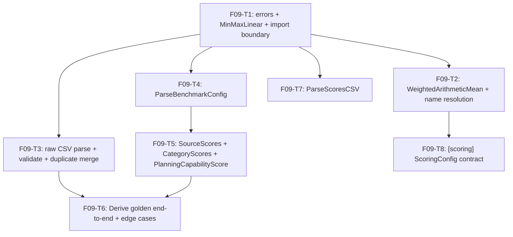

# F09 — Scoring: Tasks

## Task graph



## Task F09-T1: Create package skeleton, errors, MinMaxLinear, and the import boundary

**Depends on:** none (uses `catalog.Normalizer`/`catalog.Aggregator` from `specs/global/CONTRACTS.md §2.2`; F02 `internal/decimal` per `specs/DEPENDENCY-GRAPH.md` row F09)

**Files:**
- create `internal/catalog/score/errors.go`
- create `internal/catalog/score/normalize.go`
- create `internal/catalog/score/score_test.go`

**Spec references:**
- `specs/features/F09-scoring/SPEC.md §1, §2.2, §2.4`
- `specs/features/F09-scoring/CONTRACTS.md §1.1, §1.3`
- `specs/global/CONTRACTS.md §2.2 (Normalizer/Aggregator), §2.3 (decimal pin), §8 (import table)`

**Instructions:**
1. Write `score_test.go` FIRST (the package will not compile yet — that is the TDD signal). Include the import-boundary test `TestScoreDoesNotImportFetch`: use `go/parser` to parse every non-test `.go` file under `internal/catalog/score/` (walk with `filepath.WalkDir`) and assert no import path contains `catalog/fetch` or `httpkit` (mirrors the boundary tests in `test_model_source_boundaries.py`).
2. Test 1 `TestMinMaxLinear`: `MinMaxLinear{}.Normalize(decimal.NewFromFloat(63.1), decimal.NewFromFloat(43.0), decimal.NewFromFloat(63.1))` == 100; `Normalize(55.6, 43.0, 63.1)` == 63 (62.6865... rounds half-up); `Normalize(43.0, 43.0, 63.1)` == 0. Use `decimal.NewFromFloat` only in tests; assert with `decimal.Equal`.
3. Test 2 `TestDirectionReflectionHelper`: the unexported helper `directionAdjust(raw, min, max, higherIsBetter) decimal.Decimal` (implement it in `normalize.go`) returns `raw` for higher-is-better and `min + max - raw` for lower-is-better; then `MinMaxLinear{}.Normalize(directionAdjust(...))` reproduces the golden cost scores: Kimi 0.22 → 100, GPT 0.37 → 93, Opus 2.34 → 0 with min 0.22, max 2.34 (the cost metric is lower-is-better).
4. Test 3 `TestErrorCodes`: `MissingAPIKeyError` is NOT in this package — instead assert `Error{Code: ErrInvalidRaw}` implements `error` and `Unwrap` returns nil; `errors.As` on a wrapped `*Error` recovers the code.
5. Implement `errors.go` with the `ErrorCode` enum + `Error` struct from `specs/features/F09-scoring/CONTRACTS.md §1.3` verbatim (codes `ErrInvalidRaw`, `ErrInvalidBenchmarkConfig`, `ErrInvalidScoresCSV`, `ErrUnknownNormalizer`, `ErrUnknownAggregator`).
6. Implement `normalize.go`: `MinMaxLinear` (doc comment per CONTRACTS §1.1 — the global interface has no direction parameter; `directionAdjust` is the exact reflection `v' = min + max - v`) and `directionAdjust`. The score computation is `((raw - min) / (max - min)) * 100` then `.Round(0)` via `internal/decimal`.
7. Run `go build ./internal/catalog/score/...` then `go test ./internal/catalog/score/...`.

**Test cases (write these first):**

| # | input | want |
|---|---|---|
| 1 | `MinMaxLinear.Normalize(63.1, 43.0, 63.1)` | 100 (decimal-equal) |
| 2 | `MinMaxLinear.Normalize(55.6, 43.0, 63.1)` | 63 |
| 3 | `MinMaxLinear.Normalize(43.0, 43.0, 63.1)` | 0 |
| 4 | `directionAdjust(0.37, 0.22, 2.34, false)` + Normalize | 93 |
| 5 | `directionAdjust(2.34, 0.22, 2.34, false)` + Normalize | 0 |
| 6 | `directionAdjust(0.22, 0.22, 2.34, false)` + Normalize | 100 |
| 7 | `directionAdjust(55.6, 43.0, 63.1, true)` | unchanged (55.6) |
| 8 | `Error{Code: ErrInvalidRaw, Message: "x"}` | Error() == "x"; Unwrap() == nil |
| 9 | `fmt.Errorf("wrap: %w", &Error{...})` | `errors.As` recovers `*Error`, Code preserved |
| 10 | every source file in `internal/catalog/score/` | imports contain neither `catalog/fetch` nor `httpkit` |

**Acceptance criteria:**
- [ ] `go build ./internal/catalog/score/...` succeeds
- [ ] `go test ./internal/catalog/score/...` passes with the test cases above
- [ ] no file outside the Files list modified
- [ ] `MinMaxLinear` satisfies the GLOBAL `catalog.Normalizer` (compile-time `var _ catalog.Normalizer = MinMaxLinear{}`)

## Task F09-T2: Implement WeightedArithmeticMean and normalizer/aggregator name resolution

**Depends on:** F09-T1

**Files:**
- create `internal/catalog/score/aggregate.go`
- create `internal/catalog/score/config.go`
- edit `internal/catalog/score/score_test.go`

**Spec references:**
- `specs/features/F09-scoring/CONTRACTS.md §1.1, §2.4`
- `specs/features/F09-scoring/SPEC.md §2.1, §2.3`
- `specs/global/CONTRACTS.md §2.2 (Aggregator interface)`

**Instructions:**
1. Append tests to `score_test.go` FIRST.
2. Test 1 `TestWeightedArithmeticMean`: `WeightedArithmeticMean{}.Aggregate([]decimal.Decimal{90,90,90}, []decimal.Decimal{5,3,2})` == (90, true); `Aggregate([]decimal.Decimal{100,0}, []decimal.Decimal{1,1})` == (50, true) — the se=50 golden case; `Aggregate([]decimal.Decimal{91,100}, []decimal.Decimal{5,2})` == (94, true) — 655/7 = 93.57 rounds to 94 (category scores are integer; F10's unrounded tier2 uses F02 `WeightedMean`, not this); `Aggregate(nil, nil)` == (0, false); `Aggregate([]decimal.Decimal{80}, []decimal.Decimal{5})` == (80, true).
3. Test 2 `TestNameResolution`: `DefaultNormalizer()`/`DefaultAggregator()` return instances whose behavior matches MinMaxLinear/WeightedArithmeticMean; `ResolveNormalizer("minmax-linear")` → no error; `ResolveNormalizer("bogus")` → `*Error` with Code `ErrUnknownNormalizer`, message exactly `unknown normalizer: bogus`; `ResolveAggregator("weighted-arithmetic-mean")` → no error; `ResolveAggregator("sum")` → Code `ErrUnknownAggregator`, message `unknown aggregator: sum`; `ResolveNormalizer("")` → message `unknown normalizer: `.
4. Test 3 `TestNameConstants`: `NormalizerNameMinMaxLinear == "minmax-linear"` and `AggregatorNameWeightedArithmeticMean == "weighted-arithmetic-mean"`.
5. Implement `aggregate.go`: `WeightedArithmeticMean` using `decimal.WeightedMean` from `internal/decimal` (F02 pin) then `.Round(0)`; empty input → `(decimal.Zero, false)`.
6. Implement `config.go`: the two name constants, `DefaultNormalizer()`, `DefaultAggregator()`, `ResolveNormalizer(name string) (Normalizer, error)` and `ResolveAggregator(name string) (Aggregator, error)` — case-sensitive exact match against the constants; unknown → `*Error` with the verbatim messages (copy from `specs/features/F09-scoring/CONTRACTS.md §1.1`). Leave a stub `type ScoringConfig struct` for F09-T8 (define it in F09-T8, not here).
7. Run `go build ./internal/catalog/score/...` then `go test ./internal/catalog/score/...`.

**Test cases (write these first):**

| # | input | want |
|---|---|---|
| 1 | `Aggregate({90,90,90}, {5,3,2})` | (90, true) |
| 2 | `Aggregate({100,0}, {1,1})` | (50, true) |
| 3 | `Aggregate({91,100}, {5,2})` | (94, true) |
| 4 | `Aggregate({}, {})` | (0, false) |
| 5 | `Aggregate({80}, {5})` | (80, true) |
| 6 | `DefaultNormalizer()` / `DefaultAggregator()` | behave as MinMaxLinear / WeightedArithmeticMean |
| 7 | `ResolveNormalizer("minmax-linear")` | no error |
| 8 | `ResolveNormalizer("bogus")` | `unknown normalizer: bogus`, Code ErrUnknownNormalizer |
| 9 | `ResolveAggregator("weighted-arithmetic-mean")` | no error |
| 10 | `ResolveAggregator("sum")` / `ResolveNormalizer("")` | `unknown aggregator: sum` / `unknown normalizer: ` |
| 11 | name constants | `minmax-linear` / `weighted-arithmetic-mean` |

**Acceptance criteria:**
- [ ] `go test ./internal/catalog/score/...` passes with the test cases above
- [ ] `WeightedArithmeticMean` satisfies the GLOBAL `catalog.Aggregator` (compile-time `var _ catalog.Aggregator = WeightedArithmeticMean{}`)
- [ ] no file outside the Files list modified

## Task F09-T3: Implement raw CSV parsing, validation, and duplicate merge

**Depends on:** F09-T1

**Files:**
- create `internal/catalog/score/raw.go`
- edit `internal/catalog/score/score_test.go`

**Spec references:**
- `specs/features/F09-scoring/SPEC.md §2.7, §2.8`
- `specs/features/F09-scoring/CONTRACTS.md §1.3 (raw error table)`
- `docs/plan/research/model-data-pipeline-spec.md §2.1`
- F06 pin: `csvstore.RawCoreColumns` (8 columns) from `specs/features/F06-*/CONTRACTS.md`; F07 `identity.CleanModelName`, `identity.CollapseReasoning`

**Instructions:**
1. Append tests to `score_test.go` FIRST. Add helpers: `rawCSV(lines ...string) []byte` joining with `\n` plus trailing newline, and `goldenHeader()` = `model,reasoning,intelligence_index,time_per_intelligence_index_task_seconds,cost_per_intelligence_index_task_usd,median_end_to_end_response_time_seconds,artificial_analysis_coding_index,artificial_analysis_agentic_index`.
2. Test 1 `TestRawParseGoldenHeader`: golden header + one row `Claude Opus 5,max,63.1,465,2.34,61,78.0,59.2` → 1 parsed row, all 6 metric values decimal, no error (validates the 8-column core + no benchmark columns).
3. Test 2 `TestRawValidationErrors` — each input produces the verbatim message (row numbers start at 2):
   - row `Claude X,max,63.1` (too few cells) → `row 2: too few values`
   - row with 10 cells → `row 2: too many values`
   - blank intelligence → `row 2: intelligence_index must not be blank`
   - `abc` in cost → `row 2: cost_per_intelligence_index_task_usd must be numeric, got 'abc'`
   - `NaN` in median → `row 2: median_end_to_end_response_time_seconds must be finite, got 'NaN'`
   - `-1` in cost → `row 2: cost_per_intelligence_index_task_usd must not be negative, got '-1'`
   - header with `intelligence_index` missing → `unexpected core columns: expected model,reasoning,intelligence_index,time_per_intelligence_index_task_seconds,cost_per_intelligence_index_task_usd,median_end_to_end_response_time_seconds,artificial_analysis_coding_index,artificial_analysis_agentic_index, got <actual joined>`
   - a dynamic column without the `benchmark:` prefix → `invalid or duplicate dynamic benchmark columns`; duplicate `benchmark:DeepSWE` twice → same message
   - empty input → `input contains no data rows`
4. Test 3 `TestRawMergeDuplicates` (SPEC D8): two rows whose identities collide under cleaning (e.g. `Foo (latest),default` and `Foo,high` — use whatever `identity.CleanModelName` strips; check the F07 contract first): first row `41.9,,,22,,,` (blanks), second row fills `55.6,81,0.37` plus a benchmark cell; assert ONE merged row: core first-wins (41.9 kept, blanks filled 81/0.37), `benchmark:` cell = max of colliding rows, reasoning collapsed to `high`, model cleaned. Also: a row whose model cleans to blank → `model name is blank after removing annotations`.
5. Test 4 `TestRawBlankOptional`: blank time/coding/agentic cells parse to nil (NULLABLE_METRICS) with no error.
6. Implement `raw.go` with `parseRawCSV(data []byte) ([]rawRow, map[string]bool, []string, error)` (unexported; signature may be adjusted as the package needs): strip ONE leading `#` line if present (F06 `ProvenancePrefix`); `encoding/csv` reader with `FieldsPerRecord = -1`; header checks per the message table; per-row parse with `decimal.NewFromString` + `IsFinite` checks (negative check only for the three latency/cost metrics); row numbers start at 2; `_mergeInputRows` port: `identity.CleanModelName` + `identity.CollapseReasoning`, first-wins fill-in for core cells, `max` for `benchmark:` cells, in input order; return rows, higher-is-better flags (CORE_METRICS directions from `specs/features/F09-scoring/SPEC.md §2.2` — time/cost/median false, intelligence/coding/agentic true — plus all benchmark columns true), and the dynamic column name list in header order.

**Test cases (write these first):**

| # | input | want |
|---|---|---|
| 1 | golden header + 1 full row | 1 row, 6 decimals, no error |
| 2 | short row | `row 2: too few values` |
| 3 | long row | `row 2: too many values` |
| 4 | blank intelligence | `row 2: intelligence_index must not be blank` |
| 5 | `abc` in cost | `row 2: cost_per_intelligence_index_task_usd must be numeric, got 'abc'` |
| 6 | `NaN` in median | `row 2: median_end_to_end_response_time_seconds must be finite, got 'NaN'` |
| 7 | `-1` in cost | `row 2: cost_per_intelligence_index_task_usd must not be negative, got '-1'` |
| 8 | missing intelligence column | `unexpected core columns: expected model,reasoning,intelligence_index,time_per_intelligence_index_task_seconds,cost_per_intelligence_index_task_usd,median_end_to_end_response_time_seconds,artificial_analysis_coding_index,artificial_analysis_agentic_index, got ...` |
| 9 | non-benchmark dynamic column | `invalid or duplicate dynamic benchmark columns` |
| 10 | duplicate `benchmark:DeepSWE` | `invalid or duplicate dynamic benchmark columns` |
| 11 | empty input | `input contains no data rows` |
| 12 | colliding identities | 1 merged row; first-wins core fill; benchmark max; reasoning `high`; blank-cleaning model → `model name is blank after removing annotations` |

**Acceptance criteria:**
- [ ] `go test ./internal/catalog/score/...` passes with the test cases above
- [ ] error messages byte-identical to `specs/features/F09-scoring/CONTRACTS.md §1.3`; row numbers start at 2
- [ ] no file outside the Files list modified

## Task F09-T4: Implement ParseBenchmarkConfig (strict benchmarks TOML)

**Depends on:** F09-T1

**Files:**
- create `internal/catalog/score/benchmark_config.go`
- create `internal/catalog/score/benchmark_config_test.go`

**Spec references:**
- `specs/features/F09-scoring/CONTRACTS.md §1.2`
- `specs/features/F09-scoring/SPEC.md §2.8, §2.11`
- `docs/plan/annex-b-catalog-port.md §3.1, §5.1`
- F07 pin: `identity.BenchmarkKey`, `identity.BenchmarkAliases` from `specs/features/F07-*/CONTRACTS.md`

**Instructions:**
1. Write `benchmark_config_test.go` FIRST.
2. Test 1 golden config: the fixture TOML below parses to `BenchmarkConfig` with 2 evidence groups in file order (`software_engineering` with 11 benchmarks, `finance` with 5) and `CanonicalBenchmarks` mapping every listed name to itself (no aliases in this fixture).

```toml
[benchmark_selection]
groups = ["software_engineering", "finance"]
benchmarks = []

[benchmark_groups.software_engineering]
benchmarks = [
  "SWE-Bench Verified",
  "SWE-Bench Pro",
  "SWE-Bench Multilingual",
  "SWE-Bench Multimodal",
  "DeepSWE",
  "Terminal-Bench",
  "AutomationBench",
  "FrontierCode",
  "Program Bench",
  "MCP Atlas",
  "Toolathlon",
]

[benchmark_groups.finance]
benchmarks = [
  "Finance Agent",
  "FinanceAgent",
  "τ3 Banking",
  "GDPval",
  "GDPval-AA",
]
```

3. Test 2 alias canonicalization: a config whose group lists `"FinanceAgent"` and whose alias table (follow the F07 `BenchmarkAliases` contract's TOML shape exactly — check `docs/plan/annex-b-catalog-port.md §3.1` first) declares `GDPval-AA` an alias of `GDPval` → both resolve through `identity.BenchmarkKey`; group order preserved.
4. Test 3 strictness: unknown top-level key → `ErrInvalidBenchmarkConfig`; unknown key inside a group → error; a group listing an unknown benchmark name (not in `CanonicalBenchmarks`) → error; a category name in `groups` without a `[benchmark_groups.<name>]` table → error. Message content is free-form (prefix `benchmark config:`), assert only the error code and non-empty message.
5. Implement `benchmark_config.go`: `BurntSushi/toml` `Decode` + `meta.Undecoded()` check (strict), then build `CanonicalBenchmarks` via `identity.BenchmarkAliases`/`BenchmarkKey` per the F07 contract, `EvidenceGroups` in file order, `CategoryMinimumEvidence` per the CONTRACTS §1.2 map.

**Test cases (write these first):**

| # | input | want |
|---|---|---|
| 1 | golden fixture above | 2 groups in order; 11 + 5 benchmark names; no error |
| 2 | aliased names (F07 shape) | canonicalized via BenchmarkKey; group order preserved |
| 3 | unknown top-level key | Code ErrInvalidBenchmarkConfig |
| 4 | unknown group-table key | Code ErrInvalidBenchmarkConfig |
| 5 | group names unknown benchmark | Code ErrInvalidBenchmarkConfig |
| 6 | group listed without table | Code ErrInvalidBenchmarkConfig |

**Acceptance criteria:**
- [ ] `go test ./internal/catalog/score/...` passes with the test cases above
- [ ] parsing is strict (unknown keys rejected) — no silent tolerance
- [ ] no file outside the Files list modified

## Task F09-T5: Implement SourceScores, CategoryScores, PlanningCapabilityScore

**Depends on:** F09-T4

**Files:**
- create `internal/catalog/score/composites.go`
- edit `internal/catalog/score/score_test.go`

**Spec references:**
- `specs/features/F09-scoring/CONTRACTS.md §2.3`
- `specs/features/F09-scoring/SPEC.md §2.8, §2.9`
- `docs/plan/annex-b-catalog-port.md §4.5, §5.1`
- `generate_scores.py` `_source_scores`, `_category_score`, `planning_capability_score`

**Instructions:**
1. Append tests to `score_test.go` FIRST. Helper `scoreRowFromMap(model, reasoning string, tier1, cats map[string]string) catalog.ScoreRow` (F09-T7 will build full ScoreRows; here hand-build with the canonical keys: Tier1 keyed `intelligence_index_score`, `time_per_intelligence_index_task_seconds_score`, `cost_per_intelligence_index_task_usd_score`, `median_end_to_end_response_time_seconds_score`, `artificial_analysis_coding_index_score`, `artificial_analysis_agentic_index_score`; Categories keyed by category name; Benchmarks by plain name).
2. Test 1 `TestSourceScoresAAPreferred`: a row with `artificial_analysis_coding_index_score = 99` AND `Benchmarks["Artificial Analysis Coding Index"] = 55` → `SourceScores` contains key `artificialanalysiscodingindex` with value 99 (AA column seeds first, `setdefault` keeps it; mirror `generate_scores.py _source_scores`); same for the agentic key `artificialanalysiscodingagentindex`.
3. Test 2 `TestSourceScoresCSVOrderFirstWins`: row with `Benchmarks["Finance Agent"] = 50` and `Benchmarks["FinanceAgent"] = 100` → key `financeagent` == 50 (first-wins in CSV/header order); `Benchmarks["GDPval"] = 80` and `Benchmarks["GDPval-AA"] = 0` → key `gdpval` == 80.
4. Test 3 `TestCategoryScoresGolden` (real pipeline numbers): build rows for Claude Opus 5/max, GPT-5.6 Sol/medium, Kimi K2.7 Code/high with the GOLDEN normalized evidence: Opus `Benchmarks{"SWE-Bench Pro":100, "DeepSWE":0}`; GPT `{"SWE-Bench Pro":0, "DeepSWE":100}`; Kimi none; config from F09-T4 test 1 → `CategoryScores(row, cfg)`: Opus `software_engineering == 50`; GPT `software_engineering == 50`; Kimi has no `software_engineering` key. Every other category absent for all three.
5. Test 4 `TestCategoryMinimumEvidence`: security group with ONE populated evidence → present (minimum 1); reasoning group with ONE populated evidence → absent (minimum 2); assert both via a purpose-built config (security with 1 benchmark, reasoning with 1 benchmark).
6. Test 5 `TestPlanningCapability`: with `Categories{"reasoning":80, "knowledge":85, "agentic_tools":70, "research":90}` → 0.4·80+0.3·85+0.2·70+0.1·90 = 80.5 → 81 (ROUND_HALF_UP); missing `research` key → zero (blank).
7. Implement `composites.go` per the CONTRACTS signatures: `SourceScores(row catalog.ScoreRow) map[string]decimal.Decimal` (AA columns first via `identity.BenchmarkKey`, then benchmark `setdefault`-style first-wins over the row's benchmark keys SORTED by name — document in a comment that Derive must supply header-order-preserving input), `CategoryScores(row, cfg)` (group order iteration, seen-key dedup, minimum-evidence gate via `CategoryMinimumEvidence`, unweighted mean = sum/len then `.Round(0)`), `PlanningCapabilityScore(categoryScores)` (fixed weights 0.4/0.3/0.2/0.1, any missing → zero).

**Test cases (write these first):**

| # | input | want |
|---|---|---|
| 1 | AA coding 99 vs models.dev 55 | source key `artificialanalysiscodingindex` = 99 |
| 2 | Finance Agent 50 vs FinanceAgent 100 | `financeagent` = 50 |
| 3 | GDPval 80 vs GDPval-AA 0 | `gdpval` = 80 |
| 4 | Opus row (Pro 100, DeepSWE 0) | `software_engineering` = 50, no other categories |
| 5 | GPT row (Pro 0, DeepSWE 100) | `software_engineering` = 50 |
| 6 | Kimi row (no evidence) | no `software_engineering` key |
| 7 | security group, 1 evidence | present (minimum 1) |
| 8 | reasoning group, 1 evidence | absent (minimum 2) |
| 9 | planning {80, 85, 70, 90} | 81 |
| 10 | planning missing research | zero (blank) |

**Acceptance criteria:**
- [ ] `go test ./internal/catalog/score/...` passes with the test cases above
- [ ] both dedup layers implemented (source-level first-wins + group-level seen-key)
- [ ] no file outside the Files list modified

## Task F09-T6: Implement Derive with a byte-exact golden end-to-end test and edge cases

**Depends on:** F09-T3, F09-T5

**Files:**
- create `internal/catalog/score/derive.go`
- create `internal/catalog/score/testdata/raw_golden.csv`
- create `internal/catalog/score/testdata/benchmarks_golden.toml`
- create `internal/catalog/score/testdata/scores_golden.csv`
- create `internal/catalog/score/derive_test.go`

**Spec references:**
- `specs/features/F09-scoring/CONTRACTS.md §2.1`
- `specs/features/F09-scoring/SPEC.md §2.5, §2.6, §2.10, §2.12, §2.13`
- `docs/plan/annex-b-catalog-port.md §4.0a, §6.2a`

**Instructions:**
1. Write `testdata/raw_golden.csv` FIRST with EXACTLY this content (6 lines, trailing newline):

```
model,reasoning,intelligence_index,time_per_intelligence_index_task_seconds,cost_per_intelligence_index_task_usd,median_end_to_end_response_time_seconds,artificial_analysis_coding_index,artificial_analysis_agentic_index,benchmark:SWE-Bench Verified,benchmark:SWE-Bench Pro,benchmark:SWE-Bench Multilingual,benchmark:SWE-Bench Multimodal,benchmark:DeepSWE,benchmark:Terminal-Bench,benchmark:AutomationBench,benchmark:FrontierCode,benchmark:Program Bench,benchmark:MCP Atlas,benchmark:Toolathlon,benchmark:Finance Agent,benchmark:FinanceAgent,benchmark:τ3 Banking,benchmark:GDPval,benchmark:GDPval-AA
Claude Opus 4.5,default,41.9,,,22,,,,,,,,,,,,,,,,,,
Claude Opus 5,max,63.1,465,2.34,61,78.0,59.2,96.0,79.2,89.5,59.4,68.8,,26.0,,,,,,,,,
Claude Sonnet 5,low,,,,11,,,85.2,63.2,78.3,,,80.4,,38.8,,,,,,,,
GPT-5.6 Sol,medium,55.6,81,0.37,15,76.3,47.9,,64.6,,,72.7,88.8,,,,,58.0,,,,,
Kimi K2.7 Code,default,43.0,,0.22,67,60.8,30.3,,,,,,,,,53.6,76.0,,,,,,
```

2. Write `testdata/benchmarks_golden.toml` with EXACTLY the fixture from F09-T4 test 1 (the 16-line `[benchmark_selection]` + two `[benchmark_groups.*]` tables).
3. Write `testdata/scores_golden.csv` with EXACTLY this content (4 lines; header + 3 data rows; hand-built to the dual-column schema — the Python single-column output is NOT this schema):

```
model,reasoning,intelligence_index,intelligence_index_score,time_per_intelligence_index_task_seconds,time_per_intelligence_index_task_seconds_score,cost_per_intelligence_index_task_usd,cost_per_intelligence_index_task_usd_score,median_end_to_end_response_time_seconds,median_end_to_end_response_time_seconds_score,artificial_analysis_coding_index,artificial_analysis_coding_index_score,artificial_analysis_agentic_index,artificial_analysis_agentic_index_score,reasoning_score,knowledge_score,research_score,planning_capability_score,instruction_following_score,software_engineering_score,ui_visual_score,agentic_tools_score,finance_score,evidence_capture_score,security_score,data_ml_score,benchmark:SWE-Bench Verified,benchmark:SWE-Bench Verified_score,benchmark:SWE-Bench Pro,benchmark:SWE-Bench Pro_score,benchmark:SWE-Bench Multilingual,benchmark:SWE-Bench Multilingual_score,benchmark:SWE-Bench Multimodal,benchmark:SWE-Bench Multimodal_score,benchmark:DeepSWE,benchmark:DeepSWE_score,benchmark:Terminal-Bench,benchmark:Terminal-Bench_score,benchmark:AutomationBench,benchmark:AutomationBench_score,benchmark:FrontierCode,benchmark:FrontierCode_score,benchmark:Program Bench,benchmark:Program Bench_score,benchmark:MCP Atlas,benchmark:MCP Atlas_score,benchmark:Toolathlon,benchmark:Toolathlon_score,benchmark:Finance Agent,benchmark:Finance Agent_score,benchmark:FinanceAgent,benchmark:FinanceAgent_score,benchmark:τ3 Banking,benchmark:τ3 Banking_score,benchmark:GDPval,benchmark:GDPval_score,benchmark:GDPval-AA,benchmark:GDPval-AA_score
Claude Opus 5,max,63.1,100,465,0,2.34,0,61,12,78.0,100,59.2,100,,,,,,50,,,,,,,96.0,,79.2,100,89.5,,59.4,,68.8,0,,,26.0,,,,,,,,,,,,,,,,,,,
GPT-5.6 Sol,medium,55.6,63,81,100,0.37,93,15,100,76.3,90,47.9,61,,,,,,50,,,,,,,,,64.6,0,,,,,72.7,100,88.8,,,,,,,,,,,,58.0,,,,,,,,,
Kimi K2.7 Code,high,43.0,0,,,0.22,100,67,0,60.8,0,30.3,0,,,,,,,,,,,,,,,,,,,,,,,,,,,,,,,53.6,,76.0,,,,,,,,,,,
```

4. Write `derive_test.go` FIRST with `TestDeriveGolden`: `got, err := Derive(rawGolden, benchmarksGolden, DefaultNormalizer(), DefaultAggregator())`; assert `err == nil`; assert `string(got)` equals EXACTLY:

```
# which-model-scores-provenance raw_sha256=336d58de3f5d8ffd1193c04d78a90824526152b8876ed17486f3ceee3e391274 normalizer=minmax-linear aggregator=weighted-arithmetic-mean
```
concatenated with the `scores_golden.csv` content (read via `os.ReadFile("testdata/scores_golden.csv")`). The hash is the SHA-256 of `raw_golden.csv` bytes as given (verify with `shasum -a 256 testdata/raw_golden.csv` — do NOT trust the golden value until the file is written; if the fixture bytes differ, recompute).
5. Additional tests in `derive_test.go` (edge cases, SPEC §2.5/§2.6):
   - `TestDeriveDeterminism`: same inputs twice → byte-identical output.
   - `TestDeriveOptionalDegenerateMetrics`: raw with 2 eligible rows where `coding` values are equal (e.g. both 50.0) and `time` entirely blank → output has `artificial_analysis_coding_index_score` and `time_per_intelligence_index_task_seconds_score` blank (degenerate/absent optional → blank), while `intelligence_index_score` is populated; no error.
   - `TestDeriveBenchmarkDegenerate`: one benchmark column populated by a single eligible row → its `_score` pair blank; a benchmark populated by two rows → normalized scores present (higher-is-better).
   - `TestDeriveRetainsMissingCost` (corrected SPEC D9): raw with one complete and one partial measured row → both output rows retained.
   - `TestDeriveInputProvenanceLine`: raw prefixed with `# raw_sha256=` + 64 hex → parses and scores fine; emitted `raw_sha256=` equals `csvstore.ProvenanceHash(rawWithLine)` (hash of the FULL bytes as given, `#` line included).
   - `TestDeriveErrors`: raw with no published metrics → `input contains no published metric values`; absent or constant columns yield blank relative scores without discarding measured rows.
6. Implement `derive.go` per corrected F09 SPEC §2.5–6: retain rows with any published metric, normalize each column independently over its published values, leave absent/constant relative columns blank, and preserve raw absolute values. Keep input validation, category scoring, CSV ordering, and provenance unchanged.
7. Run `go build ./internal/catalog/score/...` then `go test ./internal/catalog/score/...`.

**Test cases (write these first):**

| # | input | want |
|---|---|---|
| 1 | `Derive(raw_golden, benchmarks_golden, defaults)` | `err == nil`; bytes == provenance line + scores_golden.csv verbatim (byte-for-byte) |
| 2 | same call twice | identical bytes (determinism) |
| 3 | equal coding values, blank time | coding/time `_score` blank; intelligence `_score` populated; no error |
| 4 | singleton benchmark column | blank `_score` pair; two-row benchmark normalized (higher-is-better) |
| 5 | complete + partial measured rows | exactly 2 output data rows |
| 6 | raw with leading `# raw_sha256=` line | parses; emitted hash == hash of full bytes as given |
| 7 | no published metric values | no-published-values error |
| 8 | all intelligence blank | `intelligence_index has no published values` |
| 9 | all intelligence equal (43.0) | `intelligence_index has a degenerate range (43.0)` |

**Acceptance criteria:**
- [ ] `go test ./internal/catalog/score/...` passes with the test cases above
- [ ] golden test is byte-exact including the provenance header; the sha256 in the header equals the fixture's actual SHA-256
- [ ] no map-order iteration in output-producing paths (D6)
- [ ] no file outside the Files list modified

## Task F09-T7: Implement ParseScoresCSV with verbatim errors and ScoreRow mapping

**Depends on:** F09-T1

**Files:**
- create `internal/catalog/score/parse_scores.go`
- create `internal/catalog/score/parse_scores_test.go`

**Spec references:**
- `specs/features/F09-scoring/CONTRACTS.md §1.3 (scores CSV errors), §2.2`
- `specs/features/F09-scoring/SPEC.md §2.14, §2.15`
- `specs/global/CONTRACTS.md §2.1 (ScoreRow)`
- `rank_models.py:359-401`

**Instructions:**
1. Write `parse_scores_test.go` FIRST.
2. Test 1 happy path: feed it the `testdata/scores_golden.csv` bytes (read relative to the test file) → 3 ScoreRows; Opus row: `Tier1["intelligence_index_score"] == 100`, `Tier1["cost_per_intelligence_index_task_usd_score"] == 0`, `Tier1["median_end_to_end_response_time_seconds_score"] == 12`; `Categories["software_engineering"] == 50`, no `Categories["finance"]` key; `Benchmarks["SWE-Bench Pro"] == 100`, `Benchmarks["DeepSWE"] == 0`, no `Benchmarks["SWE-Bench Verified"]` key; Kimi row reasoning == "high".
3. Test 2 errors (verbatim): missing `median_end_to_end_response_time_seconds_score` column → `score CSV is missing required columns: median_end_to_end_response_time_seconds_score`; a row with extra cell → `score CSV row 2 has extra cells`; blank model → `score CSV row 2 has a blank model/reasoning identity`; duplicate (model, reasoning) → `score CSV has duplicate identity: Claude Opus 5 / max`; cell `101` in `intelligence_index_score` → `score CSV row 2 intelligence_index_score must be between 0 and 100`; empty bytes → `score CSV contains no model rows`.
4. Test 3 provenance shape: leading line `# which-model-scores-provenance raw_sha256=<64-hex> normalizer=minmax-linear aggregator=weighted-arithmetic-mean` + valid rows → parses fine (provenance not exposed, just tolerated); two leading `#` lines → error (F06 shape rule); malformed `raw_sha256` token → error.
5. Implement `parse_scores.go`: parse header; `required` = `model, reasoning` + the 6 `_score` column names (the same constants F10 uses: `intelligence_index_score`, `time_per_intelligence_index_task_seconds_score`, `cost_per_intelligence_index_task_usd_score`, `median_end_to_end_response_time_seconds_score`, `artificial_analysis_coding_index_score`, `artificial_analysis_agentic_index_score`); missing → sorted-names error; per row: extra cells, blank identities, duplicate rejection via a seen set (message with cleaned model/reasoning), 0-100 range check for every `_score` cell (categories and benchmarks included); empty → `score CSV contains no model rows`; map cells: `Tier1` keyed by the 6 `_score` names, `Categories` by plain category name (strip `_score`), `Benchmarks` by plain benchmark name (strip `benchmark:`); identities via `identity.CleanModelName` + `identity.CollapseReasoning`; leading `#` line validated per F06 `ProvenancePrefix` rules (exactly one, shape checked; `raw_sha256` required).

**Test cases (write these first):**

| # | input | want |
|---|---|---|
| 1 | scores_golden.csv | 3 rows; Opus Tier1 100/0/12, se 50, no finance; Pro 100, DeepSWE 0; Kimi reasoning high |
| 2 | missing median column | `score CSV is missing required columns: median_end_to_end_response_time_seconds_score` |
| 3 | extra cell | `score CSV row 2 has extra cells` |
| 4 | blank model | `score CSV row 2 has a blank model/reasoning identity` |
| 5 | duplicate identity | `score CSV has duplicate identity: Claude Opus 5 / max` |
| 6 | 101 in intelligence score | `score CSV row 2 intelligence_index_score must be between 0 and 100` |
| 7 | empty bytes | `score CSV contains no model rows` |
| 8 | valid provenance line | parses; provenance not exposed |
| 9 | two leading `#` lines | error |
| 10 | malformed raw_sha256 token | error |

**Acceptance criteria:**
- [ ] `go test ./internal/catalog/score/...` passes with the test cases above
- [ ] duplicate rejection lives in ParseScoresCSV (F10 documents it as a precondition)
- [ ] no file outside the Files list modified

## Task F09-T8: Implement the [scoring] ScoringConfig contract

**Depends on:** F09-T2

**Files:**
- edit `internal/catalog/score/config.go`
- edit `internal/catalog/score/score_test.go`

**Spec references:**
- `specs/features/F09-scoring/CONTRACTS.md §1.4, §2.4`
- `specs/features/F09-scoring/SPEC.md §2.1`
- F01 pin: `[scoring]` keys registered (`WHICH_MODEL_SCORING_NORMALIZER`/`WHICH_MODEL_SCORING_AGGREGATOR`), F01 validates keys, F09 validates values — `specs/features/F01-config/CONTRACTS.md`

**Instructions:**
1. Append tests to `score_test.go` FIRST.
2. Test 1 `TestScoringConfigDefaults`: `DefaultScoringConfig()` == `{Normalizer: "minmax-linear", Aggregator: "weighted-arithmetic-mean"}`.
3. Test 2 `TestScoringConfigTOMLTags`: unmarshal `[scoring]\nnormalizer = "minmax-linear"\naggregator = "weighted-arithmetic-mean"` via `toml.Unmarshal` into a `ScoringConfig` pre-set with defaults → fields equal; unmarshal an empty section into a defaulted struct → defaults survive.
4. Test 3 `TestScoringConfigUnknownValue`: a `ScoringConfig` with `Normalizer: "bogus"` round-trips through `ResolveNormalizer` → `unknown normalizer: bogus` (value validation is F09's, key validation is F01's).
5. Implement in `config.go`: `ScoringConfig` struct with toml tags `normalizer`/`aggregator` and `DefaultScoringConfig()` — copy from `specs/features/F09-scoring/CONTRACTS.md §2.4`.

**Test cases (write these first):**

| # | input | want |
|---|---|---|
| 1 | `DefaultScoringConfig()` | `{minmax-linear, weighted-arithmetic-mean}` |
| 2 | decode of `[scoring]` section into defaulted struct | fields overwritten by file values |
| 3 | empty `[scoring]` into defaulted struct | defaults unchanged |
| 4 | `Normalizer: "bogus"` via ResolveNormalizer | `unknown normalizer: bogus` |
| 5 | toml tags | `normalizer` / `aggregator` exactly |

**Acceptance criteria:**
- [ ] `go test ./internal/catalog/score/...` passes with the test cases above
- [ ] `ScoringConfig` toml tags are `normalizer`/`aggregator` exactly
- [ ] no file outside the Files list modified
