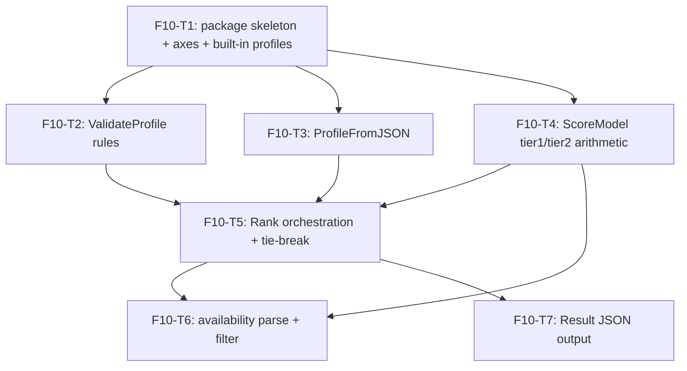

# F10 — Ranking: Tasks

## Task graph

## Task F10-T1: Create package skeleton, axes, and the 11 built-in profiles

**Depends on:** none (uses `catalog.Profile` and `catalog.ScoreRow` from `specs/global/CONTRACTS.md §2.1/§4.3`, already produced by F02/F09 dependencies per `specs/DEPENDENCY-GRAPH.md`)

**Files:**
- create `internal/pick/axes.go`
- create `internal/pick/profiles.go`
- create `internal/pick/profile_test.go`

**Spec references:**
- `specs/features/F10-ranking/SPEC.md §2.1, §2.2`
- `specs/features/F10-ranking/CONTRACTS.md §1.1, §2.2`
- `specs/global/CONTRACTS.md §2.1 (ScoreRow), §4.3 (Profile)`
- `docs/plan/annex-b-catalog-port.md §5.1 (PROFILES verbatim)`

**Instructions:**
1. Write `internal/pick/profile_test.go` FIRST. It must reference `pick.Profiles`, `pick.ValidateProfile`, `pick.Tier1ScoreColumn`, `pick.CategoryNames`, and `catalog.Profile` — the package will not compile yet (TDD: watch the compile failure).
2. Test 1 `TestBuiltinProfilesAreValid`: assert `len(Profiles) == 11`; for every entry assert `ValidateProfile(p) == nil`; assert every tier-1 weight key set equals `{intelligence, cost, speed}` and every tier-2 key is a member of `CategoryNames` (reuse `ValidateProfile` plus one direct key-set check per the Python test `test_all_profiles_have_positive_mandatory_tier_one_weights`).
3. Test 2 `TestPlanningProfileWeights`: `Profiles["planning"].Tier2Weights` equals `{"planning_capability": decimal.NewFromInt(5)}`; `Tier1Share`/`Tier2Share` equal 60/40.
4. Test 3 `TestOrchestrationProfileWeights`: `Profiles["orchestration"]` has shares 60/40, `Tier1Weights == {intelligence:5, cost:5, speed:4}`, `Tier2Weights == {planning_capability:5, instruction_following:5}`, and the set `{reasoning, knowledge, agentic_tools, research}` is disjoint from its tier-2 keys (mirrors `test_orchestration_profile_has_researched_weights_without_double_counting`).
5. Now implement. `axes.go`: `Tier1Axis` type + 3 constants, `Tier1ScoreColumn`, `Tier1AxisOrder`, `CategoryNames` — copy the declarations from `specs/features/F10-ranking/CONTRACTS.md §1.1` character for character.
6. `profiles.go`: the unexported helpers `func d(n int64) decimal.Decimal { return decimal.NewFromInt(n) }` and `func mustProfile(name string, tier1Share, tier2Share int64, tier1 map[string]int64, tier2 map[string]int64) catalog.Profile` that builds a `catalog.Profile` (string keys via `d`) and panics with `fmt.Sprintf("built-in profile %q is invalid: %v", name, err)` when `ValidateProfile` fails (annex-b §5.1); a PLACEHOLDER-ONLY stub `func ValidateProfile(p catalog.Profile) error { return nil }` — F10-T2 replaces it with the real rules (TDD: the built-ins must compile and pass the vacuous stub today); and `var Profiles = map[string]catalog.Profile{...}` with the 11 entries and literal weights from `specs/features/F10-ranking/CONTRACTS.md §2.2` (e.g. `"simple_implementation": mustProfile("simple_implementation", 80, 20, map[string]int64{"intelligence": 1, "cost": 5, "speed": 5}, map[string]int64{"instruction_following": 5})`).
7. Run `go build ./internal/pick/...` then `go test ./internal/pick/...`.

**Test cases (write these first):**

| # | input | want |
|---|---|---|
| 1 | `Profiles` | 11 entries; every entry passes `ValidateProfile`; every tier-1 key set == {intelligence, cost, speed} |
| 2 | `Profiles["planning"].Tier2Weights` | `{"planning_capability": 5}`; shares 60/40 |
| 3 | `Profiles["orchestration"]` | shares 60/40; tier1 {intelligence:5, cost:5, speed:4}; tier2 {planning_capability:5, instruction_following:5}; tier2 keys disjoint from {reasoning, knowledge, agentic_tools, research} |

**Acceptance criteria:**
- [ ] `go build ./internal/pick/...` succeeds
- [ ] `go test ./internal/pick/...` passes with the test cases above
- [ ] no file outside the Files list modified
- [ ] `Profiles` is a package-level var; a broken built-in panics at init (mustProfile), and the test catches it as a test failure first

## Task F10-T2: Implement ValidateProfile with verbatim rules and messages

**Depends on:** F10-T1

**Files:**
- create `internal/pick/errors.go`
- create `internal/pick/profile.go`
- edit `internal/pick/profile_test.go`

**Spec references:**
- `specs/features/F10-ranking/CONTRACTS.md §1.3, §2.1`
- `specs/features/F10-ranking/SPEC.md §2.3`
- `docs/plan/annex-b-catalog-port.md §5.2`

**Instructions:**
1. Append tests to `profile_test.go` FIRST (they reference `ValidateProfile` — already compiles after T1).
2. Test `TestValidateProfileRules`: a table of `(mutate func(*catalog.Profile), wantErr string)` applying each violation to a copy of `Profiles["balanced_implementation"]`:
   - tier1 share 0 or negative, or tier2 share negative → `tier 1 share must be positive and tier 2 share cannot be negative`
   - shares summing to 99 → `tier 1 and tier 2 shares must sum to 100`
   - tier1 keys missing `speed` → `tier 1 weights must include intelligence, cost, and speed (missing speed)`
   - tier1 keys with extra `foo` → `tier 1 weights must include intelligence, cost, and speed (unknown foo)`
   - tier1 key missing speed AND extra foo → `... (missing speed; unknown foo)`
   - tier1 weight `intelligence` = 0 → `tier 1 weight intelligence must be greater than 0 and at most 5`; = 6 → same message
   - tier2 key `notacategory` → `unknown tier 2 categories: notacategory` (sorted; test with `{"notacategory","bogus"}` → `bogus, notacategory`)
   - tier2 weight 0 → `tier 2 weight software_engineering must be greater than 0 and at most 5`
3. Implement `errors.go` with `RankingError{Message string}` and `NoCandidatesError{Message string}`, each with `func (e *...) Error() string { return e.Message }` and `func (e *...) Unwrap() error { return nil }` (so `errors.As` works with `%w`-wrapped errors) — copy from `specs/features/F10-ranking/CONTRACTS.md §1.3`.
4. Move the `ValidateProfile` stub out of `profiles.go` into `profile.go` and implement the real rules exactly per `docs/plan/annex-b-catalog-port.md §5.2` (rule order: shares → tier1 keys (missing sorted, unknown sorted, details joined `; `, prefix always lists all three axes) → tier1 bounds → tier2 unknown (sorted) → tier2 bounds). Return `&RankingError{Message: ...}` for each.
5. Verify the built-ins still construct (T1 tests still pass — mustProfile now runs the real validation).

**Test cases (write these first):**

| # | input | want |
|---|---|---|
| 1 | balanced copy with Tier1Share=0 | `tier 1 share must be positive and tier 2 share cannot be negative` |
| 2 | balanced copy with Tier2Share=-1 | same message |
| 3 | balanced copy with shares 70/29 | `tier 1 and tier 2 shares must sum to 100` |
| 4 | balanced copy with Tier1Weights missing speed | `tier 1 weights must include intelligence, cost, and speed (missing speed)` |
| 5 | balanced copy with Tier1Weights + foo:5 | `tier 1 weights must include intelligence, cost, and speed (unknown foo)` |
| 6 | balanced copy missing speed + foo | `tier 1 weights must include intelligence, cost, and speed (missing speed; unknown foo)` |
| 7 | balanced copy with intelligence weight 0 | `tier 1 weight intelligence must be greater than 0 and at most 5` |
| 8 | balanced copy with intelligence weight 6 | same message |
| 9 | balanced copy with tier2 key notacategory:1 | `unknown tier 2 categories: notacategory` |
| 10 | balanced copy with tier2 keys {notacategory, bogus} | `unknown tier 2 categories: bogus, notacategory` |
| 11 | balanced copy with software_engineering weight 0 | `tier 2 weight software_engineering must be greater than 0 and at most 5` |
| 12 | `Profiles["balanced_implementation"]` untouched | error is nil |

**Acceptance criteria:**
- [ ] `go test ./internal/pick/...` passes with the test cases above
- [ ] every message string in `specs/features/F10-ranking/CONTRACTS.md §1.3` appears in `profile.go`/`errors.go` verbatim
- [ ] no file outside the Files list modified

## Task F10-T3: Implement ProfileFromJSON (flat and nested shapes)

**Depends on:** F10-T2

**Files:**
- edit `internal/pick/profile.go`
- create `internal/pick/profile_json_test.go`

**Spec references:**
- `specs/features/F10-ranking/CONTRACTS.md §2.1`
- `specs/features/F10-ranking/SPEC.md §2.15`
- `docs/plan/annex-b-catalog-port.md §5.2`

**Instructions:**
1. Write `profile_json_test.go` FIRST.
2. Test 1 flat form: `{"tier1_share":70,"tier2_share":30,"tier1_weights":{"intelligence":5,"cost":1,"speed":1},"tier2_weights":{"research":5}}` → Profile with those values, `Name == "custom"`, passes `ValidateProfile` (mirrors `test_custom_json_and_repeated_weights_require_tier_one`).
3. Test 2 nested form: `{"tier1":{"share":70,"intelligence":5,"cost":1,"speed":1},"tier2":{"share":30,"research":5}}` → tier1 share 70, tier2 share 30, tier2 weights {research:5}.
4. Test 3 nested-with-weights form: `{"tier1":{"share":70,"weights":{"intelligence":5,"cost":1,"speed":1}},"tier2":{"share":30,"weights":{"research":5}}}` → same as test 2.
5. Test 4 defaults: `{"tier1_weights":{"intelligence":5,"cost":1,"speed":1}}` → shares default to 100/0.
6. Test 5 error cases (each returns `*RankingError` with the message): `not json` → `weights JSON is invalid:`; `[1]` → `weights JSON must be an object`; `{"tier1_weights":5}` → `weights JSON tier1/tier2 weights must be objects`; `{"tier1_weights":{"intelligence":"x","cost":1,"speed":1}}` → `tier 1 weight intelligence must be numeric`; `{"tier1_weights":{"intelligence":5,"cost":1}}` → `tier 1 weights must include intelligence, cost, and speed (missing speed)`; `{"tier1_weights":{"intelligence":5,"cost":1,"speed":9}}` → `tier 1 weight speed must be between 0 and 5`; `{"tier1_weights":{"intelligence":5,"cost":1,"speed":1},"tier1_share":"NaN"}` → `tier1 share must be finite`.
7. Implement `ProfileFromJSON(data []byte) (catalog.Profile, error)` in `profile.go` per `rank_models.py profile_from_json` semantics (flat/nested/nested-weights; share defaults 100/0; `_decimal`-style parsing with messages from `specs/features/F10-ranking/CONTRACTS.md §1.3`; weights via the `_weights`-style loop producing `tier 1 weight <name> must be between 0 and 5` for values outside [0,5] and `tier 1 weight names must be non-blank strings` for blank names). Use `decimal.NewFromString` and reject non-finite with the finite message. Then `ValidateProfile`; wrap violations as-is. `Name` is always `"custom"`.

**Test cases (write these first):**

| # | input | want |
|---|---|---|
| 1 | flat JSON with tier1 5/1/1, research 5, shares 70/30 | Profile{Name:"custom", 70, 30, {i:5,c:1,s:1}, {research:5}}; ValidateProfile nil |
| 2 | nested JSON `tier1:{share, i,c,s}`, `tier2:{share, research}` | tier1 share 70, tier2 share 30, tier2 {research:5} |
| 3 | nested `weights` objects | identical to test 2 |
| 4 | `{"tier1_weights":{i:5,c:1,s:1}}` | shares default 100/0 |
| 5 | `not json` | `weights JSON is invalid:` (prefix) |
| 6 | `[1]` | `weights JSON must be an object` |
| 7 | `{"tier1_weights":5}` | `weights JSON tier1/tier2 weights must be objects` |
| 8 | `{"tier1_weights":{"intelligence":"x","cost":1,"speed":1}}` | `tier 1 weight intelligence must be numeric` |
| 9 | `{"tier1_weights":{"intelligence":5,"cost":1}}` | `tier 1 weights must include intelligence, cost, and speed (missing speed)` |
| 10 | `{"tier1_weights":{"intelligence":5,"cost":1,"speed":9}}` | `tier 1 weight speed must be between 0 and 5` |
| 11 | `{"tier1_weights":{"intelligence":5,"cost":1,"speed":1},"tier1_share":"NaN"}` | `tier1 share must be finite` |

**Acceptance criteria:**
- [ ] `go test ./internal/pick/...` passes with the test cases above
- [ ] both flat and nested JSON forms parse; share defaults are 100/0
- [ ] no file outside the Files list modified

## Task F10-T4: Implement ScoreModel tier1/tier2 arithmetic verbatim

**Depends on:** F10-T1

**Files:**
- create `internal/pick/rank.go`
- create `internal/pick/rank_test.go`

**Spec references:**
- `specs/features/F10-ranking/CONTRACTS.md §2.3, §2.4`
- `specs/features/F10-ranking/SPEC.md §2.4, §2.5, §2.6, §2.7`
- `docs/plan/annex-b-catalog-port.md §5.3, §5.6`

**Instructions:**
1. Write `rank_test.go` FIRST. Helper `scoreRow(model, reasoning string, intelligence, cost, speed string, cats map[string]string) catalog.ScoreRow` builds a ScoreRow: `Tier1` keyed `intelligence_index_score`/`cost_per_intelligence_index_task_usd_score`/`median_end_to_end_response_time_seconds_score` (skip key when its value is ""), `Categories` keyed by category name (skip when "").
2. Test 1 `TestScoreModelTier1Only`: row("Model A","medium") with defaults 90/90/90 (no categories), profile `Profiles["balanced_implementation"]` → Total==90, Tier1==90, Tier2==nil, Tier1Contribution==90, Tier2Contribution==0, Warnings == ["missing optional category scores: instruction_following, software_engineering, agentic_tools"] (CategoryNames order — F10 SPEC D2; DEFERRED D12), ExcludedReasons empty.
3. Test 2 `TestScoreModelMissingTier1Axis`: row with speed="" → ExcludedReasons == ["missing_tier1:speed"], all score fields zero; row missing intelligence AND cost → ["missing_tier1:intelligence,cost"].
4. Test 3 `TestScoreModelTier2Renormalized`: row with intelligence=87, cost=92, speed=88 and categories software_engineering=91, agentic_tools=100 (balanced) → Tier1 == 89, Tier2 == 655/7 (`93.5714285714285714285714285714285714`), Total == 62.3+655/7·0.3 = 90.3714285714285714285714285714285714, Tier1Contribution == 62.3, Tier2Contribution == 655/7·30/100 (assert with `decimal.Equal`, not `==`).
5. Test 4 `TestScoreModelMissingTier2Warns`: row with all three tier-1 present, no categories, profile `Profiles["simple_action_execution"]` → Tier2 == nil, Total == Tier1 (raw, unscaled — SPEC §2.6), Warnings contains BOTH `missing optional category scores: instruction_following, software_engineering, agentic_tools, evidence_capture` AND `no optional task-category scores available; Tier 1 score used` (SPEC D6; CategoryNames order; DEFERRED D12).
6. Test 5 `TestScoreModelPartialTier2Warning`: row with software_engineering=90 only, balanced → Tier2 == 90 (single present category, weight 5/5), Warnings == ["missing optional category scores: instruction_following, agentic_tools"].
7. Implement `ScoreModel(row catalog.ScoreRow, profile Profile) ModelScore` in `rank.go` exactly per `docs/plan/annex-b-catalog-port.md §5.3` steps 1-7: read 3 axis scores from `row.Tier1` (absent = missing; missing list in `Tier1AxisOrder` joined with ","); tier1 via `decimal.WeightedMean(vals, weights)` (F02; `specs/global/CONTRACTS.md §2.3` pin — returns `(decimal.Decimal, bool)`; bool is always true here, ignore-or-panic on false per F02 contract); categories iterated in `CategoryNames` order, only keys present in `profile.Tier2Weights` with weight > 0; missing-optional warning appended; tier2 nil when no data (only when `Tier2Weights` non-empty); combination per SPEC §2.6. All decimal math through `internal/decimal` helpers, never float64.

**Test cases (write these first):**

| # | input | want |
|---|---|---|
| 1 | 90/90/90, no cats, balanced | Total 90; Tier1 90; Tier2 nil; contribs 90/0; warnings `missing optional category scores: instruction_following, software_engineering, agentic_tools` |
| 2 | speed blank | ExcludedReasons `missing_tier1:speed`; zeroed scores |
| 3 | intelligence and cost blank | ExcludedReasons `missing_tier1:intelligence,cost` |
| 4 | 87/92/88 + se 91, at 100, balanced | Tier1 89; Tier2 655/7; Total 90.3714285714285714285714285714285714; contribs 62.3, 196.5/7 (decimal-equal) |
| 5 | tier1 present (90/90/90), no cats, simple_action_execution | Tier2 nil; Total == Tier1 == 90 (unscaled); both warnings, names in CategoryNames order |
| 6 | se=90 only, balanced | Tier2 90; warning only `missing optional category scores: instruction_following, agentic_tools` |

**Acceptance criteria:**
- [ ] `go test ./internal/pick/...` passes with the test cases above
- [ ] no-tier-2 rows keep the RAW tier1 total (unscaled by Tier1Share) — asserted in test 5
- [ ] no file outside the Files list modified

## Task F10-T5: Implement Rank orchestration, tie-break, and exclusion

**Depends on:** F10-T4, F10-T2

**Files:**
- edit `internal/pick/rank.go`
- edit `internal/pick/rank_test.go`

**Spec references:**
- `specs/features/F10-ranking/CONTRACTS.md §2.3, §2.4`
- `specs/features/F10-ranking/SPEC.md §2.9, §2.11, §2.12, §2.13`
- `docs/plan/annex-b-catalog-port.md §5.4, §5.5`

**Instructions:**
1. Append tests to `rank_test.go` FIRST.
2. Test 1 `TestRankTieBreakDeterministic` (mirrors `test_optional_values_are_weighted_and_top_n_is_deterministic`): rows Beta/high and Alpha/high, both 90/90/90 with software_engineering/instruction_following/agentic_tools 90, profile balanced → `Recommendation.Model == "Alpha"`, `Alternatives` has exactly one entry "Beta", `CandidateCount == 2`, `AvailabilityFilterApplied == false`, `Excluded` empty. The tie-break keys are exercised: identical total, intelligence, tier2 contribution, speed, cost → name casefold decides.
3. Test 2 `TestRankTieBreakKeys`: two rows equal on total and intelligence but differing tier2 contribution → higher tier2 contribution wins even with LOWER speed and cost (build: row A total 90 (tier1 90, tier2 90), row B total 90 (tier1 90, tier2 90) — instead use: A: intelligence 95, cost 85, speed 85, cats at=100 (tier2=100) vs B: intelligence 95, cost 95, speed 95, no cats (tier2 nil → total = raw 95) — assert B outranks A on total (SPEC §2.6 asymmetry) — this is the documented "missing-data row ranks higher" fixture (annex-b §5.3 closing note).
4. Test 3 `TestRankExcludedAndSort`: rows in this order: Good/high (80/80/80, se 90), Zebra/low (speed blank), Incomplete/high (speed blank), Alpha/low (80/80/80, no cats), profile balanced → Recommendation "Good" with Total 83, Tier1 80, Tier2 90, contribs 56/27; `Alternatives` == [Alpha/low] (tie with Zebra is moot — Zebra is excluded); `Excluded` == [Incomplete/high, Zebra/low] — application order would be [Zebra, Incomplete] (row order), the assert proves the casefold (model, reasoning) ascending SORT ([Incomplete/high] < [Zebra/low]); both excluded rows' reasons == ["missing_tier1:speed"]; `CandidateCount` == 2 (Good + Alpha); `AvailabilityFilterApplied` false.
5. Test 4 `TestRankNoCandidatesDistinctMessages`: all rows missing speed, no filter → `*NoCandidatesError` with `no candidates contain all mandatory Tier 1 scores`; same rows with filter `available = []Identity{{"X","high"}}` → `no candidates remain after live model-and-effort availability and Tier 1 filtering`.
6. Implement `Rank(rows []catalog.ScoreRow, profile Profile, available []Identity) (Result, error)` in `rank.go`: call `ValidateProfile(profile)` (wrap error as-is); loop rows calling `ScoreModel`, appending excluded or ranked; apply availability (exact tuple membership, appending `not_live_available` exclusions); the two terminal errors as `*NoCandidatesError`; sort ranked with a comparator over the 7 keys in exact order (total desc, intelligence desc, tier2 contribution desc, speed desc, cost desc, casefold model asc, casefold reasoning asc — read raw tier1 axis values from `row.Tier1` via `Tier1ScoreColumn`); `Recommendation` = first, `Alternatives` = rest; sort `Excluded` with `sort.SliceStable` on casefold (model, reasoning) ascending; `CandidateCount` = len(ranked survivors); `AvailabilityFilterApplied` = available != nil; `Profile` = profile.Name. Precondition documented: input rows have unique identities.

**Test cases (write these first):**

| # | input | want |
|---|---|---|
| 1 | Beta+Alpha identical 90s, balanced | Recommendation Alpha; Alternatives [Beta]; CandidateCount 2; filter false; Excluded empty |
| 2 | B (95s, no cats) vs A (95 int, 85 c/s, at=100) | B ranks first (raw-total asymmetry) |
| 3 | Good (se 90), Zebra (speed blank), Incomplete (speed blank), Alpha (no cats) | Recommendation Good total 83, contribs 56/27; Alternatives [Alpha/low]; Excluded sorted [Incomplete/high, Zebra/low]; both reasons `missing_tier1:speed`; CandidateCount 2 |
| 4 | all rows missing speed, no filter | `no candidates contain all mandatory Tier 1 scores` |
| 5 | all rows missing speed, filter X/high | `no candidates remain after live model-and-effort availability and Tier 1 filtering` |
| 6 | invalid profile (shares 70/29) | `tier 1 and tier 2 shares must sum to 100` |

**Acceptance criteria:**
- [ ] `go test ./internal/pick/...` passes with the test cases above
- [ ] tie-break comparator uses all 7 keys in the pinned order; excluded sort is stable casefold (model, reasoning)
- [ ] no file outside the Files list modified

## Task F10-T6: Implement ParseAvailability and the availability filter path

**Depends on:** F10-T5

**Files:**
- create `internal/pick/availability.go`
- create `internal/pick/availability_test.go`

**Spec references:**
- `specs/features/F10-ranking/CONTRACTS.md §1.2, §2.5`
- `specs/features/F10-ranking/SPEC.md §2.10, §2.16`
- `docs/plan/annex-b-catalog-port.md §5.5, §5.7`

**Instructions:**
1. Write `availability_test.go` FIRST.
2. Test 1 `TestParseAvailabilityJSON` (mirrors `test_live_availability_filters_exact_identity_without_substitution` input forms): `["Model A|low", {"model":"Model A","reasoning":"high"}, ["Model B","high"]]` → set {Model A/low, Model A/high, Model B/high}; duplicates collapse; a string with spaces `" Model A :: low "` trims to {Model A, low}.
3. Test 2 `TestParseAvailabilityPlainText`: lines `# comment`, blank, `model,reasoning` header, `Model A|low`, `Model B::high`, `Model C,medium`, `Model D/high` → 4 identities; header `MODEL | REASONING` (case/space-insensitive) also skipped.
4. Test 3 separator priority: `"Model A|low:extra"` → last-occurrence split on `|` → Identity{Model: "Model A", Reasoning: "low:extra"} (reasoning may contain `:`); `"a,b::c"` → `::` is tried before `,` → Identity{Model: "a,b", Reasoning: "c"}; `"a|b::c"` → `|` wins → Identity{Model: "a", Reasoning: "b::c"}.
5. Test 4 errors: `""` → (nil, nil); `"   "` → (nil, nil); `"Model A"` (no separator) → `availability identity "Model A" must use model|reasoning, model::reasoning, model,reasoning, or model/reasoning`; `"Model A|"` → same; JSON `{"model":1}` → `invalid availability entry:`; JSON `"{}"` → `availability JSON must be a list`; plain text with only comments → `availability list contains no identities`.
6. Test 5 `TestRankAvailabilityFilter` (mirrors the Python live-availability test): rows Model A/high, Model A/low, Model B/high (all 80/80/80), profile simple_implementation, available = {Model A, low} → Recommendation (Model A, low); Excluded has 2 entries, every Reasons contains `not_live_available`; CandidateCount 1; AvailabilityFilterApplied true. Note: without the filter, Model A/high would rank first (tie-break: high < low casefold) — the filter must remove it.
7. Test 6 `TestRankNoFilterNil` (mirrors `parse_availability` returning None): Rank with `available == nil` → no exclusions for availability, `AvailabilityFilterApplied == false`.
8. Implement `ParseAvailability(data []byte) ([]Identity, error)` in `availability.go`: try `json.Unmarshal` into `json.RawMessage`; if the payload starts with `[` or `{` treat as JSON (unmarshal into `[]json.RawMessage`; each element: string → separator rule; object → require string "model"/"reasoning" keys (missing/wrong type → `invalid availability entry: <q>`); array of 2 strings → pair), else plain text per SPEC §2.16. Separator rule `parseIdentity(value string) (Identity, error)`: try separators in priority order `|`, `::`, `,`, `/`; on first separator present, `strings.LastIndex` split; both halves non-blank after trim or continue to next separator; none usable → the verbatim error. Return `(nil, nil)` for empty/blank input. Dedupe via a map. Internal `parseIdentity` returns errors with the verbatim message.
9. `Rank`'s availability application is already implemented in F10-T5; run the full suite.

**Test cases (write these first):**

| # | input | want |
|---|---|---|
| 1 | `["Model A\|low", {"model":"Model A","reasoning":"high"}, ["Model B","high"], "Model A\|low"]` | 3 unique identities; duplicates collapse |
| 2 | plain text with `#` comment, blank line, `model,reasoning` header, `MODEL \| REASONING` second file | identities parsed; both header spellings skipped |
| 3 | `"Model A\|low:extra"` | Identity{Model A, low:extra} (last-occurrence split) |
| 4 | `"a,b::c"` / `"a\|b::c"` | Identity{a,b / c} and Identity{a / b::c} (priority `::` before `,`; `\|` before `::`) |
| 5 | empty / whitespace input | (nil, nil) |
| 6 | `"Model A"` | `availability identity "Model A" must use model\|reasoning, model::reasoning, model,reasoning, or model/reasoning` |
| 7 | `"Model A\|"` | same error |
| 8 | `{"model":1}` in JSON array | `invalid availability entry: ...` |
| 9 | `{}` | `availability JSON must be a list` |
| 10 | comments only | `availability list contains no identities` |
| 11 | Rank: rows A/high, A/low, B/high; available {A, low}; simple_implementation | Recommendation (A, low); 2 excluded with `not_live_available`; CandidateCount 1; filter true |
| 12 | Rank: same rows; available nil | no availability exclusions; filter false; Recommendation (A, high) |

**Acceptance criteria:**
- [ ] `go test ./internal/pick/...` passes with the test cases above
- [ ] exact-tuple membership only — no fuzzy or case-insensitive matching in Rank
- [ ] no file outside the Files list modified

## Task F10-T7: Verify Result JSON serialization (schema and precision)

**Depends on:** F10-T5

**Files:**
- edit `internal/pick/rank.go`
- create `internal/pick/output_test.go`

**Spec references:**
- `specs/features/F10-ranking/CONTRACTS.md §2.4`
- `specs/features/F10-ranking/SPEC.md §2.14`
- `docs/plan/annex-b-catalog-port.md §5.8`

**Instructions:**
1. Write `output_test.go` FIRST.
2. Test 1 `TestResultJSONSchema` (mirrors `test_cli_returns_machine_readable_recommendation` payload): rows Model A/medium 90/90/90 with se/if/at 90 and Model B/medium 80/80/80 with se/if/at 80, profile balanced, available nil → `json.Marshal(result)`; unmarshal into `map[string]any` and assert: `profile == "balanced_implementation"`; `recommendation.model == "Model A"`; `recommendation.total_score` is a `json.Number` equal to `90`; `tier1_contribution` 63; `tier2_contribution` 27; `tier2_score` 90; `category_scores` has exactly `software_engineering`, `instruction_following`, `agentic_tools`; `alternatives` length 1 (Model B); `excluded` empty array; `candidate_count` 2; `availability_filter_applied` false.
3. Test 2 `TestResultJSONPrecision`: the row from F10-T4 test 4 (tier2 655/7) → `json.Marshal` output contains the exact string `93.5714285714285714285714285714285714` (full decimal precision, no float rounding — differs from Python's `_json_safe` float conversion).
4. Test 3 `TestResultJSONNoInternalKeys`: marshaled output does NOT contain `_tie`, `ExcludedReasons`, or `excluded_reasons` anywhere; `ExcludedReasons` is never serialized (json:"-"); a ModelScore with non-empty ExcludedReasons serializes with empty warning-free fields.
5. Test 4 `TestTier2NullWhenAbsent`: only-tier-one row → marshaled `recommendation.tier2_score` is JSON `null` (assert the raw bytes contain `"tier2_score":null`).
6. Confirm `rank.go`'s JSON tags match `specs/features/F10-ranking/CONTRACTS.md §2.4` exactly (edit tags if any drift).

**Test cases (write these first):**

| # | input | want |
|---|---|---|
| 1 | Model A/B 90s/80s balanced | profile, recommendation.model "Model A", total 90, contribs 63/27, 3 category_scores, alternatives [Model B], excluded [], candidate_count 2, filter false |
| 2 | tier2 655/7 row | raw JSON contains `93.5714285714285714285714285714285714` |
| 3 | any Result | no `_tie` / `ExcludedReasons` keys in output |
| 4 | only-tier-one row | raw JSON contains `"tier2_score":null` |

**Acceptance criteria:**
- [ ] `go test ./internal/pick/...` passes with the test cases above
- [ ] JSON keys match annex-b §5.8 exactly (`total_score`, `tier1_score`, `tier2_score`, `tier1_contribution`, `tier2_contribution`, `category_scores`, `warnings`, `candidate_count`, `availability_filter_applied`)
- [ ] no file outside the Files list modified
