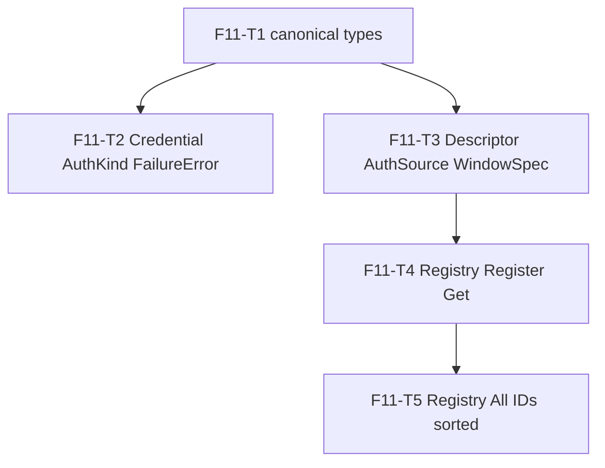

# F11 — Usage Types: Tasks

## Task graph

## Task F11-T1: Define the canonical usage types

**Depends on:** none
**Files:**
- create `internal/usage/types.go`
- create `internal/usage/types_test.go`

**Spec references:** `specs/global/CONTRACTS.md §1.1–§1.6`, `specs/features/F11-usage-types/SPEC.md §1`, `docs/plan/annex-a-provider-matrix.md §5`

**Instructions:**
1. Create `internal/usage/types.go` with `package usage`. Do NOT add a build tag — this file must compile in both default and `-tags nousage` builds (the F21 stub references `Snapshot`).
2. Type `Unit`, `Source`, `Kind`, `Window`, `Snapshot`, `Failure` **verbatim** from `specs/global/CONTRACTS.md` §1.1–§1.6 — same field names, same JSON tags, same constants and constant values. Copy them character-for-character; do not rename, reorder, or extend.
3. Add `func (k Kind) String() string` returning exactly: `KindSubscription → "subscription"`, `KindAPIKeyBilling → "api_key_billing"`, `KindGateway → "gateway"`, `KindLocalTool → "local_tool"`, any other value → `"unknown"` (annex-a §5).
4. Write `types_test.go` BEFORE compiling the implementation is complete (it will fail to compile until `types.go` exists — that failure is the TDD red step).
5. Run `go test ./internal/usage/...` and confirm all cases pass.

**Test cases (write these first):**

| # | input | want |
|---|---|---|
| 1 | `usage.UnitPercent` | `"percent"`; constant exists (compile) |
| 2 | `usage.SourceCache` | `"cache"`; `Source` has all 6 constants (compile) |
| 3 | `usage.KindGateway.String()` | `"gateway"` |
| 4 | `usage.Kind(99).String()` | `"unknown"` |
| 5 | `usage.Window{}` zero value | compiles; `ModelScope` is `[]string(nil)` |
| 6 | `usage.Snapshot{Provider: "x"}` JSON round-trip | `{"provider":"x","windows":null,"fetched_at":"0001-01-01T00:00:00Z","source":"","confidence":"","usage_known":false}` (check `omitempty` fields: `account`, `plan`, `stale`, `error` absent) |
| 7 | `usage.Failure{Code: "timeout", Message: "x"}` JSON round-trip | `{"code":"timeout","message":"x"}` |

**Acceptance criteria:**
- [ ] `go build ./internal/usage/...` succeeds
- [ ] `go test ./internal/usage/...` passes with the test cases above
- [ ] no file outside the Files list modified
- [ ] `types.go` contains no build tag line
- [ ] `go vet ./internal/usage/...` succeeds (empty result)

## Task F11-T2: Define Credential, AuthKind, and FailureError

**Depends on:** F11-T1
**Files:**
- create `internal/usage/credential.go`
- create `internal/usage/credential_test.go`

**Spec references:** `specs/features/F11-usage-types/CONTRACTS.md §2–§4`, `specs/features/F11-usage-types/SPEC.md §2–§4`, `docs/plan/annex-a-provider-matrix.md §5`

**Instructions:**
1. Create `internal/usage/credential.go` with the first line `//go:build !nousage` (then `package usage`). This file touches credentials, so it is excluded from the `nousage` build (annex-a §1a.2).
2. Define `AuthKind` (int enum) with the 13 constants from CONTRACTS §2 in exactly that order (`AuthEnvVar` = iota … `AuthGRPCWebToken`).
3. Add `func (k AuthKind) String() string` — lowercase kind names: `"env"`, `"file"`, `"keychain-generic"`, `"keychain-internet"`, `"cookie"`, `"cli"`, `"rpc"`, `"oauth-device"`, `"oauth-refresh"`, `"aws-sigv4"`, `"volcengine-aksk"`, `"grpc-web-token"`, unknown → `"unknown"`.
4. Define `Credential` exactly as CONTRACTS §3 (fields `Token string`, `Extra map[string]string`, `Source AuthKind`, `Mode uint32`).
5. Add `func (c Credential) String() string` returning `"Credential{source=<AuthKind.String()>, token=<redacted>}"` — it MUST NOT contain `c.Token` or any `c.Extra` value.
6. Define `FailureError` (struct with `Failure Failure`), `Error()` returning `"<code>: <message>"`, `NewFailureError(code, message string) error` returning `&FailureError{Failure: Failure{Code: code, Message: message}}`, and `AsFailure(err error) (Failure, bool)` using `errors.As` (import `errors`; treat a `*FailureError` reached through wrapping as found).
7. Write `credential_test.go` with the cases below, including the canary-token case (canary = `"canary-9f3a2b1c4d5e6f78"`).

**Test cases (write these first):**

| # | input | want |
|---|---|---|
| 1 | `AuthEnvVar.String()` … `AuthGRPCWebToken.String()` | the 13 strings above |
| 2 | `AuthKind(999).String()` | `"unknown"` |
| 3 | `Credential{Token: "sekrit", Source: AuthFile}.String()` | contains `"<redacted>"`, does NOT contain `"sekrit"` |
| 4 | canary: `Credential{Token: "canary-9f3a2b1c4d5e6f78", Extra: map[string]string{"account_id": "canary-9f3a2b1c4d5e6f78"}}.String()` | output contains neither canary occurrence |
| 5 | `NewFailureError("timeout", "call timed out").Error()` | `"timeout: call timed out"` |
| 6 | `AsFailure(NewFailureError("login_required", "no cred"))` | `(Failure{Code: "login_required", Message: "no cred"}, true)` |
| 7 | `AsFailure(fmt.Errorf("wrap: %w", NewFailureError("network", "dns")))` | `(Failure{Code: "network"}, true)` |
| 8 | `AsFailure(errors.New("plain"))` | `(Failure{}, false)` |

**Acceptance criteria:**
- [ ] `go build ./internal/usage/...` succeeds
- [ ] `go test ./internal/usage/...` passes with the test cases above
- [ ] no file outside the Files list modified
- [ ] `credential.go` starts with `//go:build !nousage`
- [ ] canary-token criterion: case 4 proves `Credential.String()` never leaks token or Extra values

## Task F11-T3: Define Descriptor, AuthSource, WindowSpec, FetchFunc

**Depends on:** F11-T1
**Files:**
- create `internal/usage/descriptor.go`
- create `internal/usage/descriptor_test.go`

**Spec references:** `specs/features/F11-usage-types/CONTRACTS.md §5`, `specs/features/F11-usage-types/SPEC.md §5–§7`, `docs/plan/annex-a-provider-matrix.md §5`

**Instructions:**
1. Create `internal/usage/descriptor.go` with `//go:build !nousage` then `package usage`. Imports: `context`, `net/http`, `time`.
2. Define `WindowSpec` with exactly: `ID string`, `Label string`, `Unit Unit`, `Optional bool`, `ModelScope []string` (CONTRACTS §5). Note `ModelScope` — F18 routing consumes it (specs/features/F11-usage-types/SPEC.md §7).
3. Define `KeychainSpec`, `CookieSpec`, `ShellSpec`, `RPCSpec`, `OAuthSpec` exactly as CONTRACTS §5 (field names, types, comments not required).
4. Define `AuthSource` with exactly the fields of CONTRACTS §5: `Kind AuthKind`, `EnvVar string`, `FilePaths []string`, `JSONPath string`, `ExpiryPath string`, `Keychain *KeychainSpec`, `Cookie *CookieSpec`, `Shell *ShellSpec`, `RPC *RPCSpec`, `OAuth *OAuthSpec`, `ExtraPaths map[string]string`, `EnvExtra []string`, `Validate func(ctx context.Context, candidate Credential, client *http.Client) error`.
5. Define `FetchFunc` and `Descriptor` exactly as CONTRACTS §5 (`ID`, `DisplayName`, `Kind`, `Tier`, `Auth []AuthSource`, `Windows []WindowSpec`, `Timeout time.Duration`, `CacheTTL time.Duration`, `Fetch FetchFunc`, `LastVerified time.Time`).
6. Write `descriptor_test.go` constructing a full codex-style Descriptor (mirror the annex-a §5 example: ID `"codex"`, Kind `KindSubscription`, Tier 1, one `AuthFile` source with `FilePaths` `["$CODEX_HOME/auth.json", "~/.codex/auth.json"]`, `JSONPath` `"tokens.access_token"`, `ExtraPaths` `{"account_id": "tokens.account_id"}`, three `Windows` incl. one `Optional`, `Timeout 15 * time.Second`, `CacheTTL 300 * time.Second`).

**Test cases (write these first):**

| # | input | want |
|---|---|---|
| 1 | build the codex-style Descriptor above | compiles; `d.ID == "codex"`, `d.Kind == KindSubscription` |
| 2 | `d.Windows[2].Optional` | `true` (the credits window) |
| 3 | `d.Windows[0].ModelScope` | settable; `[]string{"gpt-5-codex"}` round-trips |
| 4 | `d.Auth[0].JSONPath` | `"tokens.access_token"` |
| 5 | `d.Auth[0].ExtraPaths["account_id"]` | `"tokens.account_id"` |
| 6 | assign `d.Fetch = func(ctx context.Context, cred Credential, client *http.Client) (Snapshot, error) { return Snapshot{Provider: "codex"}, nil }` | compiles (FetchFunc assignability) |
| 7 | `d.Timeout`, `d.CacheTTL`, `d.LastVerified` | `15s`, `300s`, zero `time.Time{}` |

**Acceptance criteria:**
- [ ] `go build ./internal/usage/...` succeeds
- [ ] `go test ./internal/usage/...` passes with the test cases above
- [ ] no file outside the Files list modified
- [ ] `descriptor.go` starts with `//go:build !nousage`

## Task F11-T4: Implement Register and Get

**Depends on:** F11-T3
**Files:**
- create `internal/usage/registry.go`
- create `internal/usage/registry_test.go`

**Spec references:** `specs/features/F11-usage-types/CONTRACTS.md §6`, `specs/features/F11-usage-types/SPEC.md §8`

**Instructions:**
1. Create `internal/usage/registry.go` with `//go:build !nousage` then `package usage`.
2. Define `UnknownProviderError` per CONTRACTS §6: struct with `ID string`, `Error()` returning `fmt.Sprintf("unknown provider %q", e.ID)` (import `fmt`).
3. Declare the package-level registry exactly as annex-a §5: `type registry struct { descs map[string]Descriptor; order []string }` and `var defaultRegistry = &registry{descs: make(map[string]Descriptor)}`. You MAY keep `order` for parity with annex-a §5; `All()`/`IDs()` do not use it (they sort — see instruction 7).
4. Implement `Register(d Descriptor)`: if `d.ID` already exists in `defaultRegistry.descs`, `panic(fmt.Sprintf("usage: duplicate provider id %q", d.ID))`; else store it.
5. Implement `Get(id string) (Descriptor, error)`: return the descriptor when present; otherwise return `Descriptor{}, &UnknownProviderError{ID: id}`.
6. Implement `All() []Descriptor` and `IDs() []string` (see F11-T5 for the sorting — this task only needs them to exist and return the registered entries; implement the sort now so T5 only adds tests: `sort.Strings` on the keys).
7. No mutex is needed (registration is init-time; see SPEC D10).
8. Write `registry_test.go`. Use provider IDs unique to this task (`t4-a`, `t4-b`, …) — the registry is global and shared with F11-T5's tests.

**Test cases (write these first):**

| # | input | want |
|---|---|---|
| 1 | `Register(d{ID: "t4-a", DisplayName: "A"})` then `Get("t4-a")` | descriptor with `DisplayName == "A"`, `err == nil` |
| 2 | `Get("t4-nope")` | `err` is `*UnknownProviderError` with `ID == "t4-nope"` (use `errors.As`) |
| 3 | duplicate: `Register(d{ID: "t4-a"})` again | `panic` with message containing `duplicate provider id "t4-a"` (recover in the test) |
| 4 | `IDs()` | contains `"t4-a"` |
| 5 | `All()` | contains a descriptor with `ID == "t4-a"` |

**Acceptance criteria:**
- [ ] `go build ./internal/usage/...` succeeds
- [ ] `go test ./internal/usage/...` passes with the test cases above
- [ ] no file outside the Files list modified
- [ ] `registry.go` starts with `//go:build !nousage`

## Task F11-T5: Verify All/IDs sorting

**Depends on:** F11-T4
**Files:**
- modify `internal/usage/registry_test.go`

**Spec references:** `specs/features/F11-usage-types/CONTRACTS.md §6`, `specs/features/F11-usage-types/SPEC.md §8`, decision D3

**Instructions:**
1. Register three more descriptors with deliberately out-of-order IDs: `t5-z`, `t5-m`, `t5-a` (in that registration order) with distinct `DisplayName` values.
2. Assert `IDs()` returns a slice that is sorted lexicographically overall (`slices.IsSorted`, import `slices`) and contains all of `t5-a`, `t5-m`, `t5-z`, plus the earlier `t4-a`.
3. Assert `All()` matches `IDs()` one-to-one (same length, same order, same IDs; `All()[i].ID == IDs()[i]` for every `i`).
4. Assert registration order did not matter: `t5-z` (registered first) sorts after `t5-m` and `t5-a`.
5. Run `go test ./internal/usage/...` — the full F11 suite must still pass (earlier tests use IDs unique to them).

**Test cases (write these first):**

| # | input | want |
|---|---|---|
| 1 | register t5-z, t5-m, t5-a in that order; call `IDs()` | `slices.IsSorted(ids)` is true |
| 2 | `IDs()` | index of `t5-a` < index of `t5-m` < index of `t5-z` |
| 3 | `All()` | `len(All()) == len(IDs())` and `All()[i].ID == IDs()[i]` for all `i` |
| 4 | `All()` | `All()[0].ID == "t4-a"` or `"t5-a"` — the minimum registered ID comes first |

**Acceptance criteria:**
- [ ] `go test ./internal/usage/...` passes with the test cases above (plus all earlier F11 tests)
- [ ] no file outside the Files list modified
- [ ] final: `go test ./internal/usage/...` green and `go build ./internal/usage/...` green

---

Feature-level note (not a task): under `-tags nousage`, `internal/usage` contains only `types.go` (+ F21's `internal/usage/disabled.go` stub); `credential.go`/`descriptor.go`/`registry.go` are excluded by their build tags. The F11 suite runs in the default build.
