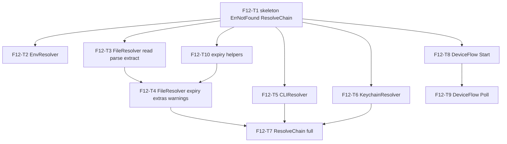

# F12 — Credentials: Tasks

## Task graph

Every file in this package starts with `//go:build !nousage`. Every task that resolves a credential lists a canary-token acceptance criterion (global SPEC §6 invariant 5): the canary string `"canary-9f3a2b1c4d5e6f78"` must never appear in any error, warning, or String() output.

## Task F12-T1: Package skeleton, ErrNotFound, minimal ResolveChain

**Depends on:** none (intra-feature). Feature depends on F05+F11 per `specs/DEPENDENCY-GRAPH.md` §2 (F11-T1/T2 must be done first; F05's symbols are used from T3 onward).
**Files:**
- create `internal/usage/credential/credential.go`
- create `internal/usage/credential/credential_test.go`

**Spec references:** `specs/features/F12-credentials/CONTRACTS.md §1`, `specs/features/F12-credentials/SPEC.md §1, §11, §13`

**Instructions:**
1. Create `internal/usage/credential/credential.go` with `//go:build !nousage` then `package credential`.
2. Re-export `type Credential = usage.Credential` (F11; CONTRACTS §1).
3. Define `type Warning struct { Message string }` (CONTRACTS §1).
4. Define `var ErrNotFound = errors.New("credential not found")` (import `errors`).
5. Define `type Resolver interface { Resolve(ctx context.Context) (usage.Credential, error) }`.
6. Define `func ResolveChain(ctx context.Context, sources []usage.AuthSource, client *http.Client) (usage.Credential, []Warning, error)`. For this task implement ONLY the degenerate paths: zero-length `sources` → `(Credential{}, nil, ErrNotFound)`; a first source whose `Kind` is not implemented by F12 (`AuthSubprocessRPC`, `AuthOAuthRefreshGrant`, `AuthAWSSigV4`, `AuthVolcengineAKSK`, `AuthGRPCWebToken`) → `(Credential{}, nil, ErrNotFound)`. F12-T7 replaces this stub with the full walker.
7. Write `credential_test.go` (tests first; they fail to compile until the package exists — TDD red step).

**Test cases (write these first):**

| # | input | want |
|---|---|---|
| 1 | `ResolveChain(ctx, nil, nil)` | `ErrNotFound` (errors.Is) |
| 2 | `ResolveChain(ctx, []usage.AuthSource{}, nil)` | `ErrNotFound` |
| 3 | `ResolveChain(ctx, []usage.AuthSource{{Kind: usage.AuthSubprocessRPC}}, nil)` | `ErrNotFound` |
| 4 | `ResolveChain(ctx, []usage.AuthSource{{Kind: usage.AuthGRPCWebToken}}, nil)` | `ErrNotFound` |
| 5 | `var _ usage.Credential = Credential{}` | compiles (alias) |
| 6 | `AsFailure(ErrNotFound)` | `(Failure{}, false)` — ErrNotFound is not a FailureError |

**Acceptance criteria:**
- [ ] `go build ./internal/usage/credential/...` succeeds
- [ ] `go test ./internal/usage/credential/...` passes with the test cases above
- [ ] `credential.go` starts with `//go:build !nousage`
- [ ] no file outside the Files list modified

## Task F12-T2: EnvResolver

**Depends on:** F12-T1
**Files:**
- create `internal/usage/credential/env.go`
- create `internal/usage/credential/env_test.go`

**Spec references:** `specs/features/F12-credentials/CONTRACTS.md §2`, `specs/features/F12-credentials/SPEC.md §2, D5`, `specs/features/F05-security/CONTRACTS.md` (`ValidateOpaqueToken`, `WithCanary`), `docs/plan/research/usage-allowance-checks-spec.md` §2.1/§2.2

**Instructions:**
1. Create `internal/usage/credential/env.go` with `//go:build !nousage`.
2. `type EnvResolver struct { Var string; Extra []string }` (CONTRACTS §2).
3. `Resolve(ctx)`: read `os.Getenv(r.Var)`; `strings.TrimSpace`; empty → `ErrNotFound`. Strip one matching surrounding quote pair: if first and last rune are both `"` or both `'`, cut both. Then `security.ValidateOpaqueToken(token)` (from `internal/security`, F05 — signature `ValidateOpaqueToken(token string) error`, length 1..8192, single line, no control chars); failure → `ErrNotFound`. For each name in `r.Extra` present in the environment: add to `Extra` map (skip missing/empty, no validation). Return `Credential{Token, Extra, Source: AuthEnvVar}`.
4. Write `env_test.go`; use `t.Setenv` for isolation. Canary cases use `"canary-9f3a2b1c4d5e6f78"`.

**Test cases (write these first):**

| # | input | want |
|---|---|---|
| 1 | `Var` set to `"tok123"` | token `"tok123"`, `Source == AuthEnvVar`, no error |
| 2 | `Var` unset | `ErrNotFound` |
| 3 | `Var` set to `""` | `ErrNotFound` |
| 4 | `Var` set to `"   "` | `ErrNotFound` |
| 5 | `Var` set to `"\"tok123\""` | `"tok123"` (quotes stripped) |
| 6 | `Var` set to `"'tok123'"` | `"tok123"` |
| 7 | `Var` set to `"bad\ntok"` (control char) | `ErrNotFound` |
| 8 | `Extra` `["OPENAI_PROJECT_ID"]` set | `Extra["OPENAI_PROJECT_ID"]` populated |
| 9 | `Extra` name unset | no entry in `Extra` |
| 10 | canary: `Var` set to `"canary-9f3a2b1c4d5e6f78"`; a second case with canary + `"\n"` suffix | case A: resolves, `Credential.String()` lacks canary; case B: `ErrNotFound` and its error text lacks canary |

**Acceptance criteria:**
- [ ] `go build ./internal/usage/credential/...` succeeds
- [ ] `go test ./internal/usage/credential/...` passes
- [ ] canary-token criterion: case 10 proves EnvResolver's error paths and `Credential.String()` never leak the token
- [ ] no file outside the Files list modified

## Task F12-T3: FileResolver — bounded read, JSON parse, token extraction

**Depends on:** F12-T1
**Files:**
- create `internal/usage/credential/file.go`
- create `internal/usage/credential/file_test.go`

**Spec references:** `specs/features/F12-credentials/CONTRACTS.md §3`, `specs/features/F12-credentials/SPEC.md §3, D4`, `specs/features/F05-security/CONTRACTS.md` (`ReadBoundedFile`, `MaxCredentialBytes`, `ValidateOpaqueToken`, `WithCanary`), `docs/plan/research/usage-allowance-checks-spec.md` §1 (`readBoundedFile`), §2.2 (Codex `auth.json`)

**Instructions:**
1. Create `internal/usage/credential/file.go` with `//go:build !nousage`.
2. `type FileResolver struct { Paths []string; JSONPath string; ExtraPaths map[string]string; ExpiryPath string }` (CONTRACTS §3). This task ignores `ExtraPaths`/`ExpiryPath` (F12-T4).
3. `Resolve(ctx)`: for each `Paths` entry: `security.ReadBoundedFile(path, security.MaxCredentialBytes)` (F05; returns `([]byte, fs.FileMode, error)`). `errors.Is(err, fs.ErrNotExist)` → continue to next path. Other errors (permission, oversized) → `usage.NewFailureError("credential_file", <sanitised>)`. Parse with `encoding/json`; result must decode into a non-null, non-array JSON object (`map[string]json.RawMessage` decodes objects; a JSON array decodes into `[]` — use a marker struct: decode into `json.RawMessage` first, then require first non-whitespace byte is `{`; then unmarshal into `map[string]json.RawMessage`). Malformed JSON or non-object → `credential_json`. Extract `JSONPath` via a dotted walk (`"tokens.access_token"` → `obj["tokens"]` then `["access_token"]`; only plain object/string members, no arrays); missing path, non-string, or empty string → continue to next `Paths` entry (SPEC D4). Token → `security.ValidateOpaqueToken`; failure → `usage.NewFailureError("unsafe_credential", <sanitised>)` (HARD — do not continue). Store `Mode` from `ReadBoundedFile`. All paths exhausted → `ErrNotFound`. Success → `Credential{Token, Source: AuthFile, Mode}`.
4. Write `file_test.go` with `t.TempDir()` fixtures. Canary case: file whose content embeds the canary inside an otherwise-invalid token shape.

**Test cases (write these first):**

| # | input | want |
|---|---|---|
| 1 | nonexistent path only | `ErrNotFound` |
| 2 | `{"tokens":{"access_token":"tok"}}` + `JSONPath "tokens.access_token"` | token `"tok"`, `Source == AuthFile`, `Mode == 0600` (fixture chmod) |
| 3 | flat `{"access_token":"tok"}` + `JSONPath "access_token"` | `"tok"` |
| 4 | valid JSON, `JSONPath "tokens.access_token"` missing from object | `ErrNotFound` |
| 5 | malformed JSON `{"tokens":` | `credential_json` FailureError |
| 6 | JSON array `["a","b"]` | `credential_json` FailureError |
| 7 | token with control char `"bad\ttok"` | `unsafe_credential` FailureError |
| 8 | `JSONPath` resolves to `""` | `ErrNotFound` |
| 9 | file > 1 MiB (write 1.1 MiB of `{` padding; use `security.MaxCredentialBytes` bound) | `credential_file` FailureError |
| 10 | paths `[missing, valid]` | token from the valid second path |
| 11 | chmod 0000 file (read as non-root owner) | `credential_file` FailureError |
| 12 | canary: file content `{"token": "canary-9f3a2b1c4d5e6f78\n"}` (control char inside) | `unsafe_credential`; error text does NOT contain the canary |

**Acceptance criteria:**
- [ ] `go build ./internal/usage/credential/...` succeeds
- [ ] `go test ./internal/usage/credential/...` passes
- [ ] canary-token criterion: case 12 proves FileResolver's error output never leaks the token
- [ ] no file outside the Files list modified

## Task F12-T4: FileResolver — expiry, ExtraPaths, permission warnings

**Depends on:** F12-T3, F12-T10
**Files:**
- modify `internal/usage/credential/file.go`
- create `internal/usage/credential/file_extra_test.go`

**Spec references:** `specs/features/F12-credentials/CONTRACTS.md §3–§4`, `specs/features/F12-credentials/SPEC.md §3–§4`, `specs/features/F05-security/CONTRACTS.md` (`HasBroadPermissions`, `WithCanary`), `docs/plan/research/usage-allowance-checks-spec.md` §2.1 (Claude expiry, permission warning)

**Instructions:**
1. In `file.go`, add the F12-T3-deferred behavior:
   - `ExtraPaths`: for each `name → dottedPath`, walk the parsed object like `JSONPath`; missing/non-string → omit; present → `Extra[name] = value` (SPEC §3).
   - `ExpiryPath`: when non-empty, extract like `JSONPath`; `ParseExpiry` (F12-T10; call it — it will exist by the time this task runs, else implement the 5-line fallback now per CONTRACTS §8), then `CheckExpired(exp, time.Now())`; past or unparseable → `usage.NewFailureError("expired_credential", <sanitised>)` (SPEC §3 fail-safe).
   - `Warnings()` accessor + internal last-warnings slice: on a successful Resolve, when `security.HasBroadPermissions(mode)` (F05; group/other bits set), record `fmt.Sprintf("credential file %s has broad permissions (%s); review before continuing", path, mode)` (SPEC §4). Reset the slice at the start of every Resolve. Warnings are only reported for the WINNING file.
2. Do NOT chmod or modify the file in any way (SPEC §4; global SPEC §6 invariant 6).
3. Write `file_extra_test.go` (fixtures chmoded 0600 unless the case needs 0644).
4. `ParseExpiry`/`CheckExpired` are in `internal/usage/credential/expiry.go` (F12-T10 — already done, per the dependency above). Do NOT re-implement them here.

**Test cases (write these first):**

| # | input | want |
|---|---|---|
| 1 | `ExtraPaths {"account_id": "tokens.account_id"}` populated in file | `Extra["account_id"]` extracted |
| 2 | `ExtraPaths` path missing in file | key omitted from `Extra` (resolve succeeds) |
| 3 | `ExpiryPath` = future epoch (`now+3600` seconds) | success |
| 4 | `ExpiryPath` = past epoch (`now-60`) | `expired_credential` |
| 5 | `ExpiryPath` = `"soon"` (unparseable) | `expired_credential` |
| 6 | `ExpiryPath` = ms epoch `1700000000000` | treated as ms (year 2023), resolves |
| 7 | file mode 0644, valid token | `Warnings()` has 1 entry containing the path and mode; resolve succeeds |
| 8 | file mode 0600, valid token | `Warnings()` empty |
| 9 | paths `[mode0644-file, mode0600-file]` both valid | winning (first) file's warning reported; exactly 1 warning |
| 10 | canary: `Extra["account_id"] = "canary-9f3a2b1c4d5e6f78"` + mode 0644 | warnings contain no canary; `Credential.String()` redacts it |

**Acceptance criteria:**
- [ ] `go build ./internal/usage/credential/...` succeeds
- [ ] `go test ./internal/usage/credential/...` passes
- [ ] canary-token criterion: case 10 proves warnings and String() never leak Extra values
- [ ] no file outside the Files list modified; no chmod-ing of credential files anywhere in `file.go`

## Task F12-T5: CLIResolver

**Depends on:** F12-T1
**Files:**
- create `internal/usage/credential/cli.go`
- create `internal/usage/credential/cli_test.go`

**Spec references:** `specs/features/F12-credentials/CONTRACTS.md §4`, `specs/features/F12-credentials/SPEC.md §5–§6, D1`, `docs/plan/annex-a-provider-matrix.md` §4 (3s Copilot / 20s gcloud timeouts), `docs/plan/research/usage-allowance-checks-spec.md` §2.3 (maxBuffer 32768)

**Instructions:**
1. Create `internal/usage/credential/cli.go` with `//go:build !nousage`.
2. `const MaxCLIOutputBytes = 32 * 1024` (CONTRACTS §4).
3. `type CLIResolver struct { Command string; Args []string; Timeout time.Duration; MaxOutputBytes int64 }`; effective cap = `MaxOutputBytes` if > 0 else `MaxCLIOutputBytes`.
4. `Resolve(ctx)`: build `exec.CommandContext(ctx, r.Command, r.Args...)` with `Stdout = &bytes.Buffer{}` capped by an `io.LimitReader`-style wrapper (`bytes.Buffer` plus a writer that errors when `cap` exceeded — simplest: `io.LimitedReader` semantics via a custom `maxBufferWriter`; import `os/exec`). Deadline: if `r.Timeout > 0` and `ctx` has no earlier deadline, `ctx, cancel = context.WithTimeout(ctx, r.Timeout)`; defer cancel. Run; capture error from `Run()` (covers non-zero exit, timeout, not-found, ctx cancel) and `err == context.DeadlineExceeded` cases. ANY failure OR output size > cap → `ErrNotFound` (SPEC §5). On success: strip exactly one trailing `"\r\n"` or `"\n"` (strings.TrimSuffix, in that order — one strip only); then `security.ValidateOpaqueToken`; failure → `ErrNotFound`. Return `Credential{Token, Source: AuthCLIShellOut}`.
5. NEVER pass secrets via argv or env (SPEC D1) — this resolver only runs token-EMITTING commands; document with a comment.
6. Write `cli_test.go`. Use `sh`/`printf`/`sleep` (all present on macOS). Timeout case must complete in < 2s wall time (assert elapsed too).

**Test cases (write these first):**

| # | input | want |
|---|---|---|
| 1 | `printf 'tok123\n'` | `"tok123"`, `Source == AuthCLIShellOut` |
| 2 | `printf 'tok123\r\n'` | `"tok123"` (CRLF stripped) |
| 3 | `printf 'tok123\n\n'` | `ErrNotFound` (extra newline → unsafe shape) |
| 4 | `sh -c 'exit 3'` | `ErrNotFound` |
| 5 | `sh -c 'sleep 5'` with `Timeout 100ms` | `ErrNotFound` in < 2s |
| 6 | `sh -c 'head -c 40000 /dev/zero \| tr "\\0" "a"'` (40 KiB output) | `ErrNotFound` |
| 7 | `./definitely-not-a-binary` | `ErrNotFound` |
| 8 | already-cancelled ctx + `sleep 5` | `ErrNotFound` promptly |
| 9 | `printf 'bad\ttok\n'` (tab) | `ErrNotFound` |
| 10 | canary: `printf 'canary-9f3a2b1c4d5e6f78\n'; exit 3` | `ErrNotFound`; error text lacks the canary |
| 11 | `printf 'tok\n'` with `Timeout 10s` | token (ctx deadline respected; no over-tightening) |

**Acceptance criteria:**
- [ ] `go build ./internal/usage/credential/...` succeeds
- [ ] `go test ./internal/usage/credential/...` passes
- [ ] canary-token criterion: case 10 proves CLI failure paths never leak command output into errors
- [ ] no file outside the Files list modified

## Task F12-T6: KeychainResolver and managed credentials

**Depends on:** F12-T1
**Files:**
- create `internal/usage/credential/keychain.go`
- create `internal/usage/credential/keychain_darwin.go`
- create `internal/usage/credential/keychain_other.go`
- create `internal/usage/credential/keychain_test.go`
- create `internal/usage/credential/managed.go`
- create `internal/usage/credential/managed_test.go`

**Spec references:** `specs/features/F12-credentials/CONTRACTS.md §5–§5.1`, `specs/features/F12-credentials/SPEC.md §7, §7a, D2, D13`

**Instructions:**
1. Create the read-only `KeychainStore`, read/write `ManagedKeychainStore`, and sanitised `KeychainResolver` contracts. Only the Darwin adapter imports go-keyring; non-Darwin operations return `ErrNotFound`.
2. Implement Darwin `Get`/`Set`/`Delete` with go-keyring and return `ManagedKeychainStore` from `DefaultKeychain`.
3. Implement `ManagedStore` using service `"which-model"` and account `<provider>`. Keychain is preferred when enabled; any failed write falls back to `<StateDir>/credentials/<provider>.json` through `config.AtomicWriteFile` (0600).
4. Resolution falls back from unavailable keychain to the managed file, validates opaque tokens, and reports `AuthOAuthDeviceFlow`. Removal attempts both stores regardless of preference.
5. Implement `ResolveProvider`: preserve `ResolveChain` precedence, then resolve managed storage only for descriptors with a device-flow source and apply that source's `Validate`.
6. Tests use fakes and temp directories only; never touch the real keychain or user state.

**Test cases (write these first):**

| # | input | want |
|---|---|---|
| 1 | fake store returns `"tok123"` | token, `Source == AuthKeychainGeneric` |
| 2 | fake store returns `keyring.ErrNotFound` | `ErrNotFound` |
| 3 | fake store returns `errors.New("bogus")` | `keychain_unavailable` FailureError; message contains no store detail |
| 4 | fake store returns `""` | `ErrNotFound` |
| 5 | canary: fake store returns `"canary-9f3a2b1c4d5e6f78"`; then a second case where store errors with an error whose text embeds the canary | case A resolves and `Credential.String()` redacts; case B's error message lacks the canary |
| 6 | `UnavailableKeychain{}.Get("s", "a")` | `ErrNotFound` (runs on all platforms) |
| 7 | `DefaultKeychain()` | non-nil `KeychainStore` (interface satisfaction, compile) |
| 8 | managed keychain save succeeds | no fallback file; resolve returns OAuth token |
| 9 | keychain unavailable | fallback file mode 0600; resolve succeeds |
| 10 | keychain disabled | no keychain calls; file save/resolve succeeds |
| 11 | remove | both stores cleared; second removal returns `ErrNotFound` |
| 12 | ResolveProvider with missing declared source + managed token | managed token validated and returned |
| 13 | higher-precedence env credential + managed token | env wins; managed keychain not read |

**Acceptance criteria:**
- [ ] `go build ./internal/usage/credential/...` succeeds
- [ ] `go test ./internal/usage/credential/...` passes (no test touches a real keychain)
- [ ] canary-token criterion: case 5 proves keychain error paths never leak the token
- [ ] only `keychain_darwin.go` imports `github.com/zalando/go-keyring`

## Task F12-T7: Full ResolveChain walker

**Depends on:** F12-T2, F12-T3, F12-T4, F12-T5, F12-T6
**Files:**
- modify `internal/usage/credential/credential.go`
- create `internal/usage/credential/chain_test.go`

**Spec references:** `specs/features/F12-credentials/CONTRACTS.md §1`, `specs/features/F12-credentials/SPEC.md §11, D11`, `docs/plan/annex-a-provider-matrix.md` §5, `docs/plan/research/usage-allowance-checks-spec.md` §2.3

**Instructions:**
1. Replace the F12-T1 stub of `ResolveChain` with the full walker: iterate `sources`; build the resolver per `Kind` (env/file/cli/keychain/cookie/oauth-device kinds build their resolvers from the AuthSource fields; unimplemented kinds → continue); call `Resolve(ctx)`; `errors.Is(err, ErrNotFound)` → record nothing, continue; hard error → return `(Credential{}, warningsSoFar, err)` immediately (SPEC D11). On success, if `source.Validate != nil`: run `Validate(ctx, candidate, client)`; error → continue to next source. First accepted candidate wins → return `(candidate, warnings, nil)`. Exhaustion → `(Credential{}, warnings, ErrNotFound)`. Collect `FileResolver.Warnings()` entries into the returned `[]Warning` (message-only; prefix with the provider-facing context is NOT needed — the warning text is self-contained). `client` is passed through to `Validate` and (unused today) to the device-flow — pass it everywhere, never nil-deref.
2. Cookie kinds: `AuthBrowserCookie` → continue (no resolver in F12, SPEC D3).
3. Keep the T1 cases passing (empty sources, unimplemented kinds → ErrNotFound).
4. Write `chain_test.go`: env fixture via `t.Setenv`; file fixtures via `t.TempDir()` (chmod 0600 except the warning case).

**Test cases (write these first):**

| # | input | want |
|---|---|---|
| 1 | sources `[env, file]`, both valid | env candidate wins |
| 2 | env value unsafe, file valid | file candidate wins (skip semantics) |
| 3 | both candidates unavailable | `ErrNotFound` |
| 4 | first candidate fails `Validate` (returns error), second valid | second wins |
| 5 | first candidate passes `Validate`, second source is a malformed-JSON file | first wins, NO error (second never touched) |
| 6 | first source malformed JSON (hard error), second valid | `credential_json` error returned (chain aborted) |
| 7 | winning file source mode 0644 | returned `[]Warning` has 1 entry with the path |
| 8 | winning env source | returned warnings empty |
| 9 | sources `[rpc-kind, env]` | env wins (unimplemented kind skipped) |
| 10 | canary: env token = canary, `Validate` returns `errors.New("bad " + canary)`; then a second case with file 0644 + canary as Extra | case A: second source wins, returned errors/warnings lack canary; case B: warning text lacks canary |

**Acceptance criteria:**
- [ ] `go build ./internal/usage/credential/...` succeeds
- [ ] `go test ./internal/usage/credential/...` passes (all F12 tests so far)
- [ ] canary-token criterion: case 10 proves chain-level errors/warnings never leak token or Extra values
- [ ] no file outside the Files list modified

## Task F12-T8: OAuthDeviceFlow — Start

**Depends on:** F12-T1
**Files:**
- create `internal/usage/credential/deviceflow.go`
- create `internal/usage/credential/deviceflow_start_test.go`

**Spec references:** `specs/features/F12-credentials/CONTRACTS.md §7`, `specs/features/F12-credentials/SPEC.md §9–§10, D6–D9`, `docs/plan/research/usage-allowance-checks-spec.md` §2.3/§4, `docs/plan/annex-a-provider-matrix.md` §3.3

**Instructions:**
1. Create `deviceflow.go` (`//go:build !nousage`): `DeviceFlow` struct per CONTRACTS §7 with `Spec`, `HTTPClient`, `MaxResponseBytes`, `Now`, `Sleep`, `ValidateURL`. `NewDeviceFlow(spec)` sets defaults: `HTTPClient = &http.Client{CheckRedirect: func(*http.Request, []*http.Request) error { return http.ErrUseLastResponse }}`; `MaxResponseBytes = security.MaxResponseBytes`; `Now = time.Now`; `Sleep = time.Sleep`; `ValidateURL = func(raw string) error { _, err := security.ValidateExactHTTPS(raw, []string{raw}); return err }` (SPEC D7, D9).
2. `Start(ctx)`: `f.ValidateURL(f.Spec.DeviceCodeURL)`; `http.NewRequestWithContext(ctx, "POST", url, strings.NewReader(url.Values{"client_id": {id}, "scope": {scope}}.Encode()))` with `Content-Type: application/x-www-form-urlencoded`; `f.HTTPClient.Do`; transport error → `network`. Status 3xx → `redirect_refused` (SPEC §10); non-2xx → `provider_status`. Body via `security.ReadResponseBounded(resp, f.MaxResponseBytes)`; read failure → `network`. Decode JSON object. Validate: `device_code` passes `security.ValidateOpaqueToken` (else `unsupported_response`); `user_code` matches `^[A-Z0-9-]{4,32}$`; `verification_uri == f.Spec.VerificationURI` (exact; empty spec URI → error at `NewDeviceFlow` time — panic with "oauth: VerificationURI is required" — SPEC D9); `expires_in` int in [1,1800]; `interval` int in [1,30] (missing → 5). Violations → `usage.NewFailureError("unsupported_response", <sanitised>)` (SPEC D6).
3. Write `deviceflow_start_test.go` with `httptest` servers; set `ValidateURL = func(string) error { return nil }` on every test flow (httptest is http://; SPEC §9).
4. Test canary: server echoes the canary in the `device_code` field.

**Test cases (write these first):**

| # | input | want |
|---|---|---|
| 1 | happy path (user_code `"ABCD-EFGH"`, verification_uri matches spec) | `DeviceCode` populated; `Interval == 5s` when omitted |
| 2 | `user_code` `"x!"` | `unsupported_response` |
| 3 | `verification_uri` `"https://evil.example"` vs spec `"https://github.com/login/device"` | `unsupported_response` |
| 4 | `device_code` containing a control char | `unsupported_response` |
| 5 | server 500 | `provider_status` |
| 6 | server 302 to elsewhere | `redirect_refused` (zero followed hops — assert final URL in test request counter is the original) |
| 7 | `expires_in: 0` | `unsupported_response` |
| 8 | canary: `device_code: "canary-9f3a2b1c4d5e6f78\n"` | `unsupported_response`; error text lacks the canary |
| 9 | `NewDeviceFlow(OAuthSpec{})` (empty VerificationURI) | panic mentioning `VerificationURI` |

**Acceptance criteria:**
- [ ] `go build ./internal/usage/credential/...` succeeds
- [ ] `go test ./internal/usage/credential/...` passes
- [ ] canary-token criterion: case 8 proves device-flow error output never leaks server values
- [ ] no file outside the Files list modified

## Task F12-T9: OAuthDeviceFlow — Poll

**Depends on:** F12-T8
**Files:**
- modify `internal/usage/credential/deviceflow.go`
- create `internal/usage/credential/deviceflow_poll_test.go`

**Spec references:** `specs/features/F12-credentials/CONTRACTS.md §7`, `specs/features/F12-credentials/SPEC.md §9, D6`, `docs/plan/research/usage-allowance-checks-spec.md` §2.3

**Instructions:**
1. Add `DeviceCode` struct (CONTRACTS §7) if not already defined and `Poll(ctx, code DeviceCode) (string, error)` to `deviceflow.go`: compute deadline `now := f.Now(); deadline := now.Add(code.ExpiresIn)`. Loop: if the deadline has passed or `ctx` is done, return `device_expired` before making another request. POST `TokenURL` with `client_id`, `device_code`, the device-code grant type, and optional `client_secret`; transport error → `network`; non-2xx → `provider_status`; bound the body with `security.ReadResponseBounded`. On 200: `authorization_pending` sleeps/retries; `slow_down` cumulatively adds 5s before sleep/retry; `access_denied` and `expired_token` map to their canonical failures; unknown errors → `unsupported_response`. A successful `access_token` must pass `security.ValidateOpaqueToken`, then is returned as the opaque string. Re-check the deadline after every sleep and before the next request.
2. Keep `Now`/`Sleep` seams: tests inject `Now` (a `*fakeClock`) and `Sleep` (advances the clock) per CONTRACTS §7.
3. Write `deviceflow_poll_test.go`: one httptest server whose handler switches on a scripted queue of responses (pending, pending, success).

**Test cases (write these first):**

| # | input | want |
|---|---|---|
| 1 | pending → pending → success | validated token string returned; 3 requests |
| 2 | first response `slow_down` | `Interval` grew by 5s (assert next request's sleep via fake clock — 2 requests, 2nd after +5s) |
| 3 | `access_denied` | `access_denied` FailureError |
| 4 | `expired_token` | `device_expired` FailureError |
| 5 | deadline already past at entry (`Now` set past `ExpiresIn`) | `device_expired`, request counter == 0 |
| 6 | `ExpiresIn 2s`, interval 1s, fake clock advances 3s during first sleep | 1 request total, `device_expired` |
| 7 | canary: success `access_token` = canary, and a second case `access_denied` with `error_description` embedding canary | case A returns the token only to its caller; case B's error message lacks the canary |
| 8 | unknown error field `"weird_error"` | `unsupported_response` |

**Acceptance criteria:**
- [ ] `go build ./internal/usage/credential/...` succeeds
- [ ] `go test ./internal/usage/credential/...` passes
- [ ] canary-token criterion: case 7 proves Poll never leaks the token or server error text with embedded tokens
- [ ] no file outside the Files list modified

## Task F12-T10: Expiry helpers

**Depends on:** F12-T1
**Files:**
- create `internal/usage/credential/expiry.go`
- create `internal/usage/credential/expiry_test.go`

**Spec references:** `specs/features/F12-credentials/CONTRACTS.md §8`, `specs/features/F12-credentials/SPEC.md §12`, `docs/plan/research/usage-allowance-checks-spec.md` §1 (`resetText` heuristic)

**Instructions:**
1. Create `expiry.go` (`//go:build !nousage`): `ParseExpiry(v any) (time.Time, error)` — `float64`/`json.Number`/`int`/`int64`: `n > 10_000_000_000` → `time.UnixMilli(int64(n))` else `time.Unix(int64(n), 0)`; `string`: try `time.Parse(time.RFC3339Nano, s)` then `time.Parse(time.RFC3339, s)` then numeric-string (`strconv.ParseFloat` + the same heuristic); anything else (bool, object, empty string) → error. `CheckExpired(exp, now time.Time) error`: `now.After(exp)` → `usage.NewFailureError("expired_credential", "credential expired")`, else nil.
2. Write `expiry_test.go`. Note: no credential material flows through these functions, so no canary case is required (SPEC §12).

**Test cases (write these first):**

| # | input | want |
|---|---|---|
| 1 | `float64(1_700_000_000)` | 2023-11-14T22:13:20Z (seconds) |
| 2 | `float64(1_700_000_000_000)` | 2023-11-14T22:13:20Z (ms heuristic) |
| 3 | `"2026-01-02T15:04:05Z"` | parsed RFC3339 |
| 4 | `"1700000000"` (numeric string) | seconds epoch |
| 5 | `"soon"` | error |
| 6 | `true` | error |
| 7 | `CheckExpired(now-1h, now)` | `expired_credential` FailureError |
| 8 | `CheckExpired(now+1h, now)` | nil |

**Acceptance criteria:**
- [ ] `go build ./internal/usage/credential/...` succeeds
- [ ] `go test ./internal/usage/credential/...` passes
- [ ] no file outside the Files list modified

---

Feature-level verification (final, after F12-T10): `go build ./internal/usage/... && go test ./internal/usage/...` and `go build ./internal/usage/credential/...` — full F11+F12 suites green.
