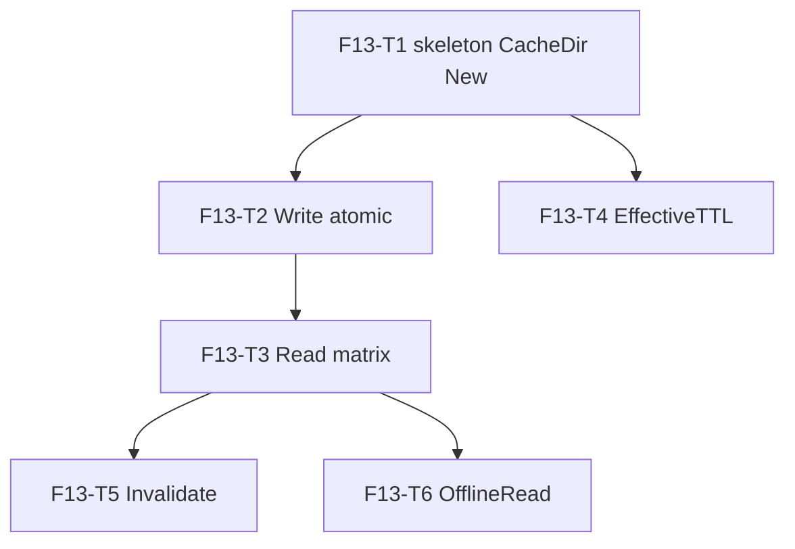

# F13 — Usage Cache: Tasks

## Task graph

Every file in this package starts with `//go:build !nousage`. No credential material ever passes through this package (snapshots carry identity — Account/Plan — never tokens); no canary cases are required. Tests must never touch the real user cache dir: use `t.TempDir()` stores and `t.Setenv("XDG_CACHE_HOME", …)`/`t.Setenv("HOME", …)` only for the `CacheDir` cases.

## Task F13-T1: Package skeleton, CacheDir, New

**Depends on:** none (intra-feature). Feature depends on F11 per `specs/DEPENDENCY-GRAPH.md` §2 (F11-T1 must be done first — `usage.Snapshot` is used).
**Files:**
- create `internal/usage/cache/cache.go`
- create `internal/usage/cache/cache_test.go`

**Spec references:** `specs/features/F13-usage-cache/CONTRACTS.md §1`, `specs/features/F13-usage-cache/SPEC.md §1, D1`

**Instructions:**
1. Create `internal/usage/cache/cache.go` with `//go:build !nousage` then `package cache`.
2. `var ErrCacheMiss = errors.New("cache miss")`.
3. `type Store struct { Dir string }` (CONTRACTS §1).
4. `func CacheDir() (string, error)`: `os.UserCacheDir()`; on error return it wrapped; else `filepath.Join(base, "which-model", "usage-cache")` (SPEC D1).
5. `func New() (*Store, error)`: `dir, err := CacheDir()`; `os.MkdirAll(dir, 0o700)`; return `&Store{Dir: dir}`.
6. Write `cache_test.go`. For `New()`/`CacheDir` tests, `t.Setenv("XDG_CACHE_HOME", t.TempDir())` (macOS `os.UserCacheDir` honors `XDG_CACHE_HOME` first; fall back to `t.Setenv("HOME", …)` if the platform ignores it — assert the dir actually matches).

**Test cases (write these first):**

| # | input | want |
|---|---|---|
| 1 | `CacheDir()` with `XDG_CACHE_HOME=<tmp>` | `<tmp>/which-model/usage-cache` |
| 2 | `New()` with `XDG_CACHE_HOME=<tmp>` | `Store{Dir: <tmp>/which-model/usage-cache}`, nil error |
| 3 | after `New()`, the dir exists with mode 0700 (stat) | exists, `perm == 0700` |
| 4 | `New()` twice | second call succeeds (idempotent mkdir) |
| 5 | `Store{Dir: t.TempDir()}` constructible and usable as a value | compiles |

**Acceptance criteria:**
- [ ] `go build ./internal/usage/cache/...` succeeds
- [ ] `go test ./internal/usage/cache/...` passes with the test cases above
- [ ] `cache.go` starts with `//go:build !nousage`
- [ ] no file outside the Files list modified

## Task F13-T2: Atomic Write

**Depends on:** F13-T1
**Files:**
- modify `internal/usage/cache/cache.go`
- create `internal/usage/cache/cache_write_test.go`

**Spec references:** `specs/features/F13-usage-cache/CONTRACTS.md §2`, `specs/features/F13-usage-cache/SPEC.md §4–§5, D2, D4, D5`

**Instructions:**
1. Add to `cache.go` the unexported `type cacheFile struct { Snapshot usage.Snapshot `json:"snapshot"`; FetchedAt time.Time `json:"fetched_at"` }` and `func (s *Store) Write(providerID string, snap usage.Snapshot) error` (CONTRACTS §2):
   - if `snap.Failure.Code != ""` → return `errors.New("refusing to cache a failed snapshot")` (SPEC D5).
   - `os.MkdirAll(s.Dir, 0o700)` (idempotent).
   - `tmp, err := os.CreateTemp(s.Dir, ".tmp-"+providerID+"-*")`; on error return wrapped.
   - `json.NewEncoder(tmp).Encode(cacheFile{Snapshot: snap, FetchedAt: time.Now()})`; on error: remove tmp, return.
   - `tmp.Sync()`; `tmp.Chmod(0o600)`; `tmp.Close()` (close errors count).
   - `os.Rename(tmp.Name(), filepath.Join(s.Dir, providerID+".json"))`; on error: remove tmp, return.
2. Write `cache_write_test.go` using `Store{Dir: t.TempDir()}`; helper `readFileJSON(path)`.

**Test cases (write these first):**

| # | input | want |
|---|---|---|
| 1 | `Write("p1", Snapshot{Provider: "p1", UsageKnown: true, Windows: [...]})` | file `<dir>/p1.json` exists |
| 2 | decoded file | `snapshot.provider == "p1"` and `snapshot.usage_known == true`; `fetched_at` parses as RFC3339 within 5s of now |
| 3 | file mode | `0600` |
| 4 | second `Write("p1", …)` with different Windows | file replaced (old content gone); no `p1.json.tmp*` leftover (glob `*` in dir → exactly `p1.json`) |
| 5 | `Write("p1", Snapshot{Failure: Failure{Code: "timeout"}})` | error `refusing to cache a failed snapshot`; existing file unchanged |
| 6 | write to `Store{Dir: t.TempDir() + "/missing/nested"}` | succeeds (dir auto-created 0700) |
| 7 | JSON round-trip of Windows with all fields | `windows[0].id/model_scope/used/total/limit/remaining/unit/reset_at` match input exactly |

**Acceptance criteria:**
- [ ] `go build ./internal/usage/cache/...` succeeds
- [ ] `go test ./internal/usage/cache/...` passes
- [ ] atomicity: case 4 proves no temp files survive; case 3 proves 0600
- [ ] no file outside the Files list modified

## Task F13-T3: Read matrix

**Depends on:** F13-T2
**Files:**
- modify `internal/usage/cache/cache.go`
- create `internal/usage/cache/cache_read_test.go`

**Spec references:** `specs/features/F13-usage-cache/CONTRACTS.md §1–§2`, `specs/features/F13-usage-cache/SPEC.md §2–§3, §6, D3, D6, D7`

**Instructions:**
1. Add `func (s *Store) Read(providerID string, ttl time.Duration) (usage.Snapshot, bool, error)` (CONTRACTS §1):
   - `ttl <= 0` → `(Snapshot{}, false, fmt.Errorf("no cache configured for provider %q: %w", providerID, ErrCacheMiss))`.
   - read the file; `errors.Is(err, fs.ErrNotExist)` → wrapped `ErrCacheMiss`; other read errors → plain wrapped error.
   - `stat, err := os.Stat(path)`; `stat.Size() > 4<<20` → plain error `"cache entry for %q exceeds 4 MiB"` (SPEC D7).
   - decode; any JSON/decode error → plain wrapped error (SPEC D3 — caller refetches).
   - `stale := time.Since(file.FetchedAt) > ttl`; return `file.Snapshot, stale, nil` — snapshot UNTOUCHED (SPEC D6).
2. Fixtures: write cache files via `Store.Write` (and one hand-crafted corrupt file via `os.WriteFile`).

**Test cases (write these first):**

| # | input | want |
|---|---|---|
| 1 | fresh entry (Write, then Read with ttl > age) | snapshot as stored, `stale == false`, nil |
| 2 | old entry (Write, then Read with ttl = 1ns) | `stale == true` |
| 3 | missing provider | error wrapping `ErrCacheMiss` (errors.Is) |
| 4 | `Read("p", 0)` on an existing file | error wrapping `ErrCacheMiss` (no-cache provider) |
| 5 | corrupt file (`os.WriteFile("p.json", []byte("{"), 0600)`) | plain error, NOT `ErrCacheMiss`, NOT a `*usage.FailureError` |
| 6 | file > 4 MiB (write 4.5 MiB) | plain error mentioning `4 MiB` |
| 7 | returned snapshot keeps `Account`/`Plan`/`Source`-unset exactly as stored | `Source == ""`, `Confidence == ""`, `Stale == false` (F14 stamps later) |

**Acceptance criteria:**
- [ ] `go build ./internal/usage/cache/...` succeeds
- [ ] `go test ./internal/usage/cache/...` passes
- [ ] no file outside the Files list modified

## Task F13-T4: EffectiveTTL

**Depends on:** F13-T1
**Files:**
- create `internal/usage/cache/ttl.go`
- create `internal/usage/cache/ttl_test.go`

**Spec references:** `specs/features/F13-usage-cache/CONTRACTS.md §1`, `specs/features/F13-usage-cache/SPEC.md §3`, `docs/plan/annex-d-cli-reference.md` §1 (`--max-age <duration>`)

**Instructions:**
1. Create `internal/usage/cache/ttl.go` (`//go:build !nousage`): `func EffectiveTTL(base time.Duration, maxAge time.Duration) time.Duration` — `maxAge > 0` → `maxAge`; else `base` (SPEC §3). Pure function, no I/O.
2. Write `ttl_test.go`.

**Test cases (write these first):**

| # | input | want |
|---|---|---|
| 1 | `EffectiveTTL(60*time.Second, 0)` | `60s` |
| 2 | `EffectiveTTL(60*time.Second, 5*time.Minute)` | `5m` |
| 3 | `EffectiveTTL(60*time.Second, -1*time.Second)` | `60s` (negative maxAge ignored) |
| 4 | `EffectiveTTL(0, 0)` | `0` (provider uncached) |
| 5 | `EffectiveTTL(0, 90*time.Second)` | `90s` |

**Acceptance criteria:**
- [ ] `go build ./internal/usage/cache/...` succeeds
- [ ] `go test ./internal/usage/cache/...` passes
- [ ] `ttl.go` starts with `//go:build !nousage`
- [ ] no file outside the Files list modified

## Task F13-T5: Invalidate

**Depends on:** F13-T3
**Files:**
- modify `internal/usage/cache/cache.go`
- create `internal/usage/cache/cache_invalidate_test.go`

**Spec references:** `specs/features/F13-usage-cache/CONTRACTS.md §1`, `specs/features/F13-usage-cache/SPEC.md §7`

**Instructions:**
1. Add `func (s *Store) Invalidate(providerID string) error`: `os.Remove(filepath.Join(s.Dir, providerID+".json"))`; `errors.Is(err, fs.ErrNotExist)` → nil; else wrapped error.
2. Write `cache_invalidate_test.go`.

**Test cases (write these first):**

| # | input | want |
|---|---|---|
| 1 | Write then `Invalidate("p")` | nil; file gone; subsequent `Read` → `ErrCacheMiss` |
| 2 | `Invalidate("p")` with no file | nil (idempotent) |
| 3 | `Invalidate("p")` on a `Store{Dir: missing-dir}` | nil (remove of absent path is not an error) |
| 4 | Invalidate one provider does not touch another provider's file | `q.json` intact |

**Acceptance criteria:**
- [ ] `go build ./internal/usage/cache/...` succeeds
- [ ] `go test ./internal/usage/cache/...` passes
- [ ] no file outside the Files list modified

## Task F13-T6: OfflineRead

**Depends on:** F13-T3
**Files:**
- modify `internal/usage/cache/cache.go`
- create `internal/usage/cache/cache_offline_test.go`

**Spec references:** `specs/features/F13-usage-cache/CONTRACTS.md §1`, `specs/features/F13-usage-cache/SPEC.md §8, D8`, `docs/plan/annex-d-cli-reference.md` §1 (offline + missing cache → `fallback_unavailable`), `specs/global/CONTRACTS.md` §1.6 (`fallback_unavailable`)

**Instructions:**
1. Add `func (s *Store) OfflineRead(providerID string, ttl time.Duration) usage.Snapshot` (CONTRACTS §1): missing or corrupt file → `usage.Snapshot{Provider: providerID, Failure: usage.Failure{Code: "fallback_unavailable", Message: "offline and no cached usage"}}`; valid file → stored snapshot, with `Stale: true` set when `stale` per TTL, else as stored. NEVER creates files or directories (assert via dir listing). `ttl <= 0` → same fallback snapshot (uncached provider offline = no data).
2. Write `cache_offline_test.go`.

**Test cases (write these first):**

| # | input | want |
|---|---|---|
| 1 | no file | `Failure.Code == "fallback_unavailable"`, `Provider == "p"` |
| 2 | corrupt file | `fallback_unavailable` |
| 3 | fresh file (Write then OfflineRead, ttl > age) | stored snapshot, `Stale == false` |
| 4 | stale file (ttl 1ns) | stored snapshot with `Stale == true` |
| 5 | `OfflineRead("p", 0)` with existing file | `fallback_unavailable` (uncached provider offline) |
| 6 | after OfflineRead, dir contains no new entries (list before/after) | identical listing |

**Acceptance criteria:**
- [ ] `go build ./internal/usage/cache/...` succeeds
- [ ] `go test ./internal/usage/cache/...` passes (full F13 suite)
- [ ] read-only invariant: case 6 proves OfflineRead never writes
- [ ] final: `go test ./internal/usage/cache/...` green and `go build ./internal/usage/...` green
