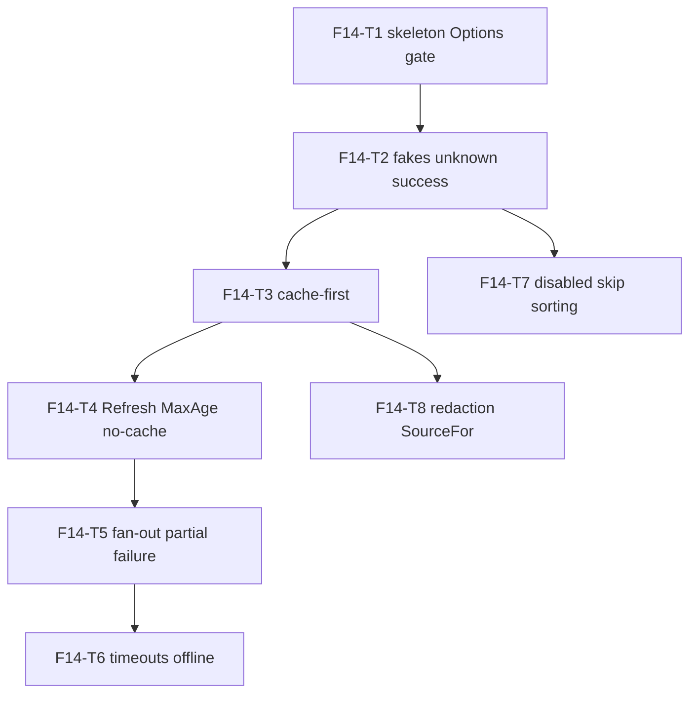

# F14 — Usage Fetch: Tasks

## Task graph

Every file in this package starts with `//go:build !nousage`. The canary token for this feature is `"canary-9f3a2b1c4d5e6f78"` (global SPEC §6 invariant 5). Tests never touch the real user cache dir: every test passes `Options.CacheDir: t.TempDir()` (SPEC D11). The global registry (F11) is shared: fakes use IDs unique to this feature (`fake-*`) and are registered once in `TestMain`.

## Task F14-T1: Skeleton — Options and the enable gate

**Depends on:** none (intra-feature). Feature depends on F04+F11+F12+F13 per `specs/DEPENDENCY-GRAPH.md` §2 (F11-T1/T4 must exist for `usage.Get`/`Snapshot`; F13-T1 for `cache.ErrCacheMiss`; F12-T1 for `credential.Warning`/`ErrNotFound`; F04's `httpkit` package is needed only so `MapError`'s defensive `httpkit.AsError` step compiles — F14 does NOT construct an httpkit client, see SPEC §12 / `specs/DEFERRED.md` D1).
**Files:**
- create `internal/usage/fetch/fetch.go`
- create `internal/usage/fetch/fetch_test.go`

**Spec references:** `specs/features/F14-usage-fetch/CONTRACTS.md §1`, `specs/features/F14-usage-fetch/SPEC.md §1–§2, D1`

**Instructions:**
1. Create `internal/usage/fetch/fetch.go` with `//go:build !nousage` then `package fetch`.
2. Declare `const DefaultTimeoutSec = 10 * time.Second` and `const DefaultMaxParallel = 8` (CONTRACTS §1).
3. Declare `type Options struct { Refresh bool; Offline bool; MaxAge time.Duration; ShowIdentity bool; Enabled map[string]bool; Timeout time.Duration; MaxParallel int; CacheDir string }` (CONTRACTS §1).
4. Declare `func FetchAll(ctx context.Context, providers []string, opts Options) ([]usage.Snapshot, []credential.Warning, error)`. For THIS task implement only the gate + degenerate paths: iterate `providers`; skip every provider not enabled (`opts.Enabled == nil || !opts.Enabled[id]` — SPEC D1); return `nil` results/warnings for the fully-filtered case. No registry lookup, no cache, no credentials, no fetch, no sorting yet.
5. Write `fetch_test.go` (tests first — they fail to compile until the package exists; TDD red step).

**Test cases (write these first):**

| # | input | want |
|---|---|---|
| 1 | `FetchAll(ctx, nil, Options{})` | `(nil, nil, nil)` — empty result, no error |
| 2 | `FetchAll(ctx, []string{}, Options{})` | `(nil, nil, nil)` |
| 3 | `FetchAll(ctx, []string{"fake-ok"}, Options{})` (Enabled nil) | empty slice (default-deny), nil error |
| 4 | `FetchAll(ctx, []string{"fake-ok"}, Options{Enabled: map[string]bool{}})` | empty slice |
| 5 | `FetchAll(ctx, []string{"fake-ok", "fake-fail"}, Options{Enabled: map[string]bool{"fake-fail": true}})` | exactly 1 result, `Provider == "fake-fail"` (gate applied per provider) |

**Acceptance criteria:**
- [ ] `go build ./internal/usage/fetch/...` succeeds
- [ ] `go test ./internal/usage/fetch/...` passes with the test cases above
- [ ] `fetch.go` starts with `//go:build !nousage`
- [ ] no file outside the Files list modified

## Task F14-T2: Test fakes, unknown providers, happy path

**Depends on:** F14-T1
**Files:**
- create `internal/usage/fetch/fakes_test.go`
- modify `internal/usage/fetch/fetch.go`
- modify `internal/usage/fetch/fetch_test.go`

**Spec references:** `specs/features/F14-usage-fetch/CONTRACTS.md §2`, `specs/features/F14-usage-fetch/SPEC.md §3–§4, D2, D3`, `specs/features/F11-usage-types/CONTRACTS.md §6` (`usage.Get`), `specs/features/F12-credentials/CONTRACTS.md §1`

**Instructions:**
1. Create `fakes_test.go` (no build tag; test file) with `TestMain(m *testing.M)` that calls `m.Run()` (the fakes are registered in package-level `init()` funcs instead — simplest: register inside `TestMain` before `m.Run()` so registration order is explicit). Register these descriptors (IDs unique to this feature; the global registry is shared with F11's tests):
   - `fake-ok`: Kind `KindSubscription`, `CacheTTL 300s`, `Timeout 5s`, no Auth, `Fetch` returns `Snapshot{Provider: "fake-ok", Windows: [1 window], Account: "acct", Plan: "pro"}` and calls `recordCall("fake-ok")`.
   - `fake-env`: `Auth: []usage.AuthSource{{Kind: usage.AuthEnvVar, EnvVar: "WHICH_MODEL_TEST_TOKEN"}}`, `CacheTTL 0`, `Fetch` returns a valid snapshot.
   - `fake-fail`: `CacheTTL 0`, `Fetch` returns `&usage.FailureError{Failure: usage.Failure{Code: "provider_status", Message: "boom"}}`.
   - `fake-slow`: `CacheTTL 0`, `Fetch` sleeps 300ms (recording concurrent-count high-water via `atomic.Int64`), returns a valid snapshot.
   - `fake-block`: `CacheTTL 0`, `Timeout 0`, `Fetch` blocks on `<-ctx.Done()` then returns `ctx.Err()`.
   - `fake-never`: `CacheTTL 300s`, `Fetch` PANICS (proves it is never invoked).
   - `fake-nocache`: `CacheTTL 0`, `Fetch` returns a valid snapshot and calls `recordCall("fake-nocache")`.
   - `fake-leak`: `Auth` env source (`WHICH_MODEL_TEST_TOKEN`), `CacheTTL 0`, `Fetch` returns `&usage.FailureError{Failure{Code: "provider_status", Message: "provider said " + cred.Token}}`.
   - `recordCall(id string)` appends to a `map[string][]time.Time` guarded by a mutex; helper `callCount(id)`.
   - Also a `newOptions(t)` helper: `Options{CacheDir: t.TempDir()}`.
2. In `fetch.go`, extend `FetchAll` past the gate: for each enabled provider, `usage.Get(id)`; on error → append `usage.Snapshot{Provider: id, Failure: usage.Failure{Code: "provider_status", Message: err.Error()}}` (SPEC §3). Build the shared client ONCE per call as a plain `client := &http.Client{}` — NO `Timeout` field (per-provider deadlines come from step T5's contexts; a client-level timeout truncates slow-but-valid providers, SPEC §12/D4), default transport. Pass it to `desc.Fetch`, which takes `*http.Client` per F11 `FetchFunc` (`specs/features/F11-usage-types/CONTRACTS.md §1`). For this task, run the remaining pipeline SEQUENTIALLY: if `len(desc.Auth) == 0` → `Fetch(ctx, usage.Credential{}, client)` (local-tool/presence providers need no credential; empty chain is not a ...
3. Write `MapError` (CONTRACTS §1): `usage.AsFailure` → its Failure; `httpkit.AsError(err)` → `usage.Failure{Code: e.Code, Message: e.Error()}`; `errors.Is(err, credential.ErrNotFound)` → `login_required`; `errors.Is(err, context.DeadlineExceeded)` → `timeout`; else `provider_status`.
4. Write `SourceFor` (CONTRACTS §1, SPEC §11): the full mapping table; fallback `SourceAPI`.
5. Add the test cases below to `fetch_test.go`. Set `WHICH_MODEL_TEST_TOKEN` with `t.Setenv` where needed.

**Test cases (write these first):**

| # | input | want |
|---|---|---|
| 1 | `FetchAll(ctx, []string{"does-not-exist"}, Options{Enabled: {"does-not-exist": true}})` | 1 snapshot, `Failure.Code == "provider_status"`, message contains the ID |
| 2 | same but with `fake-ok` also enabled | 2 snapshots; `fake-ok` one has `Failure.Code == ""` |
| 3 | `fake-ok` enabled | snapshot returned with `Provider == "fake-ok"`, `Windows` populated, `Source == SourceAPI` (empty chain → zero Credential → fallback), `Confidence == ""`, `Stale == false`, `err == nil` |
| 4 | `fake-env` enabled + token env set | `Source == SourceAPI`, `Confidence == ""` |
| 5 | `fake-env` enabled + token env NOT set | `Failure.Code == "login_required"`, no fetch (callCount("fake-env") == 0) |
| 6 | `fake-fail` enabled | `Failure.Code == "provider_status"`, `Failure.Message == "boom"`, `err == nil` (partial failure is data) |
| 7 | `MapError(context.DeadlineExceeded)` | `Failure{Code: "timeout"}` |
| 8 | `MapError(credential.ErrNotFound)` | `Failure{Code: "login_required"}` |

**Acceptance criteria:**
- [ ] `go build ./internal/usage/fetch/...` succeeds
- [ ] `go test ./internal/usage/fetch/...` passes
- [ ] `fakes_test.go` registers every fake exactly once (no duplicate-ID panic at test start)
- [ ] no file outside the Files list modified

## Task F14-T3: Cache-first reads and writes

**Depends on:** F14-T2
**Files:**
- modify `internal/usage/fetch/fetch.go`
- modify `internal/usage/fetch/fetch_test.go`

**Spec references:** `specs/features/F14-usage-fetch/CONTRACTS.md §2`, `specs/features/F14-usage-fetch/SPEC.md §4, §6, D3, D11`, `specs/features/F13-usage-cache/CONTRACTS.md §1`

**Instructions:**
1. In `fetch.go`, add a `store` construction: `dir := opts.CacheDir; if dir == "" { dir, err = cache.CacheDir(); ... }` → `store := &cache.Store{Dir: dir}` (SPEC D11). Handle `CacheDir()` error by failing the whole call (`err`).
2. Insert the cache step into the per-provider pipeline BEFORE credential resolution: if `!opts.Refresh && desc.CacheTTL > 0`: `ttl := cache.EffectiveTTL(desc.CacheTTL, opts.MaxAge)`; `snap, stale, rerr := store.Read(id, ttl)`; `rerr == nil && !stale` → stamp `Source = SourceCache`, `Confidence = "cached"`, `Stale = false` (SPEC §6), append, CONTINUE (no credential, no fetch — prove with `fake-never`). `errors.Is(rerr, cache.ErrCacheMiss)` or stale or any other read error → proceed to fetch path (SPEC §4a).
3. After a successful fetch: `werr := store.Write(id, snap)`; on error append `credential.Warning{Message: "failed to cache usage for provider " + id + ": " + werr.Error()}` (SPEC §9) and CONTINUE with the snapshot (never fail).
4. Write the test cases below. Seed cache entries with `(&cache.Store{Dir: opts.CacheDir}).Write(id, snap)` (F13's API) — T3's cases that "seed" do NOT go through FetchAll.

**Test cases (write these first):**

| # | input | want |
|---|---|---|
| 1 | seed fresh `fake-never` entry (`CacheTTL 300s`), enable `fake-never` | snapshot returned with `Source == SourceCache`, `Confidence == "cached"`, `Stale == false`; `callCount("fake-never") == 0` (no panic proves no fetch) |
| 2 | seed `fake-ok` entry, then call with `Options{MaxAge: time.Nanosecond}` (entry effectively stale) | refetched: `callCount("fake-ok") == 1`, returned `Source == SourceAPI` (live), cache file rewritten |
| 3 | `fake-ok` enabled, cache empty | fetch happened (`callCount == 1`), cache file `fake-ok.json` exists in `opts.CacheDir` after the call |
| 4 | case 3's cache file then `FetchAll` again | `callCount("fake-ok") == 1` total (second call served from cache) |
| 5 | `fake-nocache` (CacheTTL 0) enabled, after its fetch | no `fake-nocache.json` in the cache dir; fetch on every call (`callCount` grows) |
| 6 | cache file corrupt (write `"{"` over `fake-ok.json`) | refetch happens (`callCount` grows), no error |

**Acceptance criteria:**
- [ ] `go build ./internal/usage/fetch/...` succeeds
- [ ] `go test ./internal/usage/fetch/...` passes
- [ ] cache-hit no-network proof: case 1 uses a fake that would panic on fetch
- [ ] no file outside the Files list modified

## Task F14-T4: Refresh, MaxAge, uncached providers

**Depends on:** F14-T3
**Files:**
- modify `internal/usage/fetch/fetch.go`
- modify `internal/usage/fetch/fetch_test.go`

**Spec references:** `specs/features/F14-usage-fetch/CONTRACTS.md §1`, `specs/features/F14-usage-fetch/SPEC.md §4–§5`, `specs/features/F13-usage-cache/CONTRACTS.md §1` (`EffectiveTTL`)

**Instructions:**
1. In `fetch.go`, verify the T3 cache read already honors `opts.Refresh` (skip read when true) and `EffectiveTTL(desc.CacheTTL, opts.MaxAge)`; if not, wire both now (SPEC §4a).
2. Confirm `desc.CacheTTL == 0` skips BOTH read and write (already true from T3's instructions — add an explicit comment in code).
3. Add the test cases below.

**Test cases (write these first):**

| # | input | want |
|---|---|---|
| 1 | seed FRESH `fake-ok` entry; `Options{Refresh: true, Enabled: ...}` | `callCount("fake-ok") == 1` (refresh bypasses fresh cache), cache file rewritten |
| 2 | seed fresh `fake-ok`; `Options{MaxAge: time.Nanosecond}` | refetch (`callCount == 1`) — max-age makes the entry stale |
| 3 | seed fresh `fake-ok`; `Options{MaxAge: time.Hour}` | served from cache (`callCount == 0`), `Confidence == "cached"` |
| 4 | `fake-ok` with `CacheTTL 300s` and a fresh seed; `Options{MaxAge: 0, Refresh: false}` | served from cache (control case) |
| 5 | `fake-nocache` (CacheTTL 0) + fresh seed written manually | refetched (`callCount grows`), no `fake-nocache.json` exists |

**Acceptance criteria:**
- [ ] `go build ./internal/usage/fetch/...` succeeds
- [ ] `go test ./internal/usage/fetch/...` passes
- [ ] no file outside the Files list modified

## Task F14-T5: Fan-out, partial failure, concurrency cap, scrubbing

**Depends on:** F14-T4
**Files:**
- modify `internal/usage/fetch/fetch.go`
- create `internal/usage/fetch/fanout_test.go`

**Spec references:** `specs/features/F14-usage-fetch/CONTRACTS.md §1`, `specs/features/F14-usage-fetch/SPEC.md §8–§9, D6, D8`, `docs/plan/annex-a-provider-matrix.md` §6

**Instructions:**
1. In `fetch.go`, replace the sequential per-provider loop with fan-out:
   - `g, gctx := errgroup.WithContext(ctx)` (import `golang.org/x/sync/errgroup`; add the module to `go.mod` via `go get` only if not already present).
   - Active list = enabled providers that passed the gate AND are known (`usage.Get` first — unknown providers are handled BEFORE spawning, still deterministic).
   - `limit := opts.MaxParallel; if limit <= 0 { limit = min(len(active), DefaultMaxParallel) }`; `g.SetLimit(limit)`.
   - Each provider runs a closure that NEVER returns an error: it pushes its `usage.Snapshot` into a buffered channel (cap `len(active)`) — the T2/T3/T4 pipeline body becomes this closure. Resolver/warning aggregation: append warnings to a mutex-guarded per-provider slice.
   - `g.Wait()`; `gctx.Err() != nil && err != nil` (shared cancellation) → return partial snapshots collected so far + warnings + `err`.
2. Scrubbing (SPEC §9): in the failure path of the per-provider closure, after `MapError`, replace every occurrence of `cred.Token` and each `cred.Extra` value in `failure.Message` with `<redacted>` (strings.ReplaceAll; token first). Apply in ALL places a Failure is built from an error that could carry the credential (fetch errors AND resolver hard errors).
3. Add `fanout_test.go`:
   - `fake-fail` among `fake-ok` + `fake-slow` → all three snapshots present, `err == nil`, the failed one has `Failure.Code == "provider_status"`.
   - Concurrency cap: enable `fake-slow` × 4 (register one more descriptor in `fakes_test.go`? NO — reuse `fake-slow` with 4 different IDs is impossible without duplicates; instead enable the SAME id once — so register `fake-slow2`, `fake-slow3`, `fake-slow4` in `fakes_test.go` now, same Fetch as `fake-slow`, all `CacheTTL 0`), `MaxParallel: 2` → high-water concurrent counter ≤ 2 and elapsed ≥ 600ms (4 × 300ms / 2).
   - Scrub: `fake-leak` enabled with token env = canary → returned Failure.Message contains `<redacted>` and NOT the canary.
   - Cache-write-failure warning: `Options{CacheDir: <chmod 0500 dir>}` + `fake-ok` → snapshot returned, warnings contain `"failed to cache usage"`, `err == nil`. (chmod the dir back to 0700 in a cleanup so `t.TempDir` can remove it.)
   - Warnings appear in provider-sorted order (assert relative order of warning messages for `fake-ok` vs a second failing writer).

**Test cases (write these first):**

| # | input | want |
|---|---|---|
| 1 | enable `fake-ok`, `fake-fail`, `fake-slow` | 3 snapshots; `Failure.Code` of `fake-fail` == `provider_status`; `err == nil` |
| 2 | enable `fake-slow` + `fake-slow2` + `fake-slow3` + `fake-slow4`, `MaxParallel: 2` | max concurrent ≤ 2; elapsed ≥ 600ms |
| 3 | `MaxParallel: 0` with 4 slow fakes | default cap 8 → all run concurrently (max concurrent ≤ 4; elapsed < 600ms) |
| 4 | `fake-leak` + env canary token | Failure.Message contains `<redacted>`, NOT `canary-9f3a2b1c4d5e6f78` |
| 5 | `fake-ok` + read-only cache dir | snapshot returned; 1 warning containing `failed to cache usage`; `err == nil` |
| 6 | ctx cancelled mid-batch (`ctx, cancel := context.WithCancel`; cancel after first slow result is observed via a callback channel — simplest: cancel immediately; the batch is fast) | returns with `err != nil` (context.Canceled) and possibly partial results — assert `err == context.Canceled` |

**Acceptance criteria:**
- [ ] `go build ./internal/usage/fetch/...` succeeds
- [ ] `go test ./internal/usage/fetch/...` passes
- [ ] canary-token criterion: case 4 proves the fetch layer scrubs leaked tokens from Failure.Message
- [ ] no file outside the Files list modified

## Task F14-T6: Per-provider timeouts and offline mode

**Depends on:** F14-T5
**Files:**
- modify `internal/usage/fetch/fetch.go`
- create `internal/usage/fetch/timeout_offline_test.go`

**Spec references:** `specs/features/F14-usage-fetch/CONTRACTS.md §1`, `specs/features/F14-usage-fetch/SPEC.md §5, §7, D4, D5`, `docs/plan/annex-d-cli-reference.md` §1

**Instructions:**
1. In `fetch.go`, inside each per-provider closure: `timeout := opts.Timeout; if timeout <= 0 { timeout = desc.Timeout }; if timeout <= 0 { timeout = DefaultTimeoutSec }`; `pctx, cancel := context.WithTimeout(gctx, timeout)`; use `pctx` for ResolveChain AND `desc.Fetch` (SPEC §5). `context.DeadlineExceeded` (from `MapError`) → `timeout` Failure.
2. Offline mode (SPEC §7): at the TOP of the closure, `if opts.Offline { snap := store.OfflineRead(id, ttl)` where `ttl = EffectiveTTL(desc.CacheTTL, opts.MaxAge)`; if `snap.Failure.Code != ""` → that snapshot (fallback_unavailable passes through); else stamp `Source = SourceCache`, `Confidence = "cached"` (Stale as returned); return. No credentials, no fetch, no writes — `fake-never` proves it. `Refresh` is ignored when Offline (SPEC D5).
3. Write `timeout_offline_test.go`:
   - `fake-block` with `desc.Timeout 50ms` → Failure.Code `timeout`, wall time < 2s.
   - `fake-block` + `opts.Timeout: 100ms` (desc.Timeout 0) → `timeout`.
   - Mixed: `fake-slow` (300ms) + `fake-ok` (instant) → both snapshots present; elapsed < 2s proves the slow one didn't block the batch.
   - Offline + fresh cache (`fake-ok` seeded) → served, `Source == "cache"`, `Confidence == "cached"`, `callCount("fake-ok") == 0`.
   - Offline + missing cache → `Failure.Code == "fallback_unavailable"`.
   - Offline + stale cache (MaxAge 1ns seed) → `Stale == true`, `Source == "cache"`.

**Test cases (write these first):**

| # | input | want |
|---|---|---|
| 1 | `fake-block` (Timeout 50ms) enabled | `Failure.Code == "timeout"`; elapsed < 2s |
| 2 | `fake-block` + `Options{Timeout: 100ms}` | `Failure.Code == "timeout"` |
| 3 | `fake-slow` + `fake-ok` enabled | 2 snapshots, both valid; elapsed < 2s |
| 4 | offline + fresh `fake-ok` seed | `Source == SourceCache`, `Confidence == "cached"`, `callCount == 0` |
| 5 | offline + no seed for `fake-nocache` | `Failure.Code == "fallback_unavailable"` |
| 6 | offline + stale seed (MaxAge 1ns) | `Stale == true`, `Failure.Code == ""` |

**Acceptance criteria:**
- [ ] `go build ./internal/usage/fetch/...` succeeds
- [ ] `go test ./internal/usage/fetch/...` passes
- [ ] offline-read-only: case 4–6 pass without any cache file being created by FetchAll (assert dir listing unchanged)
- [ ] no file outside the Files list modified

## Task F14-T7: Disabled short-circuit and sorted results

**Depends on:** F14-T2
**Files:**
- modify `internal/usage/fetch/fetch.go`
- create `internal/usage/fetch/order_test.go`

**Spec references:** `specs/features/F14-usage-fetch/CONTRACTS.md §1`, `specs/features/F14-usage-fetch/SPEC.md §2, §8, D7`

**Instructions:**
1. In `fetch.go`, ensure results are sorted by `Provider` ID ascending before return (`sort.Slice` on the collected slice; SPEC D7). Unknown-provider snapshots participate in the sort too.
2. Verify the gate runs before EVERYTHING (cache, credentials, fetch) — it already does from T1; add a code comment: `// L1a gate: skipped providers are never touched (cache/credential/fetch) — SPEC D1`.
3. Write `order_test.go`:

**Test cases (write these first):**

| # | input | want |
|---|---|---|
| 1 | enable `fake-never` via `Enabled` but request `["fake-ok", "fake-never"]` with `fake-never` NOT in Enabled | result has only `fake-ok`; no panic (fake-never's Fetch would panic — proves short-circuit) |
| 2 | request `["fake-slow2", "fake-ok", "fake-slow"]` all enabled | result IDs sorted: `[fake-ok, fake-slow, fake-slow2]` |
| 3 | request `["zz-unknown", "fake-ok"]` (unknown enabled) | sorted: `[fake-ok, zz-unknown]`; unknown has `provider_status` |
| 4 | same call twice with `MaxParallel 1` | identical ID sequence both times (determinism under serialization) |
| 5 | `fake-ok` + `fake-fail` + `fake-slow`, `MaxParallel 1` | all 3 present, sorted, `err == nil` |

**Acceptance criteria:**
- [ ] `go build ./internal/usage/fetch/...` succeeds
- [ ] `go test ./internal/usage/fetch/...` passes
- [ ] no file outside the Files list modified

## Task F14-T8: Identity redaction and Source mapping

**Depends on:** F14-T2, F14-T3
**Files:**
- modify `internal/usage/fetch/fetch.go`
- create `internal/usage/fetch/identity_test.go`

**Spec references:** `specs/features/F14-usage-fetch/CONTRACTS.md §1`, `specs/features/F14-usage-fetch/SPEC.md §10–§11, D9, D10`, `docs/plan/annex-d-cli-reference.md` §1 (`--show-identity`)

**Instructions:**
1. In `fetch.go`, after collection AND after cache writes, apply redaction to the RETURNED snapshots only: if `!opts.ShowIdentity`, set `Account = ""` and `Plan = ""` on every snapshot in the result slice (live, cached, offline alike; SPEC §10). The cache files keep full identity (write happened before redaction).
2. `SourceFor` is already implemented (T2); verify its table and add a code comment naming the canonical mapping.
3. Write `identity_test.go`:

**Test cases (write these first):**

| # | input | want |
|---|---|---|
| 1 | `fake-ok` enabled, `ShowIdentity` false (default) | returned `Account == ""`, `Plan == ""`; cache file `fake-ok.json` still contains `"acct"` (decode the file directly) |
| 2 | `fake-ok` enabled, `ShowIdentity: true` | returned `Account == "acct"`, `Plan == "pro"` |
| 3 | fresh cached `fake-ok` seed (cache contains acct/pro), `ShowIdentity` false | returned cleared; cache intact |
| 4 | offline + fresh seed, `ShowIdentity` false | returned cleared |
| 5 | `SourceFor(Credential{Source: AuthEnvVar}, KindSubscription)` | `SourceAPI` |
| 6 | `SourceFor(Credential{Source: AuthFile}, ...)` | `SourceAPI` |
| 7 | `SourceFor(Credential{Source: AuthKeychainGeneric}, ...)` | `SourceAPI` |
| 8 | `SourceFor(Credential{Source: AuthOAuthDeviceFlow}, ...)` | `SourceOAuth` |
| 9 | `SourceFor(Credential{Source: AuthCLIShellOut}, ...)` | `SourceCLI` |
| 10 | `SourceFor(Credential{Source: AuthBrowserCookie}, ...)` | `SourceWeb` |
| 11 | `SourceFor(usage.Credential{}, KindLocalTool)` | `SourceLocal` |
| 12 | `SourceFor(usage.Credential{}, KindGateway)` (zero credential, unknown fallback) | `SourceAPI` |

**Acceptance criteria:**
- [ ] `go build ./internal/usage/fetch/...` succeeds
- [ ] `go test ./internal/usage/fetch/...` passes (full F14 suite)
- [ ] redaction timing: case 1 proves cache retains identity while output is cleared
- [ ] final: `go test ./internal/usage/fetch/...` green and `go build ./internal/usage/...` green
