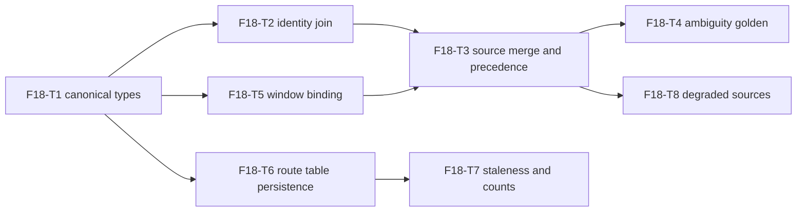

# F18-routing — Routing Join: Tasks

## Task graph



## Task F18-T1: Declare the canonical Route and Provenance types

**Depends on:** none
**Files:**
- create `internal/routing/types.go`
- create `internal/routing/types_test.go`

**Spec references:** `specs/global/CONTRACTS.md §3.1` (verbatim types), `specs/features/F18-routing/SPEC.md §2.1`, `specs/features/F18-routing/CONTRACTS.md §2`

**Instructions:**
1. Write `internal/routing/types_test.go` FIRST. It references `routing.Route`, `routing.ProvenanceProviderLive`, `routing.ProvenanceModelsDev`, `routing.ProvenanceUserDeclared`, and `encoding/json` round-trips of `Route`. Run `go test ./internal/routing/...` — it must fail to compile (the package does not exist yet).
2. Create `internal/routing/types.go` with `package routing` and copy the `Route` struct and the three `Provenance` constants VERBATIM from `specs/global/CONTRACTS.md §3.1`, including the JSON tags. No field, constant, or tag may be added or renamed.
3. Run `go test ./internal/routing/...` — all cases pass.

**Test cases (write these first):**

| # | input | want |
|---|---|---|
| 1 | `ProvenanceProviderLive` | string value `"provider_live"` |
| 2 | `ProvenanceModelsDev` | string value `"models_dev"` |
| 3 | `ProvenanceUserDeclared` | string value `"user_declared"` |
| 4 | `json.Marshal` a fully populated `Route` | JSON object keys exactly `provider`, `model_id`, `model`, `reasoning`, `window_ids`, `provenance` |
| 5 | `json.Unmarshal` the JSON from case 4 | `Route` deep-equal to the original; `WindowIDs` order preserved |
| 6 | `json.Unmarshal` `{"provider":"claude","model_id":"m","model":"M","reasoning":"default","window_ids":null,"provenance":"models_dev"}` | `WindowIDs` is nil, not an empty non-nil slice |

**Acceptance criteria:**
- [ ] `go build ./internal/routing/...` succeeds
- [ ] `go test ./internal/routing/...` passes with the test cases above
- [ ] no file outside the Files list modified
- [ ] `Route` and `Provenance` are byte-identical to `specs/global/CONTRACTS.md §3.1`

## Task F18-T2: Join provider-native models to catalog identities

**Depends on:** F18-T1
**Files:**
- create `internal/routing/build.go`
- create `internal/routing/build_test.go`

**Spec references:** `specs/features/F18-routing/SPEC.md §2.6, §2.7, §2.8`, `specs/features/F18-routing/CONTRACTS.md §3`, `specs/features/F07-identity/CONTRACTS.md §2` (package `internal/catalog/identity`), `docs/plan/annex-b-catalog-port.md §7.1` steps 3-4

**Instructions:**
1. Write `internal/routing/build_test.go` FIRST (table tests for `joinModel` and `(*AmbiguityError).Error`). Run `go test ./internal/routing/...` — it must fail to compile.
2. In `internal/routing/build.go`: `package routing`; import `github.com/WD-Mitchell/which-model/internal/catalog/identity` and `github.com/WD-Mitchell/which-model/internal/usage` (types only).
3. Declare EXACTLY these types, signatures verbatim from `specs/features/F18-routing/CONTRACTS.md §3`:

```go
type ModelEntry struct {
    ModelID   string
    Name      string
    Reasoning []string
}
type UserDeclaredRoute struct {
    Provider  string
    ModelID   string
    Model     string
    Reasoning string
    WindowIDs []string
}
type ProviderInput struct {
    Provider         string
    Kind             usage.Kind
    ModelsDev        []ModelEntry
    LiveModels       []ModelEntry
    UserDeclared     []UserDeclaredRoute
    ExcludedModelIDs []string
    Windows          []usage.WindowSpec
}
type Input struct {
    Providers   []ProviderInput
    CatalogRows []identity.Identity
    Degraded    bool
}
type UnroutedModel struct {
    Provider  string
    ModelID   string
    Name      string
    Reasoning string
    Reason    string
}
type BuildResult struct {
    Routes   []Route
    Unrouted []UnroutedModel
    Warnings []string
    Errors   map[string]error
}
type AmbiguityError struct {
    Provider   string
    ModelID    string
    Name       string
    Candidates []identity.Identity
}
```

4. Implement the join core:

```go
type joinedLevel struct {
    level string
    row   identity.Identity
}

// joinModel classifies one provider-native model against the catalog.
func joinModel(entry ModelEntry, rows []identity.Identity) (levels []joinedLevel, candidates []identity.Identity, unmatched []string)
```

Algorithm, exactly:
- `declared` = `entry.Reasoning`; when it is empty, use the single level `"default"`.
- `clean` = `identity.CleanModelName(entry.Name)`.
- `candidates` = every row in `rows` (order preserved) whose `identity.CleanModelName(row.Model) == clean`.
- For each level in `declared`, in order: `collapsed` = `identity.CollapseReasoning(level)`; find the first row whose cleaned Model equals `clean` AND `identity.CollapseReasoning(row.Reasoning) == collapsed`. Found -> append `joinedLevel{level, row}`; not found -> append the level to `unmatched`. Distinct levels may match the same row (e.g. declared `["default","high"]` both collapse to `high`); each yields its own `joinedLevel`.
- The `candidates` return value always holds EVERY cleaned-name match in catalog order. `joinModel` does not decide whether that set is ambiguous; `ProduceRoutes` applies the source-capability rule in F18-T3. When `entry.Reasoning` is empty and exactly one candidate exists but `"default"` does not match its reasoning, append `joinedLevel{candidate.Reasoning, candidate}` and clear `unmatched`: the sole identity is deterministic.
- The ordinary non-reasoning default route remains unchanged: `entry.Reasoning` empty uses `declared == ["default"]`, and `CollapseReasoning("default") == "high"` matches a catalog `"high"` row (SPEC §2.6).

5. Implement the error text, exact format from `specs/features/F18-routing/CONTRACTS.md §3`:

```go
func (e *AmbiguityError) Error() string
```

Format: `ambiguous route for %s/%s: %s matches catalog identities [%s] that declared effort levels cannot disambiguate; add a manual override in routes.toml` — provider, modelID, cleaned name, then each candidate rendered as `(<Model>, <Reasoning>)` joined by `", "`.

6. Run `go test ./internal/routing/...` — all cases pass.

**Test cases (write these first):** `entry` has `ModelID:"m1"` unless stated; `rows` are already-cleaned catalog identities.

| # | input | want |
|---|---|---|
| 1 | `entry{Name:"Claude Opus 5", Reasoning:nil}`, rows `[(Claude Opus 5, high)]` | levels `[{default, (Claude Opus 5, high)}]`, candidates `[(Claude Opus 5, high)]`, unmatched `[]` |
| 2 | `entry{Name:"Claude Opus 5 (2025-11-01)", Reasoning:nil}`, rows `[(Claude Opus 5, high)]` | same as case 1 (name cleaned by `CleanModelName`) |
| 3 | `entry{Reasoning:[low,medium,high]}`, rows `(x,low),(x,medium),(x,high)` | levels in declaration order low, medium, high; candidates all three; unmatched `[]` |
| 4 | `entry{Reasoning:[low,medium,high]}`, rows `(x,low),(x,high)` | levels low then high; unmatched `[medium]`; not ambiguous |
| 5 | `entry{Reasoning:nil}`, rows `(x,low),(x,medium),(x,high)` | level `default` matched to high; candidates all three (F18-T3 classifies the effort-less multi-candidate result as ambiguous) |
| 6 | `entry{Reasoning:[low,high]}`, rows `(x,low),(x,medium),(x,high)` | levels low, high; candidates all three; explicit efforts select those two identities and medium is outside provider capability |
| 7 | `entry{Reasoning:["default"]}`, rows `[(x, high)]` | levels `[{default, (x, high)}]` (collapse `default`→`high`), candidates `[(x, high)]`, unmatched `[]` |
| 8 | `entry{Reasoning:nil}`, rows `[]` | levels `[]`, candidates `[]`, unmatched `[default]` (absent) |
| 9 | `entry{Reasoning:[low]}`, rows `[(x, medium)]` | levels `[]`, candidates `[(x, medium)]`, unmatched `[low]` (absent declared level, not ambiguity) |
| 10 | `entry{Reasoning:nil}`, rows `[(y, low), (x, xhigh)]` with `y != x` | candidates `[(x, xhigh)]` only; levels `[{xhigh, (x, xhigh)}]`; unmatched `[]` |

**Acceptance criteria:**
- [ ] `go build ./internal/routing/...` succeeds
- [ ] `go test ./internal/routing/...` passes with the test cases above
- [ ] no file outside the Files list modified
- [ ] type declarations match `specs/features/F18-routing/CONTRACTS.md §3` verbatim

## Task F18-T3: ProduceRoutes — merge sources with precedence, eligibility, exclusion

**Depends on:** F18-T2, F18-T5
**Files:**
- extend `internal/routing/build.go` (add `ProduceRoutes`)
- create `internal/routing/produce_test.go`

**Spec references:** `specs/features/F18-routing/SPEC.md §2.3, §2.4, §2.5, §2.8, §2.10, §3`, `specs/features/F18-routing/CONTRACTS.md §3`, `docs/plan/annex-b-catalog-port.md §7.1` steps 1-5

**Instructions:**
1. Write `internal/routing/produce_test.go` FIRST (table tests calling `ProduceRoutes`). Run `go test ./internal/routing/...` — it must fail to compile.
2. Implement in `internal/routing/build.go`:

```go
// ProduceRoutes derives the route table for every configured provider.
func ProduceRoutes(in Input) (BuildResult, error)
```

Follow this recipe exactly:
- `result := BuildResult{}` (no `Errors` entry yet).
- For each provider in `in.Providers` order:
  - `excluded` = set of `ExcludedModelIDs`. `seen` = map `ModelID -> struct{ entry ModelEntry; src Provenance }`; `order` = `[]string` of first-appearance order.
  - Pass 1 — collect auto sources: iterate `ModelsDev` in order, then `LiveModels` in order. For each entry: if `ModelID` is in `excluded`, skip. If already in `seen`: when the existing source is `ProvenanceModelsDev` and the new entry comes from `LiveModels`, upgrade the entry's source to `ProvenanceProviderLive` (position unchanged); otherwise keep the existing entry. Else record first appearance: append to `order`, store `{entry, src}` with `src = ProvenanceModelsDev` for the models.dev list and `ProvenanceProviderLive` for the live list. Same-source duplicates dedupe silently (first wins).
  - Pass 2 — derive: `providerErr := error(nil)`; `autoRoutes := []Route{}`; `providerUnrouted := []UnroutedModel{}`. For each `modelID` in `order`:
    - `levels, candidates, unmatched := joinModel(seen[modelID].entry, in.CatalogRows)`; `clean := identity.CleanModelName(seen[modelID].entry.Name)`.
    - `len(candidates) == 0` (absent, SPEC §2.7): append `UnroutedModel{Provider, modelID, clean, "", "no_catalog_row"}` and the warning `unrouted provider model <provider>/<modelID> (<clean>): no catalog row matches`; continue.
    - ambiguous: only when `entry.Reasoning` is empty and fewer same-name candidates are covered than matched; set `providerErr = &AmbiguityError{Provider, modelID, clean, candidates}` and BREAK out of pass 2 (this provider's auto routes so far are discarded — SPEC §2.8). Explicit declared efforts select their matching identities; undeclared score efforts are not provider candidates.
    - else: for each `joinedLevel` in `levels`: append `Route{Provider, modelID, clean, level, BindWindowIDs(provider.Windows, modelID, clean), seen[modelID].src}`.
    - for each level in `unmatched`: append `UnroutedModel{Provider, modelID, clean, level, "no_catalog_row"}` and the warning `unrouted provider model <provider>/<modelID> (<clean>, <level>): no catalog row matches`.
  - Pass 3 — user-declared (SPEC §2.3 precedence, §2.10): iterate `provider.UserDeclared` in order. `declaredSeen` = set of `(Provider, ModelID)`. Duplicate -> warning `duplicate user-declared route for <provider>/<modelID>; keeping first` and skip. Else: `windows := declared.WindowIDs`; when empty, `windows = BindWindowIDs(provider.Windows, declared.ModelID, declared.Model)`; append `Route{Provider, declared.ModelID, declared.Model, declared.Reasoning, windows, ProvenanceUserDeclared}` to `declaredRoutes`.
  - Emit: if `providerErr != nil` -> `result.Errors[provider.Provider] = providerErr` (auto routes dropped). Else append `autoRoutes` then `declaredRoutes` to `result.Routes`. Append `providerUnrouted` to `result.Unrouted`.
- Return value: track the FIRST `providerErr` encountered in provider order; return it as the `error` result when non-nil, else nil.
- Warning strings and the `AmbiguityError.Error()` format are exactly as in `specs/features/F18-routing/CONTRACTS.md §3`.
3. Run `go test ./internal/routing/...` — all cases pass.

**Test cases (write these first):** every provider is `KindSubscription` unless stated; give providers a minimal `Windows` list only when a case asserts `WindowIDs`.

| # | input | want |
|---|---|---|
| 1 | one provider, `ModelsDev [m1]` (name `"M1"`), `CatalogRows [(M1, high)]`, no declared | 1 route `{provider, m1, M1, default, len(WindowIDs)==0, models_dev}` |
| 2 | same model `m1` in `ModelsDev` and `LiveModels` | 1 route for `m1`, provenance `provider_live` |
| 3 | same model `m1` in `UserDeclared`, `LiveModels`, and `ModelsDev` | 1 route for `m1`, provenance `user_declared` |
| 4 | model `m2` only in `LiveModels` (catalog match exists) | routed, provenance `provider_live` |
| 5 | `ExcludedModelIDs [m1]`, `m1` in both auto sources | no route for `m1` |
| 6 | `ExcludedModelIDs [m1]` plus `UserDeclared` entry for `m1` | declared route present, provenance `user_declared` |
| 7 | gateway-kind provider (`KindGateway`) with `ModelsDev` | no auto routes; its `UserDeclared` entries kept |
| 8 | two identical `UserDeclared` entries for `(p, m1)` | 1 declared route; a warning containing `duplicate user-declared` |
| 9 | provider A (`ModelsDev [m1, m2]`), provider B (`ModelsDev [m3]`), all matched | route order: A's `m1`, `m2`, then B's `m3` |
| 10 | `Input{}` (no providers, no rows) | empty result, nil error, nil `Errors` |
| 11 | provider A ambiguous (its model `m2`'s cleaned name matches two catalog rows, no declared levels), provider B clean | error non-nil and an `*AmbiguityError` for A; `Errors` has A; A's auto routes absent; B's routes present; A's `UserDeclared` routes present |
| 12 | provider `opencode` model `kimi-k3` declares `[max]`, catalog rows are `(Kimi K3, low)` and `(Kimi K3, max)` | one `max` route, nil error; the undeclared `low` score identity is not ambiguous |
| 13 | effort-less model has exactly one same-name catalog row at `xhigh` | one route carrying `xhigh`, nil error |

**Acceptance criteria:**
- [ ] `go build ./internal/routing/...` succeeds
- [ ] `go test ./internal/routing/...` passes with the test cases above
- [ ] no file outside the Files list modified
- [ ] `go test ./internal/routing/... -run TestProduceRoutes` passes twice in a row (deterministic order)

## Task F18-T4: Ambiguity golden test — fail loud, list both candidates

**Depends on:** F18-T3
**Files:**
- create `internal/routing/ambiguity_test.go`
- create `internal/routing/testdata/ambiguity.golden`

**Spec references:** `specs/features/F18-routing/SPEC.md §2.8, §3`, `specs/features/F18-routing/CONTRACTS.md §3`, `docs/plan/annex-b-catalog-port.md §7.1` step 4

**Instructions:**
1. Create `internal/routing/testdata/ambiguity.golden` containing EXACTLY this text (with a trailing newline):

```
ambiguous route for anthropic/claude-opus-4-5-20251101: Claude Opus 5 matches catalog identities [(Claude Opus 5, low), (Claude Opus 5, medium), (Claude Opus 5, high)] that declared effort levels cannot disambiguate; add a manual override in routes.toml
```

2. Write `internal/routing/ambiguity_test.go`. Canonical fixture: provider `"anthropic"`, `KindSubscription`, `ModelsDev` = `[{ModelID: "claude-opus-4-5-20251101", Name: "Claude Opus 5", Reasoning: nil}]`, `CatalogRows` = `[(Claude Opus 5, low), (Claude Opus 5, medium), (Claude Opus 5, high)]`. Compare `err.Error()` to `strings.TrimSpace(string(goldenBytes))` read from `testdata/ambiguity.golden`.
3. Run `go test ./internal/routing/...` — all cases pass.

**Test cases (write these first):**

| # | input | want |
|---|---|---|
| 1 | `ProduceRoutes` on the fixture | error non-nil, type `*AmbiguityError` |
| 2 | `err.Error()` | byte-equal to `testdata/ambiguity.golden` (after `TrimSpace`) |
| 3 | error fields | `Provider == "anthropic"`, `ModelID == "claude-opus-4-5-20251101"`, `Name == "Claude Opus 5"`, `len(Candidates) == 3` in catalog order |
| 4 | fixture plus one `UserDeclared` route for a different model id | `Routes` contains only the declared route (no auto routes for the provider) |
| 5 | two providers, both ambiguous | `len(Errors) == 2`; the returned error is the FIRST provider's |
| 6 | fixture only | `len(result.Errors) == 1`, keyed `"anthropic"` |
| 7 | fixture plus a `UserDeclared` entry for `claude-opus-4-5-20251101` | error nil; the declared route present with provenance `user_declared` (the override resolves the ambiguity) |
| 8 | fixture only | `Unrouted` contains no entry for the ambiguous model (ambiguity is not absence) |

**Acceptance criteria:**
- [ ] `go test ./internal/routing/...` passes with the test cases above
- [ ] no file outside the Files list modified
- [ ] golden file matches the exact format formula in `specs/features/F18-routing/CONTRACTS.md §3`

## Task F18-T5: Bind gating windows per model scope

**Depends on:** F18-T1
**Files:**
- create `internal/routing/windows.go`
- create `internal/routing/windows_test.go`

**Spec references:** `specs/features/F18-routing/SPEC.md §2.9, §2.10`, `specs/features/F18-routing/CONTRACTS.md §4`, `docs/plan/annex-b-catalog-port.md §7.3`, `specs/features/F11-usage-types/CONTRACTS.md` (`usage.WindowSpec`, file `internal/usage/descriptor.go`)

**Instructions:**
1. Write `internal/routing/windows_test.go` FIRST. Run `go test ./internal/routing/...` — it must fail to compile.
2. Create `internal/routing/windows.go` with the exact signature from `specs/features/F18-routing/CONTRACTS.md §4`:

```go
func BindWindowIDs(providerWindows []usage.WindowSpec, modelID, model string) []string
```

Algorithm, exactly:
- Iterate `providerWindows` in declaration order. A window with `len(ws.ModelScope) == 0` is account-level: append `ws.ID` unconditionally.
- A window with a non-empty `ModelScope` is model-scoped: append `ws.ID` iff at least one scope entry matches. An entry `e` matches when `strings.EqualFold(e, modelID)` OR `strings.EqualFold(e, model)` OR `e` is a case-insensitive substring of `modelID` OR of `model` (implement with `strings.Contains(strings.ToLower(haystack), strings.ToLower(e))`).
- Deduplicate the result, keeping first occurrences (account-level windows stay first, then matched scoped windows, both in declaration order — SPEC §2.9).
3. Run `go test ./internal/routing/...` — all cases pass.

**Test cases (write these first):**

| # | input | want |
|---|---|---|
| 1 | windows `[{5h, scope nil}, {weekly, nil}]`, any model | `[5h, weekly]` |
| 2 | windows `[{5h, nil}, {opus_7d, [opus]}]`, modelID `claude-opus-4-5-20251101` | `[5h, opus_7d]` |
| 3 | windows `[{5h, nil}, {sonnet_7d, [sonnet]}]`, modelID `claude-opus-4-5-20251101` | `[5h]` (no scoped match) |
| 4 | windows `[{opus_7d, ["opus 5"]}]`, model `Claude Opus 5` (empty modelID) | `[opus_7d]` (substring match on Model) |
| 5 | windows `[{opus_7d, [OPUS]}]`, modelID `claude-opus-4-5-20251101` | `[opus_7d]` (case-insensitive) |
| 6 | windows `[{opus_7d, [claude-opus-4-5-20251101]}]`, exact modelID | `[opus_7d]` (exact match) |
| 7 | windows `[{a, [opus]}, {b, [opus]}]`, Opus modelID | `[a, b]` (all matches) |
| 8 | windows `[{opus_7d, [opus]}, {5h, nil}]`, Opus modelID | `[5h, opus_7d]` (account-level first despite declaration order) |
| 9 | windows `[{5h, nil}, {5h, nil}]` | `[5h]` (deduplicated) |
| 10 | windows `[]` | empty result (nil or len 0) |

**Acceptance criteria:**
- [ ] `go build ./internal/routing/...` succeeds
- [ ] `go test ./internal/routing/...` passes with the test cases above
- [ ] no file outside the Files list modified
- [ ] matches the annex-b §7.3 Claude example `["5h", "sevenDayOpus"]`

## Task F18-T6: Persist the route table atomically

**Depends on:** F18-T1
**Files:**
- create `internal/routing/store.go`
- create `internal/routing/store_test.go`

**Spec references:** `specs/features/F18-routing/SPEC.md §2.11`, `specs/features/F18-routing/CONTRACTS.md §5, §6`

**Instructions:**
1. Write `internal/routing/store_test.go` FIRST. Run `go test ./internal/routing/...` — it must fail to compile.
2. Create `internal/routing/store.go` with the exact declarations from `specs/features/F18-routing/CONTRACTS.md §5`:

```go
const TableSchemaVersion = "1.0"

type Table struct {
    SchemaVersion string            `json:"schema_version"`
    ScoresHash    string            `json:"scores_sha256"`
    RefreshedAt   map[string]string `json:"refreshed_at"`
    Routes        []Route           `json:"routes"`
}

func SaveTable(path string, t Table) error
func LoadTable(path string) (Table, error)
```

`SaveTable`: `os.MkdirAll(filepath.Dir(path), 0o755)`; `os.CreateTemp(filepath.Dir(path), ".routes-*.tmp")`; write `json.MarshalIndent(t, "", "  ")`; close; `os.Rename(tmpPath, path)`. On any error, remove the temp file if it still exists and return the error.
`LoadTable`: `os.ReadFile(path)`; a read error is returned as-is (so `os.IsNotExist(err)` works); `json.Unmarshal` failures are wrapped as `fmt.Errorf("routes: corrupt table %s: %w", path, err)`.
3. Run `go test ./internal/routing/...` — all cases pass. Use `t.TempDir()` for all file paths.

**Test cases (write these first):**

| # | input | want |
|---|---|---|
| 1 | `SaveTable` then `LoadTable` a table with 2 routes and `RefreshedAt` for 2 providers | deep-equal `Table` (all fields, order preserved) |
| 2 | `SaveTable` to a temp-dir path | file exists at that exact path; content parses as JSON |
| 3 | `LoadTable` a path that does not exist | error with `os.IsNotExist(err) == true` |
| 4 | `SaveTable` then overwrite with garbage bytes at the path, `LoadTable` | non-nil error; `os.IsNotExist` is false |
| 5 | `LoadTable` an empty file | non-nil error |
| 6 | `SaveTable` to `tmp/a/b/routes.json` (nested, not yet existing) | succeeds; `LoadTable` from the same path returns the table |
| 7 | after a successful `SaveTable`, list the directory | exactly the target filename present, no leftover `*.tmp` files |
| 8 | round trip of a table with zero routes and nil `RefreshedAt` | `Routes` nil and `RefreshedAt` nil preserved |
| 9 | round trip | `SchemaVersion == "1.0"` |

**Acceptance criteria:**
- [ ] `go build ./internal/routing/...` succeeds
- [ ] `go test ./internal/routing/...` passes with the test cases above
- [ ] no file outside the Files list modified
- [ ] routes.json shape matches `specs/features/F18-routing/CONTRACTS.md §6`

## Task F18-T7: Detect staleness and report provenance counts

**Depends on:** F18-T6
**Files:**
- extend `internal/routing/store.go` (add `Stale` and `ProvenanceCounts`)
- extend `internal/routing/store_test.go`

**Spec references:** `specs/features/F18-routing/SPEC.md §2.12, §2.13`, `specs/features/F18-routing/CONTRACTS.md §5`

**Instructions:**
1. Write the new test cases FIRST; run `go test ./internal/routing/...` — they must fail to compile.
2. Implement, signatures verbatim from `specs/features/F18-routing/CONTRACTS.md §5`:

```go
// Stale reports whether the table was built against a scores CSV different
// from currentScoresHash.
func (t Table) Stale(currentScoresHash string) bool

// ProvenanceCounts tallies routes per provenance.
func (t Table) ProvenanceCounts() map[Provenance]int
```

`Stale`: plain inequality `t.ScoresHash != currentScoresHash` — a stale table is a warning for the caller, never an error (SPEC §2.12).
`ProvenanceCounts`: iterate `t.Routes` in order, count per `Provenance`; only provenance values actually present appear as keys; return an empty map for a table with no routes.
3. Run `go test ./internal/routing/...` — all cases pass.

**Test cases (write these first):**

| # | input | want |
|---|---|---|
| 1 | table `ScoresHash "abc"`, current `"abc"` | `Stale == false` |
| 2 | table `ScoresHash "abc"`, current `"abd"` | `Stale == true` |
| 3 | empty table (hash `""`), current `""` | `Stale == false` |
| 4 | empty table, current `"abc"` | `Stale == true` |
| 5 | 2 routes `models_dev`, 1 route `user_declared`, 0 `provider_live` | counts `{models_dev: 2, user_declared: 1}`, no `provider_live` key |
| 6 | table with zero routes | empty map |
| 7 | `SaveTable`/`LoadTable` round trip of the case-5 table | counts preserved |

**Acceptance criteria:**
- [ ] `go build ./internal/routing/...` succeeds
- [ ] `go test ./internal/routing/...` passes with the test cases above
- [ ] no file outside the Files list modified

## Task F18-T8: Degraded sources — skip live, warn once

**Depends on:** F18-T3
**Files:**
- extend `internal/routing/build.go` (degraded branch of `ProduceRoutes`)
- create `internal/routing/degraded_test.go`

**Spec references:** `specs/features/F18-routing/SPEC.md §2.13, §3`, `specs/features/F18-routing/CONTRACTS.md §3`, `docs/plan/annex-b-catalog-port.md §7.1a`

**Instructions:**
1. Write `internal/routing/degraded_test.go` FIRST. Run `go test ./internal/routing/...` — the new cases must fail (degraded behavior not implemented yet).
2. Modify `ProduceRoutes` in `internal/routing/build.go`:
   - Before the provider loop: when `in.Degraded == true && len(in.Providers) > 0`, append to `result.Warnings` the exact string `live provider model lists unavailable; routes built from models-dev and user-declared sources only` (CONTRACTS §3). Emitted exactly once per call, never per provider, never per route (SPEC §2.13).
   - In the auto-source pass (F18-T3 recipe, pass 1): iterate `LiveModels` ONLY when `in.Degraded == false`. In a degraded run the live source is skipped entirely — no live-derived routes, no live-occupied positions, and a model present ONLY in `LiveModels` falls through to the absent case (unrouted with a warning), which is NOT an ambiguity error.
   - Everything else (precedence, exclusion, declared routes, errors) is unchanged.
3. Run `go test ./internal/routing/...` — all cases pass.

**Test cases (write these first):**

| # | input | want |
|---|---|---|
| 1 | `Degraded: true`, one subscription provider, `ModelsDev [m1]` (matched), `LiveModels [m2]` (matched) | only `m1` routed; provenance `models_dev`; `m2` absent from `Routes` |
| 2 | `Degraded: true`, model `m2` only in `LiveModels` | `m2` in `Unrouted` with `Reason "no_catalog_row"` plus its warning; error nil |
| 3 | `Degraded: true`, two providers | exactly 1 degraded warning total |
| 4 | `Degraded: true`, zero providers | zero warnings |
| 5 | `Degraded: false`, `LiveModels` nil everywhere | zero degraded warnings (a provider without a credentialed enumeration is normal, SPEC §2.13) |
| 6 | `Degraded: true`, one gateway provider with declared routes | declared routes kept; still exactly 1 degraded warning; no auto routes |
| 7 | `Degraded: true` with one unrouted model | warning list contains the degraded string exactly once plus the unrouted string |
| 8 | `Degraded: true`, routes derived | `Table.Routes`-style counts via `ProvenanceCounts` (construct a `Table`) show only `models_dev` (and `user_declared` when declared routes exist) |

**Acceptance criteria:**
- [ ] `go build ./internal/routing/...` succeeds
- [ ] `go test ./internal/routing/...` passes with the test cases above
- [ ] no file outside the Files list modified
- [ ] `go test ./internal/routing/... -tags nousage` compiles (F18 consumes only `usage` types; see SPEC §5)
