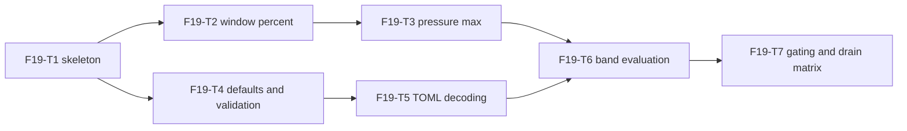

# F19-bands — Pressure, Bands and Gating: Tasks

## Task graph



## Task F19-T1: Declare the band package skeleton

**Depends on:** none
**Files:**
- create `internal/pick/band/pressure.go`
- create `internal/pick/band/bands.go`
- create `internal/pick/band/types_test.go`

**Spec references:** `specs/features/F19-bands/SPEC.md §2.1, §2.5, §2.6`, `specs/features/F19-bands/CONTRACTS.md §2, §3`, `docs/plan/annex-c-agent-integration.md §4.2` (reason-code enum)

**Instructions:**
1. Write `internal/pick/band/types_test.go` FIRST (constant values and zero values). Run `go test ./internal/pick/band/...` — it must fail to compile (package `band` does not exist yet).
2. Create `internal/pick/band/pressure.go` with `package band` and the exact declarations from `specs/features/F19-bands/CONTRACTS.md §2`:

```go
type Pressure struct {
    Known   bool
    Percent decimal.Decimal
}
```

3. Create `internal/pick/band/bands.go` with the exact declarations from `specs/features/F19-bands/CONTRACTS.md §3`:

```go
type Direction string

const (
    DirectionSpread Direction = "spread"
    DirectionDrain  Direction = "drain"
)

type BandSpec struct {
    Name             string
    UpperUsedPercent decimal.Decimal
    Weight           decimal.Decimal
}

type Config struct {
    Direction             Direction
    GateAboveUsedPercent  decimal.Decimal
    UnknownPressureWeight decimal.Decimal
    Tiers                 []BandSpec
}

type Result struct {
    Name    string
    Weight  decimal.Decimal
    Gated   bool
    Warning string
}

const ReasonCodeBandGated = "band_gated"
```

Import `github.com/shopspring/decimal` in both files; do NOT import `internal/usage` in this task (it is used from F19-T2 on). Comment each declaration with the doc comment from the CONTRACTS file, verbatim.
4. Run `go test ./internal/pick/band/...` — all cases pass.

**Test cases (write these first):**

| # | input | want |
|---|---|---|
| 1 | `ReasonCodeBandGated` | string value `"band_gated"` |
| 2 | `DirectionSpread`, `DirectionDrain` | `"spread"`, `"drain"` |
| 3 | `Pressure{}` | `Known == false`, `Percent == decimal.Zero` |
| 4 | `Result{}` | `Name == ""`, `Gated == false`, `Warning == ""`, `Weight == decimal.Zero` |
| 5 | `BandSpec{Name: "low", UpperUsedPercent: decimal.NewFromFloat(25), Weight: decimal.NewFromFloat(1)}` | fields readable back unchanged |
| 6 | `Config{}` | zero value usable; `len(Tiers) == 0` |

**Acceptance criteria:**
- [ ] `go build ./internal/pick/band/...` succeeds
- [ ] `go test ./internal/pick/band/...` passes with the test cases above
- [ ] no file outside the Files list modified
- [ ] declarations match `specs/features/F19-bands/CONTRACTS.md §2, §3` verbatim

## Task F19-T2: Derive the percent used for one window

**Depends on:** F19-T1
**Files:**
- extend `internal/pick/band/pressure.go` (add `WindowPercent`)
- create `internal/pick/band/pressure_test.go`

**Spec references:** `specs/features/F19-bands/SPEC.md §2.2`, `specs/features/F19-bands/CONTRACTS.md §2`, `specs/global/CONTRACTS.md §1.4` (`usage.Window`, file `internal/usage/types.go`, F11)

**Instructions:**
1. Write `internal/pick/band/pressure_test.go` FIRST with a table of `WindowPercent` cases. Run `go test ./internal/pick/band/...` — it must fail to compile.
2. Implement in `internal/pick/band/pressure.go` (signature verbatim from CONTRACTS §2):

```go
func WindowPercent(w usage.Window) (decimal.Decimal, bool)
```

The priority chain, first matching rule wins:
1. `w.Synthetic` -> unknown (`(decimal.Decimal{}, false)`).
2. `w.Unlimited` -> `decimal.NewFromFloat(0)`, known.
3. `!w.UsageKnown` -> unknown.
4. `w.UsedPercent != nil` -> `decimal.NewFromFloat(*w.UsedPercent)`, known. The reported value is used as-is and MAY exceed 100 (SPEC §2.2).
5. `w.Used != nil && w.Limit != nil && *w.Limit > 0` -> `decimal.NewFromFloat(*w.Used).Div(decimal.NewFromFloat(*w.Limit)).Mul(decimal.NewFromFloat(100))`, known.
6. `w.Remaining != nil && w.Limit != nil && *w.Limit > 0` -> `decimal.NewFromFloat(*w.Limit).Sub(decimal.NewFromFloat(*w.Remaining)).Div(decimal.NewFromFloat(*w.Limit)).Mul(decimal.NewFromFloat(100))`, known.
7. otherwise (balance-only window, missing Limit, or non-positive Limit) -> unknown.

`decimal.NewFromFloat` is exact for every value in the test table (shortest-representation); no rounding anywhere (rounding is F20's).
3. Build `usage.Window` fixtures with a local helper `win(usedPercent, used, limit, remaining *float64, unlimited, synthetic, usageKnown bool) usage.Window` using `float64` pointers; e.g. `f := func(v float64) *float64 { return &v }`.
4. Run `go test ./internal/pick/band/...` — all cases pass.

**Test cases (write these first):**

| # | input | want |
|---|---|---|
| 1 | `Synthetic: true`, `UsedPercent` set | unknown |
| 2 | `Unlimited: true`, `UsedPercent` set | `0`, known (Unlimited outranks UsedPercent) |
| 3 | `UsageKnown: false` (rest zero) | unknown |
| 4 | `UsedPercent: 75.5`, `UsageKnown: true` | `75.5`, known |
| 5 | `UsedPercent: 112.3` | `112.3`, known (may exceed 100) |
| 6 | `Used: 30`, `Limit: 40` | `75`, known |
| 7 | `Used: 30`, `Limit: 0` | unknown (non-positive Limit) |
| 8 | `Remaining: 10`, `Limit: 40` | `75`, known |
| 9 | `Remaining: 40`, `Limit: 40` | `0`, known |
| 10 | `Used: nil`, `Remaining: nil`, `Limit: 40` | unknown (balance only) |
| 11 | `Remaining: 10`, `Limit: nil` | unknown (no Limit) |
| 12 | all-zero `usage.Window{}` | unknown |

**Acceptance criteria:**
- [ ] `go build ./internal/pick/band/...` succeeds
- [ ] `go test ./internal/pick/band/...` passes with the test cases above
- [ ] no file outside the Files list modified
- [ ] priority order matches `specs/features/F19-bands/SPEC.md §2.2` exactly

## Task F19-T3: Reduce a snapshot to one pressure scalar (max, not mean)

**Depends on:** F19-T2
**Files:**
- extend `internal/pick/band/pressure.go` (add `Pressure`)
- extend `internal/pick/band/pressure_test.go`

**Spec references:** `specs/features/F19-bands/SPEC.md §2.1, §2.3`, `specs/features/F19-bands/CONTRACTS.md §2`, `specs/global/CONTRACTS.md §1.5` (`usage.Snapshot`, F11), `docs/plan/README.md §5.1` (max, not mean)

**Instructions:**
1. Write the new test cases FIRST. Run `go test ./internal/pick/band/...` — they must fail to compile.
2. Implement in `internal/pick/band/pressure.go` (signature verbatim from CONTRACTS §2):

```go
func Pressure(snapshot usage.Snapshot, windowIDs []string) Pressure
```

Algorithm, exactly:
- `snapshot.Failure != nil` -> `Pressure{Known: false}`.
- `len(windowIDs) == 0` -> `Pressure{Known: false}`.
- Otherwise: `max := decimal.Zero`, `found := false`. Iterate `windowIDs` in order; for each id, find the FIRST `usage.Window` in `snapshot.Windows` whose `ID == id` (windows named but absent from the snapshot contribute nothing). For a found window: `pct, ok := WindowPercent(w)`; when `ok`: `found = true`; keep `max = max(max, pct)` via `decimal.Decimal.Cmp` (max, not mean — master plan §5.1).
- `found == false` -> `Pressure{Known: false}`; else `Pressure{Known: true, Percent: max}`.
3. Run `go test ./internal/pick/band/...` — all cases pass.

**Test cases (write these first):**

| # | input | want |
|---|---|---|
| 1 | windows `[w1: 50, w2: 75]`, windowIDs `[w1, w2]` | known, `75` (max, not mean) |
| 2 | windows `[w1: 50, w2: unknown]`, windowIDs `[w1, w2]` | known, `50` (unknown window skipped) |
| 3 | any windows, windowIDs `[]` | unknown |
| 4 | `Failure` set (non-nil), any windows | unknown |
| 5 | windows `[w1: 50]`, windowIDs `[missing]` | unknown (no computable window) |
| 6 | windows `[w1: 50]`, windowIDs `[missing, w1]` | known, `50` (absent window contributes nothing) |
| 7 | windows `[w1: 50]`, windowIDs `[w1]` | known, `50` |
| 8 | windows `[w1: 50, w2: 75]`, windowIDs `[w2, w1]` | known, `75` (order of windowIDs irrelevant) |
| 9 | windows `[w1: synthetic-only]`, windowIDs `[w1]` | unknown |
| 10 | windows `[w1: unlimited (0), w2: 25]`, windowIDs `[w1, w2]` | known, `25` (a known 0 still participates) |

**Acceptance criteria:**
- [ ] `go build ./internal/pick/band/...` succeeds
- [ ] `go test ./internal/pick/band/...` passes with the test cases above
- [ ] no file outside the Files list modified
- [ ] reduction rule is max over the route's gating windows, per `docs/plan/README.md §5.1`

## Task F19-T4: Defaults and band validation

**Depends on:** F19-T1
**Files:**
- extend `internal/pick/band/bands.go` (add `DefaultConfig`, `ValidateBands`)
- create `internal/pick/band/bands_test.go`

**Spec references:** `specs/features/F19-bands/SPEC.md §2.4, §2.8, §2.9`, `specs/features/F19-bands/CONTRACTS.md §3, §5`, `docs/plan/README.md §5.2` (plan TOML defaults)

**Instructions:**
1. Write `internal/pick/band/bands_test.go` FIRST (defaults table and validation table). Run `go test ./internal/pick/band/...` — it must fail to compile.
2. Implement in `internal/pick/band/bands.go`, signatures verbatim from CONTRACTS §3:

```go
func DefaultConfig() Config
func ValidateBands(cfg Config) error
```

`DefaultConfig` returns exactly: `Direction: DirectionSpread`, `GateAboveUsedPercent: decimal.NewFromFloat(98)`, `UnknownPressureWeight: decimal.NewFromFloat(0.90)`, and `Tiers` = low/`25`/`1.00`, standard/`50`/`0.85`, elevated/`75`/`0.60`, critical/`100`/`0.25` in that ascending order (plan §5.2).
`ValidateBands` runs the checks in this exact order and returns the FIRST failure, with the EXACT strings from CONTRACTS §5:
1. `cfg.Direction` is neither `DirectionSpread` nor `DirectionDrain` -> `bands: direction must be "spread" or "drain"`.
2. `cfg.GateAboveUsedPercent.LessThan(decimal.Zero)` -> `bands: gate_above_used_percent must not be negative`.
3. `cfg.UnknownPressureWeight.LessThanOrEqual(decimal.Zero)` -> `bands: unknown_pressure_weight must be positive`.
4. `len(cfg.Tiers) == 0` -> `bands: tiers must not be empty`.
5. for each `i` from 1: `Tiers[i].UpperUsedPercent.LessThanOrEqual(Tiers[i-1].UpperUsedPercent)` -> `fmt.Errorf("bands: tier %d upper_used_percent %s must be greater than the previous bound %s", i+1, Tiers[i].UpperUsedPercent, Tiers[i-1].UpperUsedPercent)` (1-indexed position, decimal strings via `Decimal.String()`).
6. duplicate tier names -> `bands: tier names must be unique`.
7. any tier named `"unknown"` -> `bands: tier name "unknown" is reserved`.
8. any `Weight.LessThanOrEqual(decimal.Zero)` -> `fmt.Errorf("bands: tier %q weight must be positive", tier.Name)`.
Return nil when every check passes.
3. Run `go test ./internal/pick/band/...` — all cases pass.

**Test cases (write these first):**

| # | input | want |
|---|---|---|
| 1 | `DefaultConfig()` | `Direction == "spread"` |
| 2 | `DefaultConfig()` | `GateAboveUsedPercent == 98`, `UnknownPressureWeight == 0.90` |
| 3 | `DefaultConfig()` | tiers low/25/1.00, standard/50/0.85, elevated/75/0.60, critical/100/0.25, ascending |
| 4 | `DefaultConfig()` | `ValidateBands` returns nil |
| 5 | cfg with `Direction: "sideways"` | error `bands: direction must be "spread" or "drain"` |
| 6 | cfg with `GateAboveUsedPercent: -1` | error `bands: gate_above_used_percent must not be negative` |
| 7 | cfg with `UnknownPressureWeight: 0` | error `bands: unknown_pressure_weight must be positive` |
| 8 | cfg with zero tiers | error `bands: tiers must not be empty` |
| 9 | tiers `[25, 20]` | error `bands: tier 2 upper_used_percent 20 must be greater than the previous bound 25` |
| 10 | tiers `[25, 50]`, names `[a, a]` | error `bands: tier names must be unique` |
| 11 | tier named `unknown` | error `bands: tier name "unknown" is reserved` |
| 12 | tier `{name: "low", weight: 0}` | error `bands: tier "low" weight must be positive` |

**Acceptance criteria:**
- [ ] `go build ./internal/pick/band/...` succeeds
- [ ] `go test ./internal/pick/band/...` passes with the test cases above
- [ ] no file outside the Files list modified
- [ ] defaults match `docs/plan/README.md §5.2` and validation strings match `specs/features/F19-bands/CONTRACTS.md §5`

## Task F19-T5: Decode the [bands] TOML section

**Depends on:** F19-T4
**Files:**
- extend `internal/pick/band/bands.go` (add `TOMLConfig`, `TOMLTier`, `FromTOML`)
- extend `internal/pick/band/bands_test.go`

**Spec references:** `specs/features/F19-bands/SPEC.md §2.9, §2.10`, `specs/features/F19-bands/CONTRACTS.md §3, §6`, `docs/plan/README.md §5.2`, `specs/features/F01-config/CONTRACTS.md` (generic `UnmarshalKey`, Main DECISION B)

**Instructions:**
1. Write the new test cases FIRST. Use a local helper `ptr := func(v decimal.Decimal) *decimal.Decimal { return &v }` for the pointer scalar fields. Run `go test ./internal/pick/band/...` — they must fail to compile.
2. Implement in `internal/pick/band/bands.go`, declarations verbatim from CONTRACTS §3:

```go
type TOMLConfig struct {
    Direction             *string          `toml:"direction"`
    GateAboveUsedPercent  *decimal.Decimal `toml:"gate_above_used_percent"`
    UnknownPressureWeight *decimal.Decimal `toml:"unknown_pressure_weight"`
    Tiers                 []TOMLTier       `toml:"tier"`
}

type TOMLTier struct {
    Name             string          `toml:"name"`
    UpperUsedPercent decimal.Decimal `toml:"upper_used_percent"`
    Weight           decimal.Decimal `toml:"weight"`
}

func FromTOML(t TOMLConfig) (Config, error)
```

`FromTOML` recipe, exactly:
- `cfg := DefaultConfig()`; apply overrides: `t.Direction != nil` -> `cfg.Direction = Direction(*t.Direction)`; `t.GateAboveUsedPercent != nil` -> `cfg.GateAboveUsedPercent = *t.GateAboveUsedPercent`; `t.UnknownPressureWeight != nil` -> `cfg.UnknownPressureWeight = *t.UnknownPressureWeight`. The numeric fields are already `decimal.Decimal` (BurntSushi/toml decodes TOML floats via shopspring's TextUnmarshaler; F01's env overlay allocates a nil pointer and parses the same way) — dereference only, no `decimal.NewFromFloat` on the TOML path (annex-b §1 forbids float64 on the numeric path; F01 SPEC B12).
- Tiers: `t.Tiers == nil` -> keep the default ladder. Non-nil (including empty): copy each `TOMLTier` field directly into a `BandSpec` and replace `cfg.Tiers`.
- Return `cfg, ValidateBands(cfg)`.
- F19 never imports `internal/config`: the caller (F26) decodes the `[bands]` section via `cfg.UnmarshalKey("bands", &raw)` into a `TOMLConfig` and calls `FromTOML` (CONTRACTS §6, §8).
3. Run `go test ./internal/pick/band/...` — all cases pass.

**Test cases (write these first):**

| # | input | want |
|---|---|---|
| 1 | empty `TOMLConfig{}` | `DefaultConfig()` exactly, nil error |
| 2 | `Direction: "drain"` only | direction drain; every other field at default |
| 3 | `GateAboveUsedPercent` = ptr(`decimal.NewFromFloat(95.5)`) only | gate `95.5`; rest default |
| 4 | `UnknownPressureWeight` = ptr(`decimal.NewFromFloat(0.5)`) only | unknown weight `0.5`; rest default |
| 5 | `Tiers: nil` | default ladder, nil error |
| 6 | `Tiers: []TOMLTier{}` (empty non-nil) | error `bands: tiers must not be empty` |
| 7 | two tiers `[{a, 25, 1}, {b, 50, 0.5}]` (`UpperUsedPercent`/`Weight` as `decimal.NewFromFloat` values) | tiers preserved in order with exact values |
| 8 | `Direction: "sideways"` | error `bands: direction must be "spread" or "drain"` |
| 9 | tier with `Weight: 0` | error `bands: tier "low" weight must be positive` |
| 10 | `GateAboveUsedPercent: -1` | error `bands: gate_above_used_percent must not be negative` |

**Acceptance criteria:**
- [ ] `go build ./internal/pick/band/...` succeeds
- [ ] `go test ./internal/pick/band/...` passes with the test cases above
- [ ] no file outside the Files list modified
- [ ] `TOMLConfig` tag names match `specs/features/F19-bands/CONTRACTS.md §6` key names

## Task F19-T6: Evaluate a pressure against the band ladder

**Depends on:** F19-T3, F19-T5
**Files:**
- extend `internal/pick/band/bands.go` (add `EvaluateBand`)
- extend `internal/pick/band/bands_test.go`

**Spec references:** `specs/features/F19-bands/SPEC.md §2.4, §2.6, §2.7, §3`, `specs/features/F19-bands/CONTRACTS.md §3, §4`, `docs/plan/README.md §5.3`

**Instructions:**
1. Write the new test cases FIRST. Run `go test ./internal/pick/band/...` — they must fail to compile.
2. Implement in `internal/pick/band/bands.go` (signature verbatim from CONTRACTS §3):

```go
func EvaluateBand(p Pressure, cfg Config) Result
```

Branch order, exactly (SPEC §2.6 before §2.7 before §2.4):
1. Gating: `p.Known && p.Percent.GreaterThanOrEqual(cfg.GateAboveUsedPercent)` -> `Result{Name: "", Weight: decimal.Zero, Gated: true}` (no warning). This is the at-or-above rule (annex-c §2.3, §4.2).
2. Unknown pressure: `!p.Known` -> `Result{Name: "unknown", Weight: cfg.UnknownPressureWeight, Warning: "pressure unknown for route; using unknown_pressure_weight"}`. Never gated, never 0% (SPEC §2.7).
3. Band match: first tier index `i` with `cfg.Tiers[i].UpperUsedPercent.GreaterThanOrEqual(p.Percent)`; pressure below the first bound lands in tier 0; pressure above the last bound clamps to the last tier (inclusive upper bounds, SPEC §2.4). `Name` comes from the pressure tier. Weight: `cfg.Direction == DirectionDrain` -> `cfg.Tiers[len(cfg.Tiers)-1-i].Weight`; else (spread) `cfg.Tiers[i].Weight` (SPEC §2.5). Warning `""`.
Precondition: `cfg` is validated (`ValidateBands` returns nil); `EvaluateBand` must not call `ValidateBands` itself. To keep gating out of the edge cases below, build test configs with `GateAboveUsedPercent: decimal.NewFromFloat(150)` and the default ladder.
3. Run `go test ./internal/pick/band/...` — all cases pass.

**Test cases (write these first):** default ladder, `GateAboveUsedPercent: 150` unless stated.

| # | input | want |
|---|---|---|
| 1 | `p{25, known}` | `{Name: "low", Weight: 1.00, Gated: false, Warning: ""}` (inclusive edge) |
| 2 | `p{0, known}` | low (below-first-bound lands in tier 0) |
| 3 | `p{24.99, known}` | low |
| 4 | `p{50, known}` | `{standard, 0.85}` |
| 5 | `p{74.99, known}` | standard |
| 6 | `p{75, known}` | `{elevated, 0.60}` |
| 7 | `p{100, known}` | `{critical, 0.25}` |
| 8 | `p{120, known}` | critical (clamped to last tier) |
| 9 | `p{unknown}` | `{Name: "unknown", Weight: 0.90, Gated: false, Warning: "pressure unknown for route; using unknown_pressure_weight"}` |
| 10 | `p{200, known}` (gate 150) | `{Name: "", Weight: 0, Gated: true, Warning: ""}` |

**Acceptance criteria:**
- [ ] `go build ./internal/pick/band/...` succeeds
- [ ] `go test ./internal/pick/band/...` passes with the test cases above
- [ ] no file outside the Files list modified
- [ ] branch order gating -> unknown -> band matches `specs/features/F19-bands/SPEC.md §2.6, §2.7, §2.4`

## Task F19-T7: Gating and drain integration matrix

**Depends on:** F19-T6
**Files:**
- extend `internal/pick/band/bands_test.go`

**Spec references:** `specs/features/F19-bands/SPEC.md §2.5, §2.6, §2.7`, `specs/features/F19-bands/CONTRACTS.md §3, §4, §7`, `docs/plan/annex-c-agent-integration.md §4.2`

**Instructions:**
1. Add the integration matrix below to `internal/pick/band/bands_test.go` (this task adds tests only; `EvaluateBand` from F19-T6 already implements the branches — the matrix locks the boundary behavior together, including the `ReasonCodeBandGated` constant and the drain ladder).
2. For the gating rows use `GateAboveUsedPercent: decimal.NewFromFloat(98)` and the default ladder; for the drain rows use `Direction: DirectionDrain` (same gate/ladder). Assert `Result.Gated` matches `ReasonCodeBandGated` semantics: a gated candidate is excluded with reason code `"band_gated"` by the consumer (F26); this package only returns the boolean.
3. Run `go test ./internal/pick/band/...` — all cases pass.

**Test cases (write these first):**

| # | input | want |
|---|---|---|
| 1 | gate 98, `p{97.99, known}` | not gated; `{elevated, 0.60}` |
| 2 | gate 98, `p{98, known}` | GATED (inclusive at-or-above) |
| 3 | gate 98, `p{99.5, known}` | GATED |
| 4 | gate 0, `p{0, known}` | GATED (gate itself inclusive) |
| 5 | gate 100, `p{100, known}` | GATED (critical bound equals gate) |
| 6 | gate 98, `p{unknown}` | NOT gated; `{unknown, 0.90}` with the exact warning (unknown pressure overrides gating) |
| 7 | drain, `p{30, known}` | `{Name: "low", Weight: 0.25}` (tier 0 takes the last tier's weight) |
| 8 | drain, `p{60, known}` | `{standard, 0.60}` |
| 9 | drain, `p{90, known}` | `{elevated, 0.85}` |
| 10 | drain, `p{100, known}` | `{critical, 1.00}` |
| 11 | drain, `p{unknown}` | `{unknown, 0.90}` (direction does not change unknown handling) |
| 12 | drain, gate 98, `p{99, known}` | GATED with `Weight: 0` (drain never applies to a gated candidate) |

**Acceptance criteria:**
- [ ] `go test ./internal/pick/band/...` passes with the test cases above
- [ ] `go test ./internal/pick/band/... -tags nousage` compiles (SPEC §5)
- [ ] no file outside the Files list modified
- [ ] gating is inclusive at-or-above per `docs/plan/annex-c-agent-integration.md §2.3` and `ReasonCodeBandGated` is the only reason code this package owns (CONTRACTS §7)
