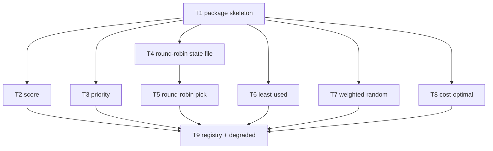

# F20 — Strategies: Tasks

Feature prerequisites (per `specs/DEPENDENCY-GRAPH.md`): F10, F18, F19 complete. `pick.Candidate`, `pick.Strategy` and the six enum constants come verbatim from `specs/global/CONTRACTS.md` §4. All scores are `github.com/shopspring/decimal`; comparisons use `decimal.Equal` for equality and `decimal.Cmp` for ordering — never `float64` on the score path.

## Task graph

## Task F20-T1: Create the strategy package skeleton

**Depends on:** none (F10/F18/F19 complete)

**Files:**
- create `internal/pick/strategy/strategy.go`
- create `internal/pick/strategy/strategy_test.go`

**Spec references:** `specs/features/F20-strategies/SPEC.md` §2.1, §3; `specs/features/F20-strategies/CONTRACTS.md` §3-§5; `specs/global/CONTRACTS.md` §4

**Instructions:**
1. Create `internal/pick/strategy/strategy.go` with `package strategy`. Import `github.com/WD-Mitchell/which-model/internal/pick`, `github.com/WD-Mitchell/which-model/internal/routing`, `github.com/shopspring/decimal`, and stdlib (`errors`, `sort`, `strings`).
2. Declare `type State struct` with EXACTLY these fields (from CONTRACTS §3): `Profile string`, `DataDir string`, `ProviderPriority []string`, `Config Config`, `Seed int64`, `HasSeed bool`, `UsageEnabled bool`, `UsageDisabledReason string`, `PressureByProvider map[string]float64`, `CostScoreByRouteKey map[string]decimal.Decimal`, `DryRun bool`.
3. Declare `type Config struct { Default string \`toml:"default"\`; CostMaxScoreDrop float64 \`toml:"cost_max_score_drop"\` }` and `func (c Config) ResolvedCostMaxScoreDrop() decimal.Decimal` returning `decimal.NewFromFloat(5)` when `c.CostMaxScoreDrop == 0`, else `decimal.NewFromFloat(c.CostMaxScoreDrop)`.
4. Declare `type Strategy interface { Name() pick.Strategy; Pick(candidates []pick.Candidate, state *State) (pick.Candidate, []pick.Candidate, error) }`.
5. Implement `func RouteKey(c pick.Candidate) string` returning `c.Route.Provider + "/" + c.Route.ModelID + "/" + c.Route.Reasoning`, and `func RouteKeyFromRoute(r routing.Route) string` with the same rule. Do not trim or normalize any part.
6. Declare the error values and types from CONTRACTS §5, with exactly the given messages: `ErrNoCandidates`, `ErrSeedRequired`, `ErrUnknownStrategy`, `type ErrLeastUsedRequiresUsage struct{ Reason string }` whose `Error()` is `"least-used requires usage data; usage is disabled by " + disableSource(e.Reason)`, `type ErrMissingPressure struct{ Provider string }` whose `Error()` is ``fmt.Sprintf("no usage pressure data for provider %q", e.Provider)``.
7. Add the unexported helper `func disableSource(reason string) string` mapping: `"flag"` → `"--no-usage"`, `"config"` → `"[usage] enabled = false"`, `"compiled_out"` → `"nousage build"`, `"no_providers_enabled"` → `"no providers enabled"`, any other value → the value itself.
8. Implement `func PriorityOrder(priorities map[string]int) []string`: collect the keys, sort by descending priority value, ties by ascending key (byte-wise). Empty input returns an empty slice.
9. Write `internal/pick/strategy/strategy_test.go` FIRST as a table-driven test covering the cases below (it will fail to compile until steps 1-8 exist), then implement steps 1-8.
10. Do not create any other file in this task.

**Test cases (write these first):**

| # | input | want |
|---|---|---|
| 1 | `RouteKey` of candidate `{Route: {Provider: "claude", ModelID: "claude-opus-4-8-20260115", Reasoning: "max"}}` | `"claude/claude-opus-4-8-20260115/max"` |
| 2 | `RouteKey` of candidate with empty `Reasoning` | `"p/m/"` (provider `"p"`, model `"m"`) |
| 3 | `RouteKeyFromRoute` of `routing.Route{Provider: "codex", ModelID: "gpt-5.6-sol", Reasoning: "high"}` | `"codex/gpt-5.6-sol/high"` |
| 4 | `Config{}.ResolvedCostMaxScoreDrop()` | `5` (decimal) |
| 5 | `Config{CostMaxScoreDrop: 3}.ResolvedCostMaxScoreDrop()` | `3` (decimal) |
| 6 | `PriorityOrder(map[string]int{"claude": 10, "codex": 5})` | `["claude" "codex"]` |
| 7 | `PriorityOrder(map[string]int{"a": 1, "b": 1})` (tie) | `["a" "b"]` (ascending key) |
| 8 | `PriorityOrder(nil)` | empty slice, no panic |
| 9 | `ErrNoCandidates.Error()` | `"no candidates to pick from"` |
| 10 | `ErrSeedRequired.Error()` | `"weighted-random requires --seed for reproducibility"` |
| 11 | `(&ErrLeastUsedRequiresUsage{Reason: "flag"}).Error()` | `"least-used requires usage data; usage is disabled by --no-usage"` |
| 12 | `errors.As(err, &ErrLeastUsedRequiresUsage{})` for `ErrLeastUsedRequiresUsage{Reason: "config"}` | `true`, captured `Reason == "config"` |

**Acceptance criteria:**
- [ ] `go build ./internal/pick/strategy/...` succeeds
- [ ] `go test ./internal/pick/strategy/...` passes with the test cases above
- [ ] no file outside the Files list modified
- [ ] `State`, `Config`, `Strategy`, `RouteKey`, `PriorityOrder` and all five errors are exported exactly as named

**Run:** `go test ./internal/pick/strategy/...`

## Task F20-T2: Implement the score strategy with tie-break golden tests

**Depends on:** F20-T1

**Files:**
- create `internal/pick/strategy/score.go`
- create `internal/pick/strategy/score_test.go`

**Spec references:** `specs/features/F20-strategies/SPEC.md` §2.2, D1, D10; `specs/features/F20-strategies/CONTRACTS.md` §3; `docs/plan/README.md` §5.4

**Instructions:**
1. Write `score_test.go` FIRST with the table below, then implement.
2. In `score.go`, declare `type Score struct{}` with `func (Score) Name() pick.Strategy` returning `pick.StrategyScore` and `func (Score) Pick(candidates []pick.Candidate, state *State) (pick.Candidate, []pick.Candidate, error)`.
3. `Pick`: if `len(candidates) == 0` return `pick.Candidate{}, nil, ErrNoCandidates` (the `state` parameter is unused by this strategy — that is correct).
4. Copy the slice, sort by: `FinalScore` descending (`decimal.Cmp`), ties by `RouteKey` ascending (byte-wise). This is the F20 SPEC D1 tie-break order.
5. The pick is `sorted[0]`; `excluded` is `sorted[1:]` (already in route-key ascending order among ties — SPEC §2.1).
6. Use `decimal.Cmp` for score ordering and `decimal.Equal` only where you compare for exact equality; never convert `FinalScore` to float.

**Test cases (write these first):** fixtures are written `FinalScore | provider/model_id/reasoning`; equal-FinalScore rows use the same score value.

| # | input candidates | want |
|---|---|---|
| 1 | `88.4 \| codex/gpt-5.6-sol/max` (single) | picks it; excluded empty |
| 2 | `75.14 \| claude/claude-opus-4-8-20260115/max`, `88.4 \| codex/gpt-5.6-sol/max` | picks codex (higher FinalScore) |
| 3 | `80 \| codex/x/max`, `80 \| claude/y/max` (tie) | picks claude (lower provider ID) |
| 4 | `80 \| claude/b-model/max`, `80 \| claude/a-model/max` (tie, same provider) | picks a-model (lower model ID) |
| 5 | `80 \| claude/opus/max`, `80 \| claude/opus/high` (tie, same provider+model) | picks high (lower reasoning: `"high"` < `"max"`) |
| 6 | `80 \| codex/c/max`, `80 \| claude/a/max`, `80 \| copilot/b/max` (3-way tie) | picks claude/a/max (route-key asc) |
| 7 | `88.4 \| codex/gpt-5.6-sol/max`, `75.14 \| claude/claude-opus-4-8-20260115/max`, `79.2 \| copilot/gpt-5.6-sol/high` | picks codex; excluded == the other two, in route-key ascending order |
| 8 | empty slice | `ErrNoCandidates` |
| 9 | `80 \| claude/opus/max` twice (duplicates) | picks one; excluded has exactly 1 entry, no panic |

**Acceptance criteria:**
- [ ] `go build ./internal/pick/strategy/...` succeeds
- [ ] `go test ./internal/pick/strategy/...` passes with the test cases above
- [ ] no file outside the Files list modified
- [ ] `Score.Pick` ignores `state` (no field of `state` is read)

**Run:** `go test ./internal/pick/strategy/...`

## Task F20-T3: Implement the priority strategy

**Depends on:** F20-T1

**Files:**
- create `internal/pick/strategy/priority.go`
- create `internal/pick/strategy/priority_test.go`

**Spec references:** `specs/features/F20-strategies/SPEC.md` §2.3, D9; `specs/features/F20-strategies/CONTRACTS.md` §3; `docs/plan/annex-d-cli-reference.md` §4.2

**Instructions:**
1. Write `priority_test.go` FIRST with the table below, then implement.
2. In `priority.go`, declare `type Priority struct{}` with `Name() pick.Strategy` returning `pick.StrategyPriority` and `Pick` matching the interface.
3. `Pick`: if empty, return `ErrNoCandidates`.
4. Build the provider evaluation order: providers appearing in `state.ProviderPriority` first, in that exact order (the list is already most-preferred-first — trust it, do not re-sort); then any providers not in the list, by provider ID ascending (SPEC D9).
5. Iterate that order; the first provider that has at least one candidate is the winner. If NO provider has a candidate (cannot happen for non-empty input, but check anyway), return `ErrNoCandidates`.
6. Among the winner's candidates apply the F20-T2 sort (FinalScore desc, route key asc) and pick `sorted[0]`.
7. `excluded` = every other input candidate, in route-key ascending order (SPEC §2.1).

**Test cases (write these first):**

| # | input candidates | state | want |
|---|---|---|---|
| 1 | `88.4 \| codex/gpt-5.6-sol/max`, `75.14 \| claude/claude-opus-4-8-20260115/max` | `ProviderPriority: [codex, claude]` | picks codex (first listed provider) even though claude has a candidate |
| 2 | `75.14 \| claude/claude-opus-4-8-20260115/max`, `88.4 \| codex/gpt-5.6-sol/max` | `ProviderPriority: [claude, codex]` | picks claude (claude is first; codex is higher-scored but later in priority) |
| 3 | `88.4 \| copilot/gpt-5.6-sol/max`, `75.14 \| claude/claude-opus-4-8-20260115/max` | `ProviderPriority: [codex]` (codex has no candidates) | picks claude (next after the empty listed provider, unlisted asc) |
| 4 | `88.4 \| codex/b/max`, `75.14 \| codex/a/max` | `ProviderPriority: [codex]` | picks codex/b (max FinalScore within winner) |
| 5 | `80 \| codex/b/max`, `80 \| codex/a/max` | `ProviderPriority: [codex]` | picks codex/a (tie → route key asc) |
| 6 | `75.14 \| claude/claude-opus-4-8-20260115/max`, `88.4 \| codex/gpt-5.6-sol/max`, `79.2 \| copilot/gpt-5.6-sol/high` | empty `ProviderPriority` | picks claude (provider ID asc: claude < codex < copilot) |
| 7 | as row 1 | `ProviderPriority: [codex]` | picks codex; excluded == the other two candidates |
| 8 | empty slice | any | `ErrNoCandidates` |

**Acceptance criteria:**
- [ ] `go build ./internal/pick/strategy/...` succeeds
- [ ] `go test ./internal/pick/strategy/...` passes with the test cases above
- [ ] no file outside the Files list modified
- [ ] `state.ProviderPriority` is consumed in order and never re-sorted inside the strategy

**Run:** `go test ./internal/pick/strategy/...`

## Task F20-T4: Implement the round-robin state file with flock

**Depends on:** F20-T1

**Files:**
- create `internal/pick/strategy/round_robin_state.go`
- create `internal/pick/strategy/round_robin_state_test.go`

**Spec references:** `specs/features/F20-strategies/SPEC.md` §2.4, D5-D8; `specs/features/F20-strategies/CONTRACTS.md` §9; `docs/plan/annex-d-cli-reference.md` §3.1

**Instructions:**
1. Run `go get github.com/gofrs/flock` (decision D2 — this is the lock library for the whole feature; do not use `golang.org/x/sys/unix.Flock`).
2. Write `round_robin_state_test.go` FIRST with the table below, then implement.
3. In `round_robin_state.go`, declare `func stateFilePath(dataDir string) string` returning `filepath.Join(dataDir, "pick", "round_robin.json")`.
4. Declare `func scopeKey(profile string, routeKeys []string) string`: copy `routeKeys`, `sort.Strings` them, join with `"|"`, compute `sha256.Sum256([]byte(profile + "|" + joined))`, return `hex.EncodeToString(sum[:])[:16]`.
5. Declare the cursor document types (unexported): `type cursorDoc struct { Index int \`json:"index"\`; UpdatedAt string \`json:"updated_at"\` }` and `type roundRobinFile map[string]cursorDoc`.
6. Declare `func loadCursor(dataDir, key string) (int, error)`: return `0` when the file does not exist; read the file; if read or `json.Unmarshal` fails for ANY reason, return `0, nil` (corrupt file = empty cursor, never an error — SPEC §2.4 step 9); if `key` is absent return `0`; else return `doc.Index`.
7. Declare `func saveCursor(dataDir, key string, index int) error`: `os.MkdirAll(filepath.Join(dataDir, "pick"), 0o700)`; open the state file `os.OpenFile(path, os.O_RDWR|os.O_CREATE, 0o600)`; take `flock.New(path).Lock()` (blocking, no timeout); re-read the whole file under the lock into `roundRobinFile` (empty map if absent/corrupt), set `m[key] = cursorDoc{Index: index, UpdatedAt: time.Now().UTC().Format(time.RFC3339)}`, marshal with `json.Marshal` (indent with `json.MarshalIndent` for human readability), truncate and write from offset 0, `f.Sync()`, `f.Unlock()`, close. Order matters: read-modify-write all under the lock (SPEC §2.4 step 8).
8. `loadCursor` and `saveCursor` are the only file-touching functions in this task; the `Pick` implementation in F20-T5 calls them.

**Test cases (write these first):**

| # | input | want |
|---|---|---|
| 1 | `loadCursor` on a nonexistent temp dir | `0, nil` |
| 2 | `loadCursor` on a dir containing a file with content `"not json"` | `0, nil` |
| 3 | `loadCursor` after `saveCursor(dir, "abc", 3)` | `3, nil` |
| 4 | `saveCursor` twice for the same key (3 then 7) | second load returns `7`; file contains only the key `"abc"` |
| 5 | `saveCursor` for two different keys in one file | both load back independently (`3` and `1`) |
| 6 | `scopeKey("balanced_implementation", ["codex/gpt-5.6-sol/max", "claude/claude-opus-4-8-20260115/max"])` twice | both calls equal; length 16; lowercase hex |
| 7 | `scopeKey` with the route list reversed | same key as row 6 (sorting inside) |
| 8 | `scopeKey` with a different profile, same routes | different from row 6 |

**Acceptance criteria:**
- [ ] `go get github.com/gofrs/flock` recorded in `go.mod`
- [ ] `go build ./internal/pick/strategy/...` succeeds
- [ ] `go test ./internal/pick/strategy/...` passes with the test cases above
- [ ] no file outside the Files list modified
- [ ] no `unix.Flock` / `syscall.Flock` usage anywhere in the package

**Run:** `go test ./internal/pick/strategy/...`

## Task F20-T5: Implement round-robin Pick with rotation and a concurrent-pick test

**Depends on:** F20-T4

**Files:**
- create `internal/pick/strategy/round_robin.go`
- create `internal/pick/strategy/round_robin_test.go`

**Spec references:** `specs/features/F20-strategies/SPEC.md` §2.4; `specs/features/F20-strategies/CONTRACTS.md` §9; `docs/plan/annex-d-cli-reference.md` §3.1

**Instructions:**
1. Write `round_robin_test.go` FIRST with the table below, then implement.
2. In `round_robin.go`, declare `type RoundRobin struct{}` with `Name()` returning `pick.StrategyRoundRobin` and `Pick` matching the interface.
3. `Pick`: if empty, return `ErrNoCandidates`. Copy and sort the candidates by `RouteKey` ascending; compute the route keys of the sorted list.
4. Compute `key := scopeKey(state.Profile, keys)`.
5. Read `index, err := loadCursor(state.DataDir, key)`; on error return `pick.Candidate{}, nil, err`.
6. `picked := sorted[index%len(sorted)]`.
7. If `!state.DryRun`, call `saveCursor(state.DataDir, key, index+1)`; on error return the error. This is the advance (SPEC §2.4 step 8).
8. `excluded` = the sorted candidates minus the picked one (SPEC §2.1).
9. In the test, build a helper `newCandidate(provider, modelID, reasoning string, finalScore decimal.Decimal) pick.Candidate` returning a `pick.Candidate` with `Route` set and `FinalScore` set — reuse it for the rotation and concurrency cases.

**Test cases (write these first):**

| # | input | want |
|---|---|---|
| 1 | 2 candidates, fresh temp DataDir, first Pick | picks sorted[0]; file now contains `index: 1` for the scope key |
| 2 | row 1 then a SECOND Pick with a NEW `RoundRobin{}` and the same DataDir | picks sorted[1] (cursor persisted on disk) |
| 3 | row 2 then a THIRD Pick | picks sorted[0] (wrap: `2 % 2 == 0`) |
| 4 | 3 candidates, `DryRun: true`, four Picks in a row | every Pick returns sorted[0]; state file absent or unchanged (`index` never written) |
| 5 | corrupt state file content, 2 candidates | Pick succeeds from index 0 (picks sorted[0]) |
| 6 | 2 candidates, fresh DataDir: two goroutines started on a shared `ready` channel call `Pick` once each; collect both results; then a third sequential `Pick` | the two goroutine results DIFFER and their union covers both candidates; the third Pick returns sorted[0] (both advances happened under the lock) |
| 7 | empty slice | `ErrNoCandidates` |

**Acceptance criteria:**
- [ ] `go build ./internal/pick/strategy/...` succeeds
- [ ] `go test ./internal/pick/strategy/...` passes, including the concurrent case (`go test -race ./internal/pick/strategy/...` also passes)
- [ ] no file outside the Files list modified
- [ ] cursor advance happens only under the flock, only when `DryRun` is false

**Run:** `go test -race ./internal/pick/strategy/...`

## Task F20-T6: Implement least-used with the full refusal matrix

**Depends on:** F20-T1

**Files:**
- create `internal/pick/strategy/least_used.go`
- create `internal/pick/strategy/least_used_test.go`

**Spec references:** `specs/features/F20-strategies/SPEC.md` §2.5, D11, D12; `specs/features/F20-strategies/CONTRACTS.md` §5; `docs/plan/README.md` §6.4

**Instructions:**
1. Write `least_used_test.go` FIRST with the table below, then implement.
2. In `least_used.go`, declare `type LeastUsed struct{}` with `Name()` returning `pick.StrategyLeastUsed` and `Pick` matching the interface.
3. `Pick`: if empty, return `ErrNoCandidates`.
4. If `!state.UsageEnabled`, return `pick.Candidate{}, nil, &ErrLeastUsedRequiresUsage{Reason: state.UsageDisabledReason}` — this is the refusal for ALL disable levels; the error message derives the source text from the reason (SPEC §2.5 step 12, D11). Never fall back to another strategy.
5. For each candidate, look up its provider's pressure in `state.PressureByProvider`; if a candidate's provider is missing, return `pick.Candidate{}, nil, &ErrMissingPressure{Provider: provider}` immediately (SPEC §2.5 step 13).
6. Pick the candidate with the minimum pressure (`float64` comparison); ties by `FinalScore` descending, then route key ascending (F20-T2 sort, applied to the tied subset).
7. `excluded` = the rest, route-key ascending.

**Test cases (write these first):** pressure fixtures are `provider → pressure`.

| # | input candidates | state | want |
|---|---|---|---|
| 1 | `75.14 \| claude/claude-opus-4-8-20260115/max`, `88.4 \| codex/gpt-5.6-sol/max` | `UsageEnabled: true`, `PressureByProvider: {claude: 30, codex: 80}` | picks claude (min pressure 30) despite lower FinalScore |
| 2 | `88.4 \| codex/gpt-5.6-sol/max`, `75.14 \| claude/claude-opus-4-8-20260115/max` | `UsageEnabled: true`, `PressureByProvider: {claude: 80, codex: 80}` (tie) | picks codex (higher FinalScore) |
| 3 | `80 \| codex/b/max`, `80 \| codex/a/max` | `UsageEnabled: true`, `PressureByProvider: {codex: 50}` | picks codex/a (full tie → route key asc) |
| 4 | 2 candidates | `UsageEnabled: false, UsageDisabledReason: "flag"` | error `ErrLeastUsedRequiresUsage`, `Reason == "flag"`, message `"least-used requires usage data; usage is disabled by --no-usage"` |
| 5 | 2 candidates | `UsageEnabled: false, UsageDisabledReason: "config"` | message `"least-used requires usage data; usage is disabled by [usage] enabled = false"` |
| 6 | 2 candidates | `UsageEnabled: false, UsageDisabledReason: "compiled_out"` | message `"least-used requires usage data; usage is disabled by nousage build"` |
| 7 | 2 candidates | `UsageEnabled: false, UsageDisabledReason: "no_providers_enabled"` | message `"least-used requires usage data; usage is disabled by no providers enabled"` |
| 8 | `88.4 \| codex/gpt-5.6-sol/max` | `UsageEnabled: true`, `PressureByProvider: {}` (codex missing) | error `ErrMissingPressure{Provider: "codex"}`, message `no usage pressure data for provider "codex"` |
| 9 | empty slice | `UsageEnabled: true` | `ErrNoCandidates` |

**Acceptance criteria:**
- [ ] `go build ./internal/pick/strategy/...` succeeds
- [ ] `go test ./internal/pick/strategy/...` passes with the test cases above
- [ ] no file outside the Files list modified
- [ ] every one of the four refusal messages is asserted verbatim in the test file

**Run:** `go test ./internal/pick/strategy/...`

## Task F20-T7: Implement weighted-random with fixed-seed determinism

**Depends on:** F20-T1

**Files:**
- create `internal/pick/strategy/weighted_random.go`
- create `internal/pick/strategy/weighted_random_test.go`

**Spec references:** `specs/features/F20-strategies/SPEC.md` §2.6, D3, D13, D14; `docs/plan/annex-d-cli-reference.md` §3.2

**Instructions:**
1. Write `weighted_random_test.go` FIRST with the table below, then implement.
2. In `weighted_random.go`, declare `type WeightedRandom struct{}` with `Name()` returning `pick.StrategyWeightedRandom` and `Pick` matching the interface.
3. `Pick`: if empty, return `ErrNoCandidates`. If `!state.HasSeed`, return `pick.Candidate{}, nil, ErrSeedRequired` (SPEC §2.6 step 15).
4. Copy and sort the candidates by `RouteKey` ascending (deterministic sampling — SPEC D10).
5. Build the weight list: for each sorted candidate, `w = c.BandWeight.Mul(c.ProviderWeight)` (both `decimal.Decimal`; multiply with `Mul`, do not convert to float). If the total weight is zero (all zero), use uniform weights: `1` for every candidate (SPEC D14).
6. Create the PRNG: `rng := rand.New(rand.NewPCG(uint64(state.Seed), uint64(state.Seed)))` from `math/rand/v2`.
7. Sample: compute the cumulative weight `total` as `decimal`; draw `t := rng.Float64() * totalFloat` where `totalFloat` is the decimal total converted with `total.InexactFloat64()`; walk the sorted candidates subtracting each weight (as float via `InexactFloat64()`); pick the first candidate whose running cumulative weight exceeds the draw. If the walk ends without a pick (float edge), pick the last candidate.
8. `excluded` = the rest, route-key ascending. `state.DryRun` is ignored (SPEC §2.6 step 16).
9. The test's distribution cases iterate seeds 1..50 with a fixed candidate set and count outcomes; these are deterministic because PCG output is platform-independent.

**Test cases (write these first):** fixtures give `provider/model_id/reasoning` with `BandWeight × ProviderWeight`.

| # | input | want |
|---|---|---|
| 1 | 2 candidates, `HasSeed: false` | `ErrSeedRequired` with message `"weighted-random requires --seed for reproducibility"` |
| 2 | 2 candidates with equal weights, `HasSeed: true, Seed: 42`, two `Pick` calls | both calls return the SAME candidate (same seed ⇒ same result) |
| 3 | 2 candidates with equal weights, seeds 1..50 (fresh `State` per seed) | BOTH candidates appear at least once across the 50 seeds (spread, not constant) |
| 4 | candidate A weight `100 × 1.0`, candidate B weight `1 × 1.0`, seeds 1..50 | A is picked in ≥ 45 of the 50 seeds |
| 5 | 2 candidates, all weights zero (`BandWeight: 0`, `ProviderWeight: 0`), seeds 1..50 | no panic; every pick is one of the two candidates; both appear at least once (uniform fallback) |
| 6 | single candidate, any seed | always that candidate |
| 7 | empty slice | `ErrNoCandidates` |

**Acceptance criteria:**
- [ ] `go build ./internal/pick/strategy/...` succeeds
- [ ] `go test ./internal/pick/strategy/...` passes with the test cases above
- [ ] no file outside the Files list modified
- [ ] the PRNG is `math/rand/v2` `NewPCG(seed, seed)`; no global `rand` state is used

**Run:** `go test ./internal/pick/strategy/...`

## Task F20-T8: Implement cost-optimal with the score threshold

**Depends on:** F20-T1

**Files:**
- create `internal/pick/strategy/cost_optimal.go`
- create `internal/pick/strategy/cost_optimal_test.go`

**Spec references:** `specs/features/F20-strategies/SPEC.md` §2.7, D4, D15, D16; `docs/plan/README.md` §5.4

**Instructions:**
1. Write `cost_optimal_test.go` FIRST with the table below, then implement.
2. In `cost_optimal.go`, declare `type CostOptimal struct{}` with `Name()` returning `pick.StrategyCostOptimal` and `Pick` matching the interface.
3. `Pick`: if empty, return `ErrNoCandidates`.
4. Compute `threshold := state.Config.ResolvedCostMaxScoreDrop()` (SPEC D4: zero ⇒ 5.0).
5. Find `top := max FinalScore` over all candidates (decimal compare).
6. Build the candidate pool: every candidate with `FinalScore >= top - threshold` (decimal arithmetic `Sub`/`Cmp`; use `top.Sub(threshold)` and `c.FinalScore.Cmp(limit) >= 0`) AND with a cost-score entry in `state.CostScoreByRouteKey`. A candidate below the threshold, or without a cost entry, goes to `excluded` (SPEC §2.7 step 18, D16).
7. If the pool is empty (possible only when every candidate is below threshold or lacks cost), pick nothing: return `pick.Candidate{}, excluded, ErrNoCandidates` with `excluded` already populated.
8. From the pool, pick the maximum `CostScoreByRouteKey` value (decimal); ties by higher `FinalScore`, then route key ascending (SPEC §2.7 step 17).
9. `excluded` = every input candidate except the pick, route-key ascending.

**Test cases (write these first):** cost fixtures are route key → cost score.

| # | input candidates (FinalScore) | state.CostScoreByRouteKey | want |
|---|---|---|---|
| 1 | `90 \| claude/a/max`, `89 \| codex/b/max` (both within 5 of top) | `claude/a/max: 70`, `codex/b/max: 90` | picks codex/b (max cost score) |
| 2 | `90 \| claude/a/max`, `84 \| codex/b/max` (drop 6 > 5) | `claude/a/max: 70`, `codex/b/max: 90` | picks claude/a; codex/b in `excluded` |
| 3 | `90 \| claude/a/max`, `89 \| codex/b/max` | `claude/a/max: 70` (codex missing) | picks claude/a; codex/b in `excluded` |
| 4 | `90 \| claude/a/max`, `90 \| codex/b/max` (equal FinalScore), costs `70` and `70` | both entries present | picks claude/a (equal cost → higher FinalScore tie → route key asc) |
| 5 | `90 \| claude/a/max`, `88.5 \| codex/b/max` | both cost `50` | picks claude/a with `Config{CostMaxScoreDrop: 1}` (drop 1.5 > 1 excludes codex) |
| 6 | `90 \| claude/a/max`, `85 \| codex/b/max` | both cost `50` | picks claude/a with zero `Config` (default 5.0: drop 5 is NOT > 5, so codex eligible, tie cost → higher FinalScore) |
| 7 | `90 \| claude/a/max`, `89 \| codex/b/max`, `88 \| copilot/c/max` | `claude/a/max: 40`, `codex/b/max: 95`, `copilot/c/max: 60` | picks codex/b; excluded contains claude/a and copilot/c |
| 8 | empty slice | — | `ErrNoCandidates` |

**Acceptance criteria:**
- [ ] `go build ./internal/pick/strategy/...` succeeds
- [ ] `go test ./internal/pick/strategy/...` passes with the test cases above
- [ ] no file outside the Files list modified
- [ ] cost lookups keyed by `RouteKey` (the full `provider/model_id/reasoning` string)

**Run:** `go test ./internal/pick/strategy/...`

## Task F20-T9: Implement the strategy registry and verify degraded availability

**Depends on:** F20-T2, F20-T3, F20-T5, F20-T6, F20-T7, F20-T8

**Files:**
- create `internal/pick/strategy/registry.go`
- create `internal/pick/strategy/registry_test.go`

**Spec references:** `specs/features/F20-strategies/SPEC.md` §2.8, D17; `specs/features/F20-strategies/CONTRACTS.md` §4; `docs/plan/annex-d-cli-reference.md` §3.3

**Instructions:**
1. Write `registry_test.go` FIRST with the table below, then implement.
2. In `registry.go`, implement `func ParseStrategy(s string) (pick.Strategy, error)`: `""` → `pick.StrategyScore`; else validate against the six `pick.Strategy` constants; unknown → `fmt.Errorf("%w: %q", ErrUnknownStrategy, s)`.
3. Implement `func New(s pick.Strategy) (Strategy, error)`: switch over the six enum values returning `&Score{}`, `&Priority{}`, `&RoundRobin{}`, `&LeastUsed{}`, `&WeightedRandom{}`, `&CostOptimal{}`; default → `nil, fmt.Errorf("%w: %q", ErrUnknownStrategy, s)`.
4. The degraded-availability test (row 8) uses `State{UsageEnabled: false, UsageDisabledReason: "flag"}` and the F20-T2 fixture candidates; assert `Score`, `Priority`, `RoundRobin` (temp `DataDir`), `WeightedRandom` (`HasSeed: true, Seed: 7`) and `CostOptimal` (with cost entries) each return a pick, and `LeastUsed` returns `ErrLeastUsedRequiresUsage`.
5. Do not modify any file from earlier tasks.

**Test cases (write these first):**

| # | input | want |
|---|---|---|
| 1 | `New(pick.StrategyScore)` | `*Score` (type-assert with `reflect.TypeOf`) |
| 2 | `New(pick.StrategyPriority)` | `*Priority` |
| 3 | `New(pick.StrategyRoundRobin)` | `*RoundRobin` |
| 4 | `New(pick.StrategyLeastUsed)` | `*LeastUsed` |
| 5 | `New(pick.StrategyWeightedRandom)` | `*WeightedRandom` |
| 6 | `New(pick.StrategyCostOptimal)` | `*CostOptimal` |
| 7 | `New(pick.Strategy("bogus"))`; `ParseStrategy("")`; `ParseStrategy("cost-optimal")` | error wraps `ErrUnknownStrategy`; `pick.StrategyScore`; `pick.StrategyCostOptimal` |
| 8 | degraded `State` (UsageEnabled false, reason `"flag"`) applied to all six via `New` | Score/Priority/RoundRobin/WeightedRandom/CostOptimal each pick a candidate; LeastUsed returns `ErrLeastUsedRequiresUsage` |

**Acceptance criteria:**
- [ ] `go build ./internal/pick/strategy/...` succeeds
- [ ] `go build -tags nousage ./internal/pick/strategy/...` succeeds (the package has no usage imports)
- [ ] `go test ./internal/pick/strategy/...` passes with the test cases above
- [ ] no file outside the Files list modified

**Run:** `go test ./internal/pick/strategy/...`
