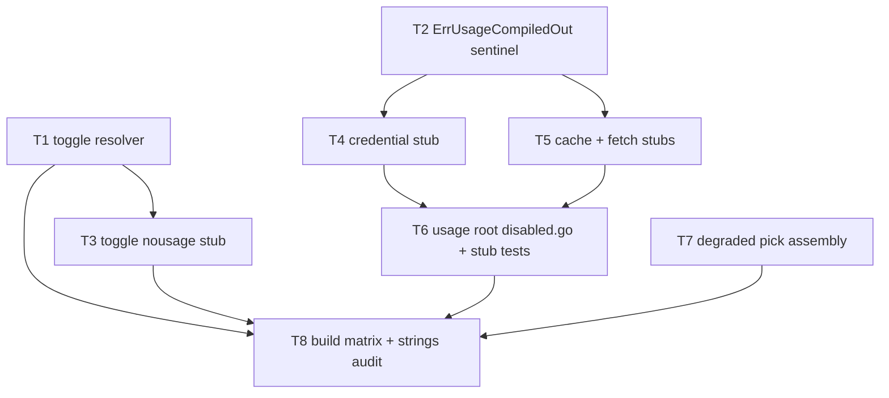

# F21 — Usage Toggle: Tasks

Feature prerequisites (per `specs/DEPENDENCY-GRAPH.md`): F01, F11, F14 complete. Canonical `usage` types (`Snapshot`, `Window`, `Unit`, `Source`, `Kind`) come verbatim from `specs/global/CONTRACTS.md` §1; `config.Config`/`config.UsageEnabled`/`config.ProviderConfig` from F01 `internal/config`; the `FetchAll` signature from F14 `internal/usage/fetch/fetch.go`. Reason strings MUST equal the canonical `usage_disabled_reason` values (`specs/global/CONTRACTS.md` §6).

## Task graph

## Task F21-T1: Implement the real usage toggle resolver

**Depends on:** none (F01/F11/F14 complete)

**Files:**
- create `internal/usage/toggle/toggle_usage.go` (carries `//go:build !nousage`)
- create `internal/usage/toggle/toggle_test.go` (carries `//go:build !nousage`)

**Spec references:** `specs/features/F21-usage-toggle/SPEC.md` §2.1; `specs/features/F21-usage-toggle/CONTRACTS.md` §2; `docs/plan/README.md` §6; `docs/plan/annex-d-cli-reference.md` §3.4

**Instructions:**
1. Create the directory `internal/usage/toggle` and write `toggle_usage.go` with the build tag `//go:build !nousage` on line 1 (blank line after), `package toggle`.
2. Declare the four constants with the canonical values: `ReasonFlag = "flag"`, `ReasonConfig = "config"`, `ReasonCompiledOut = "compiled_out"`, `ReasonNoProvidersEnabled = "no_providers_enabled"`.
3. Declare `const Compiled bool = true` (decision D8 — the toggle package carries the value in both builds).
4. Declare `func ResolveUsageEnabled(flagNoUsage bool, cfg *config.Config) (bool, string)` importing `github.com/WD-Mitchell/which-model/internal/config`.
5. Implement precedence (SPEC §2.1 step 2): if `flagNoUsage` return `(false, ReasonFlag)` — return BEFORE reading `cfg`, so a nil `cfg` is safe on this path. Otherwise read `cfg.Usage.Enabled`:
   - `config.UsageFalse` → `(false, ReasonConfig)` regardless of providers.
   - `config.UsageAuto` → count providers with `Enabled == true` in `cfg.Providers` (default-deny: only explicit `Enabled: true` entries count); 0 → `(false, ReasonNoProvidersEnabled)`, else `(true, "")`.
   - `config.UsageTrue` → same provider count; 0 → `(false, ReasonNoProvidersEnabled)` (the strict pair — SPEC §2.1 step 4), else `(true, "")`.
6. Write `toggle_test.go` FIRST (same `//go:build !nousage` tag, same package) with a table-driven test over the rows below. Build the fixtures with a helper `func makeCfg(enabled config.UsageEnabled, enabledProviders ...string) *config.Config` constructing `&config.Config{Usage: config.Usage{Enabled: enabled}, Providers: map[string]config.ProviderConfig{...}}` with `config.ProviderConfig{Enabled: true}` per name — if F01's exported struct/field names differ from `config.Usage`, adapt the composite literals to F01's exact names; the observable contract is the resolution matrix, not the literal.
7. The test file must not reference any `!nousage` symbol outside the toggle package.

**Test cases (write these first):**

| # | flag | cfg | want |
|---|---|---|---|
| 1 | — | — | the four constants equal `"flag"`, `"config"`, `"compiled_out"`, `"no_providers_enabled"` respectively |
| 2 | `true` | `UsageFalse`, 0 providers | `(false, "flag")` |
| 3 | `true` | `UsageTrue`, 2 enabled providers | `(false, "flag")` |
| 4 | `true` | `UsageAuto`, 1 enabled provider | `(false, "flag")` |
| 5 | `false` | `UsageFalse`, 0 providers | `(false, "config")` |
| 6 | `false` | `UsageFalse`, 1 enabled provider | `(false, "config")` (config beats providers) |
| 7 | `false` | `UsageAuto`, 0 enabled | `(false, "no_providers_enabled")` |
| 8 | `false` | `UsageAuto`, 1 enabled provider | `(true, "")` |
| 9 | `false` | `UsageAuto`, 2 of 3 providers enabled | `(true, "")` |
| 10 | `false` | `UsageTrue`, 2 enabled providers | `(true, "")` |
| 11 | `false` | `UsageTrue`, 0 enabled providers | `(false, "no_providers_enabled")` — the strict pair (SPEC §2.1 step 4) |
| 12 | `true` | `nil` | `(false, "flag")`, no panic |

**Acceptance criteria:**
- [ ] `go build ./internal/usage/toggle/...` succeeds
- [ ] `go test ./internal/usage/toggle/...` passes with the test cases above
- [ ] no file outside the Files list modified
- [ ] the flag short-circuit precedes any `cfg` dereference

**Run:** `go test ./internal/usage/toggle/...`

## Task F21-T2: Add the ErrUsageCompiledOut sentinel in a tag-free file

**Depends on:** none

**Files:**
- create `internal/usage/errors.go` (NO build tag)
- create `internal/usage/errors_test.go` (NO build tag)

**Spec references:** `specs/features/F21-usage-toggle/SPEC.md` §2.2 step 8, D4; `specs/features/F21-usage-toggle/CONTRACTS.md` §8; `docs/plan/annex-a-provider-matrix.md` §1a.2

**Instructions:**
1. Write `errors_test.go` FIRST with the rows below, then implement.
2. Create `internal/usage/errors.go` with `package usage` and exactly: `var ErrUsageCompiledOut = errors.New("usage subsystem compiled out (-tags nousage)")`. No build tag — it must exist in BOTH builds so `errors.Is` works from default-build callers (decision D4; the annex puts the sentinel inside the stub file, which would make it invisible to the default build).
3. The test file has no build tag either and must pass under both `go test ./internal/usage/...` and `go test -tags nousage ./internal/usage/...` (it only touches the sentinel).

**Test cases (write these first):**

| # | input | want |
|---|---|---|
| 1 | `ErrUsageCompiledOut.Error()` | `"usage subsystem compiled out (-tags nousage)"` |
| 2 | `errors.Is(ErrUsageCompiledOut, ErrUsageCompiledOut)` | `true` |
| 3 | `errors.Is(fmt.Errorf("wrap: %w", ErrUsageCompiledOut), ErrUsageCompiledOut)` | `true` |
| 4 | `errors.Is(errors.New("other"), ErrUsageCompiledOut)` | `false` |

**Acceptance criteria:**
- [ ] `go test ./internal/usage/...` passes
- [ ] `go test -tags nousage ./internal/usage/...` passes (no build-tag leak in either direction)
- [ ] no file outside the Files list modified

**Run:** `go test -tags nousage ./internal/usage/...`

## Task F21-T3: Add the nousage toggle stub

**Depends on:** F21-T1

**Files:**
- create `internal/usage/toggle/toggle_nousage.go` (carries `//go:build nousage`)
- create `internal/usage/toggle/toggle_nousage_test.go` (carries `//go:build nousage`)

**Spec references:** `specs/features/F21-usage-toggle/SPEC.md` §2.2 step 10; `specs/features/F21-usage-toggle/CONTRACTS.md` §2; `docs/plan/annex-d-cli-reference.md` §3.4

**Instructions:**
1. Write `toggle_nousage_test.go` FIRST with the rows below, then implement.
2. Create `toggle_nousage.go` with `//go:build nousage`, `package toggle`, declaring the SAME four reason constants (same values — they are build-independent) and `const Compiled bool = false`.
3. Declare `func ResolveUsageEnabled(flagNoUsage bool, cfg *config.Config) (bool, string)` returning `(false, ReasonCompiledOut)` unconditionally, ignoring both arguments (SPEC §2.2 step 10 — L2 cannot be re-enabled at runtime). Import `internal/config` for the signature only.
4. The test file has `//go:build nousage` and its own local `makeCfg` helper (a copy of T1's — the two test files never coexist in one build). It must compile when `toggle_usage.go` is excluded.

**Test cases (write these first):**

| # | input | want |
|---|---|---|
| 1 | — | `toggle.Compiled == false` |
| 2 | `ResolveUsageEnabled(true, nil)` | `(false, ReasonCompiledOut)` |
| 3 | `ResolveUsageEnabled(false, cfg)` where cfg is `UsageTrue` with 1 enabled provider | `(false, ReasonCompiledOut)` (stub ignores config) |
| 4 | — | `ReasonCompiledOut == "compiled_out"` |

**Acceptance criteria:**
- [ ] `go build -tags nousage ./internal/usage/toggle/...` succeeds
- [ ] `go test -tags nousage ./internal/usage/toggle/...` passes
- [ ] `go test ./internal/usage/toggle/...` (default build) still passes — the two tag files never collide
- [ ] no file outside the Files list modified

**Run:** `go test -tags nousage ./internal/usage/toggle/... && go test ./internal/usage/toggle/...`

## Task F21-T4: Add the credential presence stub

**Depends on:** F21-T2

**Files:**
- create `internal/usage/credential/disabled.go` (carries `//go:build nousage`)
- create `internal/usage/credential/disabled_test.go` (carries `//go:build nousage`)

**Spec references:** `specs/features/F21-usage-toggle/SPEC.md` §2.2 step 9, D6; `specs/features/F21-usage-toggle/CONTRACTS.md` §5; `specs/global/CONTRACTS.md` §8

**Instructions:**
1. Write `disabled_test.go` FIRST with the rows below, then implement.
2. Create `internal/usage/credential/disabled.go` with `//go:build nousage`, `package credential`, declaring exactly `type Warning struct{ Message string }` (decision D6 — minimal presence stub; the full real surface is F12's `!nousage` file and is NOT mirrored).
3. The test file is `package credential_test`, imports `github.com/WD-Mitchell/which-model/internal/usage/credential`, and only touches `Warning`.
4. Do not create any other file in this package — under nousage this is the only file present; under the default build F12's real files are present and this one is excluded.

**Test cases (write these first):**

| # | input | want |
|---|---|---|
| 1 | `credential.Warning{Message: "boom"}` | `.Message == "boom"` |
| 2 | `credential.Warning{}` | `.Message == ""` (zero value) |
| 3 | package builds under nousage (compile-level) | `go build -tags nousage ./internal/usage/credential/...` exits 0 |

**Acceptance criteria:**
- [ ] `go build -tags nousage ./internal/usage/credential/...` succeeds
- [ ] `go test -tags nousage ./internal/usage/credential/...` passes
- [ ] no file outside the Files list modified

**Run:** `go test -tags nousage ./internal/usage/credential/...`

## Task F21-T5: Add the cache and fetch nousage stubs

**Depends on:** F21-T2

**Files:**
- create `internal/usage/cache/disabled.go` (carries `//go:build nousage`)
- create `internal/usage/fetch/disabled.go` (carries `//go:build nousage`)

**Spec references:** `specs/features/F21-usage-toggle/SPEC.md` §2.2 step 9, D6; `specs/features/F21-usage-toggle/CONTRACTS.md` §4, §6; `docs/plan/annex-a-provider-matrix.md` §1a.2

**Instructions:**
1. Create `internal/usage/cache/disabled.go` with `//go:build nousage`, `package cache`, and exactly: `func CacheDir() (string, error) { return "", usage.ErrUsageCompiledOut }` — import `github.com/WD-Mitchell/which-model/internal/usage` for the sentinel. (F13's real `cache` files carry `!nousage`; this sibling is the only file in the package under nousage.)
2. Create `internal/usage/fetch/disabled.go` with `//go:build nousage`, `package fetch`, importing `context`, `time`, `github.com/WD-Mitchell/which-model/internal/usage`, and `github.com/WD-Mitchell/which-model/internal/usage/credential`.
3. Declare `type Options struct` with EXACTLY these fields and types (F14-pinned, CONTRACTS §4 — do not add or rename): `Refresh bool`, `Offline bool`, `MaxAge time.Duration`, `ShowIdentity bool`, `Enabled map[string]bool`, `Timeout time.Duration`, `MaxParallel int`.
4. Declare `func FetchAll(ctx context.Context, providers []string, opts Options) ([]usage.Snapshot, []credential.Warning, error)` returning `(nil, nil, usage.ErrUsageCompiledOut)` — the body is exactly that return; no other logic.
5. This task has no new test file: its behaviors (rows below) are asserted by the test file created in F21-T6, which exercises all three stub packages together. The gate for THIS task is that both packages compile under nousage.

**Test cases (write these first — asserted by F21-T6's `fetch/disabled_test.go`):**

| # | behaviour | want |
|---|---|---|
| 1 | `cache.CacheDir()` | error, `errors.Is(err, usage.ErrUsageCompiledOut)` |
| 2 | `fetch.FetchAll(ctx, []string{"claude"}, Options{})` | `nil, nil, ErrUsageCompiledOut` |
| 3 | `fetch.FetchAll` with all seven `Options` fields populated | same sentinel return (options ignored) |
| 4 | `fetch.Options` zero value constructible with the F14 field set | compiles and all fields readable |
| 5 | both packages build under nousage | `go build -tags nousage ./internal/usage/cache/... ./internal/usage/fetch/...` exits 0 |

**Acceptance criteria:**
- [ ] `go build -tags nousage ./internal/usage/cache/... ./internal/usage/fetch/...` succeeds
- [ ] the `Options` field set matches F14's real struct field-for-field (compare against `internal/usage/fetch/fetch.go` in the default build)
- [ ] no file outside the Files list modified

**Run:** `go build -tags nousage ./internal/usage/cache/... ./internal/usage/fetch/...`

## Task F21-T6: Add the usage-root nousage stub and the combined stub tests

**Depends on:** F21-T2, F21-T4, F21-T5

**Files:**
- create `internal/usage/disabled.go` (carries `//go:build nousage`)
- create `internal/usage/fetch/disabled_test.go` (carries `//go:build nousage`)

**Spec references:** `specs/features/F21-usage-toggle/SPEC.md` §2.2 steps 6-9, D5, D6; `specs/features/F21-usage-toggle/CONTRACTS.md` §3; `docs/plan/annex-a-provider-matrix.md` §1a.2

**Instructions:**
1. Create `internal/usage/disabled.go` with `//go:build nousage`, `package usage`, importing `context`.
2. Declare the stub-only types: `type Descriptor struct { ID string; DisplayName string }` and `type Options struct{}` (F11's real `Descriptor`/`Options` are `!nousage`-only — descriptor.go carries the tag; SddUsageCore-pinned). Do NOT declare any identifier that `internal/usage/types.go` already declares tag-free (`Snapshot`, `Failure`, `Window`, `Unit`, `Source`, `Kind`, `Unit*` constants) — that would be a duplicate-declaration compile error in the nousage build (SPEC R1).
3. Declare the annex surface (CONTRACTS §3): `func Registry() []Descriptor { return nil }`; `func Lookup(id string) (Descriptor, bool) { return Descriptor{}, false }`; `func Fetch(context.Context, []string, Options) ([]Snapshot, error) { return nil, ErrUsageCompiledOut }`; `func CacheDir() (string, error) { return "", ErrUsageCompiledOut }` — the sentinel returned directly, no delegation into `internal/usage/cache` (decision D6; the cache stub returns the same sentinel independently). No `Compiled` const here (decision D8 — that is the toggle package's).
4. Write `internal/usage/fetch/disabled_test.go` with `//go:build nousage`, `package fetch` (same package as the fetch stub), importing `context`, `time`, `github.com/WD-Mitchell/which-model/internal/usage`, `github.com/WD-Mitchell/which-model/internal/usage/cache`, and `github.com/WD-Mitchell/which-model/internal/usage/credential`. It asserts the rows below — this is the combined test that covers F21-T5's stub behaviors too.
5. `Snapshot` for the `Fetch` assertion is the canonical tag-free type; the assertions compare the error via `errors.Is`, not the nil slices.

**Test cases (write these first):**

| # | input | want |
|---|---|---|
| 1 | `usage.Registry()` | `nil` |
| 2 | `usage.Lookup("claude")` | `ok == false` |
| 3 | `usage.Fetch(context.Background(), []string{"claude"}, usage.Options{})` | `errors.Is(err, usage.ErrUsageCompiledOut)` |
| 4 | `usage.CacheDir()` | error, `errors.Is(err, usage.ErrUsageCompiledOut)` (direct sentinel) |
| 5 | `cache.CacheDir()` | error, `errors.Is(err, usage.ErrUsageCompiledOut)` |
| 6 | `fetch.FetchAll(context.Background(), []string{"claude", "codex"}, Options{})` | `nil, nil`, error Is `ErrUsageCompiledOut` |
| 7 | `fetch.FetchAll(ctx, providers, Options{Refresh: true, Offline: true, MaxAge: time.Hour, ShowIdentity: true, Enabled: map[string]bool{"claude": true}, Timeout: 10 * time.Second, MaxParallel: 4})` | same sentinel return |
| 8 | `credential.Warning{Message: "boom"}.Message` | `"boom"` (fetch's signature type usable from the test) |
| 9 | the usage-root package compiles under nousage alongside F11's tag-free `types.go` (compile-level) | `go build -tags nousage ./internal/usage/...` exits 0; stub `Descriptor{ID, DisplayName string}` coexists with `Snapshot`/`Kind` etc. without redeclaration |

**Acceptance criteria:**
- [ ] `go build -tags nousage ./internal/usage/...` succeeds (all stub siblings resolve)
- [ ] `go test -tags nousage ./internal/usage/...` passes with the test cases above
- [ ] `go test ./internal/usage/...` (default build) still passes
- [ ] no file outside the Files list modified

**Run:** `go test -tags nousage ./internal/usage/...`

## Task F21-T7: Add the degraded pick assembly

**Depends on:** none (F10/F19 complete; F19 confirmed it does not claim this file)

**Files:**
- create `internal/pick/degraded.go` (NO build tag)
- create `internal/pick/degraded_test.go` (NO build tag)

**Spec references:** `specs/features/F21-usage-toggle/SPEC.md` §2.4; `specs/features/F21-usage-toggle/CONTRACTS.md` §7; `docs/plan/README.md` §6.3; `docs/plan/annex-c-agent-integration.md` §4.6

**Instructions:**
1. Write `degraded_test.go` FIRST with the rows below, then implement.
2. Create `internal/pick/degraded.go` with `package pick`, importing nothing beyond `github.com/WD-Mitchell/which-model/internal/pick` (same package — no import needed for `Candidate`).
3. Declare `type UsageState struct { Enabled bool; DisabledReason string }` (CONTRACTS §7 — the resolution result the pick flow echoes into the envelope; `DisabledReason` is `""` when `Enabled`).
4. Declare `func DegradedCandidates(candidates []pick.Candidate) []pick.Candidate`: allocate a fresh slice; for each input candidate append a copy with `Band = ""` and `BandWeight = 1.0` (so `FinalScore == ModelScore`), all other fields copied by value. The input slice and its elements must not be mutated.
5. The function must work on empty input (returns empty, no panic) and must not read any usage symbol — the degraded path is the toggle's output, not its input (SPEC §2.4 step 13-16).
6. In the test, build `pick.Candidate` values with `FinalScore` set via `decimal.NewFromFloat` and `BandWeight` via `decimal.NewFromFloat`, and assert equality with `decimal.Equal`.

**Test cases (write these first):**

| # | input | want |
|---|---|---|
| 1 | 2 candidates with `Band: "low"`, `BandWeight: 0.5` | both degraded to `Band == ""` and `BandWeight == 1.0` |
| 2 | candidate with `FinalScore 75.14`, `ModelScore 88.4`, `BandWeight 0.85` | degraded `FinalScore` equals `ModelScore` (75.14 × 1.0 == 88.4 × 0.85, i.e. `FinalScore.Equal(ModelScore)` holds after degradation) |
| 3 | candidate with `Provider "claude"`, `ModelID "claude-opus-4-8-20260115"`, `Reasoning "max"`, `ProviderWeight 1.0` | those fields copied unchanged |
| 4 | 2 candidates with distinct bands | the ORIGINAL slice still has its original `Band`/`BandWeight` after the call (no mutation) |
| 5 | 1 candidate | degraded slice length 1, same field preservation |
| 6 | empty slice | empty result, no panic |

**Acceptance criteria:**
- [ ] `go build ./internal/pick/...` succeeds
- [ ] `go test ./internal/pick/...` passes with the test cases above
- [ ] no file outside the Files list modified
- [ ] no import of `internal/usage/**` anywhere in `internal/pick` (check with `go list -deps` or grep of the new files)

**Run:** `go test ./internal/pick/...`

## Task F21-T8: Add the nousage build-matrix audit script

**Depends on:** F21-T1, F21-T3, F21-T6, F21-T7

**Files:**
- create `scripts/audit-nousage.sh`

**Spec references:** `specs/features/F21-usage-toggle/SPEC.md` §2.2 step 11, §2.3, §5 R5; `docs/plan/annex-a-provider-matrix.md` §1a.3; `docs/plan/annex-d-cli-reference.md` §4.7; `docs/plan/annex-b-catalog-port.md` §0

**Instructions:**
1. Create `scripts/audit-nousage.sh` with `#!/usr/bin/env bash` and `set -euo pipefail` at the top, then the steps below in order. Make it executable (`chmod +x scripts/audit-nousage.sh`).
2. Step 1 — default build: `go build ./...` (must exit 0).
3. Step 2 — compiled-out build: `go build -tags nousage -o "$(mktemp -d)/which-model-nousage" ./cmd/which-model` (must exit 0; capture the binary path in a variable).
4. Step 3 — strings scan: `if strings "$BIN" | grep -qE 'chatgpt.com/backend-api|api.anthropic.com|copilot_internal'; then echo "provider endpoint strings leaked into nousage build" >&2; exit 1; fi` — zero matches is the pass condition (annex-a §1a.3; the patterns are literal, no anchors).
5. Step 4 — compiled-out tests: `go test -tags nousage ./internal/catalog/...` (catalog must be usage-free and fully green under nousage, annex-b §0) and `go test -tags nousage ./internal/usage/... ./internal/pick/...`.
6. Step 5 — echo `"audit-nousage: OK (default build, nousage build, strings scan, catalog/usage/pick tests)"` on success so CI logs a positive marker.
7. The script is a verification artifact, not a test target: the verification rows below are the commands the script performs, and the task's gate is running the script successfully on the completed tree.

**Test cases (write these first — executed by the script):**

| # | command | want |
|---|---|---|
| 1 | `go build ./...` | exit 0 |
| 2 | `go build -tags nousage ./cmd/which-model` | exit 0 |
| 3 | strings scan of the nousage binary for the three endpoint patterns | 0 matches; script exits 1 with the leak message on any match |
| 4 | `go test -tags nousage ./internal/catalog/...` | all tests pass |
| 5 | `go test -tags nousage ./internal/usage/... ./internal/pick/...` | all tests pass |

**Acceptance criteria:**
- [ ] `bash scripts/audit-nousage.sh` exits 0 on the completed feature tree
- [ ] the script is executable and committed
- [ ] no file outside the Files list modified

**Run:** `bash scripts/audit-nousage.sh`
