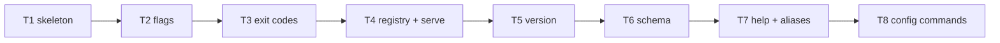

# F22 — CLI Skeleton Tasks

Spec: `specs/features/F22-cli-skeleton/SPEC.md` · Contracts: `specs/features/F22-cli-skeleton/CONTRACTS.md`

---

## Task F22-T1: package skeleton, entrypoint, root command

**Depends on:** — (feature start)

**Files:**
- create `cmd/which-model/main.go`
- create `pkg/whichmodel/root.go`
- create `pkg/whichmodel/root_test.go`

**Spec references:**
- `/Users/will/Projects/Software/which-model/specs/features/F22-cli-skeleton/SPEC.md` §1, §2, §3
- `/Users/will/Projects/Software/which-model/specs/global/SPEC.md` §5 (exit codes)

**Instructions:**
1. Write `pkg/whichmodel/root_test.go` FIRST with the test table below. The tests reference
   `whichmodel.ExecuteArgs` and `whichmodel.NewRootCmd`, which do not exist yet — the task
   must fail to compile at this point (red).
2. Create `pkg/whichmodel/root.go` (package `whichmodel`):
   - `const rootUse = "which-model"` (the display name is fixed; never derived from `os.Args[0]`).
   - `func NewRootCmd() *cobra.Command` — `Use: rootUse`, `SilenceErrors: true`,
     `SilenceUsage: true`, `CompletionOptions.DisableDefaultCmd: true`, no `Run` function,
     and `SetFlagErrorFunc(func(c *cobra.Command, err error) error { return &UsageError{Message: err.Error()} })`.
     Do NOT call `AddCommand` here; `registeredCommands()` is wired in T4 — for this task,
     add the commands returned by an empty `registeredCommands()` (returns nil safely).
   - `func ExecuteArgs(args []string) int` — parse nothing yet; call `root.Execute()` with
     `args`, then map `err` to an exit code: `0` when `err == nil` or `errors.Is(err, flag.ErrHelp)`;
     otherwise `1` (the full `ExitCodeFor` mapping lands in T3). Return the code.
   - `func Execute() int` — `return ExecuteArgs(os.Args[1:])`.
   - Render errors to `os.Stderr` with `fmt.Fprintln` for now (T3 switches to
     `output.WriteFailure`).
3. Create `cmd/which-model/main.go` (package `main`):
   `func main() { os.Exit(whichmodel.Execute()) }` with `import "github.com/WD-Mitchell/which-model/pkg/whichmodel"`.
4. Run the tests. Do not run formatters or linters.

**Test cases:**

| # | Test | Input | Expected |
|---|---|---|---|
| 1 | bare root prints help, exit 0 | `ExecuteArgs(nil)` | exit 0 |
| 2 | help flag | `ExecuteArgs([]string{"--help"})` | exit 0 |
| 3 | unknown command is a failure | `ExecuteArgs([]string{"nosuchcmd"})` | exit 1 (T3 changes to 2) |
| 4 | root name is fixed | `NewRootCmd().Use` | `"which-model"` |
| 5 | errors silenced | `NewRootCmd().SilenceErrors && NewRootCmd().SilenceUsage` | true |
| 6 | completion command disabled | command named `completion` absent from `NewRootCmd().Commands()` | true |

**Acceptance criteria:**
- [ ] `go test ./pkg/whichmodel/ ./cmd/which-model/` passes
- [ ] Test 1–2 pass; tests 3–6 pass as specified
- [ ] No `argv[0]` reading anywhere in `pkg/whichmodel`

**Go test:** `go test ./pkg/whichmodel/ ./cmd/which-model/`

---

## Task F22-T2: global persistent flags

**Depends on:** F22-T1

**Files:**
- create `pkg/whichmodel/flags.go`
- create `pkg/whichmodel/flags_test.go`

**Spec references:**
- `/Users/will/Projects/Software/which-model/specs/features/F22-cli-skeleton/SPEC.md` §4
- `/Users/will/Projects/Software/which-model/docs/plan/annex-d-cli-reference.md` §1.2, §1.6 rules 4–5

**Instructions:**
1. Write `flags_test.go` FIRST (red): table below.
2. Create `flags.go`:
   - `type GlobalFlags struct` exactly as in `CONTRACTS.md` §Global flags (all 18 fields).
   - `var Global GlobalFlags`.
   - `func (g *GlobalFlags) Bind(cmd *cobra.Command) error` — register each persistent flag
     on `cmd` with cobra's pflag (BoolVar/BoolVarP/DurationVar/StringVar/CountVar):
     `--json`, `--text`, `--max-age`, `--timeout` (default `10*time.Second`),
     `--quiet`, `--verbose` (count), `--no-color`, `--offline`, `--config`,
     `--refresh-usage`, `--refresh-benchmarks`, `--refresh-scores`, `--refresh`,
     `--no-usage`, `--show-identity`, `--schema`, `--normalizer` (default
     `"minmax-linear"`), `--aggregator` (default `"weighted-arithmetic-mean"`).
   - `func (g *GlobalFlags) Normalize() error` — if `g.Refresh`, set
     `g.RefreshUsage = g.RefreshBenchmarks = g.RefreshScores = true`. Return nil.
   - `func (g *GlobalFlags) Validate() error` — return `&UsageError{Message: ...}` when:
     `g.JSON && g.Text` → `"--json and --text are mutually exclusive"`;
     `g.Offline && g.Refresh` → `"--offline and --refresh are mutually exclusive"`;
     `g.Offline && g.RefreshBenchmarks` → `"--offline and --refresh-benchmarks are mutually exclusive"`.
     `--offline` + `--refresh-scores` alone is allowed. Return nil otherwise.
3. Wire `Bind` into `NewRootCmd()`: `PersistentFlags().AddFlagSet(...)` via `Global.Bind(cmd)`.
4. Run tests.

**Test cases:**

| # | Test | Input | Expected |
|---|---|---|---|
| 1 | defaults | fresh `GlobalFlags` | Timeout=10s, Normalizer="minmax-linear", Aggregator="weighted-arithmetic-mean", all bools false |
| 2 | normalize refresh | `{Refresh: true}` → `Normalize()` | RefreshUsage/RefreshBenchmarks/RefreshScores all true |
| 3 | normalize idempotent | `{RefreshUsage: true, Refresh: true}` → `Normalize()` | no change to already-true fields |
| 4 | validate json+text | `{JSON: true, Text: true}` | UsageError |
| 5 | validate offline+refresh | `{Offline: true, Refresh: true}` | UsageError |
| 6 | validate offline+benchmarks | `{Offline: true, RefreshBenchmarks: true}` | UsageError |
| 7 | validate offline+scores allowed | `{Offline: true, RefreshScores: true}` | nil |
| 8 | validate clean | `{RefreshScores: true}` | nil |
| 9 | bind registers timeout default | `Bind` then `cmd.PersistentFlags().Lookup("timeout").DefValue` | `"10s"` |
| 10 | bind registers all 18 | count of `cmd.PersistentFlags()` after `Bind` | 18 |

**Acceptance criteria:**
- [ ] All 10 tests pass; `Global.Bind` registers exactly the 18 annex-d §1.2 + `--text` flags
- [ ] `Normalize`/`Validate` error messages contain the flag names for diagnostics

**Go test:** `go test ./pkg/whichmodel/ -run Flags`

---

## Task F22-T3: exit codes and failure rendering

**Depends on:** F22-T2

**Files:**
- create `pkg/whichmodel/exitcode.go`
- edit `pkg/whichmodel/root.go` (wire `ExitCodeFor` + `CodeFor` + `output.WriteFailure`)
- create `pkg/whichmodel/exitcode_test.go`

**Spec references:**
- `/Users/will/Projects/Software/which-model/specs/features/F22-cli-skeleton/SPEC.md` §5, §6
- `/Users/will/Projects/Software/which-model/specs/global/CONTRACTS.md` §1.6
- `/Users/will/Projects/Software/which-model/specs/global/SPEC.md` §5

**Instructions:**
1. Write `exitcode_test.go` FIRST (red).
2. Create `exitcode.go`:
   - `type UsageError struct{ Message string }` with `func (e *UsageError) Error() string { return e.Message }`.
   - `type CodedError struct{ Code, Message string }` with `func (e *CodedError) Error() string { return e.Message }`.
   - `type ReportedError struct{ Err error }` with `func (e *ReportedError) Error() string { return e.Err.Error() }`
     and `func (e *ReportedError) Unwrap() error { return e.Err }`.
   - `var codedExit = map[string]int{...}` — the full global CONTRACTS §1.6 table:
     `unauthorized:5, expired_credential:5, login_required:5, credential_file:5,
     credential_json:5, unsafe_credential:5, access_denied:5, device_expired:5,
     cookie_unavailable:5, signing_failed:5, usage_disabled:2, usage_compiled_out:2`.
   - `func RegisterExitCode(code string, exit int)` — add to `codedExit` (mutex-guarded).
   - `func ExitCodeFor(err error) int` — `nil`→0; `*UsageError`→2; `*CodedError`→
     `codedExit[Code]` with default 1 for unknown codes; `*httpkit.Error`→
     `codedExit[Code]` with default 1 (F04's typed error; import `internal/httpkit`); error
     implementing `interface{ ExitCode() int }`→that value; `*ReportedError`→`ExitCodeFor(e.Err)`
     (unwrap); else 1.
   - `func CodeFor(err error) string` — `nil`→""; `*UsageError`→"arguments";
     `*CodedError`→Code; `*httpkit.Error`→Code; `*ReportedError`→`CodeFor(e.Err)`;
     `*config.ConfigError` (or any error with `ExitCode()==2` and no code)→"config"; else
     "error". Import `internal/config` and `internal/httpkit` for the type switches.
3. Edit `root.go`:
   - `ExecuteArgs` now calls `Global.Normalize()` and `Global.Validate()` before
     `root.Execute()` (Validate errors short-circuit with their own code).
   - On error: wrap cobra's unknown-command error (match `strings.HasPrefix(err.Error(),
     "unknown command \"")`) as `&UsageError{Message: err.Error()}`; then
     `code := CodeFor(err); exit := ExitCodeFor(err)`;
     `output.WriteFailure(os.Stderr, "which-model", code, err.Error())`;
     when `Global.JSON` AND the error is not a `*ReportedError` (whose stdout payload the
     command already wrote), also render the JSON error document to `os.Stdout`:
     `output.RenderJSON(os.Stdout, nil, map[string]any{"error": map[string]string{"code": code, "message": err.Error()}})`.
     Do not double-print: the failure line is the only stderr text.
   - `errors.Is(err, flag.ErrHelp)` and `err == nil` → exit 0, no output.
4. Run tests.

**Test cases:**

| # | Test | Input | Expected |
|---|---|---|---|
| 1 | nil | `ExitCodeFor(nil)` | 0 |
| 2 | usage error | `ExitCodeFor(&UsageError{})` | 2 |
| 3 | coded unauthorized | `ExitCodeFor(&CodedError{Code: "unauthorized"})` / `ExitCodeFor(&httpkit.Error{Code: "unauthorized", StatusCode: 401})` | 5 / 5 |
| 4 | coded usage_disabled | `ExitCodeFor(&CodedError{Code: "usage_disabled"})` | 2 |
| 5 | coded unknown | `ExitCodeFor(&CodedError{Code: "nope"})` | 1 |
| 6 | exit-code interface | `ExitCodeFor(&config.ConfigError{Kind: config.KindInvalidTOML})` | 2 |
| 7 | plain error | `ExitCodeFor(errors.New("boom"))` | 1 |
| 8 | registered code | `RegisterExitCode("no_viable_candidate", 3)` then `ExitCodeFor(&CodedError{Code: "no_viable_candidate"})` | 3 |
| 9 | CodeFor | `CodeFor(&UsageError{})` / `CodeFor(&CodedError{Code: "x"})` / `CodeFor(&config.ConfigError{})` / `CodeFor(errors.New("e"))` | "arguments" / "x" / "config" / "error" |
| 10 | reported exit | `ExitCodeFor(&ReportedError{Err: &CodedError{Code: "auth_required"}})` | 5 (unwrapped) |
| 11 | reported json suppressed | `ExecuteArgs` with a command returning `&ReportedError{Err: errors.New("boom")}` and `--json` | exit 1; stderr has failure line; stdout has NO JSON error document |
| 12 | failure line | `ExecuteArgs([]string{"nosuchcmd"})` | exit 2; stderr starts `which-model nosuchcmd: [arguments]` |

**Acceptance criteria:**
- [ ] All 12 tests pass; `ExecuteArgs` unknown-command now exits 2 (per CONTRACTS error table)
- [ ] Failure line format `which-model <command>: [<code>] <message>` matches annex-d §1.3
- [ ] `--json` error path renders the `{"schema_version":"2.0","error":{...}}` document on stdout except for `ReportedError`

**Go test:** `go test ./pkg/whichmodel/ -run 'Exit|Failure|Code'`

---

## Task F22-T4: command registry and serve placeholder

**Depends on:** F22-T3

**Files:**
- create `pkg/whichmodel/registry.go`
- create `pkg/whichmodel/serve_cmd.go`
- edit `pkg/whichmodel/root.go` (add `registeredCommands()` to the root)
- create `pkg/whichmodel/tree_test.go`

**Spec references:**
- `/Users/will/Projects/Software/which-model/specs/features/F22-cli-skeleton/SPEC.md` §2, §3, §10
- Main DECISION A (parent contract)

**Instructions:**
1. Write `tree_test.go` FIRST (red).
2. Create `registry.go`:
   - `type registrar struct{ name string; factory func() *cobra.Command }` — keep the name
     for deterministic ordering.
   - `var registrars []registrar`, `var buildOnce sync.Once`, `var built []*cobra.Command`.
   - `var commandOrder = []string{"usage","catalog","pick","routes","auth","schema","skills","hooks","explain","serve","config","version"}`.
   - `func register(factory func() *cobra.Command)` — append `{name: factory().Name(), factory: factory}`.
     Calling `factory()` twice is fine; `registeredCommands` re-invokes factories.
     Alternative accepted: wrap factories in a lazy closure. The observable contract is that
     `register` is called once per feature and `registeredCommands` returns every command.
   - `func registeredCommands() []*cobra.Command` — build once via `sync.Once`; stable-sort by
     `commandOrder` index (commands absent from the list sort last, then alphabetically by name);
     return `built`.
3. Create `serve_cmd.go`:
   - `func newServeCmd() *cobra.Command` — `Use: "serve"`, `Short: "serve the usage cache over HTTP (placeholder)"`,
     flags `--warm` (bool), `--interval` (duration, default `5*time.Minute`), `--listen`
     (string, default `":8099"`); `RunE` returns
     `&CodedError{Code: "serve_unavailable", Message: "serve is not available in this build; it requires the usage cache subsystem (F13) which lands in a later milestone"}`.
   - `func init() { register(newServeCmd) }`.
4. Edit `root.go`: in `NewRootCmd`, `cmd.AddCommand(registeredCommands()...)`.
5. Run tests.

**Test cases:**

| # | Test | Input | Expected |
|---|---|---|---|
| 1 | order respects commandOrder | names of `registeredCommands()` at F22 completion | `[schema, serve, config, version]` (positions 5, 10, 11, 12) |
| 2 | unknown name sorts last | register `newTestCmd` (`Use: "zzz"`) and `newTestCmd2` (`Use: "aaa"`) | "aaa" before "zzz", both after "version" |
| 3 | built once | two calls to `registeredCommands()` | same slice identity |
| 4 | root includes registry | `NewRootCmd().Commands()` | contains schema, serve, config, version |
| 5 | serve refusal exit | `ExecuteArgs([]string{"serve"})` | exit 1, stderr contains `[serve_unavailable]` |
| 6 | serve flags parse | `ExecuteArgs([]string{"serve", "--interval", "1m"})` | exit 1 (refusal after parse) |
| 7 | serve help shows flags | `ExecuteArgs([]string{"serve", "--help"})` | exit 0, output contains `--listen` |
| 8 | register is additive | after a later `init()` registers `usage`, `registeredCommands()` (fresh call) | includes usage at position 0 |

**Acceptance criteria:**
- [ ] All 8 tests pass; registry order matches `commandOrder` verbatim
- [ ] serve refusal body and exit match SPEC §10; no `AddCommand` calls outside root.go

**Go test:** `go test ./pkg/whichmodel/ -run Tree`

---

## Task F22-T5: version command

**Depends on:** F22-T4

**Files:**
- create `pkg/whichmodel/version_cmd.go`
- create `pkg/whichmodel/version_test.go`

**Spec references:**
- `/Users/will/Projects/Software/which-model/specs/features/F22-cli-skeleton/SPEC.md` §7, §8
- `/Users/will/Projects/Software/which-model/docs/plan/annex-d-cli-reference.md` §2.8

**Instructions:**
1. Write `version_test.go` FIRST (red).
2. Create `version_cmd.go`:
   - `var Version = "dev"`, `var Commit = "unknown"`, `var BuildDate = "unknown"` (ldflags targets).
   - `func VersionLine() string` → `fmt.Sprintf("which-model %s (commit %s, built %s)", Version, Commit, BuildDate)`.
   - `func VersionJSON() map[string]string` → `{"version": Version, "commit": Commit, "built_at": BuildDate}`.
   - `func NewVersionCmd() *cobra.Command` — `Use: "version"`, `Short: "print version information"`,
     `RunE`: when `Global.JSON` → `output.RenderJSON(os.Stdout, nil, VersionJSON())`, else
     `fmt.Fprintln(os.Stdout, VersionLine())`; return nil.
   - `func init() { register(NewVersionCmd) }`.
3. Add the `--version` short-circuit to `root.go` `ExecuteArgs`:
   - Before `Global.Normalize()`, scan `args` up to the first `"--"` for the exact tokens
     `"--version"` or `"--version=true"` (but not `"--version=false"`). When found:
     `fmt.Fprintln(os.Stdout, VersionLine())` (or the JSON doc when `--json` is also present)
     and return 0.
4. Run tests.

**Test cases:**

| # | Test | Input | Expected |
|---|---|---|---|
| 1 | version line format | `VersionLine()` with injected vars | `which-model 1.2.3 (commit abc, built 2026-08-07)` |
| 2 | defaults | fresh package vars | `dev` / `unknown` / `unknown` in line |
| 3 | version JSON | `VersionJSON()` | keys version, commit, built_at |
| 4 | short-circuit flag | `ExecuteArgs([]string{"--version"})` | exit 0, stdout == `VersionLine()` + newline |
| 5 | flag variant | `ExecuteArgs([]string{"--version=true"})` | exit 0 |
| 6 | false ignored | `ExecuteArgs([]string{"--version=false", "version"})` | exit 0, stdout == version line (command ran) |
| 7 | subcommand | `ExecuteArgs([]string{"version"})` | exit 0, same stdout as test 4 |
| 8 | json form | `ExecuteArgs([]string{"version", "--json"})` | exit 0, stdout parses as JSON with schema_version "2.0" and version/commit/built_at |

**Acceptance criteria:**
- [ ] All 8 tests pass; `--version` short-circuits before any command runs
- [ ] Version JSON carries the F03 envelope (schema_version, usage_enabled)

**Go test:** `go test ./pkg/whichmodel/ -run Version`

---

## Task F22-T6: schema registry, schema command, --schema hook

**Depends on:** F22-T5

**Files:**
- create `pkg/whichmodel/schema_cmd.go`
- edit `pkg/whichmodel/version_cmd.go` (register the version schema doc)
- create `pkg/whichmodel/schema_test.go`

**Spec references:**
- `/Users/will/Projects/Software/which-model/specs/features/F22-cli-skeleton/SPEC.md` §8, §9
- `/Users/will/Projects/Software/which-model/docs/plan/annex-d-cli-reference.md` §2.9

**Instructions:**
1. Write `schema_test.go` FIRST (red).
2. Create `schema_cmd.go`:
   - `var schemaDocs = map[string]map[string]any{}` (mutex-guarded).
   - `func RegisterSchema(cmdPath string, doc map[string]any)` — store a copy of `doc`.
   - `func SchemaIndex() []string` — sorted keys.
   - `func NewSchemaCmd() *cobra.Command` — `Use: "schema [command]"`, `Args: cobra.MaximumNArgs(1)`,
     `RunE`: no arg → `output.PrintSchemaIndex(os.Stdout, SchemaIndex())`; with arg `p` →
     look up `schemaDocs[p]`; found → `output.PrintSchema(os.Stdout, doc)`; missing →
     `&UsageError{Message: fmt.Sprintf("no schema for command %q", p)}`.
   - `func init() { register(NewSchemaCmd) }`.
3. Edit `version_cmd.go`: `init()` also calls
   `RegisterSchema("version", map[string]any{"type": "object", "properties": map[string]any{"schema_version": map[string]any{"const": "2.0"}, "version": map[string]any{"type": "string"}, "commit": map[string]any{"type": "string"}, "built_at": map[string]any{"type": "string"}}})`.
4. Add the `--schema` hook to `root.go` `ExecuteArgs`:
   - Helper `func schemaShortCircuit(args []string) (handled bool, code int)`:
     scan `args` up to the first `"--"` for the exact token `"--schema"` or `"--schema=true"`.
     If absent, return false. Remove the token; run `NewRootCmd().Find(remaining)` — on
     `Find` error return (true, 2). Build `path := strings.Join(remaining, " ")` (the found
     command path, e.g. `"config show"` — take it from the found command's `CommandPath()`);
     look up `schemaDocs[path]`; found → `output.PrintSchema(os.Stdout, doc)`, (true, 0);
     missing → `&UsageError{Message: fmt.Sprintf("no schema for command %q", path)}`, (true, 2).
   - `ExecuteArgs`: run the schema hook before `Global.Normalize()`; when handled, render the
     returned error (if any) exactly like T3 and return its exit code.
5. Run tests.

**Test cases:**

| # | Test | Input | Expected |
|---|---|---|---|
| 1 | index command | `ExecuteArgs([]string{"schema"})` | exit 0; stdout contains `version` |
| 2 | doc command | `ExecuteArgs([]string{"schema", "version"})` | exit 0; stdout JSON has `"type": "object"` |
| 3 | unknown path | `ExecuteArgs([]string{"schema", "nope"})` | exit 2; stderr has `[arguments]` |
| 4 | hook short-circuits | `ExecuteArgs([]string{"version", "--schema"})` | exit 0; stdout is the version doc (version not executed) |
| 5 | hook before flags | `ExecuteArgs([]string{"--schema"})` | exit 0; stdout is the index |
| 6 | hook unknown command | `ExecuteArgs([]string{"nope", "--schema"})` | exit 2 |
| 7 | hook respects terminator | `ExecuteArgs([]string{"--", "--schema"})` | exit 0; help text (flag not scanned) |
| 8 | index sorted | `SchemaIndex()` after registering `z` and `a` | `[a, version, z]` |
| 9 | doc registered twice | `RegisterSchema("version", doc2)` then `schema version` | shows doc2 (last write wins) |

**Acceptance criteria:**
- [ ] All 9 tests pass; `--schema` never executes the target command
- [ ] F22 registers schema docs for `version` only (config show joins in T8)

**Go test:** `go test ./pkg/whichmodel/ -run Schema`

---

## Task F22-T7: help golden test and alias invariance

**Depends on:** F22-T6

**Files:**
- create `pkg/whichmodel/help_test.go`
- create `pkg/whichmodel/testdata/help.golden`

**Spec references:**
- `/Users/will/Projects/Software/which-model/specs/features/F22-cli-skeleton/SPEC.md` §2, §3
- `/Users/will/Projects/Software/which-model/docs/plan/annex-d-cli-reference.md` §1.1, §1.1a

**Instructions:**
1. Run `go build -o /tmp/wm-test ./cmd/which-model` once and capture
   `/tmp/wm-test --help` output; save it verbatim as `pkg/whichmodel/testdata/help.golden`
   (the commands listed must be `schema, serve, config, version` in that order, then flags).
2. Write `help_test.go`:
   - `TestHelpGolden`: run `ExecuteArgs([]string{"--help"})` capturing stdout; compare with
     `testdata/help.golden` byte-for-byte. Use a buffer for stdout by having
     `ExecuteArgs` write through a package-level `var Stdout io.Writer = os.Stdout` and
     `var Stderr io.Writer = os.Stderr` (add these vars to root.go; tests swap them).
   - `TestAliasInvariance` (integration, deterministic): `t.TempDir()`; run
     `go build -o <tmp>/which-model ./cmd/which-model` (exec `go` from `os.Getenv("GOROOT")`/PATH
     with `cmd.Dir` = repo root); create symlinks `wm`, `wmodel`, `whichm` to the binary;
     exec the binary and each symlink with `["--help"]` and with `["version"]`; assert stdout
     is byte-identical across all three names for each argument set; assert `version` stdout
     starts with `which-model `.
3. Run tests (the golden must match exactly; if cobra's help changes with a v1.x patch, update
   the golden with a comment noting the cobra version).

**Test cases:**

| # | Test | Input | Expected |
|---|---|---|---|
| 1 | help golden | `ExecuteArgs(["--help"])` | stdout byte-equal to `testdata/help.golden` |
| 2 | help lists commands in order | golden contains `schema, serve, config, version` | order positions match commandOrder |
| 3 | alias help identical | `which-model --help` vs `wm --help` vs `wmodel --help` vs `whichm --help` (exec) | byte-identical stdout |
| 4 | alias version identical | same four names with `version` | byte-identical stdout, starts `which-model ` |
| 5 | alias failure self-identifies | `wm nosuchcmd` | stderr starts `which-model nosuchcmd:`; exit 2 |

**Acceptance criteria:**
- [ ] Golden test passes; no `argv[0]` reads (verified by tests 3–5)
- [ ] Build+exec integration test is deterministic (no network, no cache dependence)

**Go test:** `go test ./pkg/whichmodel/ -run 'Help|Alias'`

---

## Task F22-T8: config commands (show, set, path, validate)

**Depends on:** F22-T7

**Files:**
- create `pkg/whichmodel/config_cmd.go`
- create `pkg/whichmodel/output_config.go`
- edit `pkg/whichmodel/schema_cmd.go` init or `config_cmd.go` init (register the
  `config show` schema doc)
- create `pkg/whichmodel/config_cmd_test.go`

**Spec references:**
- `/Users/will/Projects/Software/which-model/specs/features/F22-cli-skeleton/SPEC.md` §11, §12
- `/Users/will/Projects/Software/which-model/docs/plan/annex-d-cli-reference.md` §2.7
- F01 consumption contract (`specs/features/F01-config/CONTRACTS.md`): `config.Load`,
  `LoadOptions{Path,Getenv,CWD,Home,GOOS}`, `(*Config).UnmarshalKey`, `(*Config).MarshalTOML`,
  `ResolvePaths`, `ConfigError`

**Instructions:**
1. Write `config_cmd_test.go` FIRST (red). Use `t.Setenv("HOME", tmp)` for all tests so
   `ResolvePaths` resolves into the temp dir; write fixture config files with the `write`
   helper of your test (`os.WriteFile`).
2. Create `output_config.go`:
   - `type OutputConfig struct { Color string \`toml:"color"\`; Timestamps string \`toml:"timestamps"\`; IdentityDefault bool \`toml:"identity_default"\` }`.
   - `func DefaultOutputConfig() OutputConfig` → `{"auto", "rfc3339", false}`.
   - `func loadOutputConfig(cfg *config.Config) (OutputConfig, error)` → decode into defaults
     via `cfg.UnmarshalKey("output", &x)`; return the error unwrapped.
3. Create `config_cmd.go`:
   - Shared loader `func loadConfig() (*config.Config, error)` →
     `config.Load(config.LoadOptions{Path: Global.ConfigPath})` (Getenv nil → os.Getenv).
   - `func NewConfigCmd() *cobra.Command` — `Use: "config"`, subcommands:
     - `show`: text → `tomlBytes, err := cfg.MarshalTOML()`; write to Stdout. `--json` →
       decode the TOML bytes into `map[string]any` (BurntSushi `toml.Unmarshal`), add
       `"_sources"` built from `config.ResolvePaths(runtime.GOOS, home, os.Getenv)`
       (`user_config_file, config_dir, cache_dir, state_dir`) plus `explicit_config` when
       `Global.ConfigPath != ""`, then `output.RenderJSON(Stdout, nil, payload)`.
     - `set`: `Args: cobra.ExactArgs(2)`; key/value from args. `parseTOMLValue(v)`:
       try `strconv.ParseInt` → int64; `strconv.ParseFloat` → float64; `strconv.ParseBool` →
       bool; else string. Validate key: non-empty, no empty dot segments, and the existing
       value (if any) at the target path must not be a `[]any` (array-key write → UsageError).
       Read the target file (user path or `Global.ConfigPath`); missing file → empty document;
       decode into `map[string]any`; set the nested key (create intermediate maps); `toml.Marshal`;
       write atomically: temp file in the same dir + `os.Rename` (create parent dirs with
       `os.MkdirAll`). Success: print `wrote <path>` to Stdout, exit 0.
     - `path`: print the resolved user config path (or `Global.ConfigPath` when set), one line.
     - `validate`: `cfg, err := loadConfig()`; also `loadOutputConfig(cfg)`; on error →
       print message to Stderr and return `errors.New(message)` (plain error → exit 1);
       success → `fmt.Fprintln(Stdout, "config is valid")`.
   - `func init() { register(NewConfigCmd) }` and
     `RegisterSchema("config show", map[string]any{"type": "object", ...})` (object with
     `schema_version` const, `_sources` object, `additionalProperties: true`).
4. Run tests.

**Test cases:**

| # | Test | Input | Expected |
|---|---|---|---|
| 1 | path command | `config path` with temp HOME, no `--config` | exit 0; stdout = `<tmp>/.config/which-model/config.toml` |
| 2 | path with --config | `config path --config <f>` | stdout = `<f>` |
| 3 | show text | fixture file with `[output] color = "never"`; `config show` | exit 0; stdout contains `[output]` and `color = "never"` |
| 4 | show json | same fixture; `config show --json` | stdout parses as JSON; `schema_version=="2.0"`; `_sources.user_config_file` ends with `config.toml` |
| 5 | set creates file | `config set output.color never` (no file) | file created; contents contain `[output]` and `color = "never"`; stdout `wrote <path>` |
| 6 | set preserves keys | existing file with `usage.enabled = false`; `config set output.color always` | file still has `usage.enabled = false` and new `color = "always"` |
| 7 | set value typing | `config set bands.weights.a 2` / `true` / `hello` | int64 2 / bool true / string "hello" in file |
| 8 | set bad key | `config set "" x` and `config set "a..b" x` | exit 2, `[arguments]` |
| 9 | set array key | fixture `bands.weights = [1,2]`; `config set bands.weights 3` | exit 2 |
| 10 | validate ok | valid fixture | exit 0; stdout `config is valid` |
| 11 | validate bad | fixture with `output.color = "neon"`-style invalid section (F01 rejects unknown keys) | exit 1; stderr non-empty |
| 12 | show schema doc | `config show --schema` and `schema config show` | exit 0; both stdout the same doc |

**Acceptance criteria:**
- [ ] All 12 tests pass; `config set` never corrupts unrelated keys (atomic temp+rename)
- [ ] `config validate` exits 1 on error (annex-d §2.7), show/set/path use the standard mappings
- [ ] F22 tree complete: `schema, serve, config, version`; `--help` golden unchanged

**Go test:** `go test ./pkg/whichmodel/ -run Config`
