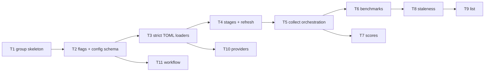

# F23 — Catalog Command Tasks

Spec: `specs/features/F23-cmd-catalog/SPEC.md` · Contracts: `specs/features/F23-cmd-catalog/CONTRACTS.md`

---

## Task F23-T1: catalog command group skeleton

**Depends on:** F22-T8 (registry + exit codes + config loading)

**Files:**
- create `pkg/whichmodel/catalog_cmd.go`
- create `pkg/whichmodel/catalog_cmd_test.go`

**Spec references:**
- `/Users/will/Projects/Software/which-model/specs/features/F23-cmd-catalog/SPEC.md` §1
- Main DECISION A (one registration unit per feature file)

**Instructions:**
1. Write `catalog_cmd_test.go` FIRST (red): the tests reference `whichmodel.NewCatalogCmd`,
   which does not exist yet.
2. Create `catalog_cmd.go` (package `whichmodel`):
   - `func NewCatalogCmd() *cobra.Command` — `Use: "catalog"`, `Short: "catalog refresh and views"`,
     `Args: cobra.NoArgs` (so an unknown subcommand produces cobra's unknown-command error,
     which F22 wraps as `UsageError` → exit 2). No subcommands yet (later tasks add them).
   - `func init() { register(NewCatalogCmd) }`.
3. Run the tests.

**Test cases:**

| # | Test | Input | Expected |
|---|---|---|---|
| 1 | registered in root tree | `NewRootCmd().Commands()` contains catalog | true |
| 2 | order position | catalog before `schema`, `serve`, `config`, `version` | true (commandOrder index 1) |
| 3 | bare catalog prints help | `ExecuteArgs([]string{"catalog"})` | exit 0 |
| 4 | unknown subcommand | `ExecuteArgs([]string{"catalog", "nosuch"})` | exit 2; stderr contains `[arguments]` |
| 5 | use string | `NewCatalogCmd().Use` | `"catalog"` |

**Acceptance criteria:**
- [ ] All 5 tests pass; the group registers through F22's registry, no `AddCommand` on root
- [ ] Unknown catalog subcommand exits 2 (F22 wrapping)

**Go test:** `go test ./pkg/whichmodel/ -run Catalog`

---

## Task F23-T2: catalog flags and [catalog] config schema

**Depends on:** F23-T1

**Files:**
- create `pkg/whichmodel/catalog_flags.go`
- create `pkg/whichmodel/catalog_config.go`
- create `pkg/whichmodel/catalog_flags_test.go`

**Spec references:**
- `/Users/will/Projects/Software/which-model/specs/features/F23-cmd-catalog/SPEC.md` §12, §13
- `/Users/will/Projects/Software/which-model/specs/features/F23-cmd-catalog/CONTRACTS.md` §catalog_config.go, §catalog_flags.go
- `/Users/will/Projects/Software/which-model/docs/plan/annex-b-catalog-port.md` §8
- F01 consumption: `cfg.UnmarshalKey("catalog", &x)` (decode-into-defaults, unknown keys rejected)
- F22 consumption: `whichmodel.Global` (`GlobalFlags{Refresh, RefreshBenchmarks, RefreshScores, RefreshUsage, Offline, Quiet}`)

**Instructions:**
1. Write `catalog_flags_test.go` FIRST (red).
2. Create `catalog_flags.go`:
   - `type catalogFlags struct` exactly as in `CONTRACTS.md` (Providers, ProviderConfig,
     Benchmarks, In, Out, Add, Reasoning, MinScore, Write, Check).
   - `func (f *catalogFlags) Bind(cmd *cobra.Command)` — registers `--provider` (StringArray),
     `--provider-config`, `--benchmarks`, `--in`, `--out`, `--add` (StringArray),
     `--reasoning` (StringArray), `--min-score` (Int, default 0), `--write`, `--check`.
   - `func stageSet(g *GlobalFlags, sub []Stage) []Stage` — union: `g.RefreshBenchmarks` adds
     `StageCollect`; `g.RefreshScores` adds `StageDerive`; then the `sub` stages; deduplicate;
     return in the canonical order `[StageCollect, StageDerive]` (only present stages).
     `--refresh-usage` adds nothing.
   - `func validateAdd(values []string) error` — every value must equal `"aa_page"`, else
     `&UsageError{Message: fmt.Sprintf("unknown --add value %q (supported: aa_page)", v)}`.
   - `func validateProviders(ids []string, configured map[string][]string) error` — unknown id
     → `&UsageError{Message: fmt.Sprintf("unknown provider %q (configured: %s)", id, strings.Join(sorted, ", "))}`.
   - `func validateWorkflowFlags(f *catalogFlags) error` — `f.Write != "" && f.Check != ""` →
     `&UsageError{Message: "--write and --check are mutually exclusive"}`.
3. Create `catalog_config.go`:
   - `type CatalogConfig` + `func DefaultCatalogConfig() CatalogConfig` per `CONTRACTS.md`
     (paths "", CacheTTL "24h", WarnOnStaleScores true).
   - `type ResolvedCatalog` per `CONTRACTS.md` (incl. `CatalogueCachePath`).
   - `func loadCatalogConfig(cfg *config.Config) (CatalogConfig, error)` —
     `c := DefaultCatalogConfig(); err := cfg.UnmarshalKey("catalog", &c); return c, err`.
   - `func resolveCatalogPaths(c CatalogConfig, paths config.Paths, cwd string) ResolvedCatalog`:
     raw = `c.RawCSVPath` or `filepath.Join(paths.CacheDir, "catalog", "available_model_raw_values.csv")`;
     scores likewise with `available_model_scores.csv`; cache = `filepath.Join(paths.CacheDir, "catalog", "modelsdev_providers.json")`;
     provider = `c.ProviderConfigPath` or `walkUp(cwd, "providers.toml")`; benchmark =
     `c.BenchmarkConfigPath` or `walkUp(cwd, "benchmarks.toml")`.
   - `func walkUp(start, name string) string` — walk `start` upward: at each directory, if
     `name` exists return its path; stop at the first directory containing `.git` (a directory
     named `.git` or a `.git` file) — return the found path or `""` (walking stops above the
     repo boundary). If no `.git` is found, walk to the filesystem root and return the first
     match (or `""`).
   - `func findRepoRoot(cwd string) string` — first dir from `cwd` upward containing `.git`
     (dir or file); `""` if none.
   - `func parseCacheTTL(s string) (time.Duration, error)` — `time.ParseDuration`; on error
     `&config.ConfigError{Kind: config.KindInvalidValue, Key: "catalog.cache_ttl", Err: err}`.
4. Run tests.

**Test cases:**

| # | Test | Input | Expected |
|---|---|---|---|
| 1 | single-flag stages | `stageSet(&GlobalFlags{RefreshBenchmarks: true}, nil)` / `{RefreshScores: true}` / `{RefreshUsage: true}` | `[StageCollect]` / `[StageDerive]` / empty |
| 2 | refresh both | `stageSet(&GlobalFlags{Refresh: true}, nil)` (pre-Normalize) | `[StageCollect, StageDerive]` |
| 3 | dedup with subcommand | `stageSet(&GlobalFlags{RefreshScores: true}, []Stage{StageDerive})` | `[StageDerive]` |
| 4 | union order | `stageSet(&GlobalFlags{RefreshBenchmarks: true}, []Stage{StageDerive})` | `[StageCollect, StageDerive]` |
| 5 | defaults | `loadCatalogConfig` on a config with no `[catalog]` | CacheTTL "24h", WarnOnStaleScores true, paths "" |
| 6 | overrides | config file with `[catalog] raw_csv_path = "a.csv" warn_on_stale_scores = false` | decoded |
| 7 | unknown key | config file with `[catalog] bogus = 1` | error (exit-2 class) |
| 8 | path defaults | `resolveCatalogPaths(default, Paths{CacheDir: "/tmp/x"}, "")` | raw/scores under `/tmp/x/catalog/`, cache `/tmp/x/catalog/modelsdev_providers.json` |
| 9 | walk-up | temp tree `tmp/.git/` + `tmp/providers.toml`, cwd `tmp/sub` | provider path `tmp/providers.toml`; without the file → `""`; `findRepoRoot("tmp/sub")` → `tmp` |
| 10 | cache ttl | `parseCacheTTL("24h")` / `parseCacheTTL("nope")` | 24h / error |
| 11 | add validation | `validateAdd(["aa_page"])` / `validateAdd(["nope"])` | nil / UsageError |
| 12 | workflow flags | `validateWorkflowFlags(&catalogFlags{Write: "a", Check: "b"})` / `{Write: "a"}` | UsageError / nil |

**Acceptance criteria:**
- [ ] All 12 tests pass; flag struct matches `CONTRACTS.md` verbatim
- [ ] `stageSet` dedupes and always returns canonical Collect-then-Derive order
- [ ] `walkUp`/`findRepoRoot` stop at the `.git` boundary

**Go test:** `go test ./pkg/whichmodel/ -run 'Flags|Stage|CatalogConfig|CacheTTL'`

---

## Task F23-T3: strict TOML loaders (providers.toml, benchmarks.toml)

**Depends on:** F23-T2

**Files:**
- edit `pkg/whichmodel/catalog_config.go` (add the two loaders)
- create `pkg/whichmodel/catalog_loaders_test.go`

**Spec references:**
- `/Users/will/Projects/Software/which-model/specs/features/F23-cmd-catalog/SPEC.md` §12
- `/Users/will/Projects/Software/which-model/specs/features/F23-cmd-catalog/CONTRACTS.md` §catalog_config.go
- `/Users/will/Projects/Software/which-model/docs/plan/annex-b-catalog-port.md` §6.3, §6.5, §9.4
- F01 consumption: `config.ConfigError`, `config.KindInvalidValue`

**Instructions:**
1. Write `catalog_loaders_test.go` FIRST (red). Fixtures are written to a temp dir with
   `os.WriteFile`; every strictness case is its own TOML string fixture.
2. Edit `catalog_config.go`:
   - `func loadProviderConfig(path string) (map[string][]string, error)` — decode with
     BurntSushi toml into `map[string]struct{ ExcludedModels []string \`toml:"excluded_models"\` } \`toml:"providers"\``
     keeping the `md, err := toml.Decode(...)` metadata. Reject: blank ids, blank excluded
     entries, duplicate excluded entries within one list (each its own error message naming
     the id), and undecoded keys (`md.Undecoded()` non-empty → `&config.ConfigError{Kind: config.KindInvalidValue, Path: path, Err: err}`).
     Missing file → `fmt.Errorf("provider config not found at %s: %w", path, err)`.
     Returns id → excluded model ids.
   - `func loadBenchmarkConfig(path string) ([]string, error)` — decode into
     `struct { Selection struct{ Groups, Benchmarks []string \`toml:"groups"\` } \`toml:"benchmark_selection"\`; Groups map[string]struct{ Benchmarks []string } \`toml:"benchmark_groups"\` }`.
     Reject: a selected group with no `[benchmark_groups.<name>]` table, blank entries and
     duplicate entries within one list (duplicates within a list are hard errors; the same
     name across two lists is legal), unknown keys (Undecoded).
     Expand: group lists in declared order, then the direct list, deduplicated keeping first
     occurrence. Missing file → `fmt.Errorf("benchmarks config not found at %s: %w", path, err)`.
3. Run tests.

**Test cases:**

| # | Test | Input | Expected |
|---|---|---|---|
| 1 | provider happy | `[providers.anthropic] excluded_models = ["grok-4.5"]` + `[providers.z]` with empty list | map with both ids; z has empty slice |
| 2 | provider blank id | `[providers.""] excluded_models = []` | error |
| 3 | provider blank excluded | `excluded_models = [""]` | error |
| 4 | provider duplicate excluded | `excluded_models = ["a", "a"]` | error |
| 5 | provider unknown key | `[providers.x] bogus = 1` | ConfigError (KindInvalidValue) |
| 6 | provider missing file | nonexistent path | error message starts `provider config not found at` |
| 7 | benchmark happy | 2 groups + direct list, one name in both group lists | expanded: group order then direct, deduped keep-first |
| 8 | benchmark group without table | `groups = ["g"]`, no `[benchmark_groups.g]` | error |
| 9 | benchmark duplicate in list | `benchmarks = ["a", "a"]` | error |
| 10 | benchmark blank entry | `benchmarks = [""]` | error |
| 11 | benchmark unknown key | `[benchmark_selection] nope = 1` | ConfigError |
| 12 | benchmark missing file | nonexistent path | error message starts `benchmarks config not found at` |

**Acceptance criteria:**
- [ ] All 12 tests pass; strictness matches annex-b §6.5/§9.4 (unknown keys, blank entries, intra-list duplicates all rejected)
- [ ] Expansion order is deterministic: declared group order, then direct list, keep-first dedupe

**Go test:** `go test ./pkg/whichmodel/ -run 'ProviderConfig|BenchmarkConfig'`

---

## Task F23-T4: stage runner and catalog refresh

**Depends on:** F23-T3

**Files:**
- create `pkg/whichmodel/catalog_stages.go`
- edit `pkg/whichmodel/catalog_cmd.go` (wire the `refresh` subcommand)
- create `pkg/whichmodel/refresh_test.go`

**Spec references:**
- `/Users/will/Projects/Software/which-model/specs/features/F23-cmd-catalog/SPEC.md` §3, §5, §7
- `/Users/will/Projects/Software/which-model/docs/plan/annex-d-cli-reference.md` §2.4
- Consumption: F08 `aa.LoadAAAPIKey`; F09 `score.ResolveNormalizer`/`ResolveAggregator`

**Instructions:**
1. Write `refresh_test.go` FIRST (red).
2. Create `catalog_stages.go`:
   - `type Stage int` with `StageCollect`/`StageDerive`; `type CollectOptions`, `CollectResult`,
     `DeriveOptions`, `DeriveResult`, `StageRunner`, `AAKeyResolver`, `stageReport` per `CONTRACTS.md`.
   - `func runStages(ctx, r StageRunner, resolveKey AAKeyResolver, repoRoot string, g *GlobalFlags, stages []Stage, co CollectOptions, do DeriveOptions) (stageReport, error)`:
     - reorder `stages` to fixed order Collect-then-Derive (dedupe);
     - for Collect: if `g.Offline` → `&UsageError{Message: "Collect requires network access; incompatible with --offline"}`;
       if `resolveKey == nil` default to `aa.LoadAAAPIKey`; `key, err := resolveKey(repoRoot)`; err →
       `&UsageError{Message: "ARTIFICIAL_ANALYSIS_API is not set; the Collect stage requires an Artificial Analysis API key"}`;
       `co.AAKey = key`; `res, err := r.Collect(ctx, co)`; err → return report, err;
     - for Derive: `res, err := r.Derive(ctx, do)`; err → return report, err.
   - `var newRunner = func() StageRunner { return &defaultRunner{} }` (test seam).
   - `type defaultRunner struct{}` with BOTH methods present: `Derive` fully implemented
     (steps below); `Collect` returns a `CodedError{Code: "collect_unwired", ...}` until T5
     replaces it (sequencing marker, replaced in F23-T5).
   - `defaultRunner.Derive`:
     1. `raw, err := security.ReadBoundedFile(o.InPath, csvstore.MaxCsvBytes)`; missing →
        `fmt.Errorf("raw CSV not found at %s; run 'which-model catalog benchmarks' (or '--refresh-benchmarks') to collect it", o.InPath)`.
     2. `bench, err := security.ReadBoundedFile(o.BenchmarksPath, maxConfigBytes)`; missing →
        `fmt.Errorf("benchmarks config not found at %s; provide benchmarks.toml or set catalog.benchmark_config_path", o.BenchmarksPath)`.
     3. `norm, err := resolveNormalizerName(o.Normalizer)`; `agg, err := resolveAggregatorName(o.Aggregator)`
        where both call the F09 resolvers and wrap unknown-name errors as `&UsageError{Message: err.Error()}`.
     4. `derived, err := score.Derive(raw, bench, norm, agg)`.
     5. if the file exists (`os.Stat` ok): `csvstore.Backup(o.OutPath, csvstore.DefaultBackupKeep)`.
     6. `csvstore.WriteAtomicBytes(o.OutPath, derived)`; `rows, err := countRows(derived)`.
     7. return `DeriveResult{Rows: rows, ScoresCSVPath: o.OutPath}`.
   - `const maxConfigBytes = 1 << 20`.
   - `func countRows(derived []byte) (int, error)` — split on `\n`; drop empty lines and lines
     starting with `#`; remaining count minus 1 (header); negative → error
     `"scores CSV output has no header line"`.
   - `func resolveNormalizerName(name string) (score.Normalizer, error)` /
     `func resolveAggregatorName(name string) (score.Aggregator, error)` per above.
3. Edit `catalog_cmd.go`:
   - Add the `refresh` subcommand: `Use: "refresh"`, flags bound from a `catalogFlags` instance;
     `RunE`:
     1. `cfg, err := loadConfig()`; `cc, err := loadCatalogConfig(cfg)`;
        `paths := config.ResolvePaths(runtime.GOOS, homeDir, os.Getenv)` (F01);
        `res := resolveCatalogPaths(cc, paths, cwd)`.
     2. `validateAdd(f.Add)`.
     3. when `len(f.Providers) > 0`: `providers, err := loadProviderConfig(res.ProviderConfigPath)`;
        `validateProviders(f.Providers, providers)`.
     4. `stages := stageSet(&Global, []Stage{StageCollect, StageDerive})`.
     5. `ttl, err := parseCacheTTL(cc.CacheTTL)` (invalid → exit-2 ConfigError);
        `report, err := runStages(ctx, newRunner(), nil, findRepoRoot(cwd), &Global, stages,
        CollectOptions{Providers: f.Providers, ProviderConfigPath: res.ProviderConfigPath,
        BenchmarksPath: f.Benchmarks or res.BenchmarkConfigPath, AddAAPage: addAA,
        OutPath: res.RawCSVPath, Timeout: Global.Timeout, CacheTTL: ttl,
        CatalogueCachePath: res.CatalogueCachePath},
        DeriveOptions{InPath: res.RawCSVPath, OutPath: f.Out or res.ScoresCSVPath,
        BenchmarksPath: f.Benchmarks or res.BenchmarkConfigPath,
        Normalizer: sc.Normalizer, Aggregator: sc.Aggregator})`
        where `addAA` = any value in `f.Add == "aa_page"`, and
        `sc := score.DefaultScoringConfig(); err := cfg.UnmarshalKey("scoring", &sc)` (F09's
        struct; use `sc.Normalizer` / `sc.Aggregator`).
     6. Text: Collect ran → `fmt.Fprintf(Stdout, "collected %d providers, %d models -> %s\n", ...)`;
        Derive ran → `fmt.Fprintf(Stdout, "derived %d rows -> %s\n", ...)`.
        JSON: build `map[string]any{"collect": {"providers":..., "models":..., "raw_csv_path":...}}`
        / `{"derive": {"rows":..., "scores_csv_path":...}}` for the stages that ran,
        `output.RenderJSON(Stdout, nil, payload)`.
   - `NewCatalogCmd` adds `refreshCmd`.
4. Run tests.

**Test cases:**

| # | Test | Input | Expected |
|---|---|---|---|
| 1 | order enforced | fake runner; `refresh` | collect before derive; defensive reorder test: `runStages` given `[StageDerive, StageCollect]` also runs collect first; report carries both results |
| 2 | collect failure aborts | fake runner failing Collect | exit 1; Derive never called |
| 3 | offline refusal | `refresh --offline` | exit 2; stderr exactly `which-model catalog refresh: [arguments] Collect requires network access; incompatible with --offline` |
| 4 | key refusal | fake resolver returning error | exit 2; stderr exactly `which-model catalog refresh: [arguments] ARTIFICIAL_ANALYSIS_API is not set; the Collect stage requires an Artificial Analysis API key` |
| 5 | key passed once | fake resolver records calls | exactly 1 call; captured CollectOptions.AAKey == resolved value |
| 6 | text output | fake results Providers=2, Models=21, Rows=39 | stdout `collected 2 providers, 21 models -> <path>` then `derived 39 rows -> <path>` |
| 7 | json output | same fake results, `--json` | object with `collect.providers==2`, `collect.models==21`, `derive.rows==39`, `schema_version=="2.0"` |
| 8 | flags passthrough | `--provider a --provider b --add aa_page --out x.csv --benchmarks b.toml` | captured opts match; Timeout == Global.Timeout; CacheTTL == parsed ttl |
| 9 | countRows | `"# which-model-scores-provenance raw_sha256=abc\nmodel,reasoning\nA,high\nB,low\n"` / `"model\n"` | 2, nil / 0, nil |
| 10 | unknown normalizer | `defaultRunner{}.Derive` with `Normalizer: "bogus"` | error (UsageError class) |
| 11 | derive missing raw | `defaultRunner{}.Derive` with nonexistent InPath | error message starts `raw CSV not found at` |
| 12 | derive missing bench | fixture raw file; nonexistent BenchmarksPath | error message starts `benchmarks config not found at` |

**Acceptance criteria:**
- [ ] All 12 tests pass; stage order and refusal messages match the annex-d goldens byte-for-byte
- [ ] `defaultRunner` never re-serializes F09 bytes (WriteAtomicBytes path)
- [ ] The `collect_unwired` marker is replaced in T5 (nothing ships with it)

**Go test:** `go test ./pkg/whichmodel/ -run 'Refresh|Stages|CountRows|Derive'`

---

## Task F23-T5: collect orchestration

**Depends on:** F23-T4

**Files:**
- create `pkg/whichmodel/catalog_collect.go`
- edit `pkg/whichmodel/catalog_stages.go` (replace `defaultRunner.Collect` body)
- create `pkg/whichmodel/collect_test.go`

**Spec references:**
- `/Users/will/Projects/Software/which-model/specs/features/F23-cmd-catalog/SPEC.md` §4, D7, D9, D20–D23
- `/Users/will/Projects/Software/which-model/docs/plan/annex-b-catalog-port.md` §2.2–§2.4, §3.3, §6.3, §9.4
- F06 consumption: `csvstore.Read`, `MergeRows`, `MergePartialRefresh`, `ValidateRawRows`, `Backup`, `WriteAtomic`
- F08 consumption: `modelsdev.FetchModelsDevProvidersFrom`, `modelsdev.FetchModelsDevBenchmarksFrom`, `aa.FetchAAv2`, `aa.FetchAAPage`

**Instructions:**
1. Write `collect_test.go` FIRST (red). Fixture pattern: `httptest.Server`s serving
   models.dev `api.json` (provider+model records), models.dev `models.json`
   (`<provider>/<slug>` → benchmark evidence), and AA v2 (envelope with slug-keyed items);
   the modelsdev fetch cores are driven through the `From(client, url)` variants with
   `httpkit.NewClient(httpkit.WithTimeout(2*time.Second))` pointed at the test servers.
   `buildFreshRows`/`mergeWithExisting`/cache helpers are unit tested directly with
   synthetic inputs.
2. Create `catalog_collect.go`:
   - `func buildFreshRows(catalogue []modelsdev.ProviderModel, benchmarks []modelsdev.BenchmarkRecord, aaModels []aa.AAModel, pages map[string]aa.PageMetrics, expandedNames []string) ([]csvstore.Row, error)`:
     - index AA models by `path.Base(slug)`; index benchmark evidence by
       `CanonicalID == Provider+"/"+ModelID` (fallback bare `ModelID`), per benchmark name →
       effort bucket → score (Effort "" applies to every level);
     - per catalogue model (skip `status == "deprecated"` defensively; levels =
       `EffortLevels` or `["high"]`): one row per level; `model` = `Name` (fallback `ModelID`);
       metric cells from the AA match (`IntelligenceIndex`, `CodingIndex`, `AgenticIndex`,
       `MedianResponseSeconds`, `CostPerTaskUSD` — decimal strings; nil → blank); page data
       fills `time_per_intelligence_index_task_seconds` / `cost_per_intelligence_index_task_usd`
       only when the API cells are blank;
     - benchmark columns: collect every key of `AAModel.Benchmarks` plus every expanded name
       with evidence; header = `csvstore.RawCoreColumns` + sorted benchmark columns; cell =
       AA value (decimal string) else models.dev evidence score for the row's effort bucket;
     - rows carry `Header` on every row; validate with `csvstore.ValidateRawRows` before return.
   - `func mergeWithExisting(existing []csvstore.Row, fresh []csvstore.Row, refreshedModelIDs []string) ([]csvstore.Row, error)`:
     empty `refreshedModelIDs` → `csvstore.MergeRows(existing, fresh)`; else
     `csvstore.MergePartialRefresh(existing, fresh, refreshedModelIDs, true)`.
   - cache helpers: `readCache(path) ([]modelsdev.ProviderModel, bool, error)` (json.Unmarshal;
     ok=false on missing), `writeCache(path, catalogue)` (temp file in same dir + rename,
     `json.Marshal`), `cacheFresh(path, ttl) bool` (`time.Since(mtime) < ttl`).
   - `func (defaultRunner) Collect(ctx, o CollectOptions) (CollectResult, error)`:
     1. `providers, err := loadProviderConfig(o.ProviderConfigPath)`; missing → its error.
     2. `names, err := loadBenchmarkConfig(o.BenchmarksPath)`; missing → its error.
     3. catalogue: `cacheFresh(o.CatalogueCachePath, o.CacheTTL)` → `readCache`; else
        `modelsdev.FetchModelsDevProvidersFrom(client, modelsdev.ProvidersURL)` +
        `writeCache` (client = `httpkit.NewClient(httpkit.WithTimeout(o.Timeout))`).
     4. `modelsdev.FetchModelsDevBenchmarksFrom(client, modelsdev.BenchmarksURL, names)`
        where `names` = the expanded benchmark names from step 2 (F08's `selectedNames`
        parameter — models are NOT filtered at fetch time; each returned `BenchmarkRecord`
        carries one model's evidence rows for the selected names).
     5. `aa.FetchAAv2(aa.AAV2Client(), o.AAKey)` (F08 pin: 403-only FreeURL fallback via
        `errors.As` on `*httpkit.Error` + `StatusCode == 403`; 401 → `unauthorized`, no
        fallback; message text never matched). When `o.AddAAPage`:
        `aa.FetchAAPage(aa.AAV2Client(), slug, false)` per model — page error → skip that model.
     6. `fresh, err := buildFreshRows(...)`; existing = `csvstore.Read(o.OutPath)` when the
        file exists (else nil);
        `merged, err := mergeWithExisting(existing, fresh, refreshedModelIDs)` where
        `refreshedModelIDs` = the subset's model ids when `len(o.Providers) > 0` else nil.
     7. if the file exists → `csvstore.Backup(o.OutPath, csvstore.DefaultBackupKeep)`;
        `csvstore.WriteAtomic(o.OutPath, merged, nil)`.
     8. `CollectResult{Providers: len(ids), Models: len(merged), RawCSVPath: o.OutPath}`.
   - Errors from F08 primitives propagate unchanged (F22's `ExitCodeFor` maps
     `*httpkit.Error` by its `Code` against the global §1.6 table: unauthorized → 5;
     other codes → 1).
3. Edit `catalog_stages.go`: `CollectOptions` gains `CacheTTL time.Duration` (documented in
   `CONTRACTS.md`); replace the `defaultRunner.Collect` marker body with a call into
   `catalog_collect.go`'s implementation.
4. Run tests. Do not run formatters or linters.

**Test cases:**

| # | Test | Input | Expected |
|---|---|---|---|
| 1 | happy merge | 1 catalogue model (2 levels) + matching AA item | 2 rows; AA metrics present; header = 8 core + benchmark columns |
| 2 | AA unmatched dropped | AA item with slug not matching any ModelID | not in rows |
| 3 | catalogue unmatched blank | model with no AA item | row with blank metric cells |
| 4 | benchmark priority | same name in AA map and models.dev evidence | AA value wins |
| 5 | effort scoped evidence | evidence with Effort "high" + row level "low" | blank for low row, value for high row; evidence with Effort "" applies to every level |
| 6 | expansion scoping | expandedNames excludes a name present in evidence | cell blank for excluded name |
| 7 | merge preserves existing | existing row with value, fresh blank cell (non-benchmark) | existing value kept (F06 MergeRows) |
| 8 | subset preserve | `refreshedModelIDs` non-empty | unselected model rows preserved via MergePartialRefresh |
| 9 | cache reuse | fresh cache within ttl | no second models.dev providers fetch (httptest request count for api.json == 1 across two collects); cache older than ttl → fetched again |
| 10 | fail-fast ordering | missing providers.toml | error before any HTTP request (server request count == 0) |
| 11 | backup + atomic write | existing raw file | `.bak` exists after collect; raw file replaced |
| 12 | counters | 2 providers, 5 merged rows | `Providers==2, Models==5` |

**Acceptance criteria:**
- [ ] All 12 tests pass; zero network calls and zero file mutation before all local validation passes (annex-b §9.4)
- [ ] The `collect_unwired` marker no longer exists anywhere

**Go test:** `go test ./pkg/whichmodel/ -run Collect`

---

## Task F23-T6: catalog benchmarks

**Depends on:** F23-T5

**Files:**
- edit `pkg/whichmodel/catalog_cmd.go` (wire the `benchmarks` subcommand)
- create `pkg/whichmodel/benchmarks_test.go`

**Spec references:**
- `/Users/will/Projects/Software/which-model/specs/features/F23-cmd-catalog/SPEC.md` §8
- `/Users/will/Projects/Software/which-model/docs/plan/annex-d-cli-reference.md` §2.3

**Instructions:**
1. Write `benchmarks_test.go` FIRST (red). Run the command with the `newRunner` seam replaced
   by a fake runner (collect-only path); the golden-message tests need no network.
2. Edit `catalog_cmd.go`:
   - Add `benchmarks` subcommand: `Use: "benchmarks"`, bound `catalogFlags`; `RunE`:
     same config/validation preamble as refresh (validateAdd, provider validation);
     `stages := stageSet(&Global, []Stage{StageCollect})`; `runStages` with Collect-only
     options (no AA page unless `--add aa_page`); text/JSON output for Collect only:
     `collected %d providers, %d models -> %s` / `{"providers": N, "models": M, "raw_csv_path": "..."}`.
     The staleness warning is NOT wired here yet (T8 adds it).
3. Run tests.

**Test cases:**

| # | Test | Input | Expected |
|---|---|---|---|
| 1 | happy text | fake result Providers=2, Models=21 | stdout `collected 2 providers, 21 models -> <raw>`; exit 0 |
| 2 | json shape | `--json` | `{"providers": 2, "models": 21, "raw_csv_path": "..."}` + envelope; no `derive` key |
| 3 | offline refusal | `benchmarks --offline` | exit 2; golden offline message |
| 4 | key refusal | fake resolver error | exit 2; golden key message |
| 5 | aa page | `--add aa_page` | captured CollectOptions.AddAAPage true |
| 6 | unknown add | `--add nope` | exit 2 `[arguments]`; no runner calls |
| 7 | provider passthrough | `--provider anthropic` | captured Providers `["anthropic"]` |
| 8 | scores not derived | fake runner | Derive never called |

**Acceptance criteria:**
- [ ] All 8 tests pass; benchmarks never derives (master plan: `--refresh-benchmarks` does NOT imply `--refresh-scores`)

**Go test:** `go test ./pkg/whichmodel/ -run Benchmarks`

---

## Task F23-T7: catalog scores (Derive stage)

**Depends on:** F23-T5

**Files:**
- edit `pkg/whichmodel/catalog_cmd.go` (wire the `scores` subcommand)
- create `pkg/whichmodel/scores_test.go`

**Spec references:**
- `/Users/will/Projects/Software/which-model/specs/features/F23-cmd-catalog/SPEC.md` §9
- `/Users/will/Projects/Software/which-model/docs/plan/annex-d-cli-reference.md` §2.4

**Instructions:**
1. Write `scores_test.go` FIRST (red). Fake runner for the command tests; the
   `defaultRunner.Derive` error-path tests use temp files (no network).
2. Edit `catalog_cmd.go`:
   - Add `scores` subcommand: `Use: "scores"`, bound `catalogFlags` (uses `--benchmarks`,
     `--in`, `--out`); `RunE`: config preamble; `stages := stageSet(&Global, []Stage{StageDerive})`;
     `runStages` with `DeriveOptions{InPath: f.In or res.RawCSVPath, OutPath: f.Out or res.ScoresCSVPath,
     BenchmarksPath: f.Benchmarks or res.BenchmarkConfigPath, Normalizer/Aggregator from [scoring]}`;
     text `derived %d rows -> %s`; JSON `{"rows": N, "scores_csv_path": "..."}`.
3. Run tests.

**Test cases:**

| # | Test | Input | Expected |
|---|---|---|---|
| 1 | happy text | fake result Rows=39 | stdout `derived 39 rows -> <path>`; exit 0 |
| 2 | json shape | `--json` | `{"rows": 39, "scores_csv_path": "..."}` + envelope; no `collect` key |
| 3 | offline allowed | `scores --offline` | exit 0; runner called |
| 4 | passthrough | `--in r.csv --out s.csv --benchmarks b.toml` | captured DeriveOptions match |
| 5 | missing raw | `defaultRunner{}.Derive` with nonexistent InPath | error message starts `raw CSV not found at` |
| 6 | missing bench | fixture raw file; nonexistent BenchmarksPath | error message starts `benchmarks config not found at` |
| 7 | unknown aggregator | fixture files; `Aggregator: "bogus"` | error (UsageError class) |
| 8 | backup called | fixture raw+bench, existing OutPath file, valid F09 fixture data | old file rotated (`.bak` exists) and new bytes written |
| 9 | row count reported | fake result | Rows value passes through untouched |

**Acceptance criteria:**
- [ ] All 9 tests pass; scores never collects (network never touched)
- [ ] `defaultRunner.Derive` backs up the existing scores file before `WriteAtomicBytes`

**Go test:** `go test ./pkg/whichmodel/ -run 'Scores|Derive'`

---

## Task F23-T8: staleness warning

**Depends on:** F23-T6

**Files:**
- edit `pkg/whichmodel/catalog_stages.go` (add `warnIfStale`)
- edit `pkg/whichmodel/catalog_cmd.go` (wire the warning into `benchmarks` RunE)
- create `pkg/whichmodel/staleness_test.go`

**Spec references:**
- `/Users/will/Projects/Software/which-model/specs/features/F23-cmd-catalog/SPEC.md` §6, D1
- `/Users/will/Projects/Software/which-model/docs/plan/annex-d-cli-reference.md` §1.6 rule 2
- F06 consumption: `csvstore.StaleCheck(scoresPath, rawPath) (bool, error)`,
  `csvstore.StaleWarning(scoresPath, rawPath) string`

**Instructions:**
1. Write `staleness_test.go` FIRST (red). Fixture pattern: write a raw CSV file `raw.csv`,
   compute `sha256(raw)`; write `scores.csv` with first line
   `# which-model-scores-provenance raw_sha256=<hex>` plus a dummy header/row line; replace
   `raw.csv` with different content to make it stale; fresh case = hash matches.
2. Edit `catalog_stages.go`:
   - `func warnIfStale(scoresPath, rawPath string, quiet bool, warnOnStale bool)` —
     return early when `quiet || !warnOnStale`; `stale, err := csvstore.StaleCheck(scoresPath, rawPath)`;
     on `err != nil` return silently; when `stale` →
     `output.WriteWarning(Stderr, csvstore.StaleWarning(scoresPath, rawPath))`.
3. Edit `catalog_cmd.go` — `benchmarks` RunE: after a successful Collect, when the scores file
   exists (`os.Stat` ok), call `warnIfStale(res.ScoresCSVPath, res.RawCSVPath, Global.Quiet, cc.WarnOnStaleScores)`.
4. Run tests.

**Test cases:**

| # | Test | Input | Expected |
|---|---|---|---|
| 1 | stale warning exact | stale fixtures; `warnIfStale(...)` | stderr exactly `warning: scores CSV is stale relative to raw CSV; run 'which-model catalog scores' (or '--refresh-scores') to rebuild` |
| 2 | fresh silent | matching hash fixtures | no output |
| 3 | provenance-unknown | scores.csv with no leading `#` line | no output (F06: not stale) |
| 4 | missing raw | scores exists, raw missing | no output (StaleCheck error suppressed) |
| 5 | quiet suppresses | stale fixtures, `quiet=true` | no output |
| 6 | config suppresses | stale fixtures, `warnOnStale=false` | no output |
| 7 | benchmarks integration | fake Collect ok + stale fixtures; `benchmarks` | exit 0; stderr has the warning; stdout has the collect line |

**Acceptance criteria:**
- [ ] All 7 tests pass; staleness NEVER changes the exit code (warning-only, D1)
- [ ] Warning text matches the annex-d §1.6 rule 2 wording exactly

**Go test:** `go test ./pkg/whichmodel/ -run Stale`

---

## Task F23-T9: catalog list

**Depends on:** F23-T8

**Files:**
- edit `pkg/whichmodel/catalog_cmd.go` (wire the `list` subcommand)
- create `pkg/whichmodel/list_test.go`

**Spec references:**
- `/Users/will/Projects/Software/which-model/specs/features/F23-cmd-catalog/SPEC.md` §10, D2, D18
- `/Users/will/Projects/Software/which-model/docs/plan/annex-d-cli-reference.md` §2.2
- F06 consumption: `csvstore.Read(path) (rows []Row, prov *Provenance, err error)`; F03 `RenderTable`

**Instructions:**
1. Write `list_test.go` FIRST (red). Fixture scores CSV (write via `os.WriteFile`):
   header `# which-model-scores-provenance raw_sha256=<sha of a matching raw fixture>` then
   `model,reasoning,intelligence_index,cost_per_intelligence_index_task_usd` and rows.
2. Edit `catalog_cmd.go`:
   - Add `list` subcommand: `Use: "list"`, bound `catalogFlags` (uses `--reasoning`, `--min-score`);
     `RunE`:
     1. config preamble; `stages := stageSet(&Global, nil)` — when stages non-empty run them
        first (e.g. `list --refresh-scores` derives, then lists).
     2. `rows, _, err := csvstore.Read(res.ScoresCSVPath)`; missing file (wrapped
        `os.ErrNotExist`) → `fmt.Errorf("scores CSV not found at %s; run 'which-model catalog refresh' (or '--refresh-scores') to generate it", res.ScoresCSVPath)` (exit 1).
     3. `warnIfStale(res.ScoresCSVPath, res.RawCSVPath, Global.Quiet, cc.WarnOnStaleScores)`.
     4. `listRows(rows, f.Reasoning, f.MinScore)` (helper in this task):
        - `val(row, "model")` etc. by exact header lookup (missing column → "" and the field is
          marked absent);
        - filters: reasoning — keep rows whose `reasoning` equals one of the given values;
          min-score — keep rows where `intelligence_index` parses via `decimal.Parse` (F02) and
          its integer part `>= f.MinScore`; blank/unparseable rows are dropped when the filter
          is active;
        - sort: parseable `intelligence_index` desc, ties by `model` asc; unparseable rows last.
     5. Text: `output.RenderTable(Stdout, []string{"model","reasoning","intelligence_index","cost_per_intelligence_index_task_usd"}, rows)` with `"-"` for absent values.
        JSON: emit the bare array yourself: marshal `[]map[string]string` (omit absent fields)
        with `json.Marshal` + newline (bare-array precedent, D6).
3. Run tests.

**Test cases:**

| # | Test | Input | Expected |
|---|---|---|---|
| 1 | text table | 2-row fixture | stdout has header `model reasoning intelligence_index cost_per_intelligence_index_task_usd` and both rows |
| 2 | json bare array | `--json` | stdout parses as JSON array (not an object); no schema_version key |
| 3 | default sort | rows with index 63.1, 20.0, 55.5 | order 63.1, 55.5, 20.0 |
| 4 | tiebreak | same index, models `B`, `A` | `A` before `B` |
| 5 | unparseable last | one row index `"abc"` | sorts after parseable rows; field omitted from JSON |
| 6 | reasoning filter | `--reasoning max --reasoning high` | only matching rows |
| 7 | min-score filter | `--min-score 50` | only rows with index >= 50; `--min-score 0` keeps all parseable |
| 8 | missing file | no scores CSV | exit 1; message starts `scores CSV not found at` |
| 9 | missing column | fixture without `cost_per_intelligence_index_task_usd` | text `-`, JSON omits the field |
| 10 | stale warning | stale fixtures | exit 0; stderr warning; stdout still lists |
| 11 | quiet list | stale fixtures + `--quiet` | no warning |
| 12 | global stage | `list --refresh-scores` with fake runner + fixture | derive ran once; list rendered from fixture |

**Acceptance criteria:**
- [ ] All 12 tests pass; list is read-only (no writes), exit 0 on staleness
- [ ] `--json` is a bare array per D6; field names match the annex-d §2.2 example

**Go test:** `go test ./pkg/whichmodel/ -run List`

---

## Task F23-T10: catalog providers

**Depends on:** F23-T3

**Files:**
- create `pkg/whichmodel/catalog_providers.go`
- edit `pkg/whichmodel/catalog_cmd.go` (wire the `providers` subcommand)
- create `pkg/whichmodel/providers_test.go`

**Spec references:**
- `/Users/will/Projects/Software/which-model/specs/features/F23-cmd-catalog/SPEC.md` §11, D3, D4, D5, D10
- `/Users/will/Projects/Software/which-model/docs/plan/annex-d-cli-reference.md` §2.5

**Instructions:**
1. Write `providers_test.go` FIRST (red).
2. Create `catalog_providers.go`:
   - `var cacheReader = readCache` (test seam; `func(string) ([]modelsdev.ProviderModel, bool, error)`).
   - `type providerRow struct{ ID string; Models []modelsdev.ProviderModel; Excluded []string }`.
   - `func renderProviders(configured map[string][]string, catalogue []modelsdev.ProviderModel, subset []string) ([]providerRow, error)`:
     - ids = sorted keys of `configured` (alphabetical, D3); `subset` applied after sorting
       (unknown ids already rejected by T2 validation);
     - per id: `Models` = catalogue models with `Provider == id` and `ModelID` not in
       `configured[id]`; `Excluded = configured[id]`.
   - `func providersText(w io.Writer, rows []providerRow)`: per row
     `fmt.Fprintf(w, "%-16s %-9s %s\n", r.ID, fmt.Sprintf("%d models", len(r.Models)), excludedText(r.Excluded))`
     where `excludedText` = `"0 excluded"` or `"N excluded (a, b)"` (comma-separated ids).
   - `func providersJSON(rows []providerRow) map[string]any`: `{id: [{id, name, reasoning}]}` per
     provider (reasoning = `EffortLevels`).
3. Edit `catalog_cmd.go`:
   - Add `providers` subcommand: `Use: "providers"`, bound `catalogFlags` (uses `--provider`,
     `--provider-config`); `RunE`:
     1. config preamble; `prov, err := loadProviderConfig(res.ProviderConfigPath)` — wrapped
        missing-file error → exit 1 (message from T3 loader); other errors → exit 2.
     2. `validateProviders(f.Providers, prov)`.
     3. `catalogue, ok, err := cacheReader(res.CatalogueCachePath)`; err → exit 1; `!ok` →
        `fmt.Errorf("provider catalogue not found at %s; run 'which-model catalog benchmarks' (or '--refresh-benchmarks') to collect it", res.CatalogueCachePath)`.
     4. `rows, err := renderProviders(prov, catalogue, f.Providers)`.
     5. Text: `providersText(Stdout, rows)`; JSON: `output.RenderJSON(Stdout, nil, providersJSON(rows))`.
4. Run tests.

**Test cases:**

| # | Test | Input | Expected |
|---|---|---|---|
| 1 | text exact | ids `anthropic` (12 models, 3 excluded), `github-copilot` (4 models, 1 excluded `grok-4.5`) | `anthropic       12 models   3 excluded` and `github-copilot   4 models   1 excluded (grok-4.5)` |
| 2 | no exclusions | excluded empty | `0 excluded` (no parens) |
| 3 | multi excluded | 2 entries | `2 excluded (a, b)` |
| 4 | sorted ids | fixture `zebra`, `alpha` | `alpha` row before `zebra` |
| 5 | json shape | 2 providers | `{"anthropic": [{"id":..., "name":..., "reasoning":[...]}]}` + envelope (schema_version 2.0) |
| 6 | provider subset | `--provider alpha` | only alpha row |
| 7 | missing config | no providers.toml | exit 1; message starts `provider config not found at` |
| 8 | missing cache | seam returns ok=false | exit 1; message starts `provider catalogue not found at` |
| 9 | missing from catalogue | id with no catalogue entry | `0 models` |
| 10 | excluded filtering | catalogue model id in excluded_models | not in Models; Excluded list kept |
| 11 | reasoning list | model with EffortLevels `["max","high"]` | JSON `"reasoning": ["max","high"]` |

**Acceptance criteria:**
- [ ] All 11 tests pass; providers never touches the network (read-only view, D4)
- [ ] Text columns match annex-d §2.5 byte-for-byte (`%-16s %-9s`)

**Go test:** `go test ./pkg/whichmodel/ -run Providers`

---

## Task F23-T11: catalog workflow stub

**Depends on:** F23-T2

**Files:**
- edit `pkg/whichmodel/catalog_cmd.go` (wire the `workflow` subcommand)
- create `pkg/whichmodel/workflow_test.go`

**Spec references:**
- `/Users/will/Projects/Software/which-model/specs/features/F23-cmd-catalog/SPEC.md` §14, D17
- `/Users/will/Projects/Software/which-model/docs/plan/annex-d-cli-reference.md` §2.6

**Instructions:**
1. Write `workflow_test.go` FIRST (red).
2. Edit `catalog_cmd.go`:
   - Add `workflow` subcommand: `Use: "workflow"`, bound `catalogFlags` (uses `--write`,
     `--check`, `--out`); `RunE`:
     1. `validateWorkflowFlags(f)` (T2 helper) — both set → UsageError exit 2.
     2. Return `&CodedError{Code: "workflow_unavailable", Message: "catalog workflow generation is provided by feature F30 (publishing)"}`
        (exit 1). No config loading, no runner calls.
3. Run tests.

**Test cases:**

| # | Test | Input | Expected |
|---|---|---|---|
| 1 | write refusal | `workflow --write wf.yaml` | exit 1; stderr contains `[workflow_unavailable]` and the F30 message |
| 2 | check refusal | `workflow --check wf.yaml` | exit 1; same code |
| 3 | both flags | `workflow --write a --check b` | exit 2 `[arguments]`; message `--write and --check are mutually exclusive` |
| 4 | json error doc | `workflow --write wf.yaml --json` | exit 1; stdout parses as JSON with `error.code == "workflow_unavailable"` |
| 5 | out accepted | `workflow --out dir --write wf.yaml` | exit 1 (refusal; flag parses) |
| 6 | no config side effects | `workflow --write wf.yaml` | config file untouched (no load performed) |

**Acceptance criteria:**
- [ ] All 6 tests pass; the stub performs no I/O beyond the refusal (F30 boundary, D17)

**Go test:** `go test ./pkg/whichmodel/ -run Workflow`
