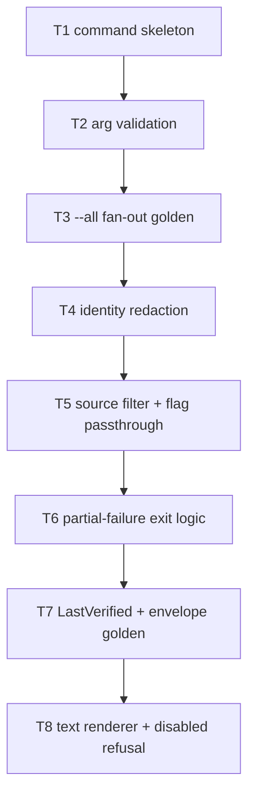

# F24 — cmd-usage: Tasks

## Task graph



## Task F24-T1: Create the usage command skeleton with argument parsing

**Depends on:** none (F14, F11, F01, F22, F03 are landed upstream)

**Files:**
- create `pkg/whichmodel/usage_cmd.go`
- create `pkg/whichmodel/usage_cmd_test.go`

**Spec references:** `specs/features/F24-cmd-usage/SPEC.md §2.1, §2.6, §3`, `specs/features/F24-cmd-usage/CONTRACTS.md §8.1` (pinned F22 API), `specs/global/CONTRACTS.md §1.6`

**Instructions:**
1. Write `usage_cmd_test.go` first (package `whichmodel`, white-box): it must fail to compile until `NewUsageCmd` exists. Tests that need globals set `whichmodel.Global` fields directly (e.g. `Global.JSON = true`) and restore them with `t.Cleanup(func() { Global = GlobalFlags{} })`.
2. Test 1: `registeredCommands()` contains a command whose `Name() == "usage"`.
3. Test 2: `NewUsageCmd()` has a bool flag `--all` defaulting to `false`, string flags `--source` and `--band-at-or-above` defaulting to `""`, and `Use == "usage [provider...]"`.
4. Test 3: calling `RunE` via `cmd.SetArgs(nil)` + `cmd.Execute()` with no args and no `--all` returns an error for which `ExitCodeFor(err) == 2` and whose message contains `no providers requested`.
5. Test 4: `--all` together with positional `claude` → `ExitCodeFor(err) == 2`, message contains `mutually exclusive`.
6. Test 5: positional `not-a-provider` → exit 2, message contains `unknown provider` and `valid providers:`.
7. Now create `usage_cmd.go` (package `whichmodel`, first line `//go:build !nousage`):
   - `func init() { register(NewUsageCmd) }` — no other registration calls.
   - `func NewUsageCmd() *cobra.Command` with `Use: "usage [provider...]"`, `Short: "Report provider usage allowances"`, local flags `--all` (bool), `--source` (string), and `--band-at-or-above` (string), `RunE: runUsageE`. Do NOT call `AddCommand` or bind root flags (F22 owns both).
   - `func runUsageE(c *cobra.Command, args []string) error`: assemble `UsageArgs` — `Providers: args`, `All`/`Source`/`BandAtOrAbove` from `c.Flags()`, and the rest from `Global`: `MaxAge: Global.MaxAge`, `ForceRefresh: Global.RefreshUsage`, `Timeout: Global.Timeout`, `Offline: Global.Offline`, `ShowIdentity: Global.ShowIdentity`, `JSON: Global.JSON`, `ConfigPath: Global.ConfigPath` — then `return RunUsage(a, c.OutOrStdout(), c.ErrOrStderr())`.
   - `func RunUsage(args UsageArgs, stdout, stderr io.Writer) error` (temporary home; moves to `usage.go` in T2) with the full argument-validation body per SPEC §2.6/§3:
     - `len(args.Providers) > 0 && args.All` → `&UsageError{Message: "--all and provider arguments are mutually exclusive"}`.
     - `len(args.Providers) == 0 && !args.All` → `&UsageError{Message: "no providers requested; name providers or pass --all"}`.
     - for each provider id: `usage.Get(id)`; when missing → `&UsageError{Message: fmt.Sprintf("unknown provider %q; valid providers: %s", id, strings.Join(validIDs(), ", "))}` where `validIDs()` returns every `usage.Descriptor.ID` from `usage.All()` in registry order.
     - otherwise return `nil` (fetch wiring lands in T3).
   - `UsageArgs` struct per F24 CONTRACTS §2 (it may live in `usage_cmd.go` for this task; T2 moves it to `usage.go`). `Source` is `usage.Source(v)` from the flag string.
   - Durations are NOT parsed here — F22's flag binding already produced `time.Duration` in `Global`; F22 validates duration syntax (SPEC §3 last row).
8. Run `go test ./pkg/whichmodel/...` and confirm all five test cases pass; then `go build ./pkg/whichmodel/...`.

**Test cases (write these first):**

| # | input | want |
|---|---|---|
| 1 | `registeredCommands()` | contains command named `usage` |
| 2 | `NewUsageCmd()` flags | `--all` bool default false, `--source` and `--band-at-or-above` strings default `""`, `Use == "usage [provider...]"` |
| 3 | `RunE` no args, no `--all` | exit 2 (`ExitCodeFor`), message contains `no providers requested` |
| 4 | `RunE` `--all` + `claude` | exit 2, message contains `mutually exclusive` |
| 5 | `RunE` `not-a-provider` | exit 2, message contains `unknown provider` and `valid providers:` |

**Acceptance criteria:**
- [ ] `go build ./pkg/whichmodel/...` succeeds
- [ ] `go test ./pkg/whichmodel/...` passes with the test cases above
- [ ] no file outside the Files list modified
- [ ] the command registers via `init()` only; no `AddCommand` and no `os.Exit` anywhere in the file

## Task F24-T2: Move command logic into usage.go and add --all provider expansion

**Depends on:** F24-T1

**Files:**
- create `pkg/whichmodel/usage.go`
- create `pkg/whichmodel/usage_args_test.go`
- edit `pkg/whichmodel/usage_cmd.go` (remove `RunUsage` and `UsageArgs`; keep `NewUsageCmd` and `runUsageE`)

**Spec references:** `specs/features/F24-cmd-usage/SPEC.md §2.3, §2.6`, `specs/features/F24-cmd-usage/CONTRACTS.md §2, §8.4`

**Instructions:**
1. Write `usage_args_test.go` first (package `whichmodel`).
2. Test 1 (move-over): re-run the T1 exit-2 cases through `RunUsage` directly (construct `UsageArgs{Providers: []string{"not-a-provider"}}`) — same messages as T1.
3. Test 2 (`--all` expansion): temp dir with `config.toml` containing `[providers.claude] enabled = true` and `[providers.codex] enabled = true`; call `resolveProviders(UsageArgs{All: true}, cfg)` → providers `[claude codex]` in config order.
4. Test 3: `[providers.claude] enabled = true`, `[providers.codex] enabled = false`, `[providers.copilot]` absent → `resolveProviders(All: true)` → `[claude]` only.
5. Test 4: positional order is preserved: `resolveProviders(UsageArgs{Providers: []string{"codex", "claude"}})` → `[codex claude]`.
6. Test 5: display names: `displayName("claude")` returns the registry `Descriptor.Name`; `displayName("no-such-id")` returns `"no-such-id"` (fallback, Decision D-9).
7. Now create `usage.go` (package `whichmodel`, NO build tag — compiles under `nousage` via F21 stubs):
   - Move `UsageArgs` and `RunUsage` here verbatim from `usage_cmd.go` (edit `usage_cmd.go` to delete them).
   - Add `func resolveProviders(args UsageArgs, cfg *config.Config) ([]string, error)`: when `args.All`, read every `providers.<id>.enabled` via `cfg.UnmarshalKey("providers."+id+".enabled", &v)` for each registry id and collect the enabled ones in registry order; else return `args.Providers` unchanged.
   - Add `func displayName(id string) string`: `d, ok := usage.Get(id); if !ok { return id }; return d.Name`.
   - `RunUsage` now: arg validation (as T1) → `cfg, err := config.Load(args.ConfigPath)` (on error: `&UsageError{Message: ...}` with the load error text) → `providers, err := resolveProviders(args, cfg)` → (fetch wiring lands in T3; return `nil` after successful resolution).
8. Run `go test ./pkg/whichmodel/...`; then `go build ./pkg/whichmodel/...`.

**Test cases (write these first):**

| # | input | want |
|---|---|---|
| 1 | `RunUsage(UsageArgs{Providers: []string{"not-a-provider"}})` | exit 2, message contains `unknown provider` |
| 2 | config: claude+codex enabled; `resolveProviders(All: true)` | `[claude codex]` |
| 3 | config: claude enabled, codex disabled, copilot absent; `All: true` | `[claude]` |
| 4 | `resolveProviders(Providers: []string{"codex", "claude"})` | `[codex claude]` |
| 5 | `displayName("claude")` vs `displayName("nope")` | registry name vs `"nope"` |
| 6 | `UsageArgs{All: true}` with empty config | `[]` providers (no error) |

**Acceptance criteria:**
- [ ] `go build ./pkg/whichmodel/...` succeeds
- [ ] `go test ./pkg/whichmodel/...` passes with the test cases above
- [ ] no file outside the Files list modified

## Task F24-T3: Wire F14 FetchAll and emit the --all fan-out JSON golden

**Depends on:** F24-T2

**Files:**
- create `pkg/whichmodel/usage_fetch_test.go`
- edit `pkg/whichmodel/usage.go`

**Spec references:** `specs/features/F24-cmd-usage/SPEC.md §2.5, §2.10`, `specs/features/F24-cmd-usage/CONTRACTS.md §2, §6, §8.2`, `specs/global/CONTRACTS.md §1.5, §6`

**Instructions:**
1. Write `usage_fetch_test.go` first. Use an injectable fetch seam: in `usage.go` declare `var fetchAllFunc = fetch.FetchAll`; tests override it.
2. Fake fetch: record the received `fetch.FetchAllOptions`, return a fixed `fetch.FetchResult{Snapshots: []usage.Snapshot{...}}` — build the claude snapshot from the SPEC §7 golden (`Provider: "claude"`, two windows: `{ID: "5h", Label: "five hour", Unit: usage.UnitPercent, UsedPercent: ptr(25.0), ResetsAt: t1}`, `{ID: "7d", Label: "seven day", Unit: usage.UnitPercent, UsedPercent: ptr(41.0)}`) and `LastVerified: nil`. (Helper `func f64(v float64) *float64` and `func tptr(s string) *time.Time` live in the test file.)
3. Test 1 (fan-out golden): `RunUsage(UsageArgs{All: true, JSON: true, ConfigPath: <temp config with claude+codex enabled>}, &out, &err)` with the fake returning one claude snapshot → return nil, `out` equals the JSON golden (see step 5) with a `snapshots` array containing exactly the claude snapshot and NO `last_verified` key.
4. Test 2 (options passthrough): `UsageArgs{Providers: []string{"claude"}, ForceRefresh: true, MaxAge: 90 * time.Minute, Timeout: 7 * time.Second, Offline: false}` → the fake's recorded options have `Providers == ["claude"]`, `ForceRefresh == true`, `MaxAge == 90m`, `Timeout == 7s`.
5. Implement `reportFromResult(res *fetch.FetchResult) *UsageReport` in `usage.go`: `&UsageReport{SchemaVersion: "2.0", UsageEnabled: true, Snapshots: res.Snapshots, LastVerified: res.LastVerified}`. Implement `emitJSON(report *UsageReport, stdout io.Writer) error`: `json.MarshalIndent(report, "", "  ")` + `"\n"` to stdout (field order follows struct order: schema_version, usage_enabled, snapshots, last_verified — verify the golden string against this order).
6. `RunUsage` now: after `resolveProviders`, if `args.JSON` → `res, err := fetchAllFunc(ctx, opts)` where `opts := FetchAllOptions{Providers: providers, Source: args.Source, ForceRefresh: args.ForceRefresh, MaxAge: args.MaxAge, Timeout: args.Timeout, Offline: args.Offline, IncludeIdentity: args.ShowIdentity}` (use `context.Background()`); on `err != nil` → `&CodedError{Code: "runtime", Message: err.Error()}` (unknown code → exit 1 via `ExitCodeFor`). Then `emitJSON(reportFromResult(res), stdout)`. Return `nil` (exit classification lands in T6). Text mode: for now also emit JSON (T8 replaces this with the text renderer).
7. Run `go test ./pkg/whichmodel/...`; then `go build ./pkg/whichmodel/...`.

**Test cases (write these first):**

| # | input | want |
|---|---|---|
| 1 | `All: true`, fake returns claude snapshot, `JSON: true` | stdout golden JSON, no `last_verified` key, return nil |
| 2 | `Providers: ["claude"], ForceRefresh, MaxAge 90m, Timeout 7s` | fake recorded exactly those options |
| 3 | fake returns `err: errors.New("boom")` | exit 1 (`ExitCodeFor`), error message contains `boom` |
| 4 | `JSON: false` (text mode placeholder) | stdout still contains `"schema_version"` (temporary; replaced in T8) |

**Acceptance criteria:**
- [ ] `go build ./pkg/whichmodel/...` succeeds
- [ ] `go test ./pkg/whichmodel/...` passes with the test cases above
- [ ] no file outside the Files list modified
- [ ] the golden string matches the struct field order exactly

## Task F24-T4: Identity redaction with canary test

**Depends on:** F24-T3

**Files:**
- create `pkg/whichmodel/usage_identity_test.go`
- edit `pkg/whichmodel/usage.go`

**Spec references:** `specs/features/F24-cmd-usage/SPEC.md §2.9`, `specs/global/SPEC.md §6.5, §6.7`

**Instructions:**
1. Write `usage_identity_test.go` first. Canary constant: `const canary = "CANARY-7f3a9c-IDENTITY"`.
2. Fake fetch returns a claude snapshot with `Account: canary`, `Plan: canary`, and a window label containing `canary` (labels are not identity — this asserts the redaction only ever strips `Account`, never mangles other fields).
3. Test 1 (default redaction): `RunUsage(UsageArgs{Providers: []string{"claude"}, JSON: true})` → stdout JSON does NOT contain `canary`, and does not contain `"account"`.
4. Test 2 (`--show-identity`): same but `ShowIdentity: true` → stdout JSON contains `"account": "CANARY-7f3a9c-IDENTITY"`.
5. Test 3 (token-in-failure): fake returns a snapshot whose `Failure.Message` is `"unauthorized: "+canary` (unsanitized upstream — F24 must not add it either; sanitization itself is F14's canary test, here we assert F24's renderer introduces nothing) — assert only that F24's own output path does not synthesize the canary when `Account` is empty and `Failure.Message` is non-empty (i.e. the message is passed through unchanged — this test documents the boundary, not a redaction guarantee).
6. Implement `redactIdentity(res *fetch.FetchResult, show bool)`: when `show == false`, copy each snapshot with `Account: ""` (shallow copy of the struct and its `Failure` pointer; do not mutate the caller's snapshots). Apply it in `RunUsage` before `reportFromResult`. When `show == true`, pass snapshots through unchanged.
7. Text mode: `FormatUsageText` does not exist yet — the account line behaviour is tested in T8; nothing to do here for text.
8. Run `go test ./pkg/whichmodel/...`; then `go build ./pkg/whichmodel/...`.

**Test cases (write these first):**

| # | input | want |
|---|---|---|
| 1 | fake snapshot `Account: canary`, `JSON: true`, no `--show-identity` | stdout lacks `canary` and `"account"` |
| 2 | same + `ShowIdentity: true` | stdout contains `"account": "CANARY-7f3a9c-IDENTITY"` |
| 3 | `Account` empty, `Failure.Message` contains canary | stdout contains the message verbatim (documented pass-through) |
| 4 | `redactIdentity(show=false)` does not mutate the input snapshot | caller's `Account` still set after call |

**Acceptance criteria:**
- [ ] `go build ./pkg/whichmodel/...` succeeds
- [ ] `go test ./pkg/whichmodel/...` passes with the test cases above
- [ ] no file outside the Files list modified
- [ ] canary never appears in default output (global SPEC §6.5)

## Task F24-T5: Validate --source and pass through fetch flags

**Depends on:** F24-T4

**Files:**
- create `pkg/whichmodel/usage_source_test.go`
- edit `pkg/whichmodel/usage.go`

**Spec references:** `specs/features/F24-cmd-usage/SPEC.md §2.4, §2.5, §3`, `specs/features/F24-cmd-usage/CONTRACTS.md §3, §4, §8.3`

**Instructions:**
1. Write `usage_source_test.go` first.
2. Test 1 (enum): `validateSource(usage.Source("bogus"))` → error message `invalid --source "bogus"; valid: oauth, api, cli, web, local, cache`.
3. Test 2 (valid enum): `validateSource(usage.SourceOAuth)` and `validateSource(usage.SourceCache)` → nil.
4. Test 3 (per-provider membership): for provider `claude` (real F11 registry descriptor), `validateProviderSource("claude", usage.SourceWeb)` → error containing `provider "claude" has no web source` and `valid sources:` when the descriptor's `AuthSources` lacks `web`; `validateProviderSource("claude", <first AuthSource>)` → nil.
5. Test 4 (cache passthrough): `RunUsage` with `Source: usage.SourceCache` → fake fetch receives `opts.Source == usage.SourceCache`.
6. Implement in `usage.go`: `var validSources = []usage.Source{usage.SourceOAuth, usage.SourceAPI, usage.SourceCLI, usage.SourceWeb, usage.SourceLocal, usage.SourceCache}`; `func validateSource(s usage.Source) error` (empty `s` = auto → nil); `func validateProviderSource(providerID string, s usage.Source) error` using `usage.Get(providerID).AuthSources` (when the source is unset, skip the check — the fallback chain applies).
7. Call both validators in `RunUsage` after `resolveProviders` and before the fetch: on error → `&UsageError{Message: err.Error()}`. The fetch call already passes `opts.Source` (wired in T3); confirm it.
8. Run `go test ./pkg/whichmodel/...`; then `go build ./pkg/whichmodel/...`.

**Test cases (write these first):**

| # | input | want |
|---|---|---|
| 1 | `validateSource("bogus")` | error listing the six valid values |
| 2 | `validateSource("oauth")`, `validateSource("cache")` | nil |
| 3 | `validateProviderSource("claude", "web")` (when web ∉ AuthSources) | error containing `has no web source` |
| 4 | `validateProviderSource("claude", <declared source>)` | nil |
| 5 | `RunUsage(Source: "cache")` | fake fetch `opts.Source == "cache"` |
| 6 | `RunUsage(Source: "bogus")` | exit 2, message contains `invalid --source` |

**Acceptance criteria:**
- [ ] `go build ./pkg/whichmodel/...` succeeds
- [ ] `go test ./pkg/whichmodel/...` passes with the test cases above
- [ ] no file outside the Files list modified

## Task F24-T6: Partial-failure exit logic (0 / 1 / 5)

**Depends on:** F24-T5

**Files:**
- create `pkg/whichmodel/usage_exit_test.go`
- edit `pkg/whichmodel/usage.go`

**Spec references:** `specs/features/F24-cmd-usage/SPEC.md §2.11, §3`, `specs/features/F24-cmd-usage/CONTRACTS.md §5`, `specs/global/CONTRACTS.md §1.6`

**Instructions:**
1. Write `usage_exit_test.go` first.
2. Define the auth-class set exactly: `var exitFiveCodes = map[string]bool{"unauthorized": true, "login_required": true, "expired_credential": true, "credential_file": true, "credential_json": true, "unsafe_credential": true, "access_denied": true, "device_expired": true, "cookie_unavailable": true, "signing_failed": true}` (SPEC §2.11; these are the canonical §1.6 codes F22 maps to exit 5).
3. Test 1 (mixed success): fake returns two snapshots — claude ok, codex with `Failure{Code: "unauthorized"}` → `RunUsage` return nil (exit 0) and both snapshots present in stdout JSON (failure inline).
4. Test 2 (all failed, non-auth): both snapshots carry `Failure{Code: "rate_limited"}` → returned error is `*CodedError` with `Code == "rate_limited"` and `ExitCodeFor(err) == 1`, stdout EMPTY.
5. Test 3 (all failed, one auth-class): snapshots with `rate_limited` and `unauthorized` → `Code == "unauthorized"`, `ExitCodeFor(err) == 5`, stdout EMPTY (Decision D-2).
6. Test 4 (all failed, pure auth): both `login_required` → `Code == "login_required"`, exit 5.
7. Test 5: exit classification is independent of `JSON` mode: same inputs with `JSON: false` produce the same exit code.
8. Test 6: on nonzero exit, stderr contains one per-provider failure line per failed provider (`[<code>] <message>`) — these per-provider diagnostics are F24's; the FINAL failure line is F22's render, never emitted by F24.
9. Implement `func classifyExit(snaps []usage.Snapshot) (*CodedError)`: count successes (`Failure == nil`); if any success → `nil`; else pick the first auth-class failure (in snapshot order) → `&CodedError{Code: thatCode, Message: thatMessage}`; else first failure → `&CodedError{Code: itsCode, Message: itsMessage}`. In `RunUsage`: classify BEFORE emitting; on nonzero, write per-provider failure lines to `stderr` (`fmt.Fprintf(stderr, "[%s] %s\n", f.Code, f.Message)`), write nothing to stdout, and return the error; on nil, emit normally.
10. Run `go test ./pkg/whichmodel/...`; then `go build ./pkg/whichmodel/...`.

**Test cases (write these first):**

| # | input | want |
|---|---|---|
| 1 | claude ok + codex `unauthorized` | return nil, both snapshots in stdout JSON |
| 2 | both `rate_limited` | `*CodedError{Code: "rate_limited"}`, exit 1, stdout empty, stderr has two `[rate_limited]` lines |
| 3 | `rate_limited` + `unauthorized` | `Code == "unauthorized"`, exit 5, stdout empty |
| 4 | both `login_required` | `Code == "login_required"`, exit 5 |
| 5 | same inputs, `JSON: false` | identical exit codes |
| 6 | `rate_limited` + `timeout` (no auth) | `Code == "rate_limited"`, exit 1 |

**Acceptance criteria:**
- [ ] `go build ./pkg/whichmodel/...` succeeds
- [ ] `go test ./pkg/whichmodel/...` passes with the test cases above
- [ ] no file outside the Files list modified
- [ ] stdout is empty on every nonzero exit in text mode (SPEC §2.13)

## Task F24-T7: LastVerified presence and JSON envelope golden

**Depends on:** F24-T6

**Files:**
- create `pkg/whichmodel/usage_json_test.go`
- edit `pkg/whichmodel/usage.go`

**Spec references:** `specs/features/F24-cmd-usage/SPEC.md §2.10, §2.14`, `specs/features/F24-cmd-usage/CONTRACTS.md §6`, `specs/global/CONTRACTS.md §6`

**Instructions:**
1. Write `usage_json_test.go` first.
2. Test 1 (envelope): `RunUsage(JSON: true)` with fake returning one claude snapshot and `LastVerified: map[string]time.Time{"claude": t}` → stdout golden:
   ```json
   {
     "schema_version": "2.0",
     "usage_enabled": true,
     "snapshots": [ ...claude snapshot JSON... ],
     "last_verified": { "claude": "2026-08-07T17:03:11Z" }
   }
   ```
   Compare robustly: `json.Unmarshal` both into `map[string]any`, assert field presence and values.
3. Test 2 (omitted when empty): fake returns `LastVerified: nil` → unmarshalled root has NO `last_verified` key (omitempty).
4. Test 3: unmarshalled root `schema_version == "2.0"`, `usage_enabled == true`, and NO `usage_disabled_reason` key.
5. Test 4: snapshot field fidelity — the emitted claude snapshot round-trips: `provider`, `windows[0].id`, `used_percent`, `resets_at`, `usage_known` match the canonical `usage.Snapshot` JSON tags (global CONTRACTS §1.5).
6. Test 5 (band filter): two successful snapshots with maximum known pressure 80% and 75%, default bands, `BandAtOrAbove: "critical"` → JSON retains only the 80% provider and removes the other provider from `last_verified`.
7. Test 6 (unknown band): `BandAtOrAbove: "missing"` → exit 2 before `fetchAllFunc`, message `invalid --band-at-or-above "missing"; valid: low, standard, elevated, critical`.
8. Implement the JSON envelope tags as above, then resolve `BandAtOrAbove` through F19 `band.FromTOML`, compute each successful snapshot's maximum known pressure across all windows using `band.WindowPercent`, and filter the snapshots in place after exit classification. Hard-gated pressure matches every threshold; unknown pressure does not. Keep `last_verified` aligned with the filtered snapshots.
9. Run `go test ./pkg/whichmodel/...`; then `go build ./pkg/whichmodel/...`.

**Test cases (write these first):**

| # | input | want |
|---|---|---|
| 1 | fake with `LastVerified: {claude: t}` | root has `last_verified.claude == "2026-08-07T17:03:11Z"` |
| 2 | fake with `LastVerified: nil` | no `last_verified` key |
| 3 | any success run | `schema_version == "2.0"`, `usage_enabled == true`, no `usage_disabled_reason` |
| 4 | claude snapshot round-trip | `provider`, `windows[0].id`, `used_percent`, `resets_at`, `usage_known` match canonical tags |
| 5 | snapshots at 80% and 75%, threshold `critical` | only the 80% provider remains |
| 6 | threshold `missing` | exit 2 before fetch; ordered valid-tier message |

**Acceptance criteria:**
- [ ] `go build ./pkg/whichmodel/...` succeeds
- [ ] `go test ./pkg/whichmodel/...` passes with the test cases above
- [ ] no file outside the Files list modified

## Task F24-T8: Text renderer golden and usage-disabled refusal

**Depends on:** F24-T7

**Files:**
- create `pkg/whichmodel/usage_text_test.go`
- edit `pkg/whichmodel/usage.go`

**Spec references:** `specs/features/F24-cmd-usage/SPEC.md §2.7, §2.8, §2.12`, `specs/features/F24-cmd-usage/CONTRACTS.md §7`

**Instructions:**
1. Write `usage_text_test.go` first.
2. Test 1 (golden): `FormatUsageText` with the SPEC §7 golden report (claude + codex blocks; use the snapshots from T3's fake plus a codex snapshot `{Provider: "codex", Windows: [{ID: "primary window", Label: "primary window", Unit: percent, UsedPercent: 12}, {ID: "credits", Label: "credits", Unit: credits, Remaining: 340}]}`) → exactly:
   ```
   Claude usage allowance
   - five hour: 25% used; 75% available; resets 2026-08-07T18:00:00Z
   - seven day: 41% used; 59% available
   
   Codex usage allowance
   - primary window: 12% used; 88% available; resets 2026-08-08T00:00:00Z
   - credits: 340 remaining
   ```
3. Test 2 (unlimited): window `{Label: "chat", Unlimited: true}` → `- chat: unlimited`.
4. Test 3 (remaining + total): window `{Label: "chat", Remaining: 1200, Limit: 4800}` → `- chat: 1200 remaining; 4800 total`.
5. Test 4 (reset hint): window with `ResetsAt: nil, ResetHint: "resets at midnight UTC"` → detail ends `resets at midnight UTC` (hint verbatim); window with `ResetHint: "midnight UTC"` → `resets midnight UTC`.
6. Test 5 (identity line): report with `Account` present + `showIdentity=true` → block ends `- account: <account>`; `showIdentity=false` → no account line and no account text anywhere.
7. Test 6 (number formatting): `UsedPercent: 25.0` → `25% used`; `UsedPercent: 12.5` → `12.5% used`.
8. Test 7 (disabled L0): `RunUsage(UsageArgs{Providers: []string{"claude"}, NoUsage: true})` → `*CodedError{Code: "usage_disabled"}`, `ExitCodeFor(err) == 2`, message `usage is disabled by --no-usage`.
9. Test 8 (disabled L1): temp config `[usage] enabled = false` → same code, message contains `usage is disabled by [usage] enabled = false`.
10. Implement in `usage.go`:
    - `FormatUsageText(report *UsageReport, showIdentity bool) string` per F24 CONTRACTS §7: header `displayName(provider) + " usage allowance"`, window lines with the fixed detail order, blank line between blocks, trailing newline after the last block; numbers via `strconv.FormatFloat(v, 'f', -1, 64)`; reset detail rule (SPEC §2.8); identity line rule (SPEC §2.9). `displayName` falls back to the provider id.
    - Add `NoUsage bool` to `UsageArgs`; `runUsageE` sets it from `Global.NoUsage`. `RunUsage` starts with the disabled check: if `args.NoUsage` → `&CodedError{Code: "usage_disabled", Message: "usage is disabled by --no-usage"}`; else load config and `UnmarshalKey("usage.enabled", &v)` (string, default `"auto"`); when `v == "false"` → `&CodedError{Code: "usage_disabled", Message: fmt.Sprintf("usage is disabled by [usage] enabled = false in %s", cfgPath)}` where `cfgPath` is the loaded config path.
    - Text mode in `RunUsage`: when `!args.JSON`, write `FormatUsageText(reportFromResult(redactIdentity(res, args.ShowIdentity)), args.ShowIdentity)` to stdout.
11. Run `go test ./pkg/whichmodel/...`; then `go build ./pkg/whichmodel/...`; then `go build -tags nousage ./pkg/whichmodel/...` (must compile — F21 stubs).

**Test cases (write these first):**

| # | input | want |
|---|---|---|
| 1 | claude+codex golden report | exact SPEC §7 text golden |
| 2 | window `Unlimited: true` | `- chat: unlimited` |
| 3 | `Remaining: 1200, Limit: 4800` | `- chat: 1200 remaining; 4800 total` |
| 4 | `ResetHint: "resets at midnight UTC"` / `"midnight UTC"` | hint verbatim / `resets midnight UTC` |
| 5 | account + showIdentity true/false | account line present / absent |
| 6 | `UsedPercent: 12.5` | `12.5% used` |
| 7 | `NoUsage: true` | `CodedError{Code: "usage_disabled"}`, exit 2, `usage is disabled by --no-usage` |
| 8 | config `[usage] enabled = false` | exit 2, message names the config key and path |

**Acceptance criteria:**
- [ ] `go build ./pkg/whichmodel/...` succeeds
- [ ] `go test ./pkg/whichmodel/...` passes with the test cases above
- [ ] no file outside the Files list modified
- [ ] `go build -tags nousage ./pkg/whichmodel/...` succeeds (F21 stubs)
