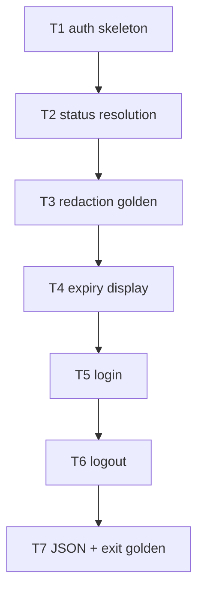

# F25 — cmd-auth: Tasks

## Task graph



## Task F25-T1: Create the auth command skeleton with three subcommands

**Depends on:** none (F22, F11, F12, F01, F05 are landed upstream)

**Files:**
- create `pkg/whichmodel/auth_cmd.go`
- create `pkg/whichmodel/auth_cmd_test.go`

**Spec references:** `specs/features/F25-cmd-auth/SPEC.md §2.1, §2.2`, F22 command-wiring contract (`pkg/whichmodel/registry.go`)

**Instructions:**
1. Write `auth_cmd_test.go` first (package `whichmodel`); it must fail to compile until `NewAuthCmd` exists.
2. Test 1: `registeredCommands()` contains a command named `auth`.
3. Test 2: `NewAuthCmd().Name() == "auth"`; `Use == "auth status|login|logout"`; subcommand names `["status", "login", "logout"]` in that order.
4. Test 3: `logout` exposes bool flag `--yes` (default false).
5. Test 4 (unknown provider, any subcommand): `status not-a-provider` → exit 2, message contains `unknown provider` and `valid providers:` (uses the real F11 registry).
6. Test 5 (missing subcommand): `auth` bare → cobra usage error, exit 2 (message contains `requires a subcommand`).
7. Create `auth_cmd.go` (`//go:build !nousage`, package `whichmodel`):
   - `func init() { register(NewAuthCmd) }`.
   - `func NewAuthCmd() *cobra.Command` — Use `auth status|login|logout`, Short `Manage provider credentials`; subcommands:
     - `status`: `Use: "status [provider...]"`, Args cobra.Arbitrary; `--show-identity` is a GLOBAL flag (read via `c.Flags()`), RunE → `RunAuthStatus(args, c.OutOrStdout(), c.ErrOrStderr())` where args are assembled from positionals + `c.Flags()` (`--json`, `--show-identity`, `--no-usage`).
     - `login`: `Use: "login <provider>"`, `Args: cobra.ExactArgs(1)`, RunE → `RunAuthLogin(args[0], c.OutOrStdout(), c.ErrOrStderr(), c.InOrStdin())`.
     - `logout`: `Use: "logout <provider>"`, `Args: cobra.ExactArgs(1)`, `--yes` flag, RunE → `RunAuthLogout(args[0], yes, c.OutOrStdout(), c.ErrOrStderr(), c.InOrStdin())`.
   - RunE bodies: parse → validate providers via `usage.Get` (return `&UsageError{...}` on unknown) → call the logic funcs (`RunAuthStatus` / `RunAuthLogin` / `RunAuthLogout` in `auth.go`). For this task the logic funcs are minimal real versions in `auth_cmd.go` that perform the provider validation and then return `nil` (status resolution lands in T2).
7. Run `go test ./pkg/whichmodel/...`; then `go build ./pkg/whichmodel/...`.

**Test cases (write these first):**

| # | input | want |
|---|---|---|
| 1 | `registeredCommands()` | contains command named `auth` |
| 2 | `NewAuthCmd()` shape | name `auth`, subcommands `[status login logout]` |
| 3 | `logout` flags | `--yes` bool, default false |
| 4 | `status not-a-provider` | exit 2, `unknown provider`, `valid providers:` |
| 5 | bare `auth` | exit 2, message contains `requires a subcommand` |

**Acceptance criteria:**
- [ ] `go build ./pkg/whichmodel/...` succeeds
- [ ] `go test ./pkg/whichmodel/...` passes with the test cases above
- [ ] no file outside the Files list modified
- [ ] the command registers via `init()` only

## Task F25-T2: Status resolution against the credential resolver

**Depends on:** F25-T1

**Files:**
- create `pkg/whichmodel/auth.go`
- create `pkg/whichmodel/auth_status_test.go`
- edit `pkg/whichmodel/auth_cmd.go` (remove the T1 logic bodies; keep command wiring)

**Spec references:** `specs/features/F25-cmd-auth/SPEC.md §2.1, §2.3`, `specs/features/F25-cmd-auth/CONTRACTS.md §8.2`, F12 `credential.ResolveFirst`

**Instructions:**
1. Write `auth_status_test.go` first. Use a test seam: in `auth.go` declare `var resolveFirstFunc = credential.ResolveFirst`; tests override it.
2. Test 1 (ok): fake returns `Resolved{Source: usage.SourceOAuth, Secret: "tok", ExpiresAt: &future, Account: "user@x"}` → entry `{Provider: "claude", Status: "ok", Source: ptr("oauth"), ExpiresAt: &future, Fingerprint: ptr("a1b2c3…9f0e")}` where the fingerprint is `Fingerprint("tok")`.
3. Test 2 (missing): fake returns `credential.ErrNoCredential` → `Status: "missing"`, `Source`/`Fingerprint` nil, `ExpiresAt` nil.
4. Test 3 (expired): fake returns `ExpiresAt: &past` → `Status: "expired"`, `ExpiresAt` still set to the past time.
5. Test 4 (no-args expansion): config with `[providers.claude] enabled = true`, `[providers.codex] enabled = true` → `RunAuthStatus(AuthStatusArgs{All: true, JSON: true, ConfigPath: <tmp>})` → JSON contains exactly `claude` and `codex` entries in config order.
6. Test 5 (explicit list): `Providers: ["copilot"]` → only the copilot entry (other providers resolved or not, only requested ones reported).
7. Create `auth.go` (package `whichmodel`, NO build tag):
   - `type AuthStatusArgs struct { Providers []string; All bool; ShowIdentity bool; JSON bool; ConfigPath string }`.
   - `func Fingerprint(secret string) string`: `sum := sha256.Sum256([]byte(secret)); h := hex.EncodeToString(sum[:]); return h[:6] + "…" + h[len(h)-4:]`.
   - `func resolveStatuses(args AuthStatusArgs) ([]StatusEntry, error)`: expand providers (`All` → enabled-per-config in registry order, reusing F24's `resolveProviders` helper if present, else the same `UnmarshalKey` loop), then per provider: `r, err := resolveFirstFunc(id)`; `err == credential.ErrNoCredential` → missing entry; other errors → return error wrapped with the provider id; else classify ok/expired by `ExpiresAt` vs `time.Now()`, set `Source: ptr(string(r.Source))`, `Fingerprint: ptr(Fingerprint(r.Secret))`, `Account: r.Account`.
   - `func RunAuthStatus(args AuthStatusArgs, stdout, stderr io.Writer) error`: resolve → render (JSON via `emitAuthJSON`, text via a minimal column renderer) → classify exit (0 all ok; 5 any missing/expired; failure line only for runtime errors). Text renderer: the T7 golden replaces this one; for now a correct-but-simple `tabwriter` renderer.
8. Run `go test ./pkg/whichmodel/...`; then `go build ./pkg/whichmodel/...`.

**Test cases (write these first):**

| # | input | want |
|---|---|---|
| 1 | fake ok credential, future expiry | `ok`, source `oauth`, fingerprint `a1b2c3…9f0e` for secret `tok` |
| 2 | `ErrNoCredential` | `missing`, nil source/fingerprint/expiry |
| 3 | past expiry | `expired`, past `expires_at` retained |
| 4 | `All: true`, config claude+codex enabled | entries exactly `[claude codex]` in config order |
| 5 | `Providers: ["copilot"]` | only copilot entry |
| 6 | resolver returns unexpected error | exit 1, message names the provider |

**Acceptance criteria:**
- [ ] `go build ./pkg/whichmodel/...` succeeds
- [ ] `go test ./pkg/whichmodel/...` passes with the test cases above
- [ ] no file outside the Files list modified
- [ ] `Fingerprint` output has shape `XXXXXX…YYYY` (6+4 hex chars)

## Task F25-T3: Redaction golden with canary

**Depends on:** F25-T2

**Files:**
- create `pkg/whichmodel/auth_redaction_test.go`
- edit `pkg/whichmodel/auth.go`

**Spec references:** `specs/features/F25-cmd-auth/SPEC.md §2.4`, `specs/global/SPEC.md §6.5, §6.7`, F05 `security.WithCanary`

**Instructions:**
1. Write `auth_redaction_test.go` first. Canary: `const tokenCanary = "ghp_CANARY-TOKEN-9f3a"`.
2. Test 1 (token never rendered): fake returns `Secret: tokenCanary`; `RunAuthStatus(JSON: true)` → stdout does NOT contain `tokenCanary`; the JSON `fingerprint` equals `Fingerprint(tokenCanary)` (derived form only).
3. Test 2 (account hidden by default): fake returns `Account: "secret-account-42"`; default run → stdout lacks `secret-account-42` and lacks `"account"`.
4. Test 3 (account with flag): `ShowIdentity: true` → JSON contains `"account": "secret-account-42"`.
5. Test 4 (text mode): default text run with `Secret: tokenCanary` → text lacks the canary and lacks `secret-account-42`.
6. Test 5 (failure path): resolver error message containing the canary → the failure line on stderr must NOT contain it (F25 sanitizes via `security.Sanitize` or equivalent before rendering; if F05's sanitizer is not yet available, redact any occurrence of the canary string itself — the test pins "no canary in output", the mechanism is F05's).
7. Implement: in `auth.go`, ensure `Fingerprint` is the only secret-derived output; account field population is gated on `args.ShowIdentity` in `resolveStatuses` (pass a `showIdentity bool` through); failure-line rendering runs the canary sanitizer (F05 `security.Sanitize` when available — see F05 CONTRACTS; otherwise the local `redactSecret(msg, secret)` helper defined in `auth.go` that replaces the exact secret string with `***`).
8. Run `go test ./pkg/whichmodel/...`; then `go build ./pkg/whichmodel/...`.

**Test cases (write these first):**

| # | input | want |
|---|---|---|
| 1 | `Secret: tokenCanary`, JSON | no canary; `fingerprint == Fingerprint(tokenCanary)` |
| 2 | `Account: "secret-account-42"`, default | no account text, no `"account"` key |
| 3 | same + `ShowIdentity: true` | `"account": "secret-account-42"` present |
| 4 | text mode + canary secret | no canary in text |
| 5 | resolver error contains canary | stderr failure line free of canary |

**Acceptance criteria:**
- [ ] `go build ./pkg/whichmodel/...` succeeds
- [ ] `go test ./pkg/whichmodel/...` passes with the test cases above
- [ ] no file outside the Files list modified
- [ ] canary absent from every output path (global SPEC §6.5)

## Task F25-T4: Expiry display in text output

**Depends on:** F25-T3

**Files:**
- create `pkg/whichmodel/auth_expiry_test.go`
- edit `pkg/whichmodel/auth.go`

**Spec references:** `specs/features/F25-cmd-auth/SPEC.md §2.5`, `specs/features/F25-cmd-auth/CONTRACTS.md §7`

**Instructions:**
1. Write `auth_expiry_test.go` first.
2. Test 1 (golden, fixed time): freeze time via an injectable clock (`var nowFunc = time.Now` in `auth.go`; override in tests). Statuses: claude ok/future, codex ok/no-expiry, copilot missing → `RunAuthStatus(JSON: false, Providers: [claude codex copilot])` → exact golden:
   ```
   claude   ok       oauth   a1b2c3…9f0e   (expires 2026-09-01T00:00:00Z)
   codex    ok       oauth   f6a4e1…77ab
   copilot  missing  -       -            -    run: which-model auth login copilot
   ```
   (tabwriter padding 2; `-` placeholders; hint only on missing.)
3. Test 2 (expired rendering): claude with past expiry → `(expired 2026-07-01T00:00:00Z)` instead of `(expires …)`.
4. Test 3 (account column): `ShowIdentity: true` → line ends `(account user@x)`; without the flag, no `(account` text.
5. Implement the text renderer in `auth.go` per CONTRACTS §7 (`text/tabwriter`, `padding = 2`, exact column order, `-` placeholders, hint column, expiry prefixes, account suffix). Replace the T2 minimal renderer.
6. Run `go test ./pkg/whichmodel/...`; then `go build ./pkg/whichmodel/...`.

**Test cases (write these first):**

| # | input | want |
|---|---|---|
| 1 | ok+future / ok+no-expiry / missing | exact golden block above |
| 2 | past expiry | `(expired <RFC3339>)` |
| 3 | `ShowIdentity: true` | `(account user@x)` suffix |
| 4 | default | no `(account` anywhere |

**Acceptance criteria:**
- [ ] `go build ./pkg/whichmodel/...` succeeds
- [ ] `go test ./pkg/whichmodel/...` passes with the test cases above
- [ ] no file outside the Files list modified

## Task F25-T5: Login orchestration

**Depends on:** F25-T4

**Files:**
- create `pkg/whichmodel/auth_login_test.go`
- edit `pkg/whichmodel/auth.go`

**Spec references:** `specs/features/F25-cmd-auth/SPEC.md §2.7, §2.8, §2.9`, `specs/features/F25-cmd-auth/CONTRACTS.md §8.2` (F12 `StartDeviceFlow`)

**Instructions:**
1. Write `auth_login_test.go` first. Seams: `var startDeviceFlowFunc = credential.StartDeviceFlow`; TTY detection seam `var stdinIsTTY = func() bool { return term.IsTerminal(int(os.Stdin.Fd())) }`; env seam `var nonInteractiveEnv = func() bool { return os.Getenv("WHICH_MODEL_NONINTERACTIVE") == "1" }`.
2. Test 1 (unattended refusal): `stdinIsTTY = false` → `RunAuthLogin("copilot", …)` → exit 2, message `refusing unattended login; run from an interactive terminal`; `startDeviceFlowFunc` never called (assert via a flag in the fake).
3. Test 2 (env refusal): TTY true, `nonInteractiveEnv = true` → same refusal.
4. Test 3 (device flow): TTY true; fake `StartDeviceFlow("copilot")` returns `DeviceFlow{Code: "WXYZ-1234", VerificationURI: "https://github.com/login/device"}` → stdout exactly `Open https://github.com/login/device and enter code WXYZ-1234.\n`, stderr contains `waiting for confirmation...`, exit nil.
5. Test 4 (unsupported provider): TTY true; provider `claude` (whose descriptor has no device flow — check `AuthSources`) → exit 2, message contains `not supported until M5` and `sign in with the provider's own client`; `startDeviceFlowFunc` never called.
6. Test 5 (flow error): TTY true, fake returns error → exit 1 with the error text.
7. Implement `RunAuthLogin(provider, stdout, stderr, stdin) error` in `auth.go`:
   - TTY + env refusal checks (exit 2 `arguments`).
   - `d, ok := usage.Get(provider)`; unknown → exit 2 (already validated in cmd layer; keep the guard).
   - Capability check: `supportsDeviceFlow(d)` — true iff `credential` registers a device flow for the id. For this task, the check is: the provider descriptor's `AuthSources` contains exactly the device-flow-capable set (Copilot). Implement `var deviceFlowProviderIDs = map[string]bool{"copilot": true}` keyed on the F11 descriptor ID, with a comment that F12's device-flow registry is the single source of truth when it lands; the test for `claude` uses the real registry.
   - `df, err := startDeviceFlowFunc(provider)`; on error → exit 1 `runtime`.
   - stdout: `fmt.Fprintf(stdout, "Open %s and enter code %s.\n", df.VerificationURI, df.Code)`; stderr: `waiting for confirmation...`.
   - Return nil (the wait/outcome handling is F12's `DeviceFlow.Wait`, owned by F12; F25's contract covers the prompt).
8. Run `go test ./pkg/whichmodel/...`; then `go build ./pkg/whichmodel/...`.

**Test cases (write these first):**

| # | input | want |
|---|---|---|
| 1 | non-TTY stdin | exit 2, refusal message, flow never started |
| 2 | TTY + `WHICH_MODEL_NONINTERACTIVE=1` | exit 2, refusal message |
| 3 | TTY + fake device flow | exact prompt line on stdout, `waiting for confirmation...` on stderr, exit nil |
| 4 | TTY + `claude` | exit 2, `not supported until M5`, flow never started |
| 5 | TTY + flow error | exit 1, error text on stderr |

**Acceptance criteria:**
- [ ] `go build ./pkg/whichmodel/...` succeeds
- [ ] `go test ./pkg/whichmodel/...` passes with the test cases above
- [ ] no file outside the Files list modified
- [ ] no token or code appears outside the prompt line

## Task F25-T6: Logout orchestration

**Depends on:** F25-T5

**Files:**
- create `pkg/whichmodel/auth_logout_test.go`
- edit `pkg/whichmodel/auth.go`

**Spec references:** `specs/features/F25-cmd-auth/SPEC.md §2.10, §2.11`, `specs/features/F25-cmd-auth/CONTRACTS.md §8.2, §8.3` (F12 `Remove`, F05 `HasBroadPermissions`)

**Instructions:**
1. Write `auth_logout_test.go` first. Seams: `var removeFunc = credential.Remove`, `var hasBroadPermsFunc = security.HasBroadPermissions`.
2. Test 1 (confirmed removal): fake `Remove` returns nil → exit nil; prompt output `Remove which-model's cached credential for claude? [y/N] ` then removal; when stdin yields `y\n` → no `aborted`.
3. Test 2 (declined): stdin `n\n` → `Remove` NOT called, stderr `aborted`, exit 0.
4. Test 3 (unattended without --yes): `stdinIsTTY = false`, `yes = false` → exit 2, `refusing unattended logout without --yes`, `Remove` not called.
5. Test 4 (nothing removable): fake `Remove` returns `credential.ErrNoCredential` (sentinel re-exported from F12) → stderr `no which-model-managed credential for claude; nothing to remove`, exit 0.
6. Test 5 (permission warning): fake `ResolveFirst` returns `FileMode: 0o644` and `HasBroadPermissions(0o644) == true` → stderr contains exactly one line `Warning: <path> permissions are broader than 0600; review them.`, removal still happens, exit 0. `<path>` is `Resolved.Path`.
7. Test 6 (removal error): fake `Remove` returns `errors.New("rm failed")` → exit 1, `[runtime] rm failed`.
8. Implement `RunAuthLogout(provider string, yes bool, stdout, stderr io.Writer, stdin io.Reader) error` in `auth.go`:
   - TTY gate: `!yes && !stdinIsTTY()` → exit 2.
   - Prompt on stdout when `!yes`: `Remove which-model's cached credential for <provider>? [y/N] `; read one line from stdin via `bufio`; anything not `y`/`yes` (case-insensitive) → stderr `aborted`, return nil.
   - Resolve first (`resolveFirstFunc`) to learn `Path`/`FileMode` for the warning; missing credential → `nothing to remove` message, exit 0.
   - If `hasBroadPermsFunc(FileMode)` → exactly one warning line on stderr (never chmod/chown).
   - `err := removeFunc(provider)`; `errors.Is(err, credential.ErrNoCredential)` → nothing-to-remove message, exit 0; other errors → exit 1 `runtime`.
9. Run `go test ./pkg/whichmodel/...`; then `go build ./pkg/whichmodel/...`.

**Test cases (write these first):**

| # | input | want |
|---|---|---|
| 1 | TTY + `y` | prompt then removal, exit 0 |
| 2 | TTY + `n` | no removal, stderr `aborted`, exit 0 |
| 3 | non-TTY, no `--yes` | exit 2, refusal, no removal |
| 4 | `Remove` → `ErrNoCredential` | `nothing to remove`, exit 0 |
| 5 | `FileMode 0o644` broad | exactly one warning line, removal still runs, exit 0 |
| 6 | `Remove` → error | exit 1, `[runtime]` line |

**Acceptance criteria:**
- [ ] `go build ./pkg/whichmodel/...` succeeds
- [ ] `go test ./pkg/whichmodel/...` passes with the test cases above
- [ ] no file outside the Files list modified
- [ ] no chmod/chown call anywhere in `auth.go` (grep for `Chmod|Chown` must return nothing)

## Task F25-T7: Status JSON + exit-code golden

**Depends on:** F25-T6

**Files:**
- create `pkg/whichmodel/auth_json_test.go`
- edit `pkg/whichmodel/auth.go`

**Spec references:** `specs/features/F25-cmd-auth/SPEC.md §2.6, §2.12, §2.14`, `specs/features/F25-cmd-auth/CONTRACTS.md §6, §7`

**Instructions:**
1. Write `auth_json_test.go` first.
2. Test 1 (JSON golden): fake: claude ok (oauth, future expiry, fingerprint `a1b2c3…9f0e`), copilot missing → `RunAuthStatus(JSON: true)` stdout equals (compare after `json.Unmarshal` into `any` + re-marshal, or exact string):
   ```json
   {
     "schema_version": "2.0",
     "usage_enabled": true,
     "providers": [
       {"provider": "claude", "status": "ok", "source": "oauth", "expires_at": "2026-09-01T00:00:00Z", "fingerprint": "a1b2c3…9f0e"},
       {"provider": "copilot", "status": "missing", "source": null, "fingerprint": null}
     ]
   }
   ```
   Note: `expires_at` present for claude, ABSENT for copilot (omitempty); `source`/`fingerprint` explicit `null` for copilot.
3. Test 2 (exit 5): one `missing` provider → `ExitCode` 5, stdout still carries the full JSON report.
4. Test 3 (exit 0): all ok → exit 0, stdout carries the report.
5. Test 4 (expired → exit 5): one `expired` → exit 5.
6. Test 5 (usage disabled L0): `RunAuthStatus(NoUsage: true)` → exit 2, message contains `usage is disabled by --no-usage`, stdout EMPTY.
7. Test 6 (usage disabled L1): config `[usage] enabled = false` → exit 2, message names `[usage] enabled = false`, stdout empty.
8. Implement in `auth.go`:
   - `emitAuthJSON(report *AuthStatusReport, stdout io.Writer) error` — `json.MarshalIndent(report, "", "  ")` + `"\n"`; struct tags per CONTRACTS §6 (`expires_at,omitempty`, explicit nulls for `source`/`fingerprint` via pointer fields).
   - `RunAuthStatus` exit classification: all ok → nil (exit 0); any expired → `&ReportedError{Err: &CodedError{Code: "expired_credential", Message: "provider(s) without usable credentials; run which-model auth status"}}`; else any missing → same with `Code: "login_required"` (both map to exit 5 via F22; `ReportedError` keeps the report on stdout — the JSON error document is suppressed because the report IS the deliverable, F22 CONTRACTS §exitcode). Runtime resolution errors → `&CodedError{Code: "runtime", Message: ...}` (exit 1, error doc renders).
   - Disabled check at the top of `RunAuthStatus`: `Global.NoUsage` or config `usage.enabled == "false"` → `&CodedError{Code: "usage_disabled", ...}` with the source-naming message (SPEC §2.13).
9. Run `go test ./pkg/whichmodel/...`; then `go build ./pkg/whichmodel/...`; then `go build -tags nousage ./pkg/whichmodel/...`.

**Test cases (write these first):**

| # | input | want |
|---|---|---|
| 1 | ok+missing mix, JSON | exact golden above (incl. null vs omitted fields) |
| 2 | one missing | exit 5, JSON on stdout |
| 3 | all ok | exit 0, JSON on stdout |
| 4 | one expired | exit 5 |
| 5 | `NoUsage: true` | exit 2, `usage is disabled by --no-usage`, empty stdout |
| 6 | config `enabled = false` | exit 2, message names the key, empty stdout |

**Acceptance criteria:**
- [ ] `go build ./pkg/whichmodel/...` succeeds
- [ ] `go test ./pkg/whichmodel/...` passes with the test cases above
- [ ] no file outside the Files list modified
- [ ] `go build -tags nousage ./pkg/whichmodel/...` succeeds
