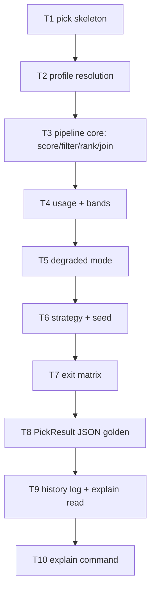

# F26 — cmd-pick: Tasks

## Task graph

## Task F26-T1: Create the pick command skeleton

**Depends on:** none (F22, F21, F20, F18, F19, F14, F10, F01 are landed upstream)

**Files:**
- create `pkg/whichmodel/pick_cmd.go`
- create `pkg/whichmodel/pick_cmd_test.go`

**Spec references:** `specs/features/F26-cmd-pick/SPEC.md §2.1`, `specs/features/F26-cmd-pick/CONTRACTS.md §3, §4, §8.1`

**Instructions:**
1. Write `pick_cmd_test.go` first (package `whichmodel`); must fail to compile until `NewPickCmd` exists.
2. Test 1: `registeredCommands()` contains `pick`.
3. Test 2: `NewPickCmd()` flags: `--profile` string `""`, `--task-category` string `""`, `--complexity` string `""`, `--strategy` string `""`, `--available` string slice `[]`; `--seed` is absent; `Use == "pick"`.
4. Test 3: exit-code registrations — `ExitCodeFor(&CodedError{Code: "no_pick"}) == 3`, `ExitCodeFor(&CodedError{Code: "usage_gated"}) == 4`, `ExitCodeFor(&CodedError{Code: "auth_required"}) == 5`.
5. Test 4 (RunE → RunPick): `cmd.SetArgs([]string{"--strategy", "priority"})` + `cmd.Execute()` with neither selector → the expected `*UsageError`.
6. Test 5: both `--profile complex_implementation --task-category implementation` → `*UsageError`, message contains `mutually exclusive`.
7. Test 6: `--task-category implementation` without `--complexity` → `*UsageError`, message contains `must be given together`.
8. Create `pick_cmd.go` (package `whichmodel`, NO build tag):
   - `func init() { RegisterExitCode("no_pick", 3); RegisterExitCode("usage_gated", 4); RegisterExitCode("auth_required", 5); register(NewPickCmd) }`.
   - `func NewPickCmd() *cobra.Command` — Use `pick`, Short `Pick a model for a task profile`, flags per test 2, RunE `runPickE`.
   - `func runPickE(c *cobra.Command, args []string) error`: assemble `PickArgs` from profile, category, complexity, strategy, allowlist, toggle, JSON, and config flags; no seed field exists.
   - `func RunPick(args PickArgs, stdout, stderr io.Writer) error` (temporary home in this file; moves to `pick.go` in T2): the selector validation only — neither → `&UsageError{Message: "--profile or --task-category is required"}`; both → `&UsageError{Message: "--profile and --task-category are mutually exclusive"}`; `--task-category` xor `--complexity` → `&UsageError{Message: "--task-category and --complexity must be given together"}`; else `nil`.
9. Run `go test ./pkg/whichmodel/...`; then `go build ./pkg/whichmodel/...`.

**Test cases (write these first):**

| # | input | want |
|---|---|---|
| 1 | `registeredCommands()` | contains `pick` |
| 2 | `NewPickCmd()` flags | exact names, types, defaults per step 3 |
| 3 | `ExitCodeFor` on `no_pick`/`usage_gated`/`auth_required` | 3 / 4 / 5 |
| 4 | no selector flags | `*UsageError`, `--profile or --task-category is required` |
| 5 | `--profile` + `--task-category` | `*UsageError`, `mutually exclusive` |
| 6 | `--task-category` alone | `*UsageError`, `must be given together` |

**Acceptance criteria:**
- [ ] `go build ./pkg/whichmodel/...` succeeds
- [ ] `go test ./pkg/whichmodel/...` passes
- [ ] no file outside the Files list modified
- [ ] `init()` order: RegisterExitCode calls before `register(NewPickCmd)`

## Task F26-T2: Profile resolution (11-name table + category mapping)

**Depends on:** F26-T1

**Files:**
- create `pkg/whichmodel/pick.go`
- create `pkg/whichmodel/pick_profile_test.go`
- edit `pkg/whichmodel/pick_cmd.go` (remove `RunPick`; keep wiring)

**Spec references:** `specs/features/F26-cmd-pick/SPEC.md §2.1, §3`, `specs/features/F26-cmd-pick/CONTRACTS.md §2`

**Instructions:**
1. Write `pick_profile_test.go` first.
2. Test 1 (profile names): `resolveProfile(PickArgs{Profile: "complex_implementation"})` → `("complex_implementation", nil)`; `resolveProfile(PickArgs{Profile: "bogus"})` → error containing `unknown profile "bogus"; valid: simple_implementation, simple_action_execution, balanced_implementation, complex_implementation, ui_ux, complex_action_execution, financial_work, research, planning, orchestration, review` (exact 11-name list, verbatim annex-c §2.1 order).
3. Test 2 (category mapping, 7 rows): `(implementation, simple) → simple_implementation`; `(implementation, medium) → balanced_implementation`; `(implementation, complex) → complex_implementation`; `(action_execution, simple) → simple_action_execution`; `(action_execution, medium) → balanced_implementation`; `(action_execution, complex) → complex_action_execution`; `(ui_ux, "") → ui_ux`, `(financial_work, "") → financial_work`, `(research, "") → research`, `(planning, "") → planning`, `(orchestration, "") → orchestration`, `(review, "") → review`.
4. Test 3 (rejections): `(ui_ux, "simple")` → error `--complexity is not valid for task category "ui_ux"`; `(implementation, "hard")` → error `unknown complexity "hard"`; `(coding, "simple")` → error `unknown task category "coding"`.
5. Test 4 (strategy validation): canonical F20 names are accepted; removed names and unknown names return the valid five-name list.
6. Test 5: an omitted strategy resolves after usage detection: `closest-to-reset` when enabled,
   `priority` when disabled.
7. Create `pick.go` (package `whichmodel`, NO build tag):
   - Move `RunPick` here from `pick_cmd.go`; extend it with selector validation, profile resolution, canonical strategy validation/defaulting after usage detection, and then the pipeline.
   - `var validProfiles = []string{...}` — the exact 11 names in annex-c §2.1 order (verbatim).
   - `func resolveProfile(args PickArgs) (string, error)` per the table; category validation against `validCategories = []string{"implementation", "action_execution", "ui_ux", "financial_work", "research", "planning", "orchestration", "review"}`; 1:1 categories reject non-empty complexity.
   - Seam `var strategyNamesFunc = func() []string { return strategy.Names() }` (F20; tests inject).
   - `PickArgs` gains `TaskCategory`, `Complexity string` fields.
8. Run `go test ./pkg/whichmodel/...`; then `go build ./pkg/whichmodel/...`.

**Test cases (write these first):**

| # | input | want |
|---|---|---|
| 1 | `Profile: "complex_implementation"` / `"bogus"` | resolved / error with exact 11-name list |
| 2 | 7 category-map rows (table-driven) | mapped profile ids |
| 3 | `(ui_ux, "simple")`, `(implementation, "hard")`, `(coding, "simple")` | the three rejection messages |
| 4 | `validateStrategy("bogus", [...])` | `unknown strategy "bogus"; valid: <injected names>` |
| 5 | empty strategy | defaults to `closest-to-reset` with usage enabled and `priority` otherwise |
| 6 | removed strategy name | unknown-strategy error listing the five canonical names |

**Acceptance criteria:**
- [ ] `go build ./pkg/whichmodel/...` succeeds
- [ ] `go test ./pkg/whichmodel/...` passes
- [ ] no file outside the Files list modified
- [ ] the 11 profile names match annex-c §2.1 verbatim and in order

## Task F26-T3: Pipeline core — score, filter, rank, routes join

**Depends on:** F26-T2

**Files:**
- create `pkg/whichmodel/pick_pipeline_test.go`
- edit `pkg/whichmodel/pick.go`

**Spec references:** `specs/features/F26-cmd-pick/SPEC.md §2.2a–d, §3`, `specs/features/F26-cmd-pick/CONTRACTS.md §2, §8.6, §8.7`

**Instructions:**
1. Write `pick_pipeline_test.go` first. Fixture: a temp config with `catalog.scores_csv_path` set and a state dir; fake routes via seam `loadRoutesFunc` (default `routing.LoadRoutes`); fake scoring via seam `scoreFunc` (default `scoring.Score`, signature `func(profile, model, reasoning string) (decimal.Decimal, bool, map[string]float64)` — the map is the F10 tier1+category inputs, consumed by evidence in T9).
2. Test 1 (allowlist filter): routes claude+codex; allowlist file lists `claude-sonnet-4-5` only → excluded entry `{Route: <codex RouteRef>, ReasonCode: "not_in_availability_list", Reason: "model not in allowlist"}`; claude survives.
3. Test 2 (no-score exclusion): route for `noscore-model` with `scoreFunc` returning `ok=false` → excluded `no_score_row`; stderr warning `warning: no score row for noscore-model/default; excluded`.
4. Test 3 (unrouted warning): `scoreFunc` returns a row for a model with NO route → stderr `warning: no route for score row <model>/<reasoning>; ignored`; NOT in excluded_candidates; not a candidate.
5. Test 4 (rank order): scores 10, 90, 50 → candidates ordered 90, 50, 10; tie → provider order, then model_id lexical.
6. Test 5 (zero survivors → exit 3): every route excluded by allowlist → return `*CodedError{Code: "no_pick"}`, `ExitCodeFor == 3`, message `no candidate matched the request`.
7. Test 6 (JSON with candidates): two survivors → unmarshalled JSON: `candidates[0].candidate_id == "codex:gpt-5-codex"`, `candidates[0].route` is an OBJECT with exactly `provider`/`model_id`/`model`/`reasoning`/`window_ids` keys (route from the F18 fixture; `window_ids` from route windows), `model_score` (decimal→float64), `provider_weight` from route config, `final_score == model_score` at this stage, `warnings == []`, `excluded_candidates` populated with `route`/`reason_code`/`reason` keys, `usage_enabled == true` (toggle seam, T5), `band`/`band_weight` OMITTED for now (usage stage lands in T4 — omitempty tags already in struct).
8. Implement the pipeline in `pick.go` (inside `RunPick`, after T2 validation):
   - `routes, err := loadRoutesFunc(routing.RoutesPath(cfg))` (missing file → empty list, no error).
   - `allow, err := readAllowlists(args.Allowlists)` — union of ids; missing file → `&UsageError{Message: fmt.Sprintf("allowlist file %q not found", p)}`.
   - For each route with `AllowlistActive && !allow[route.ModelID]` → excluded `{Route: routeRef(r), ReasonCode: "not_in_availability_list", Reason: "model not in allowlist"}`.
   - `score, ok, inputs := scoreFunc(args.Profile, r.Model, r.Reasoning)`; `!ok` → excluded `{Route: routeRef(r), ReasonCode: "no_score_row", Reason: fmt.Sprintf("no score row for %s/%s", r.Model, r.Reasoning)}` + warning; `ok` → candidate `{CandidateID: r.Provider + ":" + r.ModelID, Route: routeRef(r), ModelScore: score.Round(0).InexactFloat64(), Warnings: []}`; keep `inputs` per candidate for evidence (T9).
   - Helper `func routeRef(r routing.Route) RouteRef` → `{Provider, ModelID, Model, Reasoning: r.Reasoning, WindowIDs: r.Windows}`.
   - Unrouted score rows: collect via `scoreFunc` over `(model, reasoning)` pairs NOT covered by routes (i.e. for score rows in the scores CSV — use `csvstore.ReadScores` via seam `readScoresFunc` on the `catalog.scores_csv_path` config key) → warning only.
   - Sort candidates by ModelScore desc, tie → provider order (config order), then model_id lexical.
   - `provider_weight` from config `[providers.<id>].weight` via `UnmarshalKey` (default 1.0).
   - Zero survivors → `&CodedError{Code: "no_pick", Message: "no candidate matched the request"}`.
   - Assemble `PickResult` with schema, toggle, profile, strategy, normalizer, aggregator, candidates, and exclusions; no strategy-specific seed metadata exists.
9. Run `go test ./pkg/whichmodel/...`; then `go build ./pkg/whichmodel/...`.

**Test cases (write these first):**

| # | input | want |
|---|---|---|
| 1 | allowlist excludes codex | excluded `not_in_availability_list`, claude survives |
| 2 | model with no score row | excluded `no_score_row` + stderr warning |
| 3 | score row with no route | stderr warning only, absent from excluded_candidates |
| 4 | scores 10/90/50 + tie | order 90, 50, 10; tie → provider order, model_id lexical |
| 5 | all allowlist-excluded | `CodedError{Code: "no_pick"}`, exit 3 |
| 6 | two survivors | JSON with `candidate_id`/`route`/`model_score`/`provider_weight`/`final_score`/`warnings: []` |
| 7 | missing allowlist file | `*UsageError`, `allowlist file "x" not found` |

**Acceptance criteria:**
- [ ] `go build ./pkg/whichmodel/...` succeeds
- [ ] `go test ./pkg/whichmodel/...` passes
- [ ] no file outside the Files list modified

## Task F26-T4: Usage stage — fetch, bands, gating

**Depends on:** F26-T3

**Files:**
- create `pkg/whichmodel/pick_usage_test.go`
- edit `pkg/whichmodel/pick.go`

**Spec references:** `specs/features/F26-cmd-pick/SPEC.md §2.2e–f, §2.3`, `specs/features/F26-cmd-pick/CONTRACTS.md §8.3, §8.4`

**Instructions:**
1. Write `pick_usage_test.go` first. Seams: `fetchAllFunc` (default `fetch.FetchAll`, same shape as F24's), `bandEvaluateFunc` (default `band.Evaluate`, signature `func(snap *usage.Snapshot, route string, cfg *config.Config) (band.Result, error)`), `toggleResolveFunc` (default `toggle.ResolveUsageEnabled`, returns `(true, "")` in tests unless overridden).
2. Test 1 (band gating): fake band returns `Result{Gated: true, Name: "five hour", UsedPercent: 95}` → excluded `{Route: <claude RouteRef>, ReasonCode: "band_gated", Reason: "band usage 95% > gate"}`.
3. Test 2 (survivor bands): fake band `Result{Name: "five hour", UsedPercent: 25, Weight: 0.8, Gated: false}` → candidate carries `band: "five hour"`, `band_weight: 0.8`, and `final_score == model_score * 0.8 * provider_weight` (formula per F19/F10 contract; test pins `92 * 0.8 * 1.0 == 73.6`).
4. Test 3 (auth failure): fake fetch returns snapshot with `Failure{Code: "unauthorized"}` for a provider → excluded `{ReasonCode: "auth_required", Reason: "provider claude: unauthorized"}`.
5. Test 4 (provider error): `Failure{Code: "rate_limited"}` → excluded `provider_error` with the message as `reason`.
6. Test 5 (confidence capture): fake fetch returns snapshot with `UsageKnown: true` and `LastVerified: map[string]time.Time{"claude": t}` → pick records `confidence: "live"` for the provider (internal state for evidence, T9); when the snapshot came with `UsedAt`/cache markers (F14 semantics) → `"cached"`. For this task: `live` iff `LastVerified[provider]` present, else `cached`.
7. Implement in `pick.go`: when the toggle resolves enabled (step 5 of T5 handles disabled), after rank/join and before strategy:
   - `res, err := fetchAllFunc(ctx, fetch.FetchAllOptions{Providers: <distinct survivor providers>, All: false, ...})`; `err != nil` → return `&CodedError{Code: "runtime", Message: err.Error()}`.
   - Map each provider snapshot: `Failure != nil` → exclude every survivor of that provider with `auth_required` (auth-class codes per F24 CONTRACTS §5 list; `Reason: "provider <id>: <message>"`) or `provider_error` (`Reason: <message>`); `Failure == nil` → `br, err := bandEvaluateFunc(snap, providerID, cfg)`; error → exclude `provider_error` with the error text; `br.Gated` → exclude `band_gated` with `Reason: fmt.Sprintf("band usage %v%% > gate", br.UsedPercent)`; else attach `Band: br.Name, BandWeight: br.Weight` and recompute `FinalScore = ModelScore * BandWeight * ProviderWeight` (decimal multiply, `Round(2)` per global CONTRACTS §5 precision rules — verify F10/F19 contract; fallback `Round(2)`).
   - Collect `lastVerified` map + per-provider `confidence` into an internal `pickState` struct (used by T9 evidence).
8. Run `go test ./pkg/whichmodel/...`; then `go build ./pkg/whichmodel/...`.

**Test cases (write these first):**

| # | input | want |
|---|---|---|
| 1 | band `Gated: true, UsedPercent: 95` | excluded `band_gated`, reason `band usage 95% > gate` |
| 2 | band `{five hour, 25, 0.8, false}` | `band`/`band_weight` on candidate; `final_score == 73.6` |
| 3 | fetch `unauthorized` failure | excluded `auth_required` |
| 4 | fetch `rate_limited` failure | excluded `provider_error` |
| 5 | `LastVerified` present | confidence `live` captured |
| 6 | band.Evaluate error | excluded `provider_error` with error text |

**Acceptance criteria:**
- [ ] `go build ./pkg/whichmodel/...` succeeds
- [ ] `go test ./pkg/whichmodel/...` passes
- [ ] no file outside the Files list modified

## Task F26-T5: Degraded mode (usage disabled) + strict no_providers

**Depends on:** F26-T4

**Files:**
- create `pkg/whichmodel/pick_degraded_test.go`
- edit `pkg/whichmodel/pick.go`

**Spec references:** `specs/features/F26-cmd-pick/SPEC.md §2.4, §2.14, §2.15`, `specs/features/F26-cmd-pick/CONTRACTS.md §8.2`, `specs/global/CONTRACTS.md §1.6`

**Instructions:**
1. Write `pick_degraded_test.go` first.
2. Test 1 (flag disabled): `toggleResolveFunc` returns `(false, "flag")` → `PickResult.usage_enabled == false`, `usage_disabled_reason == "flag"`; candidates carry NO `band`/`band_weight` keys in JSON; `fetchAllFunc` and `bandEvaluateFunc` NEVER called (assert via call flags).
3. Test 2 (config disabled): toggle returns `(false, "config")` → `usage_disabled_reason == "config"`.
4. Test 3 (usage strategy refusal): disabled + each of `least-used`, `most-used`, and `closest-to-reset` → `*CodedError{Code: "usage_disabled"}`, message names the strategy, exit 2; strategy apply is never called.
5. Test 4 (strict no_providers): toggle returns `(false, "no_providers_enabled")` and config `usage.enabled` parses to `"true"` → `*CodedError{Code: "usage_config"}`, exit 2, message `usage is enabled but no providers are enabled; set [providers.<id>] enabled = true or [usage] enabled = "auto"`.
6. Test 5 (byte-reproducibility): two `RunPick` calls with identical args/fakes → identical stdout bytes.
7. Test 6 (compiled_out): toggle returns `(false, "compiled_out")` → degraded path works like flag (no refusal; `usage_disabled_reason == "compiled_out"`).
8. Implement in `pick.go`:
   - `enabled, reason := toggleResolveFunc(Global.NoUsage, cfg)`; strict check: `reason == "no_providers_enabled"` → `UnmarshalKey("usage.enabled", &raw)` (string); `raw == "true"` (config.UsageTrue — compare against the canonical constant per F01 CONTRACTS) → exit 2 `usage_config` per test 4 message.
   - `!enabled` → skip usage stage entirely; `UsageEnabled: false`, `UsageDisabledReason: &reason`; `least_used` refused before `strategyApplyFunc`.
   - `!enabled` also forces `FinalScore == ModelScore` (no band math) — verify T3's stage behavior is unchanged.
9. Run `go test ./pkg/whichmodel/...`; then `go build ./pkg/whichmodel/...`; then `go build -tags nousage ./pkg/whichmodel/...` (degraded behavior must compile under stubs).

**Test cases (write these first):**

| # | input | want |
|---|---|---|
| 1 | toggle `(false, "flag")` | `usage_enabled false`, reason `"flag"`, no band keys, no fetch/band calls |
| 2 | toggle `(false, "config")` | reason `"config"` |
| 3 | disabled + `least_used` | exit 2 `usage_disabled`, Apply never called |
| 4 | `no_providers_enabled` + raw `"true"` | exit 2 `usage_config`, exact message |
| 5 | same args, twice | byte-identical stdout |
| 6 | `(false, "compiled_out")` | degraded, reason `"compiled_out"` |

**Acceptance criteria:**
- [ ] `go build ./pkg/whichmodel/...` succeeds
- [ ] `go test ./pkg/whichmodel/...` passes
- [ ] `go build -tags nousage ./pkg/whichmodel/...` succeeds
- [ ] no file outside the Files list modified

## Task F26-T6: Strategy application and seed wiring

**Depends on:** F26-T5

**Files:**
- create `pkg/whichmodel/pick_strategy_test.go`
- edit `pkg/whichmodel/pick.go`

**Spec references:** `specs/features/F26-cmd-pick/SPEC.md §2.2g, §2.4`, `specs/features/F26-cmd-pick/CONTRACTS.md §8.5`

**Instructions:**
1. Write `pick_strategy_test.go` first. Seam: `strategyApplyFunc`, receiving the canonical strategy name, candidates, and assembled strategy state.
2. Test 1 (dynamic default): fake Apply receives `closest-to-reset` when usage is enabled and `priority` when usage is disabled, no strategy-specific options, and returns the ranked candidates unchanged.
3. Test 2 (usage state): fake Apply receives provider priority, pressure, and reset metadata assembled by F26.
4. Test 3 (Apply error): fake Apply returns `errors.New("boom")` → `*CodedError{Code: "runtime"}`, message contains `boom`.
5. Test 4 (Apply empty): fake Apply returns `[]Candidate{}` → exit per T7's classification — for THIS task assert `*CodedError{Code: "no_pick"}`.
6. Implement in `pick.go`: call the F20 strategy seam with the canonical name and assembled state; error → runtime; empty → classify; otherwise choose the first survivor.
7. Run `go test ./pkg/whichmodel/...`; then `go build ./pkg/whichmodel/...`.

**Test cases (write these first):**

| # | input | want |
|---|---|---|
| 1 | omitted strategy | `closest-to-reset` with usage enabled; `priority` with usage disabled |
| 2 | usage snapshots | pressure and earliest reset maps received by the strategy |
| 3 | Apply error | exit 1 `runtime`, message `boom` |
| 4 | Apply returns empty | `CodedError{Code: "no_pick"}` (refined in T7) |

**Acceptance criteria:**
- [ ] `go build ./pkg/whichmodel/...` succeeds
- [ ] `go test ./pkg/whichmodel/...` passes
- [ ] no file outside the Files list modified

## Task F26-T7: Exit matrix (precedence 5 > 4 > 3)

**Depends on:** F26-T6

**Files:**
- create `pkg/whichmodel/pick_exit_test.go`
- edit `pkg/whichmodel/pick.go`

**Spec references:** `specs/features/F26-cmd-pick/SPEC.md §2.5, §3`, `specs/features/F26-cmd-pick/CONTRACTS.md §4`

**Instructions:**
1. Write `pick_exit_test.go` first. Reuse T3–T6 fakes; drive full `RunPick` runs.
2. Test 1 (auth wins): exclusions = `band_gated` + `auth_required` → `*CodedError{Code: "auth_required"}`, exit 5, message `auth required; run which-model auth status`.
3. Test 2 (gating beats availability): exclusions = `not_in_availability_list` + `band_gated` → `Code: "usage_gated"`, exit 4, message `usage gating excluded every candidate`.
4. Test 3 (availability only): exclusions = `not_in_availability_list` + `no_score_row` → `Code: "no_pick"`, exit 3, message `no candidate matched the request`.
5. Test 4 (provider_error class): exclusions = `provider_error` + `no_score_row` → exit 4.
6. Test 5 (excluded but some survive): same exclusions + one surviving candidate → exit 0.
7. Implement `func classifyNoPick(ex []ExcludedCandidate) *CodedError` in `pick.go`: scan for `auth_required` first (exit 5), then `band_gated`/`provider_error` (exit 4), else exit 3; messages per SPEC §3. Call it in `RunPick` when the strategy stage yields zero survivors.
8. Run `go test ./pkg/whichmodel/...`; then `go build ./pkg/whichmodel/...`.

**Test cases (write these first):**

| # | input | want |
|---|---|---|
| 1 | `band_gated` + `auth_required` | exit 5, `auth required; run which-model auth status` |
| 2 | `not_in_availability_list` + `band_gated` | exit 4, `usage gating excluded every candidate` |
| 3 | `not_in_availability_list` + `no_score_row` | exit 3, `no candidate matched the request` |
| 4 | `provider_error` + `no_score_row` | exit 4 |
| 5 | exclusions + one survivor | exit 0 |

**Acceptance criteria:**
- [ ] `go build ./pkg/whichmodel/...` succeeds
- [ ] `go test ./pkg/whichmodel/...` passes
- [ ] no file outside the Files list modified

## Task F26-T8: PickResult JSON golden (annex-c §4.2 verbatim)

**Depends on:** F26-T7

**Files:**
- create `pkg/whichmodel/pick_json_test.go`
- edit `pkg/whichmodel/pick.go`

**Spec references:** `specs/features/F26-cmd-pick/SPEC.md §2.3.8`, `specs/features/F26-cmd-pick/CONTRACTS.md §5`, `docs/plan/annex-c-agent-integration.md §4.2`

**Instructions:**
1. Write `pick_json_test.go` first. Build the full pipeline with fakes: profile `complex_implementation`, strategy `priority`, routes claude + codex, band gating codex, usage enabled.
2. Test 1 (golden): stdout unmarshals to exactly:
   - root: `schema_version "2.0"`, `usage_enabled true`, `usage_disabled_reason null`, `profile "complex_implementation"`, `strategy "priority"`, `normalizer "minmax-linear"`, `aggregator "weighted-arithmetic-mean"` (Global values in the test),
   - `candidates[0]`: `candidate_id "claude:claude-sonnet-4-5"`, `route` object `{provider: "claude", model_id: "claude-sonnet-4-5", model: "claude-sonnet-4-5", reasoning: "default", window_ids: ["5h", "7d"]}` (assert all five keys and NO extra keys), `model_score 92`, `band "five hour"`, `band_weight 0.8`, `provider_weight 1.0`, `final_score 73.6`, `warnings []`,
   - `excluded_candidates[0]`: `{route: {provider: "codex", ...}, reason_code: "band_gated", reason: "band usage 95% > gate"}`.
   Compare via `json.Unmarshal` into `map[string]any` + field-by-field asserts (numeric equality via `float64` comparison).
3. Test 2 (empty arrays): all-excluded run → `candidates == []` (not null) and `excluded_candidates` populated; a zero-exclusion run → `excluded_candidates == []`.
4. Test 3 (degraded omission): toggle disabled → JSON keys `band` and `band_weight` ABSENT from the candidate object (not null) — assert via `map[string]any` key presence.
5. Test 4: removed strategy-specific seed metadata is absent.
6. Fix in `pick.go`: ensure all slice fields are initialized (`make([]T, 0)`) before marshal; `Band`/`BandWeight` keep `omitempty`; verify `UsageDisabledReason` is `*string` nil when enabled; `FormatPickText` golden per CONTRACTS §7.
7. Run `go test ./pkg/whichmodel/...`; then `go build ./pkg/whichmodel/...`.

**Test cases (write these first):**

| # | input | want |
|---|---|---|
| 1 | full fixture, JSON | exact field values per step 2 (all 14 asserts) |
| 2 | all-excluded / no-exclusion runs | `[]` not `null` on both arrays |
| 3 | degraded mode | `band`/`band_weight` keys absent |
| 4 | result JSON | removed `seed` field absent |
| 5 | text mode same fixture | `picked claude-sonnet-4-5 via claude (score 73.6)` + reason lines |

**Acceptance criteria:**
- [ ] `go build ./pkg/whichmodel/...` succeeds
- [ ] `go test ./pkg/whichmodel/...` passes
- [ ] no file outside the Files list modified
- [ ] every field name matches annex-c §4.2 verbatim (diff the golden against the spec JSON block)

## Task F26-T9: History log (append) + explain reader

**Depends on:** F26-T8

**Files:**
- create `pkg/whichmodel/explain.go`
- create `pkg/whichmodel/pick_history_test.go`
- edit `pkg/whichmodel/pick.go`

**Spec references:** `specs/features/F26-cmd-pick/SPEC.md §2.10, §2.11, D-11, D-12, D-13`, `specs/features/F26-cmd-pick/CONTRACTS.md §2, §6`

**Instructions:**
1. Write `pick_history_test.go` first.
2. Test 1 (append): after a successful `RunPick` with a temp state dir, `<state_dir>/pick/history.jsonl` exists with exactly one line; unmarshals to `HistoryEntry` with 26-char `ulid` (parse via `ulid.Parse`), `ts` RFC3339, `profile`, `strategy`, `candidate_id`, `final_score`, `excluded_count`, and a non-empty `evidence` object with `schema_version "2.0"`.
3. Test 2 (append-only): two runs → two lines; the first line is byte-identical to the first run's line.
4. Test 3 (write failure): history path unwritable (point the state dir at a file) → stderr warning `warning: could not write pick history: <err>` and `RunPick` still returns nil (exit 0, D-12).
4. Test 4 (evidence content): the embedded evidence for the T8 fixture has `profile`, `score_inputs` (object of NUMBER values, keys per F10's inputs map), `band.name/used_percent/weight`, `snapshot_age_seconds > 0`, `confidence "live"`, `route_provenance "provider_live"`, `excluded_candidates` = array of full ExcludedCandidate objects (assert `excluded_candidates[0].reason_code == "band_gated"`), `last_verified` = the single RFC3339 timestamp from `LastVerified[<picked provider>]`. In degraded mode (toggle disabled): `band`, `snapshot_age_seconds`, `confidence`, `last_verified` ABSENT; `score_inputs`/`route_provenance`/`excluded_candidates` present; `route_provenance` is `models_dev` or `user_declared`, never `provider_live` (annex-c §5.1).
5. Test 5 (explain --last): `RunExplain(ExplainArgs{Last: true, ConfigPath: <tmp config>})` → stdout JSON root has `schema_version "2.0"`, `candidate` == recorded candidate_id, and `evidence` equal (unmarshalled equality) to the history line's evidence; when the file is empty/missing → `*CodedError{Code: "no_record"}`, exit 1, message `no record in pick history`.
7. Implement:
   - In `pick.go`: build `HistoryEntry` at the end of a successful or zero-survivor run (D-13: full evidence record): `ulid.Make()` (github.com/oklog/ulid/v2 — add the dependency to go.mod in this task), `TS: time.Now().UTC().Format(time.RFC3339)`, `CandidateID`/`FinalScore` empty/0 when no pick, `ExcludedCount: len(excluded)`, `Evidence` from the pick state (confidence per provider: `"live"` when `LastVerified[provider]` present else `"cached"`; `snapshot_age_seconds = time.Since(UsedAt).Seconds()` from the snapshot when live/cached; `score_inputs` = the picked candidate's F10 inputs map; `route_provenance` from the route of the picked candidate; `last_verified` = `LastVerified[<picked provider>]` RFC3339; degraded → `Band`/`SnapshotAgeSeconds`/`Confidence`/`LastVerified` omitted and `RouteProvenance` never `provider_live`).
   - `historyPath(cfg) (string, error)` = `<StateDir>/pick/history.jsonl` (`filepath.Join`); append via `os.OpenFile(..., os.O_APPEND|os.O_CREATE|os.O_WRONLY, 0o600)` + `json.Marshal` line; error → `fmt.Fprintf(stderr, "warning: could not write pick history: %v\n", err)` and continue (D-12).
   - Create `explain.go`: `func RunExplain(args ExplainArgs, stdout, stderr io.Writer) error` — read the last line of the file (missing/empty → `&CodedError{Code: "no_record", Message: "no record in pick history"}`); emit `ExplainResult{SchemaVersion: "2.0", Candidate: entry.CandidateID, Evidence: entry.Evidence}` (marshal indent 2 + newline) to stdout; return nil. (Text rendering and --pick-id land in T10.)
8. Run `go test ./pkg/whichmodel/...`; then `go build ./pkg/whichmodel/...`.

**Test cases (write these first):**

| # | input | want |
|---|---|---|
| 1 | one successful run | one history line, valid ULID, evidence non-empty |
| 2 | two runs | two lines, first byte-identical |
| 3 | state dir is a file | stderr warning, exit 0 |
| 4 | T8 fixture | evidence fields per step 5 (both modes) |
| 5 | `RunExplain(Last: true)` vs empty file | same evidence object / `no_record` exit 1 |

**Acceptance criteria:**
- [ ] `go build ./pkg/whichmodel/...` succeeds
- [ ] `go test ./pkg/whichmodel/...` passes
- [ ] no file outside the Files list modified
- [ ] `github.com/oklog/ulid/v2` is the only new dependency

## Task F26-T10: explain command — flags, lookup, text render

**Depends on:** F26-T9

**Files:**
- create `pkg/whichmodel/explain_cmd.go`
- create `pkg/whichmodel/explain_test.go`
- edit `pkg/whichmodel/explain.go`

**Spec references:** `specs/features/F26-cmd-pick/SPEC.md §2.11, §3`, `specs/features/F26-cmd-pick/CONTRACTS.md §3, §6`

**Instructions:**
1. Write `explain_test.go` first.
2. Test 1 (registration): `registeredCommands()` contains `explain`; `NewExplainCmd()` has `--last` bool `false` and `--pick-id` string `""`.
3. Test 2 (selector validation): neither flag → `*UsageError`, message `exactly one of --last or --pick-id is required`; both → same.
4. Test 3 (pick-id found): seed history with a known ULID; `RunExplain(ExplainArgs{PickID: <ulid>})` → stdout JSON root = `{schema_version "2.0", candidate, evidence}` with evidence equal to the recorded evidence; unknown ULID → `*CodedError{Code: "no_record"}`, message `no record <ulid>`, exit 1.
5. Test 4 (text render): `FormatExplainText(ev, candidateID)` golden — `explain <profile> (<ulid>): picked <candidate_id> (score <final_score>)` + indented `  confidence: live`, `  band: five hour (25% used, weight 0.8)`, `  route_provenance: provider_live`, `  excluded: <candidate_id> (<reason_code>)`, `  last_verified: 2026-08-07T17:03:11Z` (lines omitted for absent degraded fields; `candidate_id` `-` when no pick).
6. Create `explain_cmd.go` (NO build tag): `func init() { register(NewExplainCmd) }`; `NewExplainCmd()` Use `explain`, Short `Explain a previous pick`, flags `--last`/`--pick-id`, RunE → `RunExplain(ExplainArgs{Last: <flag>, PickID: <flag>, ConfigPath: Global.ConfigPath}, c.OutOrStdout(), c.ErrOrStderr())` — config resolution inside `RunExplain` via `config.Load(args.ConfigPath)` (resolution error → `*UsageError` with the load error text).
7. Edit `explain.go`: selector validation (exit 2, test 2 message); `--pick-id` → scan all lines, exact ULID match → that record; no match → `no_record` exit 1; emit `ExplainResult{SchemaVersion: "2.0", Candidate: entry.CandidateID, Evidence: entry.Evidence}` as the JSON document (indent 2 + newline) — the wrapper root is REQUIRED by annex-c §4.3; text mode → `FormatExplainText` per test 4 golden; `--last` path unchanged from T9.
8. Run `go test ./pkg/whichmodel/...`; then `go build ./pkg/whichmodel/...`; then `go build -tags nousage ./pkg/whichmodel/...`.

**Test cases (write these first):**

| # | input | want |
|---|---|---|
| 1 | registration + flags | `explain` registered; `--last`/`--pick-id` defaults |
| 2 | neither / both selectors | `*UsageError`, `exactly one of --last or --pick-id is required` |
| 3 | known / unknown ULID | evidence equals record / `no_record <ulid>`, exit 1 |
| 4 | text mode golden | exact `FormatExplainText` output |

**Acceptance criteria:**
- [ ] `go build ./pkg/whichmodel/...` succeeds
- [ ] `go test ./pkg/whichmodel/...` passes
- [ ] `go build -tags nousage ./pkg/whichmodel/...` succeeds
- [ ] no file outside the Files list modified
- [ ] all JSON field names in both docs match annex-c §4.2/§4.3 verbatim
