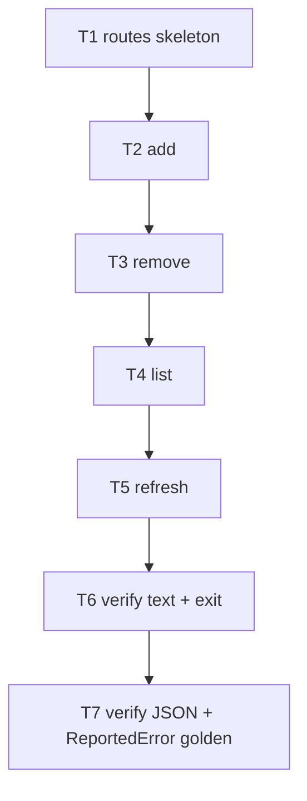

# F27 — cmd-routes: Tasks

## Task graph



## Task F27-T1: Create the routes command skeleton with five subcommands

**Depends on:** none (F18, F06, F11, F01, F22, F03 are landed upstream)

**Files:**
- create `pkg/whichmodel/routes_cmd.go`
- create `pkg/whichmodel/routes_cmd_test.go`

**Spec references:** `specs/features/F27-cmd-routes/SPEC.md §2.1, §3`, `specs/features/F27-cmd-routes/CONTRACTS.md §3, §7.5`

**Instructions:**
1. Write `routes_cmd_test.go` first (package `whichmodel`); must fail to compile until `NewRoutesCmd` exists.
2. Test 1: `registeredCommands()` contains a command named `routes`.
3. Test 2: subcommand names exactly `["list", "add", "remove", "refresh", "verify"]` in that order.
4. Test 3: `add` flags — `--provider` string `""`, `--model-id` string `""`, `--model` string `""`, `--reasoning` string `"default"`, `--window` string slice `[]`.
5. Test 4: `remove` flags — `--provider`, `--model-id` strings default `""`; `refresh` — `--auto` string `""`; `list` — `--provider` string `""`.
6. Test 5 (RunE wiring): `routes add` with no flags → `*UsageError`, message contains `--provider`; `routes remove` with no flags → `*UsageError`, message contains `--provider` (validation bodies land in T2/T3; wiring must route to the right `Run*` func).
7. Create `routes_cmd.go` (package `whichmodel`, NO build tag):
   - `func init() { register(NewRoutesCmd) }`.
   - `func NewRoutesCmd() *cobra.Command` — Use `routes list|add|remove|refresh|verify`, Short `Manage the provider route table`; five subcommands with `Use: "list [--provider <id>]"` etc., flags per test 3/4, `Args: cobra.NoArgs` for all, RunE per subcommand assembling the `Route*Args` structs (ConfigPath from `Global.ConfigPath`, JSON from `Global.JSON`, NoUsage from `Global.NoUsage`) and calling `RunRouteAdd/Remove/List/Refresh/Verify`.
   - The `Run*` funcs live in `routes.go` (T2+); for THIS task, define minimal real versions in `routes_cmd.go` that return the subcommand's argument-required `*UsageError` when required flags are empty (`--provider` for add/remove; add also requires `--model-id` and `--model`) and otherwise `nil` (logic lands in T2–T6).
8. Run `go test ./pkg/whichmodel/...`; then `go build ./pkg/whichmodel/...`.

**Test cases (write these first):**

| # | input | want |
|---|---|---|
| 1 | `registeredCommands()` | contains `routes` |
| 2 | subcommand order | `[list add remove refresh verify]` |
| 3 | `add` flags | names/types/defaults per step 3 |
| 4 | `remove`/`refresh`/`list` flags | defaults per step 4 |
| 5 | `add` no flags; `remove` no flags | `*UsageError` mentioning `--provider` |

**Acceptance criteria:**
- [ ] `go build ./pkg/whichmodel/...` succeeds
- [ ] `go test ./pkg/whichmodel/...` passes
- [ ] no file outside the Files list modified
- [ ] single `register(NewRoutesCmd)`; no `AddCommand` in production code

## Task F27-T2: routes add

**Depends on:** F27-T1

**Files:**
- create `pkg/whichmodel/routes.go`
- create `pkg/whichmodel/routes_add_test.go`
- edit `pkg/whichmodel/routes_cmd.go` (remove the T1 `RunRouteAdd` stub; keep the others)

**Spec references:** `specs/features/F27-cmd-routes/SPEC.md §2.2, §3`, `specs/features/F27-cmd-routes/CONTRACTS.md §2, §7.1`

**Instructions:**
1. Write `routes_add_test.go` first. Seams in `routes.go`: `loadRoutesFunc`, `saveRoutesFunc`, `routesPathFunc` (defaults = F18 funcs).
2. Test 1 (validation): `RunRouteAdd(RouteAddArgs{Provider: "not-a-provider", ModelID: "x", Model: "y"})` → `*UsageError`, message contains `unknown provider` and `valid providers:`; empty `--model`/`--model-id` → `*UsageError` with `--model-id and --model are required`.
3. Test 2 (write): fake load returns existing `[{claude, claude-sonnet-4-5, ...}]`; `RunRouteAdd(RouteAddArgs{Provider: "codex", ModelID: "gpt-5-codex", Model: "gpt-5-codex", Reasoning: "default", Windows: []})` → `saveRoutesFunc` called with 2 routes; the new one has `Provenance == "user_declared"`, `Reasoning == "default"`, `Windows == []`; exit nil; stdout empty.
4. Test 3 (reasoning/windows passthrough): `Reasoning: "fast", Windows: ["5h", "7d"]` → saved route carries them.
5. Test 4 (duplicate): fake load already contains `{codex, gpt-5-codex}` → `*UsageError`, message `route "codex:gpt-5-codex" already exists; remove it first`; `saveRoutesFunc` NOT called.
6. Test 5 (load error): fake load returns `errors.New("corrupt")` → `*CodedError{Code: "runtime"}` (exit 1), message contains `corrupt`.
7. Implement `RunRouteAdd` in `routes.go`: validation (registry via `usage.Get`, emptiness) → `path, err := routesPathFunc(cfg)` → `routes, err := loadRoutesFunc(path)` → duplicate scan (provider+model-id) → append `routing.Route{..., Provenance: "user_declared"}` → `saveRoutesFunc(path, routes)` → nil. Config loaded via `config.Load(args.ConfigPath)` (error → `*UsageError` with the load text).
8. Run `go test ./pkg/whichmodel/...`; then `go build ./pkg/whichmodel/...`.

**Test cases (write these first):**

| # | input | want |
|---|---|---|
| 1 | unknown provider / empty model fields | `*UsageError`, exact messages |
| 2 | valid add | save called, 2 routes, new = user_declared, stdout empty, exit 0 |
| 3 | reasoning + windows passthrough | saved route fields |
| 4 | duplicate | `already exists; remove it first`, no save |
| 5 | load error | exit 1 `runtime`, message `corrupt` |

**Acceptance criteria:**
- [ ] `go build ./pkg/whichmodel/...` succeeds
- [ ] `go test ./pkg/whichmodel/...` passes
- [ ] no file outside the Files list modified

## Task F27-T3: routes remove

**Depends on:** F27-T2

**Files:**
- create `pkg/whichmodel/routes_remove_test.go`
- edit `pkg/whichmodel/routes.go`
- edit `pkg/whichmodel/routes_cmd.go` (remove the T1 `RunRouteRemove` stub)

**Spec references:** `specs/features/F27-cmd-routes/SPEC.md §2.3, §3`, `specs/features/F27-cmd-routes/CONTRACTS.md §2`

**Instructions:**
1. Write `routes_remove_test.go` first.
2. Test 1 (exact match): fake load `[{codex, gpt-5-codex}, {claude, claude-sonnet-4-5}]`; `RunRouteRemove(RouteRemoveArgs{Provider: "codex", ModelID: "gpt-5-codex"})` → save called with 1 route (claude remains); exit nil; stdout empty.
3. Test 2 (provenance not a barrier): removing a `provider_live` route succeeds (same flow).
4. Test 3 (missing): no match → `*CodedError{Code: "no_route"}`, `ExitCodeFor == 1`, message `no route "codex:gpt-5-codex"`; save NOT called.
5. Test 4 (partial match ignored): `{Provider: "codex", ModelID: "other"}` exists → removing `codex:gpt-5-codex` is still `no_route` (exact provider+model-id pair).
6. Test 5 (save error): fake save returns error → `*CodedError{Code: "runtime"}`, exit 1.
7. Implement `RunRouteRemove` in `routes.go`: load → find exact (provider, model-id) → not found → `&CodedError{Code: "no_route", Message: fmt.Sprintf("no route %q:%q", ...)}` → else filter out → save → nil.
8. Run `go test ./pkg/whichmodel/...`; then `go build ./pkg/whichmodel/...`.

**Test cases (write these first):**

| # | input | want |
|---|---|---|
| 1 | exact match | save with 1 route left, exit 0 |
| 2 | `provider_live` route | removable |
| 3 | no match | `no_route`, exit 1, no save |
| 4 | different model-id same provider | still `no_route` |
| 5 | save error | exit 1 `runtime` |

**Acceptance criteria:**
- [ ] `go build ./pkg/whichmodel/...` succeeds
- [ ] `go test ./pkg/whichmodel/...` passes
- [ ] no file outside the Files list modified

## Task F27-T4: routes list

**Depends on:** F27-T3

**Files:**
- create `pkg/whichmodel/routes_list_test.go`
- edit `pkg/whichmodel/routes.go`
- edit `pkg/whichmodel/routes_cmd.go` (remove the T1 `RunRouteList` stub)

**Spec references:** `specs/features/F27-cmd-routes/SPEC.md §2.4, §3`, `specs/features/F27-cmd-routes/CONTRACTS.md §5, §6`

**Instructions:**
1. Write `routes_list_test.go` first.
2. Test 1 (table golden): fake load returns claude (windows `["5h","7d"]`) + codex (no windows) → text golden:
   ```
   provider  model_id          model              reasoning  windows  provenance
   claude    claude-sonnet-4-5 claude-sonnet-4-5  default    5h,7d    provider_live
   codex     gpt-5-codex       gpt-5-codex        default    -        user_declared
   ```
   (tabwriter padding 2; `-` for empty windows.)
3. Test 2 (filter): `RouteListArgs{Provider: "claude"}` → only claude row; unknown provider → `*UsageError`, message `unknown provider "x"`.
4. Test 3 (JSON): `JSON: true` → unmarshalled root `schema_version == "2.0"`, `routes` length 2, first route echoes canonical tags (`provider`, `model_id`, `model`, `reasoning`, `windows`, `provenance`).
5. Test 4 (missing file): `loadRoutesFunc` (or real `LoadRoutes`) on a nonexistent path → empty table: text = header only; JSON `routes == []`.
6. Test 5 (IO error): fake load returns error → `*CodedError{Code: "runtime"}`, exit 1.
7. Implement `RunRouteList` in `routes.go`: load (F18: missing → empty) → filter by provider (validate via `usage.Get`) → text via `text/tabwriter` with the CONTRACTS §6 header, or JSON via `RouteList{SchemaVersion: "2.0", Routes: routes}` (indent 2 + newline) → nil.
8. Run `go test ./pkg/whichmodel/...`; then `go build ./pkg/whichmodel/...`.

**Test cases (write these first):**

| # | input | want |
|---|---|---|
| 1 | two routes | exact table golden |
| 2 | `--provider claude` / unknown | filtered row / `unknown provider "x"` |
| 3 | `JSON: true` | envelope + canonical route tags |
| 4 | missing routes file | header-only table / `routes: []` |
| 5 | load error | exit 1 `runtime` |

**Acceptance criteria:**
- [ ] `go build ./pkg/whichmodel/...` succeeds
- [ ] `go test ./pkg/whichmodel/...` passes
- [ ] no file outside the Files list modified

## Task F27-T5: routes refresh

**Depends on:** F27-T4

**Files:**
- create `pkg/whichmodel/routes_refresh_test.go`
- edit `pkg/whichmodel/routes.go`
- edit `pkg/whichmodel/routes_cmd.go` (remove the T1 `RunRouteRefresh` stub)

**Spec references:** `specs/features/F27-cmd-routes/SPEC.md §2.5, §2.6, §3`, `specs/features/F27-cmd-routes/CONTRACTS.md §2, §7.1, §7.6`

**Instructions:**
1. Write `routes_refresh_test.go` first. Seams: `produceRoutesFunc` (default `routing.ProduceRoutes`), `saveRoutesFunc`, `routesPathFunc`, `readScoresFunc` (F06), `toggleResolveFunc` (F21 — same seam shape as F26: `func(flagNoUsage bool, cfg *config.Config) (bool, string)`).
2. Test 1 (produce + persist): fake produce returns `[{claude..., user_declared}, {codex..., provider_live}]` → save called with exactly those; exit nil; stdout empty.
3. Test 2 (user_declared preserved): the fake's produce output already includes the preserved user route (F18's merge contract) — F27's job is fidelity: assert saved bytes == what produce returned (no reordering, no filtering).
4. Test 3 (idempotent): pre-existing file content identical to produce output → save NOT called (compare-and-skip); exit 0.
5. Test 4 (usage-disabled warning): toggle returns `(false, "flag")` → stderr contains EXACTLY ONE line `warning: usage is disabled; refresh uses static sources only`; still saves + exit 0.
6. Test 5 (`--auto`): `Auto: "claude-sonnet"` with fake scores rows `[claude-sonnet-4-5, gpt-5-codex]` → after produce, save called with an extra route `{provider: <from row>, model_id: <model>, model: "claude-sonnet-4-5", reasoning: "default", provenance: "user_declared"}` (provider/model-id from the matched score row per CONTRACTS §7.2 — the row carries the provider via the route convention `provider = row.Provider` when present, else the row's model name; pin: `Provider = row.Model`-prefix before first `-`? NO — see step 7).
7. Test 6 (`--auto` no match): `Auto: "zzz"` → `*UsageError`, message `no score row matching "zzz"`; ambiguous (two rows containing `claude-sonnet`) → same error listing both: `no score row matching "x" (ambiguous: a, b)`; save NOT called.
8. Test 7 (produce error): fake produce returns error → `*CodedError{Code: "runtime"}`, exit 1.
9. Implement `RunRouteRefresh` in `routes.go`:
   - `enabled, _ := toggleResolveFunc(Global.NoUsage, cfg)`; `!enabled` → `output.WriteWarning(stderr, "usage is disabled; refresh uses static sources only")` (exactly once).
   - `routes, err := produceRoutesFunc(cfg)` → error → `runtime` CodedError.
   - `--auto`: `rows, err := readScoresFunc(csvPath)`; candidate = rows whose `Model` contains `args.Auto` (substring, case-insensitive); zero → `*UsageError{no score row matching "x"}`; >1 → `*UsageError{no score row matching "x" (ambiguous: <models joined by ", ">)}`; exactly 1 → append `routing.Route{Model: row.Model, ModelID: row.Model, Reasoning: "default", Provider: row.Provider, Provenance: "user_declared"}` (per F06 CONTRACTS `ScoreRow.Provider` field when pinned; fallback: provider = the catalog provider owning the row — resolve via `usage.All()` matching the row's provider field; the test's fake rows carry `Provider`).
   - Compare-and-skip: read the current file via `loadRoutesFunc(path)`; if bytes-equal (marshal both with `json.Marshal` + `bytes.Equal`), skip save; else `saveRoutesFunc(path, routes)`.
10. Run `go test ./pkg/whichmodel/...`; then `go build ./pkg/whichmodel/...`.

**Test cases (write these first):**

| # | input | want |
|---|---|---|
| 1 | produce returns 2 routes | save called with exactly them |
| 2 | same content pre-existing | save NOT called |
| 3 | toggle disabled | exactly one warning, still saves, exit 0 |
| 4 | `--auto claude-sonnet` | extra user_declared route appended |
| 5 | `--auto zzz` / ambiguous | `no score row matching "zzz"` / `(ambiguous: ...)`, no save |
| 6 | produce error | exit 1 `runtime` |

**Acceptance criteria:**
- [ ] `go build ./pkg/whichmodel/...` succeeds
- [ ] `go test ./pkg/whichmodel/...` passes
- [ ] no file outside the Files list modified
- [ ] `bytes.Equal` compare-and-skip is the only skip mechanism

## Task F27-T6: routes verify (text + exit semantics)

**Depends on:** F27-T5

**Files:**
- create `pkg/whichmodel/routes_verify_test.go`
- edit `pkg/whichmodel/routes.go`
- edit `pkg/whichmodel/routes_cmd.go` (remove the T1 `RunRouteVerify` stub)

**Spec references:** `specs/features/F27-cmd-routes/SPEC.md §2.7, §3`, `specs/features/F27-cmd-routes/CONTRACTS.md §2, §6, §7.1, §7.2`

**Instructions:**
1. Write `routes_verify_test.go` first. Seams: `loadRoutesFunc`, `readScoresFunc`, `scoresSHA256Func` (default `routing.ScoresSHA256`), `routesPathFunc`.
2. Test 1 (clean): routes all resolve in fake scores (`Model`+`Reasoning` present) → exit nil; stdout EMPTY; stderr summary `routes: 2 total (1 user_declared, 1 provider_live, 0 models_dev)`.
3. Test 2 (stale): route `{codex, gpt-5-codex, model: "gpt-5-codex"}` but scores lack `gpt-5-codex` → stdout exactly `stale route codex:gpt-5-codex (gpt-5-codex/default)`; exit 1 (`*CodedError{Code: "stale_routes"}`).
4. Test 3 (unrouted warnings): scores row `{gpt-5-codex, default}` with no route → stderr `warning: score row gpt-5-codex/default has no route; it cannot be picked`; exit unchanged (0 when no stale).
5. Test 4 (hash mismatch): `scoresSHA256Func` differs from the routes file's stored hash (F18 stores it in routes.json metadata — F27 reads the hash via the F18 seam) → stderr warning `warning: scores CSV changed since routes were produced; run which-model routes refresh`; exit unchanged.
6. Test 5 (missing routes file): empty table → exit 0, summary `routes: 0 total (0 user_declared, 0 provider_live, 0 models_dev)`.
7. Test 6 (IO error): `readScoresFunc` error → `*CodedError{Code: "runtime"}`, exit 1.
8. Implement `RunRouteVerify` in `routes.go`:
   - `routes, err := loadRoutesFunc(path)`; scores rows via `readScoresFunc(csvPath)`.
   - Stale = route whose `(Model, Reasoning)` pair has no score row → collect `"<provider>:<model-id>"`; print each as `stale route <provider>:<model-id> (<model>/<reasoning>)` on stdout.
   - Unrouted = score rows with no route covering `(Model, Reasoning)` → `output.WriteWarning(stderr, "score row <model>/<reasoning> has no route; it cannot be picked")` per row.
   - Provenance counts over routes → summary line `routes: <n> total (<x> user_declared, <y> provider_live, <z> models_dev)` on stderr.
   - Hash: `scoresSHA256Func(cfg)` vs the stored value (F18's file metadata — the seam returns both; see F18 CONTRACTS; when the stored hash is absent, treat as matching=false + warning? NO — absent hash (file written pre-hash) → warning only if `scoresSHA256Func` returns a non-empty live hash AND stored is empty AND routes exist: emit the changed warning; simplest pin: mismatch iff live hash non-empty and stored non-empty and unequal; otherwise no warning).
   - Exit: stale present → `&CodedError{Code: "stale_routes", Message: fmt.Sprintf("%d stale route(s); run which-model routes refresh", n)}` — stdout keeps the stale lines (T7 wraps in `ReportedError`); IO → `runtime`; else nil.
9. Run `go test ./pkg/whichmodel/...`; then `go build ./pkg/whichmodel/...`.

**Test cases (write these first):**

| # | input | want |
|---|---|---|
| 1 | all routes resolve | exit 0, empty stdout, summary counts |
| 2 | one stale route | stale line on stdout, exit 1 |
| 3 | unrouted score row | warning, exit unchanged |
| 4 | hash mismatch | changed-warning, exit unchanged |
| 5 | missing routes file | exit 0, `0 total` summary |
| 6 | CSV read error | exit 1 `runtime` |

**Acceptance criteria:**
- [ ] `go build ./pkg/whichmodel/...` succeeds
- [ ] `go test ./pkg/whichmodel/...` passes
- [ ] no file outside the Files list modified

## Task F27-T7: verify --json + ReportedError golden + integration

**Depends on:** F27-T6

**Files:**
- create `pkg/whichmodel/routes_json_test.go`
- edit `pkg/whichmodel/routes.go`

**Spec references:** `specs/features/F27-cmd-routes/SPEC.md §2.7, §2.8`, `specs/features/F27-cmd-routes/CONTRACTS.md §5`, F22 `ReportedError` (pinned)

**Instructions:**
1. Write `routes_json_test.go` first.
2. Test 1 (verify --json golden): routes: 1 stale, 1 fine; scores include one unrouted row; hash mismatched → stdout unmarshals to:
   ```json
   {
     "schema_version": "2.0",
     "stale_routes": ["codex:gpt-5-codex"],
     "unrouted": [{"model": "gpt-5-codex", "reasoning": "default"}],
     "provenance_counts": {"user_declared": 1, "provider_live": 1, "models_dev": 0},
     "scores_sha256_matches": false
   }
   ```
   (field-by-field asserts; empty arrays `[]`; all three count keys present).
3. Test 2 (stale + JSON + exit 1): `RunRouteVerify(JSON: true)` with stale routes → returned error is `*ReportedError` whose `Unwrap()` is `*CodedError{Code: "stale_routes"}`, `ExitCodeFor == 1`; stdout still carries the full report (ReportedError contract: F22 suppresses the JSON error doc).
4. Test 3 (clean JSON): no stale → return nil, report with `stale_routes: []`, exit 0.
5. Test 4 (no_route exit shape): `RunRouteRemove` missing → `CodeFor(err) == "no_route"`, `ExitCodeFor(err) == 1` (unknown-code rule).
6. Implement in `routes.go`: `RunRouteVerify` with `JSON: true` emits the `VerifyReport` document (indent 2 + newline) INSTEAD of the text stale lines (the report is the deliverable) and returns `&ReportedError{Err: <stale CodedError>}` when stale (never for IO errors — those get plain `CodedError{Code: "runtime"}`); text mode keeps T6 behavior but ALSO wraps the stale exit in `ReportedError` (stale lines already on stdout).
7. Run `go test ./pkg/whichmodel/...`; then `go build ./pkg/whichmodel/...`; then `go build -tags nousage ./pkg/whichmodel/...` (routes compiles under stubs; refresh's toggle seam is the stub).

**Test cases (write these first):**

| # | input | want |
|---|---|---|
| 1 | mixed fixture, `JSON: true` | exact golden fields (7 asserts) |
| 2 | stale + JSON | `*ReportedError` → `stale_routes` exit 1, report on stdout |
| 3 | clean + JSON | nil, `stale_routes: []`, exit 0 |
| 4 | remove missing | `CodeFor == "no_route"`, exit 1 |
| 5 | text mode stale | stale lines on stdout + `*ReportedError` exit 1 |

**Acceptance criteria:**
- [ ] `go build ./pkg/whichmodel/...` succeeds
- [ ] `go test ./pkg/whichmodel/...` passes
- [ ] `go build -tags nousage ./pkg/whichmodel/...` succeeds
- [ ] no file outside the Files list modified
- [ ] every JSON field matches CONTRACTS §5 verbatim
