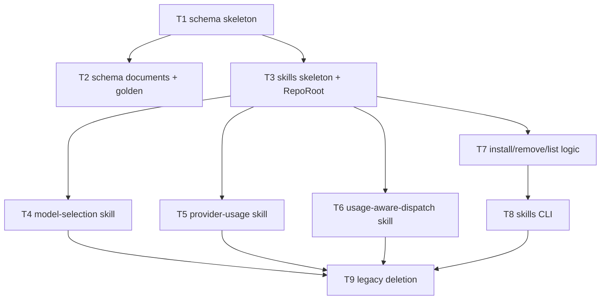

# F28 — Agent Skills: Tasks

## Task graph



## Task F28-T1: Create the schema registry skeleton

**Depends on:** none (F24/F26 command surfaces already exist per `specs/DEPENDENCY-GRAPH.md`)

**Files:**
- create `internal/schema/schema.go`
- create `internal/schema/schema_test.go`

**Spec references:** `specs/features/F28-agent-skills/CONTRACTS.md §2`, `docs/plan/annex-d-cli-reference.md §2.9`, `docs/plan/annex-c-agent-integration.md §4.4`

**Instructions:**
1. Create `internal/schema/schema.go`, `package schema`, containing ONLY:
   ```go
   package schema

   var commandOrder = []string{"usage", "pick", "explain", "routes"}

   // Commands returns the schema-bearing commands in index order.
   func Commands() []string {
       out := make([]string, len(commandOrder))
       copy(out, commandOrder)
       return out
   }

   // Emit returns the JSON Schema document for name, or an error naming the
   // valid commands if name is unknown. Implemented in task F28-T2.
   func Emit(name string) ([]byte, error) {
       return nil, &UnknownCommandError{Name: name, Commands: Commands()}
   }

   type UnknownCommandError struct {
       Name     string
       Commands []string
   }

   func (e *UnknownCommandError) Error() string {
       return "unknown command \"" + e.Name + "\" (known: " + joinComma(e.Commands) + ")"
   }

   func joinComma(s []string) string {
       out := ""
       for i, v := range s {
           if i > 0 {
               out += ", "
           }
           out += v
       }
       return out
   }
   ```
   `Index()` is implemented in task F28-T2 — do not add it yet.
2. Create `internal/schema/schema_test.go`, `package schema`, with the test cases below (table-driven, `testing` stdlib only). Test 1 calls `Commands()`; tests 2–3 call `Emit("usage")` expecting an error of type `*UnknownCommandError` (it will fail to compile if `Emit` or `UnknownCommandError` is missing — that is the intended TDD failure; then make it compile and pass with the code above).

**Test cases (write these first):**

| # | input | want |
|---|---|---|
| 1 | `Commands()` | `["usage", "pick", "explain", "routes"]` in that order; each call returns an independent slice (mutating the returned slice does not affect the next call) |
| 2 | `Emit("usage")` (before T2) | error `*UnknownCommandError`, `err.Commands` == `["usage","pick","explain","routes"]` |
| 3 | `Emit("nonsense")` | error whose message contains `nonsense` and each of the four command names |

**Acceptance criteria:**
- [ ] `go build ./internal/schema/...` succeeds
- [ ] `go test ./internal/schema/...` passes with the test cases above
- [ ] no file outside the Files list modified

**Run:** `go test ./internal/schema/...`

## Task F28-T2: Author the four schema documents and emit them

**Depends on:** F28-T1

**Files:**
- create `internal/schema/schemas.go`
- extend `internal/schema/schema.go` (add `Index()`, make `Emit` return the documents)
- create `internal/schema/schema_test.go` additions (same test file)
- create `internal/schema/testdata/usage-schema.json`, `internal/schema/testdata/pick-schema.json`, `internal/schema/testdata/explain-schema.json`, `internal/schema/testdata/routes-schema.json`

**Spec references:** `specs/features/F28-agent-skills/CONTRACTS.md §2.1`, `docs/plan/annex-c-agent-integration.md §4.1/§4.2/§4.3/§4.6/§5.1`, `specs/global/CONTRACTS.md §3.1/§6`

**Instructions:**
1. Read `docs/plan/annex-c-agent-integration.md` §4.1 (usage), §4.2 (pick), §4.3 (explain) in full.
2. Create `internal/schema/schemas.go`, `package schema`, with four `const` raw-string documents named `usageSchemaJSON`, `pickSchemaJSON`, `explainSchemaJSON`, `routesSchemaJSON` (2-space-indented JSON, each ending with exactly one `\n`).
3. Build `usageSchemaJSON` from annex-c §4.1 VERBATIM, then apply exactly these changes (CONTRACTS §2.1):
   - root `schema_version`: `"const": "2.0"`;
   - root `required`: `["schema_version", "usage_enabled", "snapshots"]`;
   - root `properties` gains `usage_enabled` (boolean) and `usage_disabled_reason` (string, enum `["flag","config","compiled_out","no_providers_enabled"]`);
   - root gains the `if`/`then` block requiring `usage_disabled_reason` when `usage_enabled` is `false` (exact JSON in CONTRACTS §2.1).
   - Everything else (all `$defs`: `Unit`, `Window`, `Failure`, `Snapshot`) verbatim.
4. Build `pickSchemaJSON` from annex-c §4.2 VERBATIM, then apply exactly these changes:
   - root `schema_version` const `"2.0"`; root `required` = `["schema_version","usage_enabled","profile","strategy","candidates","excluded_candidates"]`; add `usage_enabled`/`usage_disabled_reason` properties + `if`/`then` as in step 3;
   - `Candidate.required` = `["candidate_id","route","model_score","provider_weight","final_score"]` (keep `band` and `band_weight` as properties, NOT required);
   - in `Candidate.properties`, `model_score`, `band_weight`, `provider_weight`, `final_score` are `"type": "string"` (decimal strings — CONTRACTS §2.1 item 4);
   - `Route` gains optional property `"provenance": { "type": "string" }`.
   - Everything else verbatim.
5. Build `explainSchemaJSON` from annex-c §4.3 VERBATIM, then apply exactly these changes:
   - root `schema_version` const `"2.0"`; root `required` = `["schema_version","usage_enabled","candidate","evidence"]`; add `usage_enabled`/`usage_disabled_reason` properties + `if`/`then` as in step 3;
   - `Evidence.required` = `["profile","score_inputs","route_provenance","excluded_candidates"]` (keep `band`, `snapshot_age_seconds`, `confidence`, `last_verified` as properties, NOT required — annex-c §5.1 degraded mode).
   - Everything else verbatim.
6. Create `routesSchemaJSON` with EXACTLY this content:
   ```json
   {
     "$schema": "https://json-schema.org/draft/2020-12/schema",
     "$id": "https://github.com/WD-Mitchell/which-model/schema/routes-list.json",
     "title": "which-model routes list --json output",
     "type": "object",
     "required": ["schema_version", "routes"],
     "properties": {
       "schema_version": { "type": "string", "const": "2.0" },
       "routes": { "type": "array", "items": { "$ref": "#/$defs/Route" } }
     },
     "$defs": {
       "Route": {
         "type": "object",
         "required": ["provider", "model_id", "model", "reasoning", "window_ids"],
         "properties": {
           "provider": { "type": "string" },
           "model_id": { "type": "string" },
           "model": { "type": "string" },
           "reasoning": {
             "type": "string",
             "enum": ["minimal", "low", "medium", "high", "xhigh", "max", "default"]
           },
           "window_ids": { "type": "array", "items": { "type": "string" } },
           "provenance": {
             "type": "string",
             "enum": ["provider_live", "models_dev", "user_declared"]
           }
         },
         "additionalProperties": false
       }
     }
   }
   ```
7. In `internal/schema/schema.go`, add:
   ```go
   // Index returns the no-argument index document (compact JSON + "\n").
   func Index() []byte {
       return []byte(`{"commands":["usage","pick","explain","routes"]}` + "\n")
   }
   ```
   and replace `Emit` with:
   ```go
   var docs = map[string][]byte{
       "usage":   []byte(usageSchemaJSON),
       "pick":    []byte(pickSchemaJSON),
       "explain": []byte(explainSchemaJSON),
       "routes":  []byte(routesSchemaJSON),
   }

   // Emit returns the JSON Schema document for name, or an error naming the
   // valid commands if name is unknown.
   func Emit(name string) ([]byte, error) {
       if d, ok := docs[name]; ok {
           return d, nil
       }
       return nil, &UnknownCommandError{Name: name, Commands: Commands()}
   }
   ```
8. Copy the four documents byte-for-byte into the four `testdata/*.json` golden files (same content; these are the golden lock).
9. Add these tests to `internal/schema/schema_test.go` (table-driven; read golden files with `os.ReadFile` relative to the package dir via `runtime.Caller` if needed — the test runs with cwd = package dir, so `"testdata/usage-schema.json"` works directly):
   - for each of the four names: `Emit(name)` bytes == golden file bytes (byte equality, `bytes.Equal`);
   - for each document: parses as JSON (`json.Valid`) and its root object's `"schema_version"` property has `"const": "2.0"`;
   - for usage/pick/explain: root `"required"` array contains `"usage_enabled"`;
   - for usage/pick/explain: document contains the string `"usage_disabled_reason"` and the `"if"` key;
   - `Index()` == `{"commands":["usage","pick","explain","routes"]}\n` exactly;
   - `Emit` twice for `"pick"` returns byte-identical results (stability).

**Test cases (write these first):**

| # | input | want |
|---|---|---|
| 1 | `Emit("usage")` | bytes == `testdata/usage-schema.json` |
| 2 | `Emit("pick")` | bytes == `testdata/pick-schema.json` |
| 3 | `Emit("explain")` | bytes == `testdata/explain-schema.json` |
| 4 | `Emit("routes")` | bytes == `testdata/routes-schema.json` |
| 5 | each document | `json.Valid` true; root `schema_version.const == "2.0"` |
| 6 | usage/pick/explain docs | root `required` contains `usage_enabled`; doc contains `"usage_disabled_reason"` and `"if"` |
| 7 | `Index()` | `{"commands":["usage","pick","explain","routes"]}` + `\n` |
| 8 | `Emit("pick")` twice | byte-identical |
| 9 | `Emit("nonsense")` | `*UnknownCommandError` (still) |

**Acceptance criteria:**
- [ ] `go build ./internal/schema/...` succeeds
- [ ] `go test ./internal/schema/...` passes with the test cases above
- [ ] each golden file ends with exactly one `\n` and matches `Emit` byte-for-byte
- [ ] no file outside the Files list modified

**Run:** `go test ./internal/schema/...`

## Task F28-T3: Create the skills package skeleton and RepoRoot

**Depends on:** F28-T1

**Files:**
- create `internal/skills/skills.go`
- create `internal/skills/skills_test.go`

**Spec references:** `specs/features/F28-agent-skills/CONTRACTS.md §3`, `docs/plan/annex-d-cli-reference.md §4.6` (upward-walk convention)

**Instructions:**
1. Create `internal/skills/skills.go`, `package skills`, containing ONLY:
   ```go
   package skills

   import (
       "errors"
       "os"
       "path/filepath"
   )

   type Target string

   const (
       TargetGeneric Target = "generic"
       TargetClaude  Target = "claude"
   )

   // Names is the fixed skill set, in install order.
   var Names = []string{"model-selection", "provider-usage", "usage-aware-dispatch"}

   // RepoRoot walks upward from cwd to the nearest ancestor containing ".git".
   // repoDir (the --repo flag) wins when non-empty. Error when neither exists.
   func RepoRoot() (string, error) {
       if repoDir != "" {
           return repoDir, nil
       }
       dir, err := os.Getwd()
       if err != nil {
           return "", err
       }
       for {
           if fi, err := os.Stat(filepath.Join(dir, ".git")); err == nil && fi.IsDir() {
               return dir, nil
           }
           parent := filepath.Dir(dir)
           if parent == dir {
               return "", errors.New("no repository root found (no .git ancestor); pass --repo <path>")
           }
           dir = parent
       }
   }

   // repoDir is set by the CLI layer from --repo (exported for tests).
   var repoDir string

   func SetRepoDir(path string) { repoDir = path }
   ```
2. Create `internal/skills/skills_test.go`, `package skills`:
   - Test 1: `Names` == `["model-selection", "provider-usage", "usage-aware-dispatch"]`.
   - Tests 2–4 use `t.TempDir()`: create `<tmp>/.git/` (directory) and a file `<tmp>/marker.txt`; `SetRepoDir("")`, `os.Chdir(<tmp>)` (save and restore cwd via `t.Cleanup`), then `RepoRoot()` returns `<tmp>`. Then `os.Chdir(<tmp>/nonexistent-subdir)` (create it) and `RepoRoot()` still returns `<tmp>` (upward walk). Then `os.Chdir(t.TempDir())` (no `.git` ancestor) → `RepoRoot()` errors with message containing `--repo`. Finally `SetRepoDir(<tmp2>)` → `RepoRoot()` returns `<tmp2>` even from a `.git`-less cwd; `SetRepoDir("")` at the end (cleanup).
   - Test 5: `TargetGeneric`/`TargetClaude` string values `"generic"`/`"claude"`.

**Test cases (write these first):**

| # | input | want |
|---|---|---|
| 1 | `Names` | the three names in order |
| 2 | cwd inside tempdir with `.git/` | `RepoRoot()` == that tempdir |
| 3 | cwd in nested subdir of the same tempdir | `RepoRoot()` == tempdir (upward walk) |
| 4 | cwd without any `.git` ancestor | error containing `--repo`; with `SetRepoDir(path)` set, returns path |
| 5 | `TargetGeneric`, `TargetClaude` | `"generic"`, `"claude"` |

**Acceptance criteria:**
- [ ] `go build ./internal/skills/...` succeeds
- [ ] `go test ./internal/skills/...` passes with the test cases above
- [ ] no file outside the Files list modified

**Run:** `go test ./internal/skills/...`

## Task F28-T4: Author the model-selection skill

**Depends on:** F28-T3

**Files:**
- create `skills/model-selection/SKILL.md`
- create `skills/model-selection/agents/openai.yaml`
- create `internal/skills/model_selection_test.go`

**Spec references:** `specs/features/F28-agent-skills/SPEC.md §5`, `docs/plan/annex-c-agent-integration.md §2.1/§4.7/§5/§6`, `docs/plan/annex-d-cli-reference.md §2.4/§2.5`

**Instructions:**
1. Create `skills/model-selection/SKILL.md` with EXACTLY this content:
   ````markdown
   ---
   name: model-selection
   description: >-
     Use when choosing a verified model and reasoning-effort row for a dispatched
     task. Trigger when a task needs a deterministic model ranking from a task
     profile, explicit tier weights, or live target-harness availability
     filtering before dispatch.
   ---

   # Model selection: ranked scores plus live availability

   Choose an exact model and reasoning-effort row from the scored catalog, then
   confirm the row is accepted by the target dispatch harness before
   dispatching. The score artifact is a data-driven prior; it cannot prove that
   the target harness exposes a row. This skill works unchanged when the usage
   subsystem is disabled (annex-c §2.5); it never reads band or quota fields.

   ## When to use

   - A task needs a deterministic model ranking from a task profile.
   - Explicit tier weights (`--tier1-weight`, `--tier2-weight`, `--weights-json`)
     are needed instead of a named profile.
   - The dispatch target is a specific harness whose live availability must be
     applied before committing to a model+effort pair.

   ## Commands

   Rank a task against one of the 11 profiles (`simple_implementation`,
   `simple_action_execution`, `balanced_implementation`, `complex_implementation`,
   `ui_ux`, `complex_action_execution`, `financial_work`, `research`, `planning`,
   `orchestration`, `review`):

   ```bash
   which-model pick --profile balanced_implementation --top 5 --json
   ```

   Filter the ranking by the target harness's live availability file (JSON list
   of `"model|reasoning"` strings or `{"model": ..., "reasoning": ...}` objects):

   ```bash
   which-model pick --profile simple_action_execution --top 5 --available .tmp/live-model-efforts.txt --json
   ```

   Record dispatch evidence for the chosen row:

   ```bash
   which-model explain <candidate-id> --json
   ```

   ## Reading the output

   Check `usage_enabled` FIRST on every `--json` output (annex-c §4.6). This
   skill never reads band fields, so a `false` value does not change these
   steps — but record it in the evidence.

   From `which-model pick --json` read:

   - `candidates[0].candidate_id` — the id to pass to `which-model explain`.
   - `candidates[0].route.provider`, `.route.model_id`, `.route.model`,
     `.route.reasoning` — the exact row.
   - `candidates[0].final_score`, `candidates[0].warnings`.
   - `excluded_candidates[].reason_code` and `.reason` — inspect BEFORE
     trusting the recommendation. `reason_code: "not_in_availability_list"`
     means the harness availability filter removed the row.

   From `which-model explain <candidate-id> --json` read `evidence`:

   - `evidence.profile`, `evidence.score_inputs`.
   - `evidence.excluded_candidates`, `evidence.route_provenance`,
     `evidence.last_verified` (`last_verified` is omitted when usage is off).
   - `evidence.band`, `evidence.snapshot_age_seconds`, `evidence.confidence` —
     present only when `usage_enabled` is true; never read them when it is false.

   ## Failure handling (exit codes, annex-c §4.7)

   | exit | meaning | action |
   |---|---|---|
   | 0 | success | parse `--json` per the shapes above and proceed |
   | 1 | runtime error | surface `Failure.message`; do not retry blindly |
   | 2 | argument/usage error | fix the invocation (bad profile, bad flag combination); do not retry unchanged |
   | 3 | no viable candidate after filtering | widen the profile or `--available` list; ask the user; never silently fall back to an unranked model |
   | 4 | all eligible providers band-gated | usage signal; defer to `usage-aware-dispatch`/`provider-usage` |
   | 5 | authentication required | run the explicit, user-present login flow (`provider-usage`) |

   ## Recording evidence

   Record the EXACT model ID and reasoning effort accepted by the target
   harness and the full `Evidence` object from `which-model explain` — never a
   free-text availability claim, never a model name or slug alone. Model names
   are not availability proof. If `usage_enabled` is false, record
   `usage_disabled_reason` with the evidence; degraded evidence is still valid
   evidence for the claim it makes — "this is the best-scoring model for this
   profile" (annex-c §5.1).

   ## Checklist

   - [ ] Classify task intent and complexity; choose the closest of the 11 profiles.
   - [ ] Confirm intelligence, cost, and speed weights are present and positive in the run's output.
   - [ ] Run `which-model pick --json` and inspect `warnings`/`excluded_candidates` before trusting `candidates[0]`.
   - [ ] Apply target-harness live availability (`--available`) with exact model + reasoning-effort IDs.
   - [ ] Dispatch the exact recommended row or a listed alternative; never invent a nearby effort as a fallback.
   - [ ] Record model, reasoning effort, profile, `usage_enabled`, and the full `Evidence` object.
   ````
2. Create `skills/model-selection/agents/openai.yaml` with EXACTLY:
   ```yaml
   interface:
     display_name: "Model selection"
     short_description: "Rank models by task profile and filter to live harness availability"
     default_prompt: "Use $model-selection to choose a deterministic model and reasoning-effort row for this task from a task profile, then confirm it against the target harness's live availability before dispatch."
   ```
3. Create `internal/skills/model_selection_test.go`, `package skills`, with a test that:
   - calls `RepoRoot()` (asserting no error; the repo has `.git`), reads `skills/model-selection/SKILL.md` (path via `filepath.Join(root, "skills", "model-selection", "SKILL.md")`) and `.../agents/openai.yaml`; assert each file is non-empty;
   - asserts the SKILL.md contains ALL of the following substrings (each is one test case): `name: model-selection`, `description:`, `which-model pick --profile balanced_implementation --top 5 --json`, `--available .tmp/live-model-efforts.txt`, `which-model explain <candidate-id> --json`, `usage_enabled`, `candidates[0].candidate_id`, `reason_code`, `not_in_availability_list`, `| 0 |`, `| 5 |`, `Failure.message`, `availability proof`, `## Checklist`;
   - asserts the openai.yaml contains `display_name:` and `default_prompt:`.

**Test cases (write these first):**

| # | input | want |
|---|---|---|
| 1 | repo `skills/model-selection/SKILL.md` | exists, non-empty |
| 2 | same | contains `name: model-selection` and `description:` frontmatter |
| 3 | same | contains `which-model pick --profile balanced_implementation --top 5 --json` |
| 4 | same | contains `--available .tmp/live-model-efforts.txt` and `which-model explain <candidate-id> --json` |
| 5 | same | contains `usage_enabled` (first-check rule) |
| 6 | same | contains `candidates[0].candidate_id` and `excluded_candidates[].reason_code` and `not_in_availability_list` |
| 7 | same | contains exit-table rows `| 0 |`, `| 1 |`, `| 2 |`, `| 3 |`, `| 4 |`, `| 5 |` and `Failure.message` |
| 8 | same | contains `availability proof` and `## Checklist` |
| 9 | `agents/openai.yaml` | contains `display_name:` and `default_prompt:` |

**Acceptance criteria:**
- [ ] `go test ./internal/skills/...` passes with the test cases above
- [ ] SKILL.md has all six required content sections from `specs/features/F28-agent-skills/CONTRACTS.md §1.2`
- [ ] no file outside the Files list modified

**Run:** `go test ./internal/skills/...`

## Task F28-T5: Author the provider-usage skill

**Depends on:** F28-T3

**Files:**
- create `skills/provider-usage/SKILL.md`
- create `skills/provider-usage/agents/openai.yaml`
- create `internal/skills/provider_usage_test.go`

**Spec references:** `specs/features/F28-agent-skills/SPEC.md §5`, `docs/plan/annex-c-agent-integration.md §2.2/§2.5/§4.7/§6`, `docs/plan/annex-d-cli-reference.md §2.1/§2.2`

**Instructions:**
1. Create `skills/provider-usage/SKILL.md` with EXACTLY this content:
   ````markdown
   ---
   name: provider-usage
   description: >-
     Use when a user explicitly asks to inspect current usage allowance for a
     Claude, Codex, Copilot, or any other configured provider. Trigger when an
     interactive, read-only allowance report is needed without enabling
     automatic polling, spawn gating, or provider-consent enforcement.
   ---

   # Provider usage: explicit, read-only allowance reports

   Run one explicit `which-model usage` report for the provider(s) the user
   asked about. These reads never schedule anything, never poll in the
   background, and never gate agent spawns (annex-c §2.2 posture, inherited
   from `usage-allowance-checks/SKILL.md`).

   ## When to use

   - The user explicitly asks for current usage/allowance for a named provider.
   - A live allowance read is needed before a quota-sensitive decision
     (`usage-aware-dispatch` asks for this when a pick's
     `evidence.confidence` is `cached` or `estimated` near a `critical` band).

   ## Commands

   ```bash
   which-model usage claude --json
   which-model usage codex --trust-configured-origin https://trusted.example --json
   which-model usage copilot --login --json
   which-model usage --all --json
   ```

   - `--trust-configured-origin <origin>` is required for any provider with a
     configured fallback base URL (Codex); the origin must match exactly.
   - `--login` runs the device/browser flow and MUST only be used with the user
     present; unattended login is refused (exit 2).
   - `--show-identity` only when the user explicitly asked for identity.

   ## Before fetching

   Check `usage_enabled` FIRST (annex-c §2.5, §4.6): run
   `which-model config show --json` and read `usage_enabled`. If `false`, report
   which lever disabled it (`usage_disabled_reason`: flag/config/compiled_out/
   no_providers_enabled) and STOP. Do not try alternative credential paths, do
   not suggest re-enabling usage, and do not treat exit 2 as retryable.

   ## Reading the output

   From `which-model usage <provider> --json` read the `snapshots` array (one
   entry per provider, request order). For each snapshot:

   - `provider`, `confidence` (`live` | `cached` | `estimated`), `source`,
     `stale`, `fetched_at`.
   - `windows[].id`, `.label`, `.unit`, `.used_percent`, `.used`, `.limit`,
     `.remaining`, `.unlimited`, `.resets_at`, `.reset_hint`, `.usage_known`.
   - `error` — an inline `Failure` (code + sanitized message) means that
     provider failed; the other snapshots are still reported.

   A `cached`/`estimated` snapshot is NOT live proof of current quota —
   re-fetch before a quota-sensitive decision.

   ## Failure handling (exit codes, annex-c §4.7)

   | exit | meaning | action |
   |---|---|---|
   | 0 | all requested providers reported (even with inline per-provider `Failure`) | parse per the shapes above |
   | 1 | runtime error | surface `Failure.message`; do not retry blindly |
   | 2 | argument/config error, or usage disabled | fix the invocation or report the disabled lever; NEVER retry a `usage_disabled`/`usage_compiled_out` exit unchanged |
   | 4 | `--fail-on-gated` and a gate was crossed | report which provider/window crossed `gate_above_used_percent` |
   | 5 | every requested provider failed auth (`unauthorized`/`login_required`-class) | run the explicit, user-present `--login` flow |

   ## Recording evidence

   Never paste credential material, tokens, device codes, or raw provider
   bodies into evidence, logs, or tracked files — output is sanitized; keep it
   that way. Record the snapshot fields above (provider, confidence, source,
   windows) when they back a quota claim; never record a `cached` snapshot as a
   live reading.

   ## Checklist

   - [ ] Confirm `usage_enabled` before fetching; if disabled, report the lever and stop.
   - [ ] Run only the provider(s) the user requested; never schedule or auto-wire a provider check.
   - [ ] For fallback/base-URL trust (Codex), pass the exact HTTPS origin; never a near-miss or wildcard.
   - [ ] Use `--login` only with the user present; `--show-identity` only when requested.
   - [ ] Keep output sanitized and ephemeral; never paste credential or raw provider material into evidence.
   - [ ] Treat endpoint drift as a stable `unsupported_response`-class failure; never follow redirects or widen the accepted origin/shape.
   ````
2. Create `skills/provider-usage/agents/openai.yaml` with EXACTLY:
   ```yaml
   interface:
     display_name: "Provider usage"
     short_description: "Safely report usage allowance for any configured provider"
     default_prompt: "Use $provider-usage to run one explicit, read-only provider usage allowance report without automatic polling or enforcement."
   ```
3. Create `internal/skills/provider_usage_test.go`, `package skills`, mirroring task F28-T4 step 3 (same `RepoRoot()` read + substring asserts) for the new files.

**Test cases (write these first):**

| # | input | want |
|---|---|---|
| 1 | repo `skills/provider-usage/SKILL.md` | exists, non-empty |
| 2 | same | contains `name: provider-usage` and `description:` |
| 3 | same | contains `which-model usage claude --json` |
| 4 | same | contains `--trust-configured-origin https://trusted.example` and `--login` and `--all` |
| 5 | same | contains `which-model config show --json` and `usage_enabled` |
| 6 | same | contains `windows[].used_percent` and `snapshots` and `confidence` |
| 7 | same | contains exit-table rows `| 0 |` … `| 5 |` and `usage_disabled` and `usage_compiled_out` |
| 8 | same | contains `sanitized` and `## Checklist` |
| 9 | `agents/openai.yaml` | contains `display_name:` and `default_prompt:` |

**Acceptance criteria:**
- [ ] `go test ./internal/skills/...` passes with the test cases above
- [ ] SKILL.md has all six required content sections from `specs/features/F28-agent-skills/CONTRACTS.md §1.2`
- [ ] no file outside the Files list modified

**Run:** `go test ./internal/skills/...`

## Task F28-T6: Author the usage-aware-dispatch skill

**Depends on:** F28-T3

**Files:**
- create `skills/usage-aware-dispatch/SKILL.md`
- create `skills/usage-aware-dispatch/agents/openai.yaml`
- create `internal/skills/usage_aware_dispatch_test.go`

**Spec references:** `specs/features/F28-agent-skills/SPEC.md §5`, `docs/plan/annex-c-agent-integration.md §2.3/§2.5/§4.2/§4.6/§4.7/§5/§6`

**Instructions:**
1. Create `skills/usage-aware-dispatch/SKILL.md` with EXACTLY this content:
   ````markdown
   ---
   name: usage-aware-dispatch
   description: >-
     Use when selecting which provider/model pair to dispatch a task to, given
     current usage allowance across multiple providers. Trigger when a task
     needs quota-aware routing, a specific selection strategy (score, priority,
     round-robin, least-used, weighted-random, cost-optimal), or documented
     evidence for why one candidate was chosen over excluded alternatives.
   ---

   # Usage-aware dispatch: quota-aware pick with recorded evidence

   Choose a dispatch strategy, run `which-model pick`, and record the
   `which-model explain` evidence for the chosen candidate before dispatching.
   This skill DEFERS to `model-selection` when the usage subsystem is disabled
   (annex-c §2.5) — a disabled installation gets a score-only pick, never band
   reasoning against absent data.

   ## When to use

   - A task needs a provider/model pair chosen with awareness of current
     allowance across providers.
   - A specific strategy is warranted (priority order, load spreading, quota
     balancing, seeded randomization, cost ceiling).
   - Defensible evidence is required for why one candidate beat excluded
     alternatives.

   ## Check usage first

   Check `usage_enabled` FIRST (annex-c §1, §4.6) in the `pick` output. If
   `false`, defer: hand off to `model-selection`, run the pick score-only, and
   record that the pick is score-only (`usage_disabled_reason`). Never cite a
   band, pressure, or quota figure that is absent from the output.

   ## Commands

   ```bash
   which-model pick --profile balanced_implementation --strategy score --json
   which-model pick --profile research --strategy priority --json
   which-model pick --profile simple_implementation --strategy least-used --json
   which-model pick --profile complex_implementation --strategy weighted-random --seed 42 --json
   which-model explain <candidate-id> --json
   ```

   Strategy guidance (annex-c §2.3): `score` = no operational constraint beyond
   quality/cost/speed; `priority` = explicit provider preference order;
   `round-robin` = spread load across interchangeable providers; `least-used` =
   balance consumed quota; `weighted-random` = avoid hot-provider bottlenecks
   (MUST pass `--seed` for any evidence-bearing dispatch); `cost-optimal` =
   budget ceiling dominates.

   ## Reading the output

   From `which-model pick --json` (annex-c §4.2):

   - `usage_enabled` — MUST be checked before any band reasoning.
   - `profile`, `strategy`, `seed`.
   - `candidates[0].candidate_id`, `candidates[0].route.{provider,model_id,model,reasoning}`,
     `candidates[0].band`, `.band_weight`, `.provider_weight`, `.final_score`,
     `.warnings`.
   - `excluded_candidates[].reason_code` — `band_gated` means the provider was
     at or above `gate_above_used_percent`; such candidates are NEVER available
     and MUST NOT be retried without a fresh usage snapshot.

   From `which-model explain <candidate-id> --json` read `evidence`:

   - `evidence.profile`, `evidence.band.{name,used_percent,weight}`,
     `evidence.snapshot_age_seconds`, `evidence.confidence`,
     `evidence.route_provenance`, `evidence.excluded_candidates`,
     `evidence.last_verified`.
   - A pick without recorded evidence is indistinguishable from a guess:
     record `Evidence.Profile`, `Evidence.Band`, `Evidence.SnapshotAge`, and
     `Evidence.Confidence` with the chosen model+effort.

   ## Failure handling (exit codes, annex-c §4.7)

   | exit | meaning | action |
   |---|---|---|
   | 0 | at least one candidate returned | parse `--json`; do not dispatch before confirming exit 0 |
   | 1 | runtime error | surface `Failure.message`; hard stop for this dispatch attempt |
   | 2 | argument error (bad strategy/seed/flag combination) | fix the invocation; do not retry unchanged |
   | 3 | no viable candidate after filtering | widen profile/`--available`/exclusions; ask the user |
   | 4 | ALL eligible providers band-gated | surface the gated providers (`reason_code == "band_gated"` via explain/quota-guard); do NOT dispatch to a gated provider; warn the user; do not treat as a generic error |
   | 5 | authentication required | route to `provider-usage`'s explicit, user-present `--login` flow; never unattended login |

   ## Recording evidence

   Record the exact model ID and reasoning effort accepted by the target
   harness AND the full `Evidence` object for the chosen candidate (annex-c §5)
   — never a free-text availability claim. If `Evidence.Confidence` is
   `"estimated"` (or `"cached"` near a `critical` band), the pick is NOT
   quota-safe: re-fetch a live snapshot (`provider-usage`) before dispatching
   to a critical-adjacent provider.

   ## Checklist

   - [ ] Check `usage_enabled` first; if false, defer to `model-selection` and record the pick as score-only.
   - [ ] Choose a strategy from the table by the actual operational constraint, not habit.
   - [ ] For `weighted-random`, pass `--seed` for any evidence-bearing dispatch.
   - [ ] Run `which-model pick --json`; do not dispatch before confirming exit 0.
   - [ ] Run `which-model explain --json` for the chosen candidate and record its full `Evidence` object.
   - [ ] Confirm `Evidence.Confidence != "estimated"` before treating the pick as quota-safe under a `critical`-band provider.
   - [ ] Never treat a `band_gated` excluded candidate as available; do not retry it without a fresh usage snapshot.
   ````
2. Create `skills/usage-aware-dispatch/agents/openai.yaml` with EXACTLY:
   ```yaml
   interface:
     display_name: "Usage-aware dispatch"
     short_description: "Pick a provider/model pair with a quota-aware strategy and record dispatch evidence"
     default_prompt: "Use $usage-aware-dispatch to select a dispatch strategy appropriate to the operational constraint, run which-model pick, and record which-model explain evidence for the chosen candidate before dispatching."
   ```
3. Create `internal/skills/usage_aware_dispatch_test.go`, `package skills`, mirroring task F28-T4 step 3 for the new files.

**Test cases (write these first):**

| # | input | want |
|---|---|---|
| 1 | repo `skills/usage-aware-dispatch/SKILL.md` | exists, non-empty |
| 2 | same | contains `name: usage-aware-dispatch` and `description:` |
| 3 | same | contains `--strategy score`, `--strategy priority`, `--strategy least-used`, `--strategy weighted-random --seed 42` |
| 4 | same | contains `which-model explain <candidate-id> --json` |
| 5 | same | contains `usage_enabled` before-any-band-reasoning wording (substring `usage_enabled` AND `defer`/`defers` AND `score-only`) |
| 6 | same | contains `band_gated` and `gate_above_used_percent` |
| 7 | same | contains `evidence.band.{name,used_percent,weight}` and `evidence.snapshot_age_seconds` and `evidence.confidence` |
| 8 | same | contains exit-table rows `| 0 |` … `| 5 |` and `do NOT dispatch to a gated provider` |
| 9 | same | contains `## Checklist` and `--seed` |
| 10 | `agents/openai.yaml` | contains `display_name:` and `default_prompt:` |

**Acceptance criteria:**
- [ ] `go test ./internal/skills/...` passes with the test cases above
- [ ] SKILL.md has all six required content sections from `specs/features/F28-agent-skills/CONTRACTS.md §1.2`
- [ ] no file outside the Files list modified

**Run:** `go test ./internal/skills/...`

## Task F28-T7: Implement skills install/remove/list logic

**Depends on:** F28-T3

**Files:**
- extend `internal/skills/skills.go` (add `InstallDir`, `Install`, `Remove`, `List`)
- extend `internal/skills/skills_test.go`

**Spec references:** `specs/features/F28-agent-skills/SPEC.md §2/§4`, `specs/features/F28-agent-skills/CONTRACTS.md §1.3/§3`

**Instructions:**
1. Add to `internal/skills/skills.go`:
   ```go
   import "path/filepath" // already present; add "io", "os", "strings" as needed

   // InstallDir returns the destination directory for name under target.
   // user is only valid with TargetClaude (SPEC behaviour §2).
   func InstallDir(root string, name string, target Target, user bool) (string, error) {
       switch target {
       case TargetGeneric:
           if user {
               return "", errors.New("--user is only supported with --target claude")
           }
           return filepath.Join(root, ".agents", "skills", name), nil
       case TargetClaude:
           if user {
               home, err := os.UserHomeDir()
               if err != nil {
                   return "", err
               }
               return filepath.Join(home, ".claude", "skills", name), nil
           }
           return filepath.Join(root, ".claude", "skills", name), nil
       default:
           return "", errors.New("unknown target: " + string(target))
       }
   }
   ```
2. Add a private helper `installFile(src, dst string, force bool) error` that: reads `src`; if `dst` exists and its bytes differ from `src` and `force` is false, returns an error `"refusing to overwrite modified file <dst> (use --force)"`; otherwise writes `dst` (create parent dirs with `os.MkdirAll(0755)`, write `0644`).
3. Add a private helper `removeFile(dst string, force bool) error` that: if `dst` does not exist, returns `nil`; if its bytes differ from the shipped source (the repo `skills/<name>/` counterpart) and `force` is false, returns `"refusing to delete modified file <dst> (use --force)"`; otherwise `os.Remove(dst)`.
4. Add:
   ```go
   // Install copies skills/<name>/SKILL.md and skills/<name>/agents/openai.yaml
   // from the repo tree into the target dir. Returns a human message.
   func Install(name string, target Target, user, force bool) (string, error) {
       if !validName(name) {
           return "", errors.New("unknown skill: " + name + " (known: " + strings.Join(Names, ", ") + ")")
       }
       root, err := RepoRoot()
       if err != nil {
           return "", err
       }
       dir, err := InstallDir(root, name, target, user)
       if err != nil {
           return "", err
       }
       for _, rel := range []string{"SKILL.md", filepath.Join("agents", "openai.yaml")} {
           if err := installFile(filepath.Join(root, "skills", name, rel), filepath.Join(dir, rel), force); err != nil {
               return "", err
           }
       }
       return "installed " + name + " to " + dir, nil
   }

   // Remove deletes the two installed files for name. Not-installed is a
   // no-op success. Modified files are refused without force.
   func Remove(name string, target Target, user, force bool) (string, error) {
       if !validName(name) {
           return "", errors.New("unknown skill: " + name)
       }
       root, err := RepoRoot()
       if err != nil {
           return "", err
       }
       dir, err := InstallDir(root, name, target, user)
       if err != nil {
           return "", err
       }
       removed := false
       for _, rel := range []string{"SKILL.md", filepath.Join("agents", "openai.yaml")} {
           dst := filepath.Join(dir, rel)
           if _, err := os.Stat(dst); os.IsNotExist(err) {
               continue
           }
           if err := removeFile(dst, force); err != nil {
               return "", err
           }
           removed = true
       }
       if !removed {
           return "model-selection not installed (nothing to remove)", nil // name unused: use name
       }
       return "removed " + name + " from " + dir, nil
   }

   // List returns the installed skill names for the target.
   func List(target Target, user bool) ([]string, error) {
       root, err := RepoRoot()
       if err != nil {
           return nil, err
       }
       var out []string
       for _, name := range Names {
           dir, err := InstallDir(root, name, target, user)
           if err != nil {
               return nil, err
           }
           if _, err := os.Stat(filepath.Join(dir, "SKILL.md")); err == nil {
               out = append(out, name)
           }
       }
       return out, nil
   }

   func validName(name string) bool {
       for _, n := range Names {
           if n == name {
               return true
           }
       }
       return false
   }
   ```
   Note: fix the `Remove` message to use `name` (the line above contains a deliberate defect: it must say `name + " not installed (nothing to remove)"` — write it correctly in your code).
5. Add tests to `internal/skills/skills_test.go` using `t.TempDir()` as a fake repo: create `<tmp>/.git/`, `<tmp>/skills/<name>/SKILL.md` and `<tmp>/skills/<name>/agents/openai.yaml` with fixed byte content; `SetRepoDir(<tmp>)`; run `Install`/`Remove`/`List` for each of the three names and both targets. Also test the protection rules (modified destination) and idempotence. Restore cwd if `os.Chdir` is used (prefer `SetRepoDir` to avoid cwd churn).

**Test cases (write these first):**

| # | input | want |
|---|---|---|
| 1 | `Install("model-selection", TargetGeneric, false, false)` on fake repo | message `installed model-selection to <tmp>/.agents/skills/model-selection`; both files exist with exact source bytes |
| 2 | `Install` again (same args) | success (idempotent), files unchanged |
| 3 | `Install("nope", …)` | error containing `unknown skill` |
| 4 | `Install("model-selection", TargetGeneric, true, false)` | error containing `--user is only supported with --target claude` |
| 5 | destination file pre-written with DIFFERENT bytes, `force=false` | error containing `refusing to overwrite modified file`; file unchanged |
| 6 | same with `force=true` | success; file now equals source |
| 7 | `Remove("model-selection", TargetGeneric, false, false)` after install | message `removed model-selection`; files gone; empty dirs removed |
| 8 | `Remove` again | success, message containing `not installed (nothing to remove)` |
| 9 | installed file modified, `Remove(force=false)` | error containing `refusing to delete modified file`; file still present |
| 10 | `Remove(force=true)` on modified file | success, file gone |
| 11 | `List(TargetGeneric, false)` after installing two skills | exactly those two names, in `Names` order |
| 12 | `Install("model-selection", TargetClaude, true, false)` (fake HOME via `t.Setenv("HOME", <tmp>)` and `os.UserHomeDir` honoring it) | files under `<tmp>/.claude/skills/model-selection/` |

**Acceptance criteria:**
- [ ] `go build ./internal/skills/...` succeeds
- [ ] `go test ./internal/skills/...` passes with the test cases above
- [ ] no file outside the Files list modified

**Run:** `go test ./internal/skills/...`

## Task F28-T8: Wire the schema and skills CLI commands

**Depends on:** F28-T2, F28-T7

**Files:**
- create `pkg/whichmodel/schema_cmd.go`
- create `pkg/whichmodel/skills_cmd.go`
- create `pkg/whichmodel/schema_cmd_test.go`
- create `pkg/whichmodel/skills_cmd_test.go`

**Spec references:** `specs/features/F28-agent-skills/CONTRACTS.md §4`, `docs/plan/annex-d-cli-reference.md §2.9`

**Instructions:**
1. Create `pkg/whichmodel/schema_cmd.go`:
   ```go
   package whichmodel

   import (
       "fmt"
       "os"

       "github.com/WD-Mitchell/which-model/internal/schema"
   )

   func init() { register(NewSchemaCmd) }

   func NewSchemaCmd() *cobra.Command {
       cmd := &cobra.Command{
           Use:   "schema [command...]",
           Short: "Print the JSON Schema for a command's --json output",
           Args:  cobra.MaximumNArgs(1),
           RunE: func(cmd *cobra.Command, args []string) error {
               if len(args) == 0 {
                   cmd.OutOrStdout().Write(schema.Index())
                   return nil
               }
               doc, err := schema.Emit(args[0])
               if err != nil {
                   return err // mapped to exit 2 by the root (argument error)
               }
               cmd.OutOrStdout().Write(doc)
               return nil
           },
       }
       return cmd
   }
   ```
   (Import `github.com/spf13/cobra`; the `register` function and cobra import come from F22's `pkg/whichmodel/registry.go`.)
2. Create `pkg/whichmodel/skills_cmd.go`:
   ```go
   package whichmodel

   import (
       "fmt"

       "github.com/WD-Mitchell/which-model/internal/skills"
   )

   func init() { register(NewSkillsCmd) }

   func NewSkillsCmd() *cobra.Command {
       cmd := &cobra.Command{
           Use:   "skills",
           Short: "Install, remove, or list agent skills",
       }
       var target skills.Target
       var user, force bool
       var repo string
       addCommon := func(c *cobra.Command) {
           c.Flags().Var(&targetValue{&target}, "target", "claude|generic (default generic)")
           c.Flags().BoolVar(&user, "user", false, "install into the user skill dir (~/.claude/skills)")
           c.Flags().StringVar(&repo, "repo", "", "repository root (default: nearest .git ancestor)")
           c.PersistentPreRun = func(c *cobra.Command, args []string) {
               if repo != "" {
                   skills.SetRepoDir(repo)
               }
           }
       }
       // ... wire install/remove/list subcommands here with the behavior in
       // CONTRACTS §4.2 and the message formats from internal/skills:
       //   install: for each requested name, print Install(...)'s message;
       //            no args = skills.Names.
       //   remove:  same with Remove.
       //   list:    one name per line; --json prints
       //            {"target":"<target>","user":<bool>,"installed":[...]}.
       // exit-code mapping is the root's job: return errors for exit-2-class
       // conditions (unknown target/name), internal/skills errors for exit 1.
       return cmd
   }
   ```
   Implement the subcommands fully (the comment describes behavior; flags: `--json` on list only; `--force` on install/remove). The `targetValue` flag type parses `"claude"|"generic"` and errors otherwise (exit 2).
3. Create `pkg/whichmodel/schema_cmd_test.go`, `package whichmodel`:
   - execute the schema command via the registered root (`Execute([]string{"schema"})` with captured stdout — use the F22-provided test helper if one exists, else construct `NewSchemaCmd()` directly and call `SetArgs`/`Execute` on a parent assembled as `&cobra.Command{Use:"root"}`), assert stdout == `schema.Index()` and exit 0;
   - `schema pick` → stdout == `schema.Emit("pick")`, exit 0;
   - `schema nonsense` → exit 2, stderr contains `nonsense`.
4. Create `pkg/whichmodel/skills_cmd_test.go`, `package whichmodel`, using `t.TempDir()` fake repos (with `.git/` + `skills/<name>/...` fixture files) and `--repo`:
   - `skills install` (no args) → installs all three; exit 0; stdout contains `installed model-selection`;
   - `skills install model-selection` twice → second run exit 0 (idempotent);
   - `skills install nope` → exit 2;
   - `skills install --target nonsense` → exit 2;
   - `skills install --user` (generic default) → exit 2;
   - `skills remove model-selection` → exit 0; `skills list` → lists the remaining two; `skills list --json` → valid JSON with `"installed"` array;
   - `skills remove nope` → exit 2.

**Test cases (write these first):**

| # | input | want |
|---|---|---|
| 1 | `schema` (no args) | exit 0; stdout == `schema.Index()` |
| 2 | `schema pick` | exit 0; stdout == `schema.Emit("pick")` |
| 3 | `schema nonsense` | exit 2; stderr contains `nonsense` |
| 4 | `skills install` (fake repo) | exit 0; all three installed; stdout contains `installed model-selection` |
| 5 | `skills install model-selection` twice | both exit 0; files byte-identical after |
| 6 | `skills install nope` | exit 2 |
| 7 | `skills install --target nonsense` | exit 2 |
| 8 | `skills install --user` | exit 2 (generic default) |
| 9 | `skills remove model-selection` | exit 0; stdout contains `removed model-selection`; `skills list` shows the other two |
| 10 | `skills list --json` | valid JSON object with `"installed"` array in `Names` order |
| 11 | `skills remove nope` | exit 2 |

**Acceptance criteria:**
- [ ] `go build ./pkg/whichmodel/...` succeeds
- [ ] `go test ./pkg/whichmodel/...` passes with the test cases above
- [ ] no file outside the Files list modified

**Run:** `go test ./pkg/whichmodel/...`

## Task F28-T9: Delete the legacy prototype skills

**Depends on:** F28-T4, F28-T5, F28-T6, F28-T8

**Files:**
- delete `usage-allowance-checks/SKILL.md`
- delete `usage-allowance-checks/agents/openai.yaml`
- delete `available-model-data-export/.agents/skills/` (directory, incl. `meta-orchestration-model-selection/SKILL.md`)
- create `internal/skills/legacy_test.go`

**Spec references:** `specs/features/F28-agent-skills/SPEC.md behaviour §12`, `docs/plan/annex-c-agent-integration.md §2.4`, `docs/plan/README.md` M6

**Instructions:**
1. Delete the three paths above with `git rm` (they are tracked).
2. Grep the whole repo (excluding `docs/plan/` and `specs/`, which are the design record and may cite the old names historically) for the strings `usage-allowance-checks/SKILL.md`, `meta-orchestration-model-selection`, `usage-allowance-checks/agents/openai.yaml` and update every live reference to the new skill names (`skills/model-selection`, `skills/provider-usage`, `skills/usage-aware-dispatch`) — e.g. READMEs, harness configs, `.agents/` files. There is no dual-running period (annex-c §2.4).
3. Create `internal/skills/legacy_test.go`, `package skills`, with a test that:
   - resolves `RepoRoot()`;
   - asserts each of the three deleted paths does NOT exist (`os.Stat` → `os.IsNotExist`);
   - asserts `skills/model-selection/SKILL.md`, `skills/provider-usage/SKILL.md`, `skills/usage-aware-dispatch/SKILL.md` DO exist;
   - asserts the installed names from `Names` are not present as strings in any file directly under `skills/` other than their own directories (i.e. no alias/redirect files remain under `skills/`).

**Test cases (write these first):**

| # | input | want |
|---|---|---|
| 1 | `usage-allowance-checks/SKILL.md` | does not exist |
| 2 | `usage-allowance-checks/agents/openai.yaml` | does not exist |
| 3 | `available-model-data-export/.agents/skills/` | does not exist |
| 4 | `skills/<each of Names>/SKILL.md` | exists for all three |
| 5 | `skills/` tree | contains no file named `SKILL.md` outside the three `skills/<name>/` dirs |

**Acceptance criteria:**
- [ ] `git rm` output confirms the three deletions
- [ ] `go test ./internal/skills/...` passes with the test cases above
- [ ] no live reference to the old skill names remains outside `docs/plan/` and `specs/` (grep returns nothing)
- [ ] no file outside the Files list modified

**Run:** `go test ./internal/skills/...`
