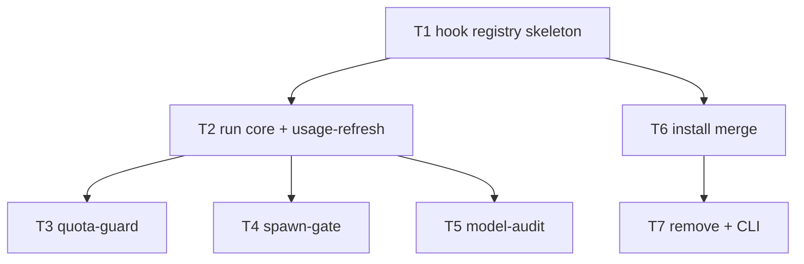

# F29 — Agent Hooks: Tasks

## Task graph



## Task F29-T1: Create the hook registry skeleton

**Depends on:** none

**Files:**
- create `internal/hooks/hooks.go`
- create `internal/hooks/hooks_test.go`

**Spec references:** `specs/features/F29-agent-hooks/CONTRACTS.md §1`, `docs/plan/annex-c-agent-integration.md §3.1–§3.4`

**Instructions:**
1. Create `internal/hooks/hooks.go`, `package hooks`, with ONLY the registry:
   ```go
   package hooks

   import (
       "fmt"
       "os"
   )

   // Hook is one lifecycle hook (annex-c §3.1–§3.4). Timeout is seconds.
   type Hook struct {
       ID      string
       Event   string
       Matcher string
       Timeout int
       // Underlying builds the annexed command argv: defaults first, then
       // passthrough args (later args win in cobra). env overrides
       // os.Getenv for WHICH_MODEL_TASK_PROFILE / WHICH_MODEL_CANDIDATE_ID.
       Underlying func(passthrough []string, env map[string]string) []string
   }

   // All is the four-hook registry, in annex-c §3 order.
   var All = []Hook{
       {
           ID: "usage-refresh", Event: "SessionStart", Matcher: "*", Timeout: 5,
           Underlying: func(p []string, _ map[string]string) []string {
               return append([]string{"usage", "--all", "--json", "--quiet", "--refresh-usage", "--timeout", "5s"}, p...)
           },
       },
       {
           ID: "quota-guard", Event: "SessionStart", Matcher: "*", Timeout: 5,
           Underlying: func(p []string, _ map[string]string) []string {
               return append([]string{"usage", "--all", "--json", "--band-at-or-above", "critical", "--quiet"}, p...)
           },
       },
       {
           ID: "spawn-gate", Event: "PreToolUse", Matcher: "Task", Timeout: 8,
           Underlying: func(p []string, env map[string]string) []string {
               profile := envOr(env, "WHICH_MODEL_TASK_PROFILE", "balanced_implementation")
               return append([]string{"pick", "--profile", profile, "--strategy", "priority", "--json"}, p...)
           },
       },
       {
           ID: "model-audit", Event: "PostToolUse", Matcher: "Task", Timeout: 5,
           Underlying: func(p []string, env map[string]string) []string {
               if id := envOr(env, "WHICH_MODEL_CANDIDATE_ID", ""); id != "" {
                   return append([]string{"explain", id, "--json"}, p...)
               }
               return append([]string{"explain", "--last", "--json"}, p...)
           },
       },
   }

   func envOr(env map[string]string, key, def string) string {
       if v, ok := env[key]; ok {
           return v
       }
       if v := os.Getenv(key); v != "" {
           return v
       }
       return def
   }

   // Get returns the hook with the given id.
   func Get(name string) (Hook, bool) {
       for _, h := range All {
           if h.ID == name {
               return h, true
           }
       }
       return Hook{}, false
   }
   ```
2. Create `internal/hooks/hooks_test.go`, `package hooks`, with:
   - Test 1: `Get` for each of the four ids returns ok=true, and `All` has exactly 4 entries in order `usage-refresh, quota-guard, spawn-gate, model-audit`.
   - Test 2: `Get("nonsense")` returns ok=false.
   - Test 3: registry table — for each hook assert (Event, Matcher, Timeout) == the annex-c values: usage-refresh (SessionStart, `*`, 5), quota-guard (SessionStart, `*`, 5), spawn-gate (PreToolUse, Task, 8), model-audit (PostToolUse, Task, 5).
   - Test 4: argv builders use the documented commands; spawn-gate includes `--strategy priority`.
   - Test 5: passthrough arguments append after the spawn-gate defaults.

**Test cases (write these first):**

| # | input | want |
|---|---|---|
| 1 | `Get` each id | ok=true; `All` order and length 4 |
| 2 | `Get("nonsense")` | ok=false |
| 3 | (Event, Matcher, Timeout) per hook | annex-c §3.1–§3.4 table values |
| 4 | each `Underlying(nil, env)` | exact argv per step 1 |
| 5 | `spawn-gate.Underlying(["--quiet"], nil)` | `[..., "--json", "--quiet"]` |

**Acceptance criteria:**
- [ ] `go build ./internal/hooks/...` succeeds
- [ ] `go test ./internal/hooks/...` passes with the test cases above
- [ ] no file outside the Files list modified

**Run:** `go test ./internal/hooks/...`

## Task F29-T2: Implement the run core and the usage-refresh hook

**Depends on:** F29-T1

**Files:**
- create `internal/hooks/run.go`
- extend `internal/hooks/hooks_test.go` (or create `run_test.go` — either, one test file group)

**Spec references:** `specs/features/F29-agent-hooks/CONTRACTS.md §1 run.go + §4`, `SPEC.md behaviours 3/4/6/7`, `docs/plan/annex-c-agent-integration.md §3.1`

**Instructions:**
1. Create `internal/hooks/run.go` with EXACTLY:
   ```go
   package hooks

   import (
       "bytes"
       "encoding/json"
       "errors"
       "io"
       "os"
   )

   // Envelope is the sole stdout shape (SPEC behaviour 3).
   type Envelope struct {
       Decision           string         `json:"decision"`
       Reason             string         `json:"reason,omitempty"`
       HookSpecificOutput map[string]any `json:"hookSpecificOutput,omitempty"`
   }

   // MarshalEnvelope is compact JSON + "\n".
   func MarshalEnvelope(e Envelope) []byte {
       b, err := json.Marshal(e)
       if err != nil {
           b = []byte(`{"decision":"approve","reason":"internal marshal error"}`)
       }
       return append(b, '\n')
   }

   // Runner executes the underlying command in-process.
   type Runner func(args []string, stdout, stderr io.Writer) int

   // Options carries the test seams (SPEC behaviour 4).
   type Options struct {
       Runner   Runner
       Stdin    []byte
       Env      map[string]string
       RepoRoot string
   }

   var (
       errUnknownHook   = errors.New("unknown hook")
       errBadStdin      = errors.New("stdin fixture is not valid JSON")
   )

   // Run executes hook. Returns stdout bytes (possibly empty = fail-open
   // silence) or an error for exit-2-class conditions. Never errors for
   // underlying command failures (fail-open).
   func Run(name string, passthrough []string, opts Options) ([]byte, error) {
       h, ok := Get(name)
       if !ok {
           return nil, errUnknownHook
       }
       code := 0
       var out []byte
       if len(opts.Stdin) > 0 {
           if !json.Valid(opts.Stdin) {
               return nil, errBadStdin
           }
           out = opts.Stdin // fixture replaces underlying stdout
       } else {
           runner := opts.Runner
           if runner == nil {
               runner = func([]string, io.Writer, io.Writer) int {
                   // CLI layer always supplies ExecuteCommand; a nil runner
                   // is a test authoring error — treat as failure (fail-open).
                   return 1
               }
           }
           var stdout, stderr bytes.Buffer
           code = runner(h.Underlying(passthrough, opts.Env), &stdout, &stderr)
           out = stdout.Bytes()
       }
       return dispatch(h, code, out, opts)
   }
   ```
2. Add the per-hook switch, starting with the two SessionStart hooks and error plumbing:
   ```go
   func dispatch(h Hook, code int, out []byte, opts Options) ([]byte, error) {
       switch h.ID {
       case "usage-refresh":
           if code != 0 {
               return nil, nil // fail-open silence (SPEC behaviour 6)
           }
           return MarshalEnvelope(Envelope{
               Decision:           "approve",
               Reason:             "usage cache refreshed",
               HookSpecificOutput: map[string]any{},
           }), nil
       case "quota-guard", "spawn-gate", "model-audit":
           // implemented in tasks F29-T3 / F29-T4 / F29-T5
           return nil, errors.New("hook not yet implemented: " + h.ID)
       }
       return nil, errUnknownHook
   }
   ```
   This leaves quota-guard/spawn-gate/model-audit erroring — do NOT implement them here (later tasks replace the switch arms).
3. Create the tests in `run_test.go`, `package hooks`, with a `fakeRunner` helper:
   ```go
   func fakeRunner(code int, out string) Runner {
       return func(args []string, stdout, stderr io.Writer) int {
           stdout.Write([]byte(out))
           return code
       }
   }
   ```
   Test cases:
   - `Run("usage-refresh", nil, Options{Runner: fakeRunner(0, `{"schema_version":"2.0","usage_enabled":true,"snapshots":[]}`), RepoRoot: t.TempDir()})` → exact bytes `{"decision":"approve","reason":"usage cache refreshed","hookSpecificOutput":{}}\n`.
   - same with `fakeRunner(2, "")` → empty bytes, nil error (fail-open silence).
   - same with `fakeRunner(5, "auth needed")` → empty bytes, nil error.
   - `Run("nonsense", nil, Options{})` → error equal to `errUnknownHook`.
   - `Run("usage-refresh", nil, Options{Stdin: []byte("not json")})` → error equal to `errBadStdin`.
   - `Run("usage-refresh", nil, Options{Stdin: []byte(`{"anything":1}`)})` → the approve envelope (fixture path skips the runner entirely; assert the runner was NEVER called via a flag-closing fake).
   - canary: `Run("usage-refresh", nil, Options{Stdin: []byte(`{"secret":"CANARY_XYZ"}`)})` → output bytes do NOT contain `CANARY_XYZ` (envelope is constant; canary rule, SPEC behaviour 12).
   - malformed run error messages: assert `errUnknownHook`/`errBadStdin` are the sentinel values (callers map them to exit 2).

**Test cases (write these first):**

| # | input | want |
|---|---|---|
| 1 | `usage-refresh`, runner 0 | exact approve envelope bytes |
| 2 | `usage-refresh`, runner exit 2 | empty output, nil error |
| 3 | `usage-refresh`, runner exit 5 | empty output, nil error |
| 4 | `Run("nonsense", …)` | error == `errUnknownHook` |
| 5 | stdin `not json` | error == `errBadStdin` |
| 6 | stdin valid JSON | approve envelope; runner not invoked |
| 7 | stdin containing `CANARY_XYZ` | envelope bytes lack `CANARY_XYZ` |

**Acceptance criteria:**
- [ ] `go build ./internal/hooks/...` succeeds
- [ ] `go test ./internal/hooks/...` passes with the test cases above
- [ ] no file outside the Files list modified

**Run:** `go test ./internal/hooks/...`

## Task F29-T3: Implement the quota-guard hook

**Depends on:** F29-T2

**Files:**
- extend `internal/hooks/run.go` (quota-guard arm of `dispatch`)
- extend `run_test.go`

**Spec references:** `specs/features/F29-agent-hooks/CONTRACTS.md §4`, `SPEC.md behaviours 5/6/7/12`, `docs/plan/annex-c-agent-integration.md §3.4/§4.1`

**Instructions:**
1. Replace the `"quota-guard"` placeholder arm in `dispatch` with:
   ```go
   case "quota-guard":
       if code != 0 {
           return nil, nil // fail-open silence
       }
       var doc struct {
           Snapshots []struct {
               Provider string `json:"provider"`
           } `json:"snapshots"`
       }
       if err := json.Unmarshal(out, &doc); err != nil || doc.Snapshots == nil {
           return nil, nil // unparseable → fail-open silence
       }
       seen := map[string]bool{}
       var providers []string
       for _, s := range doc.Snapshots {
           if s.Provider != "" && !seen[s.Provider] {
               seen[s.Provider] = true
               providers = append(providers, s.Provider)
           }
       }
       if len(providers) == 0 {
           return MarshalEnvelope(Envelope{
               Decision:           "approve",
               Reason:             "no providers at or above critical band",
               HookSpecificOutput: map[string]any{},
           }), nil
       }
       return MarshalEnvelope(Envelope{
           Decision: "block",
           Reason:   fmt.Sprintf("quota guard: %d provider(s) at or above critical band", len(providers)),
           HookSpecificOutput: map[string]any{
               "critical_providers": providers,
           },
       }), nil
   ```
   (add `"fmt"` to the imports; `doc.Snapshots == nil` distinguishes a missing key from an empty array.)
2. Add tests:
   - fixture stdin (annex-c §4.1-shaped): `{"schema_version":"2.0","usage_enabled":true,"snapshots":[{"provider":"claude","confidence":"live","windows":[]},{"provider":"codex","confidence":"live","windows":[]}]}` → exact block envelope with `"critical_providers":["claude","codex"]` and reason `quota guard: 2 provider(s) at or above critical band`.
   - fixture with empty array `{"snapshots":[]}` → approve envelope `no providers at or above critical band`.
   - fixture with duplicate providers → de-duplicated in first-seen order.
   - fixture missing `snapshots` key → empty output, nil error.
   - runner exit 1 → empty output (fail-open), even with valid stdout.
   - runner exit 0 with non-JSON stdout → empty output (unparseable → silence).
   - canary: fixture `{"snapshots":[{"provider":"claude"}],"secret":"CANARY_QUOTA"}` → envelope bytes lack `CANARY_QUOTA`.
   - golden: block envelope bytes exactly equal the golden string `{"decision":"block","reason":"quota guard: 1 provider(s) at or above critical band","hookSpecificOutput":{"critical_providers":["claude"]}}` + `\n`.

**Test cases (write these first):**

| # | input | want |
|---|---|---|
| 1 | stdin 2 providers | exact block envelope, providers in order |
| 2 | stdin `{"snapshots":[]}` | exact approve envelope |
| 3 | stdin duplicate providers | de-duplicated `critical_providers` |
| 4 | stdin missing `snapshots` | empty output, nil error |
| 5 | runner exit 1 + valid stdout | empty output (fail-open) |
| 6 | runner exit 0 + non-JSON stdout | empty output |
| 7 | stdin with `CANARY_QUOTA` | envelope lacks it |
| 8 | golden block envelope | byte-exact match |

**Acceptance criteria:**
- [ ] `go test ./internal/hooks/...` passes with the test cases above
- [ ] no file outside the Files list modified

**Run:** `go test ./internal/hooks/...`

## Task F29-T4: Implement the spawn-gate hook

**Depends on:** F29-T2

**Files:**
- extend `internal/hooks/run.go` (spawn-gate arm of `dispatch`)
- extend `run_test.go`

**Spec references:** `specs/features/F29-agent-hooks/CONTRACTS.md §4`, `SPEC.md behaviours 5/6/7`, `docs/plan/annex-c-agent-integration.md §3.2/§4.2/§4.7`

**Instructions:**
1. Replace the `"spawn-gate"` placeholder arm with:
   ```go
   case "spawn-gate":
       if code != 0 {
           if code == 4 {
               var doc struct {
                   Excluded []json.RawMessage `json:"excluded_candidates"`
               }
               if err := json.Unmarshal(out, &doc); err != nil {
                   return approveFailOpen("spawn-gate", 4), nil
               }
               var names []string
               for _, raw := range doc.Excluded {
                   var ex struct {
                       ReasonCode string `json:"reason_code"`
                       Route      struct {
                           Provider string `json:"provider"`
                       } `json:"route"`
                   }
                   if err := json.Unmarshal(raw, &ex); err != nil {
                       continue
                   }
                   if ex.ReasonCode == "band_gated" {
                       names = append(names, ex.Route.Provider)
                   }
               }
               if len(names) == 0 {
                   return approveFailOpen("spawn-gate", 4), nil
               }
               return MarshalEnvelope(Envelope{
                   Decision: "block",
                   Reason:   "all eligible providers band-gated: " + strings.Join(names, ", "),
                   HookSpecificOutput: map[string]any{
                       "excluded_candidates": doc.Excluded,
                   },
               }), nil
           }
           return approveFailOpen("spawn-gate", code), nil
       }
       var doc struct {
           Candidates []json.RawMessage `json:"candidates"`
       }
       if err := json.Unmarshal(out, &doc); err != nil || len(doc.Candidates) == 0 {
           return approveFailOpen("spawn-gate", 0), nil
       }
       var first struct {
           CandidateID string `json:"candidate_id"`
       }
       if err := json.Unmarshal(doc.Candidates[0], &first); err != nil {
           return approveFailOpen("spawn-gate", 0), nil
       }
       return MarshalEnvelope(Envelope{
           Decision: "approve",
           Reason:   "dispatch approved: " + first.CandidateID,
           HookSpecificOutput: map[string]any{
               "candidate": json.RawMessage(doc.Candidates[0]),
           },
       }), nil
   ```
   and add:
   ```go
   func approveFailOpen(hook string, code int) []byte {
       return MarshalEnvelope(Envelope{
           Decision: "approve",
           Reason:   fmt.Sprintf("fail-open: %s underlying command exited %d", hook, code),
           HookSpecificOutput: map[string]any{},
       })
   }
   ```
   Note `excluded_candidates` and `candidate` are carried as `json.RawMessage` (verbatim bytes inside the envelope — field names and values untouched, annex-c §4.2 fidelity).
2. Add tests using fixture stdin (runner never called) and `fakeRunner` for exit codes:
   - exit 0 with a 2-candidate pick fixture → approve envelope; `hookSpecificOutput.candidate` is the exact first candidate object bytes; reason `dispatch approved: cand-1`.
   - exit 0 with `"candidates":[]` → fail-open approve envelope with reason containing `exited 0`.
   - exit 4 with fixture `{"excluded_candidates":[{"route":{"provider":"claude"},"reason_code":"band_gated","reason":"at gate"},{"route":{"provider":"codex"},"reason_code":"auth_required","reason":"login"}]}` → block envelope; reason `all eligible providers band-gated: claude`; `hookSpecificOutput.excluded_candidates` is the verbatim array.
   - exit 4 with no band_gated entries → fail-open approve (reason contains `exited 4`).
   - exit 4 with non-JSON stdout → fail-open approve.
   - exits 1, 2, 3, 5 → fail-open approve, reason contains the exit number; payload `{}`.
   - exit 0 with non-JSON stdout → fail-open approve.
   - `WHICH_MODEL_TASK_PROFILE` plumbing: `Run("spawn-gate", nil, Options{Runner: capturingRunner})` where capturingRunner records argv; with `Env: {"WHICH_MODEL_TASK_PROFILE":"research"}` argv contains `--profile research` (from registry test, verify via the runner's recorded args).
   - canary: exit-0 fixture with an extra top-level field `"secret":"CANARY_PICK"` → envelope bytes lack `CANARY_PICK` (only `candidates[0]` is echoed).

**Test cases (write these first):**

| # | input | want |
|---|---|---|
| 1 | exit 0, 2 candidates | approve; `candidate` verbatim; reason `dispatch approved: cand-1` |
| 2 | exit 0, empty candidates | fail-open approve, reason contains `exited 0` |
| 3 | exit 4, mixed exclusions | block; reason `all eligible providers band-gated: claude`; array verbatim |
| 4 | exit 4, no band_gated | fail-open approve with `exited 4` |
| 5 | exit 4, non-JSON stdout | fail-open approve |
| 6 | exits 1/2/3/5 | fail-open approve, reason contains exit number, payload `{}` |
| 7 | exit 0, non-JSON stdout | fail-open approve |
| 8 | env `WHICH_MODEL_TASK_PROFILE=research` | underlying argv has `--profile research` |
| 9 | fixture with `CANARY_PICK` extra field | envelope lacks it |

**Acceptance criteria:**
- [ ] `go test ./internal/hooks/...` passes with the test cases above
- [ ] no file outside the Files list modified

**Run:** `go test ./internal/hooks/...`

## Task F29-T5: Implement the model-audit hook

**Depends on:** F29-T2

**Files:**
- extend `internal/hooks/run.go` (model-audit arm of `dispatch`)
- extend `run_test.go`

**Spec references:** `specs/features/F29-agent-hooks/CONTRACTS.md §3/§4`, `SPEC.md behaviours 7/8/12`, `docs/plan/annex-c-agent-integration.md §3.3/§4.3/§5`

**Instructions:**
1. Add the `model-audit` arm:
   ```go
   case "model-audit":
       if code != 0 {
           return approveFailOpen("model-audit", code), nil
       }
       var doc map[string]json.RawMessage
       if err := json.Unmarshal(out, &doc); err != nil {
           return approveFailOpen("model-audit", 0), nil
       }
       candidateRaw, ok := doc["candidate"]
       if !ok {
           return approveFailOpen("model-audit", 0), nil
       }
       var cand struct {
           Route struct {
               ModelID string `json:"model_id"`
           } `json:"route"`
       }
       if err := json.Unmarshal(candidateRaw, &cand); err != nil {
           return approveFailOpen("model-audit", 0), nil
       }
       root := opts.RepoRoot
       if root == "" {
           return approveFailOpen("model-audit", 0), nil
       }
       evidenceDir := filepath.Join(root, ".which-model")
       if err := os.MkdirAll(evidenceDir, 0o700); err != nil {
           return approveFailOpen("model-audit", 0), nil
       }
       evidenceFile := filepath.Join(evidenceDir, "evidence.jsonl")
       if err := appendLine(evidenceFile, out); err != nil {
           return approveFailOpen("model-audit", 0), nil
       }
       mismatch := false
       if dispatched := envOr(opts.Env, "WHICH_MODEL_DISPATCHED_MODEL", ""); dispatched != "" && dispatched != cand.Route.ModelID {
           mismatch = true
           rec := map[string]any{
               "ts":              time.Now().UTC().Format(time.RFC3339),
               "dispatched_model": dispatched,
               "route_model_id":   cand.Route.ModelID,
               "evidence":         json.RawMessage(out),
           }
           b, err := json.Marshal(rec)
           if err == nil {
               appendLine(filepath.Join(evidenceDir, "audit-mismatches.jsonl"), b)
           }
       }
       return MarshalEnvelope(Envelope{
           Decision: "approve",
           Reason:   "dispatch evidence recorded",
           HookSpecificOutput: map[string]any{
               "evidence_logged": evidenceFile,
               "mismatch":        mismatch,
           },
       }), nil
   ```
   and helpers:
   ```go
   func appendLine(path string, line []byte) error {
       f, err := os.OpenFile(path, os.O_APPEND|os.O_CREATE|os.O_WRONLY, 0o600)
       if err != nil {
           return err
       }
       defer f.Close()
       if len(line) == 0 || line[len(line)-1] != '\n' {
           line = append(line, '\n')
       }
       _, err = f.Write(line)
       return err
   }
   ```
   (add `"path/filepath"`, `"time"` imports.) Note: the appended line is the FULL explain object (annex-c §3.3: "appends one `Evidence` object (§5) per dispatch"; the §4.3 root object includes `schema_version`, `candidate`, `evidence`).
2. Add tests (each with a fresh `t.TempDir()` as `RepoRoot`):
   - exit 0 with an explain fixture `{"schema_version":"2.0","usage_enabled":true,"candidate":{"candidate_id":"c-1","route":{"provider":"claude","model_id":"claude-sonnet-4-5","model":"Claude Sonnet 4.5","reasoning":"medium","window_ids":["w1"]}},"evidence":{"profile":"balanced_implementation","score_inputs":{},"route_provenance":"provider_live","excluded_candidates":[]}}` → approve envelope, `"mismatch":false`, `evidence_logged` ends with `/.which-model/evidence.jsonl`; file exists with exactly one line == the fixture bytes; file mode is `0600` (`os.Stat().Mode().Perm()`).
   - env `WHICH_MODEL_DISPATCHED_MODEL=claude-sonnet-4-5` (matching) → no mismatch file; envelope mismatch=false.
   - env `WHICH_MODEL_DISPATCHED_MODEL=gpt-5` (mismatch) → envelope mismatch=true; `audit-mismatches.jsonl` has one line; parse it: `dispatched_model == "gpt-5"`, `route_model_id == "claude-sonnet-4-5"`, `evidence` present.
   - second run appends a second line (both lines intact, JSONL).
   - exit 1 → fail-open approve; no evidence file created.
   - exit 0, fixture without `candidate` key → fail-open approve; no file.
   - exit 0, fixture with `candidate` lacking `route` → fail-open approve; no file.
   - canary: fixture containing `CANARY_EVIDENCE` in `evidence.score_inputs` → envelope bytes lack `CANARY_EVIDENCE`.
   - `RepoRoot` empty → fail-open approve, no error.
   - passthrough: `Run("model-audit", ["--last"], Options{Runner: capturingRunner, Env: {"WHICH_MODEL_CANDIDATE_ID":"c-9"}})` → argv `["explain","c-9","--json","--last"]` (env id wins, passthrough appended).

**Test cases (write these first):**

| # | input | want |
|---|---|---|
| 1 | exit 0, valid explain fixture | approve; `evidence_logged` path; one line == fixture; mode 0600 |
| 2 | env dispatched == route model_id | no mismatch file; `"mismatch":false` |
| 3 | env dispatched != route model_id | `"mismatch":true`; mismatch line fields correct |
| 4 | second run | two JSONL lines, both intact |
| 5 | exit 1 | fail-open approve; no file created |
| 6 | fixture missing `candidate` | fail-open approve; no file |
| 7 | fixture candidate missing `route` | fail-open approve; no file |
| 8 | fixture with `CANARY_EVIDENCE` | envelope lacks it |
| 9 | `RepoRoot` empty | fail-open approve |
| 10 | passthrough `--last` + env id | argv `["explain","c-9","--json","--last"]` |

**Acceptance criteria:**
- [ ] `go test ./internal/hooks/...` passes with the test cases above
- [ ] no file outside the Files list modified

**Run:** `go test ./internal/hooks/...`

## Task F29-T6: Implement install merge (claude manifest + generic marker block)

**Depends on:** F29-T1

**Files:**
- create `internal/hooks/config.go`
- create `internal/hooks/install.go`
- create `internal/hooks/install_test.go`

**Spec references:** `specs/features/F29-agent-hooks/CONTRACTS.md §1 config.go + install.go + §3`, `SPEC.md behaviours 9/10/11`, `docs/plan/annex-c-agent-integration.md §3.5`

**Instructions:**
1. Create `internal/hooks/config.go` with `Entry`, `Manifest`, `LoadManifest`, `SaveManifest`, `claudeSettings` + its methods, `loadClaudeSettings`, `saveClaudeSettings` per CONTRACTS §1 (exact signatures). Semantics:
   - `loadClaudeSettings` on a missing file returns an empty map, nil; on a file whose content is not valid JSON returns an error naming the path.
   - `mergeOwned`: for each entry in order, walk `settings["hooks"][entry.Event]` (an array of `{"matcher":..., "hooks":[{"type":"command","command":...,"timeout":...}]}` objects); if an object with the same `matcher` exists, replace its `hooks` sub-array entry that has the same `command` (or append to that object's `hooks` if the matcher object exists but command not present); if no such matcher object exists, append a new one. Entries with (event, matcher, command) already present are left untouched (idempotence).
   - `removeOwned`: delete only the (event, matcher, command) triples listed; drop a matcher object when its `hooks` array becomes empty; drop an event key when its array becomes empty.
   - `saveClaudeSettings`: `json.MarshalIndent(s, "", "  ")` + `"\n"`, `0644`.
   - `SaveManifest`: compact JSON + `"\n"`, `0600`.
2. Create `internal/hooks/install.go`:
   ```go
   package hooks

   type Variant int

   const (
       VariantAuto Variant = iota
       VariantUsage
       VariantNoUsage
   )

   // Installed returns the owned entries for a variant (SPEC behaviour 9).
   func Installed(v Variant) []Entry {
       if v == VariantNoUsage {
           return []Entry{
               {ID: "spawn-gate", Event: "UserPromptSubmit", Matcher: "*", Timeout: 10,
                   Command: "which-model hooks run spawn-gate --no-usage --profile balanced_implementation --quiet"},
               {ID: "model-audit", Event: "PostToolUse", Matcher: "Task", Timeout: 5,
                   Command: "which-model hooks run model-audit --last"},
           }
       }
       return []Entry{
           {ID: "usage-refresh", Event: "SessionStart", Matcher: "*", Timeout: 5, Command: "which-model hooks run usage-refresh"},
           {ID: "quota-guard", Event: "SessionStart", Matcher: "*", Timeout: 5, Command: "which-model hooks run quota-guard"},
           {ID: "spawn-gate", Event: "PreToolUse", Matcher: "Task", Timeout: 8, Command: "which-model hooks run spawn-gate"},
           {ID: "model-audit", Event: "PostToolUse", Matcher: "Task", Timeout: 5, Command: "which-model hooks run model-audit"},
       }
   }
   ```
   Then `Install(target string, entries []Entry, repoRoot string) ([]string, error)`:
   - target `"claude"`: `settingsPath := filepath.Join(repoRoot, ".claude", "settings.json")`; `manifestPath := filepath.Join(repoRoot, ".claude", "which-model-hooks.json")`; `m, err := LoadManifest(manifestPath)`; `created := m == nil`; `s, err := loadClaudeSettings(settingsPath)`; `s.mergeOwned(entries)`; `os.MkdirAll(filepath.Dir(settingsPath), 0o755)`; `saveClaudeSettings`; `SaveManifest(manifestPath, &Manifest{Version: 1, CreatedSettings: created || settingsFileWasAbsent, Hooks: entries})` — track `settingsFileWasAbsent` from the stat before load; return one summary line per entry: `"installed <id> (claude: <event>/<matcher>, timeout <N>s)"`.
   - target `"generic"`: `hooksPath := filepath.Join(repoRoot, "agents", "hooks.toml")`; read existing file (missing → empty); splice between the marker lines `# === which-model managed hooks (do not edit) ===` and `# === end which-model managed hooks ===` (replace existing block content if markers present, else append block at end; ensure exactly one trailing `\n`); write `0644`. Block content per hook:
     ```toml
     [[hooks]]
     event = "<event>"
     command = "<Command>"
     timeout_ms = <Timeout*1000>
     on_failure = "ignore"
     ```
     plus `inject_as = "context.which_model_quota_guard"` for quota-guard and `inject_as = "context.which_model_pick"` for spawn-gate (annex-c §3.2/§3.4 generic columns). Events map: `SessionStart`→`session_start`, `PreToolUse`/`UserPromptSubmit`→`pre_dispatch`, `PostToolUse`→`post_dispatch`. Return one summary line per entry.
3. Create `internal/hooks/install_test.go` (all under `t.TempDir()` repos):
   - `Install("claude", Installed(VariantUsage), root)` on a fresh repo → settings.json exists, parses, contains 4 entries across 3 events (SessionStart 2, PreToolUse 1, PostToolUse 1); manifest exists with `created_settings: true` and 4 entries; summary has 4 lines.
   - install again (same variant) → settings.json bytes and manifest bytes byte-identical to the first run (idempotence).
   - foreign preservation: pre-write settings.json containing `{"permissions":{"allow":["Bash(*)"]},"hooks":{"SessionStart":[{"matcher":"*","hooks":[{"type":"command","command":"echo hello","timeout":1}]}]}}` → after install, `permissions` still present, foreign echo entry still present, our 4 entries added; `created_settings: false`.
   - variant B: `Installed(VariantNoUsage)` → exactly 2 entries, events UserPromptSubmit + PostToolUse, spawn-gate command contains `--no-usage --profile balanced_implementation --quiet`, model-audit command ends with `--last`.
   - generic fresh: `Install("generic", Installed(VariantUsage), root)` → `agents/hooks.toml` exists; contains `event = "session_start"` twice, `event = "pre_dispatch"`, `event = "post_dispatch"`, `on_failure = "ignore"`, `inject_as = "context.which_model_quota_guard"` and `"context.which_model_pick"`, the marker pair exactly once each.
   - generic idempotent: install twice → bytes identical.
   - generic foreign preservation: pre-write toml with a foreign block + comment → after install, the foreign text is still present and the marker block appears once.
   - invalid JSON settings.json → error containing the path.
   - unknown target `"codex"` → error containing `unknown target`.

**Test cases (write these first):**

| # | input | want |
|---|---|---|
| 1 | claude install, fresh repo, variant A | settings.json + manifest created; 4 entries; `created_settings: true` |
| 2 | claude install twice | second run byte-identical |
| 3 | claude install over foreign settings.json | foreign keys/entries preserved; `created_settings: false` |
| 4 | `Installed(VariantNoUsage)` | 2 entries; exact commands |
| 5 | generic install fresh | toml with 4 blocks, markers once, inject_as lines |
| 6 | generic install twice | byte-identical |
| 7 | generic install over foreign toml | foreign text preserved |
| 8 | settings.json invalid JSON | error contains path |
| 9 | `Install("codex", …)` | error contains `unknown target` |

**Acceptance criteria:**
- [ ] `go build ./internal/hooks/...` succeeds
- [ ] `go test ./internal/hooks/...` passes with the test cases above
- [ ] no file outside the Files list modified

**Run:** `go test ./internal/hooks/...`

## Task F29-T7: Implement remove and wire the hooks CLI

**Depends on:** F29-T6

**Files:**
- extend `internal/hooks/install.go` (`Remove`)
- create `pkg/whichmodel/hooks_cmd.go`
- extend `internal/hooks/install_test.go` (remove tests)
- create `pkg/whichmodel/hooks_cmd_test.go`

**Spec references:** `specs/features/F29-agent-hooks/CONTRACTS.md §1 install.go + §2`, `SPEC.md behaviours 1/4/11`, `docs/plan/annex-d-cli-reference.md §2.10`

**Instructions:**
1. Add to `internal/hooks/install.go`:
   ```go
   // Remove deletes owned entries only (SPEC behaviour 11). Returns a human
   // summary. Nothing installed → no-op success.
   func Remove(target string, repoRoot string) ([]string, error) {
       switch target {
       case "claude":
           manifestPath := filepath.Join(repoRoot, ".claude", "which-model-hooks.json")
           m, err := LoadManifest(manifestPath)
           if err != nil {
               return nil, err
           }
           if m == nil {
               return []string{"no which-model hooks installed (nothing to remove)"}, nil
           }
           settingsPath := filepath.Join(repoRoot, ".claude", "settings.json")
           s, err := loadClaudeSettings(settingsPath)
           if err != nil {
               return nil, err
           }
           s.removeOwned(m.Hooks)
           if s.empty() {
               if m.CreatedSettings {
                   if err := os.Remove(settingsPath); err != nil && !os.IsNotExist(err) {
                       return nil, err
                   }
               } else {
                   if err := saveClaudeSettings(settingsPath, s); err != nil {
                       return nil, err
                   }
               }
           } else {
               if err := saveClaudeSettings(settingsPath, s); err != nil {
                   return nil, err
               }
           }
           if err := os.Remove(manifestPath); err != nil && !os.IsNotExist(err) {
               return nil, err
           }
           return []string{"removed " + strconv.Itoa(len(m.Hooks)) + " which-model hook(s)"}, nil
       case "generic":
           hooksPath := filepath.Join(repoRoot, "agents", "hooks.toml")
           b, err := os.ReadFile(hooksPath)
           if err != nil {
               if os.IsNotExist(err) {
                   return []string{"no which-model hooks installed (nothing to remove)"}, nil
               }
               return nil, err
           }
           removed := spliceMarkers(b, nil) // drop the block content
           if bytes.Equal(removed, b) {
               return []string{"no which-model hooks installed (nothing to remove)"}, nil
           }
           if len(bytes.TrimSpace(removed)) == 0 {
               if err := os.Remove(hooksPath); err != nil && !os.IsNotExist(err) {
                   return nil, err
               }
           } else {
               if err := os.WriteFile(hooksPath, removed, 0o644); err != nil {
                   return nil, err
               }
           }
           return []string{"removed which-model hooks from agents/hooks.toml"}, nil
       default:
           return nil, fmt.Errorf("unknown target: %s", target)
       }
   }
   ```
   Factor the marker splice from `Install` into a shared private `spliceMarkers(content, block []byte) []byte` used by both (install passes the new block; remove passes nil = delete block content, keeping the marker lines OUT — remove the marker lines too when deleting: if block is nil, remove markers AND content so a re-install can append cleanly; spec: removal leaves no marker residue).
   - `claudeSettings.empty()` returns true when the map has no keys.
2. Create `pkg/whichmodel/hooks_cmd.go` (DECISION A: `func init() { register(NewHooksCmd) }`):
   ```go
   package whichmodel

   import (
       "encoding/json"
       "fmt"
       "os"

       "github.com/WD-Mitchell/which-model/internal/hooks"
       "github.com/WD-Mitchell/which-model/internal/skills"
   )

   func init() { register(NewHooksCmd) }

   func NewHooksCmd() *cobra.Command { ... }
   ```
   Subcommands:
   - `install`: flags `--target` (default `claude`, values claude|generic), `--usage`, `--no-usage`, `--repo`. Resolve repoRoot via `skills.RepoRoot()` honoring `--repo` (skills.SetRepoDir). Variant: `--usage`+`--no-usage` → error (exit 2); else both → `VariantNoUsage`/`VariantUsage`; neither → `usage.Enabled(cfg)` from F21 (`internal/usage` import — the nousage stub returns the disabled state; see CONTRACTS §5): enabled → `VariantUsage`, else `VariantNoUsage`. Print `hooks.Install(target, hooks.Installed(variant), repoRoot)` summary lines to stdout.
   - `remove`: same target/repo flags; print `hooks.Remove` lines.
   - `run <hook> [args...]`: `cobra.ArbitraryArgs`; resolve repoRoot via `skills.RepoRoot()` (ignore "no repo root" error — RepoRoot only matters for model-audit; on error use "" and let model-audit fail-open); `out, err := hooks.Run(name, args, hooks.Options{Runner: ExecuteCommand, RepoRoot: root})`; on error → stderr `which-model hooks: <err>` and return an error mapped to exit 2 by the root (use a sentinel `errExit2` if the root maps plain errors to 1 — check F22's convention and adapt; the observable contract is exit 2 for unknown hook and malformed stdin); else write `out` to stdout.
   - The command must import `"github.com/spf13/cobra"` and `"github.com/WD-Mitchell/which-model/internal/usage"` for `usage.Enabled` (call site guarded per CONTRACTS §5).
3. Extend `install_test.go` with remove tests:
   - after claude install (created_settings=true) → `Remove("claude", root)` → settings.json absent, manifest absent, summary `removed 4 which-model hook(s)`; second remove → `nothing to remove` (exit 0 class).
   - over foreign settings.json: install → remove → foreign content preserved in settings.json, manifest gone.
   - generic: install → remove → toml deleted (whitespace-only); remove again → `nothing to remove`.
   - generic with foreign content: install → remove → foreign text intact, no marker residue (`# === which-model` absent).
   - remove with unknown target → error.
4. Create `pkg/whichmodel/hooks_cmd_test.go` (fake repos via `t.TempDir()` + `--repo`; `usage.Enabled` returns the real resolved state — under a default test build usage is enabled, so variant A installs; force variant with `--no-usage` for B):
   - `hooks install --repo <tmp>` → exit 0; `.claude/settings.json` + manifest exist.
   - `hooks install --repo <tmp> --no-usage` → exit 0; manifest has 2 entries; settings.json lacks `usage-refresh`/`quota-guard`.
   - `hooks install --usage --no-usage` → exit 2.
   - `hooks install --target codex` → exit 2.
   - `hooks install` with no repo root and no `--repo` (run with cwd in a temp dir outside any git repo via `t.Chdir`) → exit 1.
   - `hooks remove --repo <tmp>` → exit 0; settings.json, manifest, toml absent (no trace).
   - `hooks run usage-refresh` with stdin piped from a fixture file (run via the root's Execute with `SetIn` if the F22 harness supports it, else invoke `hooks.Run` directly through the command's RunE with `cmd.SetIn`) → stdout is exactly the approve envelope; exit 0.
   - `hooks run nonsense` → exit 2, stderr contains `unknown hook`.
   - `hooks run usage-refresh` with stdin `not json` → exit 2, stderr contains `not valid JSON`.
   - Execute both SessionStart hooks with `hooks.Run(..., hooks.Options{Runner: ExecuteCommand})`, a fake F24 fetch result, and a real temp config. `usage-refresh` must emit its approve envelope and `quota-guard` must emit `critical_providers`; this test must exercise the real Cobra command tree so nonexistent subcommands/providers/flags fail.

**Test cases (write these first):**

| # | input | want |
|---|---|---|
| 1 | claude install (created) then remove | settings.json + manifest absent; summary `removed 4 which-model hook(s)` |
| 2 | remove when nothing installed | `nothing to remove`; exit 0 class |
| 3 | foreign settings.json: install then remove | foreign content preserved; manifest gone |
| 4 | generic install then remove | toml deleted; no marker residue |
| 5 | generic foreign toml: install then remove | foreign text intact; `# === which-model` absent |
| 6 | `Remove("codex", …)` | error contains `unknown target` |
| 7 | CLI `hooks install --repo` | exit 0; files exist |
| 8 | CLI `hooks install --no-usage` | 2 entries; no usage hooks |
| 9 | CLI `--usage --no-usage` / `--target codex` | exit 2 |
| 10 | CLI install without repo root | exit 1 |
| 11 | CLI `hooks remove --repo` after install | exit 0; no trace |
| 12 | CLI `hooks run` fixture / `nonsense` / bad stdin | envelope exit 0; exit 2 twice |
| 13 | SessionStart hooks through real `ExecuteCommand` | usage-refresh approves; quota-guard identifies the critical provider; both underlying commands parse and exit 0 |

**Acceptance criteria:**
- [ ] `go build ./pkg/whichmodel/...` succeeds
- [ ] `go test ./internal/hooks/...` and `go test ./pkg/whichmodel/...` pass
- [ ] `hooks run` exits 0 for all fail-open paths, 2 only for unknown hook / malformed stdin
- [ ] uninstall leaves no trace on files the installer created
- [ ] no file outside the Files list modified

**Run:** `go test ./internal/hooks/... && go test ./pkg/whichmodel/...`
