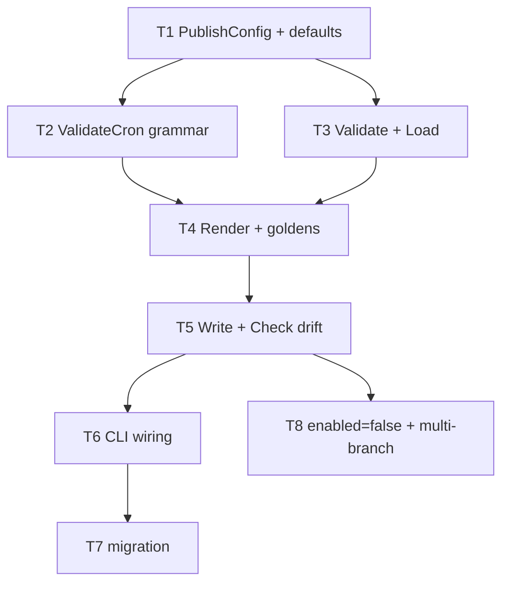

# F30 — Catalog Publishing: Tasks

## Task graph



## Task F30-T1: Create the publish config type and defaults

**Depends on:** none

**Files:**
- create `internal/catalog/publish/config.go`
- create `internal/catalog/publish/config_test.go`

**Spec references:** `specs/features/F30-publishing/CONTRACTS.md §1`, `docs/plan/annex-b-catalog-port.md §8.1`

**Instructions:**
1. Create `internal/catalog/publish/config.go`, `package publish`, with EXACTLY the `PublishConfig` struct, the default constants (`DefaultSchedule`, `DefaultTimezone`, `DefaultMode`, `DefaultMergeMethod`, `DefaultCommitMessage`, `DefaultPRTitle`), `DefaultBranches`, `DefaultPRLabels`, and the `UnmarshalKeyer` interface from CONTRACTS §1 (fields with doc comments). Do NOT implement `Load`/`Validate`/`ValidateCron` yet — declare only the type and defaults so the package compiles.
2. Create `internal/catalog/publish/config_test.go`:
   - Test 1 (compiles the struct): zero-value `PublishConfig{}` has all string fields, including `Environment`, empty and bool fields false; construct a populated one via struct literal and assert each field round-trips.
   - Test 2: default constants and slice vars have exactly the publishing values: `DefaultSchedule == "0 6 * * *"`, `DefaultTimezone == "Europe/London"`, `DefaultMode == "pull-request"`, `DefaultMergeMethod == "squash"`, `DefaultCommitMessage == "chore(data): refresh available model scores"`, `DefaultPRTitle` same string, `DefaultBranches == ["main"]`, `DefaultPRLabels == ["data","automated"]`.
   - Test 3: `NewDefaults()` returns slices that do NOT alias `DefaultBranches`/`DefaultPRLabels` (mutating the result's `Branches` does not change `DefaultBranches`).

**Test cases (write these first):**

| # | input | want |
|---|---|---|
| 1 | struct literal round-trip | all fields equal |
| 2 | defaults | exact publishing values |
| 3 | `NewDefaults()` slice aliasing | independent copies |

**Acceptance criteria:**
- [ ] `go build ./internal/catalog/publish/...` succeeds
- [ ] `go test ./internal/catalog/publish/...` passes with the test cases above
- [ ] no file outside the Files list modified

**Run:** `go test ./internal/catalog/publish/...`

## Task F30-T2: Implement the cron grammar validator

**Depends on:** F30-T1

**Files:**
- extend `internal/catalog/publish/config.go` (`ValidateCron`)
- create `internal/catalog/publish/cron_test.go`

**Spec references:** `specs/features/F30-publishing/SPEC.md behaviour 3 + Decisions`, `docs/plan/annex-b-catalog-port.md §8.1 (schedule key)`

**Instructions:**
1. Add to `internal/catalog/publish/config.go`:
   ```go
   // ValidateCron implements the SPEC behaviour-3 grammar: exactly 5 fields
   // (minute, hour, day-of-month, month, day-of-week); per-field tokens `*`,
   // a number, `A-B`, `*/N`, `A-B/N`, or comma-lists of those; bounds
   // minute 0-59, hour 0-23, dom 1-31, month 1-12, dow 0-6; 3-letter month
   // (JAN-DEC) and day (SUN-SAT) names allowed as single tokens or list
   // elements, case-insensitive, never inside ranges/steps. Rejects 6-field
   // crons, @-keywords, empty fields, out-of-bounds numbers, step 0.
   func ValidateCron(schedule string) error
   ```
   Implementation guidance: split on spaces (reject multiple consecutive spaces and leading/trailing whitespace via `strings.Fields` count != 5); per field, split on `,` (reject empty elements); per element, try in order: `*`, `N` (parse int, check bounds), `A-B` and `A-B/N`, `*/N` (N >= 1), name single token (month: JAN..DEC, dow: SUN..SAT; names resolve to their numeric value for bound-checking and are only allowed as a bare element, not inside `-`/`/` expressions); any other shape → error. Bounds per field from the table in the doc comment. Errors are of the form `invalid cron schedule "<s>": <detail> (<field>)`.
2. Create `internal/catalog/publish/cron_test.go`, table-driven `TestValidateCron` with the cases below (`wantErr bool` + substring for errors).

**Test cases (write these first):**

| # | input | want |
|---|---|---|
| 1 | `"0 6 * * *"` | ok |
| 2 | `"*/15 * * * *"` | ok |
| 3 | `"5,10,15 * * * *"` | ok |
| 4 | `"0 6 * JAN MON"` | ok (names) |
| 5 | `"0 6 * * sat"` | ok (case-insensitive) |
| 6 | `"0 6 * * * *"` (6 fields) | error containing `5 fields` |
| 7 | `"@daily"` | error containing `@` |
| 8 | `"60 6 * * *"` | error containing `minute` |
| 9 | `"0 6 * * 7"` | error containing `day-of-week` (dow bound 0-6; use `SUN` for Sunday) |
| 10 | `""` | error containing `5 fields` |
| 11 | `"MON-FRI * * * *"` | error (names not allowed in ranges) |
| 12 | `"*/0 * * * *"` | error (step 0) |

**Acceptance criteria:**
- [ ] `go test ./internal/catalog/publish/...` passes with the test cases above
- [ ] no file outside the Files list modified

**Run:** `go test ./internal/catalog/publish/...`

## Task F30-T3: Implement Validate and Load

**Depends on:** F30-T1

**Files:**
- extend `internal/catalog/publish/config.go` (`Validate`, `Load`)
- create `internal/catalog/publish/load_test.go`

**Spec references:** `specs/features/F30-publishing/CONTRACTS.md §1`, `SPEC.md behaviours 2/3`, `docs/plan/annex-b-catalog-port.md §8.1`

**Instructions:**
1. Add `Validate(pc *PublishConfig) error` per CONTRACTS §1: check `pc.Mode` ∈ {pull-request, direct-push} (error `catalog.publish.mode: unknown mode "<v>" (known: pull-request, direct-push)`); `pc.MergeMethod` ∈ {squash, merge, rebase} (error naming `merge_method`); `len(pc.Branches) == 0` → error `catalog.publish.branches must not be empty`; `ValidateCron(pc.Schedule)` errors are wrapped as `catalog.publish.schedule: <err>`; `pr_labels` deduplicated preserving order (mutate pc). Other fields are type-checked by the config layer (F01) — no further checks.
2. Add `Load(cfg UnmarshalKeyer) (*PublishConfig, error)`:
   ```go
   // Load decodes the complete [catalog] schema and both paths, applies defaults
   // for absent keys, and runs Validate. Missing section = all defaults.
   func Load(cfg UnmarshalKeyer) (*PublishConfig, error) {
       cc := catalog.Config{Publish: *NewDefaults()}
       if err := cfg.UnmarshalKey("catalog", &cc); err != nil { return nil, err }
       pc := &cc.Publish
       pc.RawCSVPath = firstNonEmpty(cc.RawCSVPath, "data/available_model_raw_values.csv")
       pc.ScoresCSVPath = firstNonEmpty(cc.ScoresCSVPath, "data/available_model_scores.csv")
       if err := Validate(pc); err != nil {
           return nil, err
       }
       return pc, nil
   }
   func firstNonEmpty(a, b string) string { if a != "" { return a }; return b }
   ```
   Important: because `UnmarshalKey("catalog", &cc)` decodes INTO the defaults-seeded struct, a present key of the wrong type surfaces as an F01 validation error (propagated, exit 2 class); an absent `branches` key leaves the default slice; an explicit `branches = []` decodes to an empty slice → `Validate` errors.
3. Create `internal/catalog/publish/load_test.go` using real TOML files and `config.LoadFile`, including sibling catalog keys and nested publishing values. A fake may test propagation of a sentinel error only; scalar-permissive fakes do not model F01's table-only contract.

**Test cases (write these first):**

| # | input | want |
|---|---|---|
| 1 | missing key (all zero) | `NewDefaults()` equivalent: enabled true, schedule/`timezone`/mode/`merge_method`/labels/branches defaults; artifact paths default |
| 2 | full valid section | every field populated; `RawCSVPath` from `catalog.raw_csv_path` |
| 3 | `mode = "rebasing"` | error containing `catalog.publish.mode` |
| 4 | `merge_method = "merge2"` | error containing `merge_method` |
| 5 | `branches = []` | error containing `branches must not be empty` |
| 6 | `schedule = "0 6 * * * *"` | error containing `catalog.publish.schedule` |
| 7 | UnmarshalKey returns an error | propagated verbatim |
| 8 | `pr_labels = ["data","data","x"]` | deduplicated `["data","x"]` |
| 9 | `mode = "direct-push"`, `auto_merge = false` | no error (values used in direct-push) |
| 10 | `enabled = false` | `Enabled == false`, everything else defaults, no error |

**Acceptance criteria:**
- [ ] `go test ./internal/catalog/publish/...` passes with the test cases above
- [ ] no file outside the Files list modified

**Run:** `go test ./internal/catalog/publish/...`

## Task F30-T4: Implement the workflow renderer with golden output

**Depends on:** F30-T2, F30-T3

**Files:**
- create `internal/catalog/publish/workflow.go`
- create `internal/catalog/publish/pins.go`
- create `internal/catalog/publish/workflow_test.go`
- create `internal/catalog/publish/testdata/refresh-model-data.golden.yml`

**Spec references:** `specs/features/F30-publishing/CONTRACTS.md §1 workflow.go + §4`, `SPEC.md behaviours 4/5/8/12 + Decisions`, `docs/plan/annex-b-catalog-port.md §8.2–§8.7`

**Instructions:**
1. Create `internal/catalog/publish/pins.go` with the `CheckoutPin` constant from CONTRACTS §1.
2. Create `internal/catalog/publish/workflow.go`:
   - `RepoRoot() (string, error)` — upward `.git` walk from cwd (same algorithm as `internal/skills.RepoRoot`; error `no repository root found (no .git ancestor)`).
   - `WorkflowPath(repoRoot string) string` — `filepath.Join(repoRoot, ".github", "workflows", DefaultWorkflowName)`.
   - `Render(pc *PublishConfig) ([]byte, error)` — returns `nil, nil` when `!pc.Enabled`; otherwise builds the YAML with `strings.Builder` + `fmt.Fprintf`, using the template in step 3 VERBATIM, then `[]byte(b.String())`. No template library; no map iteration (labels and branches are slices in listed order).
3. The template is the exact output for the golden config with publishing defaults, branches `["main","release"]`, and `RawCSVPath:"data/available_model_raw_values.csv"`:
   ```yaml
   # GENERATED by `which-model catalog workflow --write` from [catalog.publish] — do not hand-edit.
   name: refresh-model-data
   on:
     schedule:
       - cron: "0 6 * * *" # Europe/London, per [catalog.publish].schedule
     workflow_dispatch: {}
   permissions:
     contents: write
     pull-requests: write
   concurrency:
     group: refresh-model-data
     cancel-in-progress: false
   jobs:
     refresh:
       runs-on: ubuntu-latest
       timeout-minutes: 15
       environment: "CSV Update"
       strategy:
         fail-fast: false
         matrix:
           branch: ["main", "release"] # from [catalog.publish].branches, listed order
       steps:
         - uses: actions/checkout@3d3c42e5aac5ba805825da76410c181273ba90b1 # v7.0.1
           with:
             ref: ${{ matrix.branch }}
             token: ${{ secrets.CSV_UPDATE_TOKEN || github.token }}
         - run: |
             python3 .daily-update/refresh-model-data.py --output 'data/available_model_raw_values.csv'
           env:
             ARTIFICIAL_ANALYSIS_API: ${{ secrets.ARTIFICIAL_ANALYSIS_API }}
         - run: |
             python3 .daily-update/generate_scores.py --input 'data/available_model_raw_values.csv' --output 'data/available_model_scores.csv'
             python3 -m unittest discover -s .daily-update/tests -v
         - id: changes
           run: |
             git add -- 'data/available_model_raw_values.csv' 'data/available_model_scores.csv'
             git diff --cached --quiet || echo "changed=true" >> "$GITHUB_OUTPUT"
         - if: steps.changes.outputs.changed == 'true'
           run: |
             git -c user.name="github-actions[bot]" -c user.email="github-actions[bot]@users.noreply.github.com" \
               commit -m "chore(data): refresh available model scores"
         - if: steps.changes.outputs.changed == 'true'
           run: |
             head_branch="refresh-model-data-${{ github.run_id }}-${{ strategy.job-index }}"
             git push origin "HEAD:refs/heads/${head_branch}"
             gh pr create --base "${{ matrix.branch }}" --head "${head_branch}" --title "chore(data): refresh available model scores" --body "Automated catalog refresh." --label data --label automated
           env:
             GH_TOKEN: ${{ secrets.CSV_UPDATE_TOKEN || github.token }}
         - if: steps.changes.outputs.changed == 'true'
           run: |
             if [ -n "$CSV_UPDATE_TOKEN" ]; then
               gh pr review --approve "refresh-model-data-${{ github.run_id }}-${{ strategy.job-index }}"
             fi
           env:
             GH_TOKEN: ${{ github.token }}
             CSV_UPDATE_TOKEN: ${{ secrets.CSV_UPDATE_TOKEN }}
         - id: merge
           if: steps.changes.outputs.changed == 'true'
           run: gh pr merge --auto --squash "refresh-model-data-${{ github.run_id }}-${{ strategy.job-index }}"
           env:
             GH_TOKEN: ${{ github.token }}
         - name: Report per-branch outcome
           if: always()
           run: |
             if [ "${{ steps.changes.outcome }}" = "success" ] && [ "${{ steps.changes.outputs.changed }}" != "true" ]; then
               echo "refresh branch ${{ matrix.branch }}: skipped-no-changes" >> "$GITHUB_STEP_SUMMARY"
             elif [ "${{ steps.merge.outcome }}" = "success" ]; then
               echo "refresh branch ${{ matrix.branch }}: auto-merge-enabled" >> "$GITHUB_STEP_SUMMARY"
             else
               echo "refresh branch ${{ matrix.branch }}: failed" >> "$GITHUB_STEP_SUMMARY"
             fi
   ```
   Substitutions (all else verbatim): cron line comment uses `pc.Timezone`; non-empty `pc.Environment` emits the quoted job-level `environment`; `matrix.branch` list = `["` + `pc.Branches` joined `", "` + `"]` (values quoted, listed order); `git add --` paths = shell-quoted `pc.RawCSVPath` and `pc.ScoresCSVPath`; commit `-m` = `pc.CommitMessage`; `--title "…"` = `pc.PRTitle`; one `--label <l>` per `pc.PRLabels`; `--<merge_method>` = `pc.MergeMethod`. Mode-dependent sections:
   - `direct-push`: `permissions:` has only `contents: write`; PR steps become one `id: publish` push step; its successful report vocabulary is `published`.
   - `pull-request`: optional `CSV_UPDATE_TOKEN` authenticates checkout, push, and PR creation; `github.token` approves the PAT-authored PR and enables auto-merge. Successful merge-request reporting is `auto-merge-enabled`, never `published`.
   - The workflow never emits Go setup, build, tests, a `which-model` invocation, ; Python-generated scores are staged together with raw values. The outcome-report step is always emitted last and keys success to `steps.publish.outcome` or `steps.merge.outcome`.
4. Write the golden file `testdata/refresh-model-data.golden.yml` = the exact template output above (byte-for-byte; the test compares `Render` output to it).
5. Create `internal/catalog/publish/workflow_test.go`:
   - build a `pc` helper returning the golden config (`GoldenPC()` in the test file);
   - Test 1: `Render(GoldenPC())` == golden file bytes (`os.ReadFile("testdata/refresh-model-data.golden.yml")`; test cwd = package dir).
   - Test 2: determinism — two `Render` calls byte-equal.
   - Test 3: trailing bytes — last byte `\n`, no `\n\n` suffix, no `\r` anywhere.
   - Test 4: single branch `["main"]` → matrix line `branch: ["main"] # from [catalog.publish].branches, listed order`; concurrency group `refresh-model-data`; `cancel-in-progress: false`.
   - Test 5: `Mode:"direct-push"` → contains `git push origin HEAD:${{ matrix.branch }}`; NOT contains `gh pr`, `pull-requests: write`, `GH_TOKEN`.
   - Test 6: standalone refresh step present; Go setup/build/tests/application invocation absent; score generation/tests and paired artifact staging present.
   - Test 7: `AutoMerge:false` → contains `gh pr create`; NOT contains `gh pr merge`.
   - Test 8: `Enabled:false` → `Render` returns nil, nil.
   - Test 9: usage exclusion — output NOT contains `usage refresh`, `--refresh-usage`, `usage list`; secrets — `ARTIFICIAL_ANALYSIS_API` once, optional `CSV_UPDATE_TOKEN` references only in checkout/PR authentication and approval gating, and `github.token` for approval/merge.
   - Test 10: pin — output contains `actions/checkout@3d3c42e5aac5ba805825da76410c181273ba90b1 # v7.0.1`.
   - Test 11: `pr_labels = ["a","b"]` → two `--label` flags in order; empty `pr_labels` → `gh pr create` line has no `--label` at all.
   - Test 12: `RepoRoot()` in a temp dir with `.git/` (create dir; `t.Chdir` it) returns the temp dir; without `.git` ancestor → error.

**Test cases (write these first):**

| # | input | want |
|---|---|---|
| 1 | `Render(GoldenPC())` | bytes == golden file |
| 2 | `Render` twice | byte-equal |
| 3 | trailing bytes | ends `\n`, no `\n\n`, no `\r` |
| 4 | `Branches:["main"]` | exact matrix line; group `refresh-model-data` |
| 5 | `Mode:"direct-push"` | push step present; no `gh pr`, no `pull-requests: write`, no `GH_TOKEN` |
| 6 | standalone refresh | Python script present; no Go or application-dependent steps |
| 7 | `AutoMerge:false` | `gh pr create` present; no `gh pr merge` |
| 8 | `Enabled:false` | `Render` returns nil, nil |
| 9 | usage/secrets scan | only `ARTIFICIAL_ANALYSIS_API` (+`GITHUB_TOKEN`), no usage commands |
| 10 | pins | both pinned SHAs with version comments |
| 11 | labels `["a","b"]` / `[]` | two `--label` flags / none |
| 12 | `RepoRoot()` | tempdir with `.git`; error without |

**Acceptance criteria:**
- [ ] `go test ./internal/catalog/publish/...` passes with the test cases above
- [ ] golden file byte-matches `Render`
- [ ] no file outside the Files list modified

**Run:** `go test ./internal/catalog/publish/...`

## Task F30-T5: Implement Write and Check (drift detection)

**Depends on:** F30-T4

**Files:**
- extend `internal/catalog/publish/workflow.go` (`Write`, `Check`, `DriftError`)
- create `internal/catalog/publish/write_test.go`

**Spec references:** `specs/features/F30-publishing/CONTRACTS.md §1`, `SPEC.md behaviours 6/7/9/12`, `docs/plan/annex-b-catalog-port.md §8.2/§8.6`

**Instructions:**
1. Add to `internal/catalog/publish/workflow.go`:
   ```go
   // Write renders pc and writes it to path (0644, MkdirAll parents), or
   // removes path when !pc.Enabled. Returns a human summary line.
   func Write(pc *PublishConfig, path string) (string, error) {
       if !pc.Enabled {
           if _, err := os.Stat(path); os.IsNotExist(err) {
               return "no workflow file present (catalog.publish.enabled = false)", nil
           }
           if err := os.Remove(path); err != nil {
               return "", err
           }
           return "removed " + path + " (catalog.publish.enabled = false)", nil
       }
       b, err := Render(pc)
       if err != nil {
           return "", err
       }
       if err := os.MkdirAll(filepath.Dir(path), 0o755); err != nil {
           return "", err
       }
       if err := os.WriteFile(path, b, 0o644); err != nil {
           return "", err
       }
       return fmt.Sprintf("wrote %s (schedule=%q, branches=%v, mode=%s)", path, pc.Schedule, pc.Branches, pc.Mode), nil
   }

   // DriftError carries the stderr lines (headers + minimal line diff).
   type DriftError struct{ Lines []string }
   func (e *DriftError) Error() string { return strings.Join(e.Lines, "\n") }

   // Check renders in memory and byte-compares with path. nil when in sync
   // (incl. !Enabled and path absent). *DriftError otherwise.
   func Check(pc *PublishConfig, path string) error { ... }
   ```
2. `Check` semantics (byte compare — SPEC Decisions "Byte-compare normalization"):
   - `!pc.Enabled`: path absent → nil; path present → `*DriftError{Lines: ["--- "+path+" (committed)", "+++ "+path+" (generated from [catalog.publish])", "file present but catalog.publish.enabled = false (run which-model catalog workflow --write)"]}`.
   - `Render` error → return it.
   - path absent → `*DriftError{Lines: [path + " is missing; run which-model catalog workflow --write"]}`.
   - read error → return it; `bytes.Equal(rendered, committed)` → nil.
   - else build the diff: lines `["--- "+path+" (committed)", "+++ "+path+" (generated from [catalog.publish])"]` + a minimal line diff. Implement `lineDiff(a, b []string) []string`: split both on `\n` (drop the final empty element), find the first index where they differ, emit `@@ -<i+1>,<n> +<i+1>,<m> @@` (n/m = lines from i to end of each), then for k from i..max: if k < len(a) → `-`+line; if k < len(b) → `+`+line. This is deterministic and stdlib-only (recorded decision; annex-d §2.3a shows the same header style).
3. Create `internal/catalog/publish/write_test.go` (all under `t.TempDir()` paths):
   - `Write(pc, path)` fresh → file exists; bytes == `Render`; summary == `wrote <path> (schedule="0 6 * * *", branches=[main], mode=pull-request)` (single branch).
   - `Write` twice → file bytes unchanged (idempotent).
   - `Write` with `pc.Enabled=false` after a successful write → file absent; summary `removed <path> (catalog.publish.enabled = false)`.
   - `Write` with `pc.Enabled=false` when absent → `no workflow file present (…)`, no error.
   - `Check` in sync → nil.
   - `Check` with an extra appended `\n` in the file → `*DriftError` whose `Lines[0]` starts `--- ` and `Lines[1]` starts `+++ `, and error string contains `+`.
   - `Check` missing file → `*DriftError`, `Error()` contains `is missing`.
   - `Check` `Enabled=false` + absent → nil; `Enabled=false` + stale file → `*DriftError`.
   - CRLF drift: write the file with `\r\n` endings → `*DriftError` (byte compare — no normalization).
   - nested path: `Write` into `<tmp>/a/b/c.yml` (parents absent) → created.

**Test cases (write these first):**

| # | input | want |
|---|---|---|
| 1 | `Write` fresh | file == `Render` bytes; exact summary line |
| 2 | `Write` twice | byte-identical |
| 3 | `Write` `Enabled=false` after write | file removed; `removed <path> (…)` |
| 4 | `Write` `Enabled=false` when absent | `no workflow file present (…)` |
| 5 | `Check` in sync | nil |
| 6 | `Check` extra newline | `*DriftError`, headers `--- ` / `+++ ` |
| 7 | `Check` missing file | `*DriftError` containing `is missing` |
| 8 | `Check` `Enabled=false` absent / stale | nil / `*DriftError` |
| 9 | CRLF file | `*DriftError` (no normalization) |
| 10 | nested `--out` path | file created with parents |

**Acceptance criteria:**
- [ ] `go test ./internal/catalog/publish/...` passes with the test cases above
- [ ] `Write` and `Check` share `Render` (no divergent code path)
- [ ] no file outside the Files list modified

**Run:** `go test ./internal/catalog/publish/...`

## Task F30-T6: Wire the catalog workflow CLI

**Depends on:** F30-T5

**Files:**
- extend `pkg/whichmodel/catalog_cmd.go` (add the `workflow` subcommand inside `NewCatalogCmd`; the file exists after F23 lands)
- create `pkg/whichmodel/catalog_workflow_test.go`

**Spec references:** `specs/features/F30-publishing/CONTRACTS.md §2/§7`, `SPEC.md behaviours 1/9/10`, `docs/plan/annex-d-cli-reference.md §2.3/§2.3a`

**Instructions:**
1. In `pkg/whichmodel/catalog_cmd.go`, inside `NewCatalogCmd`, add:
   ```go
   workflowCmd := &cobra.Command{
       Use:   "workflow",
       Short: "Generate or check .github/workflows/refresh-model-data.yml from [catalog.publish]",
   }
   var write, check bool
   var out string
   wf := &cobra.Command{
       Use:   "workflow",
       Short: "Generate or check the refresh-model-data GitHub Action",
       RunE: func(cmd *cobra.Command, args []string) error {
           if write && check {
               return fmt.Errorf("catalog workflow: --write and --check are mutually exclusive")
           }
           // config resolution: use the SAME mechanism F23's catalog
           // command uses to obtain *config.Config (do not add a second
           // loader). Config errors are exit-2-class.
           cfg := <F23's config acquisition>
           pc, err := publish.Load(cfg)
           if err != nil {
               return err // exit 2 (config validation)
           }
           path := out
           if path == "" {
               root, err := publish.RepoRoot()
               if err != nil {
                   return err // exit 1
               }
               path = publish.WorkflowPath(root)
           }
           if check {
               if err := publish.Check(pc, path); err != nil {
                   var de *publish.DriftError
                   if errors.As(err, &de) {
                       fmt.Fprintln(cmd.ErrOrStderr(), de.Error())
                       return <driftSentinel> // mapped to exit 1
                   }
                   return err
               }
               return nil
           }
           summary, err := publish.Write(pc, path)
           if err != nil {
               return err
           }
           fmt.Fprintln(cmd.OutOrStdout(), summary)
           return nil
       },
   }
   wf.Flags().BoolVar(&write, "write", false, "generate/overwrite the workflow file")
   wf.Flags().BoolVar(&check, "check", false, "render in-memory and diff against the committed file; exit 1 on drift")
   wf.Flags().StringVar(&out, "out", "", "output path (default <repoRoot>/.github/workflows/refresh-model-data.yml)")
   catalogCmd.AddCommand(wf)
   ```
   Exit-code plumbing: the root command maps plain errors and the exit-2 config errors per F23's existing convention (bad flags/config → 2, runtime/I-O → 1); `--check` drift must land on exit 1 — return a sentinel the root treats as 1 (mirror how F23 handles I/O errors; do not invent a new exit code).
2. Create `pkg/whichmodel/catalog_workflow_test.go` (hermetic fake repos: `t.TempDir()` + `.git/` + `which-model.toml` at the repo root — F01's default config file name; run commands through the root with args `catalog workflow …` and captured stdout/stderr, cwd set to the fake repo via `t.Chdir`):
   - config `[catalog.publish]` defaults only → `catalog workflow --write` → exit 0; stdout exactly `wrote .github/workflows/refresh-model-data.yml (schedule="0 6 * * *", branches=[main], mode=pull-request)`; file exists and equals `publish.Render(pc)`.
   - `catalog workflow --check` after `--write` → exit 0, empty stdout.
   - edit the workflow file (append a blank line) → `--check` → exit 1, stderr contains `--- ` and `+++ ` headers.
   - delete the workflow file → `--check` → exit 1, stderr contains `is missing`.
   - `--write --check` → exit 2, stderr contains `mutually exclusive`.
   - config with `schedule = "bad cron"` → `--write` → exit 2, stderr contains `catalog.publish.schedule`.
   - config `enabled = false` → `--write` → exit 0, stdout `no workflow file present (catalog.publish.enabled = false)`; create the file first then `--write` → stdout `removed …`.
   - `--out <tmp>/custom.yml` → written to the custom path; `--check --out <tmp>/custom.yml` → exit 0.

**Test cases (write these first):**

| # | input | want |
|---|---|---|
| 1 | `workflow --write` (defaults) | exit 0; exact stdout line; file matches `Render` |
| 2 | `workflow --check` in sync | exit 0; no stdout |
| 3 | `workflow --check` after manual edit | exit 1; headers on stderr |
| 4 | `workflow --check` file missing | exit 1; `is missing` |
| 5 | `--write --check` | exit 2; `mutually exclusive` |
| 6 | bad cron config + `--write` | exit 2; stderr names `schedule` |
| 7 | `enabled=false` `--write` (absent / present) | exit 0; `no workflow file present` / `removed` |
| 8 | `--out` override | file at custom path; `--check --out` exit 0 |

**Acceptance criteria:**
- [ ] `go build ./pkg/whichmodel/...` succeeds
- [ ] `go test ./pkg/whichmodel/...` passes with the test cases above
- [ ] `--check` drift exits 1, config errors exit 2, both per annex-d §2.3a
- [ ] no file outside the Files list modified

**Run:** `go test ./pkg/whichmodel/...`

## Task F30-T7: Migrate off the legacy Python workflow

**Depends on:** F30-T6

**Files:**
- delete `available-model-data-export/.github/workflows/update-available-model-data.yml` (tracked, `git rm`)
- create `internal/catalog/publish/migration_test.go`

**Spec references:** `specs/features/F30-publishing/SPEC.md behaviour 11`, `docs/plan/annex-d-cli-reference.md §5` (migration row), `docs/plan/README.md` M6

**Instructions:**
1. In the REAL repo (`/Users/will/Projects/Software/which-model`):
   - `git rm available-model-data-export/.github/workflows/update-available-model-data.yml`
   - ensure the repo config (`which-model.toml` at the repo root, per F01) contains a `[catalog.publish]` section (add it with the annex-b §8.1 defaults if missing).
   - run `which-model catalog workflow --write` and confirm the stdout line and that `.github/workflows/refresh-model-data.yml` now exists.
   - commit both changes together: `git add -A && git commit -m "feat(data): migrate scheduled model-data refresh to which-model catalog workflow"` (single change, clean cutover — no dual-running period, annex-c §2.4 spirit / M6).
   - run `which-model catalog workflow --check` and confirm exit 0.
2. Create `internal/catalog/publish/migration_test.go` (hermetic mechanics test in a temp git repo — the commit steps above are done once by hand, the test locks the invariant):
   - build a temp repo: `git init`, config `user.name`/`user.email`, write a fake legacy workflow at `available-model-data-export/.github/workflows/update-available-model-data.yml`, `git add` + commit;
   - `os.Remove` the legacy file (simulating the git rm);
   - `Write(GoldenPC(), WorkflowPath(repo))` (reuse the test helper from F30-T4 or re-declare it here);
   - assert: legacy path absent; `.github/workflows/refresh-model-data.yml` present and byte-equals `Render(GoldenPC())`; `Check(GoldenPC(), WorkflowPath(repo))` returns nil.

**Test cases (write these first):**

| # | input | want |
|---|---|---|
| 1 | after simulated migration | legacy workflow path absent; generated file present |
| 2 | generated file content | byte-equals `Render(GoldenPC())` |
| 3 | `Check` after migration | nil (exit 0 class) |
| 4 | real repo `--check` (manual) | exit 0 |

**Acceptance criteria:**
- [ ] `git rm` deleted the legacy workflow file (verified in the real repo)
- [ ] `.github/workflows/refresh-model-data.yml` committed in the same change
- [ ] `which-model catalog workflow --check` exits 0 in the real repo
- [ ] `go test ./internal/catalog/publish/...` passes with the test cases above
- [ ] no other file modified

**Run:** `go test ./internal/catalog/publish/...`

## Task F30-T8: enabled=false lifecycle and multi-branch structure

**Depends on:** F30-T5

**Files:**
- create `internal/catalog/publish/lifecycle_test.go`

**Spec references:** `specs/features/F30-publishing/SPEC.md behaviours 5/6/12 + Decisions`, `docs/plan/annex-b-catalog-port.md §8.3/§8.6`

**Instructions:**
1. Create `internal/catalog/publish/lifecycle_test.go` with:
   - **enabled=false lifecycle** (annex-b §8.6): (a) `Write` a workflow with Enabled=true, then `Write` with `Enabled:false` → file removed; `Check` with `Enabled:false` → nil; (b) create a STALE workflow file by hand (write arbitrary bytes), `Check` with `Enabled:false` → `*DriftError`; `Write` with `Enabled:false` → removed.
   - **multi-branch order** (annex-b §8.3): `Branches:["release","main","canary"]` (deliberately unsorted) → rendered matrix line is `branch: ["release", "main", "canary"] # from [catalog.publish].branches, listed order` — order preserved exactly as listed (not sorted).
   - **per-branch isolation structure**: with 3 branches, assert: `fail-fast: false` present once; every publish step (`commit`, `gh pr create`, `gh pr merge`, `git push`) references `${{ matrix.branch }}` (branch-scoped, one commit per branch, no cross-branch step); the outcome-report step exists, is LAST, has `if: always()`, and its `run:` block contains all three vocabulary strings `published`, `skipped-no-changes`, `failed`.
   - **no app or usage in CI**: rendered output contains no Go setup/build/test, `which-model`, usage command, provider/benchmark config; score generation/tests and paired staging are required; assert `secrets.ARTIFICIAL_ANALYSIS_API` count == 1 and it appears only on the standalone Python refresh step's env.
   - **mode per invocation** (annex-b §8.4): `Mode:"direct-push"` with `Branches:["main","release"]` → exactly one push step referencing `matrix.branch`, no PR steps, and the same single outcome-report step.
   - **determinism across modes**: two renders of the direct-push config byte-equal.

**Test cases (write these first):**

| # | input | want |
|---|---|---|
| 1 | write-enabled then `Enabled:false` write | file removed; `Check` nil |
| 2 | stale file + `Enabled:false` | `Check` → `*DriftError`; `Write` removes it |
| 3 | unsorted branches | matrix order == listed order |
| 4 | 3-branch render | `fail-fast: false` once; all publish steps use `${{ matrix.branch }}` |
| 5 | outcome step | last; `if: always()`; contains `published`, `skipped-no-changes`, `failed` |
| 6 | secret scan | `secrets.ARTIFICIAL_ANALYSIS_API` exactly once, on the refresh step env |
| 7 | direct-push multi-branch | one push step, no PR steps, one outcome step |
| 8 | direct-push determinism | two renders byte-equal |

**Acceptance criteria:**
- [ ] `go test ./internal/catalog/publish/...` passes with the test cases above
- [ ] no file outside the Files list modified

**Run:** `go test ./internal/catalog/publish/...`

### Paired artifact publication correction (#165)

This supersedes the former raw-only publication decision. Each refresh produces
and publishes a coherent raw/scores pair. The standalone Python refresh receives
`--output <RawCSVPath>`; `generate_scores.py` receives `--input <RawCSVPath>` and
`--output <ScoresCSVPath>`. Before staging either artifact, run
`python3 -m unittest discover -s .daily-update/tests -v`. Generation or test failure
aborts publication. Both artifact arguments are shell-quoted consistently across
refresh, generation, and staging. Equal normalized destinations are invalid.
The score publication default is `data/available_model_scores.csv`, distinct from
the CLI's cache-path default. PR CI runs the Python suite, preserving deterministic
regeneration checks. The generator retains Python Decimal/schema behavior and
requires no Go runtime. Checkout pins in the renderer, golden, and committed
workflow remain synchronized. Regression cases cover custom paths, stage ordering,
generator failure before staging, and repeat generation matching committed bytes.
